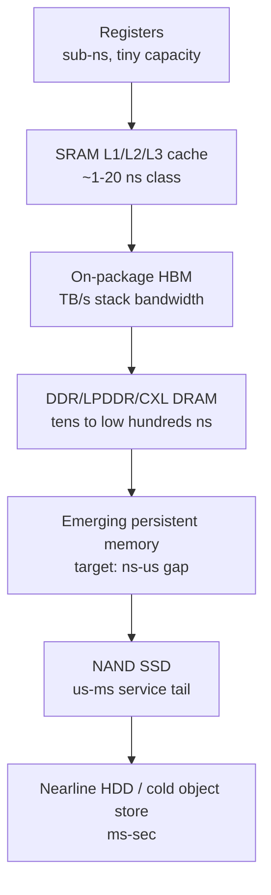
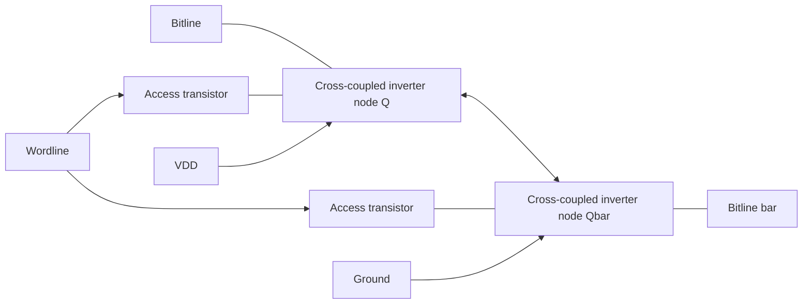
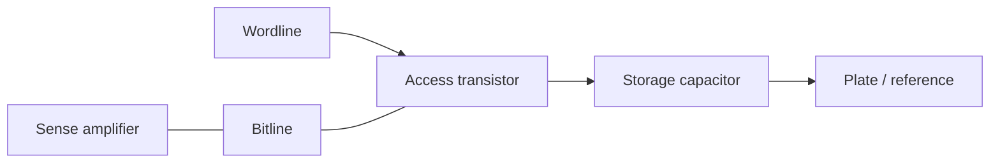
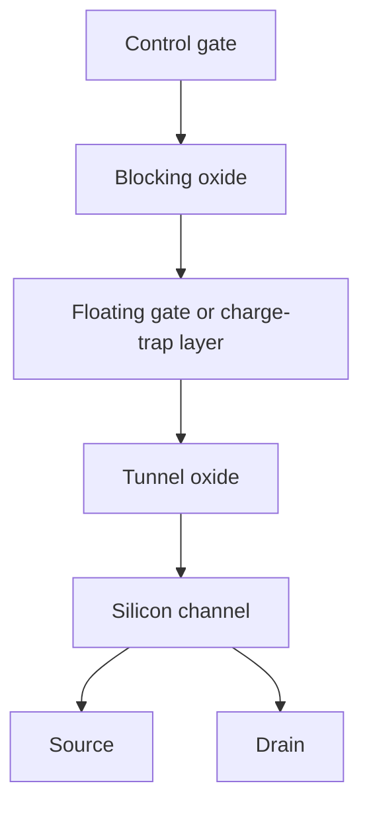
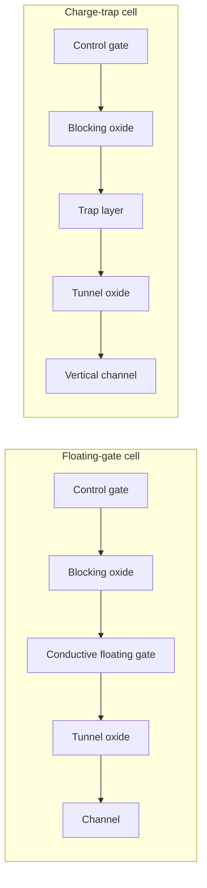

# Memory Storage Fundamentals

This file defines the physical and architectural vocabulary used by the rest of the database. The emphasis is not a textbook recitation of "volatile versus non-volatile" memory, but the investable consequences of each storage mechanism: die area, refresh burden, endurance, bandwidth density, packaging leverage, and where the technology can or cannot move the system bottleneck.

## Executive Map

Modern semiconductor memory is a hierarchy of increasingly cheap, slow, and persistent media. At the top, SRAM is built from cross-coupled inverters and wins on access time but loses on cell area. Commodity DRAM stores charge in a capacitor and wins on density among byte-addressable volatile memory, but pays refresh and sensing penalties. NAND flash stores charge or threshold-state shifts in strings of transistors and wins on cost per bit, but exposes block erase, limited endurance, and controller-managed latency. NOR flash keeps random-read semantics for code storage, while emerging memories such as MRAM, ReRAM, PCM, and ferroelectric variants try to buy non-volatility without NAND's block-management burden. The hierarchy has become more strategic since 2024 because AI servers simultaneously demand HBM-class bandwidth, DDR-class capacity, and SSD-class storage scale, forcing suppliers to decide which wafers and packages deserve scarce process capacity.[^S002][^S003][^S004][^S009]

## Cell-Level Taxonomy

### SRAM

Static RAM stores a bit as the stable state of a latch, usually represented as a six-transistor cell in mainstream CMOS cache arrays. The key economic fact is that the bit is retained as long as power is applied, without a refresh cycle, but the six-device cell consumes far more silicon area than a one-transistor DRAM cell. That is why SRAM appears as CPU register files, L1/L2/L3 cache, tag arrays, FIFOs, and embedded buffers, not as terabyte-scale server memory. The "static" label should not be confused with persistence: SRAM is volatile and normally loses state when supply rails collapse.[^S017]

SRAM matters to memory technology strategy because it is the latency anchor. When a workload misses SRAM cache and walks to DRAM, CXL-attached memory, or NAND-backed storage, the system is no longer compute-bound in the narrow arithmetic sense. That basic pressure explains why AI accelerator vendors spend die area on large SRAM scratchpads while also buying HBM stacks: SRAM gives deterministic local reuse, and HBM gives enormous external bandwidth density. Later HBM and accelerator files should cross-link here rather than re-explaining the cache hierarchy.

### DRAM

Dynamic RAM stores a bit as charge on a capacitor controlled by an access transistor: the canonical 1T1C cell. Reads are destructive in the practical circuit sense because the act of sharing charge between the storage node and the bitline perturbs the cell; the sense amplifier restores the state after resolving it. DRAM therefore couples density to analog circuit discipline: capacitor capacitance, leakage, sense margin, refresh scheduling, row activation limits, and disturbance mitigation all become part of product value.[^S016]

DDR and LPDDR families wrap that cell array in increasingly wide, power-managed, banked interfaces. DDR5's public specification history is important here because the architecture pushed the industry toward more subchannels, on-module power management, larger practical DIMM capacities, and higher transfer rates than DDR4; public summaries of DDR5 list JEDEC release in July 2020 and common transfer-rate ranges from 4.0 GT/s through 8.8 GT/s in standardized bins.[^S016] LPDDR6, published as JESD209-6 in July 2025, moves mobile and edge-AI memory toward 10,667 to 14,400 MT/s data rates and a four-subchannel organization described in contemporary reporting as four 24-bit subchannels.[^S001]

The investment consequence is that DRAM is no longer a single commodity axis. HBM uses DRAM dies but sells bandwidth per package and per watt; DDR sells system capacity through DIMMs; LPDDR sells board-level power and form-factor efficiency; CXL memory modules sell pooled capacity and composability. A wafer converted from DDR-oriented output to HBM-oriented output is not merely a mix shift: HBM stacks require known-good-die selection, TSV-enabled die, base logic, advanced packaging, and longer customer qualification. That conversion helps explain why commodity DRAM supply tightened when AI customers absorbed supplier focus and why retail DDR5 spot prices became unusually volatile in late 2025.[^S009]

### NAND Flash

NAND flash stores data by shifting the threshold voltage of a floating-gate or charge-trap cell and arranging cells in serial strings. The serial structure minimizes cell area and maximizes density, but it turns raw media into a managed storage substrate rather than byte-addressable memory. Reads are page-oriented, writes are programmed into pages, erases occur at block granularity, and every serious product depends on an SSD controller or embedded flash translation layer for wear leveling, bad-block management, garbage collection, read-retry handling, and error correction.

The planar-to-3D transition shifted the scaling vector from lithographic shrink to vertical layer count and string engineering. Publicly reported Kioxia planning in 2026 makes the historical pivot visible: Kioxia notified customers that legacy 2D NAND and early BiCS3 products would be discontinued, with last-time-buy orders by September 30, 2026 and final shipments scheduled for December 31, 2028.[^S006] Current 3D NAND competition is now expressed in layer count, bonding architecture, per-die density, NAND interface speed, and the ability to serve enterprise AI storage without starving client drives. Kioxia and SanDisk's BiCS9 samples, reported in July 2025, use CMOS Directly Bonded to Array and Toggle DDR 6.0 signaling, with reported speeds up to 4.8 Gb/s under controlled testing and a bridge role between BiCS8 and later BiCS10 generations.[^S005] Micron's July 2025 data-center SSD announcement tied its 9650 SSD to G9 276-layer 3D TLC NAND, a PCIe 6.0 x4 host interface, up to 28,000 MB/s sequential reads, and up to 5.5 million random read IOPS.[^S004]

NAND is the hierarchy's capacity engine, but it is not free capacity. Enterprise SSD pricing became unstable in 2025-2026 as AI storage demand collided with constrained high-capacity NAND supply. One January 2026 market report cited a 257% rise for 30 TB TLC enterprise SSD pricing between Q2 2025 and Q1 2026 and said SSD capacity cost had moved from 6.2 times to 16.4 times HDD capacity cost in that comparison.[^S007] A later April 2026 update from the same pricing-index context revised the 30 TB TLC drive figure more sharply, reporting Q1 2026 pricing around $17,500 versus roughly $3,000 a year earlier and a QLC-to-HDD ratio of 22.6 times.[^S008] The conflict is itself useful: database entries should preserve both the January and April estimates rather than pretend a single clean price exists.

### NOR Flash

NOR flash also stores charge in transistor threshold states, but its array topology supports fast random reads and execute-in-place behavior. That makes NOR structurally valuable for boot ROM, firmware storage, automotive code, industrial controllers, and embedded microcontrollers, even though it loses the density and cost-per-bit race to NAND. In this database, NOR should be treated as a control-plane memory rather than a hyperscale capacity memory. Its strategic role shows up indirectly in export-control, automotive reliability, and embedded-memory discussions, not in HBM or datacenter SSD capacity modeling.[^S018]

### Emerging Non-Volatile Memories

Emerging memory is best understood as a set of attempts to occupy the gap between DRAM's byte-addressability and NAND's persistence economics. MRAM stores information in magnetic tunnel junctions; ReRAM uses resistance change, often via conductive filament formation or rupture; PCM changes the phase of chalcogenide material; ferroelectric memories use switchable polarization; and FRAM variants exploit ferroelectric polarization in capacitor-like structures. The technical promise is persistent, low-latency memory with better endurance than NAND and simpler system semantics than block storage. The commercial problem is that each technology must beat an incumbent on more than one dimension at once: cell size, endurance, retention, write energy, selector integration, CMOS compatibility, test cost, and ecosystem support.

Recent research illustrates the direction but also the gap to broad replacement. A July 2024 arXiv paper on STT-RAM-based hierarchical in-memory computing explored STT-RAM in both processing-in-memory and processing-in-cache roles, explicitly discussing the tradeoff between non-volatility, leakage reduction, density, write latency, and energy overheads.[^S014] A December 2025 ferroelectric NAND perspective argued that charge-trap 3D NAND faces reliability, power, and vertical scaling limits, and proposed hybrid ferroelectric-charge-trapping architectures as a path toward low-voltage operation and layer scaling beyond 1,000 layers.[^S013] A 2025 paper on microsecond-latency memory for key-value stores frames the same commercial gap from the software side: media with microsecond latency could offload DRAM-resident indices and caches only if the application and storage engine can absorb the latency increase without destroying throughput.[^S015]

## Memory Hierarchy With Practical Order-of-Magnitude Metrics

The following table is an analytical hierarchy for architecture and investment work, not a universal product specification. Bandwidth, latency, and cost depend heavily on workload, channel count, controller, package, procurement date, and negotiated contract. The current cycle makes cost especially unstable, so ranges should be treated as update candidates in the market-size and supply-demand files.

| Tier | Primary technology | Typical architectural role | Latency order | Bandwidth order | Cost / GB direction |
|---|---|---|---:|---:|---|
| Registers | Flip-flops / SRAM-like circuits | Current instruction operands | sub-ns | core-local | effectively highest |
| L1-L3 cache | SRAM | Reuse buffer for hot data | ~1-20 ns class | per-core to shared-cache scale | very high |
| On-package HBM | Stacked DRAM with TSVs and base die | Accelerator bandwidth pool | tens to low hundreds ns system-visible | TB/s per stack generation | high, capacity constrained |
| DDR / LPDDR DRAM | 1T1C DRAM arrays | Main memory capacity | tens to low hundreds ns | tens to hundreds GB/s per socket/device config | medium, rising in shortage |
| CXL / pooled memory | DRAM behind coherent fabric | Expandable or pooled memory tier | higher than local DDR | fabric and module limited | medium to high |
| Persistent memory gap | MRAM/ReRAM/PCM/Fe variants | Niche persistence, embedded NVM, research tiers | ns-us target range | product specific | uncertain |
| NAND SSD | 3D NAND plus controller | Block storage, cache spill, model/checkpoint storage | us-ms tail | GB/s to tens GB/s per drive | low versus DRAM, but volatile in 2026 |
| HDD / cold tier | Magnetic recording | Bulk and cold storage | ms-sec | hundreds MB/s per drive | lowest |

Publicly reported examples anchor the orders of magnitude. A memory-hierarchy reference using a 2020s system example lists L1 data-cache latency around 1 ns, L2 around 3.5 ns, L3 around 11.75 ns, DDR5 main memory around 82.5 ns, an NVMe SSD example around 0.2 ms, and an enterprise HDD example around 4.16 ms.[^S017] At the high end of current SSD products, Micron's July 2025 9650 announcement points to 28 GB/s sequential reads for a PCIe 6.0 x4 SSD, while Silicon Motion's May 2026 SM2524XT controller announcement shows mainstream controller ambitions reaching up to 14 GB/s reads with a four-channel, PCIe 5.0 x4 DRAMless design.[^S004][^S010] HBM4 reporting gives the opposite axis: a standard stack with a 2,048-bit interface and up to 8 Gb/s per pin implies up to 2 TB/s per stack in JEDEC HBM4 coverage, while SK hynix claimed HBM4 development at 10 GT/s, 25% above that JEDEC rate, in September 2025 reporting.[^S002][^S003]

## Floating Gate Versus Charge Trap

The most important NAND device distinction for later process files is not SLC versus TLC, but where charge is stored. A floating-gate cell stores electrons on a conductive polysilicon island isolated by dielectrics. A charge-trap cell stores charge in localized traps, commonly associated with silicon-nitride layers in public descriptions of 3D NAND. Floating gate gives a historically proven device model; charge trap became attractive for vertical NAND because it avoids some scaling difficulties of fully isolated conductive floating gates in tall 3D strings.[^S018]

This distinction maps into semicap demand. Tall 3D NAND requires extremely deep, high-aspect-ratio etch through alternating stack films, high-quality deposition, channel formation, staircase contacts, string select structures, and increasingly wafer-bonding or CMOS-under-array/direct-bonded process modules. Controller sophistication also rises as cells store more bits. A 2024 arXiv paper on adaptive erase operation noted that NAND erase operations apply high voltage for long enough to affect endurance and tail latency, then proposed dynamically tuning erase latency based on observed fail bits; its evaluation used 160 real 3D NAND flash chips and reported 43% SSD lifetime improvement over a conventional erase scheme.[^S012] A 2026 arXiv paper on MCFlash examined commercial 3D NAND chips across floating-gate and charge-trap variants and reported error-free bulk bitwise operations on fresh blocks plus bit-error rates below 0.015% after 10,000 program/erase cycles in its tested method.[^S011]

## Volatility, Endurance, and Controller Burden

Volatility is a system contract, not just a device adjective. SRAM and DRAM are volatile, but SRAM has no refresh loop and DRAM does. NAND, NOR, MRAM, ReRAM, PCM, and FRAM are non-volatile in ordinary product framing, but their retention windows, endurance limits, and write disturbance mechanisms differ sharply. NAND's block nature forces a controller to hide media complexity. DRAM's refresh nature forces the memory controller and DRAM die to manage retention, row activation, and disturbance. SRAM's area cost forces architects to decide what data deserves the fastest local reuse. HBM's packaging cost forces accelerator vendors to decide how much bandwidth is worth dedicating to a package substrate and supply agreement.

Endurance is where simplistic comparisons fail. SLC NAND, enterprise TLC, consumer QLC, embedded NOR, STT-MRAM, and ReRAM cannot be ranked by a single endurance number without specifying process node, error-correction target, temperature, retention requirement, workload write amplification, and controller policy. The current database should therefore cite concrete product or paper numbers only when a source gives test conditions. Where sources conflict, the conflict should be preserved as a range. This rule already matters in 2026 SSD pricing and will matter even more in later HBM share, fab capacity, and process-node sections.[^S007][^S008]

## Why This Fundamentals Layer Matters For Semicap

Each memory class translates into a different equipment and materials stack. DRAM scaling pushes capacitor formation, high-k dielectrics, EUV/DUV patterning choices, bitline/contact resistance, and array peripheral scaling. NAND scaling pushes deposition and etch intensity as layer counts rise. HBM adds TSV formation, wafer thinning, microbump or hybrid-bond attach, underfill or molded underfill, temporary bonding, inspection, and known-good-die test. NOR and embedded NVM connect to mature-node capacity, automotive qualification, and specialty embedded processes. Emerging memories create optionality for deposition targets, magnetic materials, selectors, chalcogenides, ferroelectrics, and back-end-of-line integration.

The hierarchy also prevents a common modeling error: capacity bits and bandwidth bits are not interchangeable. One terabyte of NAND inventory cannot relieve an HBM allocation shortage, even if both are "memory," because the NAND bit is delivered through a block device, controller firmware, ECC pipeline, host protocol, and microsecond-to-millisecond service distribution, while the HBM bit is delivered through a wide on-package DRAM interface attached directly to an accelerator substrate. Likewise, a DDR5 DIMM can add system capacity but cannot reproduce the per-stack bandwidth density reported for HBM4, where public coverage of JEDEC HBM4 describes a 2,048-bit interface and up to 2 TB/s per stack.[^S002] This is why supplier capex has to be modeled by product conversion path, not just wafer starts. A NAND fab expansion helps SSD availability; an HBM packaging line helps accelerator attach; a DDR node migration helps server DIMM density. They may share corporate balance sheets and some upstream tools, but the customer bottlenecks clear through different physical assets.

This distinction becomes sharper when prices move. The 2026 SSD pricing reports cited above show that storage capacity can become expensive while still remaining far below DRAM or HBM on latency and bandwidth; the late-2025 DDR5 spot-price shock shows that commodity DRAM can become scarce even before a buyer reaches HBM-class packaging constraints.[^S007][^S008][^S009] Later market-share and supply-cycle files should therefore separate three ledgers: wafer capacity, advanced-packaging capacity, and customer-qualified output. The last ledger is often the tightest, because AI accelerator customers do not merely need a memory die. They need a validated stack, a thermally workable package, a tested interface, and a supply commitment aligned with their accelerator launch window.[^S003][^S004]

The unifying point is that "memory" is not one market. It is a set of physical storage mechanisms filtered through system-level bottlenecks. In 2016-2020, much of the investor discussion could still be compressed into DRAM cycle plus NAND cycle plus smartphone and server demand. By 2025-2026, the split is more granular: HBM capacity can be sold out while commodity DRAM customers face allocation; enterprise SSD pricing can spike while client storage elasticity weakens; NAND layer roadmaps can coexist with controller-latency work; and research memories can create valuable embedded niches without displacing DRAM or NAND at scale. The rest of this database is organized around those separations.

## Source Notes

[^S001]: JEDEC publishes first LPDDR6 standard, Tom's Hardware, published 2025-07-10, https://www.tomshardware.com/pc-components/dram/jedec-publishes-first-lpddr6-standard-new-interface-promises-double-the-effective-bandwidth-of-current-gen
[^S002]: Micron takes the HBM lead with fastest ever HBM4 memory with a 2.8TB/s bandwidth, TechRadar, published 2025-10-02, https://www.techradar.com/pro/micron-takes-the-hbm-lead-with-fastest-ever-hbm4-memory-with-a-2-8tb-s-bandwidth-putting-it-ahead-of-samsung-and-sk-hynix
[^S003]: SK hynix completes development of next-gen HBM4, Tom's Hardware, published 2025-09-12, https://www.tomshardware.com/pc-components/dram/sk-hynix-completes-development-of-hbm4-2-048-bit-interface-and-10-gt-s-speeds-promised
[^S004]: Micron's industry-first PCIe 6.0 SSD promises sequential reads up to 28,000 MB/s, Tom's Hardware, published 2025-07-30, https://www.tomshardware.com/pc-components/ssds/microns-industry-first-pci-6-0-ssd-promises-sequential-reads-up-to-28-000-mb-s-245-tb-ssd-also-coming-for-those-who-need-capacity-more-than-cutting-edge-speed
[^S005]: Kioxia and SanDisk start shipping BiCS9 3D NAND samples, Tom's Hardware, published 2025-07-27, https://www.tomshardware.com/pc-components/storage/kioxia-and-sandisk-start-shipping-bics9-3d-nand-samples-hybrid-design-combining-112-layer-bics5-with-modern-cba-and-ddr6-0-interface-for-higher-performance-and-cost-efficiency
[^S006]: Kioxia discontinues 2D NAND products, Tom's Hardware, published 2026-03-31, https://www.tomshardware.com/pc-components/ssds/kioxia-discontinues-2d-nand-products-last-shipments-to-be-made-in-2028-1980s-planar-nand-memory-reaches-end-of-life
[^S007]: SSDs now cost 16x more than HDDs due to AI supply chain crisis, Tom's Hardware, published 2026-01-22, https://www.tomshardware.com/pc-components/storage/ssds-now-cost-16x-more-than-hdds-due-to-ai-supply-chain-crisis
[^S008]: Vdura hikes its enterprise SSD pricing, Tom's Hardware, published 2026-04-10, https://www.tomshardware.com/pc-components/ssds/vdura-sharply-revises-its-enterprise-ssd-pricing-figures
[^S009]: The RAM pricing crisis has only just started, Tom's Hardware, published 2025-12-01, https://www.tomshardware.com/pc-components/dram/the-ram-pricing-crisis-has-only-just-started-team-group-gm-warns-says-problem-will-get-worse-in-2026-as-dram-and-nand-prices-double-in-one-month
[^S010]: New Silicon Motion SM2524XT chip brings 14 GB/s to mainstream SSDs, Tom's Hardware, published 2026-05-29, https://www.tomshardware.com/pc-components/ssds/new-silicon-motion-sm2524xt-chip-brings-14-gb-s-to-mainstream-ssds-6nm-dramless-controller-boasts-heavy-ai-pc-optimization-and-slashes-kv-cache-latency
[^S011]: MCFlash: Bulk Bitwise Processing in 3D NAND with Dynamic Sensing and Multi-level Encoding, arXiv, published 2026-05-06, https://arxiv.org/abs/2605.05119
[^S012]: AERO: Adaptive Erase Operation for Improving Lifetime and Performance of Modern NAND Flash-Based SSDs, arXiv, published 2024-04-16, https://arxiv.org/abs/2404.10355
[^S013]: Vertical NAND in a Ferroelectric-driven Paradigm Shift, arXiv, published 2025-12-17, https://arxiv.org/abs/2512.15988
[^S014]: STT-RAM-based Hierarchical In-Memory Computing, arXiv, published 2024-07-29, https://arxiv.org/abs/2407.19637
[^S015]: Analysis and Evaluation of Using Microsecond-Latency Memory for In-Memory Indices and Caches in SSD-Based Key-Value Stores, arXiv, published 2025-10-14, https://arxiv.org/abs/2510.12280
[^S016]: DDR5 SDRAM overview, Wikipedia, crawled 2026-06, no stable page publish date listed, https://en.wikipedia.org/wiki/DDR5_SDRAM
[^S017]: Memory hierarchy overview, Wikipedia, crawled 2026-04, no stable page publish date listed, https://en.wikipedia.org/wiki/Memory_hierarchy
[^S018]: Flash memory overview, Wikipedia, crawled 2026-05, no stable page publish date listed, https://en.wikipedia.org/wiki/Flash_memory
