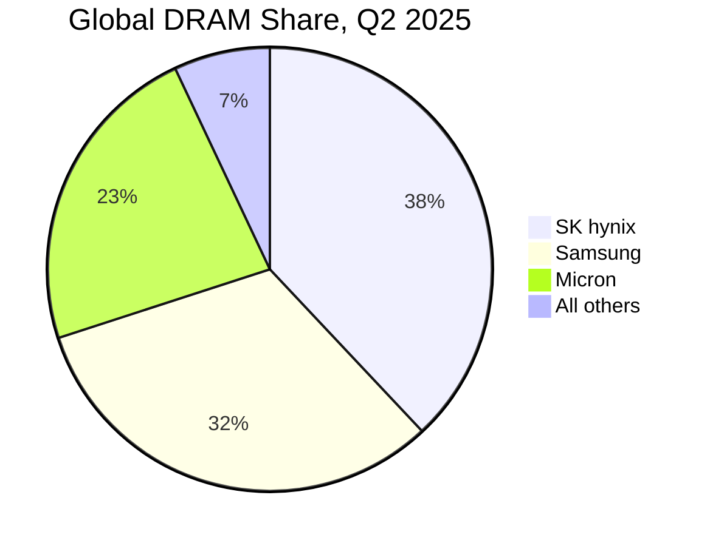
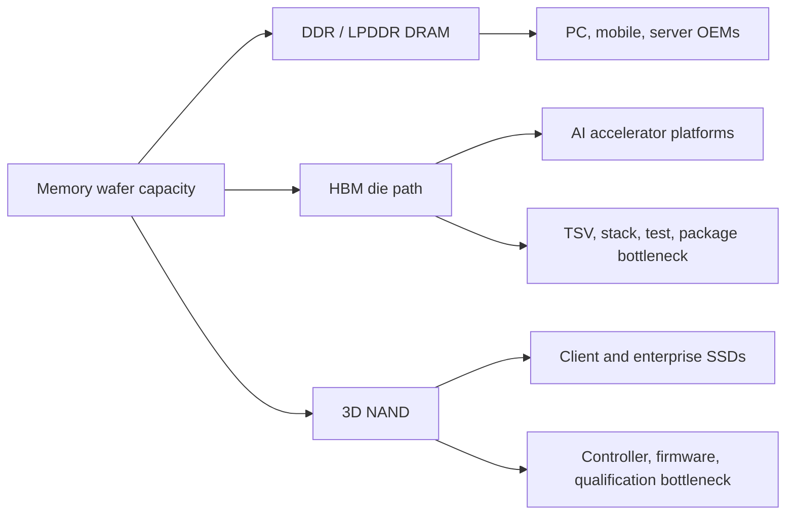
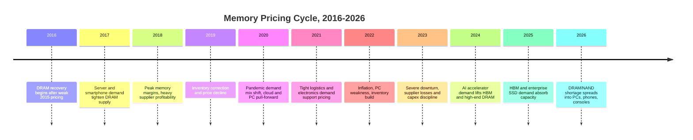

# Memory Market Size and Segmentation

Memory is again one of the semiconductor industry's swing factors, but the 2025-2026 cycle is not a replay of the old PC-and-smartphone DRAM cycle. The market is splitting into at least four ledgers: commodity DRAM bits, premium HBM stacks, NAND flash capacity, and controller-packaged storage systems. The distinction matters because each ledger clears through different bottlenecks. DRAM wafer capacity can be tight while NAND layer additions are still being qualified; HBM packaging can be sold out even when commodity DRAM bit growth continues; enterprise SSD pricing can rise because AI data-center buyers absorb high-capacity drives faster than NAND suppliers can allocate wafer, controller, and test capacity.[^S019][^S020][^S021][^S022]

## Top-Down TAM

The useful top-down anchor is the WSTS/SIA semiconductor market. SIA data summarized in February 2026 put 2025 global semiconductor revenue at $791.7 billion, up 25.6% from 2024, and projected 2026 global chip sales at roughly $1 trillion.[^S019] Within that 2025 total, logic was the largest product category at $301.9 billion, while memory products were the second-largest at $223.1 billion, up 34.8% year over year.[^S019] That $223.1 billion memory category is the broadest practical TAM for this database's market files, because it includes DRAM, NAND, HBM, and other memory products rather than only merchant memory from listed pure-plays.

The next current datapoint is the Q1 2026 acceleration. SIA/WSTS data summarized in May 2026 reported global semiconductor sales of $298.5 billion in Q1 2026, up 25% from Q4 2025, and March 2026 sales of $99.5 billion, up 79.2% year over year from March 2025.[^S020] The Q1 number includes logic, memory, analog, mixed-signal, and other chips, so it cannot be mechanically assigned to memory. Still, it frames the magnitude of the supercycle: if a single quarter is nearly $300 billion and the year is tracking near $1 trillion, memory suppliers are operating inside a much larger AI-infrastructure purchasing wave rather than a standalone component shortage.

For this database, the working TAM/SAM framework should be:

| Segment | 2025-2026 market anchor | Practical SAM for later files | Constraint to model |
|---|---:|---|---|
| All semiconductor sales | $791.7B in 2025; roughly $1T projected for 2026 | AI infrastructure, datacenter, PC, mobile, auto, industrial | Global capex, packaging, substrates, regional policy |
| All memory products | $223.1B in 2025, up 34.8% YoY | DRAM, HBM, NAND, NOR and specialty memory | Wafer starts plus mix conversion |
| DRAM excluding HBM | Big-three market, roughly 93% controlled by SK hynix, Samsung, Micron in Q2 2025 | DDR5, LPDDR, graphics DRAM, CXL memory | HBM cannibalization of standard DRAM output |
| HBM | Supplier share reported at SK hynix 61%, Micron 21%, Samsung 17% for 2025 | AI accelerator attach, custom HBM, base-die and package capacity | Known-good-die, TSV, stack assembly, customer qualification |
| NAND flash | Q1 2026 NAND revenue reported at $46B, more than 3x Q1 2025 | Enterprise SSD, client SSD, mobile storage, removable and embedded flash | High-layer NAND, controllers, enterprise SSD allocation |

The $46 billion Q1 2026 NAND datapoint is especially important because it shows how quickly the storage side of memory moved from cyclical recovery to scarcity pricing. PC Gamer, citing Counterpoint Research, reported on June 3, 2026 that NAND flash suppliers generated $46 billion in Q1 2026 revenue, more than three times the year-earlier quarter, and that enterprise-grade SSDs represented 40% of the NAND market with a forecast to exceed 60% by year-end 2026.[^S022] That implies the NAND SAM relevant to AI datacenters is no longer just raw flash bits. It includes enterprise firmware, high-capacity drive qualification, host-interface bandwidth, power envelopes, and contract allocation.

## Vendor Revenue and Share

The memory revenue pool is concentrated. The Verge, citing Counterpoint Research, reported on December 9, 2025 that Samsung, SK hynix, and Micron controlled 93% of the global DRAM market in Q2 2025, with SK hynix at 38%, Samsung at 32%, and Micron at 23%; it also stated that no other DRAM company exceeded 5% share.[^S021] For a market database, that concentration means DRAM pricing, mix, and capital discipline can be analyzed through three companies plus China substitution risk rather than a long tail of equivalent suppliers.

HBM is even more concentrated because it requires not only advanced DRAM process output but TSV-enabled die, stack assembly, thermal and mechanical qualification, and accelerator-specific validation. Tom's Hardware reported on June 23, 2026 that SK hynix held 61% of the global HBM market in 2025, compared with Micron at 21% and Samsung at 17%.[^S023] Those shares explain why a nominally smaller company can command disproportionate investor attention: HBM has higher margins, stickier customer attachment, and a tighter package-capacity constraint than commodity DRAM.[^S023]

NAND share is broader but still oligopolistic. Public summaries for Q3 2025 put Samsung around 30%, SK hynix around 20%, Kioxia around 14%, Micron around 13%, YMTC around 13%, and Western Digital around 11%.[^S018] Counterpoint-based NAND coverage in June 2026 added that YMTC had moved from 8% in Q1 2025 to 13% in Q1 2026, putting it level with SanDisk and Micron in that article's framing.[^S022] Because those figures are from different snapshots and source treatments, later market-share tracker files should preserve the time labels rather than flatten them into a single "current share" table.

## Segment Economics By Product Type

DRAM should be split into commodity server DDR5, mobile LPDDR, graphics DRAM, legacy DDR3/DDR4, CXL-oriented capacity modules, and HBM. The same bit output can generate radically different revenue depending on interface, validation status, and customer priority. A standard DDR5 wafer path monetizes through module vendors, OEM purchasing, and cloud server qualification; an HBM wafer path monetizes through accelerator platforms and locks into a GPU or ASIC ramp. That is why the 93% big-three DRAM concentration number is necessary but incomplete. A supplier can lose conventional share in one quarter and still improve margin if HBM mix rises.[^S021][^S023]

HBM should be modeled as a product family whose SAM is the attach opportunity around AI accelerators rather than the full DRAM market. Public 2025 share data show SK hynix at 61%, Micron at 21%, and Samsung at 17%.[^S023] The more interesting forward variable is not simply whether those shares change, but whether HBM4/HBM4E qualification shifts the customer allocation matrix. A supplier that wins a next-generation accelerator socket captures DRAM die pull-through, base-die participation, package test volume, and long-dated supply visibility. A supplier that misses a socket may still sell commodity DRAM, but it gives up the tightest-margin pool.

NAND economics have a different ladder. Client SSDs, smartphone UFS, removable flash, enterprise TLC SSDs, high-capacity QLC drives, and cold-storage SSDs use overlapping NAND supply but different controller and reliability envelopes. The June 2026 Counterpoint-based report that enterprise SSDs were already 40% of the NAND market and forecast to pass 60% by year-end 2026 signals a mix migration, not just more bits.[^S022] That mix migration changes semicap sensitivity: enterprise SSD shortages reward high-layer NAND, advanced test, controller supply, packaging throughput, and firmware qualification, while low-end retail drives are more exposed to elasticity.

## Scenario Framework For 2026-2028

The base case is tight supply through late 2027 with selective easing by product type. This is consistent with The Verge's December 2025 report that SK hynix expected the shortage through late 2027 and Lenovo's June 2026 ISC message that even new capacity beginning around 2028 may be absorbed by AI infrastructure.[^S021][^S026] In this scenario, HBM remains allocation-driven, server DDR5 remains expensive, enterprise SSDs stay prioritized over client drives, and consumer devices either absorb higher BOMs or reduce memory/storage configurations.

The upside case for buyers would require three things at once: faster-than-expected HBM yield improvement, meaningful new DRAM wafer capacity not immediately absorbed by AI customers, and NAND enterprise SSD demand normalizing before QLC/high-layer supply tightens further. None of those is impossible, but each has a lag. HBM qualification follows customer platform timing; DRAM fab additions take years; and NAND layer transitions do not instantly become qualified high-capacity enterprise drives. Therefore, the buyer-friendly case should be modeled as gradual relief rather than a sudden price collapse.

The upside case for suppliers is more straightforward: AI infrastructure spending stays high, HBM attach per accelerator rises, enterprise SSD capacity per rack increases, and PC/mobile elasticity absorbs a smaller but still profitable portion of supply. The March 2026 Gartner-based PC report already showed how memory inflation can reshape downstream device mix, with projected 2026 PC shipments down 10.4%, combined DRAM and SSD prices up 130% by year-end, PC prices up 17%, and smartphone prices up 13% versus 2025.[^S024] That is painful for OEM unit growth but supportive for memory supplier revenue as long as AI buyers remain the marginal price setters.

## Pricing Cycle History, 2016-2026

The current shortage sits on top of an unusually violent ten-year cycle. The simplified memory cycle is: demand surprise, supplier pricing power, capex response, bit-output growth, inventory correction, then another demand surprise. What changed in 2025-2026 is that AI demand hits both the bandwidth ledger and the capacity ledger, while supplier caution after the 2023 downturn slows the classic capex response.

The 2017-2018 upcycle was a classic server-plus-smartphone DRAM profit cycle; the 2019 decline was a classic inventory correction. The 2020-2021 period mixed cloud demand, consumer electronics pull-forward, and supply-chain disruption. The 2022-2023 downturn then forced the suppliers to cut output, slow capex, and rebuild profitability discipline. That 2023 scar is essential context: when 2025 AI demand arrived, suppliers did not immediately race to add commodity capacity. They redirected scarce wafers and engineering attention toward HBM, high-capacity server DIMMs, and enterprise SSDs.[^S021][^S026]

By late 2025, that redirection had moved into retail and OEM pricing. The Verge reported that PC builders were seeing DRAM prices double, triple, or quadruple, citing examples where a 2x16GB G.Skill DDR5-6000 kit rose from $124.99 in September 2025 to $389.99 and a comparable Corsair kit rose from $134.99 in September 2025 to $427.99 in December 2025.[^S021] PC Gamer's March 2, 2026 coverage of Gartner's device outlook said Gartner expected combined DRAM and SSD prices to rise 130% by the end of 2026, lifting PC prices by 17% and smartphone prices by 13% versus 2025 levels; the same report said PC memory cost could peak at 23% of bill of materials, up from 16% in 2025.[^S024]

The legal environment also reflects the price shock, but it should be treated carefully. Tom's Hardware reported on June 29, 2026 that a class-action suit filed on June 25, 2026 accused Samsung, SK hynix, and Micron of coordinating to restrict DRAM supply and inflate prices, alleging roughly a 700% price rise over four years; the article also noted that a similar 2018 class action had been dismissed in 2020 and upheld by the Ninth Circuit in 2022.[^S025] The database should cite the lawsuit as an allegation and market signal, not as proof of collusion.

## Current Shortage and 2027-2028 Outlook

The central shortage mechanism is product mix. HBM consumes far more scarce DRAM manufacturing and packaging resources than commodity DRAM, and AI server customers receive priority because they sign large, strategic supply agreements. The Verge reported that HBM wafer capacity can consume roughly three times the wafer capacity of standard DRAM according to NAND Research, and quoted Gartner/IDC-linked commentary that non-server customers may be treated as second priority.[^S021] Tom's Hardware's June 2026 SK hynix valuation coverage similarly noted that capacity being poured into HBM is not going into commodity memory, while SK hynix and Samsung had warned that shortages could run past 2027.[^S023]

The shortage also has a NAND leg. The Q1 2026 NAND revenue surge to $46 billion, enterprise SSDs at 40% of NAND market value, and forecast to exceed 60% by year-end 2026 all point to AI storage absorbing the richer part of NAND output.[^S022] That does not mean every NAND die is equally constrained. Client SSD, smartphone storage, enterprise SSD, and ultra-high-capacity QLC drives have different controller, endurance, qualification, and firmware requirements. But the revenue pool moves toward enterprise buyers, and those buyers can tolerate prices that would freeze consumer elasticity.

The medium-term outlook is not immediate relief. Tom's Hardware reported on June 28, 2026 that Lenovo told the ISC 2026 audience the memory shortage had become the "new normal" and that even major capacity additions beginning around 2028 could be absorbed by AI infrastructure rather than forcing DRAM and NAND prices back to early-2025 lows.[^S026] The Verge likewise reported on December 9, 2025 that SK hynix expected the shortage to continue through late 2027.[^S021] A conservative model should therefore use 2027 as the first plausible easing window for selected product types, not as a broad normalization date.

## Implications for Database Modeling

The segmentation work for the rest of the database should follow five rules. First, treat HBM as premium DRAM plus packaging, not just another DRAM grade. Second, separate wafer starts from qualified output, because customer qualification can keep supply tight even after physical capacity is installed. Third, distinguish bit growth from revenue growth; Q1 2026 NAND revenue of $46 billion says as much about price and mix as about bits shipped.[^S022] Fourth, track market share by product and date, because SK hynix can lead HBM and Q2 2025 DRAM share while Samsung can still lead specific conventional DRAM or NAND snapshots. Fifth, preserve conflicting figures as ranges when sources define categories differently.

This last rule matters for "TAM" work. A WSTS memory number of $223.1 billion for 2025 is a semiconductor-product category; a $46 billion Q1 2026 NAND number is a quarterly supplier-revenue snapshot; a 93% DRAM big-three figure is a vendor-concentration statistic; and a 61% SK hynix HBM figure is a premium subsegment share.[^S019][^S021][^S022][^S023] They are all useful, but they do not belong in the same denominator without adjustment. Later files should use this chapter as the normalization layer before discussing vendor strategy, fab roadmaps, or semicap demand.

## Source Notes

[^S018]: Flash memory overview, Wikipedia, crawled 2026-05, no stable page publish date listed, https://en.wikipedia.org/wiki/Flash_memory
[^S019]: Semiconductor industry on track to hit $1 trillion in sales in 2026, SIA predicts, Tom's Hardware, published 2026-02-06, https://www.tomshardware.com/tech-industry/semiconductors/semiconductor-industry-on-track-to-hit-usd1-trillion-in-sales-in-2026-sia-predicts-bumper-forecast-follows-usd791-7-billion-haul-for-2025
[^S020]: Global semiconductor sales hit nearly $300 billion in Q1 2026, Tom's Hardware, published 2026-05-06, https://www.tomshardware.com/tech-industry/semiconductors/global-semiconductor-sales-hit-nearly-usd300-billion-in-q1-2026-chips-are-on-track-to-top-usd1-trillion-for-this-year-says-report
[^S021]: RAM is ruining everything, The Verge, published 2025-12-09, https://www.theverge.com/report/839506/ram-shortage-price-increases-pc-gaming-smartphones
[^S022]: NAND flash makers earned a record $46 billion in revenues over the first quarter of 2026, PC Gamer, published 2026-06-03, https://www.pcgamer.com/hardware/ssds/nand-flash-makers-earned-a-record-usd46-billion-in-revenues-over-the-first-quarter-of-2026-a-shocking-3-5-times-more-than-last-year/
[^S023]: SK hynix passes Samsung as South Korea's most valuable company, Tom's Hardware, published 2026-06-23, https://www.tomshardware.com/tech-industry/sk-hynix-passes-samsung-as-south-koreas-most-valuable-company-on-hbm-demand
[^S024]: Gartner predicts sub-$500 entry-level PC segment will disappear by 2028, PC Gamer, published 2026-03-02, https://www.pcgamer.com/hardware/gaming-pcs/top-analyst-firm-gartner-predicts-the-sub-usd500-entry-level-pc-segment-will-disappear-by-2028-along-with-worldwide-pc-shipment-decline-of-10-4-percent-in-2026/
[^S025]: Samsung, SK hynix, and Micron sued over alleged DRAM price fixing amid record memory costs, Tom's Hardware, published 2026-06-29, https://www.tomshardware.com/tech-industry/samsung-sk-hynix-and-micron-sued-over-alleged-dram-price-fixing-amid-record-memory-costs
[^S026]: Lenovo says the RAMageddon is the new normal, Tom's Hardware, published 2026-06-28, https://www.tomshardware.com/pc-components/ram/lenovo-says-the-ramageddon-is-the-new-normal-outlines-survival-guide-at-isc-2026-an-exec-said-it-will-never-be-like-it-was-last-year
