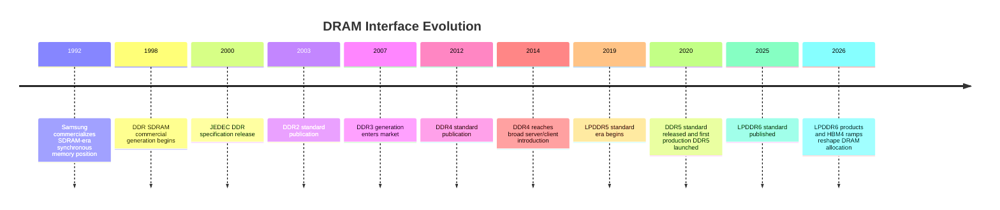
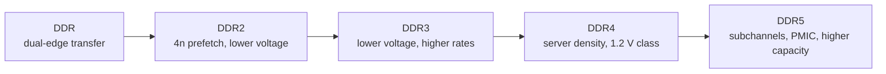
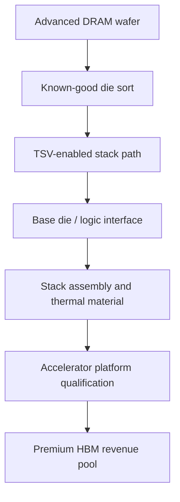

# DRAM Evolution: SDRAM to DDR5, LPDDR, HBM, and Node Naming

DRAM evolution is a story of interface standardization layered on top of increasingly difficult capacitor, transistor, and array-scaling work. The storage cell remains conceptually simple: one access transistor and one capacitor, with destructive reads restored by sense amplifiers, as described in the fundamentals chapter. The commercial history is less simple. From SDRAM to DDR5, vendors increased external bandwidth by clocking data more efficiently, widening internal parallelism, lowering I/O voltage, multiplying banks and subchannels, and pushing module-level signal integrity. In parallel, mobile DRAM branched into LPDDR, graphics DRAM branched into GDDR, and AI accelerators turned stacked DRAM into HBM, where package bandwidth became more valuable than commodity bit shipment.[^S016][^S027][^S030][^S034]

## SDRAM And The Pre-DDR Baseline

Synchronous DRAM aligned memory transfers with a system clock rather than relying on asynchronous control timing. That shift made DRAM more predictable for chipsets and memory controllers, and it created the platform on which DDR could double transfers without doubling the base clock. Samsung's corporate history records commercial SDRAM introduction in 1992 and later DDR SDRAM and GDDR SGRAM in 1998, making the 1990s the transition decade from asynchronous commodity DRAM to clocked, interface-defined product families.[^S037]

The basic economic move was that a DRAM vendor could no longer compete only on die cost per bit. It also had to supply an interface that CPU, chipset, motherboard, module, validation, and operating-system ecosystems could adopt. This is why JEDEC standards matter so much in DRAM. A nominally superior memory interface that lacks broad controller support becomes a niche product; a JEDEC interface with many suppliers and validated platforms becomes a volume market.

SDRAM's limits were visible once CPU clock rates and graphics workloads outpaced single-data-rate transfer. The answer was not a new storage cell. It was a better external data-transfer contract. DDR transferred data on both the rising and falling edges of the clock, doubling effective data rate at a given clock frequency. That is the core abstraction that links DDR, DDR2, DDR3, DDR4, DDR5, LPDDR variants, and GDDR variants, even though their electrical, package, power, and command protocols diverged heavily over time.[^S027]

## DDR1 Through DDR3: Bandwidth By Interface Discipline

DDR SDRAM emerged commercially in 1998, with the JEDEC DDR specification finalized in June 2000 as JESD79.[^S027] DDR's main architectural contribution was not a denser bit cell; it was dual-edge signaling and a standardized module ecosystem. The first-generation DDR era took the industry from PC133 SDRAM to DDR-200, DDR-266, DDR-333, and DDR-400 style modules, lifting peak bandwidth while staying within a conventional DIMM-and-chipset adoption path.[^S027]

DDR2, first published by JEDEC in September 2003, moved the prefetch architecture to 4n and reduced nominal voltage from DDR's roughly 2.5/2.6 V class to 1.8 V, while standard data rates ranged from DDR2-400 to DDR2-1066 in public summary tables.[^S028] The tradeoff was latency. Early DDR2 could look unimpressive against mature DDR in real workloads because absolute access latency did not fall just because transfer rate rose. This pattern repeated across later generations: headline bandwidth rises first, then controller scheduling, module design, and application behavior determine whether the system sees the gain.

DDR3 reached the market in 2007 and lowered nominal voltage again, commonly to 1.5 V and later 1.35 V low-voltage variants, while extending mainstream transfer rates beyond DDR2.[^S029] DDR3 also overlapped with the rise of integrated memory controllers in CPUs, which changed where DRAM timing intelligence lived. The memory controller became more tightly coupled to the processor, and platform qualification mattered more. DIMMs were no longer just commodity modules; they were validated elements in server, workstation, notebook, and consumer PC roadmaps.

The 2000s DDR path therefore changed DRAM competition in three ways. First, interface speed became a product-cycle lever distinct from process shrink. Second, power per transferred bit mattered more as notebooks, servers, and later mobile devices became central demand pools. Third, standards timing became strategic. A vendor with early working silicon could shape customer qualification, but a vendor shipping too far ahead of platform readiness could tie up inventory in a product the market could not yet absorb.

This standards lag is a recurring feature of DRAM adoption. A supplier can demonstrate a faster device before CPU memory controllers, BIOS firmware, server platforms, module makers, and OEM qualification plans are ready. Conversely, once platform support lands, lagging DRAM supply can hold back system shipments. DRAM history therefore has two clocks: the device-development clock inside the memory vendor and the platform-adoption clock across CPUs, chipsets, modules, and OEM systems. Investment analysis needs both.

## DDR4: Bank Parallelism, Lower Voltage, And Server Density

JEDEC announced DDR4 standard publication in September 2012, and DDR4 entered broad market use from 2014 onward.[^S029][^S030] DDR4 lowered nominal voltage to 1.2 V and expanded standardized data rates from DDR4-1600 through DDR4-3200 in the public JEDEC bins summarized by the DDR4 reference page.[^S030] The generation improved bandwidth and power efficiency, but its most investable significance was server density. DDR4 arrived as cloud infrastructure, virtualization, analytics, and in-memory databases were making main-memory capacity a datacenter purchasing variable rather than a PC bill-of-materials afterthought.

DDR4's mature period also exposed the legacy tail problem. Automotive, industrial, defense, and medical customers use platforms with long qualification cycles. They cannot instantly migrate to DDR5 because a new DRAM generation appears. By 2026, this created scarcity in older DRAM types because leading suppliers had shifted capacity toward DDR5, LPDDR5X/LPDDR6, and HBM. Tom's Hardware reported in June 2026 that Micron had begun producing 1-alpha DRAM at its Manassas, Virginia fab to expand DDR4-compatible output for automotive, defense, industrial, and medical customers; the same report said automotive DRAM prices were projected to rise 70-100% in 2026 and supply could severely diminish by 2028.[^S035]

That Manassas example is a clean illustration of why "old node" does not mean "unimportant." DDR4 may be technically behind DDR5, but the installed base can make it strategically scarce. Mature DRAM capacity is not fungible with leading-edge HBM allocation, and a qualified automotive DDR4 supply program can be valuable even when the leading narrative is AI memory.

## DDR5: Subchannels, PMICs, Capacity, And Signal Integrity

JEDEC released the DDR5 standard on July 14, 2020, and public summaries list standardized DDR5 transfer-rate bins from 4.0 GT/s to 8.8 GT/s, with module bandwidth from 32.0 GB/s to 70.4 GB/s depending on rate and bus assumptions.[^S016] DDR5 reduced nominal voltage to 1.1 V, moved more power management onto the module through PMICs, split the DIMM into two independent 32-bit subchannels, and expanded practical module-capacity ambitions compared with DDR4.[^S016]

The first production DDR5 DRAM chip was launched by SK hynix on October 6, 2020, after earlier SK hynix DDR5 development announcements in 2018 and 2019.[^S016] The timing matters because the DDR5 standard arrived before broad platform volume. Early DDR5 modules carried high prices, limited availability, and platform immaturity. The generation did not become the default PC/server memory overnight. It had to wait for CPU memory-controller support, motherboard routing, BIOS maturity, module supply, and cost crossover.

By 2024-2026, DDR5 had moved from new generation to contested allocation pool. The same wafer and process engineering talent that supports DDR5 also supports HBM and high-speed LPDDR families. When AI accelerator demand pulls suppliers toward HBM, the DDR5 market can tighten even if nominal DRAM bit capacity is rising. The market-size chapter already records late-2025 and 2026 price shocks; this history file's point is that DDR5 was technically designed for higher bandwidth and capacity, but commercially captured inside an AI-driven supply reallocation.[^S021][^S025]

DDR5 also changes who captures value around the module. On-module PMICs, serial presence detect extensions, clocking devices, register clock drivers, and stronger signal-integrity requirements make the module ecosystem more complex than a raw DRAM die table suggests.[^S016] That complexity matters for semicap and component suppliers because a server memory transition pulls not only wafer output, but validation sockets, PCB design, power-management components, test time, and inventory coordination. The move from DDR4 to DDR5 is therefore a platform transition, not just a faster bin.

## LPDDR: Mobile Power Becomes Datacenter-Relevant

LPDDR began as the mobile branch of DRAM, optimizing for low voltage, power states, package integration, and battery life. Over time, the boundary between mobile DRAM and server DRAM blurred. LPDDR packages entered notebooks, AI PCs, edge devices, and tightly integrated compute modules because bandwidth per watt became valuable outside smartphones.

LPDDR5 was standardized in 2019, and LPDDR5X extended the family in 2021, with public LPDDR references recording Samsung's 16 Gb 14 nm LPDDR5X announcement at 8,533 MT/s in November 2021.[^S039] LPDDR6 then became the 2025-2026 inflection. Tom's Hardware reported on July 10, 2025 that JEDEC published JESD209-6 for LPDDR6, with four 24-bit subchannels, dynamic voltage/frequency features, and data rates from 10,667 to 14,400 MT/s.[^S001] In March 2026, Tom's Hardware reported SK hynix's first LPDDR6 DRAM at more than 10.7 Gbps, 33% faster and 20% more power efficient than LPDDR5X, using a 10 nm-class 1c process.[^S034]

The strategic point is that LPDDR is no longer "phone memory only." AI servers and CPU-GPU superchips can use low-power DRAM forms where memory energy per token or per inference matters. LPDDR6's subchannel structure echoes DDR5's broader move toward more concurrency, but with a mobile-derived power discipline. That makes LPDDR a candidate for AI edge devices, compact accelerators, and specialized server modules, even while HBM owns the highest bandwidth tier.[^S034]

## GDDR And The Graphics Side Branch

Graphics DDR evolved for GPUs that needed high bandwidth without the cost and package complexity of HBM. Samsung commercially introduced GDDR SGRAM in 1998, GDDR6 mass production followed in 2018, and public GDDR6 summaries record Samsung's January 2018 production of 16 Gb chips with up to 18 Gbit/s per pin on a 10 nm-class process.[^S037][^S040] GDDR6 and GDDR6X later served graphics cards and some accelerators where board-level memory bandwidth was sufficient and HBM's silicon interposer or advanced package cost could not be justified.

GDDR's role in the DRAM tree is important because it shows that the industry repeatedly creates specialized interfaces when the workload can pay. Commodity DDR optimizes standardized socketed capacity. LPDDR optimizes power and integration. GDDR optimizes graphics bandwidth at board scale. HBM optimizes package bandwidth and energy efficiency at the highest accelerator tier. All are DRAM, but none is perfectly substitutable for another.

## HBM And The Return Of Packaging As Product Definition

HBM made DRAM evolution three-dimensional. Instead of only raising DIMM speeds or lowering voltage, HBM stacks DRAM dies, connects them with TSVs, and places the stack beside logic on an advanced package. Samsung's history records HBM2 introduction in 2016, and the market later moved through HBM2E, HBM3, HBM3E, and HBM4.[^S037]

In September 2025, SK hynix announced completion of HBM4 development, with public reporting citing a 2,048-bit interface, 10 GT/s speeds, a 12-high stack, use of its 1b-nm process, and Advanced MR-MUF packaging.[^S003] In October 2025, Micron discussed HBM4 samples with more than 2.8 TB/s bandwidth and pin speeds above 11 Gbps, tying its approach to 1-gamma DRAM, an in-house CMOS base die, and packaging innovation.[^S002] In 2026, Samsung HBM4 coverage described mass production and shipping using sixth-generation 10 nm-class DRAM and a 4 nm logic base die, with reported speeds of 11.7 Gbps and up to 3.3 TB/s per stack.[^S038]

The exact vendor claims differ, and later HBM files should reconcile them in detail. The high-level conclusion is stable: HBM turns DRAM from a module commodity into a co-packaged accelerator input. That changes margin, customer lock-in, test intensity, thermal design, and capital allocation. A wafer that becomes HBM is not just another DRAM wafer; it enters a stack, package, and customer platform qualification path.

## Node Naming By Vendor

DRAM node names are not equivalent to foundry logic node names. Public technical summaries describe "10 nm-class" DRAM as referring broadly to DRAM feature ranges rather than a direct foundry-node analogue; 1x, 1y, and 1z were commonly used for first, second, and third 10 nm-class generations, followed by Samsung D1a/D1b style naming and Micron 1-alpha/1-beta style naming.[^S041] This matters because investor presentations can make "1b," "1c," "1-gamma," or "D1a" sound directly comparable across suppliers when the actual density, EUV usage, capacitor integration, yield, and product mix differ.

| Vendor | Public node language used in recent DRAM discussion | Practical interpretation |
|---|---|---|
| Samsung | 1z, D1a, D1b, sixth-generation 10 nm-class for HBM4 coverage | DRAM-specific generation labels, not foundry-equivalent names |
| SK hynix | 1a, 1b, 1c; HBM4 coverage tied to 1b and LPDDR6 to 1c | Product-family-dependent deployment across HBM, LPDDR, DDR |
| Micron | 1-alpha, 1-beta, 1-gamma | Micron-specific sequence; 1-gamma linked to HBM4 sampling discussion |

Micron's Virginia 1-alpha DRAM ramp shows that older leading-edge generations can be redeployed for legacy-compatible products, while Micron's HBM4 commentary links 1-gamma to premium AI memory.[^S035][^S002] SK hynix's LPDDR6 report ties 1c to low-power DRAM in 2026, while its HBM4 report ties 1b to stacked AI memory.[^S034][^S003] The same vendor's node label therefore does not fully define the product. Interface, package, qualification, and customer matter as much as geometry.

## Roadmap Through The Late 2020s

The next DDR step is DDR6, but it is not yet the main commercial battlefield. SK hynix's 2025 AI Summit roadmap coverage projected DDR6 in the 2029-2030 window, MRDIMM Gen2 and CXL memory expanders between 2026 and 2028, LPDDR6-PIM in 2028, and 3D DRAM around 2030.[^S036] The same coverage described HBM generations moving in roughly 1.5- to 2-year cycles from HBM4 toward HBM5E.[^S036]

The roadmap implies three concurrent transitions. First, commodity server memory moves through DDR5 enhancements, MRDIMMs, CXL expansion, and eventually DDR6. Second, low-power memory migrates from LPDDR5X to LPDDR6 and possibly processing-in-memory variants. Third, accelerator memory moves through HBM4, HBM4E, HBM5, and custom base-die options. These paths share DRAM process technology but not the same commercial constraints.

The most important late-2020s uncertainty is whether these paths converge or stay segmented. CXL memory expansion can make DDR-based capacity more composable, but it does not replace HBM bandwidth. LPDDR6 can improve power and bandwidth in tightly integrated systems, but it does not deliver the same stack bandwidth as HBM4. DDR6 can improve socketed server memory, but it must wait for CPU platform support and module infrastructure. The DRAM market therefore becomes more like a portfolio of specialized interfaces than a single linear replacement chain.[^S036]

For supply modeling, that means "DDR6 arrives" is not a sufficient forecast. The correct questions are: which CPU platforms support it, what module form factors qualify, how much output remains on DDR5 for installed platforms, how much capacity is reserved for HBM, and whether CXL modules absorb DRAM bits that would otherwise become local DIMMs. The answer will vary by hyperscaler, OEM, and accelerator architecture.

## Investment Takeaways

DRAM evolution should be modeled as interface segmentation plus node migration plus package leverage. The storage cell matters, but the money is often made where the interface meets the system bottleneck. DDR5 monetizes server and client capacity. LPDDR monetizes bandwidth per watt. GDDR monetizes board-level graphics bandwidth. HBM monetizes package-level accelerator bandwidth. Legacy DDR3 and DDR4 monetize long-tail qualification when newer products cannibalize supplier attention.

The period from 1998 to 2026 shows a clear arc: DDR doubled data transfers, DDR2 and DDR3 reduced voltage and increased transfer rates, DDR4 scaled server capacity, DDR5 added subchannels and module power changes, LPDDR moved from phones into broader AI-adjacent roles, and HBM made advanced packaging central to DRAM economics.[^S027][^S028][^S030][^S016][^S001][^S003] The next history file, NAND evolution, should be read against this contrast. DRAM scaling is constrained by refresh, capacitors, and high-speed interfaces; NAND scaling is constrained by vertical layer integration, endurance, controllers, and block-management economics.

## Source Notes

[^S001]: JEDEC publishes first LPDDR6 standard, Tom's Hardware, published 2025-07-10, https://www.tomshardware.com/pc-components/dram/jedec-publishes-first-lpddr6-standard-new-interface-promises-double-the-effective-bandwidth-of-current-gen
[^S002]: Micron takes the HBM lead with fastest ever HBM4 memory with a 2.8TB/s bandwidth, TechRadar, published 2025-10-02, https://www.techradar.com/pro/micron-takes-the-hbm-lead-with-fastest-ever-hbm4-memory-with-a-2-8tb-s-bandwidth-putting-it-ahead-of-samsung-and-sk-hynix
[^S003]: SK hynix completes development of next-gen HBM4, Tom's Hardware, published 2025-09-12, https://www.tomshardware.com/pc-components/dram/sk-hynix-completes-development-of-hbm4-2-048-bit-interface-and-10-gt-s-speeds-promised
[^S016]: DDR5 SDRAM overview, Wikipedia, crawled 2026-06, no stable page publish date listed, https://en.wikipedia.org/wiki/DDR5_SDRAM
[^S021]: RAM is ruining everything, The Verge, published 2025-12-09, https://www.theverge.com/report/839506/ram-shortage-price-increases-pc-gaming-smartphones
[^S025]: Samsung, SK hynix, and Micron sued over alleged DRAM price fixing amid record memory costs, Tom's Hardware, published 2026-06-29, https://www.tomshardware.com/tech-industry/samsung-sk-hynix-and-micron-sued-over-alleged-dram-price-fixing-amid-record-memory-costs
[^S027]: DDR SDRAM overview, Wikipedia, crawled 2026-06, no stable page publish date listed, https://en.wikipedia.org/wiki/DDR_SDRAM
[^S028]: DDR2 SDRAM overview, Wikipedia, crawled 2026-06, no stable page publish date listed, https://en.wikipedia.org/wiki/DDR2_SDRAM
[^S029]: DDR3 SDRAM overview, Wikipedia, crawled 2026-06, no stable page publish date listed, https://en.wikipedia.org/wiki/DDR3_SDRAM
[^S030]: DDR4 SDRAM overview, Wikipedia, crawled 2026-05, no stable page publish date listed, https://en.wikipedia.org/wiki/DDR4_SDRAM
[^S034]: SK hynix introduces LPDDR6, Tom's Hardware, published 2026-03-28, https://www.tomshardware.com/pc-components/dram/sk-hynix-introduces-turbocharged-lpddr6-33-percent-faster-and-20-percent-more-power-efficient-than-lpddr5x-16gb-chips-deliver-10-7-gbps-uses-10nm-node
[^S035]: Micron's Virginia fab begins producing America's most advanced DRAM memory, Tom's Hardware, published 2026-06-07, https://www.tomshardware.com/tech-industry/micron-begins-producing-americas-most-advanced-dram-at-its-virginia-fab
[^S036]: SK hynix reveals DRAM development roadmap through 2031, Tom's Hardware, published 2025-11-01, https://www.tomshardware.com/pc-components/dram/sk-hynix-reveals-dram-development-roadmap-through-2031-ddr6-gddr8-lpddr6-and-3d-dram-incoming
[^S037]: Samsung Electronics overview, Wikipedia, crawled 2026-06, no stable page publish date listed, https://en.wikipedia.org/wiki/Samsung_Electronics
[^S038]: Samsung says it took the leap with HBM4, TechRadar, published 2026-02-13, https://www.techradar.com/pro/samsung-says-it-took-the-leap-with-hbm4-as-it-starts-shipping-faster-ai-memory-built-on-advanced-process-nodes
[^S039]: LPDDR overview, Wikipedia, crawled 2026-01, no stable page publish date listed, https://en.wikipedia.org/wiki/LPDDR
[^S040]: GDDR6 SDRAM overview, Wikipedia, crawled 2026-02, no stable page publish date listed, https://en.wikipedia.org/wiki/GDDR6_SDRAM
[^S041]: 10 nm process overview, Wikipedia, crawled 2026-02, no stable page publish date listed, https://en.wikipedia.org/wiki/10_nm_process
