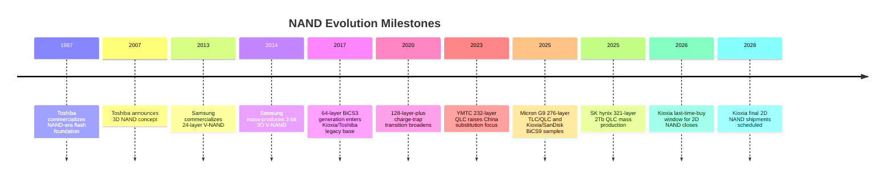
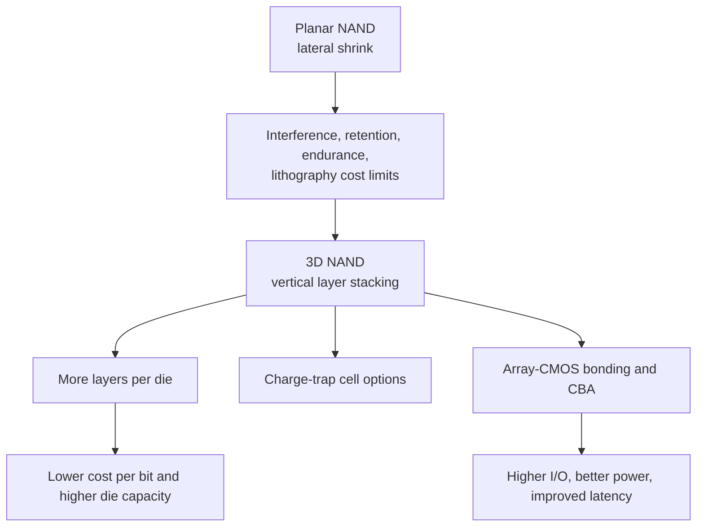
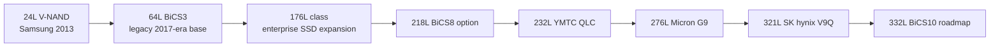
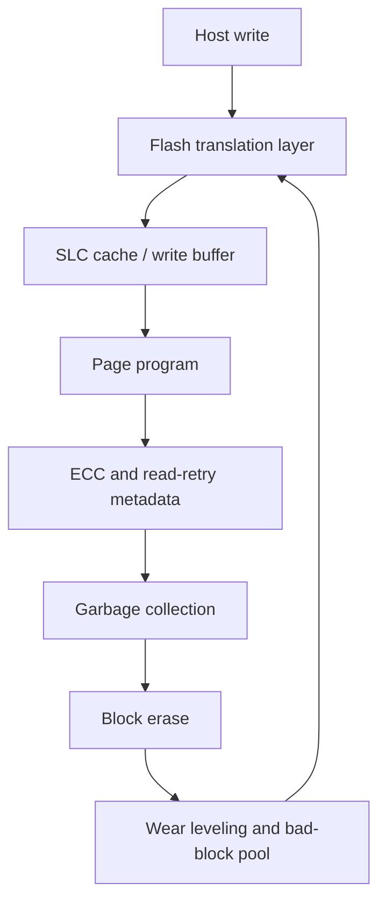

# NAND Evolution: Planar To 3D, SLC To PLC, And Layer-Count Scaling

NAND flash evolution is the opposite of DRAM evolution in one crucial respect. DRAM's story is dominated by volatile byte-addressable memory interfaces, while NAND's story is dominated by non-volatile density, block-management economics, controller sophistication, and vertical manufacturing intensity. The storage device that started as planar floating-gate arrays in the late 1980s became a vertically stacked, controller-managed, error-corrected storage substrate. By 2025-2026, NAND was no longer only a cheap SSD bit pool; AI datacenters were pulling enterprise SSDs, high-capacity QLC drives, PCIe 6.0 performance devices, and experimental high-bandwidth flash closer to the accelerator memory hierarchy.[^S004][^S005][^S006][^S022]

## Planar NAND And The Floating-Gate Era

Planar NAND placed floating-gate cells side by side on the wafer surface. It scaled through lithography, tighter cell pitch, improved tunnel oxide, better program/erase algorithms, and increasingly sophisticated ECC in the controller. The result was extraordinary cost-per-bit decline, but by the 1x nm planar era the geometry was boxed in: adjacent-cell interference rose, electron counts per state fell, endurance margins narrowed, and the cost of further lateral shrink became less attractive than adding vertical layers.

Kioxia's 2026 end-of-life notice makes the planar era unusually concrete. Tom's Hardware reported on March 31, 2026 that Kioxia would discontinue 2D NAND and 3rd-generation BiCS 3D NAND products, including 32 nm SLC that had been in production since 2009, 24 nm MLC since 2010, 15 nm MLC/TLC since 2014, and 64-layer BiCS3 from around 2017.[^S006] The same report said last-time-buy orders were accepted until September 30, 2026 and final shipments would continue through December 31, 2028.[^S006] That is not just a product cleanup. It is a 41-year industry handoff from planar NAND, traced in that report to Toshiba around 1987, to advanced 3D NAND.[^S006]

Planar NAND's remaining value is long-tail qualification. Automotive, industrial, embedded, removable, and legacy consumer designs can keep old flash alive long after leading-edge SSD vendors move on. But the economics become difficult when AI and enterprise SSD demand are pulling wafer and engineering resources toward high-layer 3D NAND. The 2028 Kioxia final-shipment date should therefore be treated as a historical marker: planar NAND is not technically irrelevant, but it is no longer the economic center of NAND manufacturing.[^S006]

## Why 3D NAND Won

3D NAND shifted the scaling axis from lateral shrink to vertical stacking. Public flash-memory summaries record Toshiba announcing 3D NAND in 2007 and Samsung commercializing a 24-layer V-NAND device in 2013.[^S018] Vertical NAND stacks memory cells vertically and commonly uses charge-trap storage, where charge is held in a silicon-nitride trap layer rather than a fully isolated conductive floating gate.[^S018] The key advantage is that cell density can rise through layer count without forcing every lateral feature to shrink at the same pace.

The manufacturing bottleneck changed with the architecture. Planar NAND depended heavily on lithographic shrink and cell-to-cell isolation. 3D NAND depends on deposition of many alternating layers, high-aspect-ratio channel-hole etch, staircase contacts, string architecture, channel fill, array uniformity, metrology, and sometimes bonding the CMOS peripheral logic to the memory array. This is why the semicap intensity of NAND shifted toward deposition and etch as the layer race accelerated.

The 3D transition also changed failure analysis. In planar NAND, the industry worried heavily about lateral neighbor interference and tiny floating-gate charge populations. In vertical NAND, the problem set includes string current distribution, vertical channel uniformity, trap distribution, layer-to-layer variation, wordline resistance, staircase-contact yield, and bonding alignment where array-CMOS integration is used. A poor etch profile can damage many vertical cells at once; a bonding or peripheral-CMOS issue can compromise an otherwise dense array. Layer count is therefore not just a density metric. It is a process-control metric.

3D NAND also changed the meaning of a "generation." A vendor can improve density by adding layers, by increasing bits per cell, by increasing planes and parallelism, by improving I/O interface speed, by separating array and CMOS fabrication, or by improving controllers and ECC. Kioxia/SanDisk BiCS9 illustrates the point because it is not simply a maximum-layer-count product. Tom's Hardware reported on July 27, 2025 that BiCS9 uses CMOS Directly Bonded to Array, can mix mature cell structures such as 112-layer BiCS5 or 218-layer BiCS8 with a modern I/O interface, and can reach Toggle DDR 6.0 speeds of 3.6 Gb/s with 4.8 Gb/s peak speeds under controlled testing.[^S005] The same report cited 61% better write performance, 12% better read speed, and 36%/27% write/read power-efficiency improvements versus earlier 512 GB TLC designs.[^S005]

## SLC To PLC: Density Versus Margin

NAND increased bit density not only by adding layers, but by storing more bits in each cell. The naming ladder is SLC, MLC, TLC, QLC, and PLC: one, two, three, four, and five bits per cell, respectively.[^S045] The physics tradeoff is simple and unforgiving. Each extra bit doubles the number of voltage states that must be distinguished. SLC needs two states; MLC needs four; TLC needs eight; QLC needs sixteen; PLC would need thirty-two. More states narrow the voltage margin, making program precision, read-retry algorithms, retention management, and ECC harder.

| Cell type | Bits per cell | Voltage states | Typical strategic role | Core tradeoff |
|---|---:|---:|---|---|
| SLC | 1 | 2 | Low latency, high endurance, cache, specialty SSDs | Highest cost per bit |
| MLC | 2 | 4 | Older enterprise/client SSDs | Better density, lower margin than SLC |
| TLC | 3 | 8 | Mainstream client and enterprise SSD base | Balanced density, endurance, and cost |
| QLC | 4 | 16 | Capacity SSDs, read-heavy datacenter storage | Lower write endurance and narrower margin |
| PLC | 5 | 32 | Development-stage density path | Very tight margins, controller burden |

The tradeoff does not make higher-bit cells bad. It makes them workload-specific. QLC can be excellent for read-heavy, high-capacity storage if the controller has enough spare area, wear leveling, ECC, caching, and thermal management. SLC can be valuable for low-latency or high-endurance niches even if it is expensive per bit. Kioxia's 2025 AI-SSD work points in that direction: Tom's Hardware reported on June 7, 2025 that Kioxia planned an SSD using SLC XL-Flash, targeting more than 10 million 512-byte IOPS and 3-5 microsecond read latency, versus 40-100 microseconds cited for conventional 3D NAND SSDs.[^S044] That is NAND being used closer to the memory hierarchy, not merely as cheap bulk storage.

PLC remains a density temptation but not a universal solution. A June 14, 2025 TechRadar report said Kioxia's forthcoming 332-layer BiCS10 chip would offer 2 Tb per die and that Kioxia was signaling larger SSD capacity without relying on PLC, using a dual-axis strategy of layer scaling plus Charge-Based Architecture performance improvements.[^S043] That does not prove PLC is commercially dead; it shows that at least one major NAND supplier sees alternative paths to capacity that avoid the reliability and controller burden of five bits per cell.

The SLC-to-PLC ladder also explains why SSD product labels can mislead. A "QLC SSD" can use SLC caching for burst writes; an enterprise TLC SSD can reserve significant spare area; and a controller can trade usable capacity for endurance, write amplification, or latency stability. Buyers experience a system product, not a raw cell. This is why the same QLC die can be acceptable in a read-heavy hyperscale drive and frustrating in a write-heavy workstation drive. The physical cell defines the margin envelope; the controller and workload decide whether that envelope is enough.

## Layer Count Growth And Vendor Strategies

Layer count is the headline metric because it is easy to compare, but it is not the whole product. Micron, SK hynix, Samsung, Kioxia/SanDisk, YMTC, and Solidigm can all expose different balances of layer count, die capacity, bits per cell, I/O speed, planes, bonding approach, endurance target, and SSD controller architecture.

Micron's 2025 G9 generation shows the high-performance side of the layer race. Tom's Hardware reported on July 30, 2025 that Micron's 9650 SSD used 9th-generation 276-layer 3D TLC NAND with a 3.6 GT/s interface, a PCIe 6.0 x4 host interface, up to 28,000 MB/s sequential reads, up to 14,000 MB/s sequential writes, and up to 5.5 million random-read IOPS.[^S004] The same report said Micron's 6600 ION capacity SSD used 276-layer G9 3D QLC NAND, with 30.72 TB, 61.44 TB, and 122.88 TB capacities initially and a 245 TB version scheduled for the first half of 2026.[^S004]

SK hynix's 321-layer V9Q generation shows the density side. Tom's Hardware reported on August 25, 2025 that SK hynix had begun mass production of 321-layer, 2 Tb 3D QLC NAND devices with a 3,200 MT/s I/O interface and six planes.[^S042] Compared with older V7Q devices from 2023, the report cited 56% higher write performance, 18% higher read performance, and 23% better write-operation efficiency.[^S042] The same article said SK hynix planned to use the devices first in client SSDs, while enterprise-grade SSDs, including a 244 TB design, would use 32DP packaging with 32 2 Tb devices in a package.[^S042]

Kioxia/SanDisk's 2025-2026 posture is different. BiCS9 emphasizes CBA, performance, power, and manufacturing bridge value rather than simply shouting the highest layer number.[^S005] BiCS10, according to the June 2025 roadmap coverage, is expected around 332 layers and 2 Tb per die.[^S043] That highlights a strategic fork: one vendor may use layer count and QLC die capacity aggressively; another may optimize bonded-CMOS architecture, interface speed, and SSD-class performance before pushing the next layer maximum.

YMTC's position matters because it is a China substitution case. Public YMTC summaries say TechInsights reported in October 2023 that YMTC shipped 232-layer 3D QLC NAND with a 19.8 Gbit/mm2 density figure, and that export-control pressure forced the company to adapt around restricted access to U.S.-designed chipmaking equipment.[^S046] Later China-vendor files should treat YMTC in much greater detail. For this history file, YMTC proves that 3D NAND layer progress is no longer confined to the Korea-Japan-U.S. supplier set, even if tool access and customer qualification remain limiting variables.

## Controllers, ECC, And The SSD Product Boundary

NAND die evolution cannot be separated from SSD controllers. Raw NAND is page-programmed, block-erased, error-prone media. Flash translation layers remap logical block addresses to physical pages, wear-level blocks, manage garbage collection, correct errors, track bad blocks, and schedule read-retry operations. The fundamentals chapter already notes that a 2024 arXiv AERO paper used 160 real 3D NAND chips and reported a 43% SSD lifetime improvement by adapting erase latency based on observed fail bits.[^S012] That kind of work matters because NAND scaling pushes more burden into controller policy.

As bits per cell and layers rise, product differentiation increasingly sits above the NAND die. A PCIe 6.0 enterprise drive such as Micron's 9650 is not valuable only because it uses 276-layer TLC; it is valuable because the NAND, in-house controller, firmware, thermal design, form factor, and PCIe fabric integration support AI server data paths.[^S004] A high-capacity QLC drive is not valuable only because the die stores four bits per cell; it is valuable if the controller can keep write amplification, endurance, and tail latency inside the customer's workload tolerance.

This is why NAND files should avoid treating layer count as destiny. Layer count is a necessary density lever, but product value emerges from the die-controller-system bundle. Enterprise buyers pay for qualified capacity, predictable latency, endurance, power, serviceability, and firmware behavior. Consumer buyers pay for capacity and benchmark performance until shortage pricing changes the elasticity. Embedded buyers pay for lifecycle assurance. The same NAND generation can therefore be economically different across client SSDs, enterprise SSDs, UFS packages, and specialty storage.

The product boundary is also moving because host interfaces keep rising. PCIe 5.0 SSDs made 14 GB/s-class sequential performance common at the high end; Micron's 2025 PCIe 6.0 9650 announcement pushed the enterprise performance envelope to 28 GB/s reads.[^S004] Once host bandwidth rises that far, the controller must supply parallelism across many NAND channels and dies while keeping power and thermals inside the form factor. NAND die I/O speed, plane count, controller ASIC design, retimers, switches, and cooling all enter the same product equation.

## Manufacturing Intensity And Semicap Demand

3D NAND is one of the clearest examples of memory density translating into equipment intensity. Each generation requires building taller stacks, maintaining layer uniformity, etching deeper vertical channels, and inspecting defects through structures that are no longer simple 2D patterns. The staircase contact module alone can be a major yield and process-control challenge because every layer needs electrical access. Bonded-array strategies add another integration layer: the array wafer and CMOS wafer can be optimized separately, but bonding alignment and post-bond yield become critical.

For semicap vendors, the NAND roadmap therefore drives demand in deposition, etch, cleaning, metrology, inspection, bonding, test, and advanced packaging. High-aspect-ratio etch is especially strategic because a single vertical hole can traverse hundreds of film pairs. As layer counts rise from 176 to 218 to 232 to 276 to 321 and toward 332, the value of etch precision, selectivity, profile control, and chamber productivity rises with it.[^S004][^S005][^S042][^S043] This is why a NAND downturn can hurt equipment orders sharply, but a new layer transition can also create powerful tool demand when suppliers resume capex.

The manufacturing view also explains why Kioxia's BiCS9 bridge strategy is economically rational. A transitional generation that reuses mature 112-layer or 218-layer structures with newer CBA and I/O can improve performance and cost without taking the full yield risk of an immediate maximum-layer jump.[^S005] In NAND, the fastest route to a profitable product is not always the tallest stack. Sometimes it is the stack that yields, bonds, tests, and qualifies fastest.

## From Storage To Near-Memory Flash

The late-2020s NAND roadmap is not only about bigger SSDs. AI systems are forcing flash closer to compute. Kioxia's August 2025 high-bandwidth flash prototype, reported with 5 TB capacity and 64 GB/s bandwidth over PCIe 6.0, shows the direction: NAND packaged with local controllers and high-speed links can serve streaming datasets nearer to accelerators, even though its latency remains far above HBM or DRAM.[^S047] The report framed HBF as offering 8-16 times the capacity of DRAM-based HBM and under-40 W power per module, with a 16-module set theoretically reaching 80 TB and more than 1 TB/s throughput.[^S047]

This does not turn NAND into DRAM. NAND read latency remains microsecond-class, write and erase behavior remain asymmetric, and persistence creates controller-management complexity. But it does expand NAND's market from passive storage to active memory hierarchy participant. AI training, retrieval-augmented generation, checkpointing, graph analytics, and recommendation workloads can value high-bandwidth persistent capacity even when it cannot replace HBM.

## Investment Takeaways

NAND evolution has three overlapping arcs. The first is architectural: planar floating-gate NAND gives way to vertical 3D NAND, with Kioxia's 2026-2028 EOL schedule marking the final commercial retreat of planar NAND.[^S006] The second is density: SLC to MLC to TLC to QLC and eventually PLC exploration increase capacity per cell while narrowing voltage margin and raising controller burden.[^S045] The third is system-level: NAND products move from raw flash and simple SSDs toward PCIe 6.0 performance drives, 245 TB-class capacity SSDs, SLC low-latency devices, and high-bandwidth flash modules for AI data paths.[^S004][^S044][^S047]

The semicap implication is direct. DRAM evolution pulls lithography, capacitor, interface, and advanced packaging demand; NAND evolution pulls deposition, high-aspect-ratio etch, bonding, metrology, inspection, and controller/test sophistication. More layers are not free layers. Every additional vertical stack increases process complexity, yield challenge, and tool intensity. That is why NAND can be a storage commodity at the buyer level while being a highly specialized manufacturing challenge at the fab level.

## Source Notes

[^S004]: Micron's industry-first PCIe 6.0 SSD promises sequential reads up to 28,000 MB/s, Tom's Hardware, published 2025-07-30, https://www.tomshardware.com/pc-components/ssds/microns-industry-first-pci-6-0-ssd-promises-sequential-reads-up-to-28-000-mb-s-245-tb-ssd-also-coming-for-those-who-need-capacity-more-than-cutting-edge-speed
[^S005]: Kioxia and SanDisk start shipping BiCS9 3D NAND samples, Tom's Hardware, published 2025-07-27, https://www.tomshardware.com/pc-components/storage/kioxia-and-sandisk-start-shipping-bics9-3d-nand-samples-hybrid-design-combining-112-layer-bics5-with-modern-cba-and-ddr6-0-interface-for-higher-performance-and-cost-efficiency
[^S006]: Kioxia discontinues 2D NAND products, Tom's Hardware, published 2026-03-31, https://www.tomshardware.com/pc-components/ssds/kioxia-discontinues-2d-nand-products-last-shipments-to-be-made-in-2028-1980s-planar-nand-memory-reaches-end-of-life
[^S012]: AERO: Adaptive Erase Operation for Improving Lifetime and Performance of Modern NAND Flash-Based SSDs, arXiv, published 2024-04-16, https://arxiv.org/abs/2404.10355
[^S018]: Flash memory overview, Wikipedia, crawled 2026-05, no stable page publish date listed, https://en.wikipedia.org/wiki/Flash_memory
[^S022]: NAND flash makers earned a record $46 billion in revenues over the first quarter of 2026, PC Gamer, published 2026-06-03, https://www.pcgamer.com/hardware/ssds/nand-flash-makers-earned-a-record-usd46-billion-in-revenues-over-the-first-quarter-of-2026-a-shocking-3-5-times-more-than-last-year/
[^S042]: SK hynix announces mass production of its 2Tb 3D QLC NAND, Tom's Hardware, published 2025-08-25, https://www.tomshardware.com/pc-components/ssds/sk-hynix-announces-mass-production-of-its-2tb-3d-qlc-nand-cheaper-high-capacity-consumer-drives-and-244tb-enterprise-ssds-incoming
[^S043]: Kioxia confirms its next-gen 332-layer NAND chip is only 2Tb, TechRadar, published 2025-06-14, https://www.techradar.com/pro/kioxia-confirms-its-next-gen-332-layer-nand-chip-is-only-2tb-but-hints-at-more-large-capacity-ssd-without-the-need-for-plc
[^S044]: Kioxia preps XL-Flash SSD that's 3x faster than any SSD available, Tom's Hardware, published 2025-06-07, https://www.tomshardware.com/pc-components/ssds/kioxia-works-with-nvidia-to-prep-xl-flash-ssd-thats-3x-faster-than-any-ssd-available-10-million-iops-drive-has-peer-to-peer-gpu-connectivity-for-ai-servers
[^S045]: Multi-level cell overview, Wikipedia, crawled 2026-04, no stable page publish date listed, https://en.wikipedia.org/wiki/Multi-level_cell
[^S046]: Yangtze Memory Technologies overview, Wikipedia, crawled 2026-03, no stable page publish date listed, https://en.wikipedia.org/wiki/Yangtze_Memory_Technologies
[^S047]: Kioxia's new 5TB, 64 GB/s flash module puts NAND toward the memory bus for AI GPUs, Tom's Hardware, published 2025-08-23, https://www.tomshardware.com/pc-components/gpus/kioxias-new-5tb-64-gb-s-flash-module-puts-nand-toward-the-memory-bus-for-ai-gpus-hbf-prototype-adopts-familiar-ssd-form-factor
