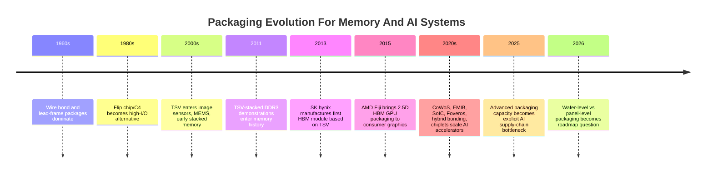
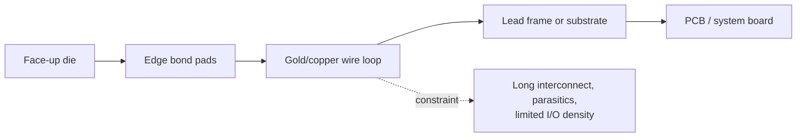
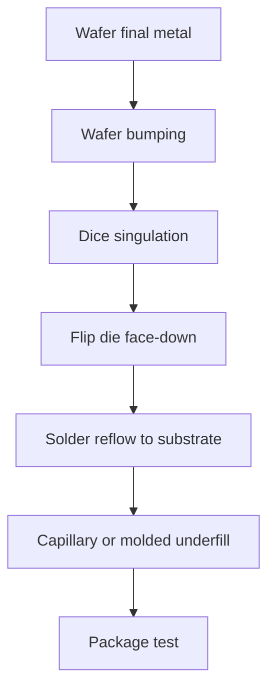
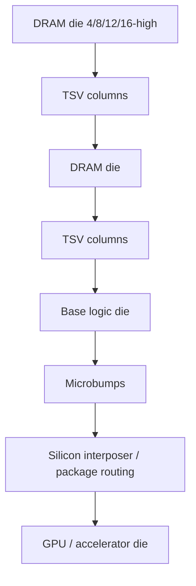
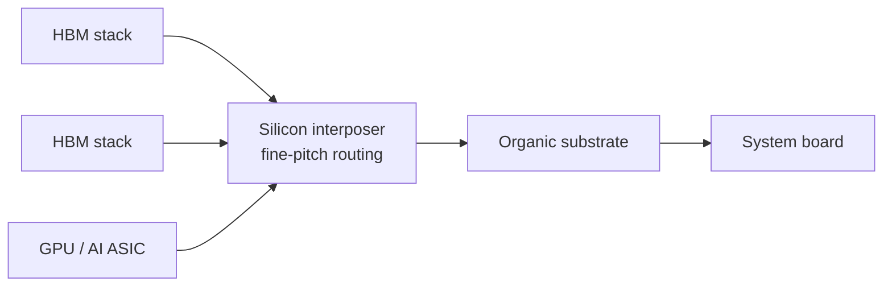
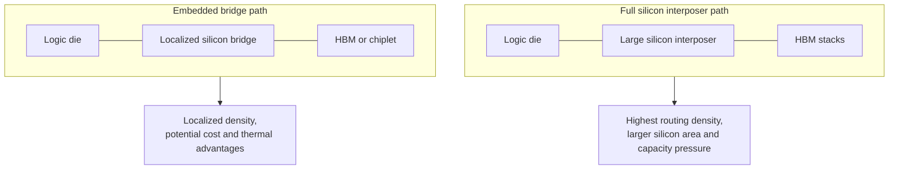

# Packaging Evolution: Wire Bond To TSV, Hybrid Bonding, And Chiplets

Semiconductor packaging evolved from a protective back-end step into one of the central architectural constraints of AI computing and memory systems. The transition from wire bond to flip chip, TSV, 2.5D interposers, hybrid bonding, and chiplets is not just a mechanical history. It is the history of shrinking interconnect length, increasing I/O density, improving bandwidth per watt, and moving the system bottleneck from transistor scaling to die-to-die communication. In memory, this shift is visible in HBM: DRAM dies become vertically stacked, linked by TSVs and microbumps, then placed beside accelerators on silicon interposers or interconnect bridges.[^S048][^S049][^S050]

## Wire Bond: Cheap, Flexible, And Long-Lived

Wire bonding mounts a die face-up and connects die pads to a lead frame, substrate, or package with fine metallic wires. It is still widely used because it is mature, flexible, high-yielding, and cost-efficient for many analog, power, microcontroller, memory-card, and commodity packages. The limits are interconnect length, loop height, parasitics, routing congestion, and I/O density. A wire loop is physically long compared with an on-package redistribution layer or microbump, and that length becomes painful when the product needs high bandwidth, low inductance, low power, or thousands of connections.

Wire bond did not disappear because advanced packaging arrived. It lost the highest-bandwidth and highest-I/O sockets. The right historical framing is that wire bond remained a cost platform while flip chip and later TSV-based packages expanded the performance frontier. That distinction matters in semicap analysis: packaging transitions are not all-or-nothing. A memory supplier can use wire bond for mature NAND packages, flip chip for controllers, TSV for HBM stacks, and 2.5D interposers for accelerator attach inside one corporate supply chain.

The investable point is cost segmentation. A product does not adopt TSVs or hybrid bonding just because those technologies exist. It adopts them when the incremental bandwidth, energy, form factor, or die-partitioning value exceeds the added cost and yield risk. Wire bond remains the baseline because most chips are not NVIDIA-class AI accelerators, HBM stacks, or chiplet CPUs.

## Flip Chip: Shorter Interconnects And Area-Array I/O

Flip chip turns the die face-down and connects it through solder bumps distributed across the die surface. Public summaries describe flip chip, also called C4, as a method where solder bumps are deposited on chip pads, the chip is flipped, aligned to external circuitry, and reflowed; underfill is then used to mechanically support and electrically insulate the connection field.[^S051] Compared with wire bond, flip chip shortens interconnects and enables area-array I/O rather than edge-only escape.

Flip chip is the bridge between conventional packaging and advanced heterogeneous integration. It does not require stacking DRAM dies or using a silicon interposer, but it changes the package from a peripheral-wire problem into a substrate-routing problem. This made high-performance CPUs, GPUs, ASICs, and many memory controllers more practical as I/O counts rose.

The tradeoff moves to the substrate. Flip chip demands finer substrate lines and spaces, better bump pitch control, underfill materials, coefficient-of-thermal-expansion management, warpage control, and package test discipline. That is why ABF substrates and high-density organic substrates became strategic bottlenecks during advanced-compute cycles. The die can be ready and still wait for a substrate or assembly slot.

## TSV: Making Vertical Memory Practical

Through-silicon vias are vertical interconnects through silicon dies or wafers. Public TSV summaries define them as vertical electrical connections that pass through a wafer or die and are used as high-performance interconnect alternatives to wire bond and flip chip for 3D packages and 3D integrated circuits.[^S049] TSVs can be fabricated via-first, via-middle, or via-last depending on whether the via is formed before device patterning, after device patterning but before metal layers, or after/during back-end processing.[^S049]

For memory, TSVs solved the density and bandwidth problem that wire bond and simple package-on-package could not solve. The HBM reference history states that HBM dies are vertically interconnected by TSVs and microbumps, and that SK hynix manufactured the first HBM module based on TSV technology in 2013.[^S048][^S049] HBM then became the canonical example of packaging turning memory into a premium system component.

TSV adoption introduces manufacturing penalties. Wafers are thinned, vias must be etched and insulated, copper or tungsten fill must avoid voids and stress defects, keep-out zones affect circuit layout, and thermal behavior changes. A 2025 arXiv paper on TSV-aware 3D IC planning argued that dense TSV via farms can create lateral thermal blockage in thinned silicon, worsening hotspots, even though TSVs were often treated as vertical thermal conduits.[^S052] That is exactly the kind of second-order effect that makes packaging a co-design problem rather than an assembly afterthought.

HBM pushes the TSV problem harder because stack height, die thinning, thermal material, microbump pitch, and known-good-die selection all have to work together. SK hynix's 2025 HBM4 reporting tied HBM4 to a 2,048-bit interface, 10 GT/s speeds, 12-high stack construction, 1b-nm DRAM, and Advanced MR-MUF packaging.[^S003] The value is not just DRAM density. It is DRAM density delivered through a vertical package that can feed an accelerator at terabytes per second.

## 2.5D Interposers: HBM Beside Logic

2.5D packaging places multiple dies side by side on an interposer inside one package. Public 2.5D descriptions frame it as an intermediate architecture between 2D monolithic SoCs and 3D vertical stacks: chiplets are bonded to an interposer, the interposer routes signals among them, and TSVs connect the interposer to the package substrate.[^S050] Silicon interposers provide very fine-pitch routing and are the basis for technologies such as TSMC's CoWoS.[^S050]

For HBM systems, the interposer is the bridge between stacked memory and accelerator logic. A GPU or AI ASIC needs many thousands of short, low-energy connections to HBM stacks. A conventional PCB cannot provide that density and signal quality. A silicon interposer can route very wide buses between logic and HBM at the package level. That is why HBM adoption pulled CoWoS and 2.5D capacity into the center of AI supply-chain analysis.

The packaging ecosystem is now a capacity market. Tom's Hardware reported in October 2025 that Amkor had broken ground on an advanced packaging and test campus in Peoria, Arizona, with up to 750,000 square feet of cleanroom, production expected in early 2028, first factory completion in mid-2027, up to $400 million in proposed CHIPS Act support, an initial $2 billion phase, and possible expansion to a $7 billion campus with up to 3,000 jobs.[^S053] The same report said Apple and Nvidia were lead customers and described 2.5D packaging as a major AI-chip bottleneck identified by U.S. officials and NIST.[^S053]

That is a striking change from the historical view of packaging as back-end labor cost. If advanced packaging capacity delays AI accelerator shipments, packaging becomes a strategic asset on par with wafer capacity, HBM supply, and substrates. The supply chain now has three separate "available capacity" questions: can the logic die be fabbed, can the HBM stack be built, and can the full package be assembled and tested?

## EMIB, Bridges, And Interposer Alternatives

Full silicon interposers are powerful but expensive and capacity-constrained. Intel's EMIB uses embedded silicon bridges inside an organic substrate to connect adjacent dies at high density without routing the entire package across a large silicon interposer. In May 2026, Tom's Hardware reported that SK hynix was said to be researching Intel EMIB-based 2.5D packaging for HBM integration, though neither company had officially confirmed the partnership.[^S054] The article framed EMIB as a possible cost-effective and thermally efficient alternative to TSMC CoWoS, with an EMIB-T variant intended for HBM4 compatibility and higher bandwidth through additional TSVs.[^S054]

The important takeaway is not whether that specific unconfirmed collaboration becomes a product. It is that HBM integration is valuable enough that memory suppliers, foundries, and CPU companies are competing on package topology. A supplier wants more than one path to connect HBM to logic because CoWoS capacity, interposer size, substrate availability, thermal design, and customer preferences can all constrain revenue.

Bridge-based strategies, fan-out redistribution layers, organic interposers, and glass interposers all sit in the same design space: how much routing density is needed, at what cost, over what distance, with what thermals, and at what yield. There is no universal winner. A high-end AI accelerator with many HBM stacks can justify a large silicon interposer; a smaller accelerator, networking ASIC, or chiplet CPU may prefer bridge or fan-out approaches.

## Hybrid Bonding: From Microbumps To Direct Bond Interfaces

Hybrid bonding connects dies or wafers with direct dielectric-to-dielectric and metal-to-metal bonds, reducing interconnect pitch versus solder microbumps. It is central to wafer-to-wafer and die-to-wafer 3D integration roadmaps, including image sensors, stacked SRAM/cache, advanced logic, and future memory/logic integration. In this chapter, hybrid bonding is the transition from "package interconnect" to "near-monolithic die stacking."

Hybrid bonding changes the bottleneck from bump metallurgy to surface preparation, cleanliness, planarity, alignment, copper pad exposure, wafer/die handling, and bonding yield. Fine pitch is valuable only if the defectivity and alignment budgets support production. It also changes design: shorter vertical interconnects can improve bandwidth and energy, but stacked active dies make thermal removal and test access harder.

For memory, hybrid bonding is attractive because the industry wants finer pitch, lower power, thinner stacks, and better thermal paths than microbump-only approaches can provide. HBM roadmaps still depend heavily on TSVs and microbumps today, but hybrid bonding is a logical direction for future stack interfaces and logic-memory integration. The same issue appears in chiplet CPUs: once die-to-die bandwidth becomes a central performance limiter, the package interface starts to look like part of the architecture.

The commercial adoption curve is slower than the technical promise because hybrid bonding compresses many yield risks into one step. Surface particles, copper dishing, dielectric erosion, wafer bow, local topography, and alignment drift can all turn into latent reliability problems. A wire-bonded package can often tolerate a much rougher back-end environment; a hybrid-bonded interface cannot. The cleanliness and metrology regime starts to resemble front-end wafer processing, which is why leading-edge packaging lines increasingly look like wafer fabs rather than traditional assembly floors.

This shift is important for OSAT strategy. Conventional assembly skill remains necessary, but advanced package leadership also requires wafer-level process control, temporary bonding/debonding, thinning, CMP-like surface control, plasma activation, high-resolution alignment, and defect inspection. The boundary between foundry and OSAT therefore blurs. TSMC, Intel, Samsung, Amkor, ASE, and memory vendors are not competing in identical ways, but they are all pulled toward package process capability as a source of margin and customer lock-in.

## Chiplets: Packaging Becomes Architecture

Chiplets partition a system into multiple dies: compute tiles, I/O dies, cache dies, HBM stacks, analog dies, reticle-sized accelerators, and specialized process-node components. The value proposition is yield, reuse, process specialization, and scaling beyond reticle limits. Instead of building one huge monolithic die on one process, the vendor can combine smaller or specialized dies in a package.

The cost is packaging complexity. Chiplets demand die-to-die protocols, physical interface standards, thermal co-design, power delivery, warpage control, ESD and signal-integrity discipline, known-good-die logistics, package-level test, and repair strategies. A 2025 arXiv paper on tiny chiplets argued that advanced packaging creates abundant interconnection resources for 2.5D/3D heterogeneous integration, but conventional I/O circuitry, ESD protection, and signaling overhead can constrain chiplet miniaturization below 100 mm2.[^S055] That is a reminder that chiplets are not "free Lego." The interface overhead can dominate if it is not co-designed.

A separate 2025 arXiv paper on 2.5D placement argued that tight chiplet packing can create thermal bottlenecks and coefficient-of-thermal-expansion stress, and proposed a structural and thermal aware placement method that reduced stress by 11% while maintaining near-identical thermal performance and reducing total wirelength by 11% versus temperature-only optimization.[^S056] This reinforces the same theme: chiplet packaging is a physical design problem, not just an economic partitioning trick.

Known-good-die logistics are the quiet economic hinge. In a monolithic die, yield loss is contained inside one die. In a multi-die package, a bad HBM stack, bridge, logic chiplet, interposer defect, or substrate defect can threaten the value of the entire assembled unit. The industry therefore needs test insertion points before stacking, after stacking, after interposer attach, after substrate attach, and after final system-level validation. Test coverage is no longer only a quality function. It is a yield-protection strategy for packages whose bill of materials can include several scarce premium components.

Memory makes this especially acute. An HBM stack contains multiple DRAM dies plus a base die; an accelerator package may contain several HBM stacks plus one or more very expensive logic dies. The package assembler wants every stack to be known-good before integration, but some failures only emerge after thermal cycling, stress, or full-speed interface operation. That is why HBM supply is not equal to DRAM wafer output. The revenue unit is a qualified stack in a qualified package.

## Wafer-Level Versus Panel-Level Scaling

As AI packages grow, the industry is debating wafer-level and panel-level advanced packaging. Tom's Hardware reported in June 2026 that TSMC said panel-level packaging would not replace wafer-level CoWoS soon for the largest future AI processors, because wafer-level processes still provide higher interconnect density and can scale CoWoS to integrate as many as 58 large reticle-sized dies.[^S057] The same report said TSMC described CoWoS roadmaps moving from current large package sizes toward 150 mm by 250 mm substrates, while panel-level options such as CoPoS could complement CoWoS but need more mature tooling.[^S057]

The distinction matters for capacity economics. Wafer-level advanced packaging can reuse the most advanced process-control ecosystem: lithography, etch, deposition, metrology, and wafer handling. Panel-level processing promises larger package formats and potentially lower cost per area, but panel tools, overlay, warpage, and defect control must catch up. In the near term, the highest-density AI packages remain tied to wafer-level packaging capacity. In the long term, panel-level methods could open package size and cost options if the process ecosystem matures.[^S057]

## Memory-Specific Takeaways

Memory packaging evolved along two parallel axes. Commodity memory packaging optimized cost, lifecycle, and capacity per package. Premium memory packaging optimized bandwidth, energy, and proximity to logic. NAND packages can still be wire-bonded or stacked for capacity; HBM requires TSV stacks and high-density logic attachment; future HBF and near-memory flash modules may blend storage package techniques with high-speed compute fabrics.

Commodity NAND packaging highlights the other side of the spectrum. NAND suppliers can stack many thin flash dies in one package, often using wire bonding or other mature interconnect methods, because the external interface is managed by a controller and does not require HBM-like die-to-logic bandwidth. The package objective is capacity, cost, height, thermal acceptability, and reliable assembly. HBM flips that objective: the package must deliver very wide, low-energy links and tight mechanical/thermal integration with logic. Both are "memory packaging," but the optimization functions differ sharply.

There is also a lifecycle difference. A planar or mature 3D NAND package can stay in embedded markets for years, while an HBM package is tied to a fast accelerator generation. The HBM package has to qualify with the customer platform, substrate, interposer/bridge, thermal solution, and power-delivery design. The NAND package has to satisfy endurance and supply continuity, but it usually does not need to sit millimeters from a reticle-sized AI die. That is why packaging mix, not just bit output, should be tracked in the vendor profiles.

The key transitions are:

| Transition | Technical move | Memory consequence | Bottleneck created |
|---|---|---|---|
| Wire bond to flip chip | Shorter interconnect, area-array I/O | Faster controllers, higher I/O packages | Substrate density, underfill, warpage |
| Flip chip to TSV stack | Vertical connections through die | HBM and stacked DRAM become practical | Die thinning, TSV yield, thermals |
| TSV stack to 2.5D interposer | HBM beside logic on fine-pitch routing | Accelerator memory bandwidth explodes | CoWoS/interposer/package capacity |
| Microbump to hybrid bonding | Finer die-to-die pitch | Future high-density memory/logic stacks | Surface prep, alignment, defectivity |
| Monolithic die to chiplets | Process specialization and package composition | HBM, cache, I/O, logic assembled as system | Test, thermal, interface overhead |

Packaging is now part of memory strategy. SK hynix, Samsung, Micron, TSMC, Intel, Amkor, ASE, and substrate suppliers all sit inside the same competitive field because HBM-era memory is sold as a qualified package path, not just a DRAM die. A vendor with strong DRAM process but weak package access can lose share; a vendor with premium packaging slots can monetize scarce HBM even when commodity DRAM is cyclical.

The strategic question for the rest of this database is therefore not "who has the best memory cell?" It is "who can turn the cell into qualified system bandwidth?" For HBM, that requires TSV stacks, base dies, package capacity, interposers or bridges, substrate supply, thermal design, and customer validation. For NAND, it requires die stacking, controllers, firmware, endurance management, and increasingly high-speed PCIe or near-memory modules. Packaging is where the device roadmap meets the customer's system bottleneck.

## Source Notes

[^S003]: SK hynix completes development of next-gen HBM4, Tom's Hardware, published 2025-09-12, https://www.tomshardware.com/pc-components/dram/sk-hynix-completes-development-of-hbm4-2-048-bit-interface-and-10-gt-s-speeds-promised
[^S048]: High Bandwidth Memory overview, Wikipedia, crawled 2026-05, no stable page publish date listed, https://en.wikipedia.org/wiki/High_Bandwidth_Memory
[^S049]: Through-silicon via overview, Wikipedia, crawled 2025-05, no stable page publish date listed, https://en.wikipedia.org/wiki/Through-silicon_via
[^S050]: 2.5D integrated circuit overview, Wikipedia, crawled 2026-03, no stable page publish date listed, https://en.wikipedia.org/wiki/2.5D_integrated_circuit
[^S051]: Flip chip overview, Wikipedia, crawled 2025-12, no stable page publish date listed, https://en.wikipedia.org/wiki/Flip_chip
[^S052]: Through Silicon Via Aware Design Planning for Thermally Efficient 3-D Integrated Circuits, arXiv, published 2025-07-19, https://arxiv.org/abs/2508.13160
[^S053]: Amkor breaks ground on Arizona advanced packaging campus, Tom's Hardware, published 2025-10-07, https://www.tomshardware.com/tech-industry/semiconductors/amkor-breaks-ground-on-arizona-advanced-packaging-campus
[^S054]: Intel, SK hynix shares surge following reports of chip packaging partnership, Tom's Hardware, published 2026-05-11, https://www.tomshardware.com/tech-industry/semiconductors/sk-hynix-shares-surge-to-all-time-high-on-reports-of-intel-emib-partnership
[^S055]: Tiny Chiplets Enabled by Packaging Scaling, arXiv, published 2025-11-13, https://arxiv.org/abs/2511.10760
[^S056]: STAMP-2.5D: Structural and Thermal Aware Methodology for Placement in 2.5D Integration, arXiv, published 2025-04-29, https://arxiv.org/abs/2504.21140
[^S057]: TSMC says panel packaging won't replace CoWoS anytime soon for the largest future AI processors, Tom's Hardware, published 2026-06-16, https://www.tomshardware.com/tech-industry/semiconductors/tsmc-says-panel-packaging-wont-replace-cowos-anytime-soon-for-the-largest-future-ai-processors-wafer-level-tech-can-scale-to-58-massive-dies-in-one-package
