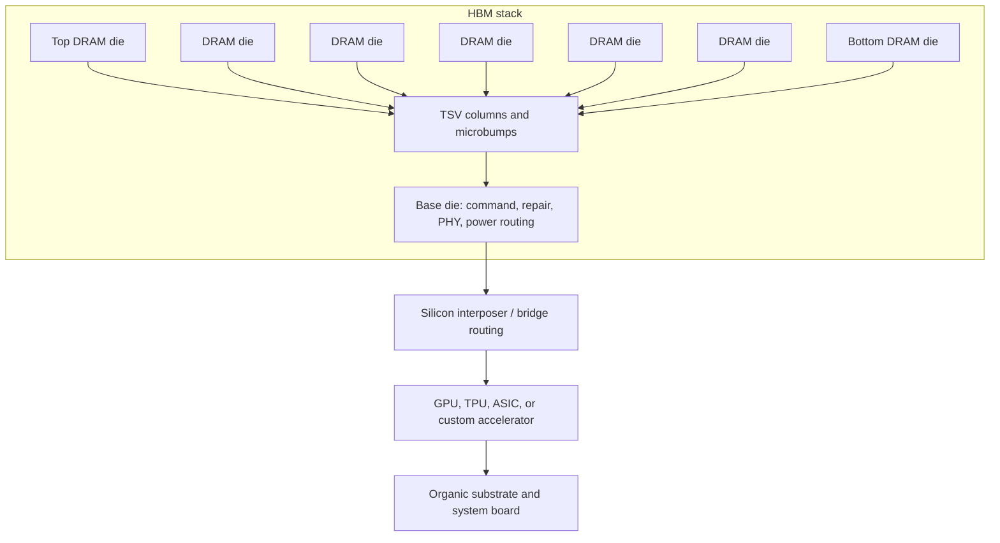
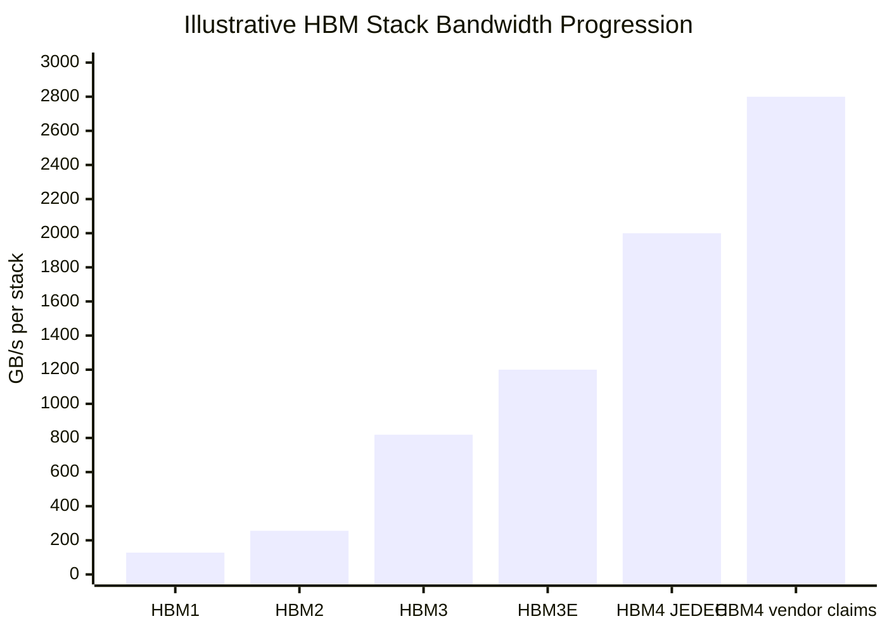

# HBM Fundamentals: Base Die, DRAM Stacks, TSVs, And Bandwidth Per Watt

High Bandwidth Memory is best understood as a packaging-defined DRAM architecture rather than a faster version of commodity DIMM memory. A DDR5 or LPDDR device is optimized around a board-level channel, a memory controller on the host SoC, and comparatively narrow high-speed electrical links. HBM instead stacks DRAM dies vertically, connects them with through-silicon vias, lands the stack on a base die, and places the memory beside an accelerator on an interposer or advanced package. The result is a very wide, relatively short, low-swing interface that trades packaging complexity for enormous aggregate bandwidth and better energy per transferred bit.[^S048][^S049][^S050]

The architectural premise has stayed consistent even as the generation names moved from HBM and HBM2 to HBM3E and HBM4. The memory stack supplies many parallel wires close to the compute die; the accelerator consumes that bandwidth for tensor math, graph traversal, sparse expert routing, vector databases, and other workloads where arithmetic units stall if memory cannot feed them. NVIDIA's March 18, 2024 Blackwell announcement framed the platform around trillion-parameter-scale AI and rack-scale systems, and the GB200 NVL72 description explicitly combined 72 Blackwell GPUs, 36 Grace CPUs, liquid cooling, NVLink, and 30 TB of fast memory.[^S058] That system context explains why HBM is priced, allocated, and designed more like a platform-enabling component than a commodity DRAM SKU.

## Stack Anatomy

An HBM package contains multiple DRAM core dies, a base die, thousands of vertical connections, and a package interface that escapes the stack to the accelerator. The DRAM dies hold the memory arrays and local peripheral circuits. The base die is not just a passive pedestal; in modern designs it performs command/address distribution, repair handling, physical-interface functions, power delivery routing, thermal/mechanical interface work, and in HBM4-era devices increasingly becomes a customization boundary between memory supplier and accelerator customer. Micron said in October 2025 that its HBM4 approach used 1-gamma DRAM, an in-house CMOS base die, and packaging innovations, while also describing HBM4E as an extension with customer-specific logic-die customization options.[^S002]

The stack connects internally through TSVs, vertical conductors etched through thinned silicon. TSVs give HBM its short vertical path and high I/O density, but they also create die-area keep-out zones, stress concerns, via-fill yield risk, and thermal design constraints.[^S049][^S052] Those costs are acceptable only because the interface width is far larger than conventional graphics memory. HBM1 and later HBM2/HBM3-era devices used 1,024-bit-class stack interfaces; HBM4 doubled the stack interface to 2,048 bits in the public specification summaries, with JEDEC's 2025 standard described as supporting up to 8 Gb/s across a 2,048-bit interface for up to roughly 2 TB/s per stack.[^S048]

The die count is usually described as high, such as 8-high, 12-high, or 16-high. A 12-high stack does not merely add four dies over an 8-high stack. It tightens the mechanical window for warpage, mold flow, microbump coplanarity, wafer thinning, stack height, thermal resistance, and known-good-die economics. SK hynix's September 2025 HBM4 report referenced a 12-high design, a 1b-nm DRAM process, a 2,048-bit I/O, and Advanced MR-MUF packaging, which shows how the electrical standard and the physical assembly technology must be solved together.[^S003] Micron's March 2026 HBM4 volume-production report similarly described 36 GB 12-high stacks for NVIDIA Vera Rubin and 48 GB 16-high samples, making stack height a central capacity lever rather than a packaging footnote.[^S059]

## Why Wide And Slow Beats Narrow And Fast

HBM's core power advantage comes from moving bits across many short wires instead of a smaller number of long, high-speed board traces. A conventional GDDR path pushes very high per-pin rates across package and board channels. HBM widens the bus, lowers the distance, keeps the memory close to the compute die, and reduces the energy spent charging and discharging long interconnects. The design is not automatically cheaper or easier; it is simply better matched to workloads where bandwidth and energy per bit dominate the system cost curve.

The useful mental model is a toll road with many lanes close to the destination. Commodity memory increases speed by driving individual lanes harder and by adding channels at the board or module level. HBM increases the lane count inside the package. That is why HBM can deliver terabytes per second per stack while using pin speeds that may look modest beside GDDR marketing numbers. The interface is physically large and package-bound, so the accelerator floorplan must reserve significant edge length, routing resources, power delivery, and thermal headroom for memory attach.

This is also why HBM adoption is lumpy. CPUs that need capacity and low cost still prefer DDR/CXL memory pools. Consumer GPUs often prefer GDDR because package cost and substrate yield matter more than maximum bandwidth per watt. AI accelerators, HPC GPUs, high-end networking ASICs, and certain custom inference parts choose HBM because the economic bottleneck is not the memory chip alone; it is the value of keeping expensive matrix engines busy. If a multi-thousand-dollar accelerator loses utilization because memory bandwidth is short, the package premium can be rational.

| Attribute | DDR5 RDIMM / CXL memory | GDDR-class graphics memory | HBM-class stack |
|---|---|---|---|
| Physical placement | Board/module level | Board or package edge around GPU | In-package beside logic |
| Main optimization | Capacity, serviceability, cost per GB | Graphics bandwidth at lower package cost | Bandwidth density and energy per bit |
| Interface strategy | Multiple channels, DIMM/CXL topology | Narrower links at high per-pin rates | Very wide stack interface, short routes |
| Typical bottleneck | Latency, NUMA, CXL overhead, channel count | Board routing, power, signal integrity | Interposer/package capacity, stack yield |
| Best workload fit | CPU memory expansion, databases, virtualization | Gaming graphics, workstation graphics | AI training/inference, HPC, networking ASICs |

## Channels, Banks, And Scheduling

The physical width of HBM does not mean every workload automatically sees peak bandwidth. Inside a stack, HBM is divided into channels and banks, and those resources have timing limits just as commodity DRAM does. HBM3 public summaries describe a 1,024-bit stack organized as 16 channels of 64 bits, doubling the channel count relative to HBM2E while keeping the total data-pin count in the same class.[^S048] The channelization is useful because accelerators can distribute independent memory requests across many internal resources, but it creates a software and hardware scheduling problem. A kernel with poor locality, bank conflicts, or unbalanced access across stacks may leave bandwidth idle even while the headline stack specification looks ample.

AI workloads expose this issue differently across phases. Dense matrix multiplication tends to stream large tensors and can approach high utilization if tiling, prefetching, and data layout are tuned. Attention, mixture-of-experts routing, embedding lookups, graph operations, and retrieval-augmented inference can create more irregular access patterns. The HBM system then depends on the accelerator's memory controllers, on-package routing, cache hierarchy, compiler tiling, and collective communication strategy. This is why accelerator vendors discuss HBM in the same breath as tensor cores, NVLink, cache, and rack-scale topology rather than as an isolated memory part.[^S058]

Refresh and retention remain real DRAM constraints. HBM still stores charge in DRAM cells, so rows must be refreshed, repaired, and protected against retention failures. As stack height rises and thermals become more challenging, retention distribution can interact with temperature gradients through the stack. A high-temperature upper die, an aggressive workload phase, or a liquid-cooling transient can change the available guardband. Vendors mitigate this through process control, redundancy, error management, thermal monitoring, binning, and customer-specific qualification. Public product announcements usually emphasize bandwidth and capacity, but buyers care about the long tail of retention, RAS, and field reliability because AI clusters run expensive jobs for long periods.

Stack-level load balancing is also a package-design question. An accelerator with six or eight HBM stacks must place controllers and physical interfaces around the logic die, then route each interface through the interposer to a corresponding stack. If a model shard, tensor-parallel partition, or inference batch maps unevenly across stacks, the effective bandwidth is governed by the hottest stack rather than the average. For that reason, HBM capacity, bandwidth, stack count, cache size, and software partitioning form one design surface. A next-generation stack that raises bandwidth by 20-40% may not improve time-to-token if the platform is limited by inter-GPU communication, host memory staging, collective synchronization, or poorly balanced expert routing. The investable question is not just "how many TB/s per stack?" but "how much sustained useful bandwidth does the platform expose to the workload?"

## Bandwidth-Per-Watt Evolution

The public HBM progression can be read as a compounding bandwidth-per-watt story. HBM1 established the stack concept. HBM2 increased speed, capacity, and channelization. HBM2E pushed mature 2.5D GPUs and accelerators. HBM3 and HBM3E turned HBM into the default memory tier for AI accelerators. HBM4 then widened the stack interface and pushed base-die customization toward the center of the architecture.[^S048][^S002][^S003]

The numerics show the slope. Public HBM summaries list HBM1 at 1 GT/s per pin and about 128 GB/s per package; HBM3-class summaries describe 1,024-bit stacks and up to the 819 GB/s class; HBM3E reporting from memory vendors moved practical stack bandwidth into the 1.2 TB/s range; HBM4 reports in 2025-2026 moved the stack-level figure above 2 TB/s and, in vendor claims, above 2.8 TB/s.[^S048][^S002][^S059] Micron's October 2025 report said its HBM4 samples achieved more than 2.8 TB/s and more than 11 Gb/s pin speeds, above the referenced JEDEC HBM4 baseline of 2 TB/s and 8 Gb/s.[^S002] SK hynix's September 2025 HBM4 report said its stack used a 2,048-bit interface and 10 GT/s speeds, described as 25% above the JEDEC standard.[^S003]

Power is more difficult to normalize from public disclosures because vendors compare different stack heights, process nodes, voltages, interface rates, and system configurations. Still, the direction is clear. Samsung's February 2026 HBM4 reporting claimed roughly 40% better power efficiency than HBM3E, with a 2,048-pin design, low-voltage TSV changes, thermal improvements, and transfer speeds reported at 11.7 Gb/s with headroom to 13 Gb/s in some configurations.[^S038] Micron's March 2026 HBM4 report said its 36 GB 12-high HBM4 delivered more than 2.8 TB/s, a 2.3x bandwidth improvement, and more than 20% better power efficiency versus its HBM3E at the same 36 GB 12-high configuration.[^S059] Treat those as vendor-specific claims rather than a universal law, but they indicate why customers are willing to reserve scarce HBM supply years ahead.

## Base Die As Strategic Boundary

The base die is becoming the most strategically interesting part of HBM. Earlier HBM generations treated the base die mainly as the interface and routing layer below standardized DRAM stacks. HBM4 changes the center of gravity because the interface width doubles, the PHY becomes harder, and customers want memory behavior tuned to specific accelerators. The base die can absorb customization without forcing the DRAM core die to become a fully bespoke product for every GPU, TPU, networking ASIC, or custom AI accelerator.

That boundary has three implications. First, foundry relationships matter. A base die can be built in a logic process with different economics, design rules, and IP blocks than the DRAM dies above it. Second, co-design becomes stickier. If an accelerator company shapes a custom base die for routing, power, latency, RAS, or test hooks, HBM sourcing can become more platform-specific than commodity procurement. Third, the margin profile can improve for memory vendors that control the base-die architecture and package integration. Micron's October 2025 commentary explicitly connected HBM4E customization to customers such as NVIDIA and AMD and to a potentially more favorable product architecture.[^S002]

The base die also complicates second sourcing. JEDEC standardization defines interoperability boundaries, but a customer-customized HBM4E base die may tie memory stacks more closely to a specific accelerator floorplan, package substrate, thermal envelope, firmware model, and qualification flow. This is one reason HBM4E is likely to matter commercially beyond the nominal bandwidth gain: it is a path from standardized HBM toward semi-custom memory subsystems. That direction foreshadows the custom-HBM logic-die-as-a-service model covered later in [05-hbm-customer-ecosystem.md](05-hbm-customer-ecosystem.md).

## TSV, Microbump, And Stack Yield Economics

HBM manufacturing stacks yield risks from both wafer fabrication and assembly. Each DRAM die must meet array, speed, leakage, repair, and thermal criteria. Each stack adds many die-to-die joins. Each TSV field must maintain electrical continuity and isolation. Each microbump layer must align and connect without shorts or opens. Each finished cube must pass speed, retention, thermal, and package-level tests. A stack made from many good dies can still fail because one interconnect layer, one via farm, one mold interface, or one thermal path is marginal.

This is why known-good-die discipline is central. The memory supplier cannot economically stack random dies and hope the final cube passes. Dies are binned, repaired, and tracked before stacking; assembly flows are tuned to preserve yield; and final package test screens out latent failures. The whole process creates a steep learning curve. A new DRAM node, new stack height, new base die, or new underfill/molding flow can each disturb yield. HBM supply therefore expands more slowly than wafer starts alone would suggest.

SK hynix's Advanced MR-MUF disclosure is commercially important for this reason. The September 2025 HBM4 report described multiple memory chips placed on a base substrate, bonded through a single reflow step, and then protected by molded underfill, while also tying the method to stack height control and heat dissipation.[^S003] The exact process recipes are proprietary, but the public description points to the real constraint: HBM vendors compete on thermal-mechanical assembly know-how as much as on DRAM array scaling.

Thermals are not a side issue. HBM sits beside high-power logic on packages that may be liquid-cooled at the system level. The stack's upper dies can be thermally disadvantaged, and TSV/microbump fields alter heat flow. A TSV-aware 2025 research paper argued that dense TSV via farms may block lateral heat spreading and worsen hotspots in thinned silicon, even while vertical TSVs conduct heat along their axis.[^S052] For HBM, that means electrical bandwidth, stack height, and cooling design have to be co-optimized.

## HBM And The Interposer Bottleneck

HBM does not work by itself. A stack needs a high-density route into the accelerator. Most leading AI packages use silicon interposers, advanced wafer-level packaging, or bridge-like technologies to achieve enough routing density between the accelerator and multiple HBM stacks.[^S050][^S057] The interposer/package problem is why HBM shortages are not simply memory-wafer shortages. A vendor can have DRAM wafers but still be constrained by TSV stacking, advanced packaging, substrates, test capacity, or customer qualification slots.

The number of stacks per accelerator drives the rest of the system. Four stacks might be enough for a midrange accelerator or networking ASIC. Six or eight stacks are common in high-end AI GPUs and custom accelerators. More stacks increase package area, interposer reticle pressure, power distribution complexity, thermal load, substrate escape routing, and assembly cycle time. Higher per-stack bandwidth can sometimes reduce stack count, but model capacity and batch-size requirements often push in the opposite direction: customers want more bandwidth and more capacity.

This is why HBM4's 2,048-bit interface is a double-edged improvement. It increases per-stack bandwidth, but it also consumes more logic-die edge and package routing resources. JEDEC's reported SPHBM4 work, which narrows the external interface to 512 bits using serialization while retaining HBM4-class bandwidth goals, shows the industry trying to relieve some integration pressure for cases where full HBM physical width is too expensive or area-hungry.[^S060] That does not make SPHBM4 a GDDR replacement; it is better read as evidence that HBM's physical interface width has become a system-design bottleneck.

## Reliability And Qualification

HBM qualification is platform qualification. The memory stack must satisfy JEDEC-level functional requirements, but the final customer also cares about package warpage, thermal cycling, liquid-cooling compatibility, RAS behavior, retention under accelerator thermal transients, in-field repair policy, firmware visibility, and supply continuity. A hyperscaler buying AI systems is exposed to the interaction among GPU stepping, HBM vendor, interposer technology, substrate supplier, OSAT flow, rack cooling, and cluster software. That is far more coupled than buying DDR DIMMs into a standardized server platform.

The customer qualification cycle explains why HBM market share can change slower than simple spec comparisons imply. A vendor can publish a higher stack bandwidth number, but accelerator customers still need validation boards, signal-integrity characterization, thermal-mechanical data, firmware hooks, error behavior, and volume ramp confidence. Micron's March 2026 HBM4 report tied volume production to NVIDIA's Vera Rubin platform, not merely to a standalone memory data sheet, which is the right commercial framing.[^S059] HBM is sold into named platforms because named platforms absorb the qualification cost.

Reliability requirements are also rising because AI clusters use HBM as part of long-running training and inference infrastructure. NVIDIA's Blackwell release highlighted a RAS engine for reliability, availability, and serviceability at the GPU level.[^S058] HBM vendors have analogous pressure: memory errors, thermal degradation, or package failures can translate into cluster downtime. For large model training, silent data corruption is unacceptable; for inference services, failure rates affect fleet economics. The system therefore rewards memory vendors with credible process control, field data, and customer-specific support.

## Competitive Meaning

HBM's strategic value is that it converts memory from a commodity capacity input into a scarce accelerator-enabling subsystem. The supplier does not merely sell gigabytes. It sells bandwidth density, validated stack height, thermal performance, base-die capability, packaging yield, customer co-design, and delivery assurance. That is why memory companies use HBM to reposition themselves in AI infrastructure even while commodity DRAM and NAND remain cyclical.

For semicap analysis, HBM demand pulls on a specific toolchain: advanced DRAM lithography and etch, TSV etch/fill, wafer thinning, temporary bonding/debonding, microbump or hybrid-bonding equipment, mold and underfill materials, high-density inspection, thermal metrology, package substrates, probe cards, and high-speed test. The bottleneck can move by year. In one period it is DRAM wafer allocation. In another it is CoWoS-like interposer capacity. In another it is high-end testers or known-good-die screening. The correct model is a linked supply chain with multiple serial constraints.

The rest of the HBM deep dive builds from this architecture. [02-hbm-generations.md](02-hbm-generations.md) turns the bandwidth and capacity history into a generation-by-generation table. [03-hbm-vendor-roadmaps.md](03-hbm-vendor-roadmaps.md) maps how SK hynix, Samsung, and Micron are adding fabs, TSV/packaging lines, and HBM4/HBM4E capacity. [04-hbm-key-tech-patents-ip.md](04-hbm-key-tech-patents-ip.md) follows the IP around TSV, base-die, thermal, and bonding structures. [05-hbm-customer-ecosystem.md](05-hbm-customer-ecosystem.md) covers NVIDIA, AMD, Google, and custom logic-die models. The key starting point is simple: HBM is the memory product where DRAM process technology, advanced packaging, and customer platform design collapse into one economic object.
