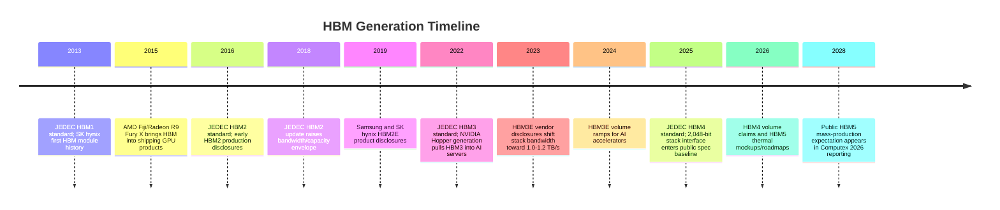
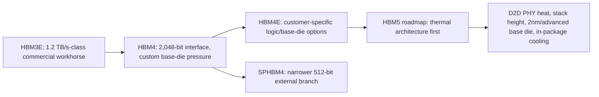

# HBM Generations: HBM1 Through HBM5

HBM generations are not simple speed bumps. Each step changes the balance among interface width, per-pin rate, channel count, stack height, base-die function, thermal design, and customer qualification. The public generation line runs from HBM1, standardized by JEDEC in October 2013, through HBM2 in January 2016, HBM3 in January 2022, and HBM4 in April 2025; HBM2E and HBM3E sit between those formal generational turns as enhanced commercial/specification extensions.[^S048] HBM5, as of July 2026, should be treated as a roadmap and thermal-design target rather than a finalized JEDEC standard: Samsung showed an HBM5 mockup at Computex 2026, and SK hynix discussed iHBM thermal packaging for future generations such as HBM5, but neither report made HBM5 a ratified standard or a volume product.[^S061][^S062]

That distinction keeps the table useful for procurement analysis instead of turning public roadmaps into false precision.

## Cross-Generation Specification Table

The table below uses public, source-backed values as a normalization layer. It is not a substitute for the paid JEDEC standards documents or vendor data sheets. Several rows combine formal standard information with commercial vendor claims, because HBM is frequently commercialized ahead of or beyond the minimum JEDEC baseline. Where a value is roadmap-only, the table says so explicitly.

| Generation | Standard / Market Timing | Interface / Channels | Public Max Per-Pin Rate | Public Stack Capacity Envelope | Public Stack Bandwidth Envelope | Commercial Meaning |
|---|---|---|---:|---:|---:|---|
| HBM1 | JEDEC adoption in October 2013; first mainstream GPU use with AMD Fiji products in 2015.[^S048] | 1,024-bit-class interface; 8 x 128-bit organization in public summaries.[^S048] | 1.0 Gb/s.[^S048] | Up to 4 GB per stack in public summary table.[^S048] | About 128 GB/s per stack.[^S048] | Proved TSV-stacked DRAM plus interposer economics, but capacity was too small for later AI use. |
| HBM2 | JEDEC accepted second generation in January 2016.[^S048] | 1,024-bit-class stack interface; HBM2/HBM2E commonly framed as 8 channels before HBM3 doubled channel count.[^S048] | 2.4 Gb/s in public HBM table.[^S048] | Up to 8 GB per stack in public table.[^S048] | About 307 GB/s per stack in public table.[^S048] | Moved HBM from proof point into HPC/GPU products, still before the modern generative-AI pull. |
| HBM2E | JEDEC HBM2 update announced in late 2018; Samsung and SK hynix commercial HBM2E disclosures followed in 2019-2020.[^S048] | Enhanced HBM2-class interface, with support for higher-speed stacks and 12-high options.[^S048] | 3.6 Gb/s in public HBM table.[^S048] | Up to 24 GB per stack in public table.[^S048] | About 461 GB/s per stack in public table; Samsung/SK hynix product disclosures were in the 410-460 GB/s class.[^S048] | The bridge generation for AI/HPC accelerators before HBM3; improved capacity mattered nearly as much as bandwidth. |
| HBM3 | JEDEC announced HBM3 on January 27, 2022.[^S048] | 16 x 64-bit channels; total stack data pins remained 1,024 in public summaries.[^S048] | 6.4 Gb/s.[^S048] | Public summaries cite 16 GB and 24 GB early SK hynix options; table-level values vary by die density and stack height.[^S048] | Up to about 819 GB/s per stack.[^S048] | Became the memory tier associated with Hopper-era AI accelerators and high-end FPGA/HPC systems. |
| HBM3E | Vendor disclosures began in 2023; volume ramps followed in 2024.[^S048] | HBM3-class organization, higher pin speeds, higher stack capacity. | Up to 9.8 Gb/s in public HBM table; Micron and Samsung disclosures reached the 9.6-9.8 Gb/s class.[^S048] | Public table cites up to 48 GB with 16 dies x 3 GB, while 24 GB 8-high and 36 GB 12-high products were important commercial SKUs.[^S048][^S059] | Public table cites about 1,229 GB/s per stack, consistent with the 1.2 TB/s commercial class.[^S048] | The AI boom workhorse generation: capacity, supply allocation, and package capacity became board-level procurement issues. |
| HBM4 | JEDEC HBM4 standard reported in April 2025.[^S048] | 2,048-bit stack interface; public summaries describe 32 x 64-bit channels.[^S048] | JEDEC baseline summarized at up to 8 Gb/s; vendors reported 10 GT/s, 11+ Gb/s, and 11.7 Gb/s-class claims in 2025-2026.[^S003][^S002][^S038][^S059] | Up to 64 GB per stack in public JEDEC summary, based on 4-16 high stacks and 24/32 Gb die densities.[^S048] | JEDEC baseline roughly 2 TB/s; vendor HBM4 claims moved above 2.8 TB/s and up to about 3.3 TB/s in 2025-2026 reporting.[^S002][^S038][^S059] | Doubles interface width, pushes base-die customization and thermal design into the center of customer co-design. |
| SPHBM4 | JEDEC was reported close to finalization in December 2025.[^S060] | Reported 512-bit external interface with 4:1 serialization while using standard HBM4 dies and an industry-standard base die.[^S060] | Not fully specified publicly; article notes uncertainty on whether serialization means higher transfer rate or encoding changes.[^S060] | Reported goal of preserving HBM4/HBM4E-class stack capacity, up to 64 GB in the article's framing.[^S060] | Intended to preserve HBM4-class bandwidth with narrower external interface.[^S060] | A cost/integration branch, not a GDDR killer; targets package-area pressure and organic-substrate integration. |
| HBM5 | Roadmap/mockup stage in 2026; no finalized JEDEC standard cited in public reporting reviewed here.[^S061][^S062] | KAIST roadmap cited in Computex 2026 reporting projected a 4,096-bit interface, but this should be treated as projection, not final spec.[^S062] | Not finalized publicly. | Not finalized publicly. | KAIST roadmap cited by Tom's Hardware projected roughly 4 TB/s per stack, with about 100 W per-stack power; Samsung and SK hynix reports focused mainly on thermal solutions.[^S062][^S061] | The problem statement shifts from raw bandwidth to cooling: D2D PHY heat, thermal pillars, integrated cooling elements, and stack-height sustainability. |

## HBM1: Proof Of The Package

HBM1 matters because it proved that TSV-stacked DRAM could be a commercial graphics memory, not just a conference demonstration. Public HBM histories say SK hynix manufactured the first HBM module based on TSV technology in 2013, JEDEC adopted HBM in October 2013, and AMD Fiji GPUs in 2015 were the first devices to use HBM in shipping products.[^S048] AMD's Fiji/Radeon R9 Fury X generation is therefore the right commercial starting point: it did not create today's AI HBM market, but it made the architecture visible to system designers, board makers, reviewers, and semiconductor investors.

The limitations were equally important. HBM1's public table values of 4 GB per stack and 128 GB/s per stack were impressive for the time but small against later accelerator needs.[^S048] Four HBM1 stacks could deliver bandwidth that looked extraordinary beside GDDR5, yet total capacity remained tight. That constraint shaped early positioning: HBM was attractive for bandwidth-constrained graphics workloads but did not immediately become the default for every high-end GPU because package cost, interposer complexity, and limited capacity narrowed the economic window.

HBM1 also established the recurring HBM pattern. A memory generation is not accepted solely because it is faster. It must be manufacturable as a stack, routable beside a logic die, testable at yield, coolable in the package, and deliverable in enough volume to support platform launches. That is why HBM's long-term importance was clearer in the architecture than in first-generation volumes. HBM1 showed the shape of the future: memory bandwidth would move inside the package.

## HBM2: From Novelty To HPC Memory Tier

HBM2 took the HBM concept into a broader high-performance memory tier. JEDEC accepted HBM2 in January 2016, and public summaries list 2.4 Gb/s per pin, up to 8 GB per stack, and roughly 307 GB/s per stack in the standard table.[^S048] The value proposition improved on both axes that mattered: more bandwidth and more capacity. HBM2 still had to compete against cheaper and simpler GDDR implementations, but it became more plausible for HPC GPUs, professional accelerators, networking parts, and other high-bandwidth devices.

The generational shift was also a supply-chain signal. Moving from HBM1 to HBM2 required better TSV yield, better stack assembly, better interposer economics, and stronger customer commitment. Those improvements compound slowly. A conventional DRAM generation can benefit from massive commodity volume; HBM volume depends on a smaller number of complex platforms. That narrower customer base raises per-unit cost but also lets memory vendors work deeply with customers on package qualification and roadmap alignment.

HBM2's commercial lesson was that bandwidth alone is not enough. Capacity per stack determined whether accelerators could hold larger working sets, and package economics determined whether OEMs could justify the cost. This is the pattern repeated in every later generation. HBM is always a three-way negotiation among bandwidth, capacity, and integration cost.

## HBM2E: The Enhanced Bridge

HBM2E sits in the history as the first clearly visible "E" bridge: not a clean-sheet generation, but enough improvement in bandwidth and capacity to matter commercially. Public summaries state that JEDEC updated the HBM2 specification in late 2018 for higher bandwidth and capacities, including support for 12-high stacks and up to 24 GB per stack; Samsung's 2019 Flashbolt and SK hynix's 2019 HBM2E disclosures were in the 410-460 GB/s-per-stack class.[^S048] The public table lists 3.6 Gb/s and about 461 GB/s per stack for HBM2E.[^S048]

The bridge character matters for investment analysis. The "E" generations let vendors monetize process, packaging, and binning improvements while customers wait for the next larger JEDEC step. For HBM2E, that meant more useful capacity without forcing customers immediately into an HBM3 platform. For accelerator designers, it reduced the risk of being trapped between generations: they could increase memory subsystem performance while still using a familiar controller and package design.

HBM2E also foreshadowed the AI era's procurement dynamics. If a customer can launch a product with an enhanced generation and then migrate to the next formal generation, the supply chain must carry overlapping parts, test flows, package designs, and qualification lots. That overlap becomes expensive when CoWoS-like capacity, TSV stacking, and high-speed test are constrained. It is one reason vendors and customers often sign multi-year roadmaps rather than buying HBM as a spot component.

## HBM3: Channelization And AI Server Pull

HBM3 was the first HBM generation to align with the modern AI accelerator inflection. JEDEC officially announced HBM3 on January 27, 2022; public summaries describe 16 channels of 64 bits and a 1,024-bit total data interface, with per-stack bandwidth up to roughly 819 GB/s.[^S048] The channel change mattered because raw interface width is only useful if the memory system can exploit parallelism. More channels create more scheduling opportunities and help accelerators distribute traffic across independent resources.

HBM3's commercial relevance was amplified by NVIDIA Hopper-era systems. Public HBM summaries describe SK hynix starting mass production of HBM3 for NVIDIA H100, and NVIDIA H100 configurations using HBM3 with multi-terabyte-per-second aggregate memory bandwidth.[^S048] Whether a given accelerator activated five or six HBM sites, the system point was clear: HBM was no longer a niche graphics feature. It became the memory tier that allowed expensive tensor engines to maintain utilization.

HBM3 also exposed a harder software problem. FPGA and accelerator research around HBM frequently shows that reaching peak bandwidth requires careful channel-aware design. A 2022 arXiv paper on HBM-based FPGA sorting described use of 32 HBM channels and HBM-specific optimizations, while also noting that fully exploiting off-chip HBM bandwidth is non-trivial because algorithmic and on-chip-resource scaling can become limiting.[^S063] That observation generalizes to GPUs and AI ASICs. HBM provides the physical bandwidth; compilers, kernels, caches, DMA engines, and collective libraries decide how much becomes useful throughput.

## HBM3E: The AI Workhorse

HBM3E became the commercial workhorse of the generative-AI buildout because it added the two things hyperscale accelerators needed immediately: higher bandwidth per stack and higher capacity per package. Public HBM summaries cite HBM3E vendor disclosures beginning in 2023 and moving into production in 2024, with the public table listing up to 9.8 Gb/s, up to 48 GB per stack in a 16-die configuration, and about 1,229 GB/s per stack.[^S048] The commercial headline was simpler: the industry moved from sub-terabyte-per-second HBM3 stacks to the 1.0-1.2 TB/s HBM3E class.

The 24 GB, 36 GB, and 48 GB capacity discussion matters because AI demand is not only bandwidth-limited. Larger models, longer context windows, higher batch sizes, and inference key-value cache growth push capacity. An accelerator can have enough compute and enough instantaneous bandwidth yet still lose economic attractiveness if it cannot hold the model state, activations, optimizer state, or inference cache required by target workloads. HBM3E therefore improved platform economics even before HBM4 arrived.

HBM3E also became the comparison base for HBM4 power-efficiency claims. Micron's March 2026 HBM4 report compared its 36 GB 12-high HBM4 with its HBM3E at the same capacity and stack height, claiming a 2.3x bandwidth improvement and more than 20% better power efficiency.[^S059] Samsung's February 2026 HBM4 reporting compared HBM4 against HBM3E as well, claiming about 40% better power efficiency.[^S038] Those claims are vendor-specific, but they confirm HBM3E's role as the baseline that next-generation AI memory must beat.

## HBM4: Wider Interface, Custom Base Die, Higher Stakes

HBM4 is the most important near-term generation because it changes both the electrical interface and the strategic role of the base die. Public HBM summaries describe JEDEC's April 2025 HBM4 standard as supporting up to 8 Gb/s over a 2,048-bit interface, with about 2 TB/s per stack, stack heights from 4 to 16, and 24 Gb or 32 Gb DRAM die densities enabling up to 64 GB per stack.[^S048] The doubling of the interface width is the headline, but it is also the root of many system-level problems: the accelerator must devote more edge, package routing, and power-delivery resources to each stack.

Vendor claims quickly moved beyond the JEDEC baseline. SK hynix's September 2025 HBM4 report cited a 2,048-bit I/O and 10 GT/s data transfer rate, described as 25% above the JEDEC standard, built with 1b-nm DRAM and Advanced MR-MUF packaging.[^S003] Micron's October 2025 HBM4 sample report claimed more than 2.8 TB/s per stack and pin speeds above 11 Gb/s, while describing 1-gamma DRAM, an in-house CMOS base die, and packaging innovations.[^S002] Samsung's February 2026 HBM4 reporting claimed 11.7 Gb/s transfer speed, possible headroom to 13 Gb/s, up to 3.3 TB/s per stack, 24 GB to 36 GB 12-layer configurations, later 16-layer capacity expansion, and about 40% power-efficiency improvement versus HBM3E.[^S038]

HBM4 also pushes the market toward custom base dies. The base die becomes a place to tune PHY, routing, RAS, power management, test, and perhaps customer-specific logic without respinning every DRAM core die. Micron's October 2025 HBM4/HBM4E commentary explicitly discussed HBM4E as an extension with customer-specific customization options for the logic die.[^S002] That is a commercial inflection. HBM4 is no longer just "more bandwidth"; it is a path toward semi-custom memory subsystems attached to named accelerator platforms.

## SPHBM4: A Branch Around Physical Interface Pressure

SPHBM4 deserves a row in the generation file even though it is not a classic HBM generation. Tom's Hardware reported in December 2025 that JEDEC was close to finalizing Standard Package HBM4, a lower-integration-cost branch that reduces the external interface from 2,048 bits to 512 bits using 4:1 serialization while aiming to preserve HBM4-class bandwidth.[^S060] The report said SPHBM4 would use standard HBM4 DRAM dies and an industry-standard base die, potentially enabling 2.5D integration on conventional organic substrates and reducing dependence on expensive silicon interposers.[^S060]

The key point is not that SPHBM4 replaces HBM4 or GDDR. It addresses a physical problem created by HBM's success. A 2,048-bit stack interface is powerful, but it consumes logic die edge and package routing area. For some accelerators, capacity per package and silicon area may be more valuable than maximum bandwidth density. A narrower serialized interface could let designers place more memory capacity around a processor or use a less expensive package technology, while still accepting TSV and stacked-DRAM cost. It is a cost/integration branch for AI and HPC design spaces where full HBM4 is too physically demanding.

## HBM5: Thermal Architecture Before Formal Specification

HBM5 is not yet a specification that can be treated like HBM4. Public 2026 reporting is mostly about thermal architecture and roadmap expectations. SK hynix announced iHBM on May 26, 2026, describing integrated cooling elements placed directly into the HBM package around the die-to-die physical layer, with a claimed more-than-30% reduction in thermal resistance and an intended application to next-generation products such as HBM5.[^S061] Samsung showed an HBM5 mockup at Computex 2026 with Heat Path Block cooling, confirmed that the HBM5 base die would use Samsung's in-house 2nm process, and said HPB had already been verified on HBM4E samples.[^S062]

The HBM5 conversation therefore starts with heat. Tom's Hardware's Computex 2026 report cited a KAIST roadmap projecting HBM5 at a 4,096-bit interface, roughly 4 TB/s per stack, and about 100 W per stack, while also stating that neither Samsung nor SK hynix expected HBM5 mass production before 2028.[^S062] Those figures should be handled as roadmap projections, but they explain why HBM5 mockups focus on thermal paths rather than headline bandwidth. If per-stack power moves toward the 100 W class, cooling structures become part of the memory generation definition.

HBM5 will likely intensify the same pattern visible in HBM4: wider or more complex interfaces, higher stack heights, more customized base dies, more package co-design, and a larger gap between headline spec and sustained platform throughput. Until a formal standard and volume products appear, the correct analytical stance is to track thermal architecture, base-die process choices, customer co-design announcements, and production timing rather than treating a single projected bandwidth number as settled.

## Reading The Generation Table Correctly

The most common mistake is to compare HBM generations as if they were only bandwidth numbers. That misses four commercial constraints. First, capacity per stack can dominate model fit and inference economics. HBM1's 128 GB/s per stack was important, but its 4 GB stack capacity limited use cases; HBM3E's rise mattered partly because 24 GB and 36 GB stacks improved model and batch flexibility.[^S048][^S059] Second, package integration can dominate time to volume. A JEDEC standard does not create interposer capacity, known-good-die test capacity, or high-yield stack assembly.

Third, power and thermals can erase theoretical bandwidth. HBM4 vendor claims show impressive per-stack bandwidth, but Samsung and SK hynix's 2026 HBM5 disclosures focus on heat extraction at the D2D PHY because high data movement concentrates heat near the memory-processor interface.[^S061][^S062] Fourth, software utilization matters. HBM channel count and bank structure require workload-aware scheduling; the HBM-based FPGA sorting paper is a useful reminder that algorithms must be designed to exploit channels rather than merely attached to a high-bandwidth part.[^S063]

For buyers, the generation decision is therefore workload-specific. Training dense transformer models may prioritize aggregate bandwidth and capacity across many stacks. Inference may prioritize capacity, bandwidth per watt, and time-to-token under batch-size constraints. Networking ASICs may prioritize deterministic throughput and packet-buffer behavior. FPGA accelerators may prioritize channel partitioning and memory-access regularity. The same HBM generation can look attractive or uneconomic depending on whether the system can keep the interface busy.

## Commercial Cycle Implications

HBM generation transitions are especially important because they create temporary scarcity. A new generation usually requires new DRAM die, new stack height options, new base die, new PHY, new package qualification, new thermal data, and customer-specific validation. Even if the DRAM wafer process is mature, the packaging and test learning curve can constrain output. That is why HBM supply frequently tightens ahead of major accelerator launches and why memory vendors publicly emphasize readiness for named platforms.

The 2025-2026 HBM4 reports show this pattern. Micron's March 2026 announcement framed HBM4 volume production around NVIDIA Vera Rubin, not around a generic DRAM catalog part.[^S059] SK hynix's 2025 HBM4 report emphasized preparation for high-volume manufacturing, 12-high stack construction, and Advanced MR-MUF packaging.[^S003] Samsung's HBM4 reporting emphasized process integration across 1c DRAM, a 4nm logic base die, packaging, thermal improvements, and customer partnerships.[^S038] In all three cases, the commercial message is platform readiness.

That is why the rest of the HBM chapter treats generations, vendor roadmaps, patents, and customer ecosystems separately. Generation labels tell the reader what is technically possible. Vendor roadmaps reveal who can build it, where, and when. Patent/IP analysis shows which pieces of TSV, thermal, and base-die implementation may be differentiated. Customer ecosystem analysis shows which accelerator platforms absorb the supply. HBM1 through HBM5 is not just a memory chronology; it is a map of where DRAM manufacturing, advanced packaging, and accelerator architecture have fused into one supply chain.

## Sources

[^S002]: Micron takes the HBM lead with fastest ever HBM4 memory with a 2.8TB/s bandwidth, TechRadar, published 2025-10-02, https://www.techradar.com/pro/micron-takes-the-hbm-lead-with-fastest-ever-hbm4-memory-with-a-2-8tb-s-bandwidth-putting-it-ahead-of-samsung-and-sk-hynix
[^S003]: SK hynix completes development of next-gen HBM4, Tom's Hardware, published 2025-09-12, https://www.tomshardware.com/pc-components/dram/sk-hynix-completes-development-of-hbm4-2-048-bit-interface-and-10-gt-s-speeds-promised
[^S038]: Samsung says it took the leap with HBM4, TechRadar, published 2026-02-13, https://www.techradar.com/pro/samsung-says-it-took-the-leap-with-hbm4-as-it-starts-shipping-faster-ai-memory-built-on-advanced-process-nodes
[^S048]: High Bandwidth Memory overview, Wikipedia, Crawled 2026-05, no stable page publish date listed, https://en.wikipedia.org/wiki/High_Bandwidth_Memory
[^S059]: Micron enters high-volume production of HBM4 for Nvidia Vera Rubin, Tom's Hardware, published 2026-03-16, https://www.tomshardware.com/pc-components/dram/micron-enters-high-volume-production-of-hbm4-for-nvidia-vera-rubin
[^S060]: Industry preps new SPHBM4 memory spec with narrow interface, Tom's Hardware, published 2025-12-13, https://www.tomshardware.com/pc-components/dram/industry-preps-cheap-hbm4-memory-spec-with-narrow-interface-but-it-isnt-a-gddr-killer-jedecs-new-sphbm4-spec-weds-hbm4-performance-and-lower-costs-to-enable-higher-capacity
[^S061]: SK hynix unveils iHBM thermal architecture for future HBM5 accelerators, Tom's Hardware, published 2026-05-26, https://www.tomshardware.com/tech-industry/semiconductors/sk-hynix-unveils-ihbm-thermal-architecture-that-cools-ai-memory-at-the-source-integrated-cooling-elements-inside-hbm-interface-cut-thermal-resistance-by-30-percent-target-next-gen-hbm5-accelerators-and-dense-ai-data-centers
[^S062]: Samsung shows first HBM5 mockup with Heat Path Block cooling, Tom's Hardware, published 2026-06-03, https://www.tomshardware.com/tech-industry/semiconductors/samsung-shows-first-hbm5-mockup-at-computex-with-heat-path-block-cooling
[^S063]: TopSort: A High-Performance Two-Phase Sorting Accelerator Optimized on HBM-based FPGAs, arXiv, published 2022-05-16, https://arxiv.org/abs/2205.07991
