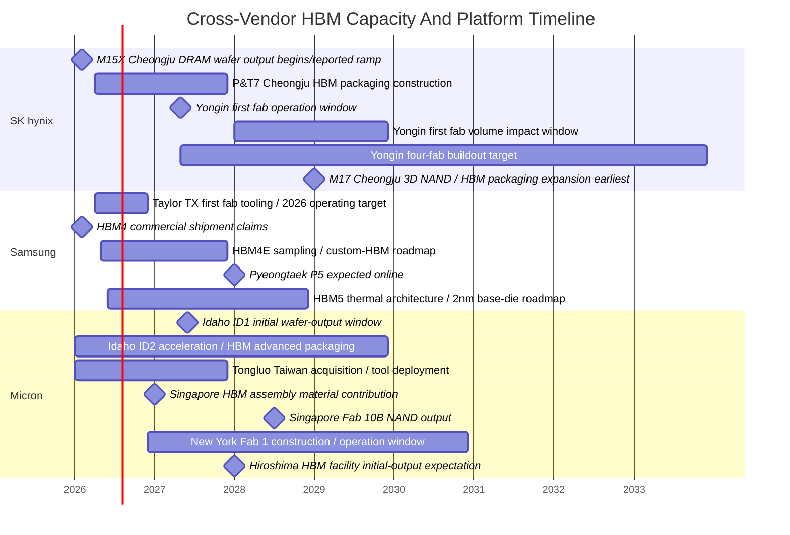

# HBM Vendor Roadmaps: SK hynix, Samsung, And Micron

HBM supply is now a three-layer roadmap problem: front-end DRAM wafer capacity, stack/package capacity, and customer-specific qualification. A vendor can announce HBM4 bandwidth without enough TSV stacking capacity; it can build a new fab without enough advanced packaging; and it can pass a generic standard while still waiting for a named accelerator qualification. That is why the relevant comparison is not "who has the fastest HBM data sheet?" but "which supplier can convert wafer starts, stack assembly, base-die integration, test, and customer allocation into qualified terabytes per second at volume?"

The 2026 landscape is unusually compressed. SK hynix is the HBM share leader, with public reporting putting its 2025 HBM market share at 61% versus 17% for Samsung and 21% for Micron; another March 2026 report put SK hynix at roughly 57% HBM share and 32% overall DRAM share, illustrating that share estimates vary by timing, metric, and source.[^S066][^S067] Samsung is trying to repair HBM3E share loss with an aggressive HBM4/HBM4E and custom-HBM push, leaning on in-house DRAM, foundry, and packaging integration.[^S038][^S062] Micron is attacking from a smaller HBM base but with unusually broad geographic expansion across Idaho, New York, Taiwan, Japan, and Singapore.[^S059][^S072][^S073][^S074]

## Strategic Map

The most useful starting point is to separate three constraints that are often blended in headlines. First, DRAM wafer capacity controls how many advanced DRAM dies can be produced. HBM uses DRAM core dies, so wafer allocation to HBM can tighten commodity DDR, LPDDR, GDDR, and server DRAM supply. Second, back-end stack capacity controls how many known-good dies can be thinned, TSV-connected, stacked, underfilled or molded, tested, and shipped as HBM cubes. Third, platform qualification controls which HBM cubes can ship to NVIDIA, AMD, Broadcom, Google, Amazon, Microsoft, Meta, or other AI customers.

This is why capacity headlines can be misleading. A new greenfield fab may not affect HBM until late 2028 or 2030. A packaging plant may add HBM output without adding net wafer starts. A customer qualification win can redirect existing wafers toward HBM and away from commodity DRAM. In March 2026, SK Group chairman Chey Tae-won was reported as saying industry-wide wafer supply lagged demand by more than 20% and that shortages could persist for four to five years, while also warning that excessive focus on HBM could worsen shortages in conventional DRAM.[^S067] That statement is not just macro commentary. It is the basic roadmap constraint for every vendor below.

The second framing point is that HBM4/HBM4E intensifies base-die and package co-design. SK hynix's HBM4 disclosure emphasized 2,048-bit I/O, 10 GT/s, 1b-nm DRAM, and Advanced MR-MUF packaging.[^S003] Samsung's HBM4 reporting emphasized sixth-generation 10nm-class DRAM, a 4nm logic base die, roughly 11.7 Gb/s operation, up to 3.3 TB/s per stack, and HBM4E/custom-HBM follow-ons.[^S038] Micron's HBM4 reporting emphasized 1-gamma DRAM, an in-house CMOS base die, packaging innovation, more than 2.8 TB/s, and HBM4E customer-specific logic-die customization.[^S002][^S059] The competitive axis is no longer just DRAM array performance; it is who can own enough of the base die, thermal stack, packaging process, and customer co-design loop.

## Capacity Stack: What Actually Has To Scale

HBM expansion is often discussed as if every announced dollar produces the same kind of capacity. It does not. The capacity stack has at least five layers. The first is advanced DRAM wafer starts. HBM4/HBM4E requires leading DRAM nodes with acceptable speed, leakage, density, and repair characteristics. A new fab such as Yongin or Clay can improve wafer supply only after cleanroom completion, equipment move-in, process qualification, yield ramp, and customer product validation. That is why the first Yongin fab can be operational in 2027 but more meaningfully affect supply in 2028-2029, and why Micron's Clay Fab 1 can begin construction in late 2026 but contribute materially only closer to 2029-2030.[^S064][^S072]

The second layer is TSV and die preparation. HBM dies must be thinned, vias must be formed and filled, keep-out zones must be managed, and dies must remain mechanically stable through stacking. Yield losses at this layer are multiplicative because one bad die or connection can ruin a stack. This is why a vendor's packaging process language matters. SK hynix's Advanced MR-MUF, Samsung's low-voltage TSV and thermal changes, and Micron's packaging innovation claims are not decorative technology slogans; they point to yield, height, heat, and reliability controls that determine shipped HBM output.[^S003][^S038][^S059]

The third layer is back-end HBM stack and package capacity. SK hynix's P&T7 and Micron's Singapore HBM assembly plant belong here.[^S065][^S074] These projects do not necessarily add DRAM wafer starts, but they can be the limiting step when wafers exist and finished cubes do not. The distinction matters for cycle analysis: adding wafer capacity without packaging capacity can strand dies; adding packaging without wafer starts can improve mix and yield but still leave the supplier wafer-constrained. The best roadmap is balanced.

The fourth layer is high-speed test and known-good-die logistics. HBM stacks have to be tested at die, stack, package, and often customer board levels. Test time increases with interface width, stack height, error-management features, and thermal screening. Public sources tend to under-discuss test because it is less photogenic than fabs, but it can become the practical bottleneck. A 12-high or 16-high HBM4 stack with a custom base die is not a commodity part that can be screened with a generic low-speed memory flow.

The fifth layer is customer allocation. HBM is frequently reserved years ahead by accelerator vendors and hyperscalers. April 2026 reporting said Samsung and SK hynix warned shortages could continue through at least 2027 and that some customers had already secured supply allocations through 2027.[^S077] Micron's HBM being sold out through 2026 and only able to satisfy about 50% to 66% of demand is the same phenomenon from the supplier side.[^S071] In a shortage, the decisive question is not the average market price; it is which customers have priority wafers, priority stacks, and priority engineering support.

## Vendor Comparison By Bottleneck

| Bottleneck | SK hynix position | Samsung position | Micron position |
|---|---|---|---|
| DRAM wafer starts | M15X near-term, Yongin long-term, M17/Cheongju later.[^S064][^S068] | Pyeongtaek expansion, P5 expected online in 2028.[^S067] | Idaho earlier, Clay later, Tongluo tactical, Hiroshima/Japan optionality.[^S072][^S073][^S075] |
| HBM packaging / test | P&T7 Cheongju, P&T3 existing, MR-MUF process lead.[^S064][^S065] | In-house packaging plus low-voltage TSV/thermal claims; HBM4E/HPB roadmap.[^S038][^S062] | Idaho advanced packaging plan and Singapore HBM assembly contribution in 2027.[^S072][^S074] |
| Base die / logic | HBM4 base-die details less public, but customer lead is strong.[^S003][^S066] | 4nm HBM4 base die, 2nm HBM5 base-die roadmap, foundry-memory integration.[^S038][^S062] | In-house CMOS base die; HBM4E customer-specific logic-die customization.[^S002][^S059] |
| Market share / customer pull | 57-61% HBM share range in 2026 reporting; NVIDIA-linked lead.[^S066][^S067] | Recovering from HBM3E lag; HBM4/HBM4E qualification and custom roadmap.[^S038][^S066] | Smaller share but strong HBM4 claims and sold-out 2026 output.[^S059][^S071] |
| Timing risk | P&T7 late-2027, Yongin ramp 2028-2029, M17 earliest 2029.[^S064][^S065] | P5 2028, custom-HBM 2027, HBM5 not before 2028.[^S038][^S062][^S067] | Idaho/Tongluo/Singapore before Clay; New York later; Hiroshima 2028.[^S072][^S073][^S074][^S067] |

This table also shows why a single "HBM share" number can mislead. SK hynix has the strongest incumbent position and the most obvious HBM supply credibility. Samsung has the most vertically integrated base-die and foundry story. Micron has the most geopolitically diversified expansion map. Each advantage maps to a different bottleneck. The share leader can lose if it lacks enough packaging slots; the integrated supplier can underperform if HBM stack yield lags; the diversified supplier can struggle if construction and tool deployment slip across too many sites.

## SK hynix: Share Leader Turning Cheongju And Yongin Into HBM Infrastructure

SK hynix enters the 2026-2028 HBM capacity race with the clearest market-share lead. Public reporting in June 2026 said SK hynix held 61% of the global HBM market in 2025, compared with Samsung at 17% and Micron at 21%; the same report attributed SK hynix's valuation surge to HBM demand, NVIDIA exposure, and Samsung's HBM3E yield/qualification problems.[^S066] A separate March 2026 report put SK hynix's HBM share at roughly 57%, showing the direction is more important than a single point estimate: SK hynix is the incumbent HBM share leader.[^S067]

The incumbent advantage came from continuing to invest through the 2023 memory downturn. The June 2026 market-share report argued that SK hynix maintained HBM investment despite a 2023 operating loss, while Samsung's HBM3E delays cost it major NVIDIA momentum.[^S066] That is the strategic lesson of HBM: the supplier with packaging learning, customer validation, and field history can monetize faster when demand inflects. HBM is not fungible commodity DRAM; it is a qualified subsystem with a long ramp.

### Icheon, Cheongju, And The M15X / P&T Axis

SK hynix's corporate base is Icheon, but the HBM capacity story is heavily Cheongju-linked. Public reporting on the July 2026 investment plan said Cheongju historically housed SK hynix's primary 3D NAND fabs, including M11, M12, and M15, and is evolving into a site that also supports HBM stacks because 3D NAND and HBM share elements of advanced packaging capability.[^S064] The same report described M15X as producing actual DRAM dies and P&T3 as performing packaging operations, an important distinction because HBM requires both the front-end die and the back-end stack.[^S064]

The near-term Cheongju milestone is M15X. January 2026 reporting said SK hynix would begin wafer production at M15X in Cheongju in February 2026 while also accelerating a 2027 fab plan by three months.[^S068] The same report framed M15X as part of the response to "tremendous" AI-customer demand and connected the capex plan to HBM ramp needs.[^S068] M15X is not equivalent to an entire new HBM supply chain by itself, but it matters because front-end DRAM dies are the feedstock for higher-stack HBM products.

The back-end counterpart is P&T7. January 2026 reporting said SK hynix would invest 19 trillion won, or about $12.9 billion, in a new advanced chip packaging facility in Cheongju, with construction beginning in April 2026 and completion expected in late 2027.[^S065] March 2026 reporting similarly described a $13 billion HBM packaging and testing facility at Cheongju, with construction scheduled to begin the next month and completion targeted for the end of 2027.[^S067] Those two reports are consistent on the role and completion window; the dollar value differs slightly because of exchange rate and rounding.

P&T7 is strategically more direct for HBM than a generic wafer fab. HBM output is constrained by stack assembly, TSV handling, known-good-die sorting, underfill/mold flow, thermal verification, and high-speed test. If SK hynix can scale P&T7 on time, it can convert DRAM wafer output from M15X and future fabs into more validated HBM stacks. If P&T7 slips, wafer starts alone will not solve the bottleneck.

### Yongin: Four-Fab DRAM Megasite

Yongin is SK hynix's long-duration DRAM capacity option. July 2026 reporting said SK hynix planned approximately KRW 600 trillion, or $389.3 billion, for the Yongin Semiconductor Cluster, described as its largest investment commitment and future largest DRAM production site.[^S064] The same report said the first Yongin fab was expected to commence operations in May 2027, with the remaining fabs added sequentially; because a DRAM fab takes roughly one to one-and-a-half years to fully ramp, the first fab's market impact would be more likely in 2028-2029.[^S064] Under the newly announced plan, the four-fab buildout target moved to 2033 rather than the original 2045 timeline.[^S064]

Earlier January 2026 reporting framed the first Yongin facility as part of a 600 trillion won "Semiconductor Cluster" and said only the first fab would be operational in 2027.[^S068] The two reports differ in currency conversion and detail, but they agree on the broad plan: Yongin is the major front-end DRAM capacity vector, not an immediate 2026 HBM relief valve. For HBM investors, the question is not only when the first fab opens. It is how much of its advanced DRAM output is allocated to HBM4/HBM4E/HBM5 versus server DDR, LPDDR, and other DRAM lines.

### M17, P&T7, And The Longer Cheongju Expansion

SK hynix's July 2026 plan also added a much larger Cheongju expansion layer. The report said SK hynix would invest an additional KRW 100 trillion, or $64 billion, in Cheongju to expand 3D NAND and HBM packaging, including construction of an M17 fab starting next year, with the earliest online timeframe in 2029.[^S064] It described the Cheongju investment as including 3D NAND fabrication, manufacturing equipment installation, and advanced packaging expansion for HBM back-end processing.[^S064]

This makes Cheongju a hybrid memory campus: NAND front-end, HBM packaging, and DRAM die output via M15X. That hybrid character is important because packaging know-how is transferable across stacked memory classes. It also creates allocation tension: if NAND/HBF-like products later need similar back-end resources, HBM will compete with other high-value stacked-memory products within the same corporate footprint.

## Samsung: Requalification Campaign Around Pyeongtaek, HBM4E, And Foundry-Memory Integration

Samsung's HBM roadmap is a rebound story. It remains one of the world's largest memory suppliers, but public 2026 HBM share estimates put it well behind SK hynix in HBM, with the gap attributed partly to HBM3E yield and customer-qualification delays.[^S066] Samsung's strategic response is to move faster at the HBM4/HBM4E node, use advanced base-die process technology, and exploit its unusual ability to combine DRAM, foundry, and advanced packaging inside one group.

### HBM4 And HBM4E Product Roadmap

Samsung's February 2026 HBM4 reporting was aggressive. It said Samsung had begun mass production and first commercial shipments of HBM4, built on sixth-generation 10nm-class DRAM and a 4nm logic base die.[^S038] The reported product reached 11.7 Gb/s, with headroom to 13 Gb/s in some configurations, and up to 3.3 TB/s per stack.[^S038] Reported capacities ranged from 24 GB to 36 GB in 12-layer stacks, with 16-layer versions later enabling up to 48 GB.[^S038] Samsung also claimed about 40% better power efficiency than HBM3E through low-voltage TSV, power-distribution, and thermal changes.[^S038]

The HBM4E/custom-HBM follow-on matters more than the "first shipment" headline. The same February 2026 report said Samsung expected HBM4E sampling later in 2026 and custom HBM samples in 2027.[^S038] June 2026 reporting around Samsung's HBM5 mockup said Samsung had already implemented and verified its Heat Path Block thermal structure on HBM4E, whose first 12-layer samples had begun shipping in May 2026 at 14 Gb/s, scaling to 16 Gb/s and 3.6 TB/s per stack.[^S062] This positions HBM4E as Samsung's attempt to leap from qualification laggard to high-performance custom-memory supplier.

The risk is that product claims must still convert into platform allocation. January 2026 reporting said Samsung and NVIDIA were expected to integrate Samsung HBM4 into Vera Rubin hardware, but that was framed as a report about cooperation and synchronized timelines rather than a public audited production database.[^S069] By June 2026, a separate report said NVIDIA CEO Jensen Huang had confirmed Samsung, SK hynix, and Micron all passed HBM4 certification for Vera Rubin, and that Samsung had shipped the first 12-layer HBM4E samples on May 29.[^S066] Those claims point to Samsung being back in the HBM4 qualification conversation, but not necessarily to equal share.

### Pyeongtaek P4/P5 And DRAM Capacity

Samsung's Pyeongtaek campus is the core memory capacity lever. March 2026 reporting said Samsung was expanding DRAM capacity at Pyeongtaek, with its P5 facility expected online by 2028.[^S067] This is slower than near-term HBM4 product claims because P5 is a fab-capacity milestone, not a finished HBM-stack shipment. It matters for HBM5 and later HBM4E because Samsung needs both leading-edge DRAM wafer starts and HBM back-end capacity to recover share.

The user-provided task list referenced Pyeongtaek P4/P5 and a cleanroom pull-in to Q3 2026. I did not find a reliable public source in this pass that directly confirmed "cleanroom pulled to Q3 2026" with enough specificity to cite. The sourced statement currently safe to include is narrower: Samsung is expanding DRAM at Pyeongtaek and P5 is expected online by 2028, according to March 18, 2026 reporting.[^S067] If later official or Korean trade-press sourcing confirms the Q3 2026 cleanroom detail, this file should be refreshed rather than relying on an uncited internal assumption.

### Taylor, Texas: Foundry Relevance To HBM Base Dies

Samsung's Taylor, Texas fab is not an HBM DRAM fab, but it matters to Samsung's HBM strategy because HBM4/HBM5 base dies are logic products and Samsung is positioning advanced logic/foundry process integration as an HBM differentiator. April 30, 2026 local reporting said Samsung held a private tooling-installation ceremony on April 24, 2026 for its $17 billion Taylor facility, with Samsung reiterating a target for the first phase to be operational by the end of 2026 and a second fabrication facility expected to begin production in 2027.[^S070]

The Taylor link should be handled carefully. It does not mean Taylor will build HBM base dies or HBM stacks unless Samsung says so directly. The roadmap relevance is organizational: Samsung can offer memory customers a story in which DRAM core dies, base dies, thermal design, advanced nodes, and customer ASIC relationships are internally coordinated. Samsung's HBM5 mockup reporting reinforces that point because Samsung confirmed HBM5's base die would use its in-house 2nm process, down from 4nm for HBM4/HBM4E.[^S062] Whether that becomes a share advantage depends on yield, customer trust, and package capacity.

## Micron: Geographic Optionality And A Fast HBM4 Push

Micron's HBM roadmap is geographically the broadest. It has Boise/Idaho, Clay/New York, Hiroshima/Japan, Tongluo/Taiwan, Singapore, and existing global manufacturing sites in the capacity story. That footprint is strategically useful because HBM customers want supply-chain resilience, but it also creates execution complexity: multiple countries, permitting regimes, equipment queues, labor markets, and infrastructure constraints.

### HBM4 Product Position

Micron's product claims are unusually strong for a vendor that historically had less HBM share than SK hynix. October 2025 reporting said Micron's HBM4 samples achieved more than 2.8 TB/s per stack and pin speeds above 11 Gb/s, above the cited JEDEC HBM4 baseline of 2 TB/s and 8 Gb/s.[^S002] March 2026 reporting said Micron entered high-volume production of 36 GB 12-high HBM4 for NVIDIA Vera Rubin, with more than 2.8 TB/s bandwidth, a 2.3x bandwidth improvement, and more than 20% better power efficiency versus Micron HBM3E at the same 36 GB 12-high configuration.[^S059] It also said Micron had shipped 48 GB 16-high HBM4 samples.[^S059]

Micron's commercial problem is scale. June 2026 reporting said Micron's HBM production was sold out through 2026 and that it could satisfy only about 50% to 66% of customer demand, while also noting that the three major suppliers controlled the HBM market.[^S071] That is a high-quality problem, but it means product leadership must be turned into wafer and stack capacity.

### Boise ID1/ID2 And Idaho Packaging

Idaho is Micron's domestic capacity and packaging acceleration story. November 2025 reporting said Micron was accelerating Idaho projects, including ID2, and reallocating roughly $1.2 billion of CHIPS Act funding from New York to Idaho, reducing Clay's share from $4.6 billion to $3.4 billion.[^S072] The report said the two Idaho facilities, one existing and one newly planned, would be completed ahead of the Clay fabs and that prioritization of ID2 should positively affect Micron's U.S. HBM output because Micron intended to build advanced packaging for HBM and other stacked memories in Idaho.[^S072]

March 2026 reporting from MarketWatch said Micron CEO Sanjay Mehrotra expected initial wafer output at the first Idaho-based fab in mid-2027, had started preparing for a second Idaho fab, and was planning around sites in New York and Japan.[^S075] The timing is important: Idaho is the earliest major U.S. wafer-capacity addition in Micron's public roadmap and is directly tied to HBM packaging ambitions. It is still not instant supply for 2026, but it is closer than the full New York buildout.

### Clay, New York Megafab

Micron's Clay, New York campus is the long-duration U.S. DRAM capacity option. November 2025 reporting on Micron's Environmental Impact Statement said construction for Fab 1 would begin in late 2026, after site preparation beginning in late 2025, with construction lasting into the second half of 2028 or early 2029.[^S072] The report noted that Micron believed it could partly equip Fab 1 in three quarters and begin operations in Q1 2029, while the more conservative expectation was DRAM production around 2030 because full equipment installation usually takes 12 to 24 months.[^S072] The same source pinned Fab 2 construction to the second half of 2028, Fab 3 to the second half of 2033, and Fab 4 to the first half of 2039, with the full Clay campus built and ramped by 2045.[^S072]

Clay is therefore strategic but not a 2026-2027 HBM relief valve. It supports Micron's goal of producing a large share of DRAM in the United States and gives hyperscalers a domestic-memory narrative. For HBM, however, the near-term bottleneck is more likely Idaho, Taiwan, Singapore assembly, Hiroshima, and packaging/test capacity.

### Hiroshima, Taiwan, And Singapore

Micron's Japan roadmap is relevant because March 2026 reporting said Micron was planning a $9.6 billion HBM facility in Hiroshima, but initial output was not expected until 2028.[^S067] The same March 2026 report placed Samsung P5 and Micron Hiroshima in the same "not before 2028" HBM-expansion bucket.[^S067] That means Hiroshima is part of Micron's HBM4E/HBM5 capacity path rather than an immediate 2026 fix.

Taiwan gives Micron a faster, more tactical DRAM-capacity option. January 2026 reporting said Micron would buy PSMC's P5 fab in Tongluo, Taiwan for $1.8 billion to boost DRAM output, with closing expected in the second half of 2026 and meaningful DRAM wafer output in the second half of 2027.[^S073] A March 2026 report said Micron had completed the acquisition of the Tongluo P5 site from Powerchip and was working to expand global DRAM manufacturing.[^S075] Another January 2026 report said the deal included a 300,000-square-foot 300 mm wafer cleanroom but no existing production equipment, so Micron would need a multi-phase tool deployment plan.[^S076] The sources differ on "signed/expected close" versus "completed" because they are separated by about two months; the file records both as timeline progression rather than conflict.

Singapore is a two-part story: NAND wafer capacity and HBM assembly. January 2026 reporting said Micron began construction of Fab 10B in Singapore, a roughly $24 billion project over more than a decade, with 700,000 square feet of cleanroom and initial 3D NAND wafer output in the second half of 2028.[^S074] The same report said Micron was also constructing an HBM assembly plant in Singapore and that this HBM packaging operation remained on track to contribute materially to Micron's HBM output in calendar 2027.[^S074] This distinction is critical: Fab 10B itself is NAND, while the HBM assembly plant is the direct HBM capacity lever.

## Comparative Read-Through

The vendor roadmaps show three different strategies. SK hynix is defending leadership by pairing share, customer momentum, M15X wafer output, P&T7 packaging, and the Yongin DRAM megasite. Samsung is trying to use HBM4/HBM4E performance claims, custom-HBM sampling, Pyeongtaek capacity, and foundry-memory integration to repair its HBM share position. Micron is using HBM4 performance, U.S. reshoring, Taiwan acquisition, Singapore assembly, and Japan expansion to turn a smaller share base into a broader supply platform.

The timing mismatch is the investable point. HBM demand is immediate, but most meaningful new wafer capacity arrives in 2027-2030 and many greenfield projects matter only after 2028. SK hynix P&T7's late-2027 completion helps packaging, but Yongin's first fab affects the market mostly in 2028-2029.[^S064][^S065] Samsung P5 is expected online in 2028.[^S067] Micron's Tongluo site may deliver meaningful DRAM wafer output in late 2027, Singapore HBM assembly can contribute in 2027, Hiroshima is expected around 2028, and New York DRAM is mostly a 2029-2030+ story.[^S073][^S074][^S067][^S072]

This is why memory shortages can persist even during record capex. A 2026 fab announcement does not produce 2026 HBM stacks. Equipment lead times, labor availability, cleanroom readiness, tool qualification, DRAM yield, TSV stack yield, package test, thermal data, and customer validation all sit between capex and revenue. The path from "announced fab" to "qualified HBM stack in an NVIDIA/AMD/Google system" is a multi-year chain.

Another read-through is that HBM capex can worsen the non-HBM memory cycle in the short run. The same DRAM engineering talent, wafer allocations, and capital budgets that go into HBM4 can be unavailable for conventional DRAM. April 2026 reporting described HBM demand spilling into broader DRAM shortages as suppliers shifted manufacturing capacity, engineering resources, and investment toward high-margin AI memory products.[^S077] That helps explain why PC, smartphone, and server buyers can face rising DDR prices even while memory makers are announcing record capex. The new money is not necessarily directed at the products whose prices consumers see first.

There is also an underappreciated infrastructure bottleneck. March 2026 reporting on Micron's Singapore expansion said the $24 billion project could require 400 to 500 power transformers, more than double the typical 100 to 150 for a standard wafer fab, and that semiconductor projects were competing with AI data centers and grid expansion for the same heavy-electrical equipment.[^S078] The report focused on Singapore, but the lesson applies across the vendor roadmaps. Electricity, water, substations, transformers, skilled trades, and tool-installation teams can all become schedule constraints. Memory capex is not only lithography and etch; it is a regional infrastructure project.

## Watch Items

For SK hynix, watch P&T7 construction execution, M15X yield, Yongin first-fab ramp, HBM4/HBM4E customer allocation, and whether the company can maintain HBM share as Samsung and Micron pass HBM4 qualification. The share-leader risk is not only technical; it is customer concentration. A very large NVIDIA exposure is excellent in shortage conditions but can create negotiating pressure if second sources become more credible.

For Samsung, watch whether HBM4E samples translate into volume allocations, whether Pyeongtaek capacity appears on schedule, whether the custom-HBM 2027 plan gains named customers, and whether Taylor/foundry integration becomes a practical base-die advantage rather than a marketing narrative. Samsung's unique strength is vertical integration; its weakness is that HBM customers judge delivered qualified capacity, not theoretical internal capability.

For Micron, watch Idaho ID1/ID2 timing, the Idaho HBM packaging plan, Tongluo tool deployment, Singapore HBM assembly in 2027, Hiroshima timing, and the New York EIS timeline. Micron has a strong HBM4 product story, but the roadmap test is whether it can lift share without overextending geographically. Its most important near-term capacity levers are probably Idaho, Tongluo, and Singapore assembly; New York is strategically important but later.

The bottom line is that HBM is becoming a capital-allocation filter across the memory oligopoly. The winner is not simply the vendor with the highest bandwidth claim. The winner is the vendor that can synchronize leading-edge DRAM nodes, base-die logic, TSV stacking, thermal design, advanced packaging, high-speed test, and customer qualification at the exact cadence of AI accelerator platforms.
