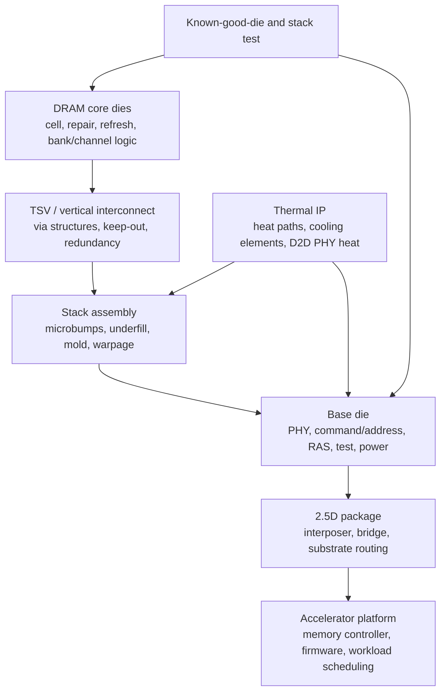

# HBM Key Technology Patents And IP

HBM patent analysis should not be read as a simple ranking of who owns the "most patents." The commercial IP moat sits in clusters: TSV stack architecture, base-die/control logic, test and repair, refresh and channel scheduling, thermal-mechanical packaging, underfill/mold flow, hybrid-bonding transitions, and customer-specific customization. A single HBM product can implicate DRAM cell/process IP, TSV integration, package assembly, logic-base-die circuits, PHY training, reliability firmware, and system-level memory-control patents. That makes HBM more like an advanced packaging and memory-subsystem IP stack than a stand-alone DRAM part.

The public patent records also lag the most current products. HBM4 and HBM4E product disclosures in 2025-2026 describe 2,048-bit interfaces, custom base-die options, higher stack heights, and new thermal structures, but many relevant patent families were filed years earlier and may use generic titles such as "semiconductor memory device," "stacked memory device," or "semiconductor package" rather than the marketing label "HBM."[^S002][^S003][^S038][^S059] This file therefore maps patent families by technical control point rather than pretending that keyword search alone captures the entire landscape.

## Patent Search Boundary

The patent examples below are representative public records, not an exhaustive freedom-to-operate study. They were selected because Google Patents queries returned them under HBM, high-bandwidth-memory, stacked-memory, TSV, base-die, or vendor-assignee searches. Each source row records the publication date from the patent record. Patent claims can be narrowed, amended, invalidated, licensed, cross-licensed, or designed around, so the existence of a publication does not prove commercial blocking power. The investment-useful question is where each vendor appears to be building repeated know-how and claim coverage.

There is also a terminology issue. SK hynix uses Advanced MR-MUF in product reporting, Samsung uses terms such as low-voltage TSV and Heat Path Block in 2026 product/roadmap reporting, and Micron emphasizes in-house CMOS base dies and HBM4E customer-specific logic-die customization.[^S003][^S038][^S059][^S062] Patent records may not use those exact names. A packaging patent can cover the same problem with language about resin, molding, die stacks, thermal vias, redistribution layers, or semiconductor packages. For that reason, this file groups IP by problem area and then names selected patents.

## Core IP Control Points

The first control point is the vertical stack. HBM depends on multiple DRAM dies, TSVs, microbumps or bonding interfaces, and a base die. Public HBM histories describe vertically stacked DRAM dies connected by TSVs and microbumps, and public TSV summaries define TSVs as vertical electrical connections through a wafer or die used for 3D packages and 3D integrated circuits.[^S048][^S049] Patents around this layer matter because stack yield, signal integrity, thermal flow, die thinning, and mechanical stress decide whether a vendor can ship 12-high and 16-high products at scale.

The second control point is the base die. HBM4 makes this layer more strategic because the stack interface doubles to 2,048 bits in public JEDEC summaries, while vendors increasingly describe logic/base-die customization.[^S048][^S002][^S059] The base die can host PHY circuits, test interfaces, repair/remap logic, power management, command/address distribution, RAS functions, and customer-specific logic. Patent families in this layer are commercially important because the base die is the interface between commodity-like DRAM arrays and customer-specific accelerator packages.

The third control point is scheduling and channel utilization. HBM bandwidth is only valuable if the host and memory stack can exploit channels, banks, refresh windows, and error-management logic. SK hynix's US9620194B1, titled "Stacked memory device having serial to parallel address conversion, refresh control circuits and memory modules and memory systems including the same," has a 2015 priority date and a 2017 publication date, placing it in the era when HBM2-class stack management was becoming commercially relevant.[^S081] SK hynix's US11894096B2, "Memory systems for high speed scheduling," has a 2020 priority date and a 2024 publication date, illustrating later attention to scheduling behavior rather than only physical stack construction.[^S086]

The fourth control point is thermal-mechanical packaging. HBM5 roadmap reporting in 2026 focused heavily on thermal paths: SK hynix's iHBM claimed more than 30% thermal-resistance reduction by adding integrated cooling elements near the die-to-die PHY, while Samsung's HBM5 mockup used Heat Path Block cooling and a 2nm in-house base-die roadmap.[^S061][^S062] This is where patent strategy can shift from "how do I connect stacked dies?" to "how do I move heat out of a high-power memory cube without destroying yield?"

## Claim Themes By Layer

At the DRAM-core layer, patents often look ordinary because they cover refresh, repair, mode-register behavior, row-hammer mitigation, bank organization, data strobing, or command timing. Their HBM relevance comes from density and parallelism. A refresh method that is marginally useful in a commodity DRAM can be more valuable in HBM because the stack has more dies, more thermal gradient, more channels, and much higher value per package. SK hynix's stacked-device and scheduling examples sit in this category: the claims are not only about physical assembly but about coordinating a high-speed stacked memory system.[^S081][^S087]

At the TSV/interconnect layer, claim language frequently covers vertical conductive structures, through-hole structures, insulation, stress control, redundancy, and alignment. The value is practical yield. TSV failures can destroy a stack, and the economic penalty rises with stack height. When vendors move from 8-high to 12-high and then to 16-high stacks, the probability of a latent defect matters more. Patents here can also be defensive: even if a vendor does not sue a rival, a TSV portfolio can create negotiation leverage in cross-licenses and supply-chain partnerships.

At the base-die layer, claims can become more strategic in HBM4/HBM4E because the base die is where standard HBM turns into platform-specific memory. Samsung's broad memory-device/system publications and buffer-die/test-interface record illustrate how the boundary between a memory device and a system can be patentable.[^S079][^S080][^S085] Micron's public emphasis on in-house CMOS base dies and HBM4E customer-specific logic-die customization makes the same point from a product angle.[^S002][^S059] A base-die claim can potentially touch PHY training, test access, power gating, error reporting, die-remap logic, stack health telemetry, or customer-specific command behavior.

At the package layer, patents may look like materials or mechanical inventions rather than memory inventions. Molded underfill, warpage control, die stack spacing, thermal vias, redistribution layers, and substrate attach can be the difference between a lab stack and a qualified AI accelerator memory supply. SK hynix's Advanced MR-MUF disclosure is the clearest public example: the reported process bonds multiple memory chips through reflow and then protects them with molded underfill, while tying the method to heat dissipation and stack-height control.[^S003] Even where patents exist, the most valuable know-how may be the process window: temperature ramps, resin chemistry, void control, die pressure, and inspection thresholds.

At the system layer, claims can reach beyond the memory cube. Micron's multiple-HBM-cube publication points toward devices that coordinate more than one HBM cube.[^S087] NVIDIA Blackwell-class systems show why that matters: HBM is consumed by platforms with many GPUs, NVLink fabrics, rack-level cooling, and large memory footprints.[^S058] Patents around memory topology, controller routing, RAS telemetry, load balancing, or multi-cube scheduling can become more valuable as accelerators move from one package to rack-scale systems.

## How HBM4 And HBM5 Change IP Leverage

HBM4 increases IP leverage because it doubles the interface width in public summaries and pushes vendors toward base-die customization.[^S048][^S002][^S059] A wider interface creates more physical routing, PHY, test, and power-management problems. That means a patent family around base-die test access or power delivery may become more valuable even if it was filed before HBM4's commercial ramp. The generation change effectively re-prices older inventions by making their problem domain more severe.

HBM4E can make the IP landscape less standardized. If a customer requests a custom logic base die, the implementation may include customer-specific telemetry, link training, repair policy, power states, or package floorplan assumptions. Some of that can be patented; some may be locked into confidential development agreements and validation datasets. The moat then becomes a combination of patents, trade secrets, and switching costs. A second-source supplier may match the JEDEC-visible specification but still need months of customer engineering to match the custom behavior.

HBM5 shifts the value again toward thermal architecture. SK hynix's iHBM and Samsung's HPB disclosures suggest a world where high-stack memory needs heat structures close to the die-to-die PHY and base die.[^S061][^S062] If per-stack power rises materially, patents around heat paths can influence feasible stack height, package power density, and system cooling. Thermal IP also interacts with reliability: a structure that reduces peak temperature can improve retention, reduce timing guardbands, and lower error rates. That is why HBM5 patent searches should not be limited to "memory" keywords; they should include thermal, package, cooling, interposer, base-die, and semiconductor-package terms.

The final implication is that patent age is not the same as patent relevance. Micron's stacked-memory family with a 2008 priority date appears old relative to HBM4, but foundational claims can remain important if they map to current stacked-die architectures.[^S083] Conversely, a 2026 publication can be narrow or easy to design around. The diligence task is to trace claim scope, continuations, family members, jurisdictions, expiration dates, and product mapping, not merely count publications.

## Samsung: Base-Die, Memory-System, And Thermal Integration

Samsung's HBM IP position should be read through its vertical integration. It can file around DRAM devices, base-die logic, foundry process, package structures, thermal paths, and complete memory systems. The product roadmap supports that reading: Samsung's 2026 HBM4 reporting described sixth-generation 10nm-class DRAM plus a 4nm logic base die, while the HBM5 mockup report said HBM5 would use Samsung's in-house 2nm process for the base die.[^S038][^S062] Those disclosures make base-die patents strategically more important than they were in HBM1/HBM2.

One Samsung family returned by the HBM query is US12236997B2, "Semiconductor memory device and memory system including the same," filed July 24, 2023, published February 25, 2025, and claiming priority to July 25, 2022.[^S079] The title is broad, but that breadth is exactly how HBM-related patents often appear. A memory-system patent may cover control behavior, interfaces, mode registers, test, or repair mechanisms that apply to stacked memory without using "HBM4" in the title.

Another Samsung family is US12535960B2, "Semiconductor memory devices and memory systems including the same," filed August 22, 2024, published January 27, 2026, with priority to June 22, 2022.[^S080] The timing is notable because a 2026 publication overlaps Samsung's HBM4/HBM4E commercialization window.[^S038] That does not prove the patent reads on a specific product, but it shows active prosecution around memory-device/system structures during the transition to HBM4-class products.

Samsung also appears in TSV/buffer-die search results through US11049584B2, "Integrated circuit memory devices having buffer dies and test interface circuits therein," filed September 18, 2019, published June 29, 2021, with priority to January 15, 2019.[^S085] Buffer dies and test interfaces are strategically aligned with HBM because stack test and base-die control are central yield levers. A stack can contain good DRAM cells and still fail commercially if test visibility, repair, and interface behavior are weak.

Samsung's thermal roadmap adds another IP layer. The June 2026 HBM5 mockup report said Samsung's Heat Path Block structure had already been verified on HBM4E samples and that HBM5 mass production was not expected before 2028.[^S062] If HPB-like structures become a core path for high-stack/high-power HBM, patents around thermal pillars, heat conduits, D2D PHY heat extraction, and base-die thermal coupling could become as strategically valuable as classic TSV patents.

## SK hynix: Stack Execution, Scheduling, And Molded Packaging Know-How

SK hynix's patent position is commercially amplified by execution share. Public 2026 reporting estimated SK hynix's HBM share at 57% to 61%, depending on source and measurement date.[^S066][^S067] A patent portfolio attached to actual high-volume HBM production can matter more than a broader but less field-proven portfolio because customer qualification creates tacit know-how around yield, thermals, and failure modes.

The selected SK hynix patent examples show both stack-level and control-level themes. US9620194B1, noted above, concerns a stacked memory device with serial-to-parallel address conversion and refresh-control circuits, with a 2015 priority date and 2017 publication.[^S081] That timing puts it shortly after the first commercial HBM generation and at the front edge of HBM2. Refresh-control and address-conversion claims matter because stacked memory must coordinate many dies, channels, and timing constraints while presenting a usable external interface.

US11894096B2, "Memory systems for high speed scheduling," filed September 2, 2022, published February 6, 2024, and claiming priority to June 15, 2020, is a later SK hynix example in the scheduling/control domain.[^S086] HBM3 and HBM3E raised the value of channel-aware scheduling because headline bandwidth can be stranded by bank conflicts, refresh timing, or poor request distribution. Control IP in this area can complement physical packaging IP: one protects how the memory is used; the other protects how it is built.

SK hynix's US20260068757A1, "Stacked semiconductor devices," filed January 20, 2025, published March 5, 2026, with priority to September 2, 2024, shows very current patent activity around stacked-device structures.[^S082] The publication timing is aligned with SK hynix's HBM4 product disclosures and P&T7 packaging expansion window.[^S003][^S065] Again, this is not a claim that the application covers a specific HBM4 SKU; it is evidence that SK hynix is continuing to file around stacked semiconductor structures while scaling HBM packaging.

The non-patent but IP-relevant layer is Advanced MR-MUF. SK hynix's HBM4 reporting described multiple memory chips placed on a base substrate, bonded through a single reflow step, then protected by molded underfill, and tied the method to heat dissipation and stack-height control.[^S003] Whether the strongest protection sits in patents, trade secrets, process recipes, equipment settings, or materials supplier relationships, MR-MUF is one of the clearest examples of HBM IP being manufacturing know-how rather than a single visible patent.

## Micron: Stacked Memory, Fine-Grain Architecture, And Custom Base-Die Optionality

Micron's HBM IP story is linked to its HBM4/HBM4E product push. Its October 2025 HBM4 reporting emphasized 1-gamma DRAM, an in-house CMOS base die, and HBM4E customer-specific logic-die customization; March 2026 reporting then said Micron entered high-volume production of 36 GB 12-high HBM4 for NVIDIA Vera Rubin and shipped 48 GB 16-high samples.[^S002][^S059] Those disclosures make two IP themes especially relevant: stacked-memory control and custom base-die partitioning.

Micron's older US8793460B2, "Memory system and method using stacked memory device dice, and system using the same," was filed August 26, 2013, published July 29, 2014, and claims priority to July 21, 2008.[^S083] The early priority date shows that stacked-memory IP predates the modern AI-HBM boom by more than a decade. This matters because some foundational stacked-memory concepts were filed long before HBM became a hyperscale supply-chain bottleneck.

Micron's US11755515B2, "Translation system for finer grain memory architectures," was filed March 2, 2022, published September 12, 2023, and claims priority to December 11, 2017.[^S084] The title points toward address translation and finer-grain memory behavior, which is relevant as HBM systems become more software-visible and workload-specific. This kind of IP may not be "HBM packaging" in a narrow sense, but it can shape how large memory systems expose capacity, granularity, and performance to controllers and processors.

Micron also appears in HBM keyword results through CN121195305A, "Device containing multiple high-bandwidth memory cubes," filed April 24, 2024, published December 23, 2025, with priority to May 2, 2023.[^S087] A multiple-cube device is relevant to advanced accelerators because system performance depends on aggregate stacks around a logic die, not only a single cube. As stack count rises, routing, thermal distribution, testing, and controller scheduling become multi-cube problems.

Micron's base-die customization angle is commercially important. If HBM4E customers can request logic-die features, the IP boundary shifts from standardized HBM interface compliance toward customer-specific logic partitioning.[^S002][^S059] That creates a narrower, stickier form of IP: not just patents filed by Micron, but co-designed interfaces, customer validation data, firmware hooks, and package-specific behavior that are hard to second-source quickly.

## Cross-Vendor Patent Family Map

| Technical family | Representative records / disclosures | Strategic relevance |
|---|---|---|
| TSV and vertical-stack structures | Public TSV/HBM descriptions; Samsung TSV/through-hole and buffer-die records; SK hynix stacked-device records.[^S048][^S049][^S085][^S082] | Controls yield, routing density, stack height, die thinning, and vertical interconnect reliability. |
| Base-die and buffer-die logic | Samsung US12236997B2 and US12535960B2; Samsung buffer-die/test-interface record; Micron in-house CMOS base-die disclosures.[^S079][^S080][^S085][^S002] | Becomes more valuable in HBM4/HBM4E as customization and PHY complexity increase. |
| Refresh, scheduling, channel utilization | SK hynix US9620194B1 and US11894096B2; HBM channelization background.[^S081][^S086][^S048] | Determines how much physical bandwidth becomes useful bandwidth under AI workloads. |
| Mold/underfill and thermal-mechanical package | SK hynix Advanced MR-MUF product disclosures; Samsung low-voltage TSV and HPB roadmap; SK hynix iHBM roadmap.[^S003][^S038][^S061][^S062] | Directly affects 12-high/16-high yield, heat, warpage, and reliability. |
| Multi-cube/system integration | Micron CN121195305A; NVIDIA Blackwell rack-level memory context.[^S087][^S058] | HBM value is system-level: multiple stacks, controller topology, package routing, and rack-scale utilization. |

## Hybrid Bonding And The Next IP Layer

HBM today is still strongly associated with TSVs, microbumps, molded underfill, and interposers. Hybrid bonding is more often discussed as a future scaling path for chiplets and advanced packaging, and it may enter HBM or HBM-adjacent structures when bump pitch, stack height, thermal path, or energy per bit require tighter die-to-die joins. The packaging evolution file covers the broader transition from wire bond to TSV to hybrid bonding and chiplets; the IP point here is narrower: hybrid bonding shifts value toward surface preparation, copper pad alignment, oxide bonding, void control, thermal stress, and wafer-to-wafer or die-to-wafer yield.

The patent risk profile changes with hybrid bonding. Microbump/underfill stacks can be protected by claims around bump geometry, resin flow, reflow, warpage control, and TSV placement. Hybrid bonding adds claims around bonding surfaces, pad metallurgy, dielectric interfaces, activation, alignment, and post-bond anneal. It also increases process secrecy because small changes in cleaning, roughness, contamination, and alignment can determine yield. If HBM5 or post-HBM5 architectures move closer to direct bonding, the strongest moat may sit in process integration know-how that is only partially visible in patent publications.

Samsung and SK hynix's 2026 thermal disclosures suggest that the immediate next battle may be heat extraction rather than pure bonding pitch.[^S061][^S062] That does not make hybrid bonding irrelevant; it means the industry has to solve the whole stack at once. A tighter bond pitch without a thermal path can worsen the power-density problem. A better thermal path without high-yield die-to-die interconnect cannot ship. The valuable patent families will likely combine bonding, thermal, test, and repair rather than isolating one step.

## Licensing, Cross-Licensing, And Trade Secrets

HBM IP is not likely to be a clean "one patent blocks one product" story. The major memory vendors have enormous DRAM portfolios, long histories of cross-licensing, and repeated incentives to avoid mutually destructive litigation during shortage periods. They may compete fiercely in customers and process technology while still relying on standards participation, cross-licenses, supplier contracts, and defensive patent portfolios to keep products shipping.

Trade secrets are probably as important as published patents in HBM. MR-MUF process recipes, TSV fill conditions, wafer thinning parameters, microbump metallurgy, warpage correction, thermal interface material choices, stack-test algorithms, burn-in screens, and yield-learning data are all difficult to infer from a patent abstract.[^S003] This matters for investors because a patent count can understate the leader's moat. SK hynix's HBM share lead, for example, likely reflects manufacturing learning and customer validation as much as any single published family.[^S066][^S067]

Standards also shape enforceability. JEDEC-standard HBM interfaces can create standard-essential or near-standard-essential considerations, while customized HBM4E base dies may fall outside simple standard interoperability. The more HBM becomes semi-custom, the more IP moves into customer-specific implementation and less into generic standard compliance. That favors vendors with deep co-design relationships and credible support teams.

## Watch Items

The first watch item is HBM4E base-die customization. Micron has publicly tied HBM4E to customer-specific logic-die customization, Samsung has discussed custom HBM samples, and SK hynix's leadership position implies deep customer engineering even where the public base-die details are less explicit.[^S002][^S038][^S066] Patent families around base-die PHY, test, power, RAS, and customer hooks should become more important than older stack-only claims.

The second watch item is thermal IP. SK hynix iHBM and Samsung Heat Path Block disclosures show that HBM5-era products may compete on heat-removal architecture as much as bandwidth.[^S061][^S062] Watch for patent filings around thermal pillars, embedded cooling elements, heat spreaders through base dies, D2D PHY heat extraction, and package-level liquid-cooling interfaces.

The third watch item is package-test IP. HBM stack height and customization raise test cost. Families that reduce test time, improve known-good-die screening, expose better diagnostics, or support in-field repair can have leverage even if they never appear in product marketing. HBM is expensive enough that yield and reliability improvements can translate directly into gross margin.

The fourth watch item is multi-stack system IP. As accelerators use more HBM stacks and memory cubes, the differentiation moves from one stack to a topology. Micron's multiple-HBM-cube patent record is one example of this system-level direction.[^S087] NVIDIA-class systems also make memory behavior part of rack-scale architecture, so patents and trade secrets around stack balancing, controller topology, RAS telemetry, and memory-aware scheduling may become more valuable than raw stack specifications.[^S058]

The conclusion is that HBM IP is layered. Foundational TSV and stacked-memory patents matter, but the current competitive frontier is packaging execution, base-die customization, thermal design, test, and platform co-design. The strongest vendors will protect all of those layers simultaneously: some through patents, some through trade secrets, and some through customer qualification data that competitors cannot copy quickly.

## Sources

[^S002]: Micron takes the HBM lead with fastest ever HBM4 memory with a 2.8TB/s bandwidth, TechRadar, published 2025-10-02, https://www.techradar.com/pro/micron-takes-the-hbm-lead-with-fastest-ever-hbm4-memory-with-a-2-8tb-s-bandwidth-putting-it-ahead-of-samsung-and-sk-hynix
[^S003]: SK hynix completes development of next-gen HBM4, Tom's Hardware, published 2025-09-12, https://www.tomshardware.com/pc-components/dram/sk-hynix-completes-development-of-hbm4-2-048-bit-interface-and-10-gt-s-speeds-promised
[^S038]: Samsung says it took the leap with HBM4, TechRadar, published 2026-02-13, https://www.techradar.com/pro/samsung-says-it-took-the-leap-with-hbm4-as-it-starts-shipping-faster-ai-memory-built-on-advanced-process-nodes
[^S048]: High Bandwidth Memory overview, Wikipedia, Crawled 2026-05, no stable page publish date listed, https://en.wikipedia.org/wiki/High_Bandwidth_Memory
[^S049]: Through-silicon via overview, Wikipedia, Crawled 2025-05, no stable page publish date listed, https://en.wikipedia.org/wiki/Through-silicon_via
[^S058]: NVIDIA Blackwell Platform Arrives to Power a New Era of Computing, NVIDIA Newsroom, published 2024-03-18, https://nvidianews.nvidia.com/news/nvidia-blackwell-platform-arrives-to-power-a-new-era-of-computing
[^S059]: Micron enters high-volume production of HBM4 for Nvidia Vera Rubin, Tom's Hardware, published 2026-03-16, https://www.tomshardware.com/pc-components/dram/micron-enters-high-volume-production-of-hbm4-for-nvidia-vera-rubin
[^S061]: SK hynix unveils iHBM thermal architecture for future HBM5 accelerators, Tom's Hardware, published 2026-05-26, https://www.tomshardware.com/tech-industry/semiconductors/sk-hynix-unveils-ihbm-thermal-architecture-that-cools-ai-memory-at-the-source-integrated-cooling-elements-inside-hbm-interface-cut-thermal-resistance-by-30-percent-target-next-gen-hbm5-accelerators-and-dense-ai-data-centers
[^S062]: Samsung shows first HBM5 mockup with Heat Path Block cooling, Tom's Hardware, published 2026-06-03, https://www.tomshardware.com/tech-industry/semiconductors/samsung-shows-first-hbm5-mockup-at-computex-with-heat-path-block-cooling
[^S065]: SK hynix announces nearly $13 billion AI packaging facility, PC Gamer, published 2026-01-13, https://www.pcgamer.com/hardware/memory/in-a-bid-to-meet-the-memory-supply-crisis-head-on-sk-hynix-announces-it-will-invest-nearly-usd13-billion-into-fresh-ai-packaging-facility/
[^S066]: SK hynix passes Samsung as South Korea's most valuable company, Tom's Hardware, published 2026-06-23, https://www.tomshardware.com/tech-industry/sk-hynix-passes-samsung-as-south-koreas-most-valuable-company-on-hbm-demand
[^S067]: SK Group chairman says memory chip shortage will last until 2030, Tom's Hardware, published 2026-03-18, https://www.tomshardware.com/pc-components/dram/sk-group-chairman-says-memory-chip-shortage-will-last-until-2030
[^S079]: Samsung US12236997B2, Semiconductor memory device and memory system including the same, Google Patents, published 2025-02-25, https://patents.google.com/patent/US12236997B2/en
[^S080]: Samsung US12535960B2, Semiconductor memory devices and memory systems including the same, Google Patents, published 2026-01-27, https://patents.google.com/patent/US12535960B2/en
[^S081]: SK hynix US9620194B1, Stacked memory device having serial to parallel address conversion, Google Patents, published 2017-04-11, https://patents.google.com/patent/US9620194B1/en
[^S082]: SK hynix US20260068757A1, Stacked semiconductor devices, Google Patents, published 2026-03-05, https://patents.google.com/patent/US20260068757A1/en
[^S083]: Micron US8793460B2, Memory system and method using stacked memory device dice, Google Patents, published 2014-07-29, https://patents.google.com/patent/US8793460B2/en
[^S084]: Micron US11755515B2, Translation system for finer grain memory architectures, Google Patents, published 2023-09-12, https://patents.google.com/patent/US11755515B2/en
[^S085]: Samsung US11049584B2, Integrated circuit memory devices having buffer dies and test interface circuits therein, Google Patents, published 2021-06-29, https://patents.google.com/patent/US11049584B2/en
[^S086]: SK hynix US11894096B2, Memory systems for high speed scheduling, Google Patents, published 2024-02-06, https://patents.google.com/patent/US11894096B2/en
[^S087]: Micron CN121195305A, Device containing multiple high-bandwidth memory cubes, Google Patents, published 2025-12-23, https://patents.google.com/patent/CN121195305A/en
