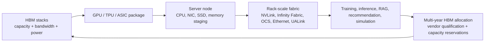

# HBM Customer Ecosystem: NVIDIA, AMD, Google, And Custom Memory Platforms

HBM demand is not created by memory vendors. It is created by accelerator platforms that convert bandwidth into model throughput, time-to-token, training step rate, and datacenter revenue. The customer ecosystem therefore matters as much as the vendor roadmap. NVIDIA, AMD, Google, and custom ASIC builders do not merely "buy HBM"; they set stack count, capacity per stack, base-die customization needs, thermal envelope, qualification schedule, and reservation behavior years before volume shipment. In the AI era, HBM is pulled by named platforms: Blackwell, Rubin, Instinct MI350/MI400, Ironwood TPU, and custom hyperscaler ASICs.

## Why Customers Control The HBM Cycle

The HBM cycle is customer-led because memory attach is designed into the accelerator package. A GPU with eight HBM stacks, a TPU pod with thousands of chips, or a custom inference ASIC with a semi-custom base-die relationship cannot swap memory late in the launch schedule like a server can swap DIMMs. The package floorplan, interposer routing, memory controller, thermal solution, firmware, and reliability model all assume specific HBM behavior. This creates lock-in and long qualification cycles.

The result is a reservation market. April 2026 reporting said Samsung and SK hynix warned AI-driven memory shortages could last until 2027 and beyond, with customers already reserving supply years ahead.[^S077] Micron's June 2026 coverage said its HBM output was sold out through 2026 and that it could satisfy only about 50% to 66% of demand.[^S071] Those two facts explain why HBM pricing and allocation can disconnect from ordinary DRAM cycle behavior. Accelerator customers reserve scarce stacks before the final product launches because missing HBM means missing revenue on a much more expensive compute platform.

HBM allocation also has a hidden engineering component. A purchase commitment is not enough if the HBM has not passed the platform's electrical, thermal, firmware, and reliability qualification. When a memory supplier passes a named platform such as Vera Rubin, it gains access to a much larger demand pool than a generic data-sheet win would imply.[^S059][^S066] That is why HBM market-share changes can happen slowly: each supplier must qualify not only the stack but also the package behavior, test flow, RAS telemetry, and ramp plan.

## NVIDIA: The Platform Setter

NVIDIA is the platform setter because it converts HBM into complete systems: GPUs, CPUs, switches, DPUs, NICs, rack-scale fabrics, software, and customer ecosystems. The March 2024 Blackwell announcement described the GB200 NVL72 as a rack-scale system with 72 Blackwell GPUs, 36 Grace CPUs, liquid cooling, NVLink, and 30 TB of fast memory.[^S058] That framing matters because HBM is not procured for one card; it is procured for a rack that has to train and serve large models economically.

Rubin makes the linkage more explicit. Micron's March 2026 HBM4 report said it had entered high-volume production of 36 GB 12-high HBM4 designed for NVIDIA Vera Rubin, with more than 2.8 TB/s per stack, more than 11 Gb/s pin speeds, a 2.3x bandwidth improvement, and more than 20% better power efficiency versus Micron HBM3E at the same 36 GB 12-high configuration.[^S059] The same report said Micron shipped 48 GB 16-high HBM4 samples and simultaneously brought PCIe 6.0 SSDs and SOCAMM2 modules into volume for the Vera Rubin ecosystem.[^S059] This is the correct unit of analysis: Rubin is a memory ecosystem, not just a GPU.

NVIDIA's supplier strategy is also a market signal. June 2026 reporting said NVIDIA CEO Jensen Huang confirmed Samsung, SK hynix, and Micron had all passed HBM4 certification for Vera Rubin.[^S066] That does not mean equal share, but it means NVIDIA is trying to make HBM4 a multi-supplier platform. For NVIDIA, the strategic goal is to avoid a single memory bottleneck while preserving system performance. For memory vendors, passing certification is only the entry ticket; share depends on volume, yield, power, price, and roadmaps.

Rumored Rubin Ultra changes show how sensitive HBM demand is to package architecture. July 2026 reporting said NVIDIA had reportedly canceled a quad-die Rubin Ultra design in favor of a dual-GPU design because of manufacturing execution concerns; the original design was reported to use 16 HBM4E modules, and the revised design would reduce the HBM4E module requirement per package.[^S089] The report is unofficial, so it should not be treated as confirmed NVIDIA guidance. But it illustrates the mechanism: if an accelerator package changes die count or stack count, HBM demand changes immediately, even if end-customer AI demand remains strong.

NVIDIA also shapes HBM through software. CUDA, TensorRT, NCCL, NVLink, NVSwitch, and full-stack system libraries decide how much memory bandwidth becomes useful work. HBM stack count and capacity matter, but so do kernel tiling, KV-cache handling, collective communication, and memory-aware scheduling. This is why memory vendors want NVIDIA qualification: it validates their HBM inside the software and system environment that dominates AI infrastructure purchasing.

For suppliers, NVIDIA demand is both prize and concentration risk. A supplier that wins a large Rubin allocation can fill premium HBM capacity quickly, but the same supplier becomes exposed to NVIDIA package changes, launch cadence, and procurement leverage. The rumored Rubin Ultra redesign is a good example: if a package moves from a more aggressive HBM4E stack count to a lower-risk design, aggregate HBM demand by that product family can change even while NVIDIA's AI revenue opportunity stays large.[^S089] Memory vendors therefore prefer broad qualification across NVIDIA, AMD, Google, and custom ASIC customers, but NVIDIA remains the most important near-term volume signal.

## AMD: Instinct As The Second Large GPU Pull

AMD is the most important open-market alternative HBM pull because Instinct GPUs compete directly for hyperscale and cloud AI deployments. Public AMD Instinct summaries list MI300X with 192 GB of HBM3, MI325X with 256 GB of HBM3E, and MI350X/MI355X with 288 GB of HBM3E and about 8 TB/s memory bandwidth.[^S090] The MI350 generation matters because it keeps AMD in the high-capacity HBM conversation while NVIDIA transitions through Blackwell and Rubin.

AMD's 2026 roadmap adds HBM4 pressure. January 2026 reporting said AMD unveiled Instinct MI430X, MI440X, and MI455X accelerators and the Helios rack-scale AI architecture, with MI455X racks using 72 GPUs and 31 TB of HBM4 memory.[^S091] The same report described the MI400 family as built for a broad range of infrastructure requirements and tied Helios to Zen 6 EPYC "Venice" CPUs, Infinity Fabric, UALink, and Ultra Ethernet.[^S091] For HBM suppliers, AMD's value is not only unit volume; it is a second platform that can qualify HBM4/HBM4E outside NVIDIA's allocation rules.

AMD's customer pull is becoming more concrete through rack and cloud deals. Earlier reporting said Oracle planned a cluster of 30,000 MI355X AI accelerators, while later MI350-series coverage framed AMD as strengthening both OAM and PCIe deployment paths.[^S092][^S093] These are not all identical HBM demand events, but they indicate AMD is no longer a niche HPC-only HBM customer. As ROCm, PyTorch support, and hyperscaler deployments improve, AMD can turn HBM capacity into a real bargaining lever with memory suppliers.

The software caveat is still important. A February 2026 arXiv benchmarking study of production LLM inference on AMD Instinct MI325X GPUs used an 8-GPU cluster with 2 TB aggregate HBM3E and found that all tested models shared a throughput saturation point consistent with a memory-bandwidth bottleneck, with saturation around roughly 500 concurrent users for short sequences and about 100-200 for longer sequences.[^S094] The study also found that architecture-aware optimization was essential and that some model families benefited from AMD AITER while others required selective disabling.[^S094] The HBM lesson is direct: capacity and bandwidth are necessary, but software decides realized throughput.

AMD's HBM pull is also strategically useful to hyperscalers because it creates negotiating leverage against NVIDIA. A cloud buyer that can deploy MI350 or MI400 racks has an alternative path for HBM capacity, especially if AMD's memory footprint per accelerator stays high. The MI350-series 288 GB HBM3E point and MI400/Helios 31 TB HBM4 rack point mean AMD is competing partly on memory capacity, not only matrix throughput.[^S090][^S091] That can matter for long-context inference, larger batch sizes, and memory-resident model serving.

## Google TPU: HBM As Cloud-Owned Infrastructure

Google is different because TPUs are primarily cloud-owned infrastructure rather than merchant accelerators. That changes the HBM business model. Google can design the accelerator, system interconnect, compiler/runtime, datacenter cooling, and workload mix together. It does not have to sell a PCIe/OAM product to many OEMs; it has to make Google Cloud and internal Google workloads cost-effective.

Ironwood shows the scale. November 2025 reporting said Google's seventh-generation Ironwood TPU delivered 4,614 FP8 TFLOPS, 192 GB of HBM3E, and up to 7.37 TB/s memory bandwidth per chip, with pods scaling to 9,216 accelerators and 42.5 FP8 exaFLOPS.[^S095] September 2025 Hot Chips coverage similarly described Ironwood as a dual-compute-die TPU with eight HBM3E stacks, 192 GB HBM, about 7.3 TB/s bandwidth, and 1.77 PB of HBM across a 9,216-chip pod.[^S096] Those numbers make Google a major indirect HBM customer even when it does not show up in GPU shipment data.

Google's architecture also changes the performance question. A June 2026 arXiv paper by Jouppi, Lakshmanamurthy, Young, and Patterson summarized Google's TPU supercomputers from TPU v2 to Ironwood and reported a 10x increase in HBM capacity and bandwidth per node, a 100x increase in peak node performance, and a 3600x increase in supercomputer performance across the studied generations.[^S097] The paper also emphasized optical circuit switches, built-in self test, hardware replay, resilience, and energy efficiency.[^S097] HBM is one part of a system designed for scale, not a detachable component.

For memory vendors, Google-style custom silicon is attractive but harder to observe. The HBM may be sourced through long private arrangements, customized package flows, and non-public qualification criteria. The buyer is not a card vendor seeking broad market share; it is a hyperscaler trying to optimize internal and cloud workloads. That can make HBM demand less visible but highly sticky once qualified.

Google also shows that customer-owned software can change the required HBM characteristics. A TPU pod that uses optical circuit switching, hardware replay, built-in self test, and stable compiler/runtime assumptions can extract value from HBM differently than a merchant GPU sold into many software environments.[^S097] The memory vendor's product still has to meet capacity, bandwidth, power, and reliability targets, but the customer may optimize the whole stack around known workloads. That can justify custom package and qualification work even if the unit volume is less transparent than NVIDIA GPU shipments.

## Custom HBM And Logic-Die-As-A-Service

HBM4E introduces a new customer model: memory suppliers can provide semi-custom base dies or logic-die features for accelerator customers. Micron's October 2025 HBM4 report explicitly described HBM4E as an extension with customer-specific logic-die customization options, while the March 2026 HBM4 report tied Micron volume shipments to the Vera Rubin ecosystem.[^S002][^S059] Samsung's HBM4 reporting said HBM4E samples were expected later in 2026 and custom HBM samples in 2027.[^S038] This is a structural change.

The logic-die-as-a-service model lets customers customize without owning a DRAM fab. A GPU or ASIC designer may want custom RAS telemetry, power states, PHY tuning, repair policy, memory-partition behavior, or package-floorplan hooks. The DRAM vendor can keep core DRAM dies common while customizing the base die. That protects manufacturing scale while giving strategic customers differentiated behavior. It also increases switching costs because the second source must match both the JEDEC-visible interface and the customer-specific behavior.

This model blurs the line between memory vendor and ASIC partner. In a commodity DRAM model, the customer buys standardized parts. In custom HBM, the customer co-defines part of the memory subsystem. That can support higher margins for memory suppliers, but it also creates customer concentration risk. Engineering teams, packaging capacity, and validation resources will flow to the largest accelerator customers first.

## Customer Demand Matrix

| Customer / platform | Current HBM role | Roadmap pressure | Supplier implication |
|---|---|---|---|
| NVIDIA Blackwell/Rubin | Rack-scale GPU systems; Rubin HBM4 qualification and ecosystem memory modules.[^S058][^S059] | HBM4/HBM4E stack count, 12-high/16-high capacity, power, liquid-cooled racks. | Multi-sourcing across SK hynix, Samsung, Micron, but qualification and volume remain decisive.[^S066] |
| AMD Instinct MI350/MI400 | MI350-class HBM3E; MI400/Helios HBM4 rack-scale roadmap.[^S090][^S091] | ROCm maturity, rack-scale deployments, 288 GB and HBM4-class capacity. | A credible second merchant GPU platform can diversify HBM demand beyond NVIDIA. |
| Google Ironwood TPU | Cloud-owned TPU with 192 GB HBM3E and multi-thousand-chip pods.[^S095][^S096] | Custom silicon, optical switching, internal/cloud workload optimization. | Private qualification and large hyperscaler allocations can absorb major HBM supply quietly. |
| Custom ASICs / hyperscalers | TPU-like, Trainium-like, Maia-like, and other in-house accelerators. | Semi-custom HBM4E base dies, package co-design, inference-optimized memory. | Memory vendors may sell design partnership and validated behavior, not only stacks. |

## Workload Implications

Training and inference stress HBM differently. Training large dense models needs bandwidth for activations, gradients, optimizer state, checkpointing, and collective communication. Inference stresses KV cache, batch size, context length, MoE routing, retrieval augmentation, and time-to-token. The AMD MI325X study's memory-bandwidth saturation finding is a useful reminder that even with 2 TB aggregate HBM3E in an 8-GPU system, software and workload shape the ceiling.[^S094]

This matters for HBM mix. A platform optimized for training may want maximum aggregate bandwidth and interconnect. A platform optimized for inference may value capacity per accelerator, bandwidth per watt, and predictable latency under long-context workloads. Google Ironwood being described as primarily inference-focused, while still scaling into very large pods, shows how HBM demand can grow even when the workload shifts away from classic training.[^S096]

HBM demand also interacts with SSDs, CXL, and host memory. Rubin ecosystem reporting tied HBM4 to PCIe 6.0 SSDs and SOCAMM2 modules, showing that the full memory hierarchy matters.[^S059] HBM holds the hottest working set; host memory, SSDs, and networked storage stage larger context, datasets, checkpoints, and retrieval stores. That hierarchy is why the customer ecosystem file links forward to the HBF and CXL sections rather than treating HBM as the only memory tier.

## Model Memory Economics

The customer reason to pay for HBM is utilization. An AI accelerator is expensive, power-hungry, and often deployed inside a rack whose networking, cooling, and real-estate costs are also high. If insufficient HBM bandwidth stalls tensor units or insufficient HBM capacity forces smaller batches, more offload, or lower context length, the customer loses value from the entire system. That is why HBM can command high margins: it protects the utilization of even more expensive compute.

Memory economics differ by workload. Training often spreads a model across many accelerators and depends on interconnect plus HBM bandwidth. Long-context inference can be limited by KV-cache capacity and memory bandwidth per generated token. Mixture-of-experts inference can be limited by routing imbalance, expert weights, and irregular memory access. Retrieval-augmented generation can push part of the memory burden into SSDs and databases, but the selected context and active model state still land in HBM. The same 192 GB or 288 GB memory footprint can therefore have different value depending on model architecture and serving policy.

This is why HBM capacity per accelerator is becoming a selling point. AMD moved from MI300X's 192 GB to MI325X's 256 GB and MI350-class 288 GB public figures, while Google Ironwood publicly sits at 192 GB HBM3E per chip and NVIDIA Rubin ecosystem reporting emphasizes HBM4 stacks plus CPU/SSD/SOCAMM2 memory hierarchy.[^S090][^S095][^S059] The race is not only to maximize per-stack bandwidth; it is to keep enough model state close enough to compute that the platform can serve the desired workload economically.

## Supplier Qualification Funnel

HBM customers effectively run a qualification funnel. The first stage is technical sampling: the stack must meet basic capacity, speed, power, and signal requirements. The second stage is package integration: the HBM must work with the interposer, substrate, cooling solution, and accelerator floorplan. The third stage is system validation: memory errors, thermal throttling, repair behavior, and firmware telemetry must behave under long workloads. The fourth stage is supply validation: the customer must believe the supplier can ship enough qualified stacks on the required schedule.

This funnel explains why public claims about "passing certification" are meaningful but incomplete. Passing HBM4 certification for a platform such as Vera Rubin indicates that the supplier is technically eligible, but actual allocation still depends on cost, yield, volume, stack height, power, and customer risk management.[^S066] It also explains why new entrants cannot quickly appear in HBM even if they can make DRAM. The hard part is not only building a fast memory die; it is passing the entire funnel at the cadence of a major AI platform launch.

## Commercial Takeaways

The first takeaway is that HBM suppliers are increasingly selected by platform roadmaps, not spot pricing. NVIDIA, AMD, and Google need multi-year alignment because a missed HBM ramp can delay accelerators, racks, and cloud revenue. That gives HBM vendors pricing power, but it also raises the cost of failure.

The second takeaway is that customer diversification matters. SK hynix's leadership is strongest while NVIDIA demand is extreme, but Samsung and Micron can gain share if they pass HBM4/HBM4E qualification and deliver enough volume.[^S066] AMD and Google provide additional pull that can validate suppliers outside NVIDIA. Custom ASICs can create smaller but stickier memory programs.

The third takeaway is that custom HBM makes the customer relationship more like a co-design engagement. HBM4E base-die customization, thermal co-design, package-specific qualification, and software-visible RAS behavior all increase switching costs.[^S002][^S038][^S059] That can create better economics for memory vendors, but it also concentrates engineering resources around a small number of elite customers.

The bottom line is that the HBM market is no longer a simple DRAM subsegment. It is the memory layer of the AI accelerator ecosystem. The winners will be the memory suppliers that qualify inside the platforms customers actually deploy, and the customers with secured HBM allocations will have a material advantage in shipping AI capacity.

## Sources

[^S002]: Micron takes the HBM lead with fastest ever HBM4 memory with a 2.8TB/s bandwidth, TechRadar, published 2025-10-02, https://www.techradar.com/pro/micron-takes-the-hbm-lead-with-fastest-ever-hbm4-memory-with-a-2-8tb-s-bandwidth-putting-it-ahead-of-samsung-and-sk-hynix
[^S038]: Samsung says it took the leap with HBM4, TechRadar, published 2026-02-13, https://www.techradar.com/pro/samsung-says-it-took-the-leap-with-hbm4-as-it-starts-shipping-faster-ai-memory-built-on-advanced-process-nodes
[^S058]: NVIDIA Blackwell Platform Arrives to Power a New Era of Computing, NVIDIA Newsroom, published 2024-03-18, https://nvidianews.nvidia.com/news/nvidia-blackwell-platform-arrives-to-power-a-new-era-of-computing
[^S059]: Micron enters high-volume production of HBM4 for Nvidia Vera Rubin, Tom's Hardware, published 2026-03-16, https://www.tomshardware.com/pc-components/dram/micron-enters-high-volume-production-of-hbm4-for-nvidia-vera-rubin
[^S066]: SK hynix passes Samsung as South Korea's most valuable company, Tom's Hardware, published 2026-06-23, https://www.tomshardware.com/tech-industry/sk-hynix-passes-samsung-as-south-koreas-most-valuable-company-on-hbm-demand
[^S071]: The extraordinary rise of chipmaker Micron, The Times, published 2026-06-28, https://www.thetimes.com/business/technology/article/micron-semiconductor-ai-stock-volatile-7ftpl8v2j
[^S077]: Samsung and SK hynix warn AI-driven memory shortages could last until 2027 and beyond, Tom's Hardware, published 2026-04-30, https://www.tomshardware.com/tech-industry/artificial-intelligence/samsung-and-sk-hynix-warn-ai-driven-memory-shortages-could-last-until-2027-and-beyond-as-hbm-demand-explodes-customers-already-reserving-supply-years-ahead-while-the-wider-dram-market-begins-to-tighten
[^S089]: Nvidia reportedly cancels quad-die Rubin Ultra GPU in favor of dual-GPU design, Tom's Hardware, published 2026-06-30, exact day inferred from relative publication age, https://www.tomshardware.com/tech-industry/artificial-intelligence/nvidia-reportedly-cancels-quad-die-rubin-ultra-gpu-in-favor-of-dual-gpu-design-report-claims-complex-design-purportedly-scrapped-over-manufacturing-execution-concerns
[^S090]: AMD Instinct overview, Wikipedia, Crawled 2026-01, no stable page publish date listed, https://en.wikipedia.org/wiki/AMD_Instinct
[^S091]: AMD touts Instinct MI430X, MI440X, MI455X and Helios rack-scale AI architecture, Tom's Hardware, published 2026-01, exact day not captured in accessed search result, https://www.tomshardware.com/tech-industry/artificial-intelligence/amd-touts-instinct-mi430x-mi440x-and-mi455x-ai-accelerators-and-helios-rack-scale-ai-architecture-at-ces-full-mi400-series-family-fulfills-a-broad-range-of-infrastructure-and-customer-requirements
[^S092]: AMD signs multi-billion-dollar Oracle deal for MI355X AI accelerator cluster, TechRadar, published 2024-12, exact day not captured in accessed search result, https://www.techradar.com/pro/amd-just-signed-a-huge-multi-billion-dollar-deal-with-oracle-to-build-a-cluster-of-30-000-mi355x-ai-accelerators
[^S093]: AMD announces MI350P PCIe AI accelerator card with 144GB HBM3E, Tom's Hardware, published 2026-06, exact day not captured in accessed search result, https://www.tomshardware.com/pc-components/gpus/amd-announces-mi350p-pcie-ai-accelerator-card-with-144gb-of-hbm3e-roughly-40-percent-faster-in-fp16-and-fp8-theoretical-compute-compared-to-nvidias-h200-nvl-competitor
[^S094]: Architecture-Aware LLM Inference Optimization on AMD Instinct GPUs, arXiv, published 2026-02-27, https://arxiv.org/abs/2603.10031
[^S095]: Google deploys Axion CPUs and seventh-gen Ironwood TPU, Tom's Hardware, published 2025-11-06, https://www.tomshardware.com/tech-industry/artificial-intelligence/google-deploys-new-axion-cpus-and-seventh-gen-ironwood-tpu-training-and-inferencing-pods-beat-nvidia-gb300-and-shape-ai-hypercomputer-model
[^S096]: Google's Ironwood TPU supercomputer has 1.77PB combined memory, TechRadar, published 2025-09-04, https://www.techradar.com/pro/googles-most-powerful-supercomputer-ever-has-a-combined-memory-of-1-77pb-apparently-a-new-world-record-for-shared-memory-multi-CPU-setups
[^S097]: Google's Training Supercomputers from TPU v2 to Ironwood, arXiv, published 2026-06-14, https://arxiv.org/abs/2606.15870
