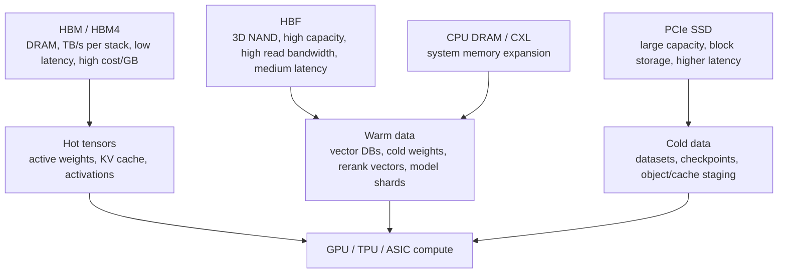
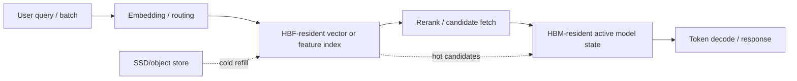

# High Bandwidth Flash Overview: NAND Between HBM And SSD

High Bandwidth Flash is an emerging attempt to move NAND closer to the accelerator memory hierarchy. It is not HBM, because it is NAND-based and therefore has much higher latency than DRAM. It is not a conventional SSD either, because the goal is to expose far higher bandwidth, lower protocol overhead, and tighter accelerator integration than storage-class PCIe drives. The investable idea is a new tier: terabyte-scale non-volatile capacity that sits closer to GPU/TPU memory than SSDs, while costing and scaling more like NAND than HBM.

## Definition And Motivation

HBF exists because AI inference has a memory-capacity problem that HBM alone cannot solve economically. HBM is excellent for hot data, but it is expensive, supply constrained, power dense, and package-area constrained. Conventional SSDs are cheap and dense, but the software and protocol path through PCIe/NVMe, host DRAM, CPU involvement, and block granularity can be too slow for latency-sensitive inference or retrieval-heavy workloads. HBF targets the gap.

Public reporting in 2026 described HBF as a NAND-based standard targeted at inference AI servers, positioned between HBM DRAM and conventional NAND SSDs.[^S098] Earlier 2025 reporting on the SanDisk/SK hynix partnership described HBF as combining NAND flash with high-bandwidth characteristics and potentially offering 8x to 16x higher capacity than DRAM-based HBM.[^S099] Those claims should be treated as directionally useful but not final product guarantees. HBF is still emerging, and implementation details such as interface, controller topology, host integration, software stack, endurance management, and production timing remain decisive.

The economic motivation is straightforward. A frontier AI inference system may have enough compute and HBM bandwidth for the active computation but still struggle with model state, retrieval vectors, embeddings, cache spillover, and large context data. If all of that must live in HBM, the system becomes too expensive and HBM supply becomes the limiting factor. If it lives in ordinary SSDs, retrieval and data movement can dominate latency. HBF tries to put a high-capacity NAND tier closer to the accelerator so more data stays on-device or near-device.

## Architecture Concept

The HBF architecture concept has three parts. First, it uses 3D NAND as the capacity medium. NAND is dense, non-volatile, and far cheaper per bit than DRAM. Second, it raises bandwidth by changing packaging, controller topology, interface width, signaling, parallelism, or all of the above. Third, it expects software to treat the device as something closer to memory-adjacent storage than a generic SSD.

Kioxia's 2025 prototype illustrates the direction. Tom's Hardware reported a 5 TB High Bandwidth Flash module capable of 64 GB/s over PCIe 6.0, using a familiar SSD-like form factor, daisy-chained controllers, PAM4 signaling, a local controller, and less than 40 W power draw.[^S047] The report explicitly noted that HBF latency would remain higher than DRAM-based HBM but argued that the bandwidth and capacity could fit AI workloads that need large-volume streaming rather than ultra-low-latency random DRAM access.[^S047]

Academic work points to a more radical on-package direction. A March 2026 arXiv paper proposed HAVEN, a High-Bandwidth Flash Augmented Vector Engine for approximate nearest-neighbor search, describing HBF as die-stacked 3D NAND engineered to deliver terabyte-scale capacity and hundreds of GB/s read bandwidth.[^S100] HAVEN modeled HBF as an on-package complement to HBM so a full-precision vector database could reside on-device, eliminating PCIe and DDR bottlenecks during reranking.[^S100] That is more aggressive than a PCIe module, but it clarifies the north star: HBF is most valuable when it removes off-accelerator movement.

The controller location is the central architectural choice. A PCIe-attached HBF module can reuse server infrastructure and may look like a faster SSD to the system, but it still pays some protocol and topology overhead. A package-adjacent HBF device can sit much closer to the accelerator, but it raises packaging, cooling, serviceability, and qualification complexity. An on-package HBF tier, like HAVEN's modeled complement to HBM, offers the best opportunity to eliminate host-memory movement, but it is also the hardest path because the flash controller, ECC, thermal design, power delivery, and failure management become part of the accelerator package.[^S100]

HBF bandwidth also depends on internal parallelism. NAND is slow at the cell level relative to DRAM, but modern 3D NAND has many planes, dies, channels, and packages that can be operated in parallel. HBF's practical bandwidth comes from exploiting that parallelism while hiding read latency. That is why controller topology, page scheduling, ECC pipeline design, and buffer sizing are not implementation details; they are the product. A badly scheduled HBF device can have impressive aggregate bandwidth on paper and still underperform on real vector-search or model-serving workloads.

The final architecture point is data granularity. HBM can serve cache-line-like accesses at low latency. NAND wants page/block-oriented access and requires ECC, read-retry, and wear management. HBF software must group, prefetch, compress, and align data so the device streams useful information rather than wasting bandwidth on over-fetch. The better the workload can be reshaped into large parallel reads, the more HBF looks like a memory tier. The more it requires small, unpredictable, latency-critical reads, the more HBF behaves like storage.

## Where HBF Fits In The Hierarchy

HBF should be placed between HBM and SSDs, not above HBM. HBM remains the tier for active compute: tensor weights in the current layer, activations, gradients, optimizer state, and hot KV cache. HBF is more plausible for warm data: large vector indexes, cold model weights, sparse expert weights, retrieval documents after embedding, multimodal features, and spillover data that must be read quickly but does not require DRAM latency. SSDs remain the tier for colder data, checkpoints, datasets, object storage staging, and less latency-sensitive retrieval.

The distinction matters because HBF will not make every AI workload faster. A dense matrix multiplication kernel that repeatedly streams hot weights from HBM will not benefit from NAND latency. A retrieval-augmented generation pipeline that spends time moving vectors from SSDs to CPU DRAM to GPU HBM may benefit if HBF keeps those vectors closer to the accelerator. A recommendation system with large embedding tables could benefit if access patterns are sufficiently bandwidth-oriented and software can hide latency. A training job dominated by all-reduce and HBM-resident activations may see less direct impact.

## TCO Rationale For Inference

The HBF TCO argument begins with HBM scarcity. HBM is an expensive use of leading-edge DRAM wafers, TSV stacking, advanced packaging, and platform qualification. AI memory demand has already spilled into broader DRAM shortages, with 2026 reporting saying customers were reserving HBM supply years ahead.[^S077] If HBF can reduce the amount of HBM needed for cold or warm data, it can improve system-level cost even if HBF itself is more expensive than conventional NAND.

The second TCO lever is power. Moving data from SSDs through CPU memory into GPU HBM consumes energy and adds latency. A near-accelerator flash tier can reduce round trips over the host I/O path. Kioxia's prototype reporting emphasized sub-40 W operation for a 5 TB, 64 GB/s module.[^S047] HAVEN's modeling claimed that HBF-augmented GPUs could improve reranking throughput by up to 20x and latency by up to 40x for billion-scale vector datasets compared with GPU-DRAM and GPU-SSD systems.[^S100] Those are research/modeling results, not shipped-system benchmarks, but they frame why inference architects care.

The third TCO lever is capacity per package or node. If HBF provides 8x to 16x the capacity of HBM as described in public SanDisk/SK hynix reporting, then an accelerator node can hold far larger retrieval indexes or model-adjacent data without increasing HBM stack count.[^S099] That is valuable because HBM stack count increases package area, interposer complexity, thermal load, and supply risk. HBF can be a pressure-release valve if software can tolerate its latency.

The fourth lever is utilization. Inference infrastructure earns money when it serves tokens or useful results. If retrieval or cold-weight movement stalls GPUs, the platform wastes expensive compute. HBF is attractive when it converts idle compute time into served work by keeping more data locally accessible. That is the same economic logic that made HBM valuable, but HBF targets a different temperature band of the memory hierarchy.

There is also a supply-chain TCO argument. HBM consumes leading-edge DRAM wafers and advanced packaging capacity, both of which are constrained in the 2026 cycle.[^S077] NAND capacity is still cyclical, but it is a different manufacturing base with different cost-per-bit economics. If HBF can shift some inference memory pressure from DRAM to NAND, it can create a release valve for systems that need capacity more than nanosecond-class latency. That does not reduce HBM demand for the active model path; it can reduce the need to overprovision HBM for data that is warm rather than hot.

HBF can also change the node design. A GPU server today may use HBM on the accelerator, DDR/CXL memory near the CPU, NVMe SSDs for local storage, and network storage for datasets. HBF creates an intermediate tier that can be attached per accelerator, per baseboard, or per rack. The most cost-effective topology will depend on sharing: per-accelerator HBF maximizes locality, while pooled HBF improves utilization but adds fabric latency and scheduling complexity. The right answer may differ for RAG, recommendation, sparse MoE inference, and edge devices.

## Software Requirements

HBF is not likely to be plug-and-play. Software must decide what lives in HBM, what lives in HBF, and what remains on SSD or host memory. Runtime systems need prefetching, placement, cache admission, eviction policy, error handling, wear awareness, compression, and model-aware scheduling. The device interface also matters: a block-storage abstraction may leave too much performance on the table, while a memory-like abstraction may require new programming models and coherence rules.

The HAVEN paper is useful because it focuses on approximate nearest-neighbor search and reranking, not generic storage acceleration. It identifies full-precision vector reranking as a bottleneck when billion-scale vector databases cannot fit in GPU HBM and must reside in CPU DRAM or SSDs.[^S100] HBF helps in that model because the workload has large read-heavy datasets, structured access, and an obvious performance penalty from off-GPU movement. That is a better fit than workloads with tiny random updates or latency-critical single-word reads.

Another 2026 arXiv paper, NVLLM, proposed a 3D NAND-centric architecture for edge on-device LLM inference that offloads feed-forward network computation into flash while executing attention on lightweight CMOS logic with external DRAM.[^S101] NVLLM is not identical to HBF standardization, but it supports the broader thesis that NAND can move from passive storage toward memory-adjacent or compute-adjacent roles in AI inference.[^S101] It also highlights the need for ECC, buffers, page-level access, and schedulers because NAND's physical access granularity and endurance model differ sharply from DRAM.

Software also needs placement policy. Candidate data classes include vector embeddings, compressed expert weights, tokenizer or embedding tables, cold layers for model swapping, document chunks, image/video features, and rerank candidates. Each class has a different read/write ratio and tolerance for latency. HBF-aware runtimes will need to profile access frequency and move data between HBM, HBF, host memory, and SSDs. That looks more like a memory manager than a conventional filesystem.

Security and multi-tenant isolation matter too. If HBF stores retrieval indexes or customer-specific model weights close to accelerators, cloud providers need encryption, secure erase, namespace isolation, telemetry, and predictable quality of service. Conventional SSDs already have management models for some of these issues, but HBF may need accelerator-aware interfaces. A tenant should not be able to infer another tenant's access patterns through shared HBF contention, and a failed HBF component should not corrupt a model-serving pipeline silently.

## Vendor And Ecosystem Positions

SanDisk and SK hynix are the most visible HBF standardization names in public reporting. The 2026 announcement described them as jointly introducing HBF and targeting Open Compute Project governance for AI inference servers.[^S098] The earlier 2025 report described a memorandum of understanding to standardize HBF, with SanDisk's work building on BiCS NAND and CBA wafer bonding and first hardware integrations expected by early 2027.[^S099] These details belong in the standardization file, but the overview takeaway is that HBF is being positioned as an ecosystem standard, not a single proprietary SSD.

Kioxia is the most visible prototype demonstrator in the sources used here. Its 5 TB, 64 GB/s, sub-40 W module shows one implementation path: an SSD-like physical form factor with much higher bandwidth and a more direct memory-bus story.[^S047] That approach may be easier to adopt than a fully on-package HBF architecture, but it may also leave more latency and protocol overhead in the path. The market may end up with multiple HBF-like tiers: PCIe module HBF, package-adjacent HBF, and eventually logic-integrated flash.

Samsung and other NAND suppliers are relevant because they have 3D NAND scale, packaging capability, and AI-memory motivation. Public HBF reporting mentions Samsung among companies pursuing related emerging alternatives, though the specific standardization leadership in the sources here is SanDisk/SK hynix.[^S098] The competitive question is whether HBF becomes an open-enough standard that multiple NAND vendors can supply, or whether early implementations are tied to vendor-specific controllers and packaging.

## Adoption Roadmap

The first adoption phase is likely developer and hyperscaler experimentation. HBF needs workload proof before broad deployment, so early tests should focus on RAG/vector search, recommendation, cold-weight staging, and large embedding tables. Kioxia's prototype and HAVEN's modeling both point toward bandwidth-heavy read scenarios rather than general storage replacement.[^S047][^S100]

The second phase is system integration. HBF has to appear in a form that server vendors and accelerator vendors can route, cool, power, and manage. PCIe 6.0 modules may be easiest to trial because they resemble SSD deployment, but package-adjacent HBF could be more valuable if the software stack can exploit locality. Standardization through OCP can help here because hyperscalers prefer manageable, interoperable components.[^S098][^S099]

The third phase is runtime adoption. HBF will need placement APIs, monitoring, benchmarking, and model-serving framework support. Without runtime awareness, HBF risks becoming a fast but underused storage device. With runtime awareness, it can become part of the AI memory hierarchy: HBM for hot tensors, HBF for warm model-adjacent data, and SSD/object storage for cold capacity.

The benchmark suite also matters. Sequential bandwidth alone will not validate HBF. Useful tests need vector reranking, long-context serving, embedding-table lookups, mixed read sizes, concurrent tenants, thermal throttling, and recovery after device errors. Otherwise vendors can optimize for headline GB/s while missing the workload behavior that justifies a new tier.

That workload realism will decide whether HBF becomes infrastructure or remains a niche accelerator experiment.

## Risks And Open Questions

The first risk is latency. NAND cannot behave like DRAM. HBF can raise bandwidth, parallelism, and locality, but random-read latency and access granularity remain fundamental constraints. Software must avoid placing truly hot data in HBF. If HBF is marketed as "HBM replacement," expectations will be wrong; the correct framing is HBM complement.

The second risk is endurance. Inference workloads can be read-heavy, which is favorable for NAND, but cache churn, frequent updates, vector-index rebuilds, and write amplification still matter. HBF devices need robust wear leveling, ECC, bad-block management, and telemetry. If HBF moves closer to the accelerator package, serviceability becomes harder than replacing an SSD.

The third risk is interface fragmentation. If HBF attaches through PCIe, CXL, proprietary memory buses, or on-package links, software support will differ. A standard under OCP can help, but the useful standard must define enough of the device model, telemetry, management, security, and performance behavior to let cloud operators deploy HBF at scale.

The fourth risk is workload fit. HBF is promising for RAG, vector search, recommendation, sparse expert storage, and cold-weight staging. It is less obvious for dense training kernels or latency-critical hot-cache paths. If AI model architectures change in ways that reduce retrieval pressure or compress model state more effectively, HBF demand could shift. Conversely, longer context windows and larger multimodal retrieval systems could make HBF more valuable.

The fifth risk is operational complexity. Datacenter operators already manage GPUs, CPUs, NICs, SSDs, CXL memory, liquid cooling, firmware, drivers, and workload schedulers. HBF adds another failure domain and another optimization surface. To be adopted at scale, it must expose health telemetry, predictive failure data, error counters, temperature data, bandwidth counters, namespace controls, and fleet-management hooks. A fast prototype is not enough; hyperscalers need a device that can be monitored, updated, isolated, and replaced without destabilizing AI clusters.

The sixth risk is standard timing. Public reporting points to OCP governance and early hardware integrations, but the gap between a memorandum of understanding, a technical advisory board, prototype hardware, and broad commercial deployment can be large.[^S098][^S099] HBF will need multiple vendors, interoperable software, clear management interfaces, and credible workload benchmarks. Without that ecosystem, it risks becoming a set of vendor-specific fast-flash modules rather than a durable memory tier.

## Bottom Line

HBF is an attempt to create a memory-adjacent NAND tier for AI inference. Its value proposition is not that it beats HBM on latency or SSDs on cost. It is that it can provide much more capacity than HBM and much more accelerator-relevant bandwidth than conventional SSDs. The near-term commercial question is whether standardization, software support, and early hardware can turn that middle tier into a deployable product.

For the database, HBF should be tracked as a potential pressure valve for HBM scarcity and a NAND growth vector. The next file, [02-hbf-standardization.md](02-hbf-standardization.md), covers the OCP/SanDisk/SK hynix standardization path, BiCS9/CBA context, and sample/production timeline. The comparison file then weighs HBF directly against HBM and CXL across bandwidth, capacity, latency, cost, and workload fit.

## Sources

[^S047]: Kioxia's new 5TB, 64 GB/s flash module puts NAND toward the memory bus for AI GPUs, Tom's Hardware, published 2025-08-23, https://www.tomshardware.com/pc-components/gpus/kioxias-new-5tb-64-gb-s-flash-module-puts-nand-toward-the-memory-bus-for-ai-gpus-hbf-prototype-adopts-familiar-ssd-form-factor
[^S077]: Samsung and SK hynix warn AI-driven memory shortages could last until 2027 and beyond, Tom's Hardware, published 2026-04-30, https://www.tomshardware.com/tech-industry/artificial-intelligence/samsung-and-sk-hynix-warn-ai-driven-memory-shortages-could-last-until-2027-and-beyond-as-hbm-demand-explodes-customers-already-reserving-supply-years-ahead-while-the-wider-dram-market-begins-to-tighten
[^S098]: SK hynix and SanDisk announce High Bandwidth Flash standard for inference AI servers, Tom's Hardware, published 2026-02, exact day not captured in accessed search result, https://www.tomshardware.com/pc-components/ssds/sk-hynix-and-sandisk-announce-new-high-bandwidth-flash-speedy-hbf-standard-is-targeted-at-inference-ai-servers
[^S099]: SanDisk and SK hynix standardize High Bandwidth Flash memory, Tom's Hardware, published 2025-08, exact day not captured in accessed search result, https://www.tomshardware.com/tech-industry/sandisk-and-sk-hynix-join-forces-to-standardize-high-bandwidth-flash-memory-a-nand-based-alternative-to-hbm-for-ai-gpus-move-could-enable-8-16x-higher-capacity-compared-to-dram
[^S100]: HAVEN: High-Bandwidth Flash Augmented Vector Engine for Large-Scale Approximate Nearest-Neighbor Search Acceleration, arXiv, published 2026-03-01, https://arxiv.org/abs/2603.01175
[^S101]: NVLLM: A 3D NAND-Centric Architecture Enabling Edge on-Device LLM Inference, arXiv, published 2026-04-28, https://arxiv.org/abs/2604.25699
