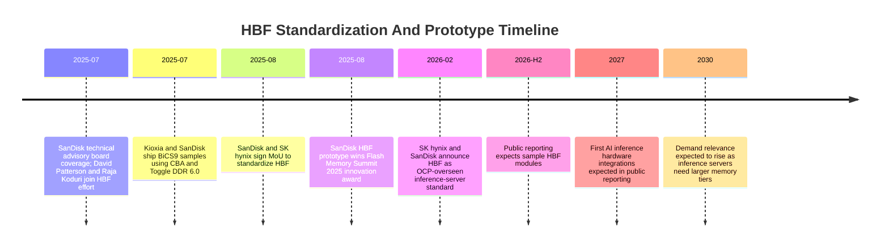

# HBF Standardization: OCP, SanDisk, SK hynix, BiCS, And The Path To AI Inference Hardware

High Bandwidth Flash standardization is the attempt to turn a promising fast-NAND concept into a deployable AI infrastructure component. The problem is not only whether NAND can be made faster. It is whether accelerator vendors, hyperscalers, memory suppliers, controller vendors, and server OEMs can agree on enough of the interface, device model, management plane, reliability behavior, and software stack to make HBF usable across platforms. Without standardization, HBF risks becoming a collection of vendor-specific fast-flash modules. With credible standardization, it could become the warm-memory tier between HBM and SSDs described in [01-hbf-overview.md](01-hbf-overview.md).

## What Has To Be Standardized

HBF cannot be standardized by copying NVMe or HBM alone. NVMe assumes a storage device model, queues, namespaces, and block-oriented management. HBM assumes package-local DRAM with very wide, low-latency links and accelerator memory controllers. HBF sits between those worlds. It needs a device model that can expose high read bandwidth and high capacity without pretending NAND has DRAM latency.

The minimum standard likely has five parts. First, it needs a physical/electrical interface: module form factor, lanes, signaling, power budget, and thermal envelope. Kioxia's 2025 HBF prototype used a familiar SSD-like form factor, PCIe 6.0, PAM4 signaling, daisy-chained controllers, and less than 40 W power draw for a 5 TB / 64 GB/s module.[^S047] That is one path, but not necessarily the final standard.

Second, HBF needs a logical access model. If the device only looks like a block SSD, software may not exploit its memory-adjacent potential. If it looks too memory-like, the system must define coherency, ordering, error handling, and access granularity. The standard must decide whether HBF is exposed as block storage, byte-addressable memory, a specialized accelerator-attached device, or a hybrid model.

Third, HBF needs management telemetry. Datacenter operators will need temperature, media wear, error rates, bandwidth counters, throttling status, namespace health, firmware versioning, security state, and predictive failure data. Without that, HBF cannot be fleet-managed like SSDs or accelerator cards. Standardization under the Open Compute Project is relevant because OCP participants care about deployability and fleet operations, not only component specifications.[^S098]

Fourth, HBF needs software contracts. Placement APIs, prefetch hints, cache policies, tensor/runtime integration, vector database integration, and model-serving framework hooks may matter as much as raw bandwidth. The HAVEN paper modeled HBF as an on-package complement to HBM for vector reranking, eliminating PCIe and DDR bottlenecks during full-precision vector access.[^S100] A standard must enable that class of software optimization rather than bury HBF behind generic slow-path storage interfaces.

Fifth, HBF needs reliability and serviceability rules. NAND requires ECC, bad-block management, read-retry, wear leveling, and power-loss handling. HBF will need to expose those behaviors in a way that AI runtimes can tolerate. A silent HBF data error in a vector database or model-weight store can degrade inference quality, not just corrupt a file.

## SanDisk And SK hynix: From MoU To OCP Framing

The public standardization path starts with SanDisk and SK hynix. In August 2025, Tom's Hardware reported that SanDisk and SK hynix had signed a memorandum of understanding to collaborate on HBF standardization, describing HBF as NAND flash built into HBM-like packages and designed to offer 8x to 16x the capacity of DRAM-based HBM.[^S099] The same report said SanDisk's prototype used BiCS NAND and CBA wafer bonding, received a Flash Memory Summit 2025 "Most Innovative Technology" award, and that sample HBF modules were expected in the second half of 2026 with first AI inference hardware integrations anticipated in early 2027.[^S099]

In February 2026, Tom's Hardware reported that SK hynix and SanDisk had jointly announced HBF as a memory standard targeted at inference AI servers and that the standard would be overseen by the Open Compute Project.[^S098] The same report positioned HBF between HBM DRAM and flash SSDs and described it as a supportive layer for future inference systems rather than a finished HBM replacement.[^S098] The OCP reference is the most important standardization clue because it points toward open datacenter deployment rather than a single-vendor proprietary module.

The supplier pairing is strategically meaningful. SanDisk brings NAND and flash-system expertise, including BiCS and CBA lineage through its long-standing Kioxia partnership.[^S005][^S099] SK hynix brings HBM leadership, AI-customer relationships, DRAM/HBM packaging credibility, and systems relevance in accelerator memory.[^S066][^S067] HBF needs both worlds: flash density and HBM-like proximity to accelerators.

## Technical Advisory Board

SanDisk's Technical Advisory Board gives the HBF effort architectural credibility. July 2025 TechRadar reporting said Professor David Patterson and Raja Koduri joined SanDisk's HBF Technical Advisory Board, with Patterson to lead the board and Koduri bringing GPU architecture experience.[^S102] The report described HBF as using BiCS flash, CBA wafer bonding, dense die stacking, and compatibility with HBM's interface while requiring minimal protocol changes.[^S102] A separate Tom's Hardware report on July 25, 2025 said Raja Koduri joined the board and described HBF as potentially enabling up to 4 TB of VRAM on AI cards, using multiple 3D NAND flash dies connected through TSVs and a logic die.[^S103]

These claims should be treated as advisory-board and concept-stage framing, not validated production specs. But the people involved matter. Patterson's background in RISC, RAID, and datacenter architecture and Koduri's history with GPU memory systems make HBF more likely to be shaped around real system bottlenecks rather than only NAND supplier preferences.[^S102][^S103] Standardization needs that perspective because the hardest HBF questions are system questions: which data lives there, which software controls placement, how failure is handled, and which workloads justify the tier.

## BiCS9, CBA, And NAND Technology Context

HBF's standardization depends on NAND process and bonding technology. Kioxia and SanDisk's July 2025 BiCS9 sample announcement is relevant because BiCS9 uses CMOS directly Bonded to Array technology, where logic and memory-cell wafers are fabricated separately and then bonded into a single package.[^S005] The same report said BiCS9 uses a hybrid design combining a mature 112-layer BiCS5 structure with CBA and a Toggle DDR 6.0 interface, reaching up to 4.8 Gb/s and improving write speed, read speed, and power efficiency versus prior designs.[^S005]

The HBF sources do not confirm that HBF uses exactly BiCS9; the August 2025 report explicitly said SanDisk did not confirm whether the HBF prototype used the same generation it had worked on with Kioxia.[^S099] That caveat matters. The safe conclusion is narrower: HBF relies on SanDisk's BiCS/CBA know-how, and BiCS9 shows the broader NAND platform direction that can support higher-performance AI storage and memory-adjacent products.[^S005][^S099]

CBA is strategically important because it separates memory-array fabrication from logic fabrication. That is analogous in spirit to HBM base-die logic, though the technologies differ. For HBF, controller logic, ECC, buffers, scheduling, and interface circuits may need to be optimized separately from NAND-cell arrays. CBA gives NAND vendors a route to better couple memory and logic without forcing both onto the same process compromise.

## Open Compute Project Role

OCP involvement signals that HBF is being pitched to hyperscale infrastructure, not only to component buyers. OCP-style standards are useful when large cloud operators want interoperable hardware, common management interfaces, thermal/mechanical discipline, and supplier diversity. The February 2026 HBF report said the standard would be overseen by OCP and aimed at inference AI servers.[^S098]

For HBF, OCP could define several practical layers. A mechanical spec could define module size, connector, power delivery, and cooling. An electrical spec could define PCIe/CXL-like link behavior or a new high-bandwidth memory-adjacent interface. A management spec could define telemetry and security. A software spec could define placement hints or runtime-access semantics. A benchmark spec could define workloads such as vector search, long-context inference, and recommendation.

The benchmark piece is especially important. HBF can look good on sequential bandwidth while still failing real inference workloads. OCP has an incentive to push for workload-relevant benchmarks because hyperscalers will not deploy a new tier unless it improves total system cost. The overview file argued that useful benchmarks need vector reranking, long-context serving, embedding-table lookups, mixed read sizes, concurrent tenants, thermal throttling, and recovery after errors. Standardization can turn those into common evaluation expectations.

## Standards Checklist

| Standard layer | Why it matters | Open question |
|---|---|---|
| Mechanical form factor | Determines whether HBF can be serviced like SSDs, mounted near accelerators, or integrated on package. | Does the first standard favor PCIe-like modules, accelerator baseboard modules, or multiple profiles? |
| Electrical interface | Defines bandwidth, latency overhead, signal integrity, and backward compatibility. | Is PCIe 6.0 sufficient for early deployment, or does HBF need a more memory-like link? |
| Access semantics | Determines whether software treats HBF as block storage, memory, cache, or accelerator-attached scratch capacity. | Can a common model support both vector search and cold-weight staging? |
| Management telemetry | Enables fleet monitoring, failure prediction, thermal policy, and security. | Does OCP define mandatory health counters and namespace controls? |
| Reliability model | NAND needs ECC, bad-block management, read-retry, and wear reporting. | How much media behavior is exposed to AI runtimes versus hidden by controllers? |
| Security model | HBF may store customer embeddings, model weights, or retrieval data. | Are encryption, secure erase, tenant isolation, and attestation part of the base spec? |
| Benchmark suite | Prevents vendors from optimizing only for sequential bandwidth. | Which inference workloads become the acceptance tests? |

This checklist is where HBF differs from ordinary NAND product launches. A fast SSD can ship with vendor firmware and standard NVMe behavior. HBF wants to become part of the accelerator memory hierarchy, so the standard has to cover more than a drive. It has to tell cloud operators how the device behaves under pressure, how to manage it, and how software should decide which data belongs there.

## Stakeholder Map

The first stakeholder group is NAND vendors. SanDisk, Kioxia, Samsung, Micron, and SK hynix all have NAND manufacturing or memory-system interests, but their incentives differ. SanDisk has been public about HBF leadership with SK hynix.[^S098][^S099] Kioxia has shown a high-bandwidth prototype and shares BiCS/CBA heritage with SanDisk.[^S047][^S005] Samsung and Micron have NAND scale and AI memory ambitions, but the public HBF standardization sources used here do not show them in the same leadership position as SanDisk/SK hynix.

The second stakeholder group is accelerator vendors. NVIDIA, AMD, Google, and custom ASIC builders need to decide whether HBF is worth package, firmware, and software complexity. If HBF attaches as PCIe storage, accelerator vendors may not need deep package changes. If it becomes package-adjacent memory, they must allocate board area, power, cooling, controller resources, and validation time. That is a much bigger commitment.

The third group is hyperscalers. They are the likely early adopters because they own the workload, fleet-management software, and economic pain of inference memory movement. A hyperscaler can tune vector databases, model-serving runtimes, and placement policies around HBF. It can also demand telemetry and second sourcing through OCP. Without hyperscaler pull, HBF standardization may not move fast enough.

The fourth group is software vendors and open-source frameworks. Vector databases, inference servers, model-serving runtimes, compilers, and storage stacks need to know that HBF exists. If HBF is invisible to software, it becomes a faster SSD. If it is visible, software can prefetch, place warm tensors, cache embeddings, and manage eviction. The HAVEN paper's value proposition depends precisely on the accelerator and vector engine knowing that HBF is close enough to exploit.[^S100]

## Integration Profiles

The standard may need multiple profiles. A "module profile" could resemble Kioxia's 5 TB / 64 GB/s PCIe 6.0 prototype and target rapid adoption in server platforms.[^S047] It would be easier to service and could use existing PCIe management concepts, but it might preserve more host-path latency. A "baseboard profile" could sit closer to GPUs or AI ASICs, with shorter routes and stronger workload coupling. A "package-adjacent profile" could deliver the best locality, but it would require deeper co-design and may be limited to elite customers.

Each profile has a different business model. Module HBF can be sold more like an SSD or accelerator accessory. Baseboard HBF may be sold through server OEMs or cloud custom boards. Package-adjacent HBF becomes a co-designed memory subsystem, closer to HBM procurement. The standard should not hide these differences. A useful HBF standard can define common semantics while allowing more than one physical integration path.

This profile approach would also reduce adoption risk. Early customers can test HBF through modules while later platforms explore tighter integration. If the software stack proves value, the industry can justify more expensive package-adjacent designs. If software value is limited, the module profile still provides a bounded fast-flash product without forcing accelerator redesign.

## Sample And Production Timeline

The public timeline is still early. The August 2025 SanDisk/SK hynix report said sample HBF modules were expected in the second half of 2026 and first AI inference hardware integrations were expected in early 2027.[^S099] The February 2026 report said no formal release date was announced but demand was expected to rise by 2030.[^S098] Kioxia's 5 TB / 64 GB/s prototype was already public in 2025, but a prototype module is not the same as a standardized, multi-vendor, qualified product.[^S047]

The most realistic commercialization path has four gates. Gate one is prototype validation: prove bandwidth, power, thermal behavior, and basic software usefulness. Gate two is standard draft maturity: define what a compliant HBF device must expose. Gate three is customer sampling: integrate HBF into AI accelerator servers and benchmark real workloads. Gate four is production deployment: ship enough devices with management telemetry, firmware stability, and multiple supplier support.

The 2027 integration expectation is plausible only for early adopters and controlled systems. Broad adoption requires software and fleet operations. A cloud operator needs runtime placement, monitoring, failure recovery, firmware update policy, and procurement alternatives. If HBF remains a single-vendor module with custom software, it can still be useful, but it will not become the industry tier implied by the standardization language.

Production timing should also be separated from demand timing. Public reporting said no formal release date had been announced and that demand could rise by 2030.[^S098] That is consistent with the typical path for new datacenter memory tiers: early prototypes appear years before broad deployment. Even if samples arrive in late 2026 and early integrations appear in 2027, the attach-rate curve may be slow until software, benchmarks, and procurement models mature.

## Standardization Risks

The first risk is overpromising HBM equivalence. HBF can offer higher capacity and lower cost per bit, but it will not have HBM latency. A standard that markets HBF as a drop-in HBM replacement could damage credibility. The better language is "HBM complement" or "warm memory tier."

The second risk is interface fragmentation. If one vendor exposes HBF through PCIe, another through a proprietary package interface, and a third through CXL-like semantics, software adoption slows. OCP can help by defining enough common behavior even if multiple physical implementations exist.[^S098]

The third risk is insufficient software ownership. HBF needs runtime integration with vector databases, inference servers, GPU/TPU memory managers, and model-serving frameworks. Without that, HBF is just a faster storage tier. HAVEN and NVLLM show why workload-specific software and architecture are central to the value proposition.[^S100][^S101]

The fourth risk is NAND endurance and reliability under AI use. Read-heavy inference is favorable, but update-heavy vector databases, model refresh, cache churn, and write amplification can still matter. A standard must expose wear and error telemetry so fleet operators can schedule replacement and avoid silent quality degradation.

The fifth risk is supplier politics. SanDisk, SK hynix, Kioxia, Samsung, Micron, and controller vendors have overlapping and competing interests. HBF standardization works best if multiple vendors can implement it. If the standard is too closely tied to one supplier's stack, it may limit adoption by hyperscalers that insist on second sourcing.

## Implications For The Memory Stack

If HBF standardization succeeds, AI servers could evolve from a three-tier memory model to a four-tier model. Today the main tiers are HBM on the accelerator, DDR/CXL near the CPU, and SSD/object storage for cold data. HBF could become the fourth tier: much closer to accelerator compute than SSDs, much larger and cheaper than HBM, but still slower than DRAM. That tier would be especially relevant for RAG, recommendation, sparse models, long-context inference, and model-serving systems that can prefetch or stream warm data.

If standardization fails, the same demand may still be served by proprietary fast SSDs, CXL memory expanders, larger HBM configurations, or application-specific NAND accelerators. That would still validate the memory-capacity problem but would make HBF less investable as a category. The distinction matters for semicap and memory analysis: a standard creates broader supplier opportunity; a proprietary device creates a narrower product opportunity.

The current evidence supports cautious optimism. SanDisk/SK hynix have public standardization intent, OCP has been named as overseer, BiCS/CBA gives SanDisk a credible NAND technology base, Kioxia has shown a high-bandwidth prototype, and academic work is identifying workloads where HBF-like devices can help.[^S098][^S099][^S005][^S047][^S100] The missing pieces are finalized specifications, customer names, production modules, and public workload benchmarks.

## Watch Items

Watch for an OCP workstream, draft specification, or formal working group. Watch whether sample modules appear in the second half of 2026 as expected.[^S099] Watch whether NVIDIA, AMD, Google, hyperscalers, or server OEMs publicly attach to HBF. Watch whether software frameworks add HBF placement hints or APIs. Watch whether Kioxia/SanDisk BiCS and CBA details are explicitly tied to HBF production rather than only adjacent NAND products.[^S005][^S099]

The decisive signal will be a named AI inference system with HBF and a workload benchmark. Until then, HBF is a promising standardization effort with a plausible technical basis and a strong market need, but not yet a proven platform tier.
