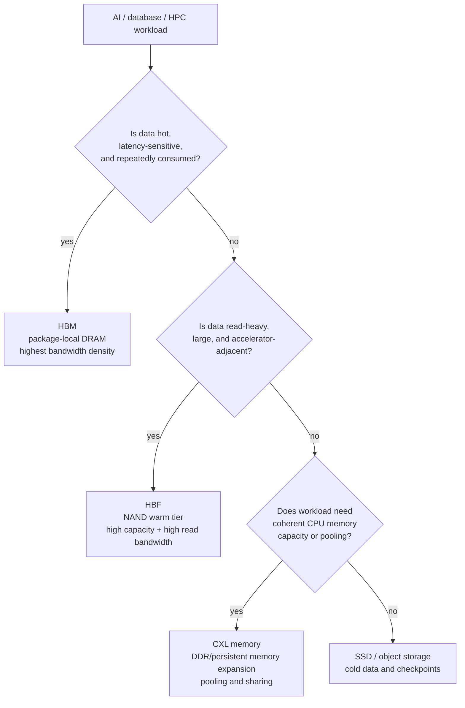
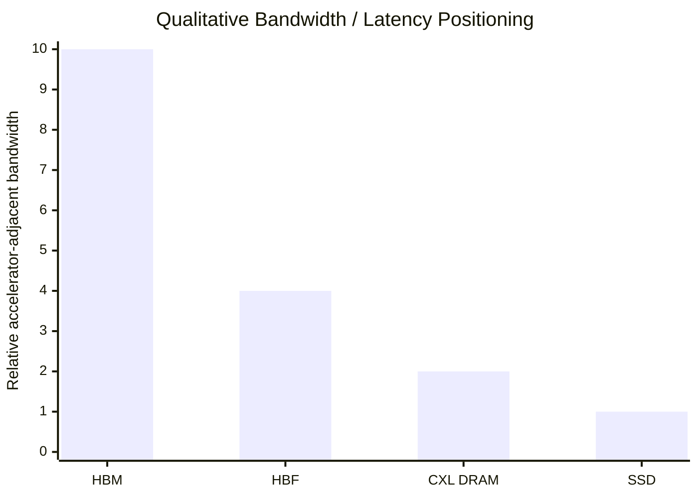

# HBF Vs HBM Vs CXL: Bandwidth, Capacity, Cost, Latency, And Workload Fit

HBF, HBM, and CXL are often grouped together because all three address the AI memory wall, but they solve different problems. HBM is package-local DRAM for hot tensors and accelerator utilization. HBF is an emerging NAND-based warm tier for large read-heavy model-adjacent data. CXL is a coherent interconnect and memory-expansion/pooling architecture for CPU-visible or fabric-visible capacity. Treating them as substitutes is a category error. The correct question is where each tier belongs in the memory hierarchy.

## Summary Table

| Attribute | HBM | HBF | CXL memory / pooling |
|---|---|---|---|
| Medium | DRAM stacked with TSVs and base die. | 3D NAND / high-bandwidth flash. | Usually DRAM today; can include persistent memory or storage-class memory semantics. |
| Physical location | In package beside GPU/ASIC/TPU on interposer or advanced package. | Emerging: PCIe-like module, baseboard, or package-adjacent device. | CPU/server-attached Type-3 memory expanders, switches, or pooled fabric devices. |
| Bandwidth class | TB/s per stack; HBM4 public/vendor claims reach 2-3+ TB/s per stack.[^S048][^S002][^S059] | Prototype/reporting class: Kioxia 5 TB / 64 GB/s PCIe 6.0 module; research models hundreds of GB/s on package.[^S047][^S100] | Scales with PCIe/CXL generation and topology; PCIe 5.0 x16 class is tens of GB/s, PCIe 6.0/CXL 3.x doubles link bandwidth.[^S104][^S105] |
| Latency | Lowest of the three; DRAM and package-local. | Higher than DRAM because NAND media latency remains. | Higher than local DRAM; CXL controllers/fabric add latency, often useful for capacity expansion rather than hot data.[^S105][^S104] |
| Capacity | Tens of GB per stack; package capacity depends on stack count and generation. | Terabyte-class target; Kioxia prototype 5 TB and public HBF reporting suggests much higher capacity than HBM.[^S047][^S099] | Hundreds of GB to TBs per server/pool; Meta Vistara example adds 256 GB recycled DDR4 per system and totals 1 TB with local DDR5.[^S104] |
| Cost per GB | Highest. | Intended below HBM, above commodity SSD. | Depends on DRAM generation, expander ASIC, switches, and pooling utilization; lower than adding HBM, often higher than bare DIMMs. |
| Best fit | Hot tensors, active model weights, KV cache, training activations, accelerator bandwidth. | Warm vector indexes, cold weights, embeddings, sparse expert data, RAG/retrieval, read-heavy inference. | CPU memory expansion, memory pooling, capacity disaggregation, page migration, less-hot inference state. |
| Main bottleneck | Advanced packaging, HBM stack yield, supply allocation, thermal density. | Standardization, software placement, NAND latency/endurance, workload proof. | Latency, bandwidth per device, pooling topology, software page placement, switch cost. |

## HBM: The Hot Tier

HBM is the hot tier because it is closest to the accelerator and delivers the most useful bandwidth per package area for active compute. HBM4 public summaries describe a 2,048-bit stack interface and roughly 2 TB/s JEDEC-class stack bandwidth, while vendor claims in 2025-2026 moved above 2.8 TB/s and, for Samsung reporting, up to roughly 3.3 TB/s per stack.[^S048][^S002][^S038][^S059] That class of bandwidth is necessary when matrix engines, tensor cores, or custom AI blocks must be fed every cycle.

The cost is structural. HBM consumes advanced DRAM dies, TSV stacking, base dies, interposers, high-speed test, and named-platform qualification. HBM shortages have become broad enough that memory suppliers and customers reserve capacity years ahead.[^S077] The HBM customer ecosystem file shows why: Rubin, Instinct, and Ironwood-class platforms design HBM into the package and cannot swap it late like ordinary DIMMs.

HBM's weakness is capacity cost. It is expensive to use HBM for data that is not hot. Long-tail retrieval vectors, cold model weights, sparse expert weights, large feature stores, or occasionally accessed context can crowd out active compute data. That is where HBF and CXL enter the architecture. They do not replace HBM's hot path; they reduce the temptation to overprovision HBM for warm or cooler data.

## HBF: The Warm Accelerator-Adjacent NAND Tier

HBF is the warm tier candidate. It uses NAND economics to add much larger capacity than HBM while attempting to deliver accelerator-relevant bandwidth. Kioxia's public prototype demonstrated one visible implementation path: a 5 TB module with 64 GB/s bandwidth over PCIe 6.0, PAM4 signaling, a local controller, daisy-chained controllers, and sub-40 W power.[^S047] SanDisk/SK hynix public reporting positioned HBF as 8x to 16x higher capacity than DRAM-based HBM and as a standard targeted at AI inference servers.[^S099][^S098]

HBF's core challenge is latency. NAND cannot behave like DRAM. HBF can increase parallelism, package proximity, controller sophistication, and prefetching, but it still needs software to place only suitable data there. The HAVEN paper's vector-reranking model is a good example: billion-scale full-precision vector datasets that do not fit in GPU HBM can be stored in HBF near the accelerator, reducing PCIe/DDR bottlenecks during reranking.[^S100] That is different from putting every tensor in HBF.

HBF's strength is capacity per watt and per dollar for read-heavy inference. If a retrieval system or recommendation model can stream candidates from HBF into HBM, it may reduce SSD traffic and CPU staging. If software treats HBF as generic storage, the benefit shrinks. HBF therefore depends heavily on runtime integration: placement policy, prefetch, eviction, compression, error handling, wear telemetry, and framework support.

## CXL: The Coherent Capacity And Pooling Layer

CXL is not a memory medium; it is an interconnect standard. Public CXL summaries describe it as an open standard built on the PCIe physical/electrical layer, with CXL.io, CXL.cache, and CXL.mem protocols for coherent CPU-to-device and CPU-to-memory connections.[^S105] CXL Type-3 devices attach memory to a host through CXL.mem, while CXL 2.0 added switching/pooling concepts and CXL 3.0 added PCIe 6.0-based fabric capabilities.[^S105][^S106]

CXL's value is capacity flexibility. Meta's 2026 Vistara example shows the practical motivation: use CXL 2.0 Type-3 expansion to attach recycled DDR4-2400 RDIMMs to DDR5-only AMD EPYC Turin servers, adding 256 GB per system and bringing total memory to 1 TB when combined with 768 GB of local DDR5.[^S104] The workload software migrates less frequently accessed data to the slower DDR4 tier.[^S104] That is classic CXL value: avoid buying all-local high-cost memory when slower coherent capacity is good enough.

CXL pooling research shows the longer-term target. The 2025 Octopus paper argued that CXL allows memory pooling but does not specify how to build a pool; its asymmetric topologies connected 3x as many hosts at 17% lower cost per host compared with prior policies.[^S107] A 2026 GPU collective-communication paper used a CXL shared memory pool with a TITAN-II switch and Micron CZ120 cards, reporting 1.34x AllGather, 1.84x Broadcast, and 1.94x Gather improvements versus RDMA-based implementations over 200 Gbps InfiniBand, plus 1.11x LLM training speedup in a case study at 2.75x lower hardware cost.[^S108]

CXL's weakness is that it is not package-local accelerator memory. Latency and bandwidth are not HBM-class, and topology matters. Even CXL-focused LLM inference work describes limited bandwidth of CXL-based memory as a bottleneck and proposes near-data processing to amplify effective bandwidth.[^S109] That is why CXL fits cooler memory, CPU-visible capacity expansion, and memory pooling better than hot tensor paths.

## Bandwidth And Latency Hierarchy

The hierarchy is easiest to understand by physical distance. HBM sits inside the accelerator package. HBF aims to sit near the accelerator but uses NAND media. CXL memory sits behind a coherent serial interconnect, often attached to the CPU/root complex or fabric. SSDs sit farther down the I/O stack. Each step away from the compute die usually lowers cost per GB and raises latency.

The chart is qualitative, not a data sheet. A future package-adjacent HBF implementation may outperform a PCIe module. A CXL 4.0/PCIe 7.0 fabric may improve bandwidth materially over CXL 2.0. HBM5 may raise HBM bandwidth and thermal stress together. The ranking still holds for workload placement: HBM for hot, HBF for warm accelerator-adjacent reads, CXL for coherent pooled capacity, SSD for cold storage.

## Capacity And Cost Logic

HBM has the worst cost-per-GB but best ability to protect accelerator utilization. It is rational when the memory directly feeds expensive compute. HBF tries to offer a better cost-per-warm-byte by using NAND, but with enough bandwidth to avoid SSD-like bottlenecks. CXL improves memory utilization by letting systems add or share DRAM capacity without placing every byte on the CPU memory channels.

The three tiers can coexist in one AI server. HBM holds active model state. HBF stores warm retrieval vectors or cold weights. CXL expands CPU-visible memory for preprocessing, caches, feature stores, or page migration. SSDs hold checkpoints, datasets, and cold objects. The system-level optimum is not maximum capacity in one tier; it is placing each data class at the cheapest tier that meets latency and bandwidth requirements.

Cost also depends on oversubscription. A server may not need every byte of CXL-attached memory at low latency. A vector database may not need every embedding in HBM. A long-context inference service may benefit from HBF if it keeps enough cache-locality near the accelerator. This is why software placement is the real allocator of capital efficiency.

## Workload Fit

Dense training and active inference favor HBM. The hot path is bandwidth hungry, latency sensitive, and repeatedly accesses tensors. Offloading active matrix-multiply operands to HBF or CXL would waste compute. Long-context inference can use HBM for the current decode path while using HBF or CXL for overflow, staging, or cooler KV/cache structures depending on access pattern.

RAG and vector search are the most obvious HBF use cases. HAVEN targets approximate nearest-neighbor reranking because full-precision vector data can exceed GPU HBM and create off-GPU movement penalties.[^S100] HBF is attractive when the workload is read-heavy, large, and can stream or prefetch. Recommendation and sparse MoE serving have similar properties if expert weights or embeddings are too large for HBM but accessed predictably enough to hide NAND latency.

CXL fits CPU-centric or memory-capacity-centric workloads. Databases, in-memory caches, feature stores, virtualization, analytics, and server memory expansion are natural targets. In AI, CXL can help host-side preprocessing, CPU memory pools, lower-priority inference state, and collective/shared-memory experiments.[^S104][^S108] It is less compelling for the inner loop of GPU tensor compute unless paired with near-data processing, compression, or a software design that tolerates the extra latency.[^S109]

## Latency Hiding And Software Control

The technologies also differ in how latency is hidden. HBM hides latency mostly through massive bandwidth, bank/channel parallelism, GPU scheduling, caches, and kernel tiling. The programmer usually does not explicitly think about HBM as a separate device; it is the accelerator's local memory. Performance work happens through tensor layout, kernel fusion, prefetching, and occupancy.

HBF requires more explicit placement. NAND latency cannot be hidden by pretending it is DRAM. The software must know which vectors, experts, features, or cold weights can tolerate prefetch and streaming. HAVEN's vector-search model works because reranking accesses large data structures that can be organized for HBF reads.[^S100] If the access pattern is tiny, random, and synchronous with token decode, HBF will feel slow. That makes HBF a runtime and data-layout problem as much as a hardware problem.

CXL sits between those models. Some CXL capacity can be exposed as memory and managed by the OS through page placement. Meta's Vistara example used software to migrate less frequently accessed data to the slower CXL-attached DDR4 tier.[^S104] That is easier for existing applications than rewriting for a new HBF API, but it is also less precise. Page migration can be too coarse for accelerator hot paths, while application-aware placement can do better if software is willing to participate.

The software-control gradient is therefore: HBM is mostly local-memory optimization; HBF is explicit warm-data placement; CXL is coherent capacity management and page/fabric policy. A system that uses all three needs a hierarchy-aware runtime, not three isolated drivers.

## Deployment Archetypes

One deployment archetype is the pure HBM accelerator. This is the high-end training or low-latency inference design: many HBM stacks, tight package integration, and minimal dependence on external memory during the hot path. It is expensive, supply-constrained, and power dense, but it maximizes compute utilization. NVIDIA Blackwell/Rubin, AMD Instinct, and Google TPU platforms all rely on this archetype even when they add other memory tiers.[^S058][^S059][^S095]

The second archetype is HBM plus HBF. This design is plausible for inference servers with large retrieval indexes, sparse experts, or cold-weight staging. HBM holds the active model path; HBF holds warm model-adjacent data. The main success condition is software locality. If the runtime can prefetch and stream useful data into HBM, HBF can raise effective capacity without burning HBM stacks. If the runtime cannot, HBF becomes a fast but expensive storage device.

The third archetype is CPU memory plus CXL expansion. This is ideal for CPU-bound analytics, caches, virtualization, memory oversubscription, and cost-sensitive capacity growth. Meta's recycled-DDR4 system is a clean example: CXL allowed old DDR4 modules to extend new DDR5 servers and reduce the need for fresh DRAM purchases.[^S104] This is not an HBM competitor. It is a datacenter memory-utilization tool.

The fourth archetype is CXL pooled AI infrastructure. This is earlier and more research-heavy, but the CCCL paper shows why it matters: a CXL shared memory pool can support cross-node GPU collectives and reduce reliance on RDMA in some cases.[^S108] If CXL fabrics mature, pooled memory may become part of AI cluster communication and memory sharing. That is a different problem from HBF's near-accelerator NAND tier.

The fifth archetype is a full four-tier node: HBM, HBF, CXL DRAM, and SSD/object storage. That is the most likely long-term architecture for memory-heavy inference. HBM is expensive but fast; HBF is large and accelerator-adjacent; CXL is coherent and flexible; SSDs are cheap and cold. The system's value comes from the runtime that moves data among them.

## Decision Matrix

| Workload / data class | Best first tier | Why |
|---|---|---|
| Active transformer layer weights | HBM | Hot, bandwidth-intensive, repeated every token/layer. |
| Current KV cache for latency-sensitive decode | HBM | Latency and bandwidth affect time-to-token. |
| Overflow / cold KV cache | HBF or CXL | Depends on access pattern: HBF for accelerator-adjacent streaming, CXL for CPU-managed capacity. |
| Billion-scale vector index reranking | HBF | Large, read-heavy, accelerator-adjacent candidate access. |
| CPU-side in-memory cache | CXL | Coherent capacity expansion and page migration matter more than HBM bandwidth. |
| Sparse expert weights | HBF or HBM | HBM if frequently active; HBF if cold/warm and prefetchable. |
| Training activations and gradients | HBM | Hot path and collective overlap need package-local DRAM. |
| Checkpoints and datasets | SSD/object storage | Cold, capacity-dominant, not worth HBF/HBM cost. |

## Interactions Rather Than Substitution

The important strategic point is interaction. HBF can reduce HBM pressure by removing warm data from the HBM budget. CXL can reduce host DRAM pressure and improve memory utilization across servers. HBM remains the tier that keeps accelerator math units fed. A well-designed system uses all three, but the mix depends on workload economics.

This also means vendor exposure differs. HBM benefits DRAM suppliers with advanced packaging. HBF benefits NAND suppliers, controller vendors, and potentially packaging vendors if it becomes package-adjacent. CXL benefits memory expander vendors, switch/controller vendors, CPU platform suppliers, and DRAM module suppliers. Semicap exposure differs too: HBM pulls TSV, DRAM, packaging, and test; HBF pulls 3D NAND, controllers, high-bandwidth links, and perhaps bonding; CXL pulls retimers/switches/controllers, DDR capacity, validation, and platform firmware.

## Vendor And Semicap Implications

For DRAM vendors, HBM is the margin engine but also the allocation trap. It consumes advanced DRAM wafers and packaging capacity. HBF could reduce pressure on HBM only for warm data, not active tensors. CXL can expand CPU-visible DRAM demand, but it may also improve utilization enough to reduce the need for overprovisioned local DIMMs in some workloads.

For NAND vendors, HBF is strategically attractive because it creates a premium NAND use case tied to AI infrastructure. Commodity SSDs face price cycles and controller competition. HBF could create a higher-margin product if it needs advanced NAND, high-bandwidth packaging, custom controllers, and platform qualification. The challenge is that NAND vendors must now sell into accelerator and runtime ecosystems, not only storage buyers.

For CXL controller and switch vendors, the opportunity is platform-level. Meta's Vistara example and Panmnesia's CXL controller/switch reporting show that hyperscalers care about latency, topology, and memory reuse, not only standards compliance.[^S104] CXL value can accrue to ASICs, switches, firmware, OS placement policy, and validation tools. That makes the CXL ecosystem broader but also more fragmented.

For semicap, the three technologies pull different tool demand. HBM drives advanced DRAM process tools, TSV etch/fill, wafer thinning, bonding, molded underfill, inspection, and high-speed test. HBF drives 3D NAND layer scaling, wafer bonding such as CBA, NAND controllers, and potentially advanced package integration.[^S005][^S099] CXL drives less direct wafer-process novelty but more demand for controllers, retimers, switches, board validation, high-speed SerDes IP, and DRAM modules.

## Practical Procurement Questions

A buyer evaluating these tiers should ask five questions. First, is the data hot enough to justify HBM? If yes, do not compromise. Second, is the data large, read-heavy, and accelerator-adjacent? If yes, HBF is worth tracking. Third, is the data coherent CPU memory that benefits from page migration or pooling? If yes, CXL is the right category. Fourth, can software explicitly place data? HBF needs this more than CXL. Fifth, is the goal capacity, bandwidth, latency, utilization, or cost? Each technology optimizes a different point.

The procurement mistake is buying capacity without placement policy. Extra CXL memory can sit idle if the OS or application does not migrate pages well. HBF can underperform if the model-serving runtime cannot prefetch. HBM can be wasted if the accelerator is bottlenecked by networking or CPU staging. Memory tiering only creates value when the software stack can keep the right data in the right place.

## Bottom Line

HBM, HBF, and CXL are complementary answers to the same memory hierarchy problem. HBM is the hot tier. HBF is the emerging warm accelerator-adjacent NAND tier. CXL is the coherent capacity and pooling tier. The winner is not one technology replacing the other two; the winner is the system architecture that places data at the right tier with enough software intelligence to keep compute utilized and memory cost under control.

With this file, Section 04's HBF emerging-technology discussion is complete: [01-hbf-overview.md](01-hbf-overview.md) defines the technology, [02-hbf-standardization.md](02-hbf-standardization.md) covers the OCP/SanDisk/SK hynix path, and this comparison file locates HBF against HBM and CXL.
