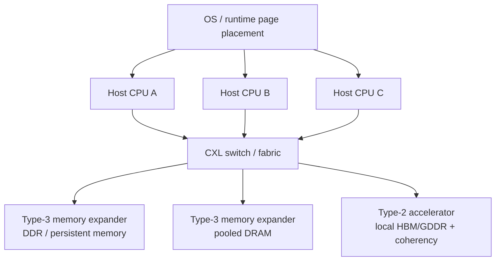

# CXL Memory Pooling: Coherent Capacity, Disaggregation, And Deployment Economics

Compute Express Link is the leading open coherent interconnect for server memory expansion and pooling. It is not a memory technology by itself; it is a protocol stack over PCIe physical/electrical layers that allows processors and devices to access memory coherently through CXL.io, CXL.cache, and CXL.mem.[^S105] For the memory database, CXL matters because it can turn stranded or disaggregated DRAM into usable capacity, reduce overprovisioning, and create new controller/switch opportunities even when it does not match local DRAM or HBM latency.

## Why CXL Exists

The conventional server memory model is rigid. Each CPU socket has local memory channels, and capacity is installed in DIMMs tied to that server. If one workload needs more memory than the server has, the operator must buy a larger configuration. If another workload leaves memory idle, that capacity is stranded. CXL promises a more flexible model: memory can be attached through an expansion device or shared through a pool, allowing capacity to follow workload demand more efficiently.[^S105][^S106]

CXL's economic appeal rises when DRAM prices are high and memory capacity is unevenly used. In June 2026, Meta's Vistara example showed the motivation vividly: Meta reused DDR4-2400 RDIMMs from decommissioned servers inside new DDR5-only AMD EPYC Turin systems by using a custom CXL 2.0 Type-3 ASIC.[^S104] The system added 256 GB of CXL-attached DDR4 capacity to servers already configured with 768 GB of local DDR5, producing 1 TB total memory per server while software migrated less frequently accessed pages to the slower DDR4 tier.[^S104]

That is the practical CXL thesis in one system. CXL is not making old DDR4 as fast as local DDR5. It is making old capacity useful enough that the fleet can avoid buying some new DRAM and reduce waste. The same logic applies beyond recycled memory: CXL can improve utilization when workloads have cold pages, bursty memory footprints, or capacity requirements that exceed local channels.

## Protocol And Device Model

Public CXL summaries describe three sub-protocols. CXL.io handles discovery, configuration, interrupts, DMA, and register I/O. CXL.cache lets devices coherently access and cache host memory. CXL.mem lets the host CPU coherently access device-attached memory with load/store semantics.[^S105] Type-3 devices use CXL.io and CXL.mem to expose memory expansion; Type-2 devices include accelerators with local memory and can support CXL.cache and CXL.mem; Type-1 devices are cache-coherent devices without local memory.[^S105]

Pooling became more central as the specification evolved. CXL 2.0 added switching and pooling ideas, while CXL 3.0 moved to a PCIe 6.0 physical interface and added fabric capabilities, multi-level switching, peer-to-peer DMA, enhanced coherency, and memory sharing concepts.[^S105][^S106] The distinction between expansion and pooling matters. Expansion adds capacity to one host. Pooling allows multiple hosts to draw from shared memory resources.

The hard part is that the standard does not prescribe an entire pool architecture. The Octopus paper argued that CXL enables pooling but does not specify how to build a memory pool, and that naïve switch-heavy or large multi-headed-device designs can be expensive.[^S107] Octopus proposed asymmetric topologies where hosts connect to different subsets of cheap CXL devices, improving the Pareto frontier by connecting 3x as many hosts at 17% lower cost per host compared with prior policies.[^S107]

The protocol distinction matters for investors because it separates "CXL support" from "usable pooled memory." A CPU may support CXL, but useful deployment still needs BIOS/firmware maturity, OS support, error handling, device drivers, topology discovery, security policy, page placement, and fleet telemetry. A memory module vendor may ship a Type-3 device, but a hyperscaler still needs orchestration software that decides when to place pages there. The standard enables the market; it does not eliminate the systems work.

The device model also creates product segmentation. A simple Type-3 expander can be sold as memory capacity. A richer expander can include compression, encryption, telemetry, and near-data processing. A switch can sell bandwidth and topology flexibility. A software stack can sell placement and pooling policy. CXL therefore creates an ecosystem, not just a module SKU.

## Expansion Vs Pooling

Memory expansion is the near-term deployment path. A Type-3 CXL device attaches to a host and appears as an additional NUMA-like memory tier. Software can place hot pages in local DDR and cooler pages in CXL memory. This is what Meta's Vistara deployment demonstrates: local DDR5 remains hot memory, while CXL-attached recycled DDR4 becomes a slower but useful tier.[^S104]

Pooling is more ambitious. A pool requires sharing memory among hosts, handling arbitration, isolation, latency, failure domains, and policy. In principle, pooling improves utilization because hosts do not each need worst-case local memory. In practice, it requires CXL switches or clever topologies, robust software, and predictable performance. Octopus tries to reduce pooling cost by avoiding fully connected expensive switch designs.[^S107]

The economic difference is timing. Expansion can be deployed per server and justified with capacity savings. Pooling requires more platform architecture and cluster-level policy. Hyperscalers may be able to justify that work earlier because they control hardware, OS images, workload schedulers, and fleet telemetry. Enterprise adoption will likely be slower unless vendors package pooling into simpler systems.

The expansion-to-pooling progression resembles storage disaggregation history. The first step is adding capacity to one machine. The second step is sharing capacity across a small pod. The third step is scheduling memory like a resource. CXL is still early in that progression. Meta's Vistara is a strong expansion example; Octopus and CCCL point toward pooling and sharing, but the broader market still needs turnkey architectures.[^S104][^S107][^S108]

## Latency And Bandwidth Tradeoffs

CXL memory is slower than local DRAM. Public CXL summaries cite CXL memory-controller latency additions around hundreds of nanoseconds, and Meta's Vistara reporting said existing CXL implementations had suffered from roughly 10x lower bandwidth and about 60% higher latency than local memory before Meta's optimized ASIC/software approach.[^S105][^S104] That does not make CXL unattractive; it means software must place data correctly.

The bandwidth tradeoff is also structural. PCIe/CXL links are serial and narrower than CPU memory-channel aggregates. CXL 3.x and 4.0 improve link bandwidth with newer PCIe generations, but CXL-attached memory still competes with local memory-channel bandwidth.[^S105] Workloads that stream heavily from CXL memory can slow down. Workloads with cold pages, large but sparse working sets, or capacity-dominated behavior can benefit.

This is why page placement matters. Meta's system exposes CXL memory as a separate NUMA node and uses software to migrate less frequently accessed data to the DDR4 tier while retaining hot data in local DDR5.[^S104] The value is not CXL alone; it is hardware plus placement software.

## CXL For AI Workloads

AI workloads use CXL differently from databases or caches. HBM remains the active accelerator tier, but CXL can help with CPU-side preprocessing, large host memory pools, less-hot KV cache, feature stores, embedding tables, and memory sharing across nodes. The [HBF vs HBM vs CXL](../04-hbf-emerging-tech/03-hbf-vs-hbm-vs-cxl.md) file positions CXL as the coherent capacity layer rather than the hot accelerator tier.

The CCCL paper shows a more advanced AI direction. It used a CXL shared memory pool with a TITAN-II CXL switch and six Micron CZ120 memory cards to support cross-node GPU collective communication without relying on traditional RDMA-based networking.[^S108] Compared with an RDMA implementation over 200 Gbps InfiniBand, CCCL reported average improvements of 1.34x for AllGather, 1.84x for Broadcast, 1.94x for Gather, and 1.04x for Scatter, plus a 1.11x LLM training speedup at 2.75x lower hardware cost in a case study.[^S108]

That is not proof that CXL replaces NVLink, InfiniBand, or HBM. It shows that CXL memory pools can become part of AI cluster communication and data-sharing designs. If GPU memory pressure and network costs keep rising, CXL fabric experiments will attract more attention.

## Near-Data Processing

Passive CXL memory can bottleneck on bandwidth. CXL-NDP, a 2025 arXiv paper, framed LLM inference as bottlenecked by limited bandwidth of CXL-based memory used for capacity expansion and proposed transparent near-data processing inside the CXL device.[^S109] The paper reported 43% throughput improvement, 87% maximum-context extension, and 46.9% KV-cache footprint reduction through bit-plane layout, dynamic quantization, and lossless compression of weights and KV caches inside the CXL device.[^S109]

Near-data processing is strategically important because it shifts CXL devices from passive memory shelves toward smart memory appliances. A passive expander adds capacity. An intelligent expander can compress, filter, select, or transform data before sending it over the CXL link. That can amplify effective bandwidth and make CXL useful for workloads that would otherwise be link-limited.

This direction also changes the vendor map. CXL memory devices may need ASIC logic, compression engines, telemetry, firmware, security, and workload-specific accelerators. That creates opportunities for controller vendors and IP suppliers, but it also complicates standardization. A CXL-NDP device must still interoperate with hosts and software while exposing value beyond generic CXL.mem.

## Deployment Economics

CXL economics have three levers. The first is capacity reuse. Meta's Vistara is the cleanest example because it turns decommissioned DDR4 into useful capacity in new DDR5 servers.[^S104] That is near-zero-cost memory expansion compared with buying new DRAM, though the ASIC/card/system integration still has cost.

The second lever is reduced overprovisioning. If memory can be pooled, a fleet may need less total installed DRAM to satisfy peak workloads. Octopus targets this by making pooling cheaper and more scalable.[^S107] The benefit depends on workload diversity: pooling helps most when memory peaks are uncorrelated across hosts.

The third lever is performance per dollar. CXL can improve server count, cache latency, or training communication only if the slower memory/fabric is placed correctly. TechRadar's Meta coverage said workload-specific software disabled expansion when latency was unacceptable and reported examples such as up to 25% reductions in server counts for machine-learning inference and about 29% latency improvement for distributed caches.[^S110] The lesson is that CXL value is conditional, not universal.

The fourth lever is lifecycle extension. DRAM installed in decommissioned systems can have residual value if it can be safely reused behind a CXL controller. That changes replacement economics: retiring a server no longer means retiring all its memory value. It also changes sustainability messaging because memory reuse can reduce waste and defer new DRAM purchases.[^S104][^S110] The challenge is qualification. Reused DIMMs must be screened, tracked, and monitored because a CXL pool is only as reliable as its weakest component.

The fifth lever is SKU simplification. If CXL pooling matures, server buyers may configure more uniform local-memory footprints and handle long-tail memory needs through expanders or pooled shelves. That can simplify procurement and reduce stranded capacity. But the benefit depends on predictable software placement. A badly placed workload can turn a cheaper CXL tier into a performance regression.

## Workload Taxonomy

Good CXL workloads have large memory footprints, tolerable latency, and uneven hot/cold data distribution. Examples include distributed caches, feature stores, graph analytics, in-memory databases with cold pages, virtualization, and host-side AI preprocessing. Meta's reporting specifically highlighted machine-learning inference and distributed caches as workloads where capacity expansion could reduce server counts or improve latency.[^S110]

Poor CXL workloads have tight pointer-chasing loops, high memory bandwidth intensity, or latency-sensitive hot paths. A workload that repeatedly touches CXL memory every cycle can lose more from latency than it gains from capacity. That is why software needs profiling. A page that is cold during one phase may become hot during another phase. Static placement is often insufficient.

AI workloads are mixed. GPU tensor math belongs in HBM. CPU-side preprocessing, tokenization, feature lookup, data staging, or lower-priority KV cache may tolerate CXL. Long-context serving can benefit from CXL or near-data processing if the alternative is eviction or expensive HBM overprovisioning.[^S109] The correct design is tier-aware: HBM for hot data, local DDR for CPU hot pages, CXL for expanded coherent capacity, and SSD/object storage for cold data.

## Operations And Fleet Management

CXL deployment will be judged by operations as much as benchmark speed. Operators need inventory tracking, DIMM health, controller firmware status, error counters, link retraining events, thermal alerts, security state, and per-workload performance counters. If CXL memory is pooled, operators also need tenant isolation and blast-radius control. A pool that improves utilization but creates correlated failures will not survive hyperscale review.

Security is also central. CXL memory can hold application data, model state, customer records, or cache contents. Device integrity, encryption, secure boot, firmware signing, and access control matter. Public CXL summaries note CXL 2.0 device integrity and data encryption features, but deployment still requires platform policy and key management.[^S105]

Fleet scheduling is the final operational layer. A scheduler needs to know which hosts have local memory, which have expansion, which pool segments are healthy, and which jobs can tolerate remote or expanded memory. Over time, CXL memory may become a schedulable resource like GPUs or SSD capacity. That would be the real inflection: memory capacity no longer trapped inside one server configuration.

## Risks And Constraints

The first risk is latency surprise. Developers may see "memory" and assume near-local DRAM behavior. CXL memory is a tier. It needs NUMA awareness, page placement, profiling, and guardrails. Latency-sensitive workloads may need to keep CXL disabled or limited.[^S104][^S110]

The second risk is bandwidth concentration. A CXL switch or expander can become a shared bottleneck if many hosts access the same pool. Pooling must manage contention, fairness, and isolation. Octopus explicitly treats topology cost and host/device connection patterns as first-order design variables.[^S107]

The third risk is failure domain expansion. If multiple hosts depend on pooled memory, device failure, firmware bugs, switch failures, or bad isolation can affect more than one server. Datacenter deployment requires telemetry, redundancy, encryption, access control, and recovery semantics.

The fourth risk is software immaturity. CXL needs OS, hypervisor, runtime, and application support. Transparent page placement helps, but some workloads need explicit placement. AI systems may need CXL-aware KV-cache managers, feature-store placement, or near-data processing. Without software, hardware sits underused.

## Semicap And Vendor Implications

CXL does not pull the same capex chain as HBM. It does not require TSV-stacked DRAM or interposers for every deployment. It does pull demand for CXL controllers, retimers, switches, validation tools, high-speed SerDes IP, firmware, security engines, and DRAM modules. If CXL pooling succeeds, it can increase the value of older DRAM, change DIMM demand mix, and create more modular memory appliances.

For memory vendors, CXL can be both opportunity and pressure. It creates new DRAM module products and controller partnerships, but it may also improve utilization enough to reduce overprovisioned local DIMM purchases. For hyperscalers, that is exactly the point: better memory utilization under constrained supply.

For CPU vendors, CXL support becomes part of platform competitiveness. CPUs with mature CXL support, good NUMA behavior, and ecosystem validation can support larger memory footprints and more composable infrastructure. For accelerator vendors, CXL is less central than HBM but may become important for host-side memory, long-context serving, and shared-memory communication.

## Bottom Line

CXL memory pooling is an infrastructure technology, not a magic memory replacement. It is best viewed as a coherent capacity and utilization layer. It can reuse memory, reduce overprovisioning, enable pooled capacity, and support new AI memory-sharing experiments. It cannot replace HBM for hot accelerator data, and it will not help workloads that cannot tolerate higher latency. Its long-term value depends on hardware-software co-design: CXL devices, switches, OS page placement, telemetry, near-data processing, and workload-aware schedulers working together.
