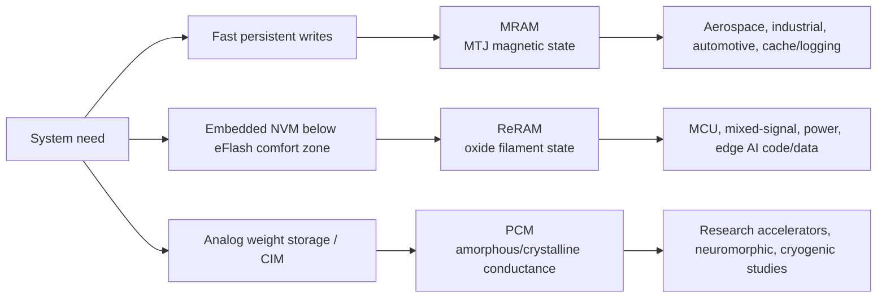

# MRAM, ReRAM, And PCM: Emerging Non-Volatile Memory Status

MRAM, ReRAM, and PCM are the three non-volatile memory candidates that most often reappear when embedded flash, SRAM leakage, NOR boot density, analog compute, or harsh-environment persistence becomes the system bottleneck. They are not interchangeable "universal memory" candidates. MRAM is strongest where endurance, speed, and mature commercial supply matter; ReRAM is strongest where a simple BEOL bitcell can replace embedded flash at mature or FD-SOI nodes; PCM is strongest in research and analog in-memory-compute contexts where multi-level conductance can be used as a compute primitive rather than only as storage.[^S112][^S116][^S121][^S123]

## Technology Snapshot

MRAM stores a bit in a magnetic tunnel junction (MTJ). In Toggle MRAM the bit is switched by magnetic fields; in STT-MRAM the write current is spin-polarized and transfers angular momentum into the free magnetic layer. The commercial appeal is that the cell is non-volatile, byte-addressable, high-endurance, and fast enough to behave like SRAM or persistent SRAM in many embedded systems. Everspin's current public product catalog spans Toggle MRAM and STT-MRAM, includes densities from 128 Kb to 1 Gb, supports interfaces including SPI, QSPI, xSPI, DDR3, and DDR4, and lists speed bins such as 667 MHz for high-density DDR-type products and 35 ns to 45 ns for asynchronous parts.[^S112]

ReRAM stores a bit by changing the resistance of a dielectric or oxide layer. Weebit describes its oxide-based ReRAM as a thin oxide switching layer between two electrodes, with a forming step that creates a conductive filament, a positive-voltage set operation that moves the cell to a low-resistance state, and a negative-voltage reset operation that breaks the filament and moves it to a high-resistance state.[^S118] That makes ReRAM a materials and variability problem more than a capacitor-scaling problem. The bull case is the small, simple BEOL structure: Weebit says its ReRAM can be integrated into CMOS manufacturing flows and does not require rare-earth materials.[^S118]

PCM stores data by changing the phase of a chalcogenide material between high-resistance amorphous and low-resistance crystalline states. The advantage is that conductance can be programmed across analog-like levels, which is why PCM recurs in in-memory-compute research. The disadvantage is that programming is thermally driven, so energy, drift, endurance, write latency, and heat confinement dominate the device roadmap.[^S121] A 2026 PCM scaling review framed the long-term energy objective as moving switching toward tens of femtojoules per bit today and closer to fundamental limits through sub-10 nm active volumes and better thermal confinement, while warning that contacts, interfaces, and parasitics remain practical constraints.[^S121]

## MRAM: Commercial Niche, Not DRAM Replacement

MRAM is the most commercially legible of the three. Everspin positions itself as a commercial MRAM supplier for industrial, data-center, automotive, aerospace, defense, medical, gaming, and smart-energy systems, and states that its IP portfolio includes more than 700 active patents and applications.[^S111] Its product page describes PERSYST MRAM as persistent memory for instant non-volatility, high endurance, and fast read/write behavior in mission-critical systems, while UNISYST is framed as a unified code and data memory roadmap product for embedded systems.[^S112]

The 2026 business signals still point to specialization rather than mass commodity memory. On April 30, 2026, Everspin announced a $40.0 million agreement over two and a half years with a U.S. prime contractor for Toggle MRAM process technology capabilities and engineering services for U.S. Defense Industrial Base customers.[^S113] That is a revealing data point. MRAM has enough strategic value to win mil-aero funding and enough reliability credibility to support long-lifetime systems, but the volume axis is not yet the same as DRAM, NAND, or HBM.

For embedded designs, MRAM competes with eFlash, SRAM plus battery/capacitor backup, FRAM, ReRAM, and small EEPROM/NOR macros. The design win is usually not "replace all memory." It is "remove the battery," "log every event without wearing out flash," "boot instantly after brownout," or "retain state under radiation/temperature stress." That is why the most persuasive MRAM adoption cases tend to sit in industrial control, aerospace/defense, storage metadata, power-loss protection, and deterministic logging rather than notebook main memory.

The technical ceiling is also clear. STT-MRAM writes require enough current to switch the MTJ reliably, and the write-current, retention, endurance, and disturb tradeoffs become harsher as the cell shrinks. SOT-MRAM is the next research branch because it can separate read and write paths and potentially reduce switching energy, but it usually pays an area or process-integration penalty. A 2025 SOT-MRAM compute-in-memory macro paper designed in 28 nm technology reported a peak energy efficiency of 243.6 TOPS/W for an event-driven spiking workload, illustrating why MRAM researchers are increasingly linking the device to edge AI/CIM rather than only to embedded storage.[^S120]

For semicap and process investors, MRAM is a back-end module and magnetic-materials control problem. The critical manufacturing stack includes MTJ deposition, tunnel-barrier uniformity, patterning of magnetic stacks, anneal control, and defectivity management. That process complexity limits how quickly MRAM can become a commodity bit factory. It can be very valuable at relatively modest volume when the system needs endurance and persistence; it is less attractive where the buyer simply wants the lowest cost per gigabyte.

## ReRAM: Embedded Flash Escape Hatch

ReRAM's strongest near-term narrative is not "replace NAND SSDs." It is "provide embedded non-volatile memory when embedded flash scaling gets awkward." Weebit's homepage explicitly frames the market as advanced geometries, increasing memory capacity, and tighter power constraints needing faster, lower-power, more reliable NVM; it also highlights mixed-signal and power-management ICs as a natural BEOL-NVM use case.[^S114] The same site quotes GlobalFoundries' Mike Hogan saying embedded flash is difficult to scale below 28 nm and that customers are looking at embedded ReRAM for that reason.[^S114]

The product evidence is now concrete in mature nodes. Weebit's SkyWater S130 ReRAM IP page says the IP is available in SkyWater's 130 nm CMOS process, fully qualified per JEDEC and AEC-Q100, and ready for production.[^S116] The listed S130 module metrics include a 256 Kb capacity customizable from 64 Kb to 2 Mb, read access time below 20 ns, operation from -40 deg C to 150 deg C, at least 100K write cycles, at least 10 years retention at 125 deg C, and AEC-Q100 coverage at 100K cycles and 150 deg C.[^S116] That is not a commodity storage density, but it is exactly the range that matters for trims, firmware, configuration, boot code, black-box logging, security keys, and mixed-signal calibration.

The DB HiTek 130 nm BCD page shifts the same concept into power and analog. Weebit says its ReRAM IP is available in DB HiTek's 130 nm BCD process, tested on silicon, qualified, and ready for integration in user SoCs.[^S117] The public feature table lists 1 Mb, 512 Kb, 256 Kb, 128 Kb, and 64 Kb capacity options; a below-25 ns read access time; -40 deg C to 125 deg C operation; 10K write-cycle endurance extendable to 100K; more than 10 years retention at 125 deg C; and only two additional masks.[^S117]

Those specs explain why ReRAM can matter without displacing NAND. A power-management IC or automotive mixed-signal controller may not need gigabytes. It needs a small non-volatile array that does not drag the whole process into an eFlash derivative, does not require expensive charge-pump and erase-block behavior, and can survive thermal stress. ReRAM's BEOL integration story is attractive because it can be added above logic devices instead of forcing the foundry to modify front-end transistors.

The 2025-2026 commercial signal strengthened when Weebit's public site highlighted a Texas Instruments license agreement as latest news, and January 2026 coverage reported that TI licensed Weebit embedded ReRAM after earlier SkyWater, DB HiTek, and onsemi steps.[^S114][^S119] The investment read-through is that ReRAM is moving through a foundry/customer funnel: qualify in a mature foundry, prove silicon, license into analog/power/embedded platforms, then chase higher-value SoC sockets.

The bear case is variability and qualification time. Filamentary memories must control forming voltage, set/reset distributions, retention drift, disturb, cycle-to-cycle variability, and array yield. A kilobit or megabit macro can tolerate redundancy and calibration more easily than a multi-gigabit storage die. That is why the current ReRAM opportunity is embedded IP and analog compute, not wholesale NAND substitution. ReRAM looks most investable where it is sold as process IP, not where it tries to fight NAND on cost per bit.

## PCM: Powerful Physics, Narrow Commercial Window

PCM's commercial history is complicated by the end of Optane/3D XPoint, which is covered separately in [04-3d-xpoint-optane-postmortem.md](04-3d-xpoint-optane-postmortem.md). For this file, the important point is that PCM remains scientifically important even after mass-market persistent memory stumbled. Research keeps returning to PCM because a cell's conductance can be used as an analog weight, and because a dense array can perform matrix-vector operations near where weights are stored.

IBM-affiliated work provides the cleanest example. A 64-core mixed-signal in-memory compute chip based on phase-change memory, posted in December 2022, was fabricated in 14 nm CMOS with backend-integrated PCM, used 64 cores of 256 by 256 analog in-memory-compute arrays, and reported up to 63.1 TOPS at 9.76 TOPS/W for 8-bit input/output matrix-vector multiplication.[^S123] The device story is not a DIMM replacement; it is an accelerator where the memory element is also the multiply-accumulate substrate.

Recent PCM papers are increasingly honest about limitations. A November 2025 PCM-main-memory coding paper argued that PCM has attractive scalability and standby energy but that writes consume substantial energy and create endurance stress, motivating encoding schemes that reduce bit flips and write energy.[^S124] A September 2025 cryogenic PCM paper studied PCM devices down to 5 K for in-memory computing, quantum-computing support, and deep-space electronics, again showing that the most active frontier is not commodity storage but specialized compute and environment regimes.[^S122]

PCM also has a strong semicap link. It is materials-heavy, thermal-heavy, and integration-heavy: chalcogenide deposition, heater/contact geometry, selector devices, encapsulation, and thermal isolation all matter. The best device can fail as a product if resistance drift breaks multi-level states, if write energy is too high, or if thermal confinement conflicts with reliability. Investors should view PCM as a research and accelerator option rather than a near-term direct competitor to HBM, DRAM, or NAND.

## Comparative Positioning

| Attribute | MRAM | ReRAM | PCM |
|---|---|---|---|
| Storage mechanism | Magnetic tunnel junction state | Oxide/filament resistance state | Phase of chalcogenide material |
| Current commercial center | Discrete and embedded persistent memory | Embedded NVM IP in foundry processes | Research, specialized NVM, analog CIM |
| Best near-term fit | Harsh-environment persistence, logging, cache metadata | eFlash replacement, trims, boot/config, mixed-signal | Analog weights, neuromorphic/CIM, special environments |
| Main limiter | MTJ scaling, write current, magnetic-stack process cost | Variability, forming, qualification, array yield | Write energy, drift, thermal management, endurance |
| Semicap exposure | MTJ deposition/patterning/metrology | BEOL oxide module, extra masks, IP qualification | Chalcogenide deposition, heaters, selectors, thermal control |

The investment conclusion is differentiated. MRAM is the most productized and defensible in mission-critical persistence. ReRAM is the most likely embedded-flash substitute because it rides foundry IP qualification rather than commodity memory capex. PCM is the most scientifically attractive for analog compute, but the least likely of the three to become a broad standalone memory product in the near term. Together they form an important "other emerging memory" layer, but none changes the DRAM/NAND/HBM supply-demand cycle the way HBM or high-layer-count NAND fabs do.

## Integration Economics And Qualification

The adoption gate is rarely the single-cell benchmark. It is the package of process risk, PDK maturity, test collateral, qualification data, compiler or memory-controller support, and customer willingness to redesign a subsystem. That is why ReRAM's "easy integration" language matters more than a raw endurance claim. Weebit's technology overview explicitly frames its ReRAM as an NVM option that is cost-effective and easy to integrate into a CMOS fab, with embedded IP solutions and standalone memory chips under development.[^S115] The key commercial question is whether a foundry can ship ReRAM as a supported option with timing models, reliability corners, ECC guidance, redundancy strategy, and production test flows rather than as a heroic custom module.

For MRAM, integration economics are different. The MTJ module brings specialized magnetic materials into a CMOS back end, so the value proposition has to justify a more exotic process stack. That is tolerable in aerospace, defense, and industrial programs because the system may value non-volatility, endurance, or domestic manufacturing more than bit cost. The April 2026 Everspin agreement is a useful indicator because it ties MRAM process capability and engineering services to U.S. defense customers, not to a commodity memory scale-up.[^S113] In other words, MRAM's near-term moat is reliability and process know-how, not hyperscale cost-per-GB.

For ReRAM, the economic argument is the opposite. It wants to be boring from the foundry's point of view: a small number of extra masks, a BEOL insertion point, and compatibility with existing analog/mixed-signal flows. Weebit's DB HiTek page lists only two additional masks for the 130 nm BCD implementation, while the SkyWater S130 page lists the same two-mask adder and production-oriented qualification data.[^S116][^S117] That two-mask framing is strategically important because it lets ReRAM compete with eFlash process complexity, not with NAND array density. The buyer is paying for process simplification and power/performance differentiation inside an SoC.

PCM has the hardest integration economics for storage but the most interesting integration economics for compute. A PCM array used as a conventional non-volatile memory has to solve retention drift, endurance, write energy, and selector leakage while competing with mature flash or DRAM. A PCM array used as an analog matrix engine can justify much more device complexity because it replaces data movement and MAC energy, not just storage cells. The 64-core PCM AIMC chip therefore should be read as evidence for a compute architecture, not as evidence that PCM DIMMs are returning.[^S123]

## Software And System Consequences

These emerging memories also change software contracts in different ways. MRAM can often be hidden behind a normal memory-mapped or serial interface, which is why it can replace battery-backed SRAM or NOR-like storage with limited software upheaval. ReRAM embedded macros may require boot-ROM, firmware update, security-key, and trim-flow changes, but they still live inside conventional SoC design methodology. PCM for analog compute is more disruptive because the application must tolerate conductance noise, drift, limited precision, recalibration, and mapping constraints.

That distinction explains why product traction and research excitement can diverge. MRAM and ReRAM may look less dramatic in academic benchmarks, but they can slot into production systems as NVM macros. PCM may look more radical in papers because it can attack matrix-vector multiply energy directly, yet it requires deep hardware-software co-design. A chip buyer does not buy "PCM" or "ReRAM" in the abstract. The buyer buys a qualified non-volatile macro, a persistent-memory component, or a compute accelerator with a believable software path.

## Failure Modes To Track

MRAM's failure modes are magnetic-stack and disturb related: write margin, thermal stability, read disturb, dielectric breakdown, and process variation. The investor watch item is whether density and write energy improve without losing retention and endurance. A roadmap that claims SRAM-like speed, flash-like density, and negligible write energy should be treated skeptically unless the same source also discloses retention, temperature, endurance, and disturb assumptions.

ReRAM's failure modes are distributional. Forming voltage, set/reset current spread, stuck bits, retention drift, cycle-to-cycle variability, and sneak paths all become product issues as arrays scale. That is why current public ReRAM product pages emphasize kilobit-to-megabit embedded macros, qualification, temperature, and foundry process rather than terabit-class density claims.[^S116][^S117] The roadmap to watch is not "ReRAM replaces NAND"; it is "ReRAM becomes a standard embedded NVM option across multiple foundries and nodes."

PCM's failure modes are thermal and analog. If PCM is used as binary storage, write energy and endurance are direct product constraints. If it is used as analog compute, drift and conductance noise become model-accuracy constraints. The 2026 PCM scaling review's emphasis on active-volume reduction and heat confinement is therefore not academic detail; it is the physical path by which PCM could remain relevant as an energy-efficient memory or compute material.[^S121]

## Watchpoints For 2026-2028

The first watchpoint is customer tape-outs, not press releases. For ReRAM, every move from demo macro to qualified process to customer SoC validates foundry integration. For MRAM, the key is whether newer xSPI/unified-memory products expand beyond mil-aero and industrial sockets into broader edge AI control systems. For PCM, the watchpoint is whether analog in-memory compute chips can show system-level accuracy, programmability, and endurance outside lab demonstrations.

The second watchpoint is process ownership. If a foundry can offer eMRAM or ReRAM as a library option with predictable PDK, EDA, test, and qualification collateral, adoption can spread across many low-volume designs. If every design needs custom materials tuning, adoption remains slow. That distinction matters more than cell-level benchmark claims.

The third watchpoint is memory hierarchy fit. Emerging NVM succeeds when it removes a system cost: battery-backed SRAM, embedded flash process complexity, power-loss-protection capacitors, high-latency external boot devices, or off-chip model fetches. It fails when it asks buyers to replace a cheap, mature, high-volume memory tier without a whole-system reason.

## Sources

[^S111]: Everspin Technologies homepage, industry-leading MRAM technology, published Copyright 2026, no stable page publish date listed, https://www.everspin.com/
[^S112]: Everspin MRAM products and persistent solutions, published Copyright 2026, no stable page publish date listed, https://www.everspin.com/products
[^S113]: Everspin executes $40M agreement for Mil-Aero MRAM applications, published 2026-04-30, https://www.everspin.com/news/everspin-executes-40m-agreement-mil-aero-mram-applications
[^S114]: Weebit Nano homepage, ReRAM next-generation memory technology, published Copyright 2026, no stable page publish date listed, https://www.weebit-nano.com/
[^S115]: Weebit ReRAM technology overview, published Copyright 2026, no stable page publish date listed, https://www.weebit-nano.com/technology/overview/
[^S116]: Weebit ReRAM NVM in SkyWater 130nm CMOS, published Copyright 2026, no stable page publish date listed, https://www.weebit-nano.com/products/embedded-reram-ip/weebit-reram-nvm-in-skywater-130nm-cmos/
[^S117]: Weebit ReRAM NVM in DB HiTek 130nm BCD, published Copyright 2026, no stable page publish date listed, https://www.weebit-nano.com/products/embedded-reram-ip/wbt-dbh-db130lva-reram-rram/
[^S118]: Weebit ReRAM bitcell technology overview, published Copyright 2026, no stable page publish date listed, https://www.weebit-nano.com/technology/reram-bitcell/
[^S119]: Texas Instruments licenses embedded ReRAM from Weebit Nano, TechRadar, published 2026-01-16, https://www.techradar.com/pro/reram-is-the-replacement-for-nand-flash-usd170-billion-us-tech-company-backs-tiny-startup-in-race-to-find-the-holy-grail-of-universal-memory
[^S120]: An Event-Driven Spiking Compute-In-Memory Macro based on SOT-MRAM, arXiv, published 2025-11-05, https://arxiv.org/abs/2511.03203
[^S121]: Energy and Scaling Limits of Phase-Change Memory, arXiv, published 2026-05-27, https://arxiv.org/abs/2605.28336
[^S122]: Cryogenic In-Memory Computing with Phase-Change Memory, arXiv, published 2025-09-26, https://arxiv.org/abs/2509.22511
[^S123]: A 64-core mixed-signal in-memory compute chip based on phase-change memory for deep neural network inference, arXiv, published 2022-12-06, https://arxiv.org/abs/2212.02872
[^S124]: WIRE: Write Energy Reduction via Encoding in Phase Change Main Memories, arXiv, published 2025-11-07, https://arxiv.org/abs/2511.04928
