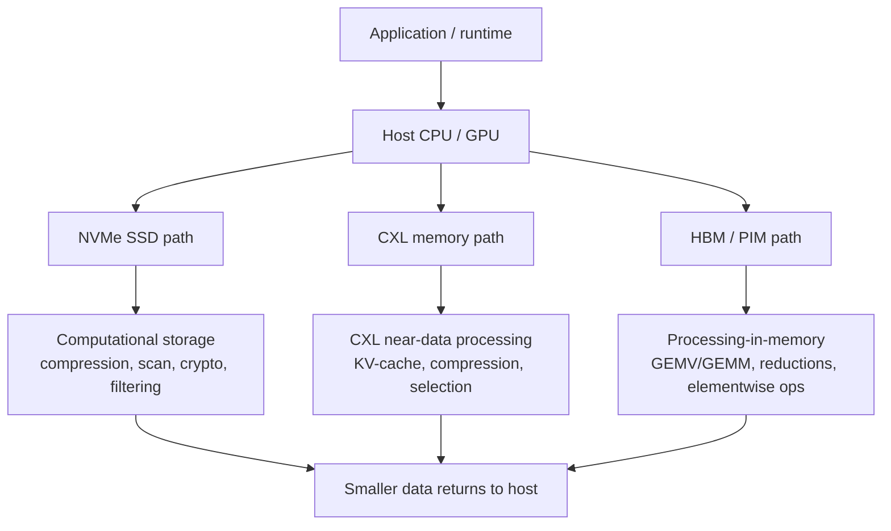

# Computational Storage And Near-Memory Compute

Computational storage and near-memory compute are two versions of the same economic claim: data movement is too expensive, so some computation should move toward the bytes. Computational storage pushes work into or beside SSDs. Near-memory compute pushes work into CXL memory devices, HBM stacks, DIMM-like modules, or memory-side controllers. The boundary is increasingly blurry because CXL SSDs, CXL memory expanders, and processing-near-memory accelerators all expose memory/storage capacity through a fabric and then ask where filtering, compression, decompression, search, security, or KV-cache selection should execute.

## Why The Idea Keeps Returning

The classical server I/O stack assumes storage is a passive block device and memory is a passive load/store substrate. That model breaks down when workloads move petabytes through CPUs only to discard most bytes after filtering, decompression, hashing, encryption, database scans, vector search, or feature extraction. The first-order benefit of near-data processing is not that an SSD controller or CXL expander is faster than a CPU or GPU. It is that the host should not burn PCIe bandwidth, DRAM bandwidth, cache capacity, and CPU cycles moving data that a local engine can reduce before transfer.

The difficulty is that the compute must be programmable enough to matter, simple enough to verify, and power-limited enough to survive inside a storage or memory thermal envelope. A 2025 survey of computational storage for data integrity and security framed the concept as embedding compute resources within storage devices to reduce data movement and energy, while also noting recent commercialization in devices such as Samsung SmartSSD and ScaleFlux CSDs.[^S127] That same framing explains the sector's stop-start history: the architecture is compelling, but programmability, deployment, and standard software stacks have lagged.

## Computational Storage: From SmartSSD To Compression SSDs

The most visible early enterprise product was Samsung's SmartSSD, developed with Xilinx FPGA acceleration before AMD acquired Xilinx. 2025 coverage described the SmartSSD as a computational storage drive with NAND, HBM, RDIMM memory, and an FPGA accelerator, originally aimed at bringing compute closer to stored data.[^S126] The same report said the product effectively faded after its second generation and remained visible mainly under the AMD/Xilinx brand, with Gen3 limits, hardware complexity, and the AI-era shift toward capacity and accelerator memory all working against broad adoption.[^S126]

That history is useful because it shows why generic "put an FPGA in the SSD" can be too expensive for mainstream storage. The customer has to write and validate kernels, manage deployment, deal with data-path security, and trust a storage device with application logic. If the offload is narrow and common, a fixed-function ASIC can be easier to sell than a reconfigurable accelerator. ScaleFlux is closer to that second model: its CSD 5320 is described in 2025 coverage as a PCIe Gen5 enterprise SSD with built-in compression/decompression hardware, up to 128 TB physical capacity, up to 256 TB effective capacity for compressible workloads, and reported compressible sequential writes above 13 GB/s and reads above 14 GB/s in independent testing.[^S125]

ScaleFlux illustrates the pragmatic computational-storage path. Compression is universal enough to justify silicon, the benefit can be expressed as effective capacity and endurance, and the host does not need to reason about arbitrary user kernels inside the drive. The limitation is equally clear: the value depends on workload compressibility, data-path integration, and enterprise trust in the device's compression ratio and failure semantics. A database full of already-compressed media does not see the same economics as logs, telemetry, JSON, genomic intermediates, or sparse analytics data.

## SSD-Near-Data Research

Recent research is trying to make SSD-side compute less brittle. A January 2026 paper called Conduit argues that SSDs support multiple near-data processing paradigms: in-storage processing, processing using DRAM inside the SSD, and in-flash processing.[^S128] Conduit proposes compiler and runtime support that chooses among those resources at instruction granularity, claiming 1.8x speedup over the best prior offloading policy and 46% energy reduction in simulated data-intensive workloads.[^S128]

The point is not that every SSD will run arbitrary application code tomorrow. The point is that a real CSD needs a placement policy, not just an accelerator. If filtering should run near NAND but compression should run in a controller engine and a join should remain on the host, the system needs a cost model. That makes computational storage a software/hardware co-design problem, closer to query planning and compiler optimization than to ordinary SSD procurement.

The CXL variant pushes the same idea further. A 2026 WIO paper argues that persistent memory and computational storage both failed to displace conventional NVMe SSDs at scale because of programming complexity, ecosystem fragmentation, and thermal/power cliffs; it proposes migratable WebAssembly storage actors on CXL SSDs so logic can move between host and device as conditions change.[^S129] The reported evaluation, using an FPGA CXL SSD prototype and production CSDs, claimed up to 2x throughput improvement and 3.75x write-latency reduction without application modification.[^S129] That is important because it treats offload as reversible, not as a one-time compile-time commitment.

## NVMe-oF, SmartNICs, And Security Offload

Computational storage also overlaps with disaggregated storage. When NVMe devices sit behind a fabric, the near-data engine might be in the drive, a storage server, a DPU/SmartNIC, or a CXL-attached module. A 2025 sNVMe-oF paper described NVMe-over-Fabrics as a standard solution in modern datacenters and proposed security extensions that use NVMe metadata and confidential-computing-capable SmartNIC accelerators to provide confidentiality, integrity, and freshness guarantees with as little as 2% degradation for synthetic patterns and AI training.[^S130]

This matters for memory/semicap analysis because it moves "computational storage" from the SSD alone into a broader I/O complex. Security, checksums, compression, erasure coding, encryption, and integrity-tree maintenance can all sit in the path between host and NAND. The buyer may not care whether the offload is called computational storage, DPU storage acceleration, or NVMe-oF security. The semicap and silicon question is where the extra gates, SRAM, accelerators, and package power budget live.

## CXL Near-Memory Compute

CXL changes the near-data discussion because the host can access device memory with load/store semantics rather than block I/O semantics.[^S105] A passive CXL memory expander adds capacity; an active CXL memory expander can compress, filter, select, reduce, or transform data before it crosses the link. The economic target is often bandwidth amplification. If the device can reduce bytes or select only useful rows/tokens/pages, the host sees more effective bandwidth than the CXL link physically provides.

The 2025 CXL-NDP paper is a direct example for LLM inference. It proposed precision-scalable bit-plane layout and transparent lossless compression for weights and KV caches inside a CXL device, reporting 43% throughput improvement, 87% longer maximum context length, and a 46.9% KV-cache footprint reduction without accuracy loss.[^S109] Another 2025 paper on CXL-based computational memory proposed KAI and asynchronous back-streaming to better coordinate host and computational-memory interactions, reporting up to 50.4% end-to-end runtime reduction and large idle-time reductions for host and CCM devices.[^S132]

The long-context LLM case is even more pointed. A 2025 CXL-enabled processing-near-memory paper for 1M-token inference argued that KV-cache recalls become a severe bottleneck when context windows grow, then offloaded token page selection into a PNM accelerator inside CXL memory.[^S133] The reported PNM-only and GPU-PNM hybrid schemes achieved up to 21.9x throughput improvement, up to 60x lower energy per token, and up to 7.3x better total cost efficiency than baseline in the paper's evaluation.[^S133] Those are research claims, but they explain why CXL memory vendors may eventually sell more than raw capacity.

There is a general-purpose branch as well. A 2024 paper on memory-mapped NDP for CXL memory expanders argued that CXL.mem-compatible communication and lightweight microthreads can reduce the overhead of invoking near-data kernels; it reported up to 128x workload speedups and 80.3% average energy reduction versus passive CXL memory with CPU/GPU hosts in its evaluation.[^S134] The main takeaway is that CXL near-memory compute needs a low-latency invocation path. If every offload looks like a slow device command, only coarse kernels make sense. If offload can be expressed through low-overhead memory-mapped functions, finer kernels become viable.

## HBM-PIM And Memory-Stack Compute

HBM processing-in-memory is the high-bandwidth version of the same thesis. Samsung announced HBM-PIM in 2021, and public summaries describe a DRAM-optimized AI engine inside memory banks intended to reduce data movement and improve performance per watt.[^S131] The more recent research question is whether these memory-side engines can become programmable enough for general tensor operations instead of only narrow GEMV-like kernels.

A 2026 AME-PIM paper studied whether Samsung Aquabolt-XL HBM-PIM could act as a backend for RISC-V matrix acceleration. It mapped matrix instructions to HBM-PIM micro-kernels and reported up to 14.9 GFLOP/s, or 59.4 FLOP/cycle, on a single HBM pseudo-channel for matrix tile multiplication.[^S135] That is not a replacement for GPUs. It is evidence that memory-side execution can become part of an accelerator programming model if the ISA, compiler, runtime, and memory interface converge.

The constraint is reduction and programmability. Memory arrays are excellent at bandwidth and local parallelism, but reductions, synchronization, control flow, and precision management can pull work back to the host. HBM-PIM therefore looks most useful for bandwidth-bound matrix-vector, elementwise, embedding, and inference kernels where data movement dominates arithmetic. It looks less useful for irregular control-heavy computation or training regimes that need high precision, dynamic scheduling, and large reductions.

## Market Structure

There are three investable layers. The first is fixed-function computational storage: compression, decompression, crypto, checksum, erasure coding, filtering, and telemetry engines embedded into SSD controllers or DPUs. The second is programmable near-data hardware: FPGA/ASIC/CXL devices that run kernels near SSD, NAND, or memory. The third is memory-side acceleration inside HBM or CXL devices, usually tied to AI inference, vector search, or database primitives.

The first layer is the most commercial because it can be explained in ordinary storage metrics: effective capacity, endurance, latency, watts, and controller offload. The second layer is harder because it needs developer tooling and a trust model. The third layer is potentially the most strategically important for AI because KV-cache growth, vector retrieval, recommendation embeddings, and long-context inference are all memory-movement problems.

For semicap, computational storage does not create a new wafer category comparable to DRAM or NAND. It shifts controller complexity upward: more advanced SSD controllers, larger SRAMs, accelerators, compression engines, firmware validation, and sometimes extra DRAM/HBM on the device. Near-memory compute can matter more for packaging if it pulls logic closer to stacked memory, CXL modules, or interposer designs. In both cases, the revenue pool is more likely to accrue to controller ASICs, FPGA/SoC vendors, DPU vendors, memory-module designers, and system software suppliers than to raw NAND wafer capacity.

## Adoption Barriers

The first barrier is software transparency. Enterprises hesitate to move application logic into storage unless the failure semantics are boring. If an SSD compression engine silently changes write amplification or latency tails, that is manageable. If an arbitrary query operator runs inside the drive, the debug surface expands dramatically. That is why reversible offload and programmer-transparent frameworks are recurring research themes.[^S128][^S129]

The second barrier is thermal headroom. SSDs already run close to power and temperature limits under sustained writes. A compute engine that improves average throughput but trips throttling can lose in production. CXL memory devices and HBM stacks face the same issue: compute near the memory competes with memory refresh, signal integrity, retention, and package thermals.

The third barrier is standardization. A buyer wants code portability across devices, predictable security isolation, and observability. Without a stable model for loading kernels, handling errors, proving data integrity, and measuring performance, computational storage remains a collection of point products. The practical path is therefore narrow and workload-specific: compression SSDs, secure NVMe-oF offload, CXL KV-cache accelerators, and HBM-PIM kernels where the system benefit is large enough to justify integration.

## Workload Fit

The best workloads have high data-reduction ratio, predictable kernels, and low synchronization needs. Compression is a good fit because every byte already crosses the controller, the algorithm is narrow, and the customer can measure effective capacity and endurance directly. Security offload is a good fit because encryption, authentication, and metadata checks naturally sit in the I/O path. Scan filtering can be a good fit when predicates are simple, datasets are large, and the host would otherwise move many rejected records.

The weakest workloads have branch-heavy control flow, small working sets, or tight host interaction. If the host must invoke an offload kernel for every tiny object, command overhead dominates. If the workload depends on complex joins, model-specific code, or frequent synchronization, the device becomes an awkward coprocessor. This is why the Conduit and WIO papers emphasize programming and migration policies rather than only device hardware: the placement decision must adapt to the kernel, data locality, thermal state, and host/device queue depth.[^S128][^S129]

LLM inference creates a different workload fit. The kernel may be simple, but the data volume is enormous. KV-cache management, token page selection, and low-precision weight movement can dominate long-context serving. The CXL-NDP and 1M-token PNM papers are therefore more relevant to inference memory hierarchy than to generic storage acceleration.[^S109][^S133] In that setting, the offload value is not measured as SSD IOPS. It is measured as effective context length, GPU idle-time reduction, CXL bandwidth relief, and lower energy per generated token.

Vector search and retrieval-augmented generation are also attractive candidates. They often scan or filter large embedding stores, apply relatively regular distance or pruning operations, and return a small candidate set. Some of that work can remain on GPUs or CPUs, but the trend toward larger retrieval corpora makes near-storage filtering and near-memory reduction economically plausible. The key is accuracy and recall: an offload engine that saves bandwidth but degrades ranking quality can hurt the application more than it helps infrastructure cost.

Database acceleration is more mixed. Predicate pushdown, decompression, checksum, and columnar scan operations are natural. Full SQL execution inside a drive is much harder because query plans, transactions, concurrency control, and isolation semantics are system-level concerns. For this reason, computational storage is more likely to appear as a storage-engine primitive than as a complete database-in-SSD platform.

## Buyer Diligence Checklist

For a hyperscaler or enterprise buyer, the diligence questions should be concrete. First, what fraction of total wall-clock time is data movement rather than compute? Second, how much of that movement can be eliminated before crossing PCIe, CXL, Ethernet, or HBM interfaces? Third, does the device return identical results, or does it introduce approximate behavior? Fourth, who debugs failures when the storage or memory device executes code? Fifth, can the same application run when the device is absent, throttled, or upgraded?

Those questions separate credible products from architectural demos. A compression SSD can answer them cleanly: data remains data, and the device exposes capacity and latency behavior. A CXL KV-cache accelerator has to answer them at the model-serving layer, including scheduler interaction and fallback behavior. A programmable CSD has to answer them across kernel loading, sandboxing, memory protection, observability, and fleet rollout. The more general the accelerator, the heavier the operational burden.

From a vendor strategy standpoint, the easiest wedge is a transparent function that improves a metric the storage buyer already tracks. The harder but larger opportunity is an AI-memory primitive that changes GPU utilization or rack-level cost. The hardest opportunity is a fully programmable near-data platform, because it competes with CPUs, GPUs, DPUs, and software frameworks all at once.

## Outlook

Computational storage is unlikely to become a broad replacement for ordinary NVMe SSDs. The simpler interpretation is that storage controllers and memory modules are becoming more active. Compression, integrity, and security offloads will look like ordinary controller features. CXL near-memory compute will likely appear first in hyperscale systems where the workload is known and the fleet operator can control software placement. HBM-PIM will remain a high-end accelerator feature unless programming models become portable.

The strategic conclusion is that near-data compute is not a memory type. It is a placement doctrine. As memory and storage hierarchies become more expensive, the question shifts from "where is the data stored?" to "where should the cheapest correct operation run?" That question will increasingly shape controller ASICs, CXL modules, HBM base dies, DPUs, and storage software even if the label "computational storage" comes and goes.

## Sources

[^S105]: Compute Express Link overview, Wikipedia, Crawled 2026-05, no stable page publish date listed, https://en.wikipedia.org/wiki/Compute_Express_Link
[^S109]: Amplifying Effective CXL Memory Bandwidth for LLM Inference via Transparent Near-Data Processing, arXiv, published 2025-09-03, https://arxiv.org/abs/2509.03377
[^S125]: ScaleFlux CSD 5320 compression SSD review summary, TechRadar, published 2025-09-21, https://www.techradar.com/pro/like-nothing-else-out-there-scaleflux-extraordinary-ssd-compresses-datasets-on-the-fly-and-delivers-equally-extraordinary-performance-says-review
[^S126]: Samsung and AMD SmartSSD computational storage retrospective, TechRadar, published 2025-09-16, https://www.techradar.com/pro/samsung-and-amd-made-a-revolutionary-ssd-together-then-it-was-left-to-wither-in-the-shadows-and-nobody-knows-exactly-why
[^S127]: Revisiting Computational Storage for Data Integrity and Security, arXiv, published 2025-04-12, https://arxiv.org/abs/2504.15293
[^S128]: Conduit: Programmer-Transparent Near-Data Processing Using Multiple Compute-Capable Resources in Solid State Drives, arXiv, published 2026-01-24, https://arxiv.org/abs/2601.17633
[^S129]: WIO: Upload-Enabled Computational Storage on CXL SSDs, arXiv, published 2026-04-02, https://arxiv.org/abs/2604.02442
[^S130]: sNVMe-oF: Secure and Efficient Disaggregated Storage, arXiv, published 2025-10-21, https://arxiv.org/abs/2510.18756
[^S131]: High Bandwidth Memory overview, including Samsung HBM-PIM summary, Wikipedia, Crawled 2026-05, no stable page publish date listed, https://en.wikipedia.org/wiki/High_Bandwidth_Memory
[^S132]: Offloading to CXL-based Computational Memory, arXiv, published 2025-12-04, https://arxiv.org/abs/2512.04449
[^S133]: Scalable Processing-Near-Memory for 1M-Token LLM Inference, arXiv, published 2025-10-31, https://arxiv.org/abs/2511.00321
[^S134]: Low-overhead General-purpose Near-Data Processing in CXL Memory Expanders, arXiv, published 2024-04-30, https://arxiv.org/abs/2404.19381
[^S135]: AME-PIM: Can Memory be Your Next Tensor Accelerator?, arXiv, published 2026-04-30, https://arxiv.org/abs/2604.27808
