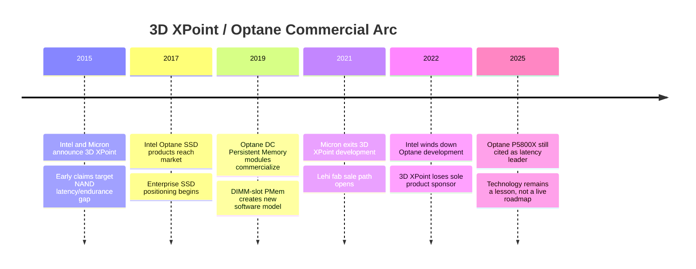

# 3D XPoint And Optane Postmortem

3D XPoint was the rare emerging memory that actually reached commercial production at meaningful scale. Intel and Micron announced it in July 2015 as a new non-volatile memory class positioned between DRAM and NAND: faster and more durable than flash, denser and cheaper than DRAM, and addressable without the block-erase behavior that shapes NAND SSDs.[^S137][^S138] Intel later commercialized the technology under the Optane brand; public summaries place Optane's open-market availability from April 2017 until Intel wound down future Optane development in July 2022.[^S136]

## What 3D XPoint Was Supposed To Solve

The core thesis was the "memory-storage gap." DRAM is fast and byte-addressable but volatile and expensive. NAND is non-volatile and cheap per bit but block-managed, relatively high-latency, and endurance-limited. 3D XPoint tried to sit between them with a cross-point array that stored bits at intersections of wordlines and bitlines rather than in floating-gate or charge-trap cells.[^S138] Wired's 2015 launch coverage emphasized the transistor-less lattice concept and the claim that the technology could store much more data than DRAM while being much faster than NAND.[^S137][^S138]

The product problem was subtle. "Between DRAM and NAND" sounds like a huge market, but it is not a single buying center. Storage buyers compare Optane SSDs to NAND SSDs on dollars per terabyte, sequential throughput, endurance, latency tails, and controller ecosystem. Server-memory buyers compare Optane Persistent Memory to DRAM on bandwidth, latency, software compatibility, capacity, and platform lock-in. Software buyers ask whether persistence at byte granularity is worth changing data structures, recovery logic, filesystem assumptions, and operating procedures.

That split doomed the "universal memory" framing. As a storage device, Optane was technically excellent but expensive. As memory, it was denser and persistent but slower than DRAM and harder to program. As a new software abstraction, it required developers to understand flushes, ordering, persistence domains, and failure atomicity. The technical achievement was real; the market category was unstable.

## Device And Product Architecture

Public technical descriptions identify 3D XPoint as a resistance-changing cross-point memory with a stackable grid access array and ovonic-threshold-switch behavior.[^S136] Intel and Micron did not disclose full materials details at launch, which created years of debate over whether it was closer to phase-change memory, ReRAM, or a proprietary bulk-switching path. For market analysis, the exact taxonomy matters less than the system behavior: it was non-volatile, high-endurance relative to NAND, lower-latency than NAND SSDs, and manufacturable in a dedicated Lehi, Utah process flow tied to the Intel-Micron IM Flash history.[^S136][^S143]

Intel sold Optane in two principal forms. The first was Optane SSD: block devices such as P4800X/P5800X serving low-latency storage, caching, logging, write-ahead logs, metadata, and latency-sensitive enterprise I/O. The second was Optane DC Persistent Memory: DIMM-form modules on the memory bus that could be exposed as volatile memory expansion or application-addressable persistent memory. Public summaries of Optane Persistent Memory describe 128 GB, 256 GB, and 512 GB module classes and a DDR4-era DIMM interface tied to supported Xeon platforms.[^S136]

The storage product worked better than the memory product from a procurement standpoint. An Optane SSD could drop into an existing block stack and deliver very low latency for specific workloads. Optane PMem, by contrast, demanded platform support, BIOS configuration, operating-system support, libraries, application changes for App Direct mode, and operational education. Memory Mode hid the complexity by using DRAM as a cache, but then persistence was lost and the product became a capacity-expansion tier rather than a new programming model.

## Performance Was Not The Main Failure

Optane's performance reputation remained strong even after the product died. 2025 coverage still described the Optane P5800X as unbeaten in real-world responsiveness, noting random read/write IOPS above 4.5 million and latency frequently below 10 microseconds, even as newer PCIe Gen5 NAND SSDs delivered higher sequential throughput.[^S139] That is the core postmortem paradox: Optane could win the hard latency tests and still lose the business.

The PMem data was more nuanced. A 2020 measurement paper on Optane DC Persistent Memory Module reported approximately 374 ns random read-only latency, 391 ns latency for writeback-involving random access, about 38 GB/s read bandwidth for interleaved modules, and about 3 GB/s writeback-involving bandwidth.[^S140] Those figures are radically better than SSD block I/O, but they are not DRAM. Persistent memory therefore needed software and data structures that exploited capacity and persistence while avoiding write-bandwidth cliffs.

Database studies found exactly that. A 2020 DBMS evaluation argued that non-volatile memory changes access methods, buffer management, logging, recovery, and data-placement choices, and concluded that simple hardware or software substitution is not enough for best use of PMem.[^S141] A 2022 MongoDB-oriented cache paper made the penalty more direct: writes on Optane NVRAM disproportionately hurt reads, so an indiscriminate admission policy can destroy cache throughput; the authors built a policy that balances admission and lookup rate instead.[^S142]

Those papers explain why the product was technically sophisticated but commercially awkward. Optane did not merely require a buyer to pay for a faster SSD. It asked the buyer to understand a new tier with asymmetric read/write behavior, persistence semantics, and platform constraints. That is a high bar unless the workload is screaming for the exact capability.

## Business Timeline And Strategic Break

The partnership structure weakened before the final product exit. Intel and Micron originally developed the technology through the IM Flash/Lehi manufacturing base, but public summaries note Micron's move to acquire Intel's remaining IM Flash stake in 2019, then Micron's March 2021 decision to cease 3D XPoint development and redirect toward CXL-related products.[^S136][^S143] The Lehi fab was later sold to Texas Instruments for $900 million in 2021.[^S143]

Once Micron exited, Intel became the sole commercial steward of the memory technology. That left Optane exposed to Intel's broader portfolio triage. By 2021 Intel had already discontinued consumer Optane products, and in July 2022 it disclosed that it would cease future product development within the Optane business.[^S136] Public summaries tie the 2022 Optane wind-down to a $559 million inventory impairment, a painful but rational signal that the company no longer saw enough strategic return to keep funding the line.[^S136]

The timing also mattered. NAND SSDs improved quickly, PCIe Gen4 and Gen5 lifted sequential bandwidth, controller firmware reduced latency tails for many workloads, and DRAM pricing cycles periodically made the DRAM-to-Optane cost gap less compelling. Meanwhile CXL emerged as the new industry-standard path for memory expansion and pooling.[^S105] Optane PMem was proprietary and platform-specific; CXL promised an open fabric for memory-tier innovation even if early products were less elegant technically.

## Why Optane Lost

The first reason was cost-per-bit. Optane was not cheap enough to replace NAND and not fast enough to replace DRAM. A product between two learning-curve giants must own a very large, very specific pain point. Optane owned latency, endurance, and persistence, but most buyers optimized for capacity, price, and ecosystem simplicity.

The second reason was software friction. SSD-mode Optane required the least change, but then it competed with NAND SSDs and storage software. PMem-mode Optane was more differentiated, but it required software awareness to unlock persistence. Memory Mode was easier to adopt, but it made Optane a volatile capacity tier and obscured the persistence story. The product therefore had three go-to-market stories, each partially undermining the others.

The third reason was platform dependence. Optane PMem required specific Xeon generations and memory controllers. That gave Intel vertical control, but it narrowed the ecosystem. Once Intel's CPU roadmap was under pressure, a proprietary memory tier attached to that roadmap became harder to defend. CXL's open-host narrative became more attractive to system vendors, hyperscalers, and memory suppliers that did not want a single-CPU-vendor tie.

The fourth reason was manufacturing underutilization. Emerging memories need dedicated process learning, materials control, and yield improvement. If volume does not ramp, the fab cost structure becomes brutal. The Lehi sale to TI is the cleanest artifact: a unique memory fab ultimately had more value as a 300 mm analog/embedded processing asset than as a 3D XPoint growth platform.[^S143]

## Product Segments And What Each Taught

The consumer cache products were the weakest strategic wedge. Small Optane M.2 modules could accelerate a hard drive or cheap SSD, but the consumer market moved quickly toward larger NAND SSDs. Once TLC and QLC NVMe SSDs became cheap enough for mainstream notebooks and desktops, an extra cache module with driver dependencies lost shelf appeal. This is a useful lesson for HBF and CXL memory: a new tier has to survive the learning curve of the incumbent tier. If the incumbent becomes cheap enough before the ecosystem matures, the bridge product disappears.

Enterprise Optane SSDs were the strongest product line technically. They did not ask customers to rewrite applications, and they attacked real bottlenecks: write-ahead logs, metadata updates, filesystem journals, caching layers, and low-queue-depth transactional I/O. The P5800X's continued reputation in 2025 shows that the storage product delivered a lasting performance artifact.[^S139] The weakness was that the addressable market for premium ultra-low-latency SSDs was smaller than the addressable market for cheap capacity SSDs. A database fleet might buy some Optane drives for logs or hot metadata, but not enough to load a dedicated media fab.

Optane Persistent Memory was the most strategically ambitious segment. It promised large memory footprints, persistence, and a path to rethinking databases and in-memory analytics. It also created the deepest adoption burden. Academic measurements showed that PMem occupied a real intermediate point: far faster than storage, slower and more asymmetric than DRAM.[^S140][^S141] That meant software had to be redesigned around the media. A simple "replace DRAM" message was false, and a pure "replace SSD" message wasted the byte-addressability.

The lesson is that a new memory tier should have one primary buyer story. Optane had at least three: cache, SSD, and PMem. Each made sense locally, but together they made demand forecasting and ecosystem investment harder. Customers asked whether Optane was a storage product, a memory product, or a software platform. The answer was "all three," which is technically elegant but commercially expensive.

## Counterfactuals

Could Optane have survived under different choices? Possibly, but the counterfactuals are narrow. If CXL had arrived earlier and Optane media had been offered as a multi-vendor CXL memory expander rather than a Xeon-attached DIMM, the platform-lock-in objection would have been weaker. But that still would not solve media cost, write bandwidth, or fab utilization. CXL can make a tier easier to attach; it cannot make a scarce media cheap.

If Micron had stayed committed, the market might have had a second supplier and a broader memory-vendor ecosystem. That could have helped OEM confidence and volume learning. But Micron's 2021 decision to cease 3D XPoint development suggests the company did not see the demand curve needed to justify continued investment.[^S136] A second supplier only matters if both suppliers can see a road to gross margin at scale.

If Intel had focused only on enterprise SSDs, Optane might have remained a profitable niche longer. The problem is that a niche SSD line probably could not justify the full media roadmap. Persistent Memory was the bigger prize, but it required a software revolution. This is the central emerging-memory trap: the niche that proves the media may be too small to fund it, while the broad market that funds it may require too much ecosystem change.

If cloud vendors had standardized on PMem-native databases and storage engines, adoption could have accelerated. But hyperscalers are disciplined buyers. They tend to avoid proprietary tiers unless the TCO win is unmistakable and available across platforms. Optane arrived before a large, cross-vendor persistent-memory ecosystem existed, and before AI workloads made memory capacity the singular infrastructure bottleneck. By the time memory hierarchy became the dominant AI problem, HBM, CXL DRAM expansion, and custom accelerators were the focus.

## Stakeholder Lessons

For memory suppliers, Optane says that media differentiation must be tied to a manufacturing volume path. It is not enough to have a better bit. The supplier needs a product class large enough to improve yield, amortize process modules, and keep customers confident that the roadmap will survive multiple procurement cycles. Emerging NVM in embedded foundry IP has a lower volume threshold than standalone commodity memory; that is one reason MRAM and ReRAM may succeed in niches where 3D XPoint could not.

For CPU and platform vendors, Optane says that proprietary memory hooks are risky. Platform coupling can produce early performance wins, but it narrows the ecosystem and can turn a memory technology into a casualty of CPU roadmap shifts. CXL is partly a reaction to that. It moves memory-tier experimentation onto an industry fabric, even if CXL-attached DRAM or flash cannot match every Optane PMem attribute.[^S105]

For software vendors, Optane says that persistence is not free. Byte-addressable persistence requires crash consistency, logging discipline, flush ordering, recovery testing, and failure-mode education. The DBMS and cache papers are valuable because they show that PMem is neither "just slower DRAM" nor "just faster SSD"; it needs policies that account for asymmetric writes, cache admission, and data-structure layout.[^S141][^S142]

For investors, Optane says to separate technical superiority from ecosystem timing. A device can dominate latency benchmarks and still fail if its market is split, its software path is difficult, its platform support is narrow, and its fab economics need more volume than the niche can provide. That framing should be applied to every claim about universal memory, storage-class memory, or AI memory hierarchy disruption.

## What Optane Proved

Optane proved that a non-charge-storage memory could be manufactured, qualified, and sold into real enterprise systems. It proved that ultra-low-latency persistent storage can remain valuable even after NAND sequential performance improves. It proved that byte-addressable persistence is technically useful but operationally demanding. It also proved that a new memory tier cannot succeed on device physics alone.

For future technologies such as ReRAM, MRAM, PCM, HBF, and CXL memory pooling, the lesson is harsh but useful. The cell must be good, the cost curve must be credible, the interface must be standard, the software path must be sane, and the buyer must have a workload that values the new tier enough to change procurement and operations. Optane had many of those pieces but not enough at the same time.

The most durable legacy is conceptual. Today's CXL memory expansion, tiered DRAM, persistent-memory software libraries, near-memory compute, and storage-class memory debates all inherit Optane's vocabulary. The difference is that the industry is now trying to make the tier modular and multi-vendor rather than tied to one media technology and one CPU vendor.

## Implications For The Memory Database

In this database, Optane belongs in "other emerging memory" because it is the best commercial stress test of the category. It is not a footnote. It is the case study that disciplines every emerging-memory forecast. Whenever a new technology claims "DRAM-like speed, NAND-like persistence, and lower cost," Optane shows the diligence questions: exact latency under load, asymmetric write behavior, endurance, software model, platform lock-in, fab utilization, and who pays for the ecosystem transition.

The semicap read-through is also important. A new memory may require unique deposition, selectors, etch, metrology, and process control, but tool intensity does not guarantee market success. Without volume, dedicated process modules become stranded investment. Optane's end does not mean emerging NVM is dead; it means that future winners are more likely to enter through embedded IP, CXL-attached capacity, fixed-function near-data acceleration, or workload-specific AI memory tiers than through a standalone universal-memory replacement story.

## Watchpoints After Optane

First, watch whether CXL memory products recreate Optane's adoption problem. CXL lowers platform lock-in, but it still needs software tiering, page placement, monitoring, and failure handling. Second, watch whether NAND controllers continue absorbing latency-sensitive functions through larger SRAM, better firmware, and compression. Third, watch whether persistent-memory programming models survive without a dominant PMem DIMM product. If they do, Optane's software legacy will outlive the media.

Finally, watch pricing cycles. Optane's business case was strongest when DRAM was expensive and NAND latency mattered. In AI-era servers, the comparable pressure point is HBM capacity and CXL memory expansion rather than storage latency. That is why the post-Optane opportunity has shifted from "storage-class memory" to "memory hierarchy management." The same gap remains; the industry just stopped believing that one proprietary media type would fill it.
