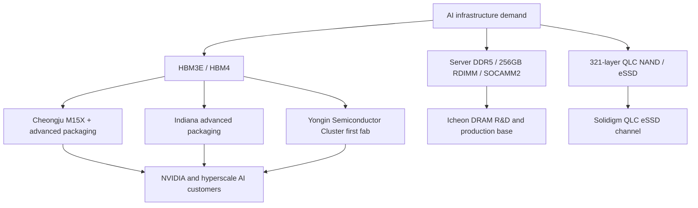

# SK hynix Profile: AI Memory Leader, HBM Bottleneck Owner, And Korea Capacity Anchor

SK hynix is the memory vendor most directly levered to the AI accelerator cycle. The company is not the largest diversified semiconductor vendor, but its product mix, customer intimacy, and execution in HBM3E/HBM4 have made it the clearest pure-play expression of high-value DRAM scarcity. In FY2025, SK hynix reported record revenue of KRW 97.1467 trillion, operating profit of KRW 47.2063 trillion, and net profit of KRW 42.9479 trillion; management attributed the result to AI memory competitiveness and high value-added products including HBM.[^S144] HBM revenue more than doubled year-on-year, conventional DRAM moved into full-scale 1c mass production, NAND completed 321-layer QLC development, and management said large-scale HBM4 production was underway to meet customer requests.[^S144]

[FY2025 financial-results video](https://www.youtube.com/embed/7RJOjYtI7Q0) - SK hynix's official earnings video accompanying record FY2025 results.

[321-layer QLC NAND cSSD video](https://www.youtube.com/watch?v=wvxoHiA_QNc/) - Official newsroom-linked product video for SK hynix's AI PC and storage positioning.

[SK hynix newsroom YouTube channel](https://www.youtube.com/@SKhynixNewsroom) - Official video channel for product, executive, and technology updates.

## Strategic Position

SK hynix's current moat is not "memory" in the generic sense. It is HBM yield learning, customer qualification, packaging execution, and the ability to allocate scarce high-value DRAM bits into AI systems. The company entered 2026 with unusually strong public confidence: its FY2025 release said it had stably supplied both HBM3E and HBM4, had prepared for industry-first HBM4 mass production in September 2025, and was moving large-scale HBM4 production to meet customer requests.[^S144] That language matters because HBM is not sold like commodity DDR. It is qualified stack-by-stack, platform-by-platform, and customer-by-customer.

At NVIDIA GTC 2026, SK hynix said it would display HBM4, HBM3E, SOCAMM2, high-capacity server DRAM, LPDDR6, GDDR7, eSSD, and automotive solutions under a "Spotlight on AI Memory" theme.[^S145] The company explicitly framed memory as moving from component status to a core element that determines AI infrastructure architecture and performance.[^S145] This is exactly the strategic shift that moved HBM from a specialty graphics memory to the allocation center of the DRAM industry.

The company's narrower focus is a strength and a risk. Unlike Samsung, SK hynix does not have the same scale in logic, foundry, smartphones, or consumer electronics. Unlike Micron, it is not tied to the same U.S. CHIPS Act manufacturing narrative. Its equity story therefore depends heavily on memory-cycle discipline, AI DRAM attach, HBM yield, and packaging capacity. When that cycle is favorable, operating leverage is extraordinary; when DRAM and NAND prices break, the same focus cuts the other way.

## Product Portfolio

| Product family | 2026 role | Strategic read-through |
|---|---|---|
| HBM3E / HBM4 | AI accelerator memory, GPU/ASIC package attach | Highest-margin DRAM allocation, packaging-limited |
| Custom HBM / cHBM | Base-die and function integration for customer ASICs | Moves SK hynix closer to platform co-design |
| SOCAMM2 | Low-power AI server memory module | Broadens beyond GPU-attached HBM into system memory |
| LPDDR6 | On-device AI, mobile, edge systems | Keeps conventional DRAM node leadership visible |
| 321-layer QLC NAND / eSSD | AI PC and data-center storage | Links NAND to AI storage and Solidigm eSSD channel |
| GDDR7 / automotive | Graphics and edge/vehicle memory | Diversifies away from pure HBM concentration |

The CES 2026 showcase gives the cleanest public cross-section. SK hynix said it would unveil 16-layer HBM4 with 48 GB for the first time, after the 12-layer HBM4 with 36 GB had demonstrated 11.7 Gbps speed and was aligned with customer schedules.[^S146] The company also said it would present 12-layer HBM3E with 36 GB, SOCAMM2, LPDDR6, 321-layer 2 Tb QLC NAND optimized for ultra-high-capacity eSSDs, custom HBM, PIM-based AiMX, Compute-using-DRAM, CXL Memory Module-Accelerator xPU, and data-aware computational storage.[^S146]

That portfolio reveals the direction of travel. HBM is still the profit engine, but SK hynix is surrounding it with adjacent memory-side compute and system-memory products. Custom HBM integrates functions into the HBM base die for customer requirements; CMM-Ax adds computation to CXL memory; Data-aware CSD processes data in storage; AiMX uses a GDDR6-AiM chip for large language models.[^S146] These are not all near-term revenue drivers, but they show that SK hynix wants to be viewed as an AI memory architecture supplier, not just a die vendor.

## HBM And Packaging Execution

HBM execution has three separate bottlenecks: DRAM die yield, stack assembly/yield, and customer qualification. SK hynix's competitive advantage is that it has been public and specific about all three. The company highlights Advanced MR-MUF packaging, high-stack know-how, and customer-aligned HBM4 timing; 2026 third-party coverage of SK hynix's 16-high HBM4 described a 48 GB stack, a 2,048-bit interface, and up to 10 GT/s signaling, while noting the importance of MR-MUF for high-stack thermal and structural reliability.[^S149]

Management's capacity comments in the FY2025 release are also telling. SK hynix said it would maximize M15X fab capacity in Cheongju at an early stage, secure mid-to-long-term production through the first fab in the Yongin Semiconductor Cluster, and continue construction of advanced packaging facilities in Cheongju and Indiana.[^S144] This creates a front-end/back-end map: Cheongju carries near-term HBM and packaging leverage, Yongin creates the next DRAM capacity base, and Indiana gives the company U.S. advanced-packaging presence for AI customers.

The investment implication is that HBM share is not simply DRAM wafer share. A vendor can have enough DRAM wafers and still lose if stack yield, thermal solution, base-die integration, and test throughput lag. Conversely, a vendor with stronger stack yield can convert a limited wafer base into disproportionate HBM profit. SK hynix's 2025 results and public HBM4 language suggest it has captured that second dynamic, at least for the current cycle.[^S144]

## DRAM Node And Conventional Memory

SK hynix cannot live on HBM alone. It needs conventional DRAM leadership to feed server modules, mobile, graphics, and the HBM die roadmap. In March 2026, the company announced 16 Gb LPDDR6 based on its sixth-generation 10 nm-class 1c process, claimed 33% faster speed and more than 20% better power efficiency compared with LPDDR5X, and said mass-production preparations would complete in the first half of 2026 with supply beginning in the second half.[^S147] The LPDDR6 announcement is a useful marker because it ties the 1c process to on-device AI, not only to commodity mobile DRAM.

The FY2025 release also said conventional DRAM entered full-scale mass production of the 1c process and that SK hynix had developed a 256 GB DDR5 RDIMM based on 32 Gb 1b DRAM for high-capacity servers.[^S144] That matters because AI infrastructure is not only GPU HBM. CPU memory, inference serving, storage metadata, CXL-attached pools, and rack-scale management all need high-capacity DDR5 and low-power modules. HBM wins the headlines; server DRAM determines whether the rest of the rack keeps pace.

## NAND And Solidigm

SK hynix's NAND position is more complicated than its DRAM position. The company owns the former Intel NAND business through Solidigm, giving it enterprise SSD reach, QLC depth, and U.S.-linked customer channels. In FY2025, SK hynix said its NAND business completed 321-layer QLC development and achieved its highest annual revenue on record, supported by eSSD demand in the second half.[^S144] In April 2026, the newsroom highlighted supply of 321-layer QLC NAND cSSD for the AI PC era.[^S148]

The NAND strategy is not to outshout HBM. It is to attach QLC density and enterprise SSD capability to AI infrastructure and AI PCs. If inference clusters increase storage reads, vector databases, model checkpoints, and data-prep pipelines, QLC eSSD demand can improve even when consumer NAND is soft. Solidigm gives SK hynix a credible enterprise SSD channel, but NAND margins remain structurally more volatile than HBM margins.

## Manufacturing Footprint

SK hynix's core Korean footprint is Icheon and Cheongju, with international manufacturing and packaging exposure through China, Solidigm, and the planned Indiana site. The FY2025 statement explicitly names M15X in Cheongju, the first fab in Yongin, and advanced packaging in Cheongju and Indiana as capacity priorities.[^S144] Recent South Korean investment coverage also describes a much larger national plan in which SK hynix is expected to invest hundreds of trillions of won across Yongin, Cheongju, and future regional clusters, though exact government/private allocation and timelines remain subject to project-level execution.[^S150]

The Yongin cluster is strategically different from an incremental cleanroom. It is intended to provide a mid-to-long-term DRAM production base large enough to support AI memory demand beyond the current HBM3E/HBM4 cycle. The Cheongju priority is nearer-term: M15X, packaging, and NAND/HBM-adjacent capacity. Indiana matters because advanced packaging has become a geopolitical and customer-proximity issue, not only a back-end cost center.

## Customer Ecosystem

NVIDIA is the key reference customer because HBM qualification for NVIDIA platforms creates both volume and signaling power. SK hynix's GTC 2026 materials said the company would highlight memory configurations mounted on GPU-based AI accelerators and showcase actual application of HBM4, HBM3E, and SOCAMM2 designed for NVIDIA AI platforms.[^S145] The company also said executives including SK Chairman Chey Tae-won and CEO Kwak Noh-jung would attend GTC 2026 to expand AI collaborations.[^S145]

The risk is customer concentration. If one accelerator customer absorbs the bulk of HBM supply, SK hynix gains pricing power and roadmap visibility but also exposes itself to qualification timing, platform redesigns, and procurement normalization. The counterweight is custom HBM. As hyperscalers and ASIC vendors move toward differentiated base dies and memory-side functions, SK hynix can sell not just JEDEC stacks but customer-specific memory architecture.

## Competitive Positioning Versus Samsung And Micron

SK hynix's competitive positioning is unusual because it has the narrowest strategic story of the three global DRAM vendors. Samsung can bundle memory with logic/foundry, advanced nodes, packaging, display, smartphones, and broad consumer-electronics demand. Micron can emphasize U.S. manufacturing, Idaho/New York/Japan/Singapore capacity, and close alignment with U.S. AI infrastructure policy. SK hynix is more exposed to memory execution itself. In an HBM-constrained AI cycle, that exposure is a feature; in a broad memory downturn, it is a vulnerability.

The company's current edge is time-to-qualified-stack. HBM3E and HBM4 customers do not only buy theoretical bandwidth. They buy a stack that has passed thermal, mechanical, electrical, and platform-level validation in an accelerator package. SK hynix's FY2025 language about stably supplying both HBM3E and HBM4, plus its GTC 2026 focus on products designed for NVIDIA AI platforms, points to qualification depth rather than ordinary catalog availability.[^S144][^S145] That is the lead Samsung and Micron must attack: not merely matching data rate, but matching stack yield, customer confidence, and delivery timing.

Samsung's advantage is scale and vertical optionality. It can pair HBM with advanced logic/foundry ambitions and may be structurally better placed if custom HBM base dies become tightly linked with logic process choices. SK hynix's response is partnership and specialization: it highlights customer-specific HBM, base-die functions, and memory-side compute without owning a merchant foundry of Samsung's scale.[^S146] The key question is whether customers want one-stop logic-memory integration or best-in-class HBM stack execution with external foundry partners.

Micron's advantage is geographic diversification and U.S. policy leverage. Its HBM ramp can appeal to customers seeking non-Korean supply and U.S.-aligned manufacturing. SK hynix's Indiana advanced-packaging plan is therefore strategically important. It does not replicate Micron's U.S. front-end footprint, but it gives SK hynix a U.S. back-end anchor for AI memory customers and may reduce geopolitical friction around packaging, qualification, and supply assurance.[^S144]

## Capacity And Execution Risk

The capacity question is not "will SK hynix spend?" It is "will spending arrive in the right constraint at the right time?" HBM needs front-end DRAM wafers, known-good-die test, TSV/stacking, underfill, thermal control, interposer coordination, and customer package integration. A new cleanroom can expand wafer output, but if bottlenecks sit in stack assembly or advanced package test, the economic result is delayed. That is why the FY2025 release's combined emphasis on M15X, Yongin, Cheongju advanced packaging, and Indiana advanced packaging matters.[^S144] Management is not only talking about wafers; it is talking about an integrated manufacturing chain.

The Yongin cluster creates a second risk: long-cycle execution. Large Korean fab clusters require permitting, utilities, power, water, chemical supply, equipment delivery, and workforce ramp. 2026 third-party coverage described South Korea's memory expansion plans as involving hundreds of trillions of won across SK hynix sites including Yongin and Cheongju, but these are multi-year programs whose timing can shift with policy and infrastructure readiness.[^S150] Investors should distinguish announced national ambition from tool-installed, yield-qualified capacity.

Packaging is the nearer-term risk. High-stack HBM introduces mechanical warpage, thermal-interface, yield, and test-time constraints that commodity DRAM fabs do not fully capture. SK hynix's MR-MUF positioning is a strength because the package is part of the product. But if 16-high HBM4 ramps more slowly than planned, a vendor can have the correct customer and the correct die but still miss revenue timing. The HBM race is therefore a packaging and test race as much as a DRAM cell race.

The NAND side carries a different execution risk. QLC eSSD demand can recover with AI storage, but NAND oversupply can erase product improvements quickly. SK hynix's 321-layer QLC and Solidigm channel can help, yet enterprise SSD pricing remains exposed to industry wafer discipline.[^S144][^S148] A realistic profile should treat NAND as an upside stabilizer, not as the reason to own the company.

## KPI Dashboard

| KPI | Why it matters | Source signal to watch |
|---|---|---|
| HBM revenue growth | Measures premium DRAM mix and AI attach | FY results, quarterly commentary, customer supply language |
| HBM4 production readiness | Determines next accelerator design wins | HBM4 qualification, 12-high/16-high ramp, customer schedule alignment |
| Advanced packaging capacity | Governs bottleneck conversion from wafers to stacks | Cheongju/Indiana progress, test capacity, yield commentary |
| 1c DRAM transition | Supports cost, power, and density outside HBM | LPDDR6, DDR5 RDIMM, SOCAMM2 product ramps |
| NAND/eSSD recovery | Stabilizes non-DRAM revenue | 321-layer QLC, Solidigm enterprise SSD demand |
| Shareholder returns | Shows confidence and balance-sheet flexibility | Dividend pool, treasury cancellation, capex-return balance |

The most important KPI is not total wafer capacity. It is premium-bit conversion: what percentage of available DRAM output turns into qualified, high-margin HBM stacks or high-capacity server modules. A vendor that grows commodity DRAM bits into oversupply can hurt pricing. A vendor that grows constrained HBM stacks into customer demand can expand margin. SK hynix's FY2025 operating margin of 49% was a premium-bit signal.[^S144]

## Valuation Lens

From a valuation perspective, SK hynix should be modeled less like a normal memory-cycle company during the current AI ramp and more like a bottleneck supplier with cyclical tail risk. The near-term variables are HBM average selling price, stack yield, customer prepayment or long-term-supply commitments, and advanced packaging utilization. The medium-term variables are HBM4/HBM4E timing, custom HBM adoption, and whether SOCAMM2/CXL memory become meaningful revenue layers rather than showcase products. The long-term variable is whether AI compute demand keeps memory intensity high enough to prevent HBM from reverting toward ordinary DRAM economics.

The danger in the bull case is extrapolation. FY2025 was an exceptional year: annual revenue rose by more than KRW 30 trillion and operating profit nearly doubled year-on-year.[^S144] If investors capitalize those margins indefinitely, they assume that HBM scarcity is durable, customers remain supply-constrained, and competitors cannot normalize the profit pool. The better approach is scenario analysis: base case assumes HBM remains premium but gradually broadens; bull case assumes custom HBM and packaging keep SK hynix ahead; bear case assumes HBM supply catches demand while NAND/DRAM cycles turn down.

## Role In The Semicap Chain

SK hynix's capex mix is a read-through for semicap vendors. HBM and 1c DRAM support EUV exposure, high-aspect-ratio etch, deposition, metrology, TSV, wafer thinning, bonding, molding, test, and thermal materials demand. NAND 321-layer QLC supports staircase etch, channel-hole etch, deposition, inspection, and controller validation. Advanced packaging adds demand for bonders, underfill, substrate, test handlers, thermal-interface materials, and inspection tools.

The semicap implication is that SK hynix's AI memory ramp is not just another DRAM wafer build. HBM changes the equipment basket toward process control, back-end integration, and known-good-die testing. The value chain extends from front-end DRAM cell shrink to package-level yield. This is why [07-semicap-ecosystem/03-testing-equipment.md](../07-semicap-ecosystem/03-testing-equipment.md) will treat HBM test as a distinct bottleneck rather than a generic memory-test line.

## Investment Debate

The bull case is straightforward: SK hynix has converted HBM execution into record profit, is ahead in public HBM4 readiness, has visible capacity expansion through Cheongju/Yongin/Indiana, and is broadening into custom HBM, CXL memory, SOCAMM2, and AI storage. The company is also returning capital: FY2025 dividends totaled KRW 2.1 trillion and management announced cancellation of 15.3 million treasury shares, about 2.1% of shares outstanding by its calculation.[^S144]

The bear case is also clear. Memory is cyclical. HBM supply eventually grows. NAND remains volatile. Customer concentration can flip from advantage to bargaining pressure. Advanced packaging capacity can bottleneck gross margin if yields miss. Yongin and large-scale Korean capacity plans require infrastructure, power, water, equipment delivery, labor, and policy continuity. The same operating leverage that produced FY2025 records can reverse if AI memory demand slows or customer inventory builds.

## Watchpoints

The first watchpoint is HBM4 ramp yield, not headline speed. The second is the timing of M15X and Cheongju/Indiana packaging capacity. The third is whether custom HBM becomes a paid premium or only a customer accommodation. The fourth is the shape of NAND recovery through QLC eSSD and Solidigm. The fifth is whether 1c DRAM products such as LPDDR6 and high-capacity DDR5 modules translate into non-HBM profit resilience.

SK hynix is therefore best viewed as the AI-memory execution benchmark. Samsung may have broader vertical scope, and Micron may have stronger U.S. manufacturing leverage, but SK hynix is the current pure-play HBM profit case. For this database, it is the vendor profile that anchors the link between memory-device physics, packaging yield, customer qualification, and the macro AI capex cycle.
