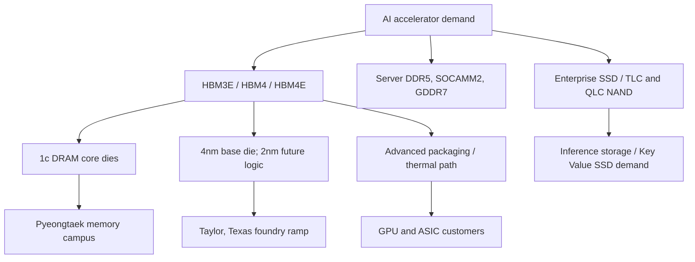

# Samsung Memory Profile: Scale, HBM Catch-Up, And Vertical Integration

Samsung Electronics is the broadest memory competitor in the AI infrastructure cycle. It combines DRAM, NAND, foundry, logic base-die capability, advanced packaging, smartphone/consumer demand visibility, and one of the largest semiconductor capex engines in the world. That breadth is both the bull case and the problem. Samsung has the assets to offer an integrated HBM stack, base die, foundry process, and package service, but it entered the HBM3E cycle under pressure from SK hynix's earlier qualification lead. The 2026 profile is therefore a recovery-and-repositioning story: restore credibility in high-end HBM while keeping conventional DRAM, NAND, foundry, and system-LSI economics aligned.

Samsung's FY2025 results show why the market is paying attention again. In the fourth quarter of 2025, Samsung reported consolidated revenue of KRW 93.8 trillion and operating profit of KRW 20.1 trillion; full-year 2025 revenue was KRW 333.6 trillion and operating profit was KRW 43.6 trillion.[^S151] The Device Solutions division posted KRW 44.0 trillion of quarterly revenue and KRW 16.4 trillion of operating profit, while the Memory Business set all-time highs in quarterly revenue and operating profit on HBM, server DDR5, enterprise SSDs, and price improvement.[^S151]

[Samsung Newsroom YouTube](https://www.youtube.com/SamsungNewsroom/) - Official Samsung channel for product launches, executive messages, and corporate announcements.

[Samsung Semiconductor Global YouTube](https://www.youtube.com/@SamsungSemiconductorGlobal) - Official semiconductor channel for memory, foundry, and device-solution product videos.

[Samsung Semiconductor HBM4 product page](https://semiconductor.samsung.com/dram/hbm/hbm4/) - Official interactive HBM4 launch page with product positioning and technical claims.

## Strategic Position

Samsung's memory story is different from SK hynix's. SK hynix is the pure-play HBM execution benchmark. Samsung is the integrated-supplier option. Its strategic claim is that future HBM is not just stacked DRAM; it is a coordinated product spanning memory cell, base-die logic, foundry process, advanced packaging, power delivery, thermal path, and customer-specific design-technology co-optimization. Samsung's Korean HBM4 launch explicitly framed the company as the only IDM spanning logic, memory, foundry, and packaging, and said base-die importance rises as HBM becomes more advanced.[^S152]

That integrated story is powerful if customers want custom HBM and base-die differentiation. It is weaker if customers simply want the most reliable HBM stack fastest. The HBM3E cycle demonstrated that scale and vertical breadth do not automatically beat focused packaging execution and customer qualification. Samsung's 2026 task is to prove that vertical integration can convert into delivery: HBM4 shipments, HBM4E samples, custom-HBM roadmap, and foundry-base-die credibility.

The Q4 2025 results put Samsung back in the conversation. Management said the Memory Business was on track to begin delivering HBM4 in Q1 2026, including products with 11.7 Gbps performance, with the explicit aim of reestablishing leadership in high-end HBM.[^S151] That phrasing is unusually candid. It acknowledges that leadership had been contested and that HBM4 is Samsung's reset window.

## Product Portfolio

| Product family | 2026 role | Competitive issue |
|---|---|---|
| HBM3E | Current AI accelerator attach | Must sustain qualification while HBM4 ramps |
| HBM4 | Next-generation AI memory | 1c DRAM, 4nm base die, 2,048 I/O pins |
| HBM4E / Custom HBM | Roadmap premium layer | Samples planned after HBM4; customer-specific optimization |
| DDR5 / SOCAMM2 / GDDR7 | Server, AI memory modules, graphics | Broad AI infrastructure revenue beyond HBM |
| Enterprise SSD / Key Value SSD | Inference and data-center storage | NAND attach to AI workloads |
| Foundry base die | Logic layer for HBM and AI silicon | Converts foundry weakness into HBM integration option |

Samsung's HBM4 product page says HBM4 uses 1c DRAM and 4nm foundry technologies, provides up to 13 Gbps data processing performance, doubles I/O pin count from 1,024 to 2,048, and reaches up to 3,300 GB/s of bandwidth, about 2.7x prior-generation performance.[^S153] The same page states that low-voltage TSV I/O and PDN optimization improve energy efficiency by about 40%, vertical thermal resistance by about 10%, and heat dissipation by about 30%.[^S153]

The official Korean HBM4 announcement adds more commercial detail. Samsung said it had begun mass production and shipment of HBM4, had secured stable 11.7 Gbps operation, could implement up to 13 Gbps, supported 24 GB to 36 GB through 12-high stacking, and planned to extend to 48 GB through 16-high stacking aligned with customer schedules.[^S152] It also said HBM4 used a 4nm base die and 1c DRAM, beating the JEDEC 8 Gbps standard by about 46% at 11.7 Gbps.[^S152]

## HBM Catch-Up And Reset

Samsung's HBM reset has three moving parts. The first is qualification. Q3 2025 results said HBM3E was in mass production and sold to all related customers, while HBM4 samples were being shipped to key clients.[^S154] Q4 2025 results moved the narrative forward by saying HBM4 delivery was expected in Q1 2026 and that Samsung wanted to reestablish leadership in high-end HBM.[^S151] The Korean HBM4 announcement then claimed mass production and shipment in February 2026.[^S152]

The second is base-die strategy. HBM4 increases the importance of the logic base die because power, signal, repair, test, and customer-specific control functions all become more valuable. Samsung is better positioned than a memory-only vendor if customers want the base die built on Samsung's own foundry process. The Q4 results noted that Samsung Foundry began shipments of 4nm HBM base-die products in Q4 2025.[^S151] That is a direct strategic link between memory and foundry that SK hynix and Micron cannot replicate internally at the same scale.

The third is thermal design. HBM4 already raises heat density; HBM5 will raise it further. 2026 Computex coverage reported that Samsung showed an HBM5 mockup with Heat Path Block cooling, a thermal-pillar approach intended to move heat out from within the stack, and said Samsung confirmed HBM5's base die would use the company's 2nm process rather than the 4nm used for HBM4/HBM4E.[^S155] That is still roadmap territory, but it shows where Samsung wants the debate to move: from "Can Samsung catch HBM3E?" to "Can Samsung use logic process and thermal architecture to win future HBM?"

## Manufacturing Footprint

Samsung's Korean manufacturing base is centered around large DRAM/NAND and logic campuses including Pyeongtaek, Hwaseong, Giheung, and Xi'an for NAND. For this profile, Pyeongtaek is the key AI-memory site. Samsung's HBM4 launch said the Pyeongtaek 2nd campus Line 5, scheduled for full-scale operation from 2028, would be used as a core HBM production hub.[^S152] That official statement is more important than older rumors about P4/P5 timing because it ties a named future line directly to HBM supply.

The same announcement said Samsung has industry-leading DRAM production capacity and cleanroom capacity secured through proactive infrastructure investment, allowing it to respond flexibly if HBM demand expands.[^S152] This is the bull case for Samsung's scale: if HBM becomes capacity-limited across the industry, the vendor with the largest DRAM infrastructure and internal packaging/foundry links has a path to close share gaps quickly.

Recent reporting on South Korea's June 2026 semiconductor plan also framed Samsung and SK hynix as anchors of an KRW 800 trillion public-private capacity push that includes new fabs and HBM packaging facilities, underscoring that Samsung's memory strategy is partly national-industrial-policy infrastructure rather than only company-level capex.[^S156]

The U.S. footprint matters more for foundry than memory, but it affects the HBM base-die and AI customer narrative. Q3 2025 results said Samsung Foundry planned to begin operations at Taylor, Texas in a timely manner in 2026 and would focus on new 2nm GAA products and the HBM4 base die.[^S154] External 2026 coverage reported that tooling installation was progressing at the Taylor site and that the project was targeting operations by the end of 2026.[^S157] For Samsung memory, Taylor is not a DRAM fab; it is a geopolitical and customer-proximity option for AI logic and possibly base-die economics.

## NAND And AI Storage

Samsung remains a major NAND and enterprise SSD supplier, but NAND is a less clean AI profit story than HBM. The Q4 2025 release said the Memory Business would expand AI-related NAND sales with high-performance TLC products for Key Value SSD demand for inference.[^S151] That is a useful detail because it ties NAND to inference architecture rather than generic SSD replacement. The company is not only relying on consumer SSD cycles; it is trying to align NAND with retrieval, KV-store, and inference-data pipelines.

The risk is that NAND economics can deteriorate even when product technology improves. Samsung has enormous NAND capacity and a broad SSD business, but NAND historically suffers from faster oversupply than DRAM. If AI storage demand rises but QLC/TLC supply expands faster, margins may still compress. For investors, Samsung NAND should be modeled as a cyclical stabilizer with AI upside, not as a second HBM.

## Competitive Positioning

Against SK hynix, Samsung's challenge is credibility in the current AI socket. SK hynix has been rewarded for execution and early HBM qualification; Samsung must show that HBM4 shipments convert into durable customer share. Samsung's advantage is vertical integration. If custom HBM becomes a base-die co-design business rather than a commodity JEDEC stack business, Samsung can use memory, foundry, and packaging under one roof.

Against Micron, Samsung's challenge is geopolitical diversification and U.S.-aligned supply. Micron can lean into U.S. manufacturing policy and HBM capacity in Boise/Hiroshima/Singapore. Samsung has Taylor for foundry, Austin for legacy logic, and enormous Korean memory capacity. Its memory footprint is still Korea-heavy, but its foundry footprint gives it a U.S. AI manufacturing narrative that SK hynix lacks at front-end scale.

Samsung's greatest internal advantage is also a management complexity. The DS division includes Memory, System LSI, and Foundry, and the company also has powerful DX consumer businesses. The memory team can benefit from internal logic and packaging capabilities, but capital allocation must compete with foundry, mobile SoCs, image sensors, displays, and consumer electronics. In an HBM shortage, the answer is easy: fund HBM. In a normalized cycle, those internal priorities can blur the investment case.

## Financial And Capital-Allocation Lens

Samsung's FY2025 results show the rebound, but not all of it is pure memory. Consolidated revenue and operating profit include smartphones, display, consumer electronics, Harman, foundry, and system LSI.[^S151] The DS division did most of the profit heavy lifting in Q4 2025, but the investor must still disaggregate memory from foundry and logic. Q4 DS operating profit of KRW 16.4 trillion was exceptional, and Memory set record quarterly revenue/profit; System LSI and Foundry had more mixed profitability, even as foundry began shipping 4nm HBM base-die products.[^S151]

The HBM4 announcement said Samsung expects 2026 HBM revenue to more than triple from 2025 and is proactively expanding HBM4 production capacity.[^S152] That creates an aggressive near-term revenue bridge, but it also raises execution risk. If yields, customer qualifications, or packaging throughput disappoint, the revenue ramp slips. If the ramp succeeds, Samsung could close part of the HBM margin gap with SK hynix and make its integrated-supplier thesis more tangible.

## KPI Dashboard

| KPI | Why it matters | Watchpoint |
|---|---|---|
| HBM4 customer shipments | Proof that Samsung has moved beyond sampling | Q1/Q2 2026 shipment commentary and customer references |
| 4nm HBM base-die volume | Converts foundry into memory advantage | Base-die yields, capacity, thermal/power data |
| HBM4E and Custom HBM samples | Shows roadmap beyond standard HBM4 | 2H 2026 HBM4E samples; 2027 custom-HBM samples |
| Pyeongtaek Line 5 schedule | Long-cycle HBM capacity | 2028 full-scale operation and equipment timing |
| Taylor ramp | U.S. AI logic/foundry credibility | 2026 operations and customer orders |
| Key Value SSD revenue | NAND link to inference | TLC/eSSD growth and attach to AI data pipelines |

The most important KPI is not Samsung's total DRAM share. It is qualified HBM share at the customers that define the accelerator cycle. Samsung can remain the largest memory vendor and still trail in HBM profit if SK hynix owns the highest-value stacks. Conversely, Samsung can improve margins materially if HBM4 restores its position with GPU and ASIC customers.

## Operational Risk

Samsung's operational risk is concentrated in synchronization. HBM4 requires memory die, base die, package assembly, test, customer board design, and accelerator qualification to converge on the same schedule. If DRAM die yields are ready but base-die capacity is late, shipment slips. If the base die is ready but thermal data misses the customer's stack-height target, the product may be accepted only in lower configurations. If HBM4 stack yield is stable but customer accelerator packages are delayed, inventory and revenue timing move. This is why Samsung's "one-stop" model is not automatically safer: it reduces external coordination but increases internal coordination burden.

The second operational risk is that foundry and memory have different yield-learning rhythms. Commodity DRAM ramps through enormous bit volumes. Advanced foundry base dies ramp through customer-specific designs, IP integration, and process-node maturity. Samsung's HBM4 thesis assumes those learning curves can be made mutually reinforcing. The Q4 2025 disclosure that 4nm HBM base-die shipments had begun is positive, but the harder test is whether those base dies can scale across multiple HBM customers without choking foundry capacity or yield.[^S151]

The third operational risk is thermal margin. HBM4's 2,048 I/O interface and higher total stack bandwidth increase power-density pressure. Samsung's official HBM4 page emphasizes low-voltage TSV I/O, PDN optimization, improved energy efficiency, lower thermal resistance, and improved heat dissipation.[^S153] Those claims are directly relevant to customer qualification. AI accelerator vendors do not buy peak bandwidth alone; they need predictable performance inside a package thermal envelope across realistic training and inference workloads.

## Customer Qualification And Commercial Proof

The decisive evidence for Samsung will not be a product page. It will be named accelerator ramps, customer platform inclusion, and shipment cadence across multiple customers. Samsung's own Q3 2025 results said HBM4 samples were going to key clients, and its Q4 2025 results said the company was on track to begin HBM4 delivery in Q1 2026.[^S154][^S151] The February 2026 Korean announcement then claimed mass production and shipment.[^S152] That sequence matters, but it still needs follow-through in customer systems.

For NVIDIA-class customers, the key issue is qualification depth. HBM qualification includes electrical characterization, thermal cycling, package stress, signal integrity, repair behavior, known-good-die yield, and long-duration workload validation. For ASIC hyperscalers, the issue becomes more bespoke: custom base-die functions, power profiles, nonstandard capacity targets, and supply timing relative to accelerator tape-outs. Samsung's custom-HBM sample plan for 2027 should be read in that context.[^S152]

Commercial proof also requires pricing discipline. If Samsung wins share only by discounting HBM4, the revenue ramp may not translate into SK-hynix-like profit quality. If Samsung wins because customers value base-die integration, supply assurance, and thermal architecture, margins can improve. The distinction will show up in DS operating margin, HBM revenue mix, and whether HBM revenue growth outpaces bit growth.

## Technology Roadmap

Samsung's near-term roadmap is HBM4 first, HBM4E samples in the second half of 2026, and custom-HBM samples from 2027.[^S152] The mid-term roadmap is HBM5 with more aggressive thermal extraction and a 2nm base die, according to 2026 Computex reporting.[^S155] The long-term question is whether HBM becomes more like a co-packaged subsystem than a standardized memory component.

If HBM remains mostly standardized, SK hynix's packaging execution and Micron's fast HBM ramp can keep Samsung under pressure. If HBM becomes more custom, Samsung can exploit its logic, memory, foundry, and advanced-packaging adjacency. Custom HBM is not merely a new SKU; it potentially changes the pricing basis from commodity memory bits to customer-specific system performance. That is the market Samsung wants.

There is also a NAND/SSD roadmap attached to inference. Samsung's Q4 2025 comments about Key Value SSD demand suggest that memory vendors see AI inference as more than HBM attach.[^S151] If long-context inference, retrieval-augmented generation, and vector databases continue growing, SSD architecture may become part of the AI memory stack. Samsung has the SSD controller and NAND base to participate, though this will be a lower-margin and more competitive market than HBM.

## Why Samsung Still Matters If It Trails HBM Share

Even if Samsung does not lead HBM share in every customer generation, it remains strategically unavoidable. First, customers want multi-sourcing. No hyperscaler or GPU vendor wants all HBM risk concentrated in one supplier if the market is structurally short. Second, Samsung has the largest memory manufacturing base and can swing capacity when economics justify it. Third, Samsung's foundry and base-die story gives customers a credible alternative if custom HBM becomes central. Fourth, Samsung's NAND, SSD, DRAM, GDDR, LPDDR, and CXL-adjacent product set lets it sell the full AI memory hierarchy, not only one stack.

The flip side is that Samsung's breadth can dilute urgency. A focused HBM competitor can optimize every process, packaging, test, and customer-engagement decision around one profit pool. Samsung must manage HBM alongside foundry turnarounds, mobile SoCs, image sensors, consumer devices, displays, and large international fab projects. The investment case improves when Samsung proves that its internal breadth accelerates HBM execution instead of slowing decision-making.

## Semicap Read-Through

Samsung's memory profile is rich for semicap because it touches almost every equipment category. HBM4 requires 1c DRAM patterning, TSV, wafer thinning, stacking, underfill, thermal management, metrology, and high-throughput test. The 4nm base die and future 2nm base-die plan pull in foundry equipment, EUV, advanced process control, and design-technology co-optimization. Pyeongtaek Line 5 and Taylor create large tool-order implications, while Key Value SSD and NAND products sustain etch/deposition intensity.

This is why Samsung matters beyond HBM market share. If Samsung succeeds, it reinforces the thesis that memory vendors with internal foundry and advanced packaging can command a larger share of the AI accelerator bill of materials. If Samsung fails, it supports the opposite thesis: HBM is primarily about memory-stack execution and customer qualification, not vertical integration.

## Investment Debate

The bull case is that Samsung's scale, cleanroom capacity, 1c DRAM, 4nm base die, advanced packaging, and HBM4 shipment claim converge just as AI accelerators need more bandwidth and custom base-die features. The company can triple HBM revenue in 2026, expand into HBM4E and custom HBM, and use foundry integration to recover premium share.[^S152]

The bear case is that Samsung is still catching up. HBM4 shipment announcements must be validated by customer ramps, not press releases. Foundry integration is valuable only if yields, thermal behavior, and customer confidence are competitive. Samsung's foundry business still faces TSMC pressure, Taylor must ramp, and the company must avoid spreading capital too thinly across memory, logic, display, and consumer businesses.

For this database, Samsung is the integrated-memory counterweight to SK hynix. SK hynix defines focused HBM execution. Samsung defines the possibility that future HBM becomes a memory-plus-foundry-plus-packaging co-design market. Which model wins will shape not only DRAM share but also advanced-packaging demand, HBM base-die economics, and AI accelerator supply chains through the late 2020s.

## Sources

[^S151]: Samsung Electronics Announces Fourth Quarter and FY 2025 Results, Samsung Global Newsroom, published 2026-01-29, https://news.samsung.com/global/samsung-electronics-announces-fourth-quarter-and-fy-2025-results
[^S152]: Samsung Electronics begins mass production and shipment of HBM4, Samsung Newsroom Korea, published 2026-02-12, https://news.samsung.com/kr/%EC%82%BC%EC%84%B1%EC%A0%84%EC%9E%90-%EC%84%B8%EA%B3%84-%EC%B5%9C%EC%B4%88-%EC%97%85%EA%B3%84-%EC%B5%9C%EA%B3%A0-%EC%84%B1%EB%8A%A5%EC%9D%98-hbm4-%EC%96%91%EC%82%B0-%EC%B6%9C%ED%95%98
[^S153]: Samsung HBM4 product page, Samsung Semiconductor Global, Accessed 2026-07-06, no stable page publish date listed, https://semiconductor.samsung.com/dram/hbm/hbm4/
[^S154]: Samsung Electronics Announces Third Quarter 2025 Results, Samsung Global Newsroom, published 2025-10-30, https://news.samsung.com/global/samsung-electronics-announces-third-quarter-2025-results
[^S155]: Samsung shows first HBM5 mockup with Heat Path Block cooling, Tom's Hardware, published 2026-06-03, https://www.tomshardware.com/tech-industry/semiconductors/samsung-shows-first-hbm5-mockup-at-computex-with-heat-path-block-cooling
[^S156]: South Korea unveils $520 billion Samsung/SK hynix memory investment plan, Tom's Hardware, published 2026-06-29, https://www.tomshardware.com/tech-industry/semiconductors/south-korea-unveils-usd520-billion-investment-plan-with-samsung-and-sk-hynix-to-expand-memory-chip-dominance-plan-includes-four-new-fabs-and-hbm-facilities-amid-strong-government-support
[^S157]: Samsung inches closer to opening Taylor Texas chip factory, MySA, published 2026-04-30, https://www.mysanantonio.com/business/article/samsung-chip-factory-taylor-texas-22232085.php
