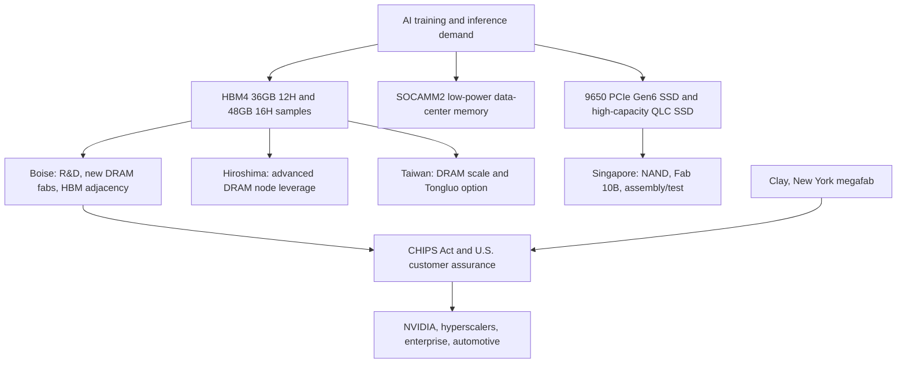

# Micron Profile: U.S. Memory Leverage, HBM4 Execution, And AI Storage Breadth

Micron is the only U.S.-headquartered member of the global DRAM triopoly and the vendor most directly tied to the U.S. industrial-policy argument for domestic memory supply. That positioning became much more valuable once AI accelerator demand turned HBM from a specialty DRAM derivative into a national infrastructure constraint. By June 2026, Micron had reported record fiscal Q3 2026 revenue of $41.46 billion, GAAP net income of $28.24 billion, non-GAAP net income of $28.86 billion, and operating cash flow of $25.39 billion for the quarter ended May 28, 2026.[^S158] The scale of that result is not normal memory-cycle recovery; it reflects a temporary but powerful repricing of DRAM, HBM, SSDs, and customer supply assurance.

Product and site images in this profile use Micron's official HBM4, product, and locations galleries, which Micron explicitly makes available for publication under its image-gallery terms.[^S169][^S170]

[Micron HBM3E product video](https://www.youtube.com/watch?v=bzwPZD1w7UY) - Official Micron video explaining HBM3E for AI workloads.

[Micron Idaho fab construction videos](https://www.micron.com/us-expansion/id) - Official U.S. expansion page hosting Micron's Idaho construction update videos.

[Micron Technology YouTube channel](https://www.youtube.com/@MicronTechnology) - Official Micron channel for product, technology, and company videos.

## Strategic Position

Micron's strategic role is not simply "third DRAM vendor." It is the supply-chain diversification vendor. SK hynix is the current HBM execution benchmark; Samsung is the integrated memory-foundry-packaging counterweight; Micron is the U.S.-aligned memory supplier with real DRAM, HBM, NAND, SSD, and module breadth. That matters because AI customers are now trying to solve three problems at once: enough bandwidth per accelerator package, enough system memory per rack, and enough non-Korean supply optionality to keep procurement and geopolitics from becoming a single point of failure.

Micron's June 2026 quarterly release also shows a business-model shift. Management said the company was executing transformational Strategic Customer Agreements and argued that multi-year agreements would improve durability and predictability of performance.[^S158] In a normal memory cycle, customers resist long commitments because they want spot-price downside. In the AI cycle, customers are more willing to trade some price flexibility for allocation, process-node priority, and product co-design. That is the core change behind Micron's current profile.

The competitive tension is that Micron still has less memory scale than Samsung and less public HBM incumbency than SK hynix. It therefore needs to win on timing, power efficiency, U.S. manufacturing narrative, and customer-specific assurance rather than on sheer wafer volume. The company has made that pitch explicit through HBM4 for NVIDIA Vera Rubin, SOCAMM2 for low-power AI memory, PCIe Gen6 SSDs for AI storage, and U.S. fab expansion in Idaho and New York.[^S159][^S162][^S165][^S166]

## Product Portfolio

| Product family | 2026 role | Strategic read-through |
|---|---|---|
| HBM4 36GB 12H | Lead AI accelerator memory | High-volume shipments for lead-customer platform, >2.8 TB/s per stack |
| HBM4 48GB 16H samples | Higher-capacity HBM roadmap | Tests advanced stacking, yield, warpage, and thermal control |
| HBM4E on 1-gamma | 2027 premium HBM bridge | Moves roadmap from HBM4 execution into next node |
| HBM3E 24GB/36GB | Current-generation AI memory | Installed base, NVIDIA H200 and AMD MI350 exposure |
| SOCAMM2 | Low-power CPU/system memory | Rack memory density and power reduction versus RDIMM approaches |
| 256GB DDR5 RDIMM | High-capacity server memory | CPU memory capacity, CXL-adjacent system expansion |
| 9650 PCIe Gen6 SSD | AI data-center storage | Persistent KV cache, training/inference data path, BlueField-4 reference |
| High-capacity QLC SSD | AI storage density | Data lakes, checkpoints, retrieval, long-context inference |

Micron's March 16, 2026 HBM4 release said its 36GB 12-high HBM4 was in high-volume production for NVIDIA Vera Rubin, offered greater than 2.8 TB/s of bandwidth, achieved over 11 Gb/s pin speeds, and improved power efficiency by more than 20% versus a comparable HBM3E 36GB 12-high stack.[^S159] The same announcement said Micron had shipped HBM4 48GB 16-high samples to customers, giving 33% more capacity per HBM placement than the 36GB 12-high product.[^S159] On the product page, Micron describes HBM4 as using a wider 2,048-pin interface, greater than 11.0 Gbps signaling, and more than double the prior-generation bandwidth.[^S160]

The Q3 FY2026 release extends the roadmap. Micron said HBM4, built on 1-beta DRAM technology, was in high-volume shipments for its lead customer's platform; qualification samples had shipped to multiple end customers; HBM4E on 1-gamma was under development with volume production expected in calendar 2027; and qualification samples of 256GB DDR5 RDIMMs on 1-gamma with advanced 3D die stacking had shipped to key server ecosystem enablers.[^S158] Those details matter because they connect HBM execution, next-node DRAM, stacked server modules, and broader AI rack memory into one portfolio.

## HBM Execution

Micron's HBM argument has been power efficiency plus fast ramp. On its HBM3E page, Micron claims its 8-high and 12-high HBM3E cubes deliver up to 30% lower power than competition, that 24GB 8-high HBM3E ships with NVIDIA H200 Tensor Core GPUs, and that production-capable 36GB 12-high HBM3E is available.[^S161] For HBM4, the argument moves from "efficient challenger" to "platform-ready supplier." The March 2026 release explicitly links HBM4 36GB 12-high to NVIDIA Vera Rubin and says Micron began volume shipment in the first quarter of calendar 2026.[^S159]

That timing is the whole strategic point. HBM qualification is not catalog availability. It is a sequence of die yield, TSV integrity, stack assembly, thermal testing, signal integrity, board/package interaction, accelerator firmware, and customer platform validation. By naming Vera Rubin and saying high-volume production, Micron is arguing that it has moved through the most valuable gates. The open question is how much share it captures once SK hynix and Samsung HBM4 capacity broadens. Micron does not need to lead every socket to matter; it needs enough qualified supply to become the credible second or third source in strategic AI platforms.

The 48GB 16-high samples are especially important. A 16-high HBM stack increases capacity per placement, but it also stresses warpage, thermal extraction, known-good-die sorting, repair redundancy, stack yield, and package assembly. If Micron can scale 16-high without material yield penalty, it can improve the capacity-per-package story for accelerator customers and challenge SK hynix's high-stack packaging narrative. If the 16-high ramp lags, the 36GB 12-high product still matters, but Micron's differentiation narrows to timing and power.

## Memory And Storage Across The AI Rack

Micron is trying to avoid being viewed as only an HBM supplier. The COMPUTEX 2026 release framed AI memory as a hierarchy: HBM for high-speed execution and hot key-value cache, LPDDR and DDR for system memory and long-context expansion, and data-center SSDs for persistent KV cache and high-capacity data lakes.[^S162] Micron said HBM4 36GB 12-high enabled a 2.6x increase in LLM inference throughput for every 2x increase in bandwidth, that it was the only provider of a 256GB SOCAMM2, and that its 256GB DDR5 RDIMM on 1-gamma could reach 9,200 MT/s with more than 40% lower operating power versus two 128GB modules.[^S162]

That hierarchy is commercially useful. HBM gets the gross margin and allocation headlines, but AI infrastructure needs many memory tiers. SOCAMM2 and high-capacity RDIMMs increase CPU-side memory density. SSDs handle model checkpoints, logs, retrieval, vector databases, long-context spill, and cold or warm KV-cache persistence. Micron's March 2026 HBM4 release said the 9650 PCIe Gen6 data-center SSD was in high-volume production, offered up to 28 GB/s sequential read throughput and 5.5 million random-read IOPS, and was optimized for NVIDIA BlueField-4 STX architecture.[^S159]

This is one difference versus SK hynix. SK hynix has Solidigm for enterprise SSD and QLC strength, but Micron is presenting a single Micron-branded AI memory and storage portfolio from HBM4 to SOCAMM2 to Gen6 SSD. For hyperscalers that want fewer memory/storage integration surfaces, that can matter. For investors, it means Micron's AI exposure should be modeled as HBM plus DRAM plus storage, with NAND still lower-margin and more cyclical than HBM.

## Manufacturing Footprint

Micron's manufacturing map is unusually important because its U.S. identity is part of the value proposition. In Idaho, Micron says it plans two leading-edge high-volume fabs in Boise that are expected to create more than 17,000 jobs, with the fabs co-located with Idaho R&D to accelerate time to market for leading-edge products including HBM.[^S165] The same page says Micron has achieved key construction milestones on its first Idaho fab and schedules DRAM output to begin in 2027.[^S165]

In New York, Micron's Clay megafab is the larger long-cycle option. Micron says the New York project may include up to four fabs over more than 20 years with potential investment up to $100 billion; the site could eventually include four 600,000-square-foot cleanrooms, or 2.4 million square feet of cleanroom space.[^S166] A June 10, 2026 release said Micron had selected Bechtel as EPC partner for the first phase, that Bechtel would mobilize at White Pine Commerce Park immediately, and that the project was expected to generate 50,000 jobs in New York.[^S164]

The U.S. expansion is not only a press story. Micron's Idaho and New York pages say the company secured up to $6.4 billion of CHIPS Act direct funding to support two Idaho fabs, two New York fabs, and Virginia modernization.[^S165][^S166] That public funding changes customer discussions. It gives Micron a supply-assurance argument that is hard for Korean competitors to replicate, especially for U.S. cloud, defense, automotive, and AI infrastructure customers with domestic-sourcing concerns.

Outside the U.S., the key nodes are Japan, Taiwan, and Singapore. Hiroshima is central to Micron's advanced DRAM technology base, and official Micron location imagery continues to present it as a major Japanese manufacturing site.[^S170] Taiwan adds DRAM manufacturing scale and optionality; January 2026 reporting said Micron agreed to acquire PSMC's Tongluo 300mm facility for about $1.8 billion, including a 300,000-square-foot cleanroom but excluding existing production equipment, with material DRAM contribution unlikely before late 2027.[^S168] Singapore remains the NAND anchor; January 2026 coverage said Micron began Fab 10B construction with about $24 billion of investment over more than a decade, 700,000 square feet of cleanroom space, initial wafer output expected in the second half of 2028, and a target to more than double local 3D NAND capacity.[^S167]

## Customer Ecosystem

Micron's customer story is becoming more explicit. NVIDIA is the platform reference because Vera Rubin validates HBM4, SOCAMM2, and SSD relevance at the highest end of AI infrastructure.[^S159] Anthropic is the frontier-model reference: on June 22, 2026, Micron and Anthropic announced a strategic agreement covering memory and storage AI architecture design, supply and demand, enterprise adoption of Claude within Micron, and a strategic investment in Anthropic's Series H financing.[^S163] The agreement said the companies would analyze memory and storage subsystem performance across workloads to improve performance, energy efficiency, and token economics in Anthropic infrastructure.[^S163]

Those agreements show how memory selling is changing. In commodity DRAM, the customer buys bits. In AI memory, the customer wants supply, roadmap alignment, workload telemetry, power modeling, and co-optimization. Micron's long-term advantage may therefore come less from being American in a political sense and more from using customer agreements to de-risk capex, lock product requirements earlier, and keep HBM/DRAM/SSD roadmaps tied to real workloads.

Automotive also matters because it is less HBM-heavy but supply-sensitive. Micron and General Motors announced a strategic agreement on July 1, 2026 to secure long-term memory and storage supply for next-generation vehicle platforms.[^S171] That fits Micron's broader pattern: use customer agreements to make a cyclical commodity business behave more like a strategic infrastructure supplier.

## Competitive Positioning Versus SK hynix And Samsung

Against SK hynix, Micron's challenge is HBM incumbency. SK hynix entered this cycle with stronger public proof of HBM3E and HBM4 leadership. Micron's response is power efficiency, HBM4 timing, 16-high samples, and the U.S. supply-assurance overlay. If NVIDIA-class customers need meaningful non-SK-hynix HBM4 volume, Micron becomes strategically important even with lower share.

Against Samsung, Micron's challenge is vertical integration. Samsung can claim memory, foundry, logic base die, and advanced packaging under one roof. Micron cannot replicate Samsung's foundry footprint. Its counterargument is focus, customer collaboration, and geopolitical diversification. Micron can source base dies externally, optimize HBM stacks internally, and use U.S. fabs as the supply-chain differentiator. If custom HBM becomes tightly coupled to proprietary base-die logic, Samsung gains leverage. If customers prefer best-qualified memory stacks plus external foundry optionality, Micron remains highly relevant.

Micron's greatest advantage is therefore portfolio timing plus customer trust. The company is showing HBM4, SOCAMM2, 256GB RDIMMs, PCIe Gen6 SSDs, and high-capacity QLC SSDs in the same AI rack narrative.[^S158][^S159][^S162] That does not mean every product has HBM margins. It means Micron can sell more of the memory/storage hierarchy at a moment when customers care less about spot pricing and more about token throughput, supply assurance, and power per useful workload.

## Financial And Capital-Allocation Lens

Micron's fiscal Q3 2026 results are extraordinary and should not be normalized mechanically. Revenue of $41.46 billion, GAAP gross margin of 84.6%, GAAP operating margin of 80.4%, and Q4 revenue guidance of $50.0 billion plus or minus $1.0 billion are extreme memory-cycle numbers.[^S158] They show the power of scarcity, but they also create the risk of extrapolation. Memory history is full of periods where tight supply encouraged overbuilding, only for capacity to arrive after demand normalized.

The difference this time is that strategic customer agreements may dampen some cyclicality. If customers commit deposits, volume, or price bands to secure multi-year AI supply, Micron can justify more aggressive capex with better visibility. The risk is that long-term agreements may protect volume but not necessarily peak margins if capacity catches up or if customers regain bargaining power.

Capex discipline is the core debate. Idaho, New York, Singapore, Taiwan, Japan, Virginia, HBM packaging, SSD, and module roadmaps all need capital. New York alone is a 20-plus-year, up-to-$100-billion program.[^S166] Singapore's Fab 10B is a more-than-decade NAND expansion.[^S167] These projects can make Micron more strategic, but they also increase fixed-cost exposure if AI memory demand decelerates.

## KPI Dashboard

| KPI | Why it matters | Watchpoint |
|---|---|---|
| HBM4 volume shipments | Confirms Micron has moved beyond challenger sampling | Vera Rubin attach, multiple end-customer qualifications |
| HBM4E 2027 readiness | Determines next premium HBM cycle | 1-gamma timing, 12-high/16-high stack yield |
| SOCAMM2 adoption | Measures rack-level memory diversification | Vera CPU/NVL72 attach and hyperscaler uptake |
| PCIe Gen6 SSD revenue | Shows AI storage monetization beyond HBM | 9650 adoption, persistent KV-cache workloads |
| Idaho DRAM output | Tests U.S. manufacturing execution | 2027 output start, tool install, yield learning |
| New York megafab progress | Long-term domestic memory capacity | Bechtel mobilization, permits, utility readiness |
| Strategic customer agreements | Reduces memory-cycle volatility if durable | Deposits, term length, pricing bands, cancellation terms |

The most important KPI is not total Micron revenue. It is premium-mix durability: how much of revenue is tied to qualified HBM, AI server DRAM, SOCAMM2, and enterprise AI SSDs under multi-year customer arrangements. If that mix holds, Micron's earnings quality improves. If Q3 FY2026 margins are mostly spot scarcity, the stock remains a high-beta memory cycle.

## Operational Risk

Micron's operational risk is split between near-term HBM execution and long-term fab construction. HBM risk is mostly packaging and customer qualification. The company can design an efficient stack, but revenue depends on known-good-die sorting, TSV yield, stack assembly, thermal behavior, and customer package qualification. The 48GB 16-high sample path is a useful stress test because higher stack height can expose mechanical and thermal limits before the market sees them in gross margin.

Fab risk is slower but larger. Idaho DRAM output scheduled for 2027 is strategically important, but leading-edge DRAM fabs require tool availability, EUV learning, cleanroom qualification, labor, power, water, chemicals, and long yield ramps.[^S165] New York has even more execution complexity because it is a multi-fab, multi-decade greenfield cluster.[^S166] Singapore adds NAND-cycle risk: capacity that is correct for AI storage demand can still pressure NAND pricing if the broader market softens.[^S167]

Customer concentration is the final risk. NVIDIA validation is powerful, and Anthropic-style agreements are strategically useful, but customer concentration can transfer bargaining power back to the platform owner over time. Micron wants enough customer intimacy to shape roadmaps, but not so much dependence that one accelerator transition or one frontier-lab procurement decision defines HBM economics.

## Semicap Read-Through

Micron is one of the cleanest semicap read-throughs because its projects touch front-end DRAM, advanced NAND, HBM packaging, SSD controllers, modules, and U.S. greenfield fab infrastructure. Idaho and New York imply EUV, deposition, high-aspect-ratio etch, CMP, implant, cleaning, metrology, process control, automation, subfab, gas, chemical, and facilities demand. HBM4 adds TSV, wafer thinning, bonding, underfill, molding, thermal materials, x-ray/inspection, test handlers, probe, burn-in, and package-level reliability demand.

The Singapore NAND expansion adds staircase/channel etch, high-layer deposition, inspection, cleaning, and controller-validation pull-through.[^S167] The 9650 SSD and high-capacity QLC roadmap also matter for test and validation because data-center SSD qualification is increasingly tied to AI workload behavior rather than generic sequential throughput. For [07-semicap-ecosystem/03-testing-equipment.md](../07-semicap-ecosystem/03-testing-equipment.md), Micron is a useful bridge between HBM known-good-die testing and AI storage endurance/performance validation.

## Investment Debate

The bull case is that Micron has become the strategic U.S. memory supplier just as AI makes memory and storage central to system performance. It has HBM4 in high-volume production for a lead NVIDIA platform, HBM4E on the 2027 roadmap, SOCAMM2 and Gen6 SSDs in production, Anthropic-style workload collaboration, and U.S. fabs that give customers domestic supply assurance.[^S158][^S159][^S163][^S165][^S166]

The bear case is that Micron remains a memory company in an exceptional upcycle. Gross margins above 80% are not a through-cycle assumption. HBM supply can broaden, NAND can oversupply, customer agreements can be renegotiated or prove less protective than advertised, and U.S. fabs can cost more or ramp slower than planned. If investors capitalize fiscal Q3 2026 as a steady-state earnings base, they may underwrite peak-cycle economics.

For this database, Micron is the U.S.-aligned AI memory challenger. SK hynix defines focused HBM execution; Samsung defines vertical integration; Micron defines supply-chain diversification plus full-stack memory/storage participation. Its success or failure will show whether AI-era memory economics reward national manufacturing footprint and customer agreements as much as raw HBM stack leadership.
