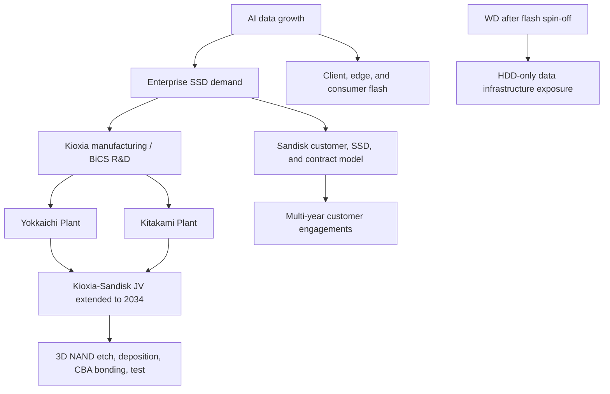

# Kioxia, Sandisk, And WD Profile: NAND Joint Venture Scale, AI Storage, And Post-Spin Valuation

Kioxia and Sandisk are the most important NAND partnership in the AI storage cycle. They are not HBM suppliers, and they do not compete directly with the DRAM scarcity economics that define SK hynix, Samsung, and Micron. Their strategic relevance is different: they supply the flash layer that sits under HBM and system DRAM, where training checkpoints, retrieval corpora, vector stores, persistent key-value cache, AI data lakes, and enterprise SSD tiers absorb rapidly growing data volume. Kioxia's FY2026 results show the scale of the rebound: revenue for the fiscal year ended March 31, 2026 was JPY 2.3376 trillion, up 37.0% year-on-year; operating profit was JPY 870.4 billion; and profit attributable to owners of the parent was JPY 554.5 billion.[^S172]

[BiCS FLASH 3D Flash Memory Migration Strategy](https://www.youtube-nocookie.com/embed/X_7xYCP6hGs?autoplay=0&enablejsapi=1&mute=1) - Official Kioxia product video explaining why BiCS generations are being split across density and performance paths.

[Connected Factory: through technology and people](https://www.youtube-nocookie.com/embed/EaC62LUZ7nM?autoplay=0&enablejsapi=1&mute=1) - Official Yokkaichi Plant video describing Kioxia's AI-enabled smart-factory operation.

[KIOXIA Iwate Corporation introduction movie](https://www.youtube-nocookie.com/embed/f_Go7qZEbRg?autoplay=0&enablejsapi=1&mute=1) - Official Kitakami Plant video for the Iwate manufacturing base.

## Strategic Position

The Kioxia-Sandisk complex is best understood as a two-company NAND platform rather than a normal supplier-customer relationship. Kioxia owns the Japanese manufacturing and process-development center of gravity; Sandisk owns a U.S.-listed flash-storage platform, customer contracts, SSD products, and a post-spin capital-market story. Kioxia and Sandisk extended the Yokkaichi joint venture agreement in January 2026 from the original December 31, 2029 expiration to December 31, 2034; the Kitakami joint venture was aligned with the same December 31, 2034 horizon.[^S173] As part of that renewal, Sandisk agreed to pay Kioxia $1.165 billion from 2026 through 2029 for manufacturing services and continued availability of supply.[^S173]

That agreement is the profile's anchor. It gives Kioxia better visibility on fab utilization and manufacturing-services economics. It gives Sandisk long-term access to the Japanese NAND base it needs to support enterprise SSDs, client SSDs, removable products, and wafers/components. It also reduces a structural overhang that has shadowed the NAND industry for years: whether the Kioxia-Sandisk partnership would be reshaped, merged, or weakened after Western Digital's flash separation.

Western Digital's role changed materially after the spin. Sandisk's Q3 FY2026 release states that Sandisk completed its separation from Western Digital on February 21, 2025 and became a standalone publicly traded company; periods before separation were prepared on a carve-out basis from Western Digital accounting records.[^S179] For this database, "WD" now matters mostly as the former parent and as the HDD side of the data-storage split. Sandisk captures flash/NAND equity sensitivity; WD captures hard-disk drive exposure to nearline cloud and AI data retention.

The separation also makes customer procurement cleaner. A cloud buyer evaluating flash can negotiate with Sandisk around NAND allocation, enterprise SSD mix, and multi-year commitments, while a colder-storage buyer can evaluate WD HDD economics separately. Before the split, flash and magnetic-storage cycles were harder to isolate inside one equity and one capital-allocation framework. After the split, Sandisk's NAND upside and WD's nearline HDD upside can both be visible without forcing investors or customers to underwrite a blended storage conglomerate.[^S179]

## Product Portfolio

| Platform | Company center | 2026 role | Strategic read-through |
|---|---|---|---|
| BiCS FLASH generation 8 | Kioxia/Sandisk JV | Current high-volume 3D NAND node | CBA and OPS architecture for density, performance, and power |
| BiCS FLASH generation 9 | Kioxia/Sandisk JV | Performance/power bridge node | 512Gb and 1Tb TLC, low- to mid-capacity storage, CBA/OPS reuse |
| BiCS FLASH generation 10 | Kioxia/Sandisk JV | Higher-density roadmap | 332 layers, 1.5x generation-8 layer count |
| LC9 enterprise SSD | Kioxia | AI data lake and high-capacity enterprise SSD | Up to 122.88 TB QLC, PCIe 5.0, NVMe 2.0 |
| CM9-V enterprise SSD | Kioxia | Mixed-use enterprise and AI/ML workloads | Up to 3.4 million random-read IOPS and 800,000 random-write IOPS |
| Sandisk data-center SSDs | Sandisk | Customer-facing flash monetization | Datacenter revenue and new business model contracts |
| WD HDDs | WD | Cold/warm AI data retention | Nearline HDD complement to NAND, not part of flash JV |

Kioxia's BiCS page frames generation 8 as the first major CBA/OPS generation, with CMOS directly Bonded to Array and On Pitch Select Gate used to improve density, performance, and power efficiency.[^S174] The same page says Kioxia is developing generation 9 and generation 10 in parallel because extreme layer-count growth can pressure performance and power efficiency, and because different applications need different mixes of density, performance, power, and capital efficiency.[^S174] Generation 9 is positioned as 512Gb and 1Tb TLC for high-performance, power-efficient low- to mid-capacity storage; generation 10 is positioned as a future 332-layer product family, 1.5x generation 8's layer count.[^S174]

The SSD layer translates that NAND strategy into products. Kioxia's LC9 page describes a high-capacity enterprise NVMe SSD for AI training, inference, and data-lake storage, using generation-8 QLC BiCS FLASH, PCIe 5.0, NVMe 2.0, and capacities up to 122.88 TB.[^S175] Kioxia lists sequential read performance up to 12,000 MB/s and random-read performance up to 1,350 KIOPS for LC9.[^S175] The CM9-V page positions the mixed-use enterprise SSD for AI/ML, data warehousing, OLTP, software-defined storage, and virtualization, with PCIe 5.0, NVMe 2.0, generation-8 TLC, capacities up to 12.8 TB, and up to 3,400K random-read IOPS and 800K random-write IOPS.[^S176]

## Manufacturing Footprint

Kioxia's manufacturing center is Japan. The Yokkaichi Plant page calls Yokkaichi one of the world's largest flash memory manufacturing facilities and says the site uses advanced manufacturing processes and AI to meet global memory demand.[^S177] It also says Yokkaichi's site area is 694,000 square meters, spans about 1.4 km end-to-end, and started operation of Fab7 in fall 2022.[^S177] The page describes the site as a smart factory where big data are collected from manufacturing and test systems and analyzed using AI to improve productivity.[^S177]

Kitakami is the second strategic production anchor. Kioxia says Kitakami Plant, operated by Kioxia Iwate Corporation, was established to meet further growth in flash-memory demand; Fab1 started operation in 2020 and Fab2 followed in September 2025.[^S178] That September 2025 Fab2 start matters because it places Kitakami into the current AI storage cycle rather than treating it as a long-dated concept. The 2034 JV alignment also means Kitakami is not a side facility; it is part of the same Kioxia-Sandisk production architecture as Yokkaichi.[^S173]

The manufacturing model is therefore different from Micron's. Micron's strategic story is U.S. manufacturing and vertically branded memory/storage. Kioxia and Sandisk rely on Japanese manufacturing joint ventures, Kioxia process execution, and Sandisk customer-facing monetization. This gives the pair scale and specialization, but it also makes governance critical. Any misalignment on capex timing, wafer allocation, technology migration, or SSD product mix can affect both companies.

## Financial And Contract Model

Kioxia's FY2026 result shows NAND's operating leverage when pricing and demand align. The company reported March-quarter revenue of JPY 1.0029 trillion, up JPY 459.2 billion quarter-on-quarter; SSD & Storage revenue was JPY 600.3 billion, up JPY 299.9 billion quarter-on-quarter; and Smart Devices revenue was JPY 337.3 billion, up JPY 151.1 billion quarter-on-quarter.[^S172] Kioxia attributed the quarter-on-quarter revenue increase primarily to a significant increase in average selling prices, partially offset by reduced bit shipments.[^S172] That is classic NAND scarcity math: price can dominate bit volume when supply is tight.

Sandisk's public-company results show the same dynamic through a U.S. equity lens. In fiscal Q3 2026, Sandisk reported revenue of $5.95 billion, up 97% sequentially and 251% year-on-year; GAAP net income was $3.615 billion; non-GAAP diluted net income per share was $23.41; and fiscal Q4 revenue guidance was $7.75 billion to $8.25 billion.[^S179] Datacenter revenue was $1.467 billion, up 233% sequentially and 645% year-on-year, while Edge revenue was $3.663 billion, up 118% sequentially and 295% year-on-year.[^S179]

The most important commercial change is Sandisk's new business model. The Q3 release said the company ended the quarter with three signed New Business Model agreements and signed two additional agreements in fiscal Q4.[^S179] Management described the model as multi-year customer engagements backed by firm financial commitments.[^S179] That language resembles Micron's strategic customer agreement narrative: memory customers that historically preferred spot-price optionality are now willing to commit capital for supply assurance.

## AI Storage Thesis

The AI storage thesis is narrower than the HBM thesis but still important. HBM determines accelerator math throughput; NAND determines how data, checkpoints, embeddings, logs, retrieval stores, and persistent cache move around the system. Kioxia's LC9 positioning explicitly names AI training, inference, and data-lake storage repositories.[^S175] Sandisk's Q3 results show data-center flash demand becoming material, with Datacenter revenue growing far faster than the consolidated company.[^S179]

This creates a different investment debate from HBM. NAND SSDs will not earn HBM-like margins forever because flash is easier to oversupply than advanced stacked DRAM. But AI storage can improve the quality of NAND demand if it shifts mix toward enterprise SSDs, high-capacity QLC, and customer contracts. The question is whether the current Datacenter surge becomes durable workload-driven demand or a tight-supply episode amplified by AI capex urgency.

For system architects, NAND is now part of the inference cost stack. Large-context inference, retrieval-augmented generation, vector databases, and model-serving telemetry all increase data movement outside HBM. High-capacity QLC devices such as LC9 can lower rack-level storage footprint and power per stored TB, while higher-performance TLC devices such as CM9-V can serve mixed read/write enterprise workloads.[^S175][^S176] The Kioxia-Sandisk complex therefore benefits when AI infrastructure shifts from pure accelerator procurement to whole-rack data economics.

## Technology Roadmap

Kioxia's roadmap is notable because it does not reduce NAND progress to layer count alone. The company says generation 8 applies CBA and OPS, generation 9 leverages CBA/OPS to improve production efficiency and serve high-performance, power-efficient applications, and generation 10 adds 332 layers for larger-capacity, high-performance solutions.[^S174] Recent third-party coverage of BiCS9 described the node as a bridge between BiCS8 and BiCS10, using CBA and Toggle DDR 6.0, with reported improvements in write speed, read speed, and power efficiency versus prior 512Gb TLC designs.[^S180] Where exact performance claims differ between official product pages and third-party reports, this database treats the official page as the strategic baseline and the third-party article as a detail on sampling and external interpretation.

The dual-track approach is sensible if layer count creates tradeoffs. Beyond a certain stack height, deposition uniformity, channel-hole etch, stress, string current, latency, and power can become limiting. By running generation 9 and generation 10 in parallel, Kioxia can serve lower- and mid-capacity products with a performance/cost node while preparing a denser node for large-capacity SSDs. That is a semicap story as much as a product story: different nodes can optimize different mixes of high-aspect-ratio etch, bonding, wafer flow, test time, and yield learning.

Kioxia is also retiring old technology. March 2026 third-party reporting said Kioxia planned to discontinue 2D NAND and third-generation BiCS products, with last-time-buy orders accepted until September 30, 2026 and final shipments through December 31, 2028.[^S181] The strategic implication is capacity hygiene. Legacy planar NAND consumes fab, support, and qualification resources that can be redirected to advanced 3D NAND if customers complete last-time buys.

## Competitive Positioning

Against Samsung and Micron, Kioxia-Sandisk lacks DRAM and HBM. That is the obvious weakness in an AI cycle where HBM scarcity is the highest-value profit pool. The counterargument is focus. NAND markets are large, cyclical, and technically demanding; a focused flash platform can win in enterprise SSDs, data-center storage, mobile storage, consumer flash, and QLC density without trying to fund HBM, DRAM, foundry, or logic.

Against SK hynix/Solidigm, the comparison is more direct. SK hynix has DRAM/HBM profit and Solidigm enterprise SSD leverage, while Kioxia-Sandisk has deeper NAND JV identity and a cleaner flash-only equity story. The customer may not choose one vendor for every tier. A hyperscaler can buy HBM from SK hynix, DRAM from Micron or Samsung, enterprise SSDs from Kioxia/Sandisk, and HDDs from WD or Seagate. The strategic question is whether Sandisk's customer contracts can convert that SSD layer into durable economics.

The WD separation matters here. Before the spin, flash and HDD economics were blended inside Western Digital. After the spin, investors can value flash scarcity and HDD scarcity separately. Sandisk's Q3 release makes clear that post-separation results are standalone from February 21, 2025 onward.[^S179] For WD, the relevant AI storage argument is nearline capacity and total cost for colder data; for Sandisk, it is NAND pricing, enterprise SSD mix, and Kioxia JV supply access.

## Operational Risk

The first risk is NAND cyclicality. Kioxia's FY2026 disclosure says the flash-memory industry had normalized customer inventory adjustments, recovered smartphone and PC demand, and increased AI-server demand from data-center and enterprise customers.[^S172] That mix is favorable, but it does not repeal NAND cycles. If generation 8, 9, and 10 capacity ramps faster than enterprise and AI storage demand, ASPs can fall quickly.

The second risk is JV coordination. The Yokkaichi and Kitakami agreements now run through 2034, but long agreements do not eliminate operational friction.[^S173] Kioxia and Sandisk must coordinate capex, technology transitions, wafer output, product qualification, and customer allocation. Sandisk's firm customer commitments can improve demand visibility, but they may also pressure Kioxia to deliver specific capacity and node timing.

The third risk is product mix. LC9's 122.88 TB QLC density is attractive for data lakes and AI repositories, but QLC endurance and write behavior must fit workload profiles.[^S175] CM9-V has much stronger mixed-use characteristics but lower capacity and different cost economics.[^S176] If customers overbuy the wrong drive class for AI workloads, performance, endurance, or TCO disappoints. Product selection will matter more as SSDs move from generic capacity to memory-tier architecture.

## Semicap Read-Through

Kioxia-Sandisk is a major read-through for 3D NAND equipment. BiCS generation 8, 9, and 10 involve high-aspect-ratio etch, staircase formation, deposition, cleaning, metrology, wafer bonding for CBA, inspection, test, and controller validation.[^S174] Yokkaichi and Kitakami add smart-factory automation, AI-driven process control, and enormous volumes of fab data; Kioxia says Yokkaichi collects roughly three billion data lines per day from manufacturing and test systems.[^S177]

The JV extension also matters for semicap order visibility. A 2034 agreement does not guarantee a smooth capex curve, but it supports long-term co-investment planning across Yokkaichi and Kitakami.[^S173] If Sandisk customer agreements keep data-center SSD demand tight, the equipment basket should favor NAND layer scaling, bonding, high-throughput inspection, SSD test, and packaging/test capacity.

## KPI Dashboard

| KPI | Why it matters | Watchpoint |
|---|---|---|
| Kioxia SSD & Storage revenue | Measures enterprise and AI storage pull | March-quarter and June-quarter trend |
| Sandisk Datacenter revenue | Shows AI/data-center flash monetization | Growth from $1.467 billion Q3 FY2026 baseline |
| NBM contract count and terms | Tests durability of flash economics | Customer commitments, cancellation terms, prepayments |
| BiCS9 qualification | Bridges performance/cost before BiCS10 | Sampling, enterprise SSD attach, yield learning |
| BiCS10 332-layer ramp | Determines density competitiveness | Timing, yields, power, performance |
| Kitakami Fab2 utilization | Converts 2025 fab start into supply | Tool installs, wafer output, JV allocation |
| Legacy NAND EOL | Frees resources from older nodes | Last-time-buy and final-shipment cadence |

## Investment Debate

The bull case is that AI has turned NAND from a chronically oversupplied commodity into a contracted infrastructure layer. Kioxia has Japanese fab scale, BiCS technology, and the Yokkaichi/Kitakami JV renewed through 2034. Sandisk has a U.S.-listed flash vehicle, data-center revenue momentum, no debt at Q3 FY2026, and multi-year customer engagements backed by firm financial commitments.[^S173][^S179] WD, meanwhile, keeps HDD exposure separate so the market can value flash and magnetic storage on their own cycles.

The bear case is that NAND remains NAND. High ASPs invite capacity. Enterprise SSD demand can be lumpy. QLC can pressure dollars per bit even when unit economics improve. Customer contracts may stabilize volume but cap upside, and the Kioxia-Sandisk JV still requires complex coordination between a Japanese manufacturer and a U.S. customer-facing flash company. If AI storage demand disappoints or supply expands too quickly, FY2026 profitability will look like a peak-cycle snapshot.

For this database, Kioxia-Sandisk-WD is the flash-storage counterpart to the DRAM/HBM profiles. SK hynix, Samsung, and Micron define accelerator memory. Kioxia and Sandisk define the NAND layer beneath it. WD defines the HDD layer below that. The combined profile is essential because AI infrastructure is not only about fastest memory; it is about building a tiered data system where HBM, DRAM, NAND SSDs, and HDDs each sit at the correct point on the latency/capacity/cost curve.
