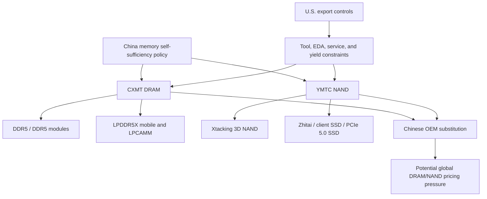

# Chinese Memory Vendors: CXMT, YMTC, Export Controls, And Domestic Substitution

China's memory industry is no longer a distant policy aspiration. It is a real but uneven competitive force, strongest in mature and near-mainstream DRAM/NAND, weaker in HBM, and structurally constrained by U.S. and allied export controls on advanced semiconductor equipment. The two central vendors are ChangXin Memory Technologies (CXMT) in DRAM and Yangtze Memory Technologies Corp. (YMTC) in NAND. CXMT says it was founded in 2016, manufactures DRAM chips for mobile phones, PCs, tablets, servers, and consumer applications, and specializes in DRAM design, manufacturing, sales, and R&D.[^S182] YMTC is China's main NAND champion, associated with Xtacking architecture, Zhitai consumer SSDs, and a policy mandate to reduce dependence on foreign flash suppliers.[^S192]

[CXMT products page](https://www.cxmt.com/en/product.html) - Official CXMT product page for DDR5, LPDDR5/5X, DDR4, and LPDDR4X positioning.

[CXMT newsroom](https://www.cxmt.com/en/news.html) - Official CXMT page for DRAM product announcements and company updates.

[YMTC PCIe 5.0 SSD coverage](https://www.tomshardware.com/pc-components/ssds/chinese-ssd-maker-ymtc-lists-first-commercial-pcie-5-0-ssd-as-worldwide-shortage-intensifies-xtacking-4-0-nand-powers-speeds-of-up-to-10-500-mb-s) - Third-party report on YMTC's PC550 SSD and Xtacking 4.0 NAND.

## Strategic Position

The key point is that CXMT and YMTC are not symmetric. CXMT attacks DRAM, a market dominated by Samsung, SK hynix, and Micron. YMTC attacks NAND, where Samsung, Kioxia/Sandisk, SK hynix/Solidigm, and Micron are the main non-Chinese anchors. CXMT's near-term threat is in DDR4, DDR5, LPDDR5X, and client/system memory. YMTC's near-term threat is in client SSDs, embedded flash, and eventually higher-capacity data-center SSDs. Neither company is yet a proven HBM supplier at scale, which is why their impact on the AI memory supercycle is indirect: they can ease or redirect mainstream DRAM/NAND supply, but they do not replace SK hynix HBM4 or Micron HBM4E in an accelerator package.

This distinction matters for market modeling. If CXMT expands commodity DDR5 and LPDDR5X output, it can pressure PC, mobile, and lower-end server memory pricing even while HBM remains scarce. If YMTC expands client SSD and NAND wafer output, it can pressure consumer and China-local storage pricing even while enterprise SSD demand stays tight. The global memory cycle can therefore split: AI-premium tiers remain short; China-local mainstream tiers receive domestic supply relief; export-controlled advanced tiers remain bottlenecked.

## CXMT: DRAM Substitution Engine

CXMT's official product page now lists DDR5/DDR5 modules, LPDDR5/5X, DDR4/DDR4 modules, and LPDDR4X.[^S183] For DDR5, CXMT says its chips reach speeds up to 8000 Mbps, offer die capacities of 16Gb and 24Gb, and reduce power consumption by 20% versus DDR4 based on internal testing.[^S183] For LPDDR5X, CXMT says it reaches 12Gb and 16Gb die capacities and 10667 Mbps, a 66% improvement over LPDDR5 with 30% lower power consumption based on internal testing.[^S183]

The 2025 announcements show the ramp cadence. On October 28, 2025, CXMT said its LPDDR5X portfolio included standalone dies, packaged chips, and modules, with 12Gb and 16Gb dies, 12GB/16GB/24GB packages, 16GB/32GB LPCAMM modules, and data rates of 8533, 9600, and 10667 Mbps.[^S184] The same announcement said 8533 Mbps and 9600 Mbps LPDDR5X entered mass production in May 2025, while 10667 Mbps LPDDR5X was available for customer sampling.[^S184] On November 23, 2025, CXMT said it showcased DDR5 and LPDDR5X at IC China; the DDR5 line had peak speed of 8000 Mbps and die density up to 24Gb, and the module lineup included UDIMM, SODIMM, CUDIMM, CSODIMM, RDIMM, MRDIMM, and TFF MRDIMM.[^S185]

Those specs are meaningful but should not be overread. CXMT can show high-speed DDR5 and LPDDR5X without proving Samsung/SK hynix/Micron-class cost, yield, long-duration reliability, or server qualification breadth. July 2025 reporting said CXMT had delayed DDR5 mass production into late 2025 after reported thermal stability and yield issues, with early yields below 50% and 16GB DDR5 dies reportedly larger and costlier than Samsung equivalents.[^S190] That means the right analytical framing is "credible entrant with improving products," not "full DRAM triopoly peer."

## YMTC: NAND And Xtacking

YMTC is more technologically mature in NAND than CXMT is in DRAM, but it is also more directly constrained by export controls. The company's Xtacking architecture separates NAND array and logic/periphery wafers and bonds them, a structure that helped YMTC move rapidly from earlier 3D NAND generations toward 232-layer-class products.[^S192] In March 2026, third-party coverage reported that YMTC listed its first commercial PCIe 5.0 NVMe SSD, the PC550, using Xtacking 4.0-based X4-9070 3D NAND, with 512GB, 1TB, and 2TB capacities, PCIe 5.0 x4, NVMe 2.0, up to 10,500 MB/s sequential read, up to 10,000 MB/s sequential write, and a 2TB model reaching up to 1,300K random IOPS.[^S189]

The NAND issue is not whether YMTC can design competitive chips. It has shown that it can. The issue is whether it can maintain tool access, process yields, layer scaling, and product qualification under sanctions. July 2025 reporting said YMTC was aiming for about 150,000 wafer starts per month, up from an expected 130,000 WSPM at the end of 2024, and planned a trial production line using only Chinese-made tools in the second half of 2025.[^S187] The same report said the domestic-tool line was a strategic self-reliance step, but warned that a fully localized fab-tool stack remained beyond current expectations and that yield levels were a major concern.[^S187]

May 2026 reporting then described a more aggressive expansion plan: two additional Wuhan fabs after Phase 3, each planned for 100,000 wafers per month, with Phase 3 expected to add 50,000 WPM by 2027 and more than 50% of Phase 3's equipment sourced domestically.[^S188] It also reported that YMTC's NAND share was 11.8% in 2025 and that the company was targeting 15% by 2028.[^S188] Treat those figures as reported targets and third-party estimates, not audited company disclosures.

## Export Controls

Export controls define the competitive boundary. The U.S. Commerce Department added YMTC to the Entity List in December 2022, according to multiple contemporaneous reports summarized in public company and policy coverage.[^S192] In December 2024, the U.S. expanded restrictions on Chinese chip companies, tools, and software, with AP reporting that roughly 140 companies were newly included and that the rules also limited exports of high-bandwidth memory chips to China.[^S186] Those controls are designed to slow China's access to advanced chips, HBM, equipment, and production know-how needed for AI and military-relevant semiconductor capability.[^S186]

For memory, the practical effects are specific. YMTC needs high-aspect-ratio etch, deposition, metrology, inspection, CMP, bonding, and test tools for 3D NAND. CXMT needs lithography, deposition, etch, implant, metrology, process control, and design IP for DRAM. If U.S., Dutch, and Japanese tools, spares, and service are unavailable or delayed, the constraint is not just first installation; it is maintenance, process tuning, uptime, and yield learning. Domestic Chinese tools can substitute some steps, but matching Lam, Applied, KLA, ASML, TEL, and EDA ecosystems across a full memory flow is a multi-year problem.

The HBM angle is even harder. HBM is not just DRAM. It requires high-quality DRAM die, TSV, wafer thinning, stacking, underfill, thermal management, advanced package test, interposer coordination, and customer platform qualification. AP's 2024 coverage noted U.S. rules limiting HBM exports to China because HBM is needed for data-intensive AI applications.[^S186] That makes domestic HBM politically urgent for China, but it does not make CXMT or YMTC immediately competitive with SK hynix, Samsung, or Micron HBM.

## Domestic Substitution

Chinese OEM substitution is the near-term commercial channel. CXMT's DDR5 and LPDDR5X products can be used in Chinese PCs, notebooks, smartphones, tablets, and potentially servers where customers accept the qualification profile.[^S183][^S185] June 2026 reporting said Chinese memory brands were increasingly using CXMT and YMTC silicon instead of Samsung, Micron, and SK hynix, with domestic brands launching DDR5 modules based on CXMT 24Gb chips and some global brands qualifying or incorporating CXMT memory.[^S191] This matters because substitution does not require CXMT to win the highest-end global server sockets; it can start with local modules, consumer devices, government-preferred procurement, and lower-risk configurations.

YMTC substitution follows a similar pattern in SSDs. Client SSDs, embedded storage, and China-local systems are easier than hyperscale enterprise SSD qualification. July 2026 coverage reported YMTC SSDs appearing in Lenovo retail laptops, including a 512GB PCIe 4.0 NVMe drive in a ThinkBook model, while also noting performance criticism and procurement controversy because of YMTC's sanctions status.[^S193] That is exactly how substitution often starts: not with the highest-performance product, but with a supply-constrained, price-sensitive system where local sourcing is acceptable.

## Competitive Impact

For Samsung, SK hynix, and Micron, the Chinese threat is not immediate HBM displacement. It is margin pressure in the layers that fund the rest of the cycle. If CXMT becomes a major DDR5 and LPDDR5X supplier in China, incumbent vendors lose some price umbrella in client/mobile DRAM. If YMTC expands NAND output with acceptable yields, NAND ASPs can weaken in China-local and consumer segments. If both vendors become credible enough for global second-tier OEMs, the pressure extends outside China.

The counterweight is qualification and trust. Server memory buyers care about error behavior, thermals, DIMM compatibility, lifecycle support, firmware, RMA rates, and supply continuity. Enterprise SSD buyers care about endurance, power loss protection, controller firmware, QoS, latency tails, thermal throttling, and security features. Sanctions add procurement risk. A buyer may use CXMT or YMTC for consumer or China-local platforms and still avoid them in regulated, hyperscale, or government-sensitive systems.

The practical adoption ladder therefore has four tiers. Tier one is domestic consumer devices, where price, local availability, and policy alignment can outweigh perfect global qualification. Tier two is Chinese enterprise and government systems, where domestic sourcing can be a procurement advantage but reliability requirements are higher. Tier three is multinational products assembled in China but sold globally, where sanctions screening, warranty risk, and customer perception matter. Tier four is hyperscale AI infrastructure and regulated procurement, where CXMT/YMTC still face the steepest barriers. The same chip can be acceptable in tier one and unacceptable in tier four.

Pricing impact should be modeled the same way. CXMT does not need 20% global DRAM share to affect pricing; it only needs enough local DDR5 and LPDDR5X supply to reduce Chinese OEM dependence on incumbent vendors during a shortage. YMTC does not need to dominate enterprise SSDs globally to alter NAND behavior; it can pressure client SSDs and China-local storage first. The global incumbents may retain premium AI/server mix while losing some volume and pricing power in the base layers.

## Technology Gaps

The most important CXMT gap is not headline speed. It is cost-per-bit at yield. DDR5-8000 and LPDDR5X-10667 are useful proof points, but die size, process maturity, reliability, and module ecosystem determine whether CXMT can undercut incumbents profitably.[^S183][^S185][^S190] If CXMT needs larger die area or lower yields for equivalent density, it can win policy-backed sockets while still struggling to make global-margin economics work.

The most important YMTC gap is not NAND architecture. Xtacking is credible. The gap is toolchain resilience. Advanced 3D NAND is exceptionally equipment intensive. Higher layer counts increase etch, deposition, metrology, stress, and yield challenges. A domestic-tool line is strategically valuable, but if yields lag, bit cost rises and the global threat is delayed.[^S187][^S188]

The HBM gap is the broadest. China needs HBM for domestic AI accelerators, but HBM requires DRAM cell/process excellence, TSV/stacking, package reliability, thermal performance, known-good-die test, and accelerator qualification. Even if CXMT makes competitive DDR5/LPDDR5X, that does not automatically translate into HBM. Even if YMTC/XMC-related entities explore HBM packaging or bonding, that does not create a qualified HBM4 supply chain.

There is also an IP and ecosystem gap. Memory vendors depend on controller firmware, PHYs, validation equipment, module partners, motherboard qualification, JEDEC participation, failure-analysis databases, and field-return learning. CXMT's official messaging emphasizes IP licensing, cooperation, and patent protection, but the company still has less global field history than the triopoly.[^S182] YMTC's Xtacking architecture gives it a differentiated NAND design, yet enterprise SSD acceptance depends on controllers, firmware, endurance modeling, power-loss behavior, and customer support. These ecosystem assets compound over years; they cannot be purchased instantly with capex.

The most likely medium-term result is not binary success or failure. It is segmentation. CXMT can be good enough for many China-local DDR5 and LPDDR5X sockets while remaining unproven for the hardest server memory tiers. YMTC can ship credible client SSDs while still fighting yield and toolchain constraints in high-density NAND. That segmentation is commercially meaningful because memory markets price at the margin: even "good enough" domestic supply can change procurement behavior during shortage periods.

## Semicap Read-Through

For semicap, CXMT and YMTC are both opportunity and restriction risk. Domestic Chinese fabs pull demand for Chinese etch, deposition, cleaning, metrology, test, and automation vendors. Export controls reduce addressable China revenue for U.S. and allied toolmakers but stimulate Chinese tool substitution. YMTC's domestic-tool trial line is the clearest example: the goal is not just memory output, but an indigenous equipment ecosystem that can support 3D NAND without U.S. tools.[^S187]

The read-through is uneven. Lower-spec tools can support mature or less demanding steps, while advanced etch, lithography, process control, and inspection are much harder to replicate. This creates a two-speed China tool market: visible adoption in constrained fabs, but persistent performance gaps at the most advanced process steps. For [07-semicap-ecosystem/01-wafer-fab-equipment-vendors.md](../07-semicap-ecosystem/01-wafer-fab-equipment-vendors.md), CXMT/YMTC are important because they show both the ceiling and the incentive structure for domestic tool substitution.

## KPI Dashboard

| KPI | Why it matters | Watchpoint |
|---|---|---|
| CXMT DDR5 yield and die size | Determines real cost competitiveness | Stability, thermals, server qualification |
| CXMT LPDDR5X volume | Measures mobile/client substitution | 8533/9600 Mbps mass production; 10667 Mbps sampling |
| YMTC WSPM capacity | Determines NAND pricing threat | 150,000 WSPM target and Phase 3 ramp |
| Domestic tool share | Measures sanctions resilience | YMTC Phase 3 and trial-line yield |
| China OEM adoption | Converts policy into volume | Lenovo, local module makers, domestic procurement |
| HBM progress | Tests AI-memory independence | TSV, stack, test, and customer qualification evidence |

## Investment Debate

The bull case for Chinese memory is scale plus policy. Domestic demand is enormous, memory shortages give customers motivation to qualify alternative suppliers, and export controls create a national-security reason to subsidize local supply. CXMT has moved from DDR4/LPDDR4X into DDR5 and LPDDR5X. YMTC has a credible NAND architecture and reported PCIe 5.0 SSD products. If Chinese tools improve, both companies can take share in domestic systems and eventually pressure global low- to mid-tier pricing.[^S183][^S185][^S187][^S189]

The bear case is that memory is unforgiving. DRAM and NAND are not only about building a chip that works once; they are about producing billions of reliable bits at low cost, high yield, and customer-grade quality. Export controls restrict the tools and service ecosystem needed for that learning curve. HBM is even harder. China's memory vendors can be strategically important and still fall short of displacing the leading global vendors in the highest-margin AI memory tiers.

For this database, CXMT and YMTC are the China substitution chapter. They are not yet the HBM chapter. Their importance is that they can reshape the base of the memory stack, alter incumbent pricing in mainstream DRAM/NAND, and force semicap/tool-policy questions that will affect every file in this database through the late 2020s.
