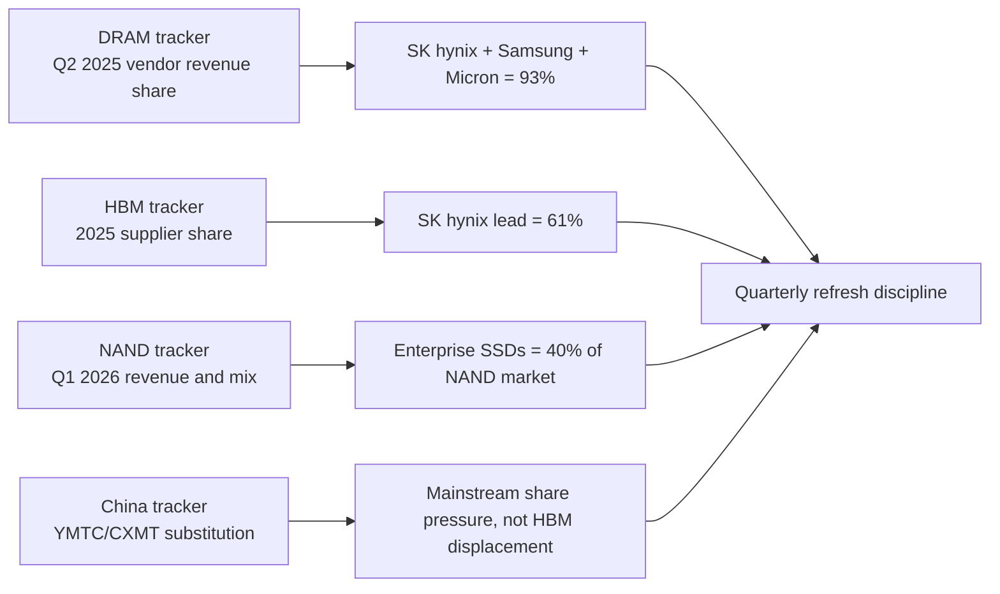
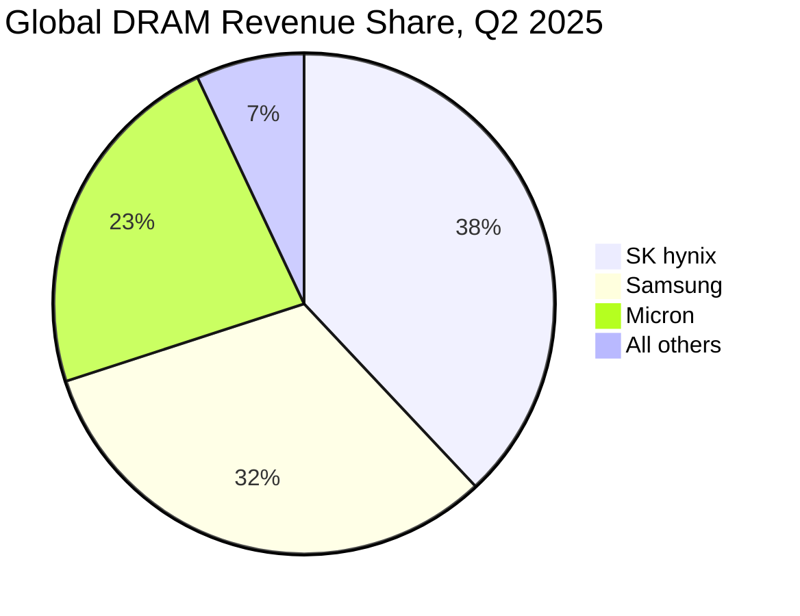
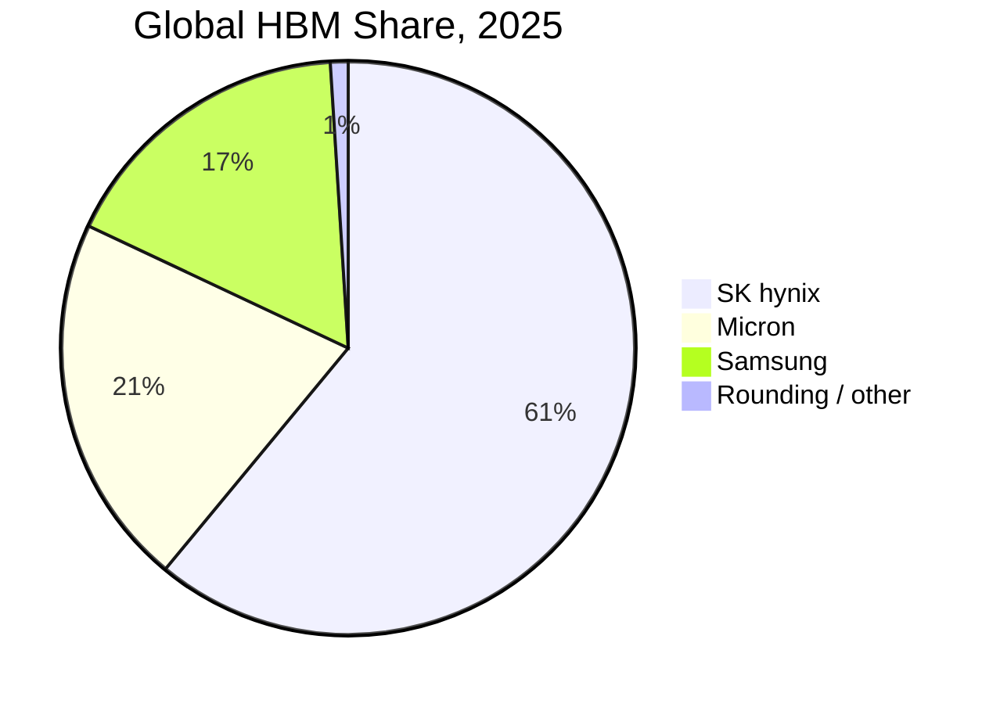

# Memory Market Share Tracker

This file is the live scoreboard for supplier share, not a forecast model. The rule is simple: preserve the measurement date, product boundary, and source treatment for every share datapoint. DRAM, HBM, and NAND are now moving on different clocks. Conventional DRAM share can swing with server DDR5, mobile LPDDR, and PC module allocation; HBM share is tied to accelerator qualification and advanced packaging; NAND share is being distorted by enterprise SSD demand, YMTC substitution, and high-capacity QLC allocation. Flattening those markets into one "memory share" number would hide the competitive issue that matters most in 2026: suppliers can lose share in one ledger while gaining profit mix in another.[^S021][^S022][^S023]

## Current Share Snapshots

| Segment | Measurement date | Supplier / bucket | Share | Source treatment | Analytical use |
|---|---:|---|---:|---|---|
| DRAM | Q2 2025 | SK hynix | 38% | Counterpoint cited by The Verge | Baseline for DRAM leadership after HBM-driven mix shift.[^S021] |
| DRAM | Q2 2025 | Samsung | 32% | Counterpoint cited by The Verge | Baseline for Samsung conventional-memory depth despite HBM lag.[^S021] |
| DRAM | Q2 2025 | Micron | 23% | Counterpoint cited by The Verge | U.S. supplier share anchor before HBM4 and strategic-customer agreements.[^S021] |
| DRAM | Q2 2025 | All others | 7% | Implied from 93% big-three share | Shows how hard it is for CXMT and smaller suppliers to matter globally yet.[^S021] |
| HBM | 2025 | SK hynix | 61% | Tom's Hardware report | AI accelerator memory leadership and valuation premium.[^S023] |
| HBM | 2025 | Micron | 21% | Tom's Hardware report | Challenger share with power/timing differentiation.[^S023] |
| HBM | 2025 | Samsung | 17% | Tom's Hardware report | Rebuild case around HBM4/HBM4E qualification.[^S023] |
| NAND | Q1 2026 | YMTC | 13% | PC Gamer citing Counterpoint; up from 8% in Q1 2025 | China substitution and sanctions-resilience tracker.[^S022] |
| NAND | Q1 2026 | SanDisk | 13% | PC Gamer cited parity point | Post-WD separation reference point.[^S022] |
| NAND | Q1 2026 | Micron | 13% | PC Gamer cited parity point | NAND share anchor against enterprise SSD pull-through.[^S022] |
| NAND | Q1 2026 | Enterprise SSDs | 40% of NAND market | PC Gamer citing Counterpoint; forecast >60% by year-end 2026 | Mix signal more important than raw wafer share.[^S022] |

The cleanest immediate read is that DRAM and HBM leadership are not the same thing. The Verge reported on December 9, 2025 that Samsung, SK hynix, and Micron together controlled 93% of global DRAM in Q2 2025, with SK hynix at 38%, Samsung at 32%, and Micron at 23%, while no other DRAM supplier exceeded 5%.[^S021] That is a triopoly by any practical competition screen, which is why the June 2026 DRAM price-fixing lawsuit framed the group as oligopolists even before any court finding on conduct.[^S025] For this database, the useful point is structural: DRAM is concentrated enough that wafer allocation decisions by three companies can move PC, server, mobile, and module pricing.

HBM is narrower and more skewed. Tom's Hardware reported on June 23, 2026 that SK hynix held 61% of the global HBM market in 2025, versus Micron at 21% and Samsung at 17%.[^S023] That share stack explains the difference between DRAM revenue share and strategic leverage. SK hynix does not need to dominate all conventional DRAM bits if it controls the highest-margin HBM allocation for NVIDIA-class AI accelerators. Micron's 21% matters because it creates a credible non-SK supply path for platform customers. Samsung's 17% matters because its foundry, base-die, and packaging integration can still change the HBM4/HBM4E map if qualification catches up.

NAND is the least tidy table. Public Q3 2025 summaries used in the overview file put Samsung near 30%, SK hynix near 20%, Kioxia near 14%, Micron near 13%, YMTC near 13%, and Western Digital near 11%, while PC Gamer's June 3, 2026 Counterpoint-based report emphasized that YMTC had moved from 8% in Q1 2025 to 13% in Q1 2026 and was level with SanDisk and Micron in that article's framing.[^S018][^S022] Those two snapshots should not be merged mechanically. The safer tracker entry is: YMTC has crossed the low-teens share threshold, and enterprise SSD demand has become the swing factor.

## Interpretation Rules

First, use revenue share where possible, but flag when the source may be mixing revenue, bit output, or shipment share. HBM revenue share can overstate physical bit share because HBM ASPs and margins are higher than commodity DRAM. NAND revenue share can overstate enterprise-exposed suppliers when high-capacity SSD prices rise faster than consumer flash. DRAM revenue share can move because of mix even if wafer starts do not.

Second, separate "market share" from "allocation power." A supplier with lower total share can have greater allocation power if it controls a scarce product. SK hynix's 61% HBM position is more valuable than a similar share in commodity DDR4 would be because HBM attaches directly to accelerator ramps, requires long customer qualification, and consumes packaging/test capacity.[^S023] Conversely, YMTC's 13% NAND position is strategically important for China substitution, but it does not imply equivalent influence in enterprise SSDs, HBM, or global hyperscale procurement.[^S022][^S188]

Third, track share alongside shortage duration. On July 3, 2026, Tom's Hardware reported that SEMI, whose members include Micron, Samsung, and SK hynix, urged the U.S. government not to intervene in memory pricing or production-capacity decisions; the same report said memory manufacturing capacity was expected to increase by about 19% annually, but fabs would take years to come online and AI hyperscaler demand was still expected to outstrip supply, with shortages potentially lasting until 2027 or longer.[^S194] That means a share table without a supply table is incomplete: suppliers may preserve or gain share while still failing to satisfy unit demand outside AI.

## Quarterly Update Template

| Refresh item | Required field | Why it matters |
|---|---|---|
| DRAM share | Quarter, revenue/bit basis, supplier ranks, share percentages | Captures whether SK hynix's HBM-led DRAM lead persists or Samsung retakes conventional share. |
| HBM share | Calendar year or quarter, HBM generation, customer qualification status | Separates HBM3E installed share from HBM4/HBM4E platform wins. |
| NAND share | Quarter, supplier ranks, enterprise SSD mix, China share | Detects whether YMTC and SanDisk/Micron/Kioxia shifts are pricing or volume driven. |
| Capacity | Wafer starts, HBM stack capacity, NAND layers, package/test bottlenecks | Share without bottleneck context can misread scarcity as durable competitiveness. |
| Pricing | Contract price direction by DRAM, HBM, NAND, SSD | Converts share into revenue and margin implications. |
| Source conflict | Range and source labels | Prevents stale or inconsistent market tables from becoming false precision. |

## KPI Watchlist

The first KPI is whether the DRAM big-three share stays above 90%. If it does, CXMT remains a regional and segment-specific threat rather than a global DRAM share breaker. If it falls meaningfully, the tracker should identify whether share loss came from Chinese domestic substitution, mature-node DRAM, or a measurement-definition change.[^S021][^S191]

The second KPI is whether SK hynix's HBM share remains above 50% after HBM4 ramps. If Micron's HBM4 volume production and Samsung's HBM4/HBM4E qualification convert into real accelerator allocations, HBM share should compress even if total HBM demand rises. If SK hynix remains above 50%, its early TSV/stack/package lead has become a multi-generation moat rather than a one-cycle timing advantage.[^S023]

The third KPI is the enterprise-SSD share of NAND revenue. PC Gamer's June 2026 report put enterprise SSDs at 40% of the NAND market and said Counterpoint forecast more than 60% by year-end 2026.[^S022] That mix shift can matter more than supplier share because it changes whose NAND bits are most profitable. Kioxia/SanDisk, Micron, Samsung, SK hynix/Solidigm, and YMTC can all ship flash, but enterprise SSD qualification determines who monetizes AI storage scarcity.

The fourth KPI is China share under sanctions. YMTC's low-teens NAND position and CXMT's improving DDR5/LPDDR5X portfolio should be tracked separately from HBM. The China file argues that the most likely medium-term result is segmentation: local consumer and enterprise substitution first, premium global AI infrastructure later if at all.[^S183][^S188][^S193]

## Maintenance Note

Update this file after every new public market-share release from Counterpoint, TrendForce, Omdia, Gartner, WSTS/SIA, company earnings decks, or credible local press that quotes those firms. Do not overwrite old figures silently. Add a new row with the new quarter, then explain why the change happened: mix shift, price movement, capacity expansion, customer qualification, export controls, or source-definition change. This file should stay compact enough to be readable, but exact enough that a reader can reconstruct which market snapshot was being used in each database section.

## Sources

[^S018]: Flash memory overview, Wikipedia, Crawled 2026-05, no stable page publish date listed, https://en.wikipedia.org/wiki/Flash_memory
[^S021]: RAM is ruining everything, The Verge, published 2025-12-09, https://www.theverge.com/report/839506/ram-shortage-price-increases-pc-gaming-smartphones
[^S022]: NAND flash makers earned a record $46 billion in revenues over the first quarter of 2026, PC Gamer, published 2026-06-03, https://www.pcgamer.com/hardware/ssds/nand-flash-makers-earned-a-record-usd46-billion-in-revenues-over-the-first-quarter-of-2026-a-shocking-3-5-times-more-than-last-year/
[^S023]: SK hynix passes Samsung as South Korea's most valuable company, Tom's Hardware, published 2026-06-23, https://www.tomshardware.com/tech-industry/sk-hynix-passes-samsung-as-south-koreas-most-valuable-company-on-hbm-demand
[^S025]: Samsung, SK hynix, and Micron sued over alleged DRAM price fixing amid record memory costs, Tom's Hardware, published 2026-06-29, https://www.tomshardware.com/tech-industry/samsung-sk-hynix-and-micron-sued-over-alleged-dram-price-fixing-amid-record-memory-costs
[^S183]: Products and Services, ChangXin Memory Technologies, Accessed 2026-07-06, no stable page publish date listed, https://www.cxmt.com/en/product.html
[^S188]: China's premier memory-maker YMTC plans two additional Wuhan fabs using homegrown chipmaking tools, Tom's Hardware, published 2026-05, exact day not captured in accessed search result, https://www.tomshardware.com/tech-industry/semiconductors/ymtc-planms-two-additional-wuhan-fabs
[^S191]: Chinese memory brands ditch Samsung and Micron for homegrown CXMT and YMTC silicon, Tom's Hardware, published 2026-06, exact day not captured in accessed search result, https://www.tomshardware.com/pc-components/ram/chinese-memory-vendors-snub-industry-giants-in-favor-of-homegrown-ram-chips-samsung-micron-and-sk-hynix-face-a-chinese-supply-chain-revolt
[^S193]: Chinese YMTC SSDs make their way into retail Lenovo laptops, Tom's Hardware, published 2026-07-05, https://www.tomshardware.com/pc-components/ssds/chinese-ymtc-ssds-make-their-way-into-retail-lenovo-laptops-media-outlet-slams-ymtc-pcie-4-0-drive-for-below-average-for-an-ssd-in-an-office-laptop-in-review
[^S194]: SK hynix, Samsung, Micron among semiconductor industry group lobbying against government intervention on domestic memory chip supply, Tom's Hardware, published 2026-07-03, https://www.tomshardware.com/tech-industry/sk-hynix-samsung-micron-among-semiconductor-industry-group-lobbying-against-government-intervention-on-domestic-memory-chip-supply-says-move-would-worsen-situation-suggests-tax-deductions-on-consumer-electronics-instead
