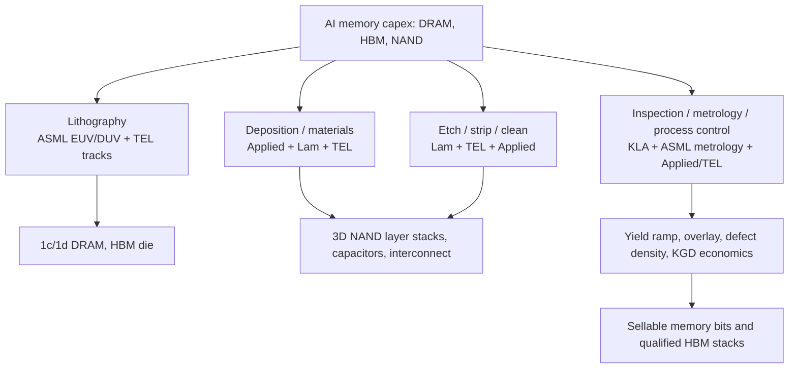
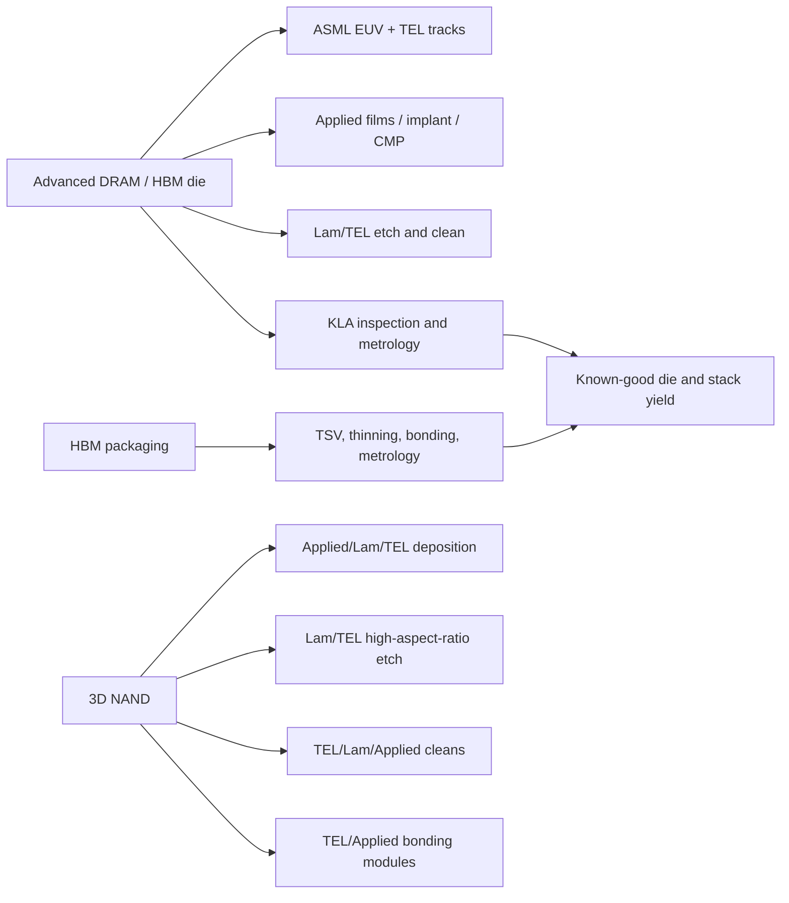

# Wafer Fab Equipment Vendors: ASML, Applied Materials, Lam Research, Tokyo Electron, And KLA

Wafer fab equipment is the memory industry's hidden capacity ledger. A memory vendor can announce a fab shell, a cleanroom, or a packaging plant, but useful output still depends on whether lithography scanners, deposition chambers, etchers, cleaners, process-control tools, wafer handlers, spares, field-service teams, facilities hooks, and trained process engineers arrive on schedule. In the 2026 memory upcycle, WFE exposure is especially important because HBM, advanced DRAM, high-layer NAND, CBA/hybrid bonding, and advanced packaging do not stress the same tool families equally. ASML captures the lithography bottleneck; Applied Materials captures broad materials engineering and process breadth; Lam Research captures etch/deposition intensity in memory; Tokyo Electron captures coater/developer, etch, deposition, cleaning, test, and bonding breadth; and KLA captures yield learning through inspection, metrology, reticle, wafer, package, and software control.[^S195][^S198][^S201][^S202][^S203]

## Why WFE Matters For Memory

The usual shorthand says memory suppliers add wafer capacity when demand rises. That is directionally true, but it hides the serial constraints. Leading-edge DRAM uses EUV/DUV lithography, capacitor modules, high-k dielectrics, metal contacts, tight overlay, and aggressive defect control. HBM starts with advanced DRAM wafers, then adds TSV, thinning, stacking, and package-level test, which moves some bottlenecks outside front-end WFE but still depends on front-end die yield. 3D NAND is less lithography-led than leading-edge logic, but it is exceptionally etch/deposition-led because every layer increase requires taller film stacks, deeper channel holes, staircase contacts, cleaning, inspection, and stress control.

This is why memory WFE sensitivity differs by product. A new SK hynix HBM/DRAM line pulls ASML EUV, TEL coater/developers, Applied materials engineering, Lam etch and deposition, KLA inspection and metrology, plus downstream package/test tools. A Kioxia/SanDisk or Micron NAND layer transition pulls high-aspect-ratio etch, oxide/nitride deposition, cleans, CBA/wafer bonding, process control, and test. A CXMT or YMTC domestic-substitution ramp pulls many similar tool categories but is constrained by export controls, tool localization, service access, and yield maturity.[^S187][^S188][^S194]

The stress points also differ by ramp phase. During greenfield construction, facilities readiness, power, water, gas, chemical distribution, subfab exhaust, vibration control, and tool-install labor can gate schedule before any process recipe is tuned. During first silicon, the bottleneck shifts to chamber matching, overlay calibration, particles, film thickness, etch profile, and metrology recipes. During volume ramp, the constraint becomes uptime, spares, field-service response, preventive maintenance, statistical process control, and excursion containment. This is why the same fab can be "built" long before it is economically meaningful. Memory supply only improves when WFE converts through those phases into qualified wafers, known-good die, and packaged products.

For investors, WFE orders are a leading indicator, but not a final output metric. The SK hynix ASML order is an early signal for advanced DRAM and HBM wafer capacity, while Applied/SK hynix and Applied/Micron collaborations are signals that process integration is moving upstream into the tool vendor relationship.[^S197][^S198] Lam's March-quarter geographic mix shows how much near-term etch/deposition demand is still tied to China, Korea, and Taiwan rather than U.S.-only reshoring.[^S200] TEL and KLA show why bottlenecks can sit in "supporting" process steps: coater/developer tracks, cleans, bonding tools, wafer probe, defect inspection, and metrology can all delay a nominally lithography-led or etch-led ramp.[^S202][^S203]

## Vendor Map

| Vendor | Core WFE role | Memory exposure | Constraint signal |
|---|---|---|---|
| ASML | EUV, DUV, computational lithography, metrology/inspection | Advanced DRAM, HBM die, leading-edge logic base dies | Scanner output, export licenses, field service, high-NA timing |
| Applied Materials | Deposition, etch, CMP, implant, metrology/inspection, hybrid bonding, process integration | DRAM, HBM, NAND, advanced packaging, AI logic | Broad customer capex, EPIC collaborations, process module attach |
| Lam Research | Etch, deposition, strip/clean, mass metrology, advanced packaging | 3D NAND, DRAM, HBM, TSV/package support | Memory intensity, China/Korea/Taiwan demand, high-aspect-ratio etch |
| Tokyo Electron | Coater/developer, deposition, etch, cleaning, wafer probe, bonding/debonding | EUV tracks, NAND etch/clean, wafer bonding, KGD probe | Share in tracks, dry etch/clean competition, Japan supply chain |
| KLA | Inspection, metrology, reticle, wafer, package, process-control software | Yield ramp for DRAM, NAND, HBM and advanced packaging | Defect discovery, overlay/metrology, process-window control |

## ASML: Lithography Scarcity

ASML's role is structurally different from the rest of WFE. Its EUV systems are the only production path for the most advanced lithography layers, and its DUV systems remain necessary for many other layers even inside EUV-enabled fabs.[^S196] ASML says its NXE EUV systems are used for high-volume manufacturing of advanced logic and memory chips and that NXE platforms print features with 13 nm resolution, unreachable with DUV; it also says EXE high-NA systems, with 0.55 numerical aperture and 8 nm resolution, support high-volume chip manufacturing in 2025-2026 for advanced logic and memory nodes at similar density.[^S196] That makes ASML a direct read-through to advanced DRAM and HBM die scaling, not only leading-edge logic.

Financially, ASML entered the 2026 cycle with unusual visibility. Its January 28, 2026 Q4/full-year release reported 2025 full-year net sales of EUR 32.7 billion, gross margin of 52.8%, R&D expenses of EUR 4.7 billion, and basic EPS of EUR 24.73.[^S195] The same page listed Q4 2025 net sales of EUR 9.7 billion and gross margin of 52.2%.[^S195] The demand signal from memory was explicit in March 2026: SK hynix disclosed an 11.9 trillion won, roughly $7.9 billion, ASML EUV equipment purchase through December 2027; third-party reporting said the order could cover about 30 EUV machines and would support HBM at M15X in Cheongju and advanced DRAM at the Yongin cluster.[^S197]

For memory investors, ASML should be modeled less as a generic capex vendor and more as the schedule gate for advanced DRAM node migration. If EUV slots are scarce, the customer with tool access can pull forward 1c/1d DRAM, HBM4/HBM4E die, and premium server DDR5. If EUV slots are delayed or export licenses restrict shipment, the fab shell does not convert into leading-edge output. China is the inverse case: domestic memory demand is large, but ASML's most advanced shipment and service environment is politically constrained, which caps the speed of CXMT/YMTC catch-up in the highest-performance tiers.[^S186][^S194]

## Applied Materials: Materials Engineering Breadth

Applied Materials is the broadest process-equipment supplier in this group. Its product library spans 200mm and 300mm tools across ALD, CVD, CMP, ECD, epitaxy, etch, hybrid bonding, ion implant, metrology and inspection, pattern shaping, photomask, PVD, and rapid thermal processing.[^S199] That breadth matters in memory because no single module defines the cost curve. DRAM needs capacitor and contact engineering. NAND needs films, etch, cleans, CMP, and bonding. HBM needs front-end DRAM plus TSV/package-adjacent process modules. Advanced packaging needs deposition and bonding capability at wafer or panel scale.

The 2026 earnings signal is unusually direct. Applied's May 14, 2026 Q2 FY2026 release reported record revenue of $7.91 billion, up 11% year over year, GAAP gross margin of 49.9%, operating income of $2.52 billion, and GAAP EPS of $3.51.[^S198] CEO Gary Dickerson said Applied expected its semiconductor equipment business to grow more than 30% in calendar 2026, and tied the growth to AI computing infrastructure plus leadership positions in leading-edge logic, DRAM, and advanced packaging.[^S198] The same release listed EPIC Center collaborations with TSMC, SK hynix, Micron, Advantest, Arizona State, RPI, and Stanford; the SK hynix collaboration focused on next-generation DRAM and HBM, and the Micron collaboration focused on next-generation DRAM, HBM, and NAND for AI systems.[^S198]

Applied's strategic value is process integration. A memory customer buying one isolated chamber still has to solve film stack, etch selectivity, pattern fidelity, cleaning, wafer bonding, test correlation, and yield ramp. Applied is trying to pull those steps into co-optimized development environments. That is particularly relevant for HBM and advanced DRAM, where materials choices interact with power, thermal behavior, and package reliability, and for NAND, where stack height turns film uniformity and etch profile into bit-cost variables. The NEXX advanced-packaging deposition acquisition announced in the Q2 release also shows Applied expanding toward large-body AI accelerator package requirements.[^S198]

## Lam Research: Memory Etch And Deposition Leverage

Lam is the purest memory-process intensity play among the U.S. front-end vendors. Its product page lists solutions and processes across advanced packaging, DRAM, cryogenic etching, deposition, etch, strip and clean, mass metrology, metallization, and panel processing.[^S201] The reason Lam is so sensitive to memory is structural: 3D NAND scaling needs high-aspect-ratio etch and uniform deposition through taller stacks, while DRAM and HBM need advanced patterning support, capacitor/contact modules, and package-adjacent process capability.

The fiscal Q3 2026 signal was strong. Investor's Business Daily reported on April 22, 2026 that Lam earned adjusted EPS of $1.47 on sales of $5.84 billion for the quarter ended March 29, beating consensus, with earnings up 41% and sales up 24% year over year.[^S200] The same report said Lam guided for adjusted EPS of $1.65 on revenue of $6.6 billion for the June quarter and quoted CEO Tim Archer saying Lam delivered record revenue and EPS as AI-driven demand reshaped the semiconductor industry.[^S200] It also reported geographic revenue exposure of 34% China, 23% South Korea, 23% Taiwan, and 6% U.S. in the March quarter.[^S200]

For memory, Lam's critical question is not whether NAND layer counts rise. They will. The question is whether Lam keeps enough of the most difficult etch/deposition steps as customers move from 232/276/321-layer classes toward still taller stacks and bonded architectures. TEL is a real competitor in dry etch, and Applied competes across adjacent process modules. Lam's advantage is accumulated chamber, plasma, profile-control, and productivity learning in the exact places where NAND and DRAM produce yield pain. If AI storage demand keeps enterprise SSDs tight, Lam benefits through both new NAND capacity and layer-transition intensity.[^S022][^S201]

## Tokyo Electron: Tracks, Etch, Cleaning, Bonding

Tokyo Electron is often under-modeled in U.S.-centric semicap discussions because it does not have ASML's lithography monopoly or Lam's U.S. memory-etch narrative. Operationally, TEL is deeply embedded. Its official product page says it offers system solutions for the four sequential patterning processes and lists product categories in deposition, lithography, etch, cleaning, test, and bonding/debonding.[^S202] TEL says it has 90% overall share in coater/developer systems and almost 100% share for the high-NA process, making it a required partner around ASML scanners rather than a peripheral vendor.[^S202]

TEL's product breadth maps well to memory. In deposition, TEL lists thermal processing, CVD, advanced sequential flow deposition, ALD, and PVD tools.[^S202] In lithography, its CLEAN TRACK coater/developer platforms support EUV and High-NA process technologies.[^S202] In etch, TEL says scaling and EUV have increased the need for anisotropic etch and high selectivity, and that it has the second-largest dry etch share.[^S202] In cleaning, TEL also says it has the second-largest wafer cleaning share.[^S202] For advanced packaging and HBM-adjacent flows, TEL's Synapse systems support temporary bonding/debonding and Cu hybrid bonding with alignment accuracy and throughput claims.[^S202]

The memory read-through is twofold. First, TEL is a lithography-adjacent gatekeeper because EUV exposure requires reliable resist coating and development around the scanner. Second, TEL is a credible competitor in the process modules that NAND and HBM stress: dry etch, cleans, probe, bonding, and debonding. If High-NA EUV begins to matter for leading-edge DRAM after logic adoption, TEL's coater/developer share becomes even more strategic. If hybrid bonding moves deeper into memory integration, TEL's bonder/debonder positioning becomes relevant to both CBA-like NAND flows and advanced HBM packaging.

## KLA: Yield, Inspection, And Process Control

KLA is the quality-control layer for the memory capex cycle. Its product page frames the company around process-control and process-enabling solutions and lists chip-manufacturing product families including chemistry process control, defect inspection and review, deposition, etch, in situ process management, and metrology.[^S203] It also lists wafer manufacturing, reticle manufacturing, packaging manufacturing, PCB and IC substrate manufacturing, semiconductor software, and AI/advanced-packaging technology themes.[^S203] That breadth matters because memory yield loss can originate in a wafer defect, reticle problem, film-thickness excursion, overlay drift, etch non-uniformity, bonding defect, die-sort failure, or package-level reliability escape.

KLA's value rises when process windows narrow. DRAM scaling reduces margin around capacitor, contact, and overlay modules. HBM raises the cost of a bad die because one failing DRAM die can threaten stack economics. 3D NAND creates vertical defect modes that can affect many cells across a string or layer. Advanced packaging creates new inspection surfaces: microbumps, hybrid-bond interfaces, interposers, substrates, underfill, warpage, and die placement. KLA's packaging and substrate product categories therefore connect directly to the later files on OSAT, testing, substrates, and advanced packaging.[^S203]

Process control is also the only practical way to compress yield-learning time. A memory supplier that installs new tools but cannot detect excursion signatures early will convert capex into inventory risk. A supplier that closes inspection/metrology loops quickly can ramp a new HBM or NAND process faster, protect known-good-die supply, and reduce field-return risk. That is why KLA's importance often rises late in a node transition, when the customer has enough tools installed but is still fighting yield, variability, and excursion control.

## Toolchain Linkages By Memory Product

For advanced DRAM and HBM die, the highest-value WFE buckets are EUV/DUV lithography, coater/developer tracks, deposition, etch, CMP, cleaning, process control, and yield-management software. The SK hynix ASML order shows how seriously memory leaders are treating EUV access as a strategic resource rather than a routine tool purchase.[^S197] For 3D NAND, the value shifts toward deposition and high-aspect-ratio etch because higher layer counts and bonded-array strategies make film uniformity, channel etch, staircase contacts, and bonding yield central to bit cost.[^S005][^S180]

For HBM packaging, the front-end vendors overlap with advanced packaging suppliers. TSV and stack assembly are not identical to DRAM wafer fabrication, but the cleanliness, metrology, bonding, and process-control burden increasingly resembles wafer processing. Applied's EPIC collaborations with SK hynix and Micron, TEL's bonding/debonding portfolio, Lam's advanced-packaging and panel-processing positioning, and KLA's packaging inspection/metrology products all show WFE vendors moving toward the package boundary.[^S198][^S201][^S202][^S203]

## Competitive And Geopolitical Issues

The first competitive issue is concentration. No single WFE vendor can build a memory fab alone, but each leading vendor can be sole- or near-sole-source in a critical module. ASML is the clearest case in EUV. TEL is deeply entrenched in coater/developers. KLA is strongest where defect discovery and metrology define yield learning. Lam and Applied compete more directly in several process modules, but both have specialized strengths that customers cannot replace casually.

The second issue is China. Export controls reduce the advanced addressable market for ASML, Lam, Applied, KLA, and allied Japanese suppliers, but Chinese memory self-sufficiency creates powerful local demand for any tools that can be shipped, serviced, or domestically substituted. YMTC's domestic-tool efforts and CXMT's DRAM ramp show that equipment localization is a strategic goal, not just a procurement tactic.[^S187][^S188] The near-term result is not full replacement of ASML, Lam, Applied, TEL, and KLA; it is bifurcation between export-controlled advanced tiers and China-local tool ecosystems.

The third issue is WFE market scale. Investor's Business Daily reported on June 17, 2026 that ASML, Applied Materials, and Lam hit record highs after Citi raised its bull-case WFE estimates for 2026 and following years, citing AI-driven chip demand.[^S204] Even when exact sell-side forecasts differ, the qualitative point is stable: AI infrastructure has turned memory WFE from a cyclical recovery trade into a capacity race across DRAM, HBM, NAND, foundry logic, and advanced packaging.

## KPI Watchlist

Track ASML EUV shipments, backlog, China exposure, and High-NA adoption in memory. Track Applied's semiconductor systems growth, DRAM/HBM/NAND collaboration disclosures, hybrid-bonding or panel-packaging traction, and EPIC customer participation. Track Lam's memory revenue mix, China/Korea/Taiwan exposure, high-aspect-ratio etch share, and NAND layer-transition attach. Track TEL's coater/developer share around High-NA, dry etch share, cleaning share, and bonding/debonding wins. Track KLA's process-control intensity in memory nodes, advanced packaging inspection, reticle inspection, substrate inspection, and software pull-through.

The key cross-vendor metric is tool-to-output conversion. If memory suppliers place large tool orders but HBM or NAND output remains tight, the bottleneck may have moved to installation, qualification, utilities, process recipes, yield, packaging, or test. If tool deliveries rise and memory prices still climb, demand is outrunning even accelerated capex. If China orders remain high while advanced exports tighten, domestic tool substitution will become a parallel semicap cycle rather than a footnote.

## Database Links

This file should be read with [03-hbm-deep-dive/03-hbm-vendor-roadmaps.md](../03-hbm-deep-dive/03-hbm-vendor-roadmaps.md) for fab timing, [06-competitive-landscape/05-chinese-vendors-cxmt-yangtze.md](../06-competitive-landscape/05-chinese-vendors-cxmt-yangtze.md) for China tool substitution, [08-manufacturing-process/01-dram-process-flow.md](../08-manufacturing-process/01-dram-process-flow.md) for DRAM process detail, [08-manufacturing-process/02-3d-nand-process-flow.md](../08-manufacturing-process/02-3d-nand-process-flow.md) for NAND tool intensity, and [08-manufacturing-process/03-hbm-packaging-process-flow.md](../08-manufacturing-process/03-hbm-packaging-process-flow.md) for TSV/stack/package steps.
