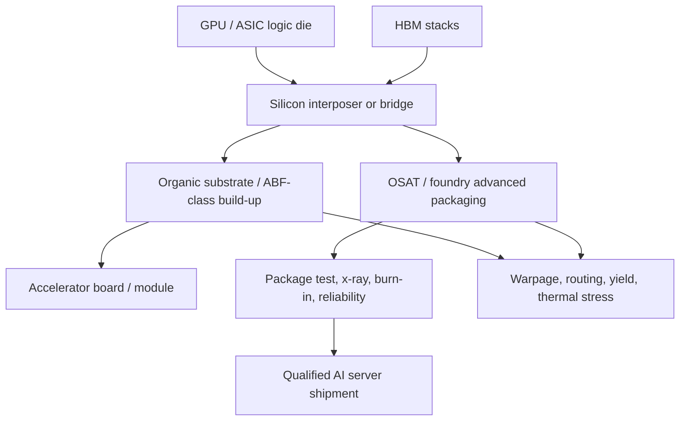
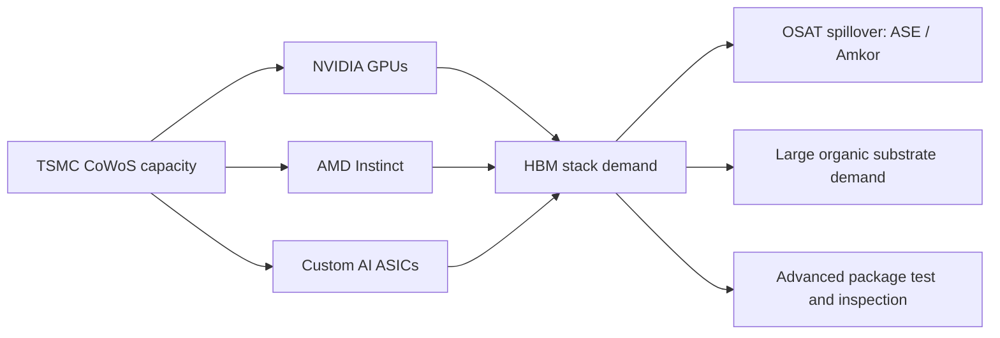

# Substrates, Interposers, And OSAT: Amkor, ASE, CoWoS, EMIB, And AI Packaging Capacity

Advanced memory is now package-constrained as much as wafer-constrained. HBM stacks only become useful when they are routed into a GPU, ASIC, TPU, or switch package through silicon interposers, embedded bridges, redistribution layers, organic substrates, underfill, thermal materials, and high-throughput test. In AI accelerators, the package is no longer a passive carrier. It is the physical memory fabric: it determines HBM stack count, routing density, power delivery, thermal gradients, warpage, reworkability, inspection strategy, and final system qualification. That is why OSATs, substrate suppliers, and foundry-owned advanced packaging lines have moved from back-end cost centers to strategic bottlenecks.[^S050][^S057][^S205]

## Packaging Stack

The simplified stack is logic die plus HBM stack on an interposer, interposer on an organic substrate, and package into the board or module. Silicon interposers provide very fine-pitch routing between the accelerator and multiple HBM stacks; embedded bridges such as Intel EMIB use smaller silicon bridge regions inside an organic substrate rather than a full interposer; fan-out and wafer-level packaging redistribute signals across dielectric and metal layers; package substrates provide power, signal escape, mechanical support, and board interface.[^S050][^S054][^S057]

The engineering burden is multidimensional. More HBM stacks increase bandwidth and capacity, but they also expand package footprint, interposer area, substrate routing density, power delivery, and thermal load. Larger logic dies and multiple chiplets create coefficient-of-thermal-expansion mismatch between silicon, organic substrate, copper, underfill, and heat spreader. Advanced packages must then survive assembly, temperature cycling, board attach, liquid-cooling interfaces, rack vibration, and years of accelerator workloads. A 2025 STAMP-2.5D paper argued that conventional 2.5D floorplanning that minimizes wirelength can worsen thermal and CTE stress, and reported that its structural/thermal-aware method reduced stress by 11% while keeping temperature increase to 0.5% and cutting wirelength by 11% compared with temperature-only optimization.[^S208]

## Capacity Map

| Layer | Key suppliers / models | Why it matters to memory |
|---|---|---|
| Foundry-owned advanced packaging | TSMC CoWoS/InFO/SoIC, Intel EMIB/Foveros, Samsung I-Cube/X-Cube | Determines whether HBM stacks can be integrated with leading AI logic. |
| OSAT advanced packaging | ASE/SPIL, Amkor, JCET and regional OSATs | Adds external assembly/test capacity, geographic diversification, and customer-specific flows. |
| Substrates | ABF/build-up substrate ecosystem, high-layer organic substrates | Package escape routing, power delivery, warpage, mechanical support. |
| Interposers / bridges | Silicon interposers, EMIB-like bridges, wafer-level redistribution | HBM bandwidth path between logic and memory. |
| Inspection and test | X-ray, metrology, probe, burn-in, system-level test | Converts assembled packages into qualified shipments rather than latent failure risk. |

## CoWoS As The Reference Bottleneck

TSMC's CoWoS remains the reference architecture for high-end AI processors because it combines silicon-interposer routing with mature wafer-level process control. On June 16, 2026, TSMC executives said panel-level packaging would not replace wafer-level CoWoS soon for the largest future AI processors, because panel processes do not yet match wafer-level interconnect density or tooling maturity.[^S057] The same report said TSMC sees runway to scale CoWoS to 14X using wafer-level processes, integrating up to 58 large reticle-sized dies in one package, while panel-based CoPoS may complement rather than replace CoWoS.[^S057]

That is a crucial message for memory. If CoWoS remains the premium path, then HBM demand remains tied to wafer-level packaging capacity, interposer supply, substrate size, and package test. Panel-level packaging promises larger format and potential cost advantages, but it must catch up on overlay, defect density, warpage, material handling, and tool maturity. For the largest AI processors, the package cannot be judged only by size. It must route thousands of HBM signals at high bandwidth with acceptable signal integrity, thermal performance, and yield.

Counterpoint-based 2026 reporting framed advanced packaging as a gating factor for AI deployment and said industry-wide advanced packaging capacity could expand roughly 80% year over year in 2026, driven by AI customers locking in long-term partnerships with OSAT vendors for CoWoS-S and CoWoS-L production.[^S205] The same report said the OSAT segment grew 10% year over year in 2025 as ASE/SPIL and Amkor absorbed spillover demand from TSMC's constrained internal advanced packaging capacity, and that ASE became the second-largest revenue player in Counterpoint's expanded Foundry 2.0 market behind TSMC.[^S205]

## Amkor: U.S. Outsourced Packaging Anchor

Amkor is the clearest U.S. OSAT expansion story. Tom's Hardware reported on October 7, 2025 that Amkor broke ground on an advanced packaging and test campus in Peoria, Arizona, with multiple buildings, up to 750,000 square feet of cleanroom, initial production expected in early 2028, and the first factory scheduled for completion in mid-2027.[^S053] The same report said Apple and Nvidia were lead customers, that the facility would package Apple silicon fabricated at nearby TSMC Arizona fabs, and that the U.S. Commerce Department had awarded up to $400 million in proposed CHIPS Act support; the initial phase was described as $2 billion, with possible expansion toward a $7 billion campus and up to 3,000 jobs.[^S053]

The September 2025 project-approval coverage added why the Arizona site matters structurally. Amkor's facility was approved on a 104-acre Peoria site, is expected to begin production in early 2028, and is designed to support advanced packaging technologies including TSMC CoWoS and InFO.[^S209] The same report said TSMC had committed to using the facility to streamline packaging for Phoenix-fabricated wafers, while Apple was expected to be the first and largest customer.[^S209] This is not short-term relief for 2026 HBM supply, but it is a strategic answer to the U.S. problem of fabricating advanced wafers domestically and then sending them back to Asia for package integration.

For memory, Amkor's relevance is indirect but powerful. Amkor does not manufacture HBM DRAM dies. It enables the system package that turns HBM into accelerator bandwidth. If U.S. AI silicon output rises from TSMC Arizona or Intel/Samsung U.S. fabs but packaging remains offshore, supply-chain risk simply moves from front-end wafer fab to back-end integration. Amkor's Arizona campus is therefore best viewed as a national advanced-packaging node, not just another OSAT factory.

## ASE/SPIL: OSAT Scale And AI Spillover

ASE Technology is the scale incumbent among OSATs. June 2025 coverage described ASE as the world's largest outsourced semiconductor assembly and test provider, with packaging facilities across China, Japan, Korea, Malaysia, Singapore, and Taiwan, and noted that ASE had worked with AMD on advanced 2.5D packaging since 2007.[^S207] The same report said ASE had adopted AMD EPYC and Ryzen infrastructure internally, was evaluating MI300-series GPUs for AI workloads, and needed high-performance, low-latency, high-core-count computing for data analysis and smart factories.[^S207] That operational detail matters because large OSATs are not only packaging chips; they are running increasingly data-intensive factories where inspection, scheduling, yield analytics, and test correlation become software-heavy.

ASE's strategic position is different from Amkor's. Amkor is the U.S. reshoring headline; ASE is the Asian scale platform with deep customer history and the ability to absorb spillover from foundry-owned advanced packaging constraints. The Counterpoint-based Foundry 2.0 report said ASE/SPIL became the second-largest revenue player in the expanded foundry market behind TSMC, reflecting how advanced packaging and OSAT revenue are now being counted alongside wafer manufacturing in AI supply-chain analysis.[^S205] That does not mean ASE replaces TSMC CoWoS for every high-end accelerator. It means OSAT capacity has become a strategic extension of the foundry ecosystem.

The memory read-through is qualification breadth. HBM packages need assembly, inspection, thermal cycling, burn-in, and high-speed test discipline. Even when the interposer flow remains inside TSMC, an OSAT can add capacity in package assembly, test, module operations, fan-out, SiP, or customer-specific flows. The winner is not simply the OSAT with the most square footage; it is the supplier that can sustain yield, cycle time, reliability, and data traceability under AI-package complexity.

## Intel EMIB And Alternative Packaging Paths

Alternative packaging exists because CoWoS capacity is expensive and oversubscribed. In May 2026, Tom's Hardware reported that SK hynix was said to be researching Intel EMIB-based 2.5D packaging for HBM integration, with EMIB described as using small silicon bridges embedded in the package substrate rather than a large silicon interposer.[^S054] The report also said TSMC's CoWoS lines had been massively oversubscribed for more than two years, with Nvidia expected to account for roughly 60% of global CoWoS demand and Broadcom plus AMD another 26%.[^S054] Those figures explain why memory vendors and customers explore alternate package routes: not because CoWoS is weak, but because scarce CoWoS capacity creates allocation risk.

In April 2026, separate reporting said Intel was in talks with Google and Amazon over advanced packaging services for custom AI processors, and quoted Intel's CFO as saying the company was close to closing advanced-packaging deals worth billions of dollars per year.[^S210] The same report described EMIB and EMIB-T as central to Intel's pitch, while noting Intel's advanced packaging capacity in New Mexico, Malaysia, South Korea through Amkor outsourcing, Portugal, and Arizona.[^S210] For memory, the important question is whether EMIB-T, Foveros, or other bridge/3D approaches can support HBM4/HBM5-class bandwidth, thermals, and customer reliability at volume.

## Substrate And Interposer Economics

Substrate capacity is the least visible but often most painful constraint. The organic substrate under a large AI package must escape thousands of signals, deliver high current at low noise, manage warpage, survive reflow and underfill, and connect reliably to the board. As packages grow from four HBM stacks to eight, twelve, or more complex chiplet arrangements, substrate layer count, line/space, via density, material stiffness, and yield all become first-order variables. A perfect HBM stack and a perfect logic die can still wait on a substrate that meets size, flatness, and routing requirements.

Interposers create a different economic problem. A full silicon interposer has excellent routing density but consumes wafer-level capacity and can be reticle-size constrained. Bridges reduce silicon area but may limit topology, routing flexibility, or thermal behavior. Fan-out and redistribution approaches can reduce full-interposer dependence but must prove enough density and yield for high-end AI accelerators. TSMC's view that wafer-level CoWoS still has runway implies that full interposers remain strategically relevant for the largest packages, even while bridge and panel alternatives develop.[^S057]

## Customer Architecture Pressure

Customer roadmaps are making this packaging layer harder every year. Micron's March 2026 HBM4 announcement tied its 36GB 12-high HBM4 to NVIDIA Vera Rubin, with more than 2.8 TB/s of bandwidth per stack and more than 11 Gb/s pin speed.[^S059] That kind of stack forces the package designer to route very wide, high-speed interfaces while preserving power integrity and thermal margin. The memory component is not the only scarce part; the interposer, substrate, package assembly, test socket, and qualification vehicle must all scale with the stack.

Rubin Ultra adds an even sharper warning. June 2026 reporting said NVIDIA had reportedly cancelled a quad-die Rubin Ultra GPU in favor of a dual-GPU design because the more complex design created manufacturing-execution concerns.[^S089] Even if that report is treated as unconfirmed roadmap reporting, it is analytically useful: package complexity can change product architecture. A customer may want more chiplets, more HBM, and more on-package interconnect, but the package has to yield, cool, route, and test. That makes OSAT and substrate constraints part of accelerator product definition, not merely fulfillment.

There is also a demand-allocation problem. The May 2026 EMIB report said NVIDIA alone was expected to account for roughly 60% of global CoWoS demand in 2026, with Broadcom and AMD together absorbing another 26%.[^S054] If accurate, that leaves limited premium 2.5D capacity for second-tier accelerator vendors, network ASICs, edge AI parts, or startups. The result is a queueing market: customers with the largest forecast, strongest prepayment, and deepest foundry relationship get package slots; everyone else explores EMIB, fan-out, organic-substrate alternatives, or lower-HBM designs.

## Substrate Supplier Implications

This file focuses on OSATs, but substrate makers are the quiet swing suppliers. ABF-class build-up substrates for AI accelerators must support large package bodies, high layer counts, dense vias, high current, low loss, tight warpage control, and thermal-mechanical reliability. Their capex cycle is different from wafer fabs: substrate plants use laminate, build-up, drilling, plating, laser, imaging, inspection, and reliability infrastructure, and they have their own yield and material constraints. If GPU demand pulls the highest-layer substrates, lower-end networking, PC, and industrial packages may face allocation pressure even when their silicon is available.

The substrate constraint is especially acute when packages grow physically faster than board and rack standards evolve. A larger substrate improves escape routing and lets the package carry more chiplets or HBM stacks, but it worsens warpage, lowers yield, increases cost, and stresses board attach. That is why TSMC's 120mm x 150mm, 150mm x 250mm, and future panel-size discussion matters: package size is not a vanity metric; it is a manufacturing and reliability frontier.[^S057]

## Inspection, Test, And Reliability

Advanced packaging turns inspection into a yield gate. A June 2026 arXiv paper on in-line x-ray inspection for CoWoS packaging argued that 2.5D and 3D integration introduce metrology challenges because complex three-dimensional structures are difficult to inspect nondestructively; it proposed AI-integrated design-of-experiment guidelines to improve x-ray compatibility and defect detection in CoWoS-like packages.[^S206] That is not an academic corner case. Hidden voids, bump defects, interposer cracks, substrate warpage, underfill problems, and thermal-mechanical stress can all turn an expensive accelerator package into scrap or a latent field failure.

Testing is also where memory and package economics meet. HBM suppliers screen known-good dies before stacking, but the final accelerator package still needs package-level and system-level validation. Failure can come from HBM stack behavior, interposer routing, substrate power integrity, logic die firmware, thermal cycling, or board interaction. That makes package-test capacity, probe cards, handlers, burn-in, x-ray, and failure analysis part of the memory supply chain even when they are not inside the DRAM fab.

## KPI Watchlist

Track CoWoS capacity, CoWoS-L/CoWoS-S split, and CoPoS pilot timing. Track Amkor Arizona milestones: factory completion in mid-2027, production in early 2028, customer qualification, tool install, and CHIPS funding conversion.[^S053][^S209] Track ASE/SPIL advanced packaging revenue growth and whether OSAT spillover from TSMC remains durable after foundry-owned capacity expands.[^S205] Track Intel EMIB/Foveros external wins, especially whether Google, Amazon, SK hynix, or other AI/HBM customers move from evaluation to production.[^S054][^S210] Track substrate lead times, ABF-class capacity, substrate layer count, panel versus wafer-level yield, x-ray inspection adoption, and package-test utilization.

The central question is no longer "who packages chips cheaply?" It is "who can integrate logic, HBM, substrate, thermal path, inspection, and test at the cadence of AI accelerator launches?" If memory wafers are available but CoWoS slots, substrates, or package test are not, HBM revenue cannot convert into shipped AI systems. If alternative packaging qualifies, the supply chain gains bargaining power against one bottleneck but inherits new reliability and process-control risks.

## Database Links

This file should be read with [03-hbm-deep-dive/01-hbm-fundamentals.md](../03-hbm-deep-dive/01-hbm-fundamentals.md) for the HBM package architecture, [03-hbm-deep-dive/03-hbm-vendor-roadmaps.md](../03-hbm-deep-dive/03-hbm-vendor-roadmaps.md) for vendor-specific packaging capacity, [07-semicap-ecosystem/01-wafer-fab-equipment-vendors.md](01-wafer-fab-equipment-vendors.md) for front-end and wafer-level tool suppliers, and [07-semicap-ecosystem/03-testing-equipment.md](03-testing-equipment.md) for known-good-die, package, and system test.

## Sources

[^S050]: 2.5D integrated circuit overview, Wikipedia, Crawled 2026-03, no stable page publish date listed, https://en.wikipedia.org/wiki/2.5D_integrated_circuit
[^S053]: Amkor breaks ground on Arizona advanced packaging campus, Tom's Hardware, published 2025-10-07, https://www.tomshardware.com/tech-industry/semiconductors/amkor-breaks-ground-on-arizona-advanced-packaging-campus
[^S054]: Intel, SK hynix shares surge following reports of chip packaging partnership, Tom's Hardware, published 2026-05-11, https://www.tomshardware.com/tech-industry/semiconductors/sk-hynix-shares-surge-to-all-time-high-on-reports-of-intel-emib-partnership
[^S057]: TSMC says panel packaging won't replace CoWoS anytime soon for the largest future AI processors, Tom's Hardware, published 2026-06-16, https://www.tomshardware.com/tech-industry/semiconductors/tsmc-says-panel-packaging-wont-replace-cowos-anytime-soon-for-the-largest-future-ai-processors-wafer-level-tech-can-scale-to-58-massive-dies-in-one-package
[^S059]: Micron enters high-volume production of HBM4 for Nvidia Vera Rubin, Tom's Hardware, published 2026-03-16, https://www.tomshardware.com/pc-components/dram/micron-enters-high-volume-production-of-hbm4-for-nvidia-vera-rubin
[^S089]: Nvidia reportedly cancels quad-die Rubin Ultra GPU in favor of dual-GPU design, Tom's Hardware, published 2026-06-30, exact day inferred from relative publication age, https://www.tomshardware.com/tech-industry/artificial-intelligence/nvidia-reportedly-cancels-quad-die-rubin-ultra-gpu-in-favor-of-dual-gpu-design-report-claims-complex-design-purportedly-scrapped-over-manufacturing-execution-concerns
[^S205]: Global semiconductor foundry market hit a record $320 billion in 2025 as TSMC pulled further ahead, Tom's Hardware, published 2026-04-02, https://www.tomshardware.com/tech-industry/global-semiconductor-foundry-market-hit-a-record-320-billion-in-2025
[^S206]: Design Guidelines for In-line X-ray Inspection in Advanced Packaging Technology: A CoWoS Case Study, arXiv, published 2026-06-24, https://arxiv.org/abs/2606.26430
[^S207]: ASE adopts AMD CPUs, Tom's Hardware, published 2025-06-06, https://www.tomshardware.com/pc-components/cpus/ase-adopts-amd-cpus-begins-evaluating-instinct-mi300-series-gpus-for-ai
[^S208]: STAMP-2.5D: Structural and Thermal Aware Methodology for Placement in 2.5D Integration, arXiv, published 2025-04-29, https://arxiv.org/abs/2504.21140
[^S209]: Amkor's Arizona mega-plant could plug the holes in America's chip ambitions, Tom's Hardware, published 2025-09-02, https://www.tomshardware.com/tech-industry/semiconductors/amkor-arizona-plant-plans-approved
[^S210]: Intel reportedly in talks with Google and Amazon over advanced packaging, Tom's Hardware, published 2026-04-07, https://www.tomshardware.com/tech-industry/semiconductors/intel-reportedly-in-talks-with-google-and-amazon-over-advanced-packaging
