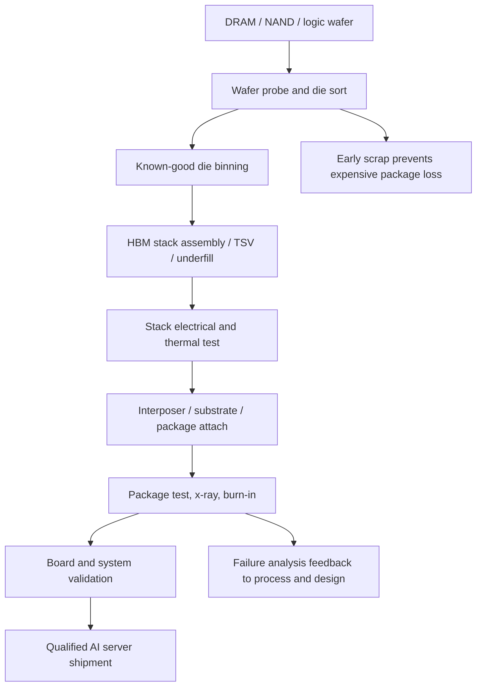
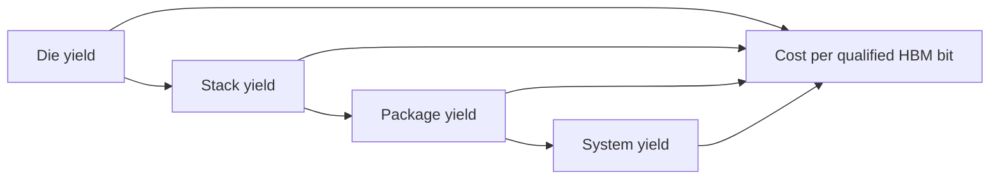

# Testing Equipment: Advantest, Teradyne, HBM Known-Good-Die, And AI Package Validation

Testing is the least glamorous bottleneck in the AI memory stack, but it is one of the most economically important. HBM does not sell as raw DRAM wafer output. It sells as qualified stacks, integrated packages, and customer-approved accelerator platforms. That means the supply chain must screen dies before stacking, test stacks after assembly, validate packages after interposer/substrate attach, and run system-level reliability screens before the GPU, ASIC, or TPU can ship. In 2026, as HBM4, 12-high and 16-high stacks, custom base dies, CoWoS-class packages, and high-capacity enterprise SSDs scale together, test equipment becomes a serial constraint rather than a generic back-end step.[^S059][^S089][^S206]

## Why Memory Test Is Different Now

Commodity DRAM and NAND testing already required high volume, tight cost-per-test, redundancy repair, speed binning, thermal screening, and endurance/reliability qualification. HBM changes the penalty function. A single bad die can impair a stack; a marginal stack can scrap a package with a very expensive logic die; and a package-level escape can become a field failure inside a high-value AI cluster. The cost of a false pass therefore rises with every layer of integration.

The HBM flow has at least four test gates. First, wafer probe screens DRAM die, base die, and repairable defects. Second, known-good-die logistics track die identity, bin, repair state, and stack eligibility. Third, stack test screens TSV connectivity, die-to-die links, thermal behavior, retention, repair behavior, and high-speed interface quality. Fourth, package and system test validate the assembled accelerator under power, thermal, signal-integrity, firmware, and workload conditions. None of those gates can be skipped merely because wafer output is high.

## Advantest And The Memory ATE Center

Advantest is one of the central names in semiconductor automatic test equipment. Public company summaries describe it as a Japanese integrated-circuit testing equipment manufacturer founded in 1954, based in Tokyo, with memory, SoC, RF test systems, handlers, device interfaces, SEM metrology/review, and SSD test systems in its portfolio.[^S213] The same summary lists three reportable areas: semiconductor and component test systems, mechatronics handlers, and services/support.[^S213] That breadth matters because HBM test is not a single tester sale. It needs tester, probe interface, handler, thermal control, device interface board, diagnostic software, field support, and customer-specific validation flow.

Advantest's strategic role is strongest where memory complexity and high-speed parallelism meet. HBM4 widens the interface, increases per-stack bandwidth, and raises stack-height complexity. Micron's March 2026 HBM4 announcement described greater than 2.8 TB/s per stack, more than 11 Gb/s pin speeds, 36GB 12-high production, and 48GB 16-high customer samples.[^S059] Those numbers translate directly into tester burden: more lanes, tighter signal integrity, more thermal states, more repair/diagnostic data, and longer characterization time before a part is trusted in an accelerator platform.

The test bottleneck is also a utilization problem. A tester can be fully booked even if wafer output is expanding, because HBM stack and package test time rises with product complexity. If suppliers add HBM wafer starts without parallel test capacity, known-good-die inventory piles up before stack assembly or finished stacks wait for package qualification. This is why the HBM roadmap file treats high-speed test and KGD logistics as a distinct layer between front-end DRAM capacity and customer allocation.

## Teradyne And The Broader ATE Basket

Teradyne is the second key ATE reference. Investor's Business Daily reported on June 9, 2026 that Teradyne makes automated electronics testing equipment used in semiconductor, data-center, photonics, data memory and storage, and aerospace/defense industries, and that it makes high-performance test products for DRAM devices used in 5G, AI, cloud computing, and autonomous vehicles.[^S211] The same report said Teradyne's Q1 profits jumped 241% year over year to $2.56 per share, revenue rose 87% to $1.283 billion, and roughly 70% of revenue was tied to AI infrastructure.[^S211]

MarketWatch coverage on February 3, 2026 said Teradyne posted Q4 revenue of $1.08 billion and adjusted EPS of $1.80, ahead of analyst expectations, and issued a Q1 forecast of $1.15 billion to $1.25 billion revenue and $1.89 to $2.25 adjusted EPS; it also said the results reflected AI-related demand in compute, networking, and memory.[^S212] That matters for the memory database because test demand is not limited to HBM stacks. AI accelerators pull test demand across compute dies, HBM stacks, networking silicon, retimers, optical components, and storage controllers.

Teradyne's role should be modeled as broader semiconductor test exposure rather than only HBM. It benefits when AI systems add more complex logic, networking, RF/SerDes, photonics, storage, and memory test requirements. It also competes for customer capex with Advantest in some tester classes. If customers second-source test capacity or shift platform-specific testing across vendors, Teradyne can participate even when Advantest remains the most visible memory/HBM ATE name.

## Pin Electronics, Power, And Tester Subcomponents

ATE vendors do not build every critical component alone. Analog Devices has become a useful window into the tester subcomponent layer. Investor's Business Daily reported on May 15, 2026 that ADI's data-center and automated test equipment businesses together were running at more than $2 billion annually, about 20% of total revenue; it said ATE represented roughly 40% of that bucket, and that ADI sells pin electronics, device power supplies, and parametric measurement units inside complex testers from Teradyne and Advantest.[^S214] The article also reported that ADI's content per tester runs into the tens of thousands of dollars and that the ATE business grew about 40% in fiscal 2025.[^S214]

That subcomponent detail matters. HBM and AI package test stress power delivery, precision measurement, timing, high-speed digital channels, thermal control, and parametric characterization. A shortage in tester pin electronics, power modules, device interface boards, probe cards, or thermal heads can delay capacity even if the final ATE vendor has demand. Test capacity is therefore a layered supply chain, not a single line item.

## Back-End Equipment Growth

The macro test-equipment signal is strong. Tom's Hardware, citing SEMI, reported in early 2026 that semiconductor manufacturing equipment sales were forecast to rise from $133 billion in 2025 to $145 billion in 2026 and $156 billion in 2027, driven by AI accelerators, infrastructure, and China self-sufficiency.[^S215] The same report said chip test equipment revenue was forecast to jump 48.1% to $11.2 billion in 2025, followed by growth of 12% in 2026 and 7.1% in 2027.[^S215] It also tied memory equipment demand to DRAM/HBM scaling and 3D NAND layer growth.[^S215]

That forecast explains why test equipment belongs in the semicap ecosystem section rather than only in a manufacturing-process appendix. The market is expanding because AI systems require more expensive validation per shipped package. A Blackwell, Rubin, MI300/MI400, TPU, or custom ASIC package can contain multiple high-value dies, HBM stacks, substrates, retimers, and board-level interconnect. Each extra element adds a test vector and a failure mode.

## HBM Known-Good-Die Economics

Known-good-die discipline is the core of HBM economics. Before stacking, DRAM dies must be tested, repaired, binned, and assigned into stack builds. After stacking, the cube must pass functional, speed, thermal, and reliability screens. A 12-high or 16-high stack magnifies die-level defect probability, so the economic value of catching marginal die early increases. The flow is closer to aerospace reliability logic than commodity component sampling: the part is expensive, the downstream package is expensive, and late failures are costly.

The test strategy also changes with custom base dies. HBM4 and HBM4E move more logic and customer-specific behavior into the base-die layer. That can improve performance and integration, but it creates more test states: memory array behavior, TSV paths, base-die logic, PHY, repair tables, thermal sensors, RAS features, and customer-specific command behavior. The more custom the base die, the less useful generic standard test becomes. Platform-aware vectors and customer qualification loops become part of the supply relationship.

## Package And System Test

The OSAT file covered x-ray and package inspection; testing equipment extends that into electrical validation. A June 2026 arXiv CoWoS x-ray paper argued that 2.5D/3D packages introduce nondestructive metrology challenges because complex three-dimensional structures are hard to inspect and require AI-integrated design-of-experiment methods to improve defect detection.[^S206] Electrical test has the same problem in another domain: the package is too complex for one pass/fail screen to prove long-term behavior.

Package test must cover signal integrity, power integrity, thermal gradients, interposer routing, substrate behavior, HBM-to-logic links, high-speed SerDes, and board attach. System-level test then adds firmware, workload behavior, NVLink or other fabric links, cooling solution, rack integration, and RAS telemetry. The test flow must decide how much to catch at wafer probe, stack test, package test, board test, and system burn-in. Moving too much test late saves early test time but risks scrapping expensive assemblies. Moving too much test early can bottleneck die flow and increase cost.

## Probe Cards, Interfaces, And Thermal Hardware

The tester is only one element of the insertion. Wafer probe requires probe cards that can contact dense pads repeatedly without damaging the die or corrupting measurements. HBM and advanced DRAM raise the difficulty because die are thin, repair data must be captured, and the customer cares about behavior across speed, voltage, and temperature corners. The probe-card and device-interface-board ecosystem therefore becomes part of HBM capacity even though it rarely appears in fab-capex headlines.

Device interface boards and sockets are equally important after stacking. A package-test setup must deliver clean power, preserve signal integrity, control impedance, remove heat, and expose enough diagnostic observability to distinguish die, stack, package, board, and firmware failures. If the interface board has marginal power or signal behavior, it can create false failures; if it is too forgiving, it can miss marginal product. That is why ADI's pin electronics, device power supplies, and parametric measurement units inside Advantest and Teradyne testers are not commodity components.[^S214]

Thermal hardware is another underappreciated capacity item. HBM stacks and AI packages need screening across realistic operating temperatures, and liquid-cooled accelerator modules may behave differently from air-cooled validation fixtures. Burn-in can expose infant mortality and marginal interconnects, but it consumes time, chambers, handlers, power, and floor space. A supplier can own enough electrical testers and still be short thermal-control capacity. In HBM4/HBM4E, where stack height and per-stack bandwidth rise together, thermal test becomes part of the product ramp rather than a downstream quality ritual.[^S059]

## Test-Time Economics

Test time is a hidden margin lever. The cost of test is roughly driven by tester depreciation, handler/probe/thermal equipment, floor space, operators, consumables, device interface hardware, yield, retest rate, and seconds per unit. HBM increases several of those variables simultaneously: more electrical channels, more operating modes, more thermal states, more repair data, and higher consequences for a false pass. Test suppliers benefit from that complexity, but memory suppliers must constantly decide which screens are worth the time.

The optimization problem is not simply "test more." Excessive testing can slow shipments and tie up high-cost ATE. Insufficient testing can push defects into stack assembly or package integration, where scrap cost is far higher. The best flows use earlier, cheaper screens to eliminate obvious failures, then reserve the most expensive high-speed, thermal, and system-level tests for units that have a realistic chance of shipping. That makes data traceability critical: die history, stack history, repair maps, assembly lot, package lot, test vectors, and field telemetry should close the loop.

This is where AI-package test becomes a software problem. Test programs must evolve with firmware, RAS features, memory repair policies, and platform workloads. A stack that passes a generic electrical test may still fail under a customer workload that stresses a specific access pattern, temperature gradient, or repair mode. The more customized HBM becomes, the more test recipes become part of the customer relationship.

## SSD And NAND Test

HBM gets the attention, but NAND and SSD testing are also becoming richer. Enterprise SSDs for AI storage need endurance modeling, firmware validation, power-loss behavior, latency-tail characterization, QoS, thermal throttling, security features, and controller/NAND pairing validation. The market-share tracker noted that enterprise SSDs were reported at 40% of the NAND market in Q1 2026 and forecast to exceed 60% by year-end 2026.[^S022] That mix shift turns NAND test from low-cost volume screening into data-center reliability qualification.

3D NAND layer scaling also stresses wafer-level and package-level test. Higher layer counts create vertical string variability, staircase-contact defects, retention spread, read-disturb behavior, and endurance distribution. Controllers hide many defects through ECC and firmware, but hyperscale SSD qualification still needs confidence that the device behaves under sustained AI storage workloads. That pulls demand for NAND testers, SSD testers, thermal chambers, firmware validation rigs, and telemetry-driven failure analysis.

## Competitive Dynamics

The tester market benefits from customer fear. AI customers will pay for test capacity because the cost of failure is high and the launch cadence is tight. Advantest is levered to memory/HBM and SoC test; Teradyne has broader semiconductor and system-test exposure; ADI and other component vendors participate inside tester bills of materials; KLA, Onto, and x-ray/metrology vendors overlap where inspection becomes part of test correlation.[^S203][^S214]

The key risk is cyclicality. Test equipment demand can rise quickly when a new HBM or AI accelerator platform ramps, then digest when the installed base catches up. The long-term bull case is that HBM4/HBM4E, custom base dies, multi-chiplet accelerators, co-packaged optics, and high-capacity SSDs keep test intensity rising faster than unit volume. The bear case is that customers overbuy testers during shortage, then utilization falls when platform transitions slow.

## KPI Watchlist

Track Advantest and Teradyne memory-test order commentary, tester lead times, installed-base utilization, and customer concentration. Track HBM stack-height transitions from 8-high to 12-high and 16-high, because each transition raises KGD and stack-test burden.[^S059] Track package-test utilization at OSATs and foundry-owned advanced packaging lines. Track probe-card and device-interface-board supply, because they can bottleneck test insertion. Track system-level burn-in and thermal-screen capacity, especially for liquid-cooled accelerator platforms. Track SSD qualification cycle time for enterprise QLC/TLC drives, because AI storage demand can absorb NAND output without immediately translating into qualified drives.

The cleanest investment frame is that test is the tax paid to convert complexity into sellable yield. When HBM, CoWoS, EMIB, chiplets, optics, SSD controllers, and AI racks become more complex, the tax rises. The best test suppliers capture that tax; the customers pay it because the alternative is late discovery of failures in packages or systems that are too expensive to scrap casually.

## Database Links

This file connects [03-hbm-deep-dive/01-hbm-fundamentals.md](../03-hbm-deep-dive/01-hbm-fundamentals.md), [03-hbm-deep-dive/03-hbm-vendor-roadmaps.md](../03-hbm-deep-dive/03-hbm-vendor-roadmaps.md), [07-semicap-ecosystem/02-substrate-interposer-osat.md](02-substrate-interposer-osat.md), and [08-manufacturing-process/03-hbm-packaging-process-flow.md](../08-manufacturing-process/03-hbm-packaging-process-flow.md). The central link is simple: HBM supply is not real until it is tested, qualified, packaged, and accepted by the platform customer.

## Sources

[^S022]: NAND flash makers earned a record $46 billion in revenues over the first quarter of 2026, PC Gamer, published 2026-06-03, https://www.pcgamer.com/hardware/ssds/nand-flash-makers-earned-a-record-usd46-billion-in-revenues-over-the-first-quarter-of-2026-a-shocking-3-5-times-more-than-last-year/
[^S059]: Micron enters high-volume production of HBM4 for Nvidia Vera Rubin, Tom's Hardware, published 2026-03-16, https://www.tomshardware.com/pc-components/dram/micron-enters-high-volume-production-of-hbm4-for-nvidia-vera-rubin
[^S089]: Nvidia reportedly cancels quad-die Rubin Ultra GPU in favor of dual-GPU design, Tom's Hardware, published 2026-06-30, exact day inferred from relative publication age, https://www.tomshardware.com/tech-industry/artificial-intelligence/nvidia-reportedly-cancels-quad-die-rubin-ultra-gpu-in-favor-of-dual-gpu-design-report-claims-complex-design-purportedly-scrapped-over-manufacturing-execution-concerns
[^S203]: Products, KLA, Accessed 2026-07-06, no stable page publish date listed, https://www.kla.com/products
[^S206]: Design Guidelines for In-line X-ray Inspection in Advanced Packaging Technology: A CoWoS Case Study, arXiv, published 2026-06-24, https://arxiv.org/abs/2606.26430
[^S211]: Chip Testing Stock Sees More Red, Yet Wall Street Has High Profit Hopes, Investor's Business Daily, published 2026-06-09, https://www.investors.com/research/chip-robotics-company-semiconductor-memory-testing-teradyne-stock-ter/
[^S212]: Teradyne's stock soars after this 'absolute blowout' forecast that was fueled by AI, MarketWatch, published 2026-02-03, https://www.marketwatch.com/story/teradynes-stock-soars-after-this-absolute-blowout-forecast-that-was-fueled-by-ai-2dfc3d8a
[^S213]: Advantest overview, Wikipedia, Crawled 2025-11, no stable page publish date listed, https://en.wikipedia.org/wiki/Advantest
[^S214]: Why This 60-Year-Old Chipmaker's Stock Just Hit A Record High, Investor's Business Daily, published 2026-05-15, https://www.investors.com/research/the-new-america/analog-devices-artificial-intelligence-data-centers/
[^S215]: Sales of chip production equipment to reach $156 billion by 2027, Tom's Hardware, published 2026-01, exact day not captured in accessed search result, https://www.tomshardware.com/tech-industry/semiconductors/sales-of-chip-production-equipment-to-reach-usd156-billion-by-2027-china-taiwan-and-korea-lead-intense-demand
