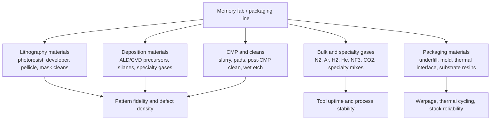
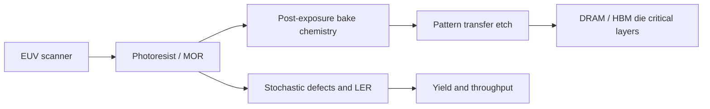

# Materials And Chemicals: Photoresists, Slurries, Gases, Precursors, Cleans, And Packaging Materials

Materials are the memory supply chain's quiet multiplier. A fab can have ASML scanners, Lam etchers, Applied deposition tools, KLA inspection, Advantest testers, and CoWoS capacity, but it still cannot run without ultra-pure gases, photoresists, developers, CMP slurry and pads, ALD/CVD precursors, cleans, wet etchants, filtration, wafer carriers, underfill, mold compounds, thermal interface materials, and substrate materials. In 2026, the materials question is no longer only "can the fab buy chemicals?" It is whether the material supplier can co-develop formulations fast enough for EUV DRAM, high-layer NAND, HBM packaging, and AI accelerator packages without creating contamination, yield, or geopolitical bottlenecks.[^S216][^S217][^S220]

## Materials Map

| Materials bucket | Representative suppliers | Memory linkage |
|---|---|---|
| Photoresists and developers | JSR, Tokyo Ohka Kogyo, Shin-Etsu, DuPont/Qnity, Merck/EMD | EUV/DUV patterning for DRAM, logic base dies, masks, and critical layers. |
| CMP slurry and pads | Entegris/CMC Materials, DuPont/Qnity and peers | DRAM contacts, NAND stacks, interconnect, hybrid bonding surfaces, wafer thinning. |
| Deposition precursors | Entegris, Merck, Air Liquide, Linde, Soulbrain/SK Materials class suppliers | ALD/CVD films, high-k dielectrics, metals, liners, barriers, NAND layers. |
| Wet cleans and etchants | Entegris, Kanto, Stella, Solvay and regional chemical suppliers | Particle removal, post-etch clean, post-CMP clean, surface prep for bonding. |
| Bulk and specialty gases | Air Liquide, Linde, Air Products, SK Materials, Taiyo Nippon Sanso | Lithography, etch, deposition, purge, cooling, cleanrooms, packaging/test plants. |
| Packaging materials | Namics/Resonac, Henkel, Ajinomoto, 3M, DuPont/Qnity and substrate ecosystem | Underfill, mold, TIM, ABF/build-up resin, warpage and thermal reliability. |

## Entegris And Process Materials Breadth

Entegris is a useful anchor because it combines chemicals, filtration, fluid management, wafer handling, graphite/silicon-carbide components, and contamination control. Its product catalog lists chemistries including post-CMP cleaning solutions, post-etch cleaning solutions, ALD/CVD precursors, slurries, silanes, specialty gases, gas filtration and purification, liquid filtration and purification, reticle handling, wafer processing, CMP cleaning brushes, CMP pads, and FOUPs.[^S216] That breadth is exactly what memory fabs need: a material is not only a chemical formula; it is storage, delivery, filtration, particle control, compatibility, and analytical support.

The current demand signal is AI-linked. Investor's Business Daily reported on April 30, 2026 that Entegris earned adjusted EPS of $0.86 on revenue of $811.9 million in Q1 2026, beating expectations, with earnings up 28% and sales up 5% year over year.[^S217] The report quoted CEO Dave Reeder saying semiconductor demand continued to improve despite geopolitical tension, driven by accelerating AI-related demand and strengthening order patterns across Entegris' portfolio.[^S217] A February 2026 IBD report added that Entegris' materials solutions segment includes chemical vapor and atomic layer deposition materials, CMP slurries and pads, ion-implantation specialty gases, formulated etch and clean materials, and other specialty materials.[^S218]

For memory, Entegris' leverage rises with process complexity. DRAM scaling needs cleaner high-k, metal, contact, and CMP steps. NAND layer scaling needs stable deposition, etch, clean, and slurry behavior across very tall stacks. HBM and advanced packaging need underfill-adjacent cleanliness, wafer handling, temporary-bond/debond compatibility, and package process control. A material excursion that looks small in chemistry terms can become a yield excursion across millions of cells or an HBM stack reliability problem.

## Photoresist And EUV Materials

Photoresist is one of the highest-leverage materials categories because it couples directly to lithography throughput, pattern collapse, stochastic defects, line-edge roughness, and etch transfer. In May 2026, Tom's Hardware reported that JSR, which controls roughly one-fifth of the global photoresist market, planned its first Taiwan production facility to supply and co-develop advanced photoresists with TSMC, with the plant targeted as early as 2028.[^S220] The same report said Tokyo Ohka Kogyo and Shin-Etsu already operate Taiwan production facilities, that Japanese companies collectively hold around 80% of the global photoresist market, and that they dominate the high-end EUV segment almost entirely.[^S220]

The JSR Taiwan plan matters beyond TSMC logic. Advanced DRAM and HBM base-die logic use increasingly demanding lithography layers, and memory companies are aligning with EUV process ecosystems. A resist supplier close to the customer can iterate faster because resist, exposure dose, post-exposure bake, developer, etch chemistry, and process control are tuned together. The article said JSR currently ships samples from Japan, the U.S., and Belgium to Taiwanese customers, slowing iteration versus competitors with local production.[^S220]

Metal-oxide resist is the frontier. The same JSR report said JSR is building the world's first production-scale metal oxide resist facility in South Korea, with mass production expected in 2026 to supply Samsung and SK hynix, and that JSR acquired Inpria in 2021.[^S220] Imec's February 2026 work showed why MOR matters: increasing oxygen concentration in the EUV post-exposure bake chamber from atmospheric levels to 50% improved MOR photo-speed by 15-20%, which could lower EUV dose, raise throughput, and reduce exposure cost if industrialized.[^S221] For memory, that is a materials-throughput lever. EUV tool count is scarce; a faster resist process can act like incremental scanner capacity.

## CMP, Cleans, And Surface Prep

CMP is not just planarization; it is a materials-controlled yield step. DRAM contacts, interconnect layers, NAND stack integration, wafer bonding, and advanced packaging surfaces all depend on flatness, dishing control, erosion control, defect removal, and post-CMP clean chemistry. Entegris' catalog explicitly includes slurries, CMP pads, CMP cleaning brushes, post-CMP cleaning solutions, and post-etch cleaning solutions.[^S216] That category became more strategic after Entegris bought CMC Materials, because slurry, pad, clean, filtration, and delivery can be optimized as one process stack.[^S218]

Hybrid bonding and CBA-like NAND flows raise the bar. Surface particles, copper dishing, dielectric erosion, and wafer bow can turn into bonding defects or latent reliability failures. The packaging evolution file already treated hybrid bonding as wafer-fab-like rather than traditional assembly; the materials implication is that cleans, CMP, and surface chemistry become package-enabling technologies. A memory vendor may describe a new CBA or hybrid-bonded process as an architecture, but it only works if surfaces are flat, clean, chemically compatible, and stable under thermal cycling.

## Materials Pure Plays And Qnity

The materials universe is not only Entegris. MarketWatch reported on January 31, 2026 that Entegris and Qnity Electronics were viewed as materials-oriented ways to play the AI chip boom, with products ranging from specialty chemicals to wafer transport equipment required in chip manufacturing.[^S219] The same report said Qnity and Entegris were exposed to advanced packaging, higher-end chemicals, co-development relationships with leading chipmakers, and accelerating demand for logic and memory chips supporting AI deployment.[^S219] That framing is useful because memory investors often model WFE tool vendors carefully while treating materials as a generic gross-margin line.

Qnity is the separated electronics-materials platform associated with DuPont's semiconductor materials assets, and it matters because it sits in the same "materials attach" bucket as resists, CMP, dielectric materials, thermal materials, and package materials. The exact supplier list varies by process and customer, but the investable principle is stable: the more layers, interfaces, and package surfaces a memory product adds, the more opportunities there are for materials content to rise per wafer or per package. A conventional DDR die and an HBM4 package may start from related DRAM wafers, but the HBM path pulls more underfill, thermal, substrate, carrier, interface, and package-reliability materials.

The pure-play risk is cyclicality. Materials companies do not escape memory cycles; if wafer starts fall, consumable demand falls. Their offset is content-per-wafer and qualification stickiness. A qualified slurry, resist, precursor, or underfill can remain designed into a process for years because the replacement cost is high and the defect risk is asymmetric. This is why co-development proximity, local manufacturing near TSMC/Samsung/SK hynix, and field engineering can be as important as nominal chemical capacity.[^S219][^S220]

## Bulk And Specialty Gases

Gases are infrastructure, consumable, and risk factor at the same time. Nitrogen, argon, hydrogen, helium, oxygen, carbon dioxide, silanes, fluorinated etch/clean gases, and specialty mixtures feed lithography, deposition, etch, purge, cooling, cleanroom, and packaging processes. A gas supplier's role is not only bulk volume; it includes onsite plants, purification, cylinder logistics, safety systems, analytics, and long-term supply contracts.

Air Liquide's 2026 SK hynix agreement shows the direct AI-memory link. WSJ reported in June 2026 that Air Liquide would invest nearly EUR 200 million, about $232.6 million, in South Korea under a long-term agreement to supply gases to SK hynix's new chip packaging and testing facility in Cheongju, including construction and operation of a nitrogen production unit expected to start in late 2027.[^S222] That ties industrial gases directly to HBM packaging and test capacity rather than only front-end wafer fabs.

Helium shows the fragility of the materials chain. Tom's Hardware reported in April 2026 that Air Liquide opened a Taiwan helium facility amid a global helium shortage linked to Middle East disruptions; it said helium is used in cooling, lithography, and cleaning processes, has no effective substitute for many chip-manufacturing uses, and that around 200 specialized helium containers were stranded near the Strait of Hormuz.[^S223] The report added that semiconductor manufacturers can keep only about six weeks of helium reserve because of cryogenic storage constraints.[^S223] That is exactly the kind of non-obvious constraint that can prioritize AI chips over lower-margin electronics.

## Purity, Delivery, And Water

The materials constraint is usually purity before volume. A chemical that is adequate for a mature industrial process may be unusable in leading-edge memory because parts-per-trillion contamination, metal ions, particles, moisture, or organic residue can change yield. Materials suppliers therefore sell a system: bulk chemical, purifier, filter, tubing, valve, container, analytical service, and field support. Entegris' product categories around gas filtration, liquid filtration, chemical delivery, fluid handling, concentration monitoring, particle characterization, FOUPs, and reticle handling show how much of materials economics is contamination control rather than only chemistry.[^S216]

Water is the silent carrier. DRAM and NAND fabs use ultrapure water for cleans, rinses, CMP, etch, and contamination control. The water itself is not usually a high-margin specialty chemical, but the filtration, delivery, analysis, and wastewater treatment ecosystem shapes fab uptime and permitting. Greenfield memory clusters in Idaho, New York, Yongin, Cheongju, Singapore, and Arizona can be delayed by utilities, including power and water, even if process tools are available. The materials file should therefore be read alongside the WFE file: a tool order is not productive until gases, chemicals, water, exhaust, abatement, and waste streams are qualified.

Waste and abatement are also becoming strategic. Fluorinated gases, solvents, acids, bases, slurry waste, metals, and photoresist residues all need environmental control. AI memory ramps can raise chemical throughput quickly, but local permitting and sustainability commitments can force suppliers to redesign delivery and recycling systems. This is another reason onsite gas and chemical infrastructure matters: local production can reduce logistics risk, but it also concentrates environmental and operational responsibility near the fab.

## Packaging Materials

HBM and advanced packaging convert materials into mechanical performance. Underfill and molded underfill manage stress, fill gaps, protect microbumps, reduce voids, and influence heat flow. Thermal interface materials move heat from stacked DRAM, base dies, interposers, and accelerators into heat spreaders and cold plates. Mold compounds and build-up substrate resins affect warpage, coefficient-of-thermal-expansion mismatch, moisture absorption, dielectric behavior, and long-term reliability.

The material stack is product-specific. SK hynix's Advanced MR-MUF public descriptions connect molded underfill to HBM stack height, thermal behavior, and package reliability.[^S003] CoWoS-like packages then add interposer attach, substrate resin, solder, flux, underfill, thermal materials, and board-level assembly. As HBM moves from 8-high to 12-high and 16-high, materials that were once package cost items become yield and performance determinants. If the underfill flow leaves voids, if the TIM pumps out, or if the substrate warps, the product fails even if the DRAM die is electrically excellent.

## Supply Chain And Geopolitics

Materials supply chains are regionally concentrated. Japan dominates high-end photoresist, Taiwan and South Korea need local co-development for leading-edge customers, U.S. and European suppliers dominate many specialty chemicals and gases, and China is trying to localize lower-end resists, gases, CMP, and wet chemicals under export-control pressure. The JSR report said Chinese firms have made inroads at KrF and i-line photoresist but remain limited at ArF and above, while Japanese suppliers dominate high-end EUV.[^S220] That maps closely to the China memory file: domestic suppliers can cover some mature steps faster than they can replace high-end lithography materials, advanced precursors, or contamination-control ecosystems.

There is also a qualification moat. A customer cannot swap a slurry, resist, gas, or underfill casually. The new material must pass tool compatibility, defectivity, electrical performance, reliability, storage, safety, environmental, and field-support gates. For HBM and advanced NAND, the qualification cost can be large enough that incumbency matters even when a challenger is cheaper. The commercial moat is often not a patent; it is the history of process windows, field data, and co-development trust.

## KPI Watchlist

Track EUV resist capacity and JSR/TOK/Shin-Etsu localization near TSMC, Samsung, and SK hynix. Track MOR adoption at Samsung and SK hynix, because MOR can improve EUV throughput and defectivity if it industrializes.[^S220][^S221] Track Entegris revenue and order commentary as a broad materials-cycle proxy, especially materials solutions and advanced purity.[^S217][^S218] Track helium and specialty-gas disruptions, including Air Liquide and Linde onsite investments near memory fabs and packaging plants.[^S222][^S223] Track CMP slurry, pad, and clean demand for CBA, hybrid bonding, high-layer NAND, and HBM packaging surfaces. Track packaging material performance in 12-high and 16-high HBM, especially underfill voids, thermal resistance, warpage, and moisture reliability.

The investment rule is that materials intensity rises when process windows narrow. DRAM node scaling, NAND layer scaling, HBM stack-height scaling, and CoWoS package scaling all narrow process windows simultaneously. Materials suppliers benefit when they sell differentiated chemistry, filtration, and co-development rather than interchangeable consumables. Memory suppliers benefit when materials remove variability before it becomes yield loss.

## Database Links

Read this file with [07-semicap-ecosystem/01-wafer-fab-equipment-vendors.md](01-wafer-fab-equipment-vendors.md) for tool context, [07-semicap-ecosystem/02-substrate-interposer-osat.md](02-substrate-interposer-osat.md) for package/substrate constraints, [08-manufacturing-process/01-dram-process-flow.md](../08-manufacturing-process/01-dram-process-flow.md) for DRAM process modules, [08-manufacturing-process/02-3d-nand-process-flow.md](../08-manufacturing-process/02-3d-nand-process-flow.md) for NAND etch/deposition/CMP context, and [08-manufacturing-process/03-hbm-packaging-process-flow.md](../08-manufacturing-process/03-hbm-packaging-process-flow.md) for underfill, thermal, and TSV-package materials.
