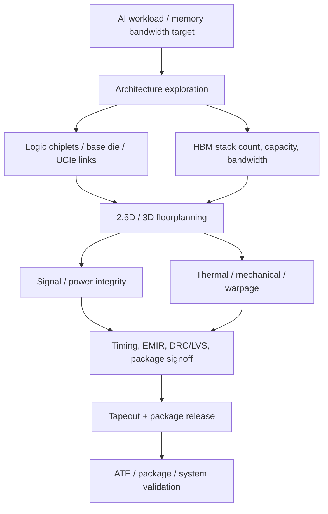
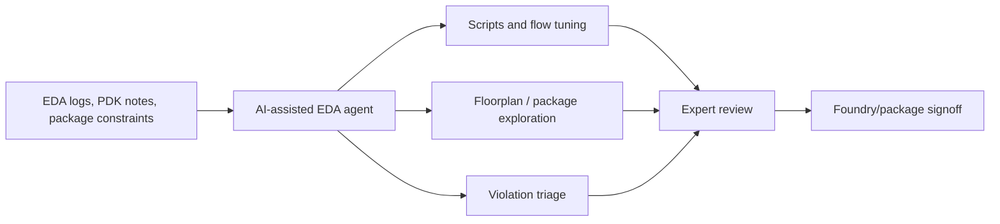
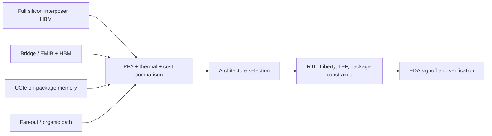

# EDA And Design Tools For Memory, HBM, Chiplets, And Advanced Packaging

EDA is the software layer that turns memory hardware into a buildable product. In conventional memory, EDA already mattered for DRAM periphery, sense amps, repair, timing, NAND controllers, ECC, firmware, and module validation. In AI memory systems, the role expands: the package floorplan, HBM interface, interposer or bridge routing, thermal model, power integrity, UCIe/SerDes links, base-die logic, firmware policy, and system-level workload behavior all need co-design before silicon exists. That makes EDA part of the semicap ecosystem rather than a software footnote. The leading commercial stack is dominated by Synopsys, Cadence, and Siemens EDA, with Ansys, Arteris, Silvaco, IP vendors, open-source tools, and internal hyperscaler/foundry flows filling specialized roles.[^S224][^S225][^S226]

## Why EDA Matters For Memory

The HBM generation file treats bandwidth as a specification; EDA turns that specification into a platform. A customer deciding between six, eight, or more HBM stacks must model package area, interposer wiring, power delivery, clocking, controller placement, cache hierarchy, tensor parallelism, thermal load, and yield exposure. A memory supplier offering HBM4 or custom HBM4E must provide PHY, controller, base-die behavior, repair/RAS policy, IBIS/AMI or equivalent models, package integration rules, and customer validation collateral. If the EDA collateral is weak, second sourcing becomes harder even if the DRAM die is excellent.

This is especially important for custom-HBM/base-die strategies. As HBM moves from standardized stack behavior toward accelerator-specific base-die functions, the boundary between memory vendor and accelerator designer blurs. The customer wants early models for latency, bandwidth, power, repair, telemetry, thermal response, and package routing. The memory vendor wants to avoid supporting every bespoke request as a one-off. EDA collateral is the contractual middle layer: it defines what can be simulated, verified, signed off, and tested.

## Vendor And Tool Map

| EDA / IP participant | Core role | Memory and packaging linkage |
|---|---|---|
| Synopsys | Digital implementation, verification, signoff, IP, AI-assisted flows | HBM/DDR PHY and controller IP, multi-die signoff, verification, DSO.ai-type optimization. |
| Cadence | Digital/analog/custom IC, verification, Sigrity/Palladium/thermal/electromagnetics, IP | Package/PCB signal integrity, power integrity, chiplet/package co-design, memory interface validation. |
| Siemens EDA | Calibre, Tessent, Questa, Veloce, HyperLynx, Xpedition, Solido | Physical verification, test/yield, hardware emulation, package/PCB analysis. |
| Ansys | Thermal, electromagnetic, power integrity, mechanical and multiphysics simulation | CoWoS/EMIB thermal, interposer/package power and signal integrity, system cooling. |
| Arteris / IP vendors | NoC, chiplet interconnect, system IP | Multi-die fabrics, UCIe-adjacent integration, AI accelerator data movement. |
| Open-source / academic EDA | Architecture exploration, floorplanning, thermal, automation | Early-stage 2.5D/3D research, China localization, AI-assisted backend flow experiments. |

Synopsys is a useful anchor for scale. Public summaries describe it as supplying tools and services for semiconductor design and manufacturing, including digital and analog implementation, simulators, debug environments, and reusable semiconductor IP; they also state that Synopsys, Cadence, and Siemens EDA collectively dominated roughly 75% of the global EDA market as of 2024.[^S224] Cadence is similarly broad, with products for chip, chiplet-style product, PCB, hardware verification, IP, electromagnetics, thermal, and computational fluid dynamics workflows.[^S225] Siemens EDA, via Mentor, contributes Calibre physical verification, Tessent silicon test and yield analysis, Veloce hardware-assisted verification, Questa simulation/formal, HyperLynx/Xpedition package and PCB tools, and analog/mixed-signal tools.[^S226]

## HBM Interface IP And Verification

HBM is an interface and verification problem as much as a DRAM-stack problem. A stack can offer terabytes per second of bandwidth, but the accelerator must place controllers, arbitrate channels, balance traffic across stacks, handle refresh, repair, ECC/RAS, telemetry, and thermal throttling. Interface IP providers therefore matter because a PHY/controller implementation can determine whether the package reaches usable bandwidth or only data-sheet bandwidth.

Verification load rises with customization. HBM4 expands the stack interface to 2,048 bits in public JEDEC-era summaries, while HBM4E/custom HBM can add customer-specific base-die behavior. Each change creates more states for simulation, formal verification, emulation, firmware validation, and test. The design team must verify not only normal reads and writes, but training, low-power states, repair modes, thermal excursions, error injection, reset, firmware telemetry, and corner-case traffic patterns.

The connection to test is direct. Siemens Tessent-style silicon test and yield analysis, Synopsys/Cadence design-for-test flows, and Advantest/Teradyne ATE programs converge when the stack moves from simulation to silicon. A test vector is easier to write when the design flow exposes observability, controllability, repair data, and failure isolation. Poor EDA/test co-design can turn a hardware bug into an expensive package-level mystery.

## Memory Compilers, PHYs, And IP Collateral

Memory design tools also sit below the HBM headline. Logic designers need SRAM compilers, register-file generators, eFuse/OTP macros, ROMs, embedded NVM options, DDR/HBM/LPDDR/CXL controller IP, PHY IP, calibration firmware, timing libraries, Liberty views, signal-integrity models, and verification IP. A memory macro is not useful to a SoC team unless it arrives with timing, power, area, variation, DFT, BIST, repair, and reliability collateral that the rest of the flow accepts.

That collateral matters more as process nodes and packages specialize. A foundry SRAM macro on a 3 nm or 2 nm node has different voltage, leakage, yield, and variation behavior than a mature-node SRAM macro used for I/O or power-management logic. A custom HBM base die may need customer-specific telemetry and repair modes that connect to firmware and system management. An AI accelerator with UCIe memory chiplets needs interface models that preserve enough physical detail to predict power and latency but enough abstraction to let architects iterate quickly. The commercial value of EDA/IP vendors is therefore partly in creating reusable trust: the customer believes the model will correlate with silicon.

Memory compilers are also yield-management tools. If the compiler exposes redundancy, repair, ECC, built-in self-test, retention modes, and voltage corners correctly, the design team can trade area for yield and power. If the compiler hides too much, the team discovers yield or timing problems late. In high-value AI packages, late discovery is expensive because one repair-policy issue can propagate from die yield into stack yield, package yield, and field reliability.

## AI-Assisted EDA

AI-assisted EDA is becoming a workflow layer, not only a marketing term. Public Synopsys summaries describe Synopsys.ai tools such as DSO.ai for design-space optimization, VSO.ai for verification, TSO.ai for test optimization, and ASO.ai for analog circuit design, with reinforcement-learning-like optimization around power, performance, and area and broader attempts to automate debugging and repetitive engineering work.[^S224] Even if productivity claims vary by customer, the direction matters: design complexity is outgrowing linear headcount growth.

For memory and packaging, AI-assisted EDA can help in three places. First, it can search package floorplans, HBM stack placements, and UCIe link configurations under power/thermal constraints. Second, it can optimize implementation and verification scripts that currently depend on senior engineers' tacit knowledge. Third, it can mine logs, DRC/LVS errors, timing violations, and simulation failures to accelerate closure. The risk is overtrust: an AI assistant can suggest a legal-looking script or floorplan that passes an intermediate check but fails signoff correlation. Therefore, AI EDA should be viewed as an accelerator for expert workflows, not a substitute for physical signoff.

## DFM, Yield, And Signoff Closure

Design-for-manufacturing is where EDA connects back to semicap. KLA can inspect defects and Applied/Lam/TEL can tune process steps, but the design must also respect patterning, density, spacing, thermal, and reliability rules. In memory systems, DFM spans DRAM die, base die, interposer, substrate, and board. A routing choice that is legal on a die can be poor at the package level because it creates power noise, thermal coupling, or escape-routing stress.

Calibre-like physical verification, parasitic extraction, EMIR analysis, power-integrity simulation, thermal simulation, and package DRC are therefore part of the memory capacity story. If signoff rules are too loose, silicon fails. If rules are too conservative, customers overdesign, leaving performance or area unused. Better EDA can release guardband only when it correlates with silicon, package test, and field data. The June 2026 firmware/3.5D co-optimization paper's claim of potential guardband reduction is interesting for that reason, even though the authors explicitly note that silicon validation is pending.[^S229]

## 2.5D/3D Architecture Exploration

The industry still lacks perfect early-stage tools for chiplet and package architecture. A May 2026 arXiv paper, CLIPGen, argued that advanced 2.5D systems-in-package increasingly depend on packaging and interconnect choices, but architects often face a gap between inflexible detailed models and overly abstract models that cannot guide architecture decisions.[^S227] CLIPGen generates chiplet link IP models and standard collateral including Verilog, Liberty, LEF, and datasheets, and its case study explored UCIe interfaces across packaging options.[^S227]

That is precisely the problem facing AI memory architects. A decision to use HBM, on-package LPDDR, UCIe-attached memory, EMIB bridges, CoWoS interposers, or organic-substrate paths cannot be postponed until physical design. The package choice affects bandwidth density, latency, power, area, cost, cooling, yield, test, and board design. Early exploration tools that generate credible power/performance/area and physical collateral can reduce the chance that a promising architecture dies when package realities arrive.

## Thermal, Power, And Mechanical Co-Design

Thermal modeling is now part of memory architecture. A 2025 arXiv paper on 3D-ICE 4.0 argued that advanced 2.5D/3D heterogeneous chiplet systems have intricate heat paths and power densities that challenge traditional compact thermal models; it reported speedups of 3.61x-6.46x over state-of-the-art tools while reducing grid complexity by more than 23.3% without compromising accuracy.[^S228] Those claims matter because thermal simulation must run early enough to influence floorplan, not only late enough to diagnose a problem.

Process-induced performance degradation is another co-design frontier. A June 2026 arXiv paper on 3.5D heterogeneous packages modeled Intel-style Foveros Direct 3D, PowerVia, EMIB-T, UCIe, and HBM5 in a pre-silicon firmware co-optimization framework; it used thermal-electrical co-simulation over a 90,000-step LLM inference dataset and reported a thermal-load correlation of R2 = 0.9911, plus projected 20-30% released compute and 65-68% EDA guard-band reduction, while noting silicon validation was still pending.[^S229] Even if those projections are research-stage, the point is important: firmware, workload scheduling, voltage rails, thermal maps, HBM leakage, and package design are becoming one optimization surface.

For HBM platforms, thermal EDA affects stack count, stack placement, power caps, memory-controller policy, cooling design, and reliability guardbands. A package may be electrically routable but thermally unusable. It may pass average thermal limits but create local hot spots that hurt HBM retention or base-die timing. Signoff therefore needs multi-physics coupling: electrical, thermal, mechanical, and workload-aware behavior.

## UCIe And On-Package Memory

UCIe expands the memory design space beyond classic HBM. A 2025 arXiv paper proposed on-package memory using Universal Chiplet Interconnect Express with memory semantics, either by reusing LPDDR6/HBM through a logic die connected to the SoC over UCIe or by having a DRAM die natively support UCIe.[^S230] The paper reported approaches with up to 10x higher bandwidth density, up to 3x lower latency, up to 3x lower power, and lower cost compared with existing HBM4 and LPDDR on-package memory solutions.[^S230]

The investment significance is not that UCIe memory immediately displaces HBM. It is that EDA and IP must support more memory-interface choices. Accelerator designers will compare HBM, custom HBM, SPHBM-like branches, LPDDR-on-package, UCIe memory chiplets, CXL memory, and HBF-like flash tiers. Each option needs models, controllers, PHYs, timing constraints, package rules, thermal behavior, and software/runtime hooks. The design toolchain becomes the platform where those tradeoffs are made.

## China And Open EDA

EDA is also geopolitical. May 2026 coverage reported that Peking University built a prototype EDA tool for Huawei's LogicFolding architecture, a "true-3D" flow that optimized multilayer chips as one vertical structure and showed early results including a 30% reduction in internal wire length, improved performance, and better thermal management versus conventional workflows.[^S231] The article said Huawei had presented LogicFolding at ISCAS 2026 as a path toward density comparable to 1.4 nm processes by 2031 without EUV, while also noting that Chinese EDA firms still trail Western suppliers in digital-flow tools for advanced nodes.[^S231]

That is directly relevant to memory. China can localize some device and package ideas, but advanced memory and AI accelerators require trusted EDA flows, foundry PDKs, physical verification, timing signoff, DFM, package co-design, and silicon correlation. A university prototype can prove a concept; commercial-grade EDA requires years of foundry data, tool integration, customer support, and signoff acceptance. For CXMT/YMTC and Chinese AI chip designers, EDA localization is therefore both an aspiration and a bottleneck.

Open-source EDA and AI-assisted flows add a second vector. IICPilot, a 2024 arXiv framework, used LLM-based agents to automate backend design tasks including script generation, EDA tool invocation, design-space exploration, container-based compute allocation, and exception management across tools such as OpenROAD and iEDA.[^S232] This will not replace signoff-grade commercial tools soon, but it can lower the experimentation barrier and accelerate domestic or academic design flows.

## KPI Watchlist

Track HBM PHY/controller IP availability for HBM4/HBM4E and customer-custom base dies. Track Synopsys, Cadence, and Siemens multi-die signoff announcements, especially tools that bridge die, interposer, substrate, package, and board. Track thermal and power-integrity tool adoption for CoWoS, EMIB, Foveros, and hybrid-bonded packages. Track UCIe memory semantics and whether on-package memory proposals move from papers into customer roadmaps.[^S230] Track China-local EDA progress in true-3D design, advanced-node physical verification, and package-aware signoff.[^S231]

The core risk is correlation. EDA tools are only as valuable as their silicon correlation. A thermal model, parasitic extraction, or timing signoff method that misses package reality can cause late respins, yield loss, or conservative guardbands. The core opportunity is the opposite: better EDA can release performance, reduce overdesign, shorten package iteration, and help customers choose the right memory tier before committing billions of dollars of wafers, HBM stacks, and packaging capacity.

## Database Links

This file connects [03-hbm-deep-dive/05-hbm-customer-ecosystem.md](../03-hbm-deep-dive/05-hbm-customer-ecosystem.md), [07-semicap-ecosystem/02-substrate-interposer-osat.md](02-substrate-interposer-osat.md), [07-semicap-ecosystem/03-testing-equipment.md](03-testing-equipment.md), [08-manufacturing-process/03-hbm-packaging-process-flow.md](../08-manufacturing-process/03-hbm-packaging-process-flow.md), and [09-research-frontier/02-hybrid-bonding-advanced-packaging.md](../09-research-frontier/02-hybrid-bonding-advanced-packaging.md). The shared theme is that memory architecture, physical design, packaging, test, firmware, and thermal behavior can no longer be optimized in separate silos.

## Sources

[^S224]: Synopsys overview, Wikipedia, Crawled 2026-06, no stable page publish date listed, https://en.wikipedia.org/wiki/Synopsys
[^S225]: Cadence Design Systems overview, Wikipedia, Crawled 2026-06, no stable page publish date listed, https://en.wikipedia.org/wiki/Cadence_Design_Systems
[^S226]: Siemens Digital Industries Software overview, Wikipedia, Crawled 2026-06, no stable page publish date listed, https://en.wikipedia.org/wiki/Siemens_Digital_Industries_Software
[^S227]: CLIPGen: A Chiplet Link IP Modeling and Generation Framework for 2.5D Architecture Exploration, arXiv, published 2026-05-26, https://arxiv.org/abs/2605.27757
[^S228]: 3D-ICE 4.0: Accurate and efficient thermal modeling for 2.5D/3D heterogeneous chiplet systems, arXiv, published 2025-12-05, https://arxiv.org/abs/2512.05823
[^S229]: Toward Mitigating Process-Induced Performance Degradation in 3.5D Heterogeneous Packages via Pre-Silicon Firmware Co-Optimization, arXiv, published 2026-06-24, https://arxiv.org/abs/2606.26176
[^S230]: On-Package Memory with Universal Chiplet Interconnect Express, arXiv, published 2025-10-07, https://arxiv.org/abs/2510.06513
[^S231]: Chinese university builds 3D chip design tool tailored to Huawei's LogicFolding architecture, Tom's Hardware, published 2026-05-28, https://www.tomshardware.com/tech-industry/semiconductors/peking-university-builds-3d-chip-design-tool-tailored-to-huaweis-logicfolding-architecture
[^S232]: IICPilot: An Intelligent Integrated Circuit Backend Design Framework Using Open EDA, arXiv, published 2024-07-17, https://arxiv.org/abs/2407.12576
