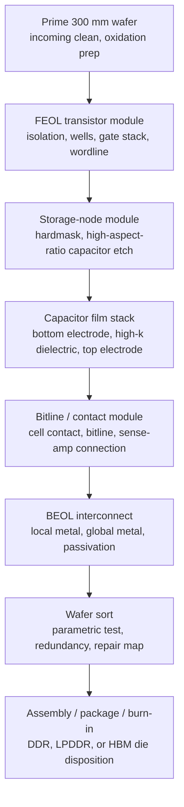
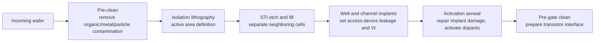
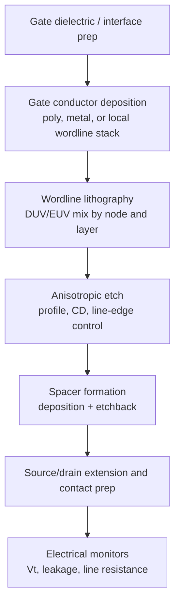
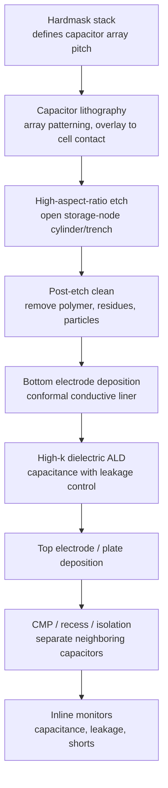
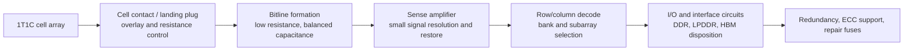
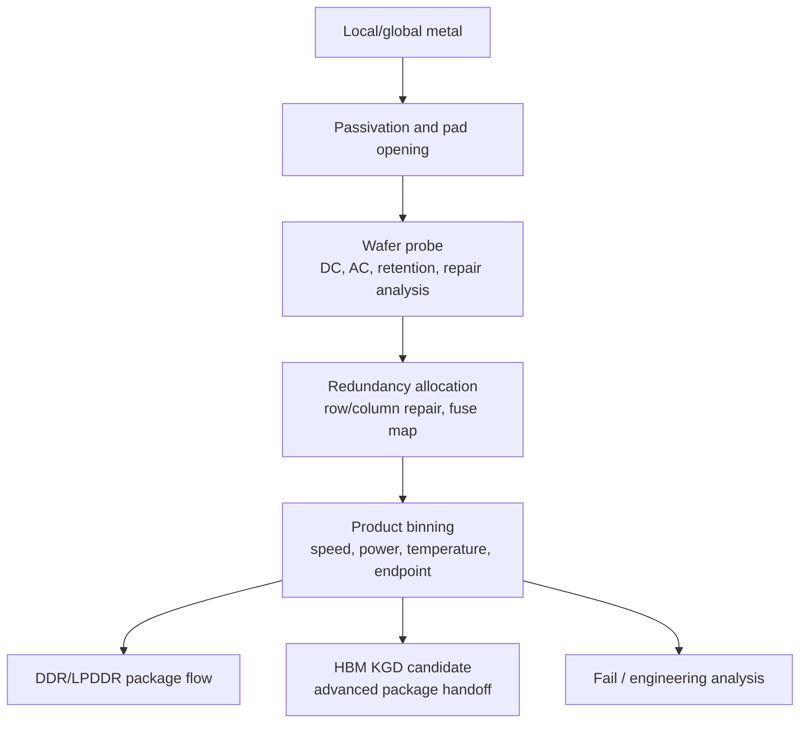
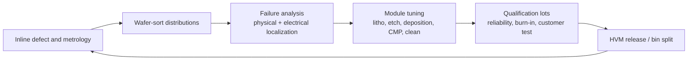

# DRAM Process Flow

DRAM manufacturing is a front-end process integration problem wrapped around one small analog storage device: the one-transistor, one-capacitor cell. The cell is simple in a circuit diagram, but the fab flow is not simple. A production DRAM die must pattern dense wordlines and bitlines, build an access transistor with tight leakage control, form a high-capacitance storage node in limited area, connect the array to sense amplifiers, and repeat those structures across a die large enough to amortize peripheral circuitry. Public summaries of DRAM still describe the basic memory cell as a capacitor plus MOS transistor, refreshed because capacitor charge leaks away, but leading-edge 2025-2026 DRAM economics are set by how well the fab executes lithography, high-aspect-ratio etch, conformal deposition, CMP, cleans, defect inspection, parametric test, and repair around that simple cell.[^S233][^S234]

The process flow below should be read with two cross-links in mind. The device-level definition of DRAM cells is in [01-overview/01-memory-storage-fundamentals.md](../01-overview/01-memory-storage-fundamentals.md), and the tool-vendor map is in [07-semicap-ecosystem/01-wafer-fab-equipment-vendors.md](../07-semicap-ecosystem/01-wafer-fab-equipment-vendors.md). This file focuses on the fab sequence: what has to happen to a wafer before it becomes a DDR5 die, an LPDDR die, or a known-good HBM stack candidate.

## Flow Economics

The high-level economic difference between DRAM and logic is that DRAM keeps a commodity cost-per-bit discipline even when the process is technically advanced. A logic SoC can spend die area on caches, accelerators, interconnect, and specialized IP if the product ASP supports it. Commodity DRAM cannot: every extra process step, mask, defect mode, or yield loss has to be paid back through bits shipped. That is why capacitor scaling, array efficiency, redundancy, and test time matter as much as headline node names. DRAM "10 nm class" naming is also not identical to foundry node naming; public process-node summaries describe 1x, 1y, 1z, 1a, 1b, and 1c-class DRAM as vendor node families rather than literal gate-length measurements.[^S041]

Advanced-node DRAM now sits in the same strategic equipment conversation as HBM. SK hynix's LPDDR6 announcement used its 10 nm-class 1c process and cited more than 10.7 Gbps operation plus more than 20% lower power than the prior LPDDR generation, while Samsung's HBM4 coverage linked the product to sixth-generation 10 nm-class DRAM and a 4 nm logic base die.[^S034][^S038] Micron's Manassas expansion shows the other side of the ledger: a DUV-based 1-alpha DRAM line can remain strategically valuable for DDR4-compatible, long-lifecycle customers even as AI-facing wafers move toward HBM, DDR5, LPDDR5X/6, and newer nodes.[^S035] In other words, "DRAM process flow" is not one universal route; it is a family of qualified routes with different lithography, design-rule, product, and packaging endpoints.

The production-control model is therefore staged. A memory vendor first locks the integration recipe for transistor leakage, capacitor capacitance, retention distribution, and array access time. It then transfers that recipe into a high-volume fab line with enough scanner, etch, deposition, CMP, metrology, and clean capacity. After wafers are built, die are sorted into bins: conventional DDR/LPDDR product, HBM-eligible die with tighter known-good-die requirements, engineering material, or scrap. The same wafer-start number can produce very different customer revenue depending on where that binning lands.

## Wafer Start And Isolation

The DRAM flow starts with prime silicon wafers, incoming inspection, cleaning, and well/isolation preparation. At 300 mm scale, the economic issue is not just the wafer; it is the number of good die per wafer after every lithography, etch, deposition, and CMP module has finished. Early defects are expensive because they are carried through the rest of the route. Particles from incoming wafer handling, buried crystal defects, oxide defects, or contamination in the first cleaning sequence can appear later as leakage tails or weak retention cells. The materials file's discussion of electronic-grade chemicals, gases, CMP consumables, and wet-clean purity is directly relevant here because DRAM arrays expose huge populations of nominally identical cells to the same contamination environment.[^S216][^S222][^S223]

Isolation defines where active devices can form. Shallow trench isolation, well implants, threshold-adjust implants, and anneals establish the transistor landscape before the storage capacitor is built. For DRAM, the access transistor is less glamorous than the capacitor, but it is often the hidden yield lever. Too much junction leakage, gate-induced drain leakage, or wordline coupling reduces retention margin. Too much series resistance damages access time. Too much process variation widens the distribution that refresh and ECC must cover. These device parameters feed directly into array timing and product binning.

The investor translation is that capacity ramp is not only a building or cleanroom question. A DRAM fab can have nominal wafer starts but still be short of saleable output if early isolation and device modules are not centered. KLA's inspection/metrology role, ASML/TEL lithography alignment, and Applied/Lam/TEL process modules all become part of the same yield ramp rather than separable procurement categories.[^S195][^S198][^S201][^S202][^S203]

## Wordline And Access Transistor

The access transistor and wordline module turns the prepared silicon into a selectable cell array. The wordline controls the transistor gate; when it is activated, the storage capacitor shares charge with the bitline and the sense amplifier resolves the cell state. Public DRAM references emphasize that reading a DRAM cell perturbs the stored charge and that the row is restored after sensing; that circuit behavior is why device leakage, capacitance, sense-amp offset, and refresh timing cannot be separated from process flow.[^S233][^S234]

At advanced DRAM nodes, lithography strategy is a direct cost and yield variable. ASML describes EUV systems as high-volume tools for advanced logic and memory, and the 2026 SK hynix EUV order was publicly tied to HBM and advanced DRAM capacity through December 2027.[^S196][^S197] That does not mean every DRAM layer uses EUV. Memory makers choose a mix of DUV, multiple patterning, and EUV based on mask count, overlay, stochastic defect risk, cycle time, and tool availability. The integration goal is not a trophy exposure layer; it is a repeatable array with enough overlay and critical-dimension control to keep access transistors, contacts, wordlines, and bitlines aligned across billions of cells.

The wordline module also creates a reliability baseline. A marginal gate stack can pass early parametric tests and still produce retention outliers after burn-in or temperature stress. A high-resistance wordline can limit activation timing. A gate-edge roughness problem can look like random leakage in a retention histogram. DRAM fab teams therefore monitor transistor distributions aggressively and feed that data into redundancy and repair decisions later in wafer sort.

## Storage Capacitor Module

The capacitor module is the signature DRAM process block. As lateral cell area shrinks, the capacitor must maintain enough capacitance for a sense amplifier to distinguish stored charge from noise, leakage, and coupling. Public DRAM summaries describe the historical transition from planar capacitors to stacked or trench structures, while public high-k, ALD, and deep-reactive-ion-etch references explain why conformal films and high-aspect-ratio pattern transfer became central to scaling three-dimensional capacitor structures.[^S233][^S235][^S236] The exact vendor recipes are proprietary, but the process logic is stable: create a tall, narrow storage-node structure; coat it conformally with electrode and dielectric materials; isolate it from neighbors; and connect it to the access transistor without destroying leakage or capacitance.

This is where Lam, Applied, TEL, and materials suppliers show up most directly. Lam's product positioning includes etch, deposition, strip/clean, and advanced memory structures with increasingly complex film stacks and high aspect ratios.[^S201] Applied's product library spans ALD, CVD, CMP, etch, implant, PVD, metrology/inspection, and other modules used around DRAM capacitor and interconnect integration.[^S199] TEL's portfolio covers deposition, etch, cleaning, coater/developer, and bonding/debonding, with coater/developer share particularly relevant around EUV and High-NA workflows.[^S202] Entegris, specialty gas suppliers, photoresists, CMP consumables, cleans, and precursor vendors determine whether those chambers can actually run with the purity and repeatability the memory customer needs.[^S216][^S217][^S220][^S222]

The capacitor module creates several failure modes that are economically different from transistor defects. A bottom-electrode open kills a cell. A dielectric pinhole can create leakage that may only appear under bias and temperature. A neighboring-capacitor bridge can create correlated fails in a local array region. A marginal post-etch clean can cause residue-driven leakage tails. A CMP issue can leave height variation that later degrades contact or metal integration. Because DRAM arrays are massively redundant, isolated defects can be repaired; broad distribution shifts cannot. That distinction is why inline metrology and electrical monitors matter as much as final test.

## Bitline, Sense Amplifier, And Array Periphery

After the storage capacitor is formed, the process has to connect the cell to the bitline and to the peripheral circuits that make the array usable. The bitline is not merely a wire. It is a carefully balanced analog node coupled to sense amplifiers, row decoders, column decoders, local wordline drivers, repair logic, refresh machinery, I/O circuits, and power distribution. The 1T1C cell achieves density partly by offloading work to these shared peripheral circuits; the process flow has to keep their variation within a narrow timing and leakage budget.[^S233]

Bitline/contact integration is one reason DRAM scaling does not reduce cleanly to "smaller capacitor equals smaller die." A smaller cell still needs a reliable contact landing, acceptable bitline capacitance, low enough contact resistance, and enough sense margin. The periphery also consumes die area, and high-speed product families add interface complexity. DDR5 subchannels, LPDDR6 power-management features, and HBM wide-interface requirements are product-architecture choices layered on top of the same fab reality: arrays must be manufacturable, repairable, and bin-able at customer-qualified speed and power.[^S001][^S034][^S038]

For HBM-bound die, the periphery and test bar are more stringent because one weak die can spoil stack economics. Known-good-die discipline begins at wafer sort, not in packaging. The testing-equipment file explains the downstream KGD burden; at the fab level, that burden feeds backward into tighter parametric screens, more aggressive repair-map use, and more data correlation between wafer sort, package test, and customer qualification.[^S211][^S212]

## BEOL, Passivation, And Wafer Sort

The back-end-of-line stack in DRAM routes local and global signals, distributes power, connects pads, and protects the die. Compared with leading-edge logic, DRAM metal stacks are optimized around array regularity, cost, and product interface needs rather than maximum routing complexity. That does not make BEOL easy. Contact resistance, via opens, metal shorts, electromigration, passivation stress, pad damage, and moisture ingress all become yield and reliability risks. CMP and cleans are especially important because topography from capacitor and contact modules can propagate into later metal patterning if it is not controlled.

Wafer sort is where the fab converts process output into commercial inventory. Test programs measure continuity, leakage, refresh behavior, speed bins, repairability, current consumption, and interface function. Redundant rows and columns allow many local defects to be mapped out. Repair fuses or nonvolatile repair data then convert a defective raw array into a saleable die if spare resources are sufficient. This creates a subtle financial point: wafer yield is not binary. A wafer can produce a mix of premium HBM-eligible die, standard DDR/LPDDR die, down-bin parts, and failed die. Average selling price depends on that distribution, not just gross die count.

Refresh and disturbance behavior are process-sensitive. DRAM requires refresh because stored capacitor charge leaks, and read operations restore the row after sensing.[^S234] Recent academic work keeps showing that scaling also creates disturbance modes beyond simple retention leakage: a 2025 ColumnDisturb paper reported a column-based read disturbance across real DDR4 and HBM2 chips from three major manufacturers and argued that the effect worsens as technology nodes scale.[^S237] A fab process file should not overstate one paper into a product-failure forecast, but it should recognize the direction: smaller cells, tighter spacing, lower signal charge, and denser subarrays make reliability characterization a first-order part of process qualification.

## Ramp, Yield Learning, And Capacity Conversion

The DRAM ramp is a loop, not a straight line. Inline inspection catches systematic defects. Electrical test finds leakage, capacitance, timing, and repair distributions. Failure analysis localizes process modules. Design-for-manufacturing teams update layout rules or redundancy allocation. Tool engineers tune chambers, cleans, endpoint control, and metrology recipes. Product teams adjust speed bins and customer qualification lots. The loop is slowest when a new node, new product interface, new fab shell, and new package route all change at once.

This loop explains why 2026 capacity announcements need skepticism. SK hynix's large EUV order is a real signal for advanced DRAM and HBM capacity, but scanners must be installed, qualified, and integrated into a broader toolset.[^S197] Applied's 2026 commentary tied semiconductor equipment growth to AI infrastructure, leading-edge logic, DRAM, and advanced packaging, but equipment revenue is still upstream of saleable die output.[^S198] Lam's memory leverage comes through etch, deposition, strip/clean, and advanced memory structures, but those modules monetize only when customers qualify the entire process route.[^S200][^S201] KLA sees value because each node ramp needs defect discovery and process-window control, yet inspection cannot by itself fix a miscentered capacitor or contact module.[^S203]

The practical database takeaway is to separate four dates for any DRAM fab story: shell or cleanroom completion, tool move-in, process qualification, and customer-qualified output. A company can begin wafer starts before customer output is material. A node can be technically "in production" while premium bins remain constrained. A DDR4-compatible DUV route can be valuable for industrial supply even if it is not the AI node. An HBM-oriented 1c or 1-gamma route can be strategically crucial even if it produces fewer commodity bits per unit of fab attention. That is the connective tissue between process flow and memory-cycle modeling.

## KPI Watchlist

Track EUV and DUV scanner availability, but pair it with capacitor-module yield, not just wafer starts. Track high-k precursor supply, ALD chamber productivity, capacitor leakage distributions, and post-etch clean defectivity. Track bitline/contact resistance and sense-margin distributions because these determine speed and refresh bins. Track wafer-sort repair rates and the split between premium, standard, down-bin, and failed die. Track HBM known-good-die yield separately from commodity DRAM yield because a die that is saleable as standalone memory may still fail a stack-level economic screen. Finally, track whether capacity additions are DDR4/DDR5/LPDDR/HBM-specific; generic DRAM capacity language hides the process route that actually clears the customer bottleneck.

[^S001]: JEDEC publishes first LPDDR6 standard, Tom's Hardware, published 2025-07-10, https://www.tomshardware.com/pc-components/dram/jedec-publishes-first-lpddr6-standard-new-interface-promises-double-the-effective-bandwidth-of-current-gen
[^S034]: SK hynix introduces LPDDR6, Tom's Hardware, published 2026-03-28, https://www.tomshardware.com/pc-components/dram/sk-hynix-introduces-turbocharged-lpddr6-33-percent-faster-and-20-percent-more-power-efficient-than-lpddr5x-16gb-chips-deliver-10-7-gbps-uses-10nm-node
[^S035]: Micron's Virginia fab begins producing America's most advanced DRAM memory, Tom's Hardware, published 2026-06-07, https://www.tomshardware.com/tech-industry/micron-begins-producing-americas-most-advanced-dram-at-its-virginia-fab
[^S038]: Samsung says it took the leap with HBM4, TechRadar, published 2026-02-13, https://www.techradar.com/pro/samsung-says-it-took-the-leap-with-hbm4-as-it-starts-shipping-faster-ai-memory-built-on-advanced-process-nodes
[^S041]: 10 nm process overview, Wikipedia, crawled 2026-02, no stable page publish date listed, https://en.wikipedia.org/wiki/10_nm_process
[^S195]: Q4 2025 and full-year financial results, ASML, published 2026-01-28, https://www.asml.com/en/investors/financial-results/q4-2025
[^S196]: EUV lithography systems, ASML, accessed 2026-07-06, no stable page publish date listed, https://www.asml.com/en/products/euv-lithography-systems
[^S197]: SK hynix places record $8 billion order for ASML EUV lithography machines, Tom's Hardware, published 2026-03-24, https://www.tomshardware.com/tech-industry/semiconductors/sk-hynix-places-record-8-billion-order-for-asml-euv-lithography-machines
[^S198]: Applied Materials Announces Second Quarter 2026 Results, Applied Materials, published 2026-05-14, https://ir.appliedmaterials.com/news-releases/news-release-details/applied-materials-announces-second-quarter-2026-results
[^S199]: Product Library, Applied Materials, accessed 2026-07-06, no stable page publish date listed, https://www.appliedmaterials.com/us/en/product-library.html
[^S200]: Lam Research Ends March Quarter Like A Lion, Investor's Business Daily, published 2026-04-22, https://www.investors.com/news/technology/lrcx-stock-lam-research-fiscal-q3-2026-earnings/
[^S201]: Products, Lam Research, accessed 2026-07-06, no stable page publish date listed, https://www.lamresearch.com/products/
[^S202]: Products and Services, Tokyo Electron, accessed 2026-07-06, no stable page publish date listed, https://www.tel.com/product/
[^S203]: Products, KLA, accessed 2026-07-06, no stable page publish date listed, https://www.kla.com/products
[^S211]: Chip Testing Stock Sees More Red, Yet Wall Street Has High Profit Hopes, Investor's Business Daily, published 2026-06-09, https://www.investors.com/research/chip-robotics-company-semiconductor-memory-testing-ter/
[^S212]: Teradyne's stock soars after this absolute blowout forecast that was fueled by AI, MarketWatch, published 2026-02-03, https://www.marketwatch.com/story/teradynes-stock-soars-after-this-absolute-blowout-forecast-that-was-fueled-by-ai-2dfc3d8a
[^S216]: Product Catalog, Entegris, accessed 2026-07-06, no stable page publish date listed, https://www.entegris.com/en/home/products.html
[^S217]: Chip Gear Firm Entegris Tops Targets On AI-Fueled Demand, Investor's Business Daily, published 2026-04-30, https://www.investors.com/news/technology/entegris-stock-entg-q1-2026-earnings/
[^S220]: JSR to build first Taiwan photoresist plant to co-develop advanced resists with TSMC, Tom's Hardware, published 2026-05-05, https://www.tomshardware.com/tech-industry/jsr-to-build-first-taiwan-photoresist-plant-to-co-develop-advanced-resists-with-tsmc
[^S222]: Air Liquide Invests $233 Million in South Korea to Back SK Hynix's AI Chips Production, Wall Street Journal, published 2026-06, exact day not captured in accessed search result, https://www.wsj.com/tech/air-liquide-invests-233-million-in-south-korea-to-back-sk-hynixs-ai-chips-production-92fde1f1
[^S223]: Air Liquide opens Taiwan factory as helium shortage tightens around chip makers, Tom's Hardware, published 2026-04, exact day not captured in accessed search result, https://www.tomshardware.com/tech-industry/semiconductors/air-liquide-opens-taiwan-factory-as-helium-shortage-tightens-around-chip-makers
[^S233]: Dynamic random-access memory overview, Wikipedia, crawled 2026-06, no stable page publish date listed, https://en.wikipedia.org/wiki/Dynamic_random-access_memory
[^S234]: Memory refresh overview, Wikipedia, crawled 2026-05, no stable page publish date listed, https://en.wikipedia.org/wiki/Memory_refresh
[^S235]: Atomic layer deposition overview, Wikipedia, crawled 2026-04, no stable page publish date listed, https://en.wikipedia.org/wiki/Atomic_layer_deposition
[^S236]: Deep reactive-ion etching overview, Wikipedia, crawled 2025-10, no stable page publish date listed, https://en.wikipedia.org/wiki/Deep_reactive-ion_etching
[^S237]: ColumnDisturb: Understanding Column-based Read Disturbance in Real DRAM Chips and Implications for Future Systems, arXiv, published 2025-10-16, https://arxiv.org/abs/2510.14750
