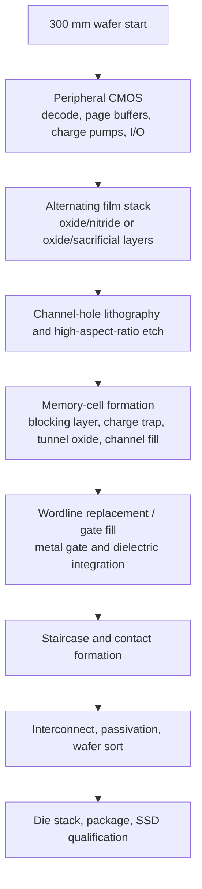
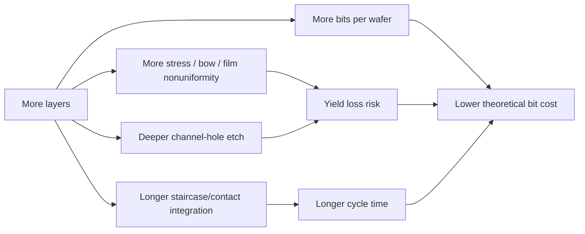
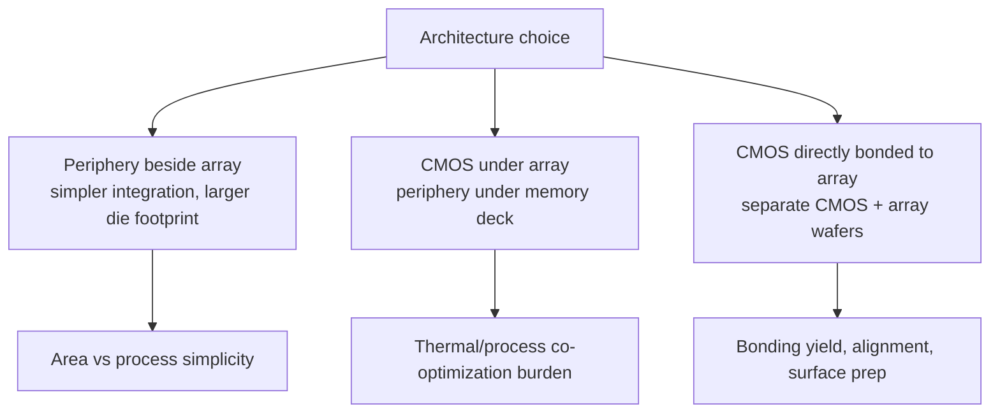
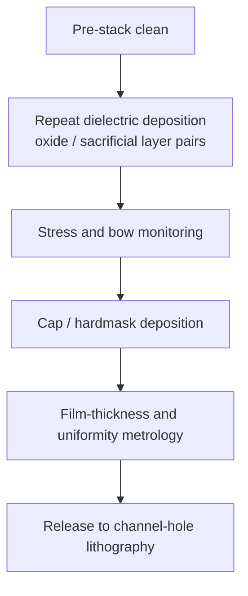
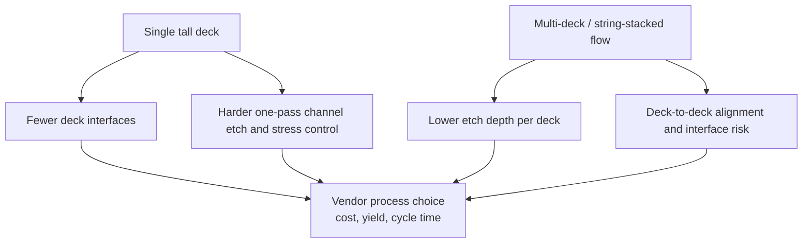
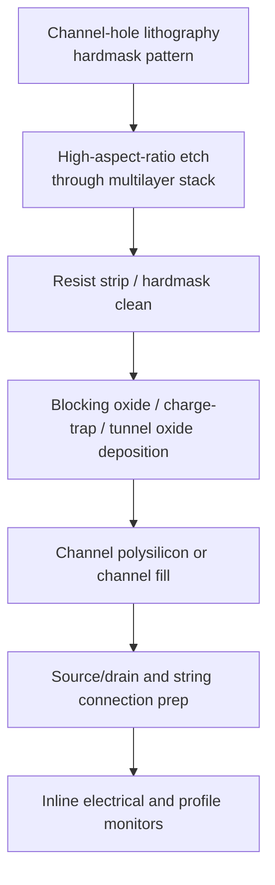
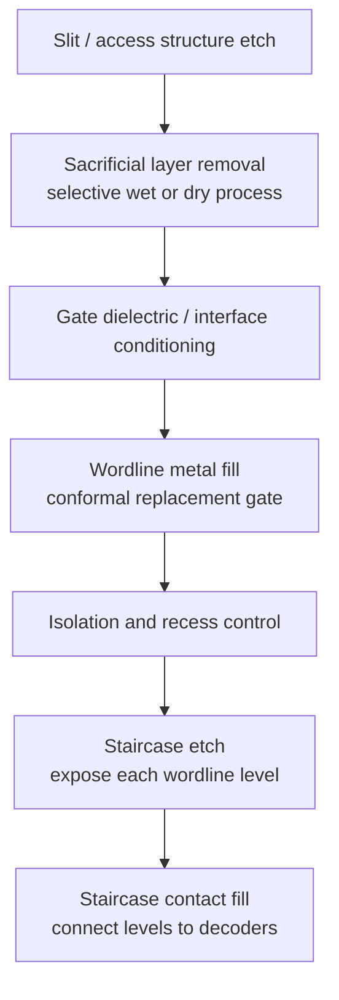
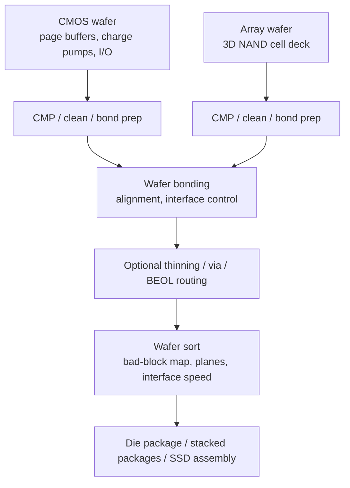
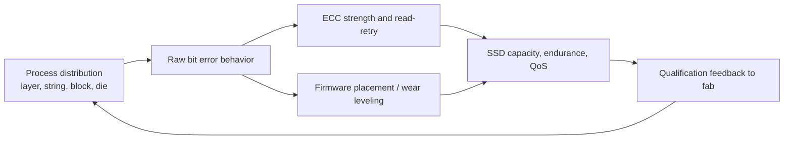

# 3D NAND Process Flow

3D NAND manufacturing is the memory industry's most literal example of vertical scaling. Planar NAND increased density by shrinking cells laterally until interference, endurance, and lithography economics became unattractive; 3D NAND instead stacks wordline layers, etches vertical channels through the stack, builds charge-trap memory cells around those channels, and connects the strings to peripheral CMOS and package I/O. Public flash-memory references describe the architecture shift from planar floating-gate NAND toward 3D charge-trap and CMOS-under-array or bonded-array approaches, while Kioxia's BiCS roadmap frames the current strategic split between layer-count scaling and CBA-enabled performance/power improvements.[^S018][^S174]

This file should be read after [02-history/02-nand-evolution.md](../02-history/02-nand-evolution.md), which covers the planar-to-3D transition and SLC/MLC/TLC/QLC tradeoffs. It also cross-links to [07-semicap-ecosystem/01-wafer-fab-equipment-vendors.md](../07-semicap-ecosystem/01-wafer-fab-equipment-vendors.md) for the equipment basket and [07-semicap-ecosystem/04-materials-chemicals.md](../07-semicap-ecosystem/04-materials-chemicals.md) for the gases, CMP, cleans, and precursors that make the process repeatable. The emphasis here is the wafer route: how the stack is built, opened, converted into cells, contacted, bonded or integrated with CMOS, tested, and sent into SSD products.

## Process Economics

The 3D NAND cost curve is dominated by three linked variables: layers, yield, and time in fab. More layers can increase bits per wafer, but they also raise deposition time, film stress, high-aspect-ratio etch difficulty, channel-fill complexity, staircase contact burden, inspection requirements, and test time. That is why layer count alone is an incomplete metric. Kioxia's current public roadmap is a useful example: its BiCS8 page emphasizes CBA and OPS for density, performance, and power efficiency; its BiCS9 sampling story describes a hybrid approach using mature array structures plus CBA and Toggle DDR 6.0; and its BiCS10 roadmap points to a 332-layer class product family.[^S174][^S180] SK hynix's 321-layer 2Tb QLC mass-production announcement shows the opposite side of the same race: extremely high layer counts and six-plane organization are being pushed into high-capacity consumer and later enterprise SSDs.[^S042]

Unlike DRAM, NAND does not require a capacitor for every bit. The cell is a charge-storage device in a vertical string, and the controller plus ECC hide much of the raw media's analog behavior from the host. That makes NAND a spectacular density technology, but not a simple one. TLC and QLC store multiple bits per cell by slicing threshold-voltage windows more finely; therefore, process variation, layer-to-layer variation, retention loss, program disturb, read disturb, and endurance all translate into controller overhead and product qualification. A 2018 3D NAND characterization paper found that 3D NAND introduced error sources not seen in the same way in planar NAND, including layer-to-layer process variation, early retention loss, and retention interference.[^S238] The paper is older than current 2026 products, but the mechanism remains a useful warning: vertical scaling creates vertical reliability gradients.

## Peripheral CMOS And Array Strategy

3D NAND can be organized with peripheral CMOS beside the array, under the array, or fabricated separately and bonded to the memory array. Public flash-memory summaries describe CMOS-under-array and related schemes as routes to place control circuitry underneath or above the memory array, improving die-area efficiency and allowing more planes without simply expanding periphery area.[^S018] Kioxia's CBA approach is the more aggressive bonding version: logic and memory-cell wafers are fabricated separately under optimized conditions and then bonded into a single device, which Kioxia positions as improving density, performance, and power efficiency.[^S174][^S180]

The process implication is profound. If CMOS and memory are built monolithically, the thermal budget and process modules must satisfy both the logic devices and the vertical array. If CMOS is built separately and bonded, each wafer can be optimized more independently, but bonding cleanliness, wafer flatness, alignment, interface resistance, and post-bond defect inspection become central yield gates. This is why the NAND process flow increasingly overlaps with advanced-packaging process control even before the die reaches conventional package assembly.

For investors, CBA/CUA adoption changes the semicap basket. It still needs deposition, etch, cleans, CMP, inspection, and test, but the spend mix adds wafer bonding, surface preparation, bond-interface metrology, and yield-correlation software. Applied Materials' broad process library, TEL's bonding/debonding and clean offerings, KLA's process-control portfolio, and materials suppliers' CMP/clean chemistries all become relevant to the same NAND node.[^S198][^S199][^S202][^S203][^S216]

## Stack Deposition

The vertical memory deck starts as a repeated multilayer stack. In a replacement-gate style flow, the fab deposits alternating oxide and sacrificial nitride films; later, after channel formation, the sacrificial layers are removed and replaced with conductive wordline material. Exact stack details vary by vendor and generation, but the industrial problem is consistent: hundreds of films must be deposited with tight thickness control, stress control, defect control, and wafer-to-wafer repeatability. Every layer error can create a systematic defect population across enormous bit counts.

This is the deposition-heavy reason NAND is different from advanced DRAM. DRAM has difficult capacitors and contacts, but NAND layer transitions amplify blanket-film deposition. Lam, Applied, and TEL all map to this process basket through deposition, etch, strip/clean, CMP, and metrology-adjacent modules; Lam's public product positioning explicitly calls out advanced memory structures with complex film stacks and high aspect ratios.[^S201] Materials intensity also rises: ALD/CVD precursors, silanes, specialty gases, wet cleans, filtration, and CMP consumables shape defectivity before the most difficult etch step even begins.[^S216][^S218][^S222]

The yield risk is not only random particles. Film stress can bow wafers and distort lithography. Thickness nonuniformity can shift gate length or channel dimensions by vertical position. Hardmask variation can change channel-hole critical dimensions. A small excursion repeated across 200-plus or 300-plus layers can become a systematic electrical signature. This is why high-layer NAND process flow should be modeled as a manufacturing discipline in repetition, not simply as one difficult etch.

## Deck Splitting And String Stacking

Layer count does not have to be built as one monolithic deck. NAND vendors can split the memory stack into decks, form one partial vertical string, then form a second or additional deck above it and connect the strings. This is often described in industry discussions as string stacking or multi-deck integration. It reduces the maximum etch depth required in one pass, but it introduces a new alignment and interface problem: the upper and lower string segments must connect with low resistance, acceptable geometry, and no latent defect at the deck boundary. The tradeoff is therefore not "single deck good, multi-deck bad." It is a balance among channel-hole etch depth, deposition stress, wafer bow, lithography overlay, string current, cycle time, and yield learning.

Deck strategy changes the tool bottleneck. A single tall deck leans heavily on the most aggressive high-aspect-ratio etch capability and on film-stress control across the full stack. A multi-deck route adds more lithography, alignment, deposition, clean, and interface-control steps, but may improve manufacturability if the single-deck etch becomes too close to the process edge. The right answer varies by vendor generation, target die capacity, TLC/QLC mix, and fab learning curve. Kioxia's dual-axis strategy and SK hynix's 321-layer QLC push illustrate that vendors are optimizing different points on this frontier rather than converging on one universal NAND recipe.[^S042][^S174][^S180]

Deck splitting also affects test signatures. A weak deck boundary can show up as layer-localized raw bit errors, abnormal string current, or retention behavior that correlates with vertical position. The controller may be able to map around some blocks, but a systematic deck-boundary issue reduces effective yield and increases validation work. This is why the process engineer, controller engineer, and SSD qualification team need to read the same wafer-sort and reliability data. The physical route sets the statistical shape of the media, and the controller decides how much of that shape can be shipped.

## Channel-Hole Etch And Cell Formation

Channel-hole etch is the flagship 3D NAND process module. The fab must open extremely deep, narrow holes through the stacked films with controlled profile, bow, twist, taper, and bottom critical dimension. If the channel-hole profile is too narrow, string current suffers. If it bows or twists, adjacent cells or wordlines can be affected. If residue remains, later liner and channel films inherit defects. Deep reactive-ion etch and high-aspect-ratio etch references describe the general physics problem: profile control, aspect-ratio effects, mask integrity, and etch lag all become harder as depth increases.[^S236]

The cell film sequence converts the etched hole into a vertical string of charge-trap cells. Charge-trap flash stores charge in an insulating trapping layer rather than a floating polysilicon gate, and that property is important for 3D structures because the trapping layer can wrap the channel through many wordline levels.[^S239] The fab then fills the channel and prepares the string connections. These steps need conformality: films must coat deep holes without pinching off at the top or leaving voids at depth. ALD, CVD, etchback, cleans, and metrology are therefore tightly coupled.

Channel-hole defects are economically brutal because one vertical defect can affect many cells in a string, and because vertical-position effects can create layer-dependent fail modes. A controller can tolerate raw bit errors within ECC limits, but a process module that creates correlated fail patterns consumes controller margin and reduces product endurance or retention qualification headroom. This is the process origin of many downstream SSD validation costs.

## Wordline Replacement And Staircase Contacts

In a replacement-gate style process, after cell films and channels are in place, the fab removes sacrificial layers and replaces them with conductive wordline material. This requires selective removal, high conformality, barrier/metal fill, and isolation across many layers. The wordline module determines gate control, threshold-voltage distribution, program/erase behavior, and disturb characteristics. The integration problem resembles building a skyscraper of gates around many vertical strings without shorting floors together.

Staircase formation is less famous than channel-hole etch, but it is just as central to yield. Each wordline layer needs an electrical contact. The process forms a stepped edge of the stack so that the interconnect can land contacts on individual levels. As layer counts increase, the staircase consumes more area and process complexity unless the vendor improves layout, etch, or deck partitioning. Mislanding contacts, incomplete etch, shorts, opens, or contact-resistance tails can all reduce die yield. This is one reason "332 layers" is not merely 332 useful storage layers; it also implies a contact and decoding infrastructure large enough to access those layers reliably.

The process-control burden maps directly to KLA, TEL, Lam, Applied, and materials suppliers. KLA's inspection/metrology portfolio matters because layer-dependent defects and staircase-contact failures can hide until electrical test if not detected earlier.[^S203] TEL and Lam compete around dry etch and cleans; Applied and Lam around deposition and CMP; materials suppliers around etchants, slurries, pads, cleans, and gas purity.[^S199][^S201][^S202][^S216]

## Bonding, BEOL, And Wafer Sort

For CBA-like flows, memory-array and CMOS wafers are bonded after each has been fabricated to the required stage. Bonding requires surface flatness, low particle counts, alignment, and post-bond integrity. The materials file already notes that CMP and cleans become enabling technologies for hybrid or direct bonding surfaces; in NAND, that is not an optional packaging flourish but part of the device architecture when CBA is used.[^S216][^S218] Kioxia's BiCS9 reporting explicitly describes logic and memory-cell wafers being fabricated separately and bonded into a single high-performance device.[^S180]

Wafer sort for NAND differs from DRAM because the product is expected to ship with bad blocks and to rely on controller-level mapping, ECC, wear leveling, read-retry, and firmware policy. The wafer-level objective is therefore not "perfect raw array"; it is a qualified die with enough good blocks, acceptable bad-block distribution, acceptable speed/power bins, and correct interface behavior. More planes can improve parallelism, but they also require robust per-plane validation and controller scheduling. SK hynix's 321-layer QLC reporting highlighted six planes and a 3,200 MT/s interface, showing how process architecture and product interface are now marketed together.[^S042]

The SSD endpoint determines how strict the die must be. Client SSDs, enterprise SSDs, AI data-lake drives, and HBF-like future modules do not use identical qualification windows. Kioxia's LC9 and CM9 enterprise pages show the system-level layer: BiCS generation, PCIe 5.0, NVMe, capacity, random I/O, sequential bandwidth, power efficiency, endurance, and firmware all package the raw die into a product.[^S175][^S176] The fab process sets the distribution the SSD team can work with; the controller decides how much of that distribution can become revenue.

## Reliability And Controller Coupling

NAND process flow cannot be separated from controller design. Floating-gate or charge-trap cells store analog threshold states, and TLC/QLC encode multiple bits through narrow threshold windows. Program/erase cycling, retention, read disturb, program disturb, temperature, and layer-dependent variation all change error distributions. The 2018 3D NAND reliability paper is especially useful because it shows that vertical architecture creates layer-to-layer process variation and early retention loss, not merely more of the same planar NAND behavior.[^S238]

This controller coupling is why NAND vendors can pursue different process strategies. Kioxia/Sandisk can use CBA and performance/power improvements to attack enterprise SSD workloads even when a specific generation does not maximize layer count.[^S180] SK hynix can use very high layer count, QLC, six planes, and die-package stacking to push high-capacity SSD economics.[^S042] Micron can build NAND fab capacity in Singapore while using controller and enterprise-product strategy to monetize AI storage demand.[^S167] The fab process and SSD controller are two sides of the same gross-margin problem.

## KPI Watchlist

Track layer count, but never treat it as the only metric. Track channel-hole etch profile, deck stacking strategy, staircase-area overhead, bonding yield for CBA/CUA flows, wafer bow, film stress, and inline defect density. Track bit density per wafer after yield, not theoretical bits. Track plane count, interface rate, die capacity, TLC/QLC mix, and package stack height. Track Kioxia/Sandisk BiCS8/BiCS9/BiCS10 progress, SK hynix 321-layer QLC qualification, Micron Singapore NAND fab timing, and whether AI SSD contracts pull NAND capex toward enterprise products rather than client oversupply.[^S042][^S167][^S174][^S180]

For semicap, track Lam/TEL high-aspect-ratio etch share, Applied/Lam/TEL deposition share, KLA inspection and metrology attach, and materials demand for cleans, precursors, CMP, and bonding surfaces. For memory-cycle work, track whether NAND suppliers can add bits through layer transitions without flooding low-margin client channels. AI demand has made NAND strategically visible again, but the process flow remains unforgiving: the cheapest bit is the one that survives the stack, channel, staircase, bond, sort, package, controller, and customer qualification path.

[^S018]: Flash memory overview, Wikipedia, crawled 2026-05, no stable page publish date listed, https://en.wikipedia.org/wiki/Flash_memory
[^S042]: SK hynix announces mass production of its 2Tb 3D QLC NAND, Tom's Hardware, published 2025-08-25, https://www.tomshardware.com/pc-components/ssds/sk-hynix-announces-mass-production-of-its-2tb-3d-qlc-nand-cheaper-high-capacity-consumer-drives-and-244tb-enterprise-ssds-incoming
[^S167]: Micron starts building new 3D NAND fab in Singapore, Tom's Hardware, published 2026-01-28, https://www.tomshardware.com/pc-components/ssds/micron-starts-building-new-3d-nand-fab-in-singapore-fab-10b-promises-to-more-than-double-the-companys-local-flash-production-capacity
[^S174]: 3D Flash Memory BiCS FLASH product page, Kioxia, accessed 2026-07-06, no stable page publish date listed, https://www.kioxia.com/en-jp/business/memory/bics.html
[^S175]: LC9 Series enterprise SSD product page, Kioxia, accessed 2026-07-06, no stable page publish date listed, https://www.kioxia.com/en-jp/business/ssd/enterprise-ssd/lc9.html
[^S176]: CM9-V Series enterprise SSD product page, Kioxia, accessed 2026-07-06, no stable page publish date listed, https://www.kioxia.com/en-jp/business/ssd/enterprise-ssd/cm9-v.html
[^S180]: Kioxia and SanDisk start shipping BiCS9 3D NAND samples, Tom's Hardware, published 2025-07-27, https://www.tomshardware.com/pc-components/storage/kioxia-and-sandisk-start-shipping-bics9-3d-nand-samples-hybrid-design-combining-112-layer-bics5-with-modern-cba-and-ddr6-0-interface-for-higher-performance-and-cost-efficiency
[^S198]: Applied Materials Announces Second Quarter 2026 Results, Applied Materials, published 2026-05-14, https://ir.appliedmaterials.com/news-releases/news-release-details/applied-materials-announces-second-quarter-2026-results
[^S199]: Product Library, Applied Materials, accessed 2026-07-06, no stable page publish date listed, https://www.appliedmaterials.com/us/en/product-library.html
[^S201]: Products, Lam Research, accessed 2026-07-06, no stable page publish date listed, https://www.lamresearch.com/products/
[^S202]: Products and Services, Tokyo Electron, accessed 2026-07-06, no stable page publish date listed, https://www.tel.com/product/
[^S203]: Products, KLA, accessed 2026-07-06, no stable page publish date listed, https://www.kla.com/products
[^S216]: Product Catalog, Entegris, accessed 2026-07-06, no stable page publish date listed, https://www.entegris.com/en/home/products.html
[^S218]: Entegris Stock Rises After Chip-Gear Maker's Q4 Beat, Guidance, Investor's Business Daily, published 2026-02-10, https://www.investors.com/news/technology/entegris-stock-entg-q4-2025-earnings/
[^S222]: Air Liquide Invests $233 Million in South Korea to Back SK Hynix's AI Chips Production, Wall Street Journal, published 2026-06, exact day not captured in accessed search result, https://www.wsj.com/tech/air-liquide-invests-233-million-in-south-korea-to-back-sk-hynixs-ai-chips-production-92fde1f1
[^S236]: Deep reactive-ion etching overview, Wikipedia, crawled 2025-10, no stable page publish date listed, https://en.wikipedia.org/wiki/Deep_reactive-ion_etching
[^S238]: Improving 3D NAND Flash Memory Lifetime by Tolerating Early Retention Loss and Process Variation, arXiv, published 2018-07-13, https://arxiv.org/abs/1807.05140
[^S239]: Charge trap flash overview, Wikipedia, crawled 2026-05, no stable page publish date listed, https://en.wikipedia.org/wiki/Charge_trap_flash
