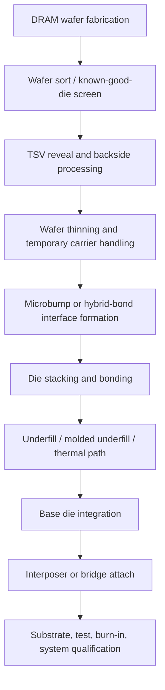
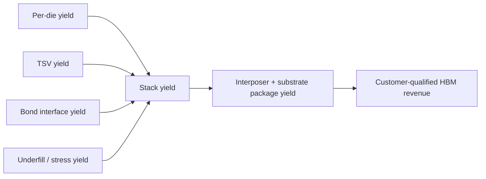
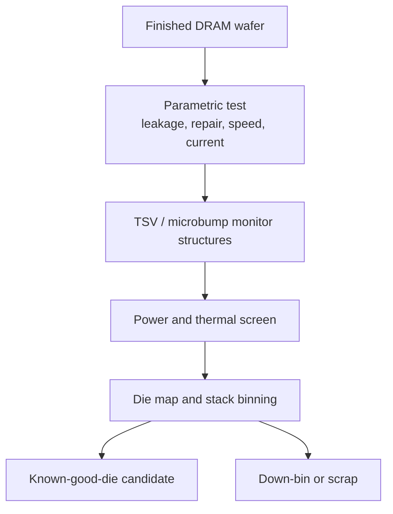
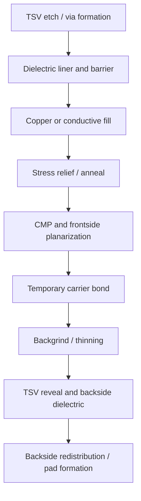
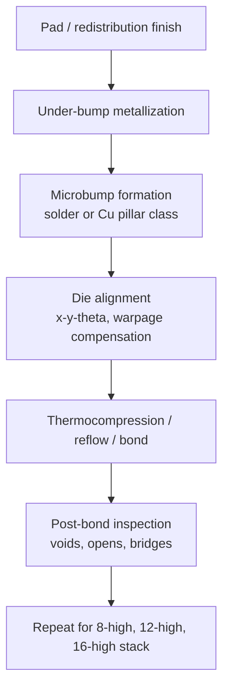
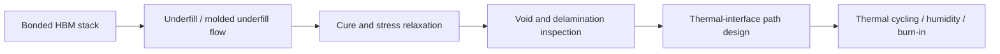
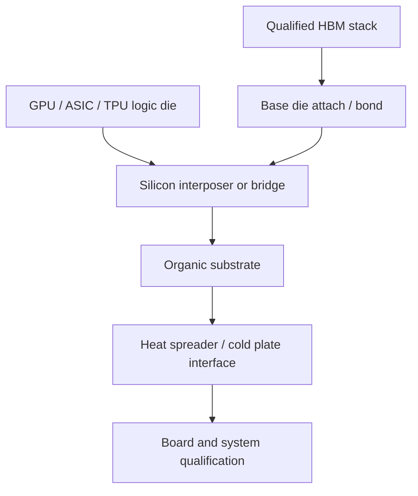
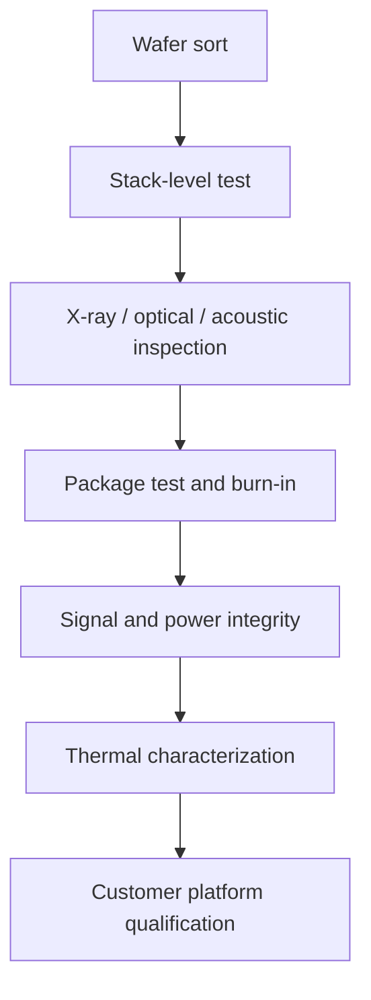
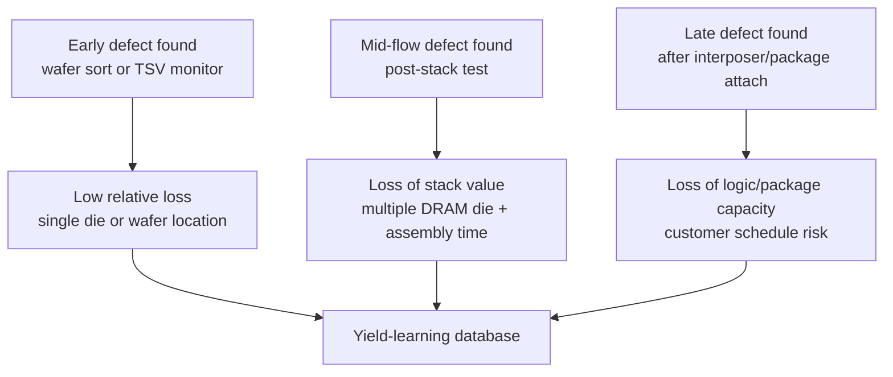

# HBM Packaging Process Flow

HBM packaging is where advanced DRAM stops being a wafer product and becomes a platform dependency. The DRAM die must be fabricated, tested, thinned, connected vertically with TSVs, stacked with micron-scale alignment, bonded to a base die, encapsulated with underfill or molded underfill, attached to an interposer or bridge package, routed beside a GPU/ASIC/TPU, cooled, and qualified under customer workloads. Public HBM summaries describe the basic architecture as stacked DRAM connected by through-silicon vias and integrated near a processor through a wide interface, while 2025-2026 HBM4 disclosures show the commercial pressure: 12-high and later 16-high stacks, 2,048-bit interfaces, 2 TB/s-plus per-stack bandwidth, and named accelerator platform launches.[^S048][^S059][^S038]

This file cross-links to [03-hbm-deep-dive/01-hbm-fundamentals.md](../03-hbm-deep-dive/01-hbm-fundamentals.md) for architecture, [03-hbm-deep-dive/02-hbm-generations.md](../03-hbm-deep-dive/02-hbm-generations.md) for HBM1-HBM5 specs, [07-semicap-ecosystem/02-substrate-interposer-osat.md](../07-semicap-ecosystem/02-substrate-interposer-osat.md) for CoWoS/EMIB/substrate bottlenecks, and [07-semicap-ecosystem/03-testing-equipment.md](../07-semicap-ecosystem/03-testing-equipment.md) for known-good-die and package-test context. The goal here is the manufacturing route: TSV drill to microbump to stacking to underfill to interposer attach, with the yield gates called out explicitly.

## Packaging Economics

HBM package economics are nonlinear. A conventional DRAM die can be sold if it passes product test. An HBM die must pass wafer sort, survive thinning and backside processing, connect through TSVs, align inside a stack, bond through many interfaces, meet thermal and mechanical constraints, and then pass stack-level and package-level tests. One bad die, one weak TSV chain, one underfill void, one microbump defect, or one interposer routing problem can destroy the economics of an otherwise valuable stack. This is why HBM supply is constrained by known-good-die, stack assembly, advanced packaging, test sockets, thermal qualification, and customer platform readiness, not only by DRAM wafer starts.[^S059][^S211][^S212]

HBM4 intensifies every packaging variable. Samsung's February 2026 HBM4 reporting described sixth-generation 10 nm-class DRAM, a 4 nm logic base die, 24 GB to 36 GB 12-layer configurations, up to 3.3 TB/s per stack, and about 40% power-efficiency improvement versus HBM3E.[^S038] Micron's March 2026 HBM4 reporting tied 36 GB 12-high HBM4 to NVIDIA Vera Rubin and claimed more than 2.8 TB/s per stack.[^S059] SK hynix's HBM4 reporting emphasized 12-high stack construction, a 2,048-bit interface, and Advanced MR-MUF packaging.[^S003] These are not just product specs; they are packaging process requirements.

## Wafer Sort And Known-Good-Die

The HBM flow begins before the wafer leaves front-end manufacturing. Wafer sort screens DRAM die for functional arrays, speed, leakage, repair maps, power, TSV-related structures, and stack eligibility. The test program must be stricter than commodity DRAM because the die is about to be embedded in a multi-die stack. A die that is acceptable as a lower-bin standalone DRAM component may be unacceptable for a premium HBM stack if it threatens stack-level bandwidth, power, thermal, or retention margins.

Known-good-die discipline is where testing-equipment demand enters the HBM story. Advantest and Teradyne exposure is not limited to final packaged products; wafer probe, high-speed memory test, burn-in strategy, and data correlation shape how much of the wafer can enter the stacking flow.[^S211][^S212] The economic goal is not simply to reject bad die. It is to minimize false positives and false negatives: a false positive puts a weak die into an expensive stack; a false negative throws away scarce HBM-capable silicon.

HBM also forces data traceability. A final stack failure must be traceable back to die location, wafer lot, TSV process module, bonding event, underfill material lot, interposer lot, substrate lot, and test condition. Without traceability, yield learning slows and customers lose confidence. This is one reason AI memory vendors invest in packaging plants, test facilities, and data infrastructure rather than treating HBM assembly as a commodity OSAT handoff.

## TSV Formation And Backside Processing

The TSV is the vertical electrical highway through the DRAM die. A public TSV overview defines the structure as a vertical electrical connection passing through silicon, used for 3D packages and stacked chips.[^S049] In HBM, TSVs connect DRAM layers to each other and to the base die. The exact vendor process is proprietary, but the manufacturing logic is stable: form vias, insulate sidewalls, fill with metal, reveal or expose them after thinning, and connect them to frontside/backside redistribution and bump structures.

TSV processing creates mechanical and electrical failure modes. Copper and silicon have different coefficients of thermal expansion; a via can create local stress, mobility shifts, keep-out-zone constraints, or delamination risk. Thinning makes wafers fragile and sensitive to warpage. TSV reveal and backside dielectric steps can create opens, shorts, leakage paths, or reliability problems. A 2025 TSV-aware design paper argued that TSV placement has thermal implications in 3D integrated circuits, reinforcing that TSVs are not neutral wires; they influence heat paths, stress, and layout planning.[^S052]

This process module connects front-end and packaging toolsets. Etch, deposition, CMP, cleans, temporary bonding/debonding, metrology, inspection, and carrier handling all matter. TEL's product portfolio includes bonding/debonding and clean modules; Applied, Lam, and KLA all participate around deposition, etch, CMP, inspection, and metrology-adjacent steps; materials suppliers provide slurries, pads, post-CMP cleans, underfill-adjacent cleans, gases, and delivery systems.[^S199][^S201][^S202][^S203][^S216]

## Microbump, Bonding, And Stack Build

After backside processing, the die need an interconnect structure that can join die to die and die to base die. Conventional HBM stacking has relied heavily on microbump bonding, while hybrid bonding is a roadmap and adjacent technology for finer pitch, lower parasitics, and potentially better scaling. The packaging-evolution file covers the broader transition from wire bond and flip chip to TSV, interposers, and hybrid bonding; the HBM process lens is narrower: the bonding interface must connect thousands of vertical and lateral paths with low resistance, acceptable capacitance, mechanical integrity, and high yield.[^S051][^S049]

The stack-height transition is the process stress test. An 8-high stack has fewer interfaces than a 12-high stack; a 16-high stack has still more opportunities for yield loss, warpage, and thermal bottlenecks. HBM4 and future HBM5 discussions therefore put packaging in the center of the roadmap. Tom's Hardware's Computex 2026 report said Samsung showed an HBM5 mockup with a Heat Path Block cooling concept, while SK hynix's iHBM reporting described integrated cooling structures targeting future generations such as HBM5.[^S061][^S062] These reports are forward-looking, but they show why stack assembly is no longer separable from thermal architecture.

Microbump pitch, coplanarity, oxide cleanliness, solder behavior, copper diffusion, underfill flow, and die bow all interact. A bond interface can pass continuity yet fail under thermal cycling. A stack can pass room-temperature test yet throttle or fail in a liquid-cooled accelerator package. The process window is narrow because the HBM stack is tall, dense, and attached beside a hot logic die.

## Underfill, Molded Underfill, And Thermal Path

After bonding, the stack needs mechanical reinforcement and thermal management. Underfill fills gaps between die, redistributes stress, protects interconnects, and reduces the risk that thermal cycling cracks microbumps or delaminates interfaces. SK hynix's HBM4 disclosures emphasized Advanced MR-MUF packaging, and the materials file notes that molded underfill connects directly to stack height, thermal behavior, and package reliability.[^S003] The material choice is not a commodity afterthought; it shapes yield, thermal resistance, warpage, voiding, and long-term reliability.

HBM thermals are hard because heat is generated in multiple places: DRAM array access, TSV and I/O switching, the base die, and the neighboring accelerator. HBM4 widened the interface to 2,048 bits, increasing routing and PHY complexity.[^S048] HBM5 roadmap discussions go further, with public reporting citing projections around 4 TB/s per stack and severe thermal challenges that force cooling structures into the memory-stack conversation.[^S061][^S062] Whether every projection materializes is less important than the process implication: package materials, heat spreaders, thermal interface materials, and stack layout become part of memory performance.

Materials suppliers therefore sit inside the HBM yield path. Entegris' catalog spans post-CMP cleaning, slurries, pads, ALD/CVD precursors, specialty gases, wafer handling, and filtration, while Air Liquide's 2026 South Korea investment was tied to supplying gases for SK hynix's new packaging and testing facility in Cheongju.[^S216][^S222] A package material or gas supply issue can delay HBM output even when DRAM wafers are available.

## Base Die, Interposer, And Package Integration

The base die translates the stacked DRAM into the external HBM interface and manages signals, power, test, repair, and sometimes customer-specific logic. HBM4 makes the base die strategically more important because vendors and customers are discussing customization, and Micron's HBM4 reporting described an in-house CMOS base die and packaging innovations, while broader HBM4E discussions point toward custom base logic for accelerator customers.[^S059][^S002] Samsung's HBM4 report tied the product to a 4 nm logic base die, emphasizing integration between memory and foundry/process capabilities.[^S038]

The interposer or bridge is the package-level fabric between logic and memory. Public 2.5D summaries define the architecture as multiple dies integrated side by side on an interposer, and the substrate/interposer file explains why CoWoS has become the reference bottleneck for high-end AI processors.[^S050][^S057] TSMC's 2026 packaging comments said wafer-level CoWoS still had runway for very large AI processors and that panel-level packaging would complement rather than replace it in the near term.[^S057] That matters for HBM because memory stacks only become revenue when advanced packaging capacity can route them to the accelerator.

Alternative routes are emerging because full silicon interposers are expensive and constrained. A May 2026 report said SK hynix was researching Intel EMIB-based 2.5D packaging for HBM integration, with EMIB using small silicon bridges rather than a full interposer; the same report cited heavy CoWoS allocation by NVIDIA, Broadcom, and AMD.[^S054] The packaging process file should treat this as a live architectural branch: bridge-based approaches can reduce interposer area and possibly cost, but they must prove routing density, thermal behavior, yield, and customer qualification.

## Inspection, Test, And Customer Qualification

HBM inspection and test are distributed across the flow. Wafer sort screens die. TSV monitors catch vertical defects. Post-bond inspection looks for microbump opens, bridges, voids, and alignment errors. Stack test verifies bandwidth, power, repair, and thermal behavior. Package test verifies the interposer/substrate assembly. System qualification validates the HBM stack inside the accelerator platform. The testing-equipment file's known-good-die discussion is therefore part of the manufacturing flow, not only a back-end add-on.[^S211][^S212]

Advanced package inspection is becoming more important because defects are three-dimensional and expensive. A 2026 CoWoS X-ray inspection paper focused on advanced packaging inspection methodology, showing that package-level structural inspection is becoming a technical discipline of its own.[^S206] HBM stack defects can hide under die, underfill, interposers, or substrates; they are not always visible through ordinary optical inspection. The yield loop therefore needs non-destructive inspection, electrical signatures, thermal maps, and failure analysis.

The customer qualification loop is strict because HBM is launch-critical. NVIDIA Blackwell, Vera Rubin, AMD Instinct, Google TPU, and custom ASIC programs are not buying generic memory modules; they are qualifying a stack and package combination for a board, cooling solution, firmware stack, and workload envelope.[^S058][^S059] A memory vendor may announce HBM4 volume production, but the shipment that matters is the one qualified for a named accelerator platform.

## Rework Limits And Failure Analysis

HBM packaging has little tolerance for late discovery. In a conventional package, some defects can be reworked or contained at lower cost. In a large 2.5D accelerator package, the memory stack, logic die, interposer or bridge, organic substrate, underfill, thermal interface, and lid are mutually committed. Reworking a defective stack after interposer attach can be technically possible in narrow cases, but the cost, yield risk, and customer schedule impact are severe. That is why the flow must push defect discovery as early as possible: wafer sort before thinning, TSV monitors before stack build, post-bond inspection before underfill cure, stack test before interposer attach, and package test before board integration.

Failure analysis is correspondingly multidisciplinary. A stack-level fail may originate in a front-end DRAM defect, a TSV liner crack, copper fill void, backside thinning damage, microbump bridge, underfill void, base-die PHY issue, interposer routing defect, substrate warpage excursion, or thermal-interface problem. The physical FA toolset therefore includes cross-sectioning, X-ray inspection, acoustic microscopy, thermal imaging, electrical localization, focused-ion-beam work, and die-map correlation. The business purpose is not only to explain a failure; it is to decide whether the root cause is random, lot-specific, tool-specific, material-specific, or design-specific.

This is where HBM capacity ramps slow down. A vendor can add a new packaging line, but the line does not instantly reproduce the historical yield of the mature line. Operators need stack-height-specific recipes, material dispense tuning, bond-force and temperature windows, underfill cure profiles, inspection thresholds, test limits, and customer-specific qual vehicles. The same logic explains why SK hynix's nearly $13 billion AI packaging facility and Air Liquide's Cheongju gas-supply investment matter: HBM output depends on a localized ecosystem of packaging, test, gases, materials, and failure-analysis infrastructure, not just memory wafers.[^S065][^S222]

## KPI Watchlist

Track HBM-capable DRAM wafer output separately from stack output. Track known-good-die yield, TSV yield, microbump or hybrid-bond pitch, stack height, underfill void rate, warpage, stack thermal resistance, and package-level test yield. Track interposer and substrate allocation because HBM stacks can wait behind CoWoS, EMIB, bridge, or substrate constraints. Track SK hynix MR-MUF capacity, Samsung HBM4 base-die integration, Micron HBM4/HBM4E custom base-die progress, and whether HBM5 thermal concepts move from mockup to qualified product.[^S003][^S038][^S059][^S061][^S062]

For semicap, track temporary bonding/debonding, wafer thinning, TSV etch/fill/CMP, advanced inspection, high-speed memory test, thermal materials, and advanced packaging capacity. For investors, the main rule is that HBM packaging capacity converts DRAM process leadership into accelerator revenue. A supplier can have the best DRAM die and still lose share if it cannot stack, cool, test, and package those die at customer launch cadence.

[^S002]: Micron takes the HBM lead with fastest ever HBM4 memory with a 2.8TB/s bandwidth, TechRadar, published 2025-10-02, https://www.techradar.com/pro/micron-takes-the-hbm-lead-with-fastest-ever-hbm4-memory-with-a-2-8tb-s-bandwidth-putting-it-ahead-of-samsung-and-sk-hynix
[^S003]: SK hynix completes development of next-gen HBM4, Tom's Hardware, published 2025-09-12, https://www.tomshardware.com/pc-components/dram/sk-hynix-completes-development-of-hbm4-2-048-bit-interface-and-10-gt-s-speeds-promised
[^S038]: Samsung says it took the leap with HBM4, TechRadar, published 2026-02-13, https://www.techradar.com/pro/samsung-says-it-took-the-leap-with-hbm4-as-it-starts-shipping-faster-ai-memory-built-on-advanced-process-nodes
[^S048]: High Bandwidth Memory overview, Wikipedia, crawled 2026-05, no stable page publish date listed, https://en.wikipedia.org/wiki/High_Bandwidth_Memory
[^S049]: Through-silicon via overview, Wikipedia, crawled 2025-05, no stable page publish date listed, https://en.wikipedia.org/wiki/Through-silicon_via
[^S050]: 2.5D integrated circuit overview, Wikipedia, crawled 2026-03, no stable page publish date listed, https://en.wikipedia.org/wiki/2.5D_integrated_circuit
[^S051]: Flip chip overview, Wikipedia, crawled 2025-12, no stable page publish date listed, https://en.wikipedia.org/wiki/Flip_chip
[^S052]: Through Silicon Via Aware Design Planning for Thermally Efficient 3-D Integrated Circuits, arXiv, published 2025-07-19, https://arxiv.org/abs/2508.13160
[^S054]: Intel, SK hynix shares surge following reports of chip packaging partnership, Tom's Hardware, published 2026-05-11, https://www.tomshardware.com/tech-industry/semiconductors/sk-hynix-shares-surge-to-all-time-high-on-reports-of-intel-emib-partnership
[^S057]: TSMC says panel packaging won't replace CoWoS anytime soon for the largest future AI processors, Tom's Hardware, published 2026-06-16, https://www.tomshardware.com/tech-industry/semiconductors/tsmc-says-panel-packaging-wont-replace-cowos-anytime-soon-for-the-largest-future-ai-processors-wafer-level-tech-can-scale-to-58-massive-dies-in-one-package
[^S058]: NVIDIA Blackwell Platform Arrives to Power a New Era of Computing, NVIDIA Newsroom, published 2024-03-18, https://nvidianews.nvidia.com/news/nvidia-blackwell-platform-arrives-to-power-a-new-era-of-computing
[^S059]: Micron enters high-volume production of HBM4 for Nvidia Vera Rubin, Tom's Hardware, published 2026-03-16, https://www.tomshardware.com/pc-components/dram/micron-enters-high-volume-production-of-hbm4-for-nvidia-vera-rubin
[^S061]: SK hynix unveils iHBM thermal architecture for future HBM5 accelerators, Tom's Hardware, published 2026-05-26, https://www.tomshardware.com/tech-industry/semiconductors/sk-hynix-unveils-ihbm-thermal-architecture-that-cools-ai-memory-at-the-source-integrated-cooling-elements-inside-hbm-interface-cut-thermal-resistance-by-30-percent-target-next-gen-hbm5-accelerators-and-dense-ai-data-centers
[^S062]: Samsung shows first HBM5 mockup with Heat Path Block cooling, Tom's Hardware, published 2026-06-03, https://www.tomshardware.com/tech-industry/semiconductors/samsung-shows-first-hbm5-mockup-at-computex-with-heat-path-block-cooling
[^S065]: SK hynix announces nearly $13 billion AI packaging facility, PC Gamer, published 2026-01-13, https://www.pcgamer.com/hardware/memory/in-a-bid-to-meet-the-memory-supply-crisis-head-on-sk-hynix-announces-it-will-invest-nearly-usd13-billion-into-fresh-ai-packaging-facility/
[^S199]: Product Library, Applied Materials, accessed 2026-07-06, no stable page publish date listed, https://www.appliedmaterials.com/us/en/product-library.html
[^S201]: Products, Lam Research, accessed 2026-07-06, no stable page publish date listed, https://www.lamresearch.com/products/
[^S202]: Products and Services, Tokyo Electron, accessed 2026-07-06, no stable page publish date listed, https://www.tel.com/product/
[^S203]: Products, KLA, accessed 2026-07-06, no stable page publish date listed, https://www.kla.com/products
[^S206]: Design Guidelines for In-line X-ray Inspection in Advanced Packaging Technology: A CoWoS Case Study, arXiv, published 2026-06-24, https://arxiv.org/abs/2606.26430
[^S211]: Chip Testing Stock Sees More Red, Yet Wall Street Has High Profit Hopes, Investor's Business Daily, published 2026-06-09, https://www.investors.com/research/chip-robotics-company-semiconductor-memory-testing-ter/
[^S212]: Teradyne's stock soars after this absolute blowout forecast that was fueled by AI, MarketWatch, published 2026-02-03, https://www.marketwatch.com/story/teradynes-stock-soars-after-this-absolute-blowout-forecast-that-was-fueled-by-ai-2dfc3d8a
[^S216]: Product Catalog, Entegris, accessed 2026-07-06, no stable page publish date listed, https://www.entegris.com/en/home/products.html
[^S222]: Air Liquide Invests $233 Million in South Korea to Back SK Hynix's AI Chips Production, Wall Street Journal, published 2026-06, exact day not captured in accessed search result, https://www.wsj.com/tech/air-liquide-invests-233-million-in-south-korea-to-back-sk-hynixs-ai-chips-production-92fde1f1
