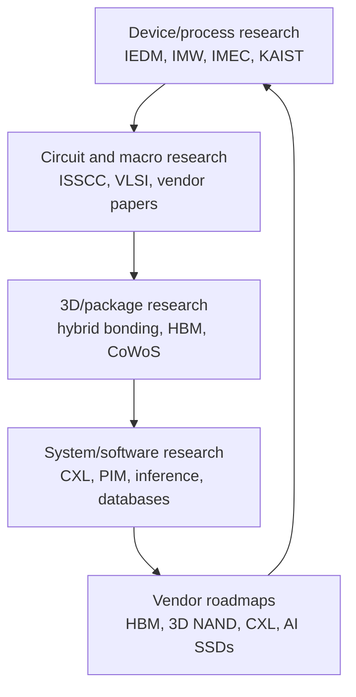
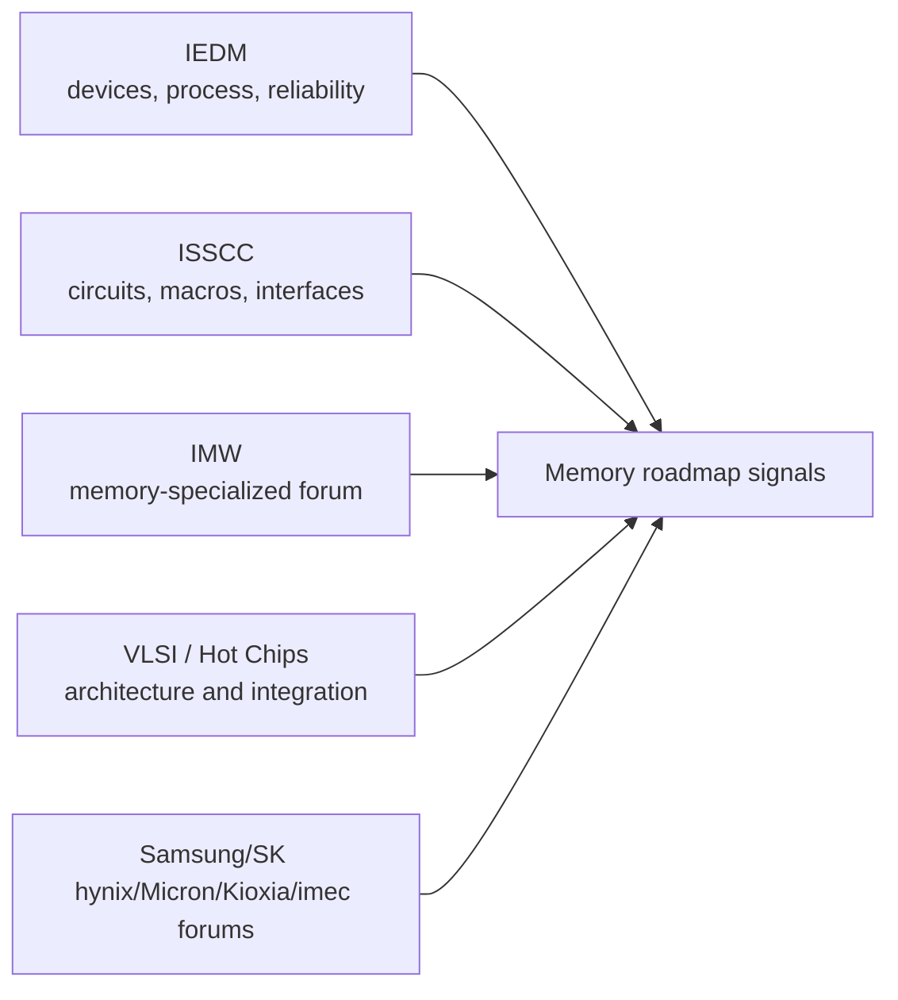
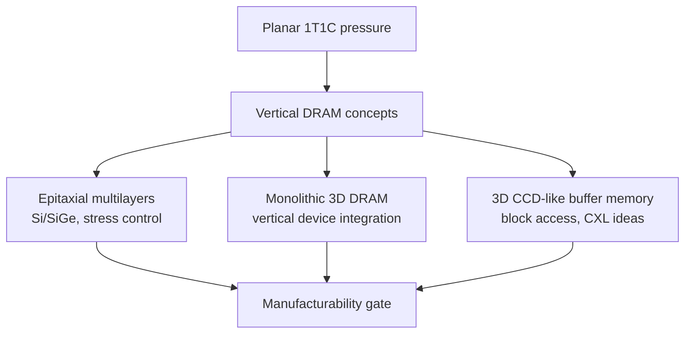
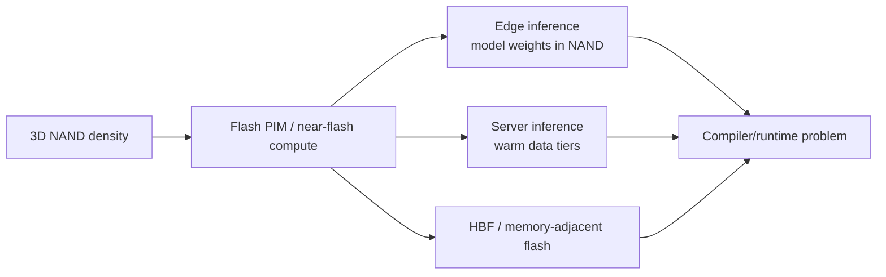
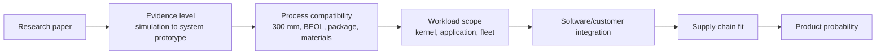
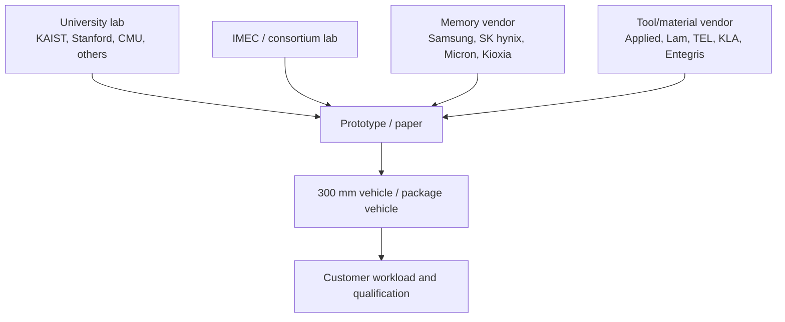

# Academic And Industry Research Frontier

The memory research frontier is no longer a clean split between device papers, circuit papers, system papers, and product roadmaps. The most relevant work now sits across all four layers: 3D DRAM process integration, HBM stack thermals, CXL memory-tier behavior, NAND processing-in-memory, persistent and emerging memories, EDA for chiplet packages, and software runtimes that can exploit nonuniform memory tiers. This file tracks where to look for early signals and how to interpret them without confusing a conference result with a manufacturable product.

The practical rule is that research should be treated as an option funnel. A device paper proves a mechanism. A circuit paper proves an array, macro, PHY, or interface. A package paper proves assembly, thermal, or interconnect feasibility. A system paper proves workload value. A vendor roadmap proves strategic intent. A customer qualification proves commercial reality. The database should mark those stages separately because memory markets often overreact to the first stage and underappreciate the long qualification path.

## Conference Map

ISSCC, IEDM, IMW, VLSI, Hot Chips, and vendor technology forums play different roles. ISSCC is strongest for circuits and systems: memory macros, PHYs, HBM interfaces, PIM macros, ADC/DAC-adjacent compute-in-memory, and high-speed I/O. IEDM is strongest for devices and process integration: transistor structures, DRAM capacitors, 3D NAND cell stacks, ferroelectrics, ReRAM, MRAM, selectors, process modules, and reliability. The IEEE International Memory Workshop, usually abbreviated IMW, is more specialized around memory device, reliability, circuit, and architecture work. VLSI and Hot Chips bridge technology and products: they often expose architectural choices before mass adoption. Public IEDM descriptions frame the conference as an annual forum for semiconductor device breakthroughs across design, manufacturing, physics, modeling, and circuit-device interaction.[^S240]

The right way to read those venues is by abstraction level. A new ferroelectric NAND device at IEDM may be five or more years from product, but it can tell investors what materials or deposition tools might matter. An ISSCC HBM macro can reveal bandwidth and power direction earlier than a product launch. A Hot Chips accelerator talk can reveal the memory topology customers want. An IMW reliability paper can explain why a product that looks attractive in bit density may fail endurance or retention screens. The signal is not only the paper; it is which companies coauthor the work, which wafers are real, and whether the measurement is array-level, chip-level, package-level, or simulation-only.

## 3D DRAM And Vertical Capacitor Alternatives

3D DRAM is the most important long-range DRAM research branch because conventional 1T1C scaling is constrained by capacitor area, leakage, sensing margin, and process cost. SK hynix's 2025 roadmap placed 3D DRAM around 2030, which makes it a research-to-product topic rather than a near-term supply fix.[^S036] The technical question is whether DRAM can borrow a NAND-like vertical-density model without inheriting NAND-like latency, endurance, or block-access compromises.

Recent work is moving from concept to process demonstrations. In 2025 reporting, imec and Ghent University were described as achieving a 120-layer silicon/silicon-germanium stack on a 300 mm wafer using advanced epitaxial deposition, with strain and germanium-content control positioned as enabling steps toward 3D DRAM and other stacked devices.[^S241] That result does not mean commercial 3D DRAM exists. It means one difficult materials prerequisite, repeated high-quality multilayer formation, is becoming more credible.

The systems literature is already exploring what happens if stacked DRAM becomes designable rather than fixed. DreamRAM, a December 2025 modeling paper, created a configurable tool for custom 3D die-stacked DRAM and identified designs with 66% higher bandwidth, 100% higher capacity, or 45% lower power/energy per bit versus its baseline under matched constraints.[^S242] Stratum, an October 2025 system-hardware co-design paper, proposed monolithic 3D-stackable DRAM for MoE serving and reported up to 8.29x decoding-throughput improvement and 7.66x energy-efficiency improvement versus GPU baselines in the paper's evaluation.[^S243] Those are research claims, but they show why 3D DRAM is not only a cell-scaling story. It is a memory-architecture story.

## HBM, Thermal, And Package Co-Design

HBM research is shifting from "more bandwidth" to "usable bandwidth under thermal, power, and package constraints." HBM4 widened the interface and raised base-die customization pressure; HBM5 discussion is already about cooling structures, D2D PHY heat, thermal pillars, and package architecture. Samsung's Computex 2026 HBM5 mockup and SK hynix's iHBM thermal concept point in the same direction: heat extraction is becoming part of memory product definition.[^S061][^S062]

Research around TSVs, 2.5D floorplanning, and package inspection shows the same trend. A 2025 TSV-aware design paper argued that TSV placement can affect thermal behavior in 3D integrated circuits.[^S052] A 2025 structural/thermal-aware placement paper reported stress and wirelength improvements for 2.5D chiplet placement versus temperature-only optimization.[^S208] A 2026 CoWoS X-ray inspection paper treated inline inspection as a design-methodology problem because complex 2.5D/3D structures are difficult to inspect nondestructively.[^S206] Together, these papers say that HBM yield and performance are no longer separable from EDA, inspection, thermal modeling, and package layout.

## NAND, PIM, And Memory-Centric Inference

3D NAND research is increasingly pulled by AI inference rather than only SSD endurance. NVLLM, an April 2026 paper, proposed a 3D NAND-centric architecture for edge on-device LLM inference, using wafer-to-wafer stacking to integrate multi-plane 3D NAND with compute pipelines, ECC units, and buffers; the paper reported 16.7x to 37.9x speedup over A800-based out-of-core inference and up to 4.7x speedup over SSD-like designs in its evaluation.[^S244] MCFlash, a May 2026 paper already used in the fundamentals file, demonstrated bulk bitwise operations inside commercial 3D NAND chips using dynamic sensing and multi-level encoding, reporting error-free operation over more than one billion operations on fresh blocks and low bit-error rates after 10,000 P/E cycles.[^S011]

The key constraint is programmability. A 3D NAND PIM result can look spectacular in a narrow kernel, but a product must solve mapping, ECC, wear, thermal limits, data placement, read disturb, host interface, and software integration. That is why HBF standardization, CXL memory semantics, and runtime placement APIs matter. Device research creates a possible data path; software decides whether that path can be used without rewriting the datacenter.

## CXL, Tiered Memory, And Software Reality

CXL research is the clearest reminder that latency and bandwidth are system properties, not component labels. A March 2025 paper on CXL-enabled tiered memory found that performance heterogeneity can undermine processor designs optimized for more uniform memory latency and reported that disparity in memory-tier parallelism can reduce DDR bandwidth by up to 81% under heavy load; its proposed MIKU policy dynamically throttles CXL request rates to preserve DDR throughput.[^S245] A June 2026 ITME paper proposed inference tiered memory expansion with disaggregated CXL-hybrid memories and reported up to 35.7% throughput improvement by using workload predictability to manage data movement across memory and storage tiers.[^S246]

The lesson for memory investment is sober. CXL can expand capacity, but it does not magically turn remote memory into local DDR or HBM. The best work is workload-aware: KV caches, model weights, prefix caches, vector stores, and retrieval indices have different locality patterns. CXL products will be judged by effective throughput, tail latency, software transparency, power, and fleet utilization, not by raw module capacity.

## Research-To-Product Scorecard

The research frontier needs a scorecard because memory ideas often look equally compelling in abstracts and completely different in manufacturing. A useful scoring model starts with five gates. First is physical evidence: simulation, device cell, small array, macro, full chip, package, or system prototype. Second is process compatibility: whether the idea fits 300 mm manufacturing, backend temperature limits, existing packaging flows, and material qualification. Third is workload specificity: whether the reported gain applies to a narrow kernel, a representative application, or a fleet-level workload. Fourth is customer integration: whether CPUs, GPUs, accelerators, firmware, compilers, and operating systems can use it without heroic rewrites. Fifth is supply-chain leverage: whether the technology can be built by existing DRAM/NAND/HBM vendors or requires a new manufacturing ecosystem.

This scorecard prevents false equivalence. DreamRAM and Stratum are valuable because they expose architecture tradeoffs for 3D-stacked DRAM, but they are not the same as a vendor qualifying a 3D DRAM wafer process.[^S242][^S243] NVLLM is valuable because it maps LLM inference onto NAND-adjacent compute, but it still has to clear software, endurance, controller, and product-form-factor gates before it can affect NAND capex.[^S244] The imec 3D CCD-style memory result is valuable because it attacks the DRAM/NAND gap with a plausible vertical-memory concept, but it is still early-stage and must prove layer scaling, thermal behavior, retention, access granularity, and CXL integration.[^S247]

The scorecard also helps separate "replacement" stories from "adjacent tier" stories. Most memory research does not replace DRAM, NAND, or HBM directly. It creates a new tier, offload path, cache, buffer, embedded macro, or workload-specific accelerator. That is commercially meaningful, but the TAM and timing are different. A CXL buffer memory can reduce local DRAM pressure without replacing HBM. NAND PIM can accelerate a model-serving subpath without replacing GPUs. A 3D DRAM concept can become a post-2030 capacity tier without changing 2026 DDR5 or HBM4 supply.

## Vendor And Lab Tracking

Vendor coauthorship is one of the strongest signals. A university-only paper can be important, but a paper with Samsung, SK hynix, Micron, Kioxia, TSMC, Intel, imec, KAIST, Stanford, or major tool-vendor participation has a clearer path into process development kits, test vehicles, and customer discussions. Applied Materials' EPIC Center disclosure matters in that sense because it places tool-vendor process work near SK hynix, Micron, TSMC, Advantest, Arizona State, RPI, and Stanford.[^S198] That kind of collaboration does not guarantee a specific product, but it increases the chance that a promising device or package idea is tested against real manufacturing constraints.

IMEC is especially useful to track because it often sits between pure academic work and commercial manufacturing. Its 120-layer Si/SiGe work and 3D CCD memory concept both speak the language of manufacturability: 300 mm wafers, deposition control, IGZO, vertical stacking, and CXL positioning.[^S241][^S247] KAIST is worth tracking for memory-package thermals and HBM roadmaps, especially because HBM5 thermal projections are already influencing Samsung and SK hynix public messaging.[^S062] Stanford is worth tracking less as a single memory-device source and more as part of the EDA/process/materials collaboration network that can shape advanced memory integration.

The final research-tracking variable is negative evidence. If a device concept appears for several years but never grows from cell to array, that is information. If a PIM proposal reports speedup but never addresses software integration, that is information. If a CXL paper improves throughput but worsens tail latency or DDR interference, that is information. Research should be used to update probabilities, not to hunt for heroic upside cases only.

## IMEC, KAIST, Stanford, And University-Industry Loops

IMEC is important because it sits near the process-research boundary. Its 3D CCD-style memory announcement, reported in May 2026, described a charge-coupled-device memory architecture using IGZO and vertical stacking, demonstrated charge transfer above 4 MHz, and positioned the concept as a CXL Type-3 buffer-memory candidate.[^S247] The result is early-stage, but the direction is notable: memory research is exploring block-access tiers between DRAM and NAND, not only faster versions of familiar devices.

KAIST appears in the database primarily through HBM thermal roadmaps and package cooling discussions, including the HBM5 projections cited in the generation file.[^S062] Stanford appears through industry collaboration signals such as Applied Materials' EPIC Center disclosure, which listed Stanford alongside TSMC, SK hynix, Micron, Advantest, Arizona State, and RPI in process-technology collaboration context.[^S198] These university-industry loops matter because memory scaling increasingly requires shared infrastructure: 300 mm process access, advanced packaging test vehicles, thermal labs, and architecture workloads.

## Research Watchlist

Track 3D DRAM process demonstrations, especially real wafer stacks, array measurements, retention, refresh, and integration temperature. Track HBM thermal papers that include package and workload data rather than only compact simulations. Track 3D NAND PIM papers that use real chips or realistic ECC/wear models. Track CXL tiered-memory papers that report tail latency and interference with local DDR, not only average speedup. Track whether IMW/IEDM/ISSCC papers include vendor coauthors and whether follow-on work moves from device cells to arrays, macros, packages, and customer-visible prototypes.

Most important, maintain stage discipline. A 2026 arXiv system paper can identify a real bottleneck without proving a product. An IEDM device can be scientifically excellent without being manufacturable. An ISSCC macro can prove circuit feasibility without proving package yield. The research frontier is valuable precisely because it shows where the next bottlenecks will be; the database should use it to guide watchlists, not to collapse the distinction between experiment and supply.

[^S011]: MCFlash: Bulk Bitwise Processing in 3D NAND with Dynamic Sensing and Multi-level Encoding, arXiv, published 2026-05-06, https://arxiv.org/abs/2605.05119
[^S036]: SK hynix reveals DRAM development roadmap through 2031, Tom's Hardware, published 2025-11-01, https://www.tomshardware.com/pc-components/dram/sk-hynix-reveals-dram-development-roadmap-through-2031-ddr6-gddr8-lpddr6-and-3d-dram-incoming
[^S052]: Through Silicon Via Aware Design Planning for Thermally Efficient 3-D Integrated Circuits, arXiv, published 2025-07-19, https://arxiv.org/abs/2508.13160
[^S061]: SK hynix unveils iHBM thermal architecture for future HBM5 accelerators, Tom's Hardware, published 2026-05-26, https://www.tomshardware.com/tech-industry/semiconductors/sk-hynix-unveils-ihbm-thermal-architecture-that-cools-ai-memory-at-the-source-integrated-cooling-elements-inside-hbm-interface-cut-thermal-resistance-by-30-percent-target-next-gen-hbm5-accelerators-and-dense-ai-data-centers
[^S062]: Samsung shows first HBM5 mockup with Heat Path Block cooling, Tom's Hardware, published 2026-06-03, https://www.tomshardware.com/tech-industry/semiconductors/samsung-shows-first-hbm5-mockup-at-computex-with-heat-path-block-cooling
[^S198]: Applied Materials Announces Second Quarter 2026 Results, Applied Materials, published 2026-05-14, https://ir.appliedmaterials.com/news-releases/news-release-details/applied-materials-announces-second-quarter-2026-results
[^S206]: Design Guidelines for In-line X-ray Inspection in Advanced Packaging Technology: A CoWoS Case Study, arXiv, published 2026-06-24, https://arxiv.org/abs/2606.26430
[^S208]: STAMP-2.5D: Structural and Thermal Aware Methodology for Placement in 2.5D Integration, arXiv, published 2025-04-29, https://arxiv.org/abs/2504.21140
[^S240]: International Electron Devices Meeting overview, Wikipedia, crawled 2026-04, no stable page publish date listed, https://en.wikipedia.org/wiki/International_Electron_Devices_Meeting
[^S241]: Next-generation 3D DRAM approaches reality as scientists achieve 120-layer stack using advanced deposition techniques, Tom's Hardware, published 2025-09, exact day not captured in accessed search result, https://www.tomshardware.com/tech-industry/next-generation-3d-dram-approaches-reality-as-scientists-achieve-120-layer-stack-using-advanced-deposition-techniques
[^S242]: DreamRAM: A Fine-Grained Configurable Design Space Modeling Tool for Custom 3D Die-Stacked DRAM, arXiv, published 2025-12-13, https://arxiv.org/abs/2512.12106
[^S243]: Stratum: System-Hardware Co-Design with Tiered Monolithic 3D-Stackable DRAM for Efficient MoE Serving, arXiv, published 2025-10-06, https://arxiv.org/abs/2510.05245
[^S244]: NVLLM: A 3D NAND-Centric Architecture Enabling Edge On-Device LLM Inference, arXiv, published 2026-04-28, https://arxiv.org/abs/2604.25699
[^S245]: Architectural and System Implications of CXL-enabled Tiered Memory, arXiv, published 2025-03-22, https://arxiv.org/abs/2503.17864
[^S246]: ITME: Inference Tiered Memory Expansion with Disaggregated CXL-Hybrid Memories, arXiv, published 2026-06-10, https://arxiv.org/abs/2606.12556
[^S247]: New 3D memory architecture revives old camera technology to smash through AI memory wall, TechRadar, published 2026-05-14, https://www.techradar.com/pro/new-3d-memory-architecture-revives-old-camera-technology-to-smash-through-ai-memory-wall-nand-dram-hybrid-promises-to-make-memory-cheaper-faster-and-with-unlimited-endurance
