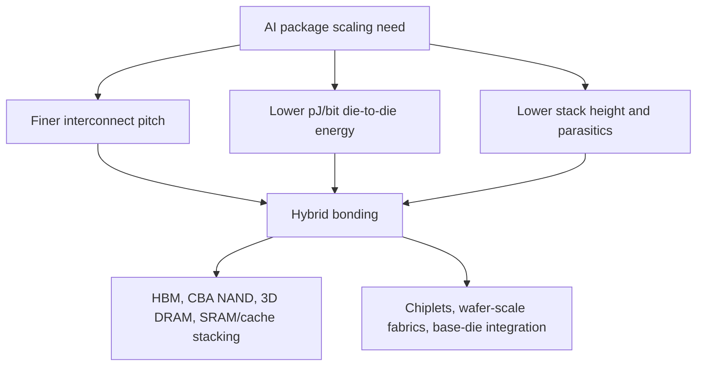
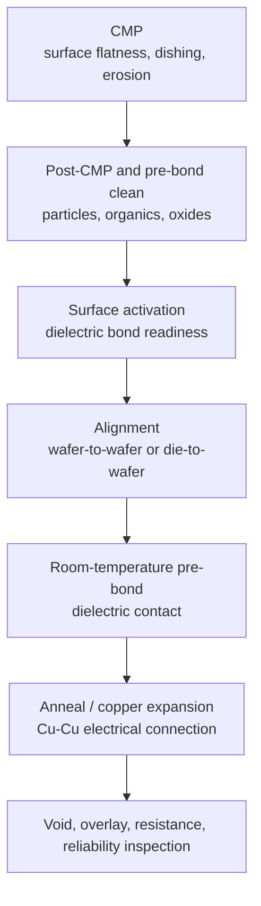
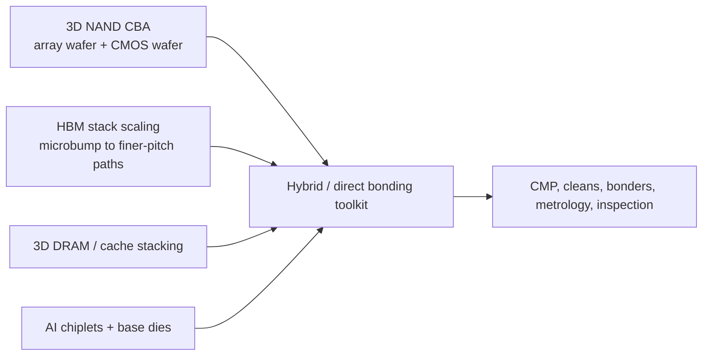
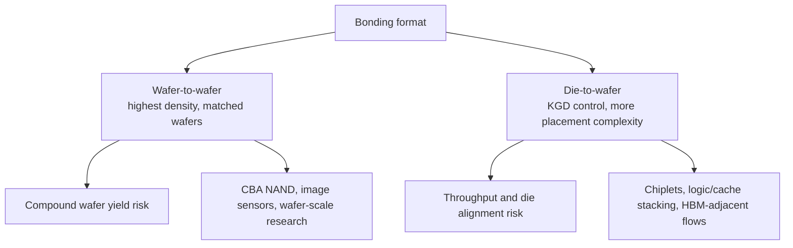
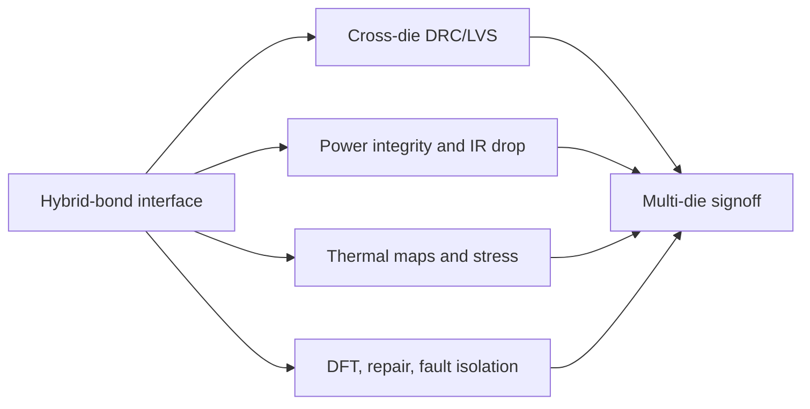
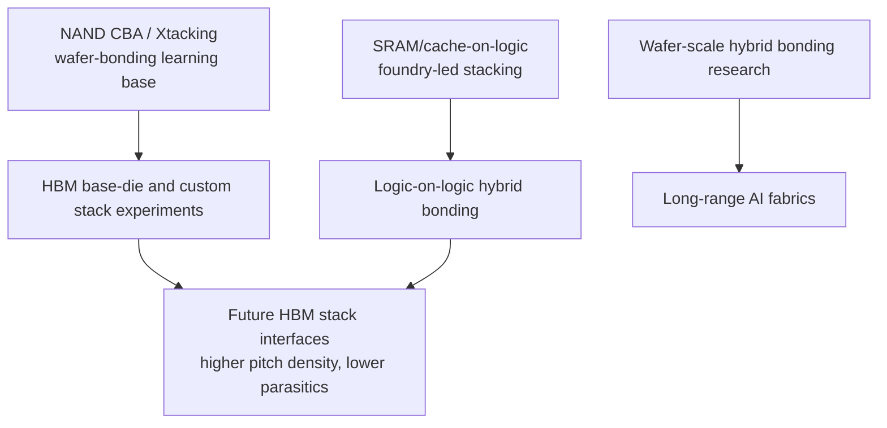
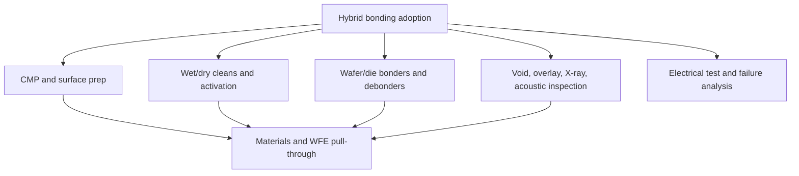

# Hybrid Bonding And Advanced Packaging

Hybrid bonding is the transition point where packaging starts to look like wafer fabrication. Instead of joining chips with large solder bumps, wire bonds, or conventional package-level attach, hybrid bonding prepares extremely flat dielectric and copper surfaces, aligns them at very fine pitch, forms dielectric-to-dielectric bonds, and then creates copper-to-copper electrical continuity through thermal treatment. The commercial reason is simple: AI accelerators, HBM stacks, chiplets, 3D NAND CBA flows, wafer-scale systems, and future logic-on-memory structures all want more bandwidth, lower energy per bit, smaller pitch, and less package height than bump-based interconnect can provide.[^S248][^S249]

The term can hide several different flows. Die-to-wafer bonding attaches known-good die onto a wafer. Wafer-to-wafer bonding joins two full wafers, which can create extremely dense interconnect but requires both wafers to have compatible yield, layout, and alignment. Hybrid bonding can be used in memory-array-to-CMOS structures, logic-on-logic stacking, image sensors, SRAM-on-logic, and future HBM-like stacks. This file focuses on memory and semicap implications: process modules, yield gates, design tradeoffs, and how to track whether hybrid bonding is moving from research to high-volume manufacturing.

## Process Flow

Hybrid bonding begins with surface preparation. The bond surfaces must be planar, clean, smooth, particle-free, and chemically prepared. Direct bonding references emphasize that wafer surfaces need sufficient cleanliness, flatness, and smoothness or voids can form at the interface.[^S249] Thermocompression bonding references add the metal-side requirement: metals such as copper can be joined through heat and pressure, but oxide, temperature uniformity, CTE mismatch, and surface preparation are critical process variables.[^S250] Hybrid bonding combines these worlds: the dielectric bond provides mechanical attachment, and the copper pads form electrical interconnect after thermal treatment.

Every step has a yield trap. CMP must avoid copper dishing and dielectric erosion because height variation breaks contact or creates shorts. Cleans must remove particles without damaging surfaces. Alignment must hold across wafer bow and local die distortion. Anneal must create copper contact without generating stress, delamination, or diffusion problems. Inspection must catch hidden voids and partial bonds before the product becomes part of an expensive stack or interposer package.

## Why Memory Cares

Memory is one of the strongest use cases for hybrid bonding because density and bandwidth are both physical. 3D NAND already uses bonded-array ideas: Kioxia describes CMOS directly Bonded to Array technology as fabricating memory-cell and CMOS wafers separately and bonding them to improve density, performance, and power efficiency.[^S174][^S180] HBF proposals build on the same BiCS/CBA lineage, while HBM roadmap discussions increasingly point toward tighter stack interfaces, thermal paths, and base-die customization.[^S099][^S059]

The HBM question is especially important. Conventional HBM stack assembly still leans heavily on TSVs, microbumps, molded underfill, and interposer attach, but stack height and bandwidth pressure keep pushing the industry toward finer-pitch bonding. SK hynix's HBM4 disclosure emphasized Advanced MR-MUF packaging; Micron and Samsung HBM4 disclosures emphasized base die, stack height, and thermal/power improvements.[^S003][^S038][^S059] Hybrid bonding is not a magic replacement for all of that. It is a candidate path for reducing interconnect pitch, parasitics, and stack-height penalties as HBM moves toward 16-high and HBM5-class thermal constraints.

## Wafer-To-Wafer Versus Die-To-Wafer

Wafer-to-wafer bonding can deliver extraordinary density and alignment if both wafers are compatible, but it multiplies yield risk. A defect on either wafer can spoil bonded area. Die-to-wafer bonding lets the manufacturer place known-good die, improving yield management, but it requires high-throughput pick/place/bond tools and precise die-level alignment. Memory use cases split along this boundary. CBA NAND can use wafer-to-wafer bonding because array and CMOS wafers can be designed as matched layers. HBM or chiplet assembly often needs known-good-die discipline because individual die are expensive and stack yield is nonlinear.

Recent research is making that tradeoff quantitative. A March 2026 wafer-to-wafer bonding paper modeled bonding as a coupled fluid-structure problem where wafer deformation and trapped air interact, and found nonlinear sensitivity of bonding-front behavior to initial gap, air viscosity, and interfacial energy.[^S251] That kind of model matters because hybrid bonding yield can fail for reasons that are not obvious from static alignment specs. The bond front is dynamic. Wafer bow, trapped air, surface energy, particles, and local topography all shape void formation.

## Design And EDA Implications

Hybrid bonding changes design rules. The interface is no longer a package escape afterthought; it is a dense electrical layer that may sit between active wafers or dies. Designers must manage pad arrays, keep-out zones, thermal paths, power delivery, test access, repair strategy, and failure isolation. EDA tools need package-aware extraction, DRC/LVS across die boundaries, thermal-electrical co-simulation, and yield-aware placement. The existing EDA file covered CLIPGen, 3D-ICE, and firmware/package co-optimization; hybrid bonding is one of the physical reasons those tools matter.[^S227][^S228][^S229]

Wafer-scale hybrid bonding research shows how far the design space can go. A March 2026 paper on wafer-scale systems with wafer-on-wafer hybrid bonding argued that bonded wafers can provide ultra-high bandwidth between reticles and studied reticle placement strategies for communication topology; it reported up to 250% throughput improvement, up to 36% latency reduction, and up to 38% lower energy per transmitted byte versus its baseline.[^S252] The paper is research-stage, but it illustrates an important principle: once the package interconnect becomes dense enough, architecture becomes a placement problem as much as a transistor problem.

## Intel, TSMC, And The Competitive Packaging Race

Advanced-packaging competition is now part of foundry competition. TSMC's CoWoS remains the premium reference for large AI processors, and 2026 reporting said TSMC still viewed wafer-level CoWoS as having runway for the largest packages rather than being replaced quickly by panel-level methods.[^S057] Intel is pushing a different story around EMIB, Foveros, and Foveros Direct. February 2026 reporting on Intel's AI chip test vehicle described four 18A logic tiles, 12 HBM4-class stacks, EMIB-T, Foveros, UCIe interfaces, and Foveros Direct 3D with fine-pitch copper-to-copper bonding.[^S253] A December 2025 report on an even larger Intel concept described sub-10 um copper-to-copper hybrid bonding, 18A-PT base dies, EMIB-T, UCIe-A, and up to 24 HBM5 stacks in an extreme multi-chiplet package concept.[^S254]

The lesson is not that Intel has displaced TSMC. It is that packaging is now a roadmap battleground. CoWoS, SoIC-like stacking, EMIB/Foveros, X-Cube/I-Cube, CBA, and future HBM bonding choices are all ways to solve the same set of problems: reticle limits, memory bandwidth, power delivery, thermal density, yield, and customer launch timing. Memory vendors have to choose packaging partners and internal capabilities accordingly.

## Memory Adoption Sequence

Hybrid bonding will not enter every memory product at the same speed. The most mature memory-adjacent adoption path is NAND CBA, because the array wafer and CMOS wafer can be co-designed and bonded as a product architecture rather than assembled as many independent known-good die.[^S174][^S180] That gives NAND vendors a learning base in wafer bonding, surface prep, post-bond inspection, and yield correlation. It also explains why YMTC's Xtacking expertise is strategically relevant to Chinese HBM ambitions even though YMTC is not a DRAM leader: the hard skill is not only memory-cell design, but wafer bonding and high-volume interface yield.[^S255]

HBM adoption is more complicated. A DRAM stack is built from expensive known-good die, and the customer ultimately qualifies a stack beside a high-power accelerator. That pushes the flow toward die-level yield control, stack-level test, and thermal-mechanical reliability before any broad migration from microbump-style interconnect to hybrid-bonded stack interfaces. The likely path is selective: hybrid bonding may first appear in base-die integration, test vehicles, custom HBM variants, or future HBM5/HBM6-class products where pitch and thermal penalties justify the risk. It is less likely to replace every mature HBM3E assembly path quickly because customers value qualified supply over theoretical interconnect elegance.

SRAM/cache stacking is another plausible bridge. Logic foundries may qualify hybrid bonding first for cache-on-logic or logic-on-logic structures where the system value is high and the die pair can be tightly controlled. That learning can then spill into memory stacks, custom base dies, and accelerator packages. Intel's Foveros Direct messaging and TSMC's SoIC-like positioning both point toward this logic-memory convergence, even when the public product examples emphasize compute tiles rather than commodity memory.

The long-range branch is wafer-scale or reticle-scale integration. The wafer-on-wafer hybrid-bonding network paper shows why researchers care: if bonding can provide dense reticle-to-reticle links, memory and compute no longer have to cross conventional package or board boundaries for every transfer.[^S252] That idea is not near-term commodity supply. It is a signpost for where AI-system architecture could go if package interconnect becomes more like on-chip interconnect.

## Semicap And Materials Pull-Through

Hybrid bonding increases demand for tools and materials that look more like front-end process control than old-style assembly. CMP, cleans, plasma activation, bonders, debonders, wafer handling, inspection, metrology, X-ray, acoustic inspection, electrical test, and failure analysis all become more valuable. TEL's product portfolio explicitly includes bonding/debonding and cleaning; Applied, Lam, and KLA have relevant deposition, etch, CMP, inspection, and metrology exposure; Entegris supplies slurries, pads, post-CMP cleans, post-etch cleans, filtration, and wafer-handling consumables.[^S199][^S201][^S202][^S203][^S216]

The materials file's warning applies sharply here: a slurry, clean, or surface chemistry change cannot be swapped casually once a bond flow is qualified. Hybrid bonding makes particles, residues, dishing, oxide regrowth, moisture, and wafer bow into revenue variables. A process that works in a lab can fail in high-volume manufacturing if particles per wafer, surface-energy drift, or thermal-cycle reliability are not controlled.

## Failure Modes And Watchlist

The main failure modes are voids, particles, overlay errors, copper dishing, dielectric erosion, incomplete copper contact, high contact resistance, delamination, wafer bow, die shift, trapped air, thermal stress, and latent reliability failure after cycling. These defects are hard because they can be buried at interfaces, invisible optically, and expensive to discover late. The CoWoS X-ray inspection paper used elsewhere in the database is relevant because advanced packages require nondestructive inspection methods that can see complex internal structures.[^S206]

Track pitch, bond yield, void density, overlay, throughput, die-to-wafer versus wafer-to-wafer mix, CMP defectivity, surface activation chemistry, anneal temperature, warpage, and rework rate. Track whether hybrid bonding appears in shipping NAND, HBM, logic-on-logic, or only in demos. Track customer names and package vehicles, because hybrid bonding becomes commercially real when it is qualified inside a platform with thermal, power, firmware, and workload constraints.

The investment conclusion is that hybrid bonding is not one tool or one supplier. It is a process ecosystem. The winners may include memory vendors with CBA/NAND experience, foundries with 3D stacking lines, OSATs that can run advanced inspection and test, WFE vendors with surface-prep and bonding modules, materials suppliers with qualified CMP/clean chemistries, and EDA vendors that can sign off a bonded multi-die stack. The bottleneck will move as adoption matures, but the direction is clear: more of memory value is moving into wafer-level package integration.

[^S003]: SK hynix completes development of next-gen HBM4, Tom's Hardware, published 2025-09-12, https://www.tomshardware.com/pc-components/dram/sk-hynix-completes-development-of-hbm4-2-048-bit-interface-and-10-gt-s-speeds-promised
[^S038]: Samsung says it took the leap with HBM4, TechRadar, published 2026-02-13, https://www.techradar.com/pro/samsung-says-it-took-the-leap-with-hbm4-as-it-starts-shipping-faster-ai-memory-built-on-advanced-process-nodes
[^S057]: TSMC says panel packaging won't replace CoWoS anytime soon for the largest future AI processors, Tom's Hardware, published 2026-06-16, https://www.tomshardware.com/tech-industry/semiconductors/tsmc-says-panel-packaging-wont-replace-cowos-anytime-soon-for-the-largest-future-ai-processors-wafer-level-tech-can-scale-to-58-massive-dies-in-one-package
[^S059]: Micron enters high-volume production of HBM4 for Nvidia Vera Rubin, Tom's Hardware, published 2026-03-16, https://www.tomshardware.com/pc-components/dram/micron-enters-high-volume-production-of-hbm4-for-nvidia-vera-rubin
[^S099]: SanDisk and SK hynix to standardize High Bandwidth Flash memory, Tom's Hardware, published 2025-08-07, https://www.tomshardware.com/tech-industry/sandisk-and-sk-hynix-join-forces-to-standardize-high-bandwidth-flash-memory-a-nand-based-alternative-to-hbm-for-ai-gpus-move-could-enable-8-16x-higher-capacity-compared-to-dram
[^S174]: 3D Flash Memory BiCS FLASH product page, Kioxia, accessed 2026-07-06, no stable page publish date listed, https://www.kioxia.com/en-jp/business/memory/bics.html
[^S180]: Kioxia and SanDisk start shipping BiCS9 3D NAND samples, Tom's Hardware, published 2025-07-27, https://www.tomshardware.com/pc-components/storage/kioxia-and-sandisk-start-shipping-bics9-3d-nand-samples-hybrid-design-combining-112-layer-bics5-with-modern-cba-and-ddr6-0-interface-for-higher-performance-and-cost-efficiency
[^S199]: Product Library, Applied Materials, accessed 2026-07-06, no stable page publish date listed, https://www.appliedmaterials.com/us/en/product-library.html
[^S201]: Products, Lam Research, accessed 2026-07-06, no stable page publish date listed, https://www.lamresearch.com/products/
[^S202]: Products and Services, Tokyo Electron, accessed 2026-07-06, no stable page publish date listed, https://www.tel.com/product/
[^S203]: Products, KLA, accessed 2026-07-06, no stable page publish date listed, https://www.kla.com/products
[^S206]: Design Guidelines for In-line X-ray Inspection in Advanced Packaging Technology: A CoWoS Case Study, arXiv, published 2026-06-24, https://arxiv.org/abs/2606.26430
[^S216]: Product Catalog, Entegris, accessed 2026-07-06, no stable page publish date listed, https://www.entegris.com/en/home/products.html
[^S227]: CLIPGen: A Chiplet Link IP Modeling and Generation Framework for 2.5D Architecture Exploration, arXiv, published 2026-05-26, https://arxiv.org/abs/2605.27757
[^S228]: 3D-ICE 4.0: Accurate and efficient thermal modeling for 2.5D/3D heterogeneous chiplet systems, arXiv, published 2025-12-05, https://arxiv.org/abs/2512.05823
[^S229]: Toward Mitigating Process-Induced Performance Degradation in 3.5D Heterogeneous Packages via Pre-Silicon Firmware Co-Optimization, arXiv, published 2026-06-24, https://arxiv.org/abs/2606.26176
[^S248]: Advanced packaging overview, Wikipedia, crawled 2026-03, no stable page publish date listed, https://en.wikipedia.org/wiki/Advanced_packaging_(semiconductors)
[^S249]: Direct bonding overview, Wikipedia, crawled 2026-04, no stable page publish date listed, https://en.wikipedia.org/wiki/Direct_bonding
[^S250]: Thermocompression bonding overview, Wikipedia, crawled 2026-03, no stable page publish date listed, https://en.wikipedia.org/wiki/Thermocompression_bonding
[^S251]: Wafer-to-Wafer Bonding: Part I - The Coupled Physics Problem and the 2D Finite Element Implementation, arXiv, published 2026-03-24, https://arxiv.org/abs/2603.22827
[^S252]: Network Design for Wafer-Scale Systems with Wafer-on-Wafer Hybrid Bonding, arXiv, published 2026-03-05, https://arxiv.org/abs/2603.05266
[^S253]: Intel shows off leading-edge tech with massive AI processor test vehicle, Tom's Hardware, published 2026-02, exact day not captured in accessed search result, https://www.tomshardware.com/tech-industry/semiconductors/intel-shows-off-leading-edge-tech-with-massive-ai-processor-test-vehicle-huge-chip-features-four-logic-tiles-12-hbm4-stacks-and-8x-reticle-size
[^S254]: Intel displays tech to build extreme multi-chiplet packages 12 times the size of the largest AI processors, Tom's Hardware, published 2025-12, exact day not captured in accessed search result, https://www.tomshardware.com/tech-industry/semiconductors/intel-displays-tech-to-build-extreme-multi-chiplet-packages-12-times-the-size-of-the-largest-ai-processors-beating-tsmcs-planned-biggest-floorplan-the-size-of-a-cellphone-armed-with-hbm5-14a-compute-tiles-and-18a-sram
[^S255]: YMTC and CXMT team up to accelerate Chinese domestic HBM production, Tom's Hardware, published 2025-09, exact day not captured in accessed search result, https://www.tomshardware.com/pc-components/ram/ymtc-partners-with-cxmt-for-hbm
