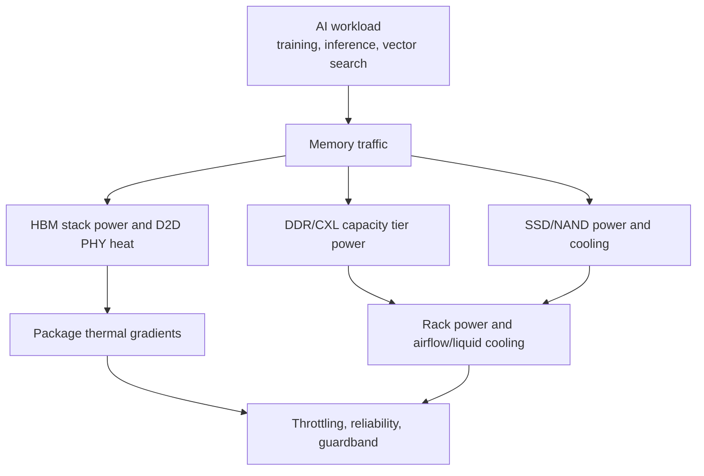
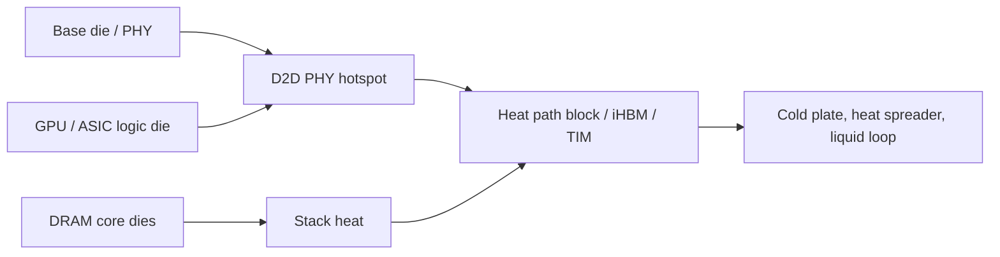
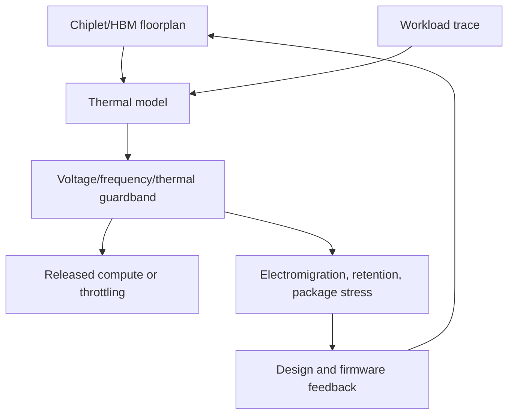
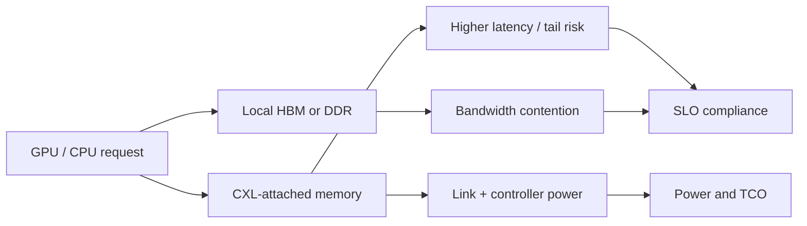
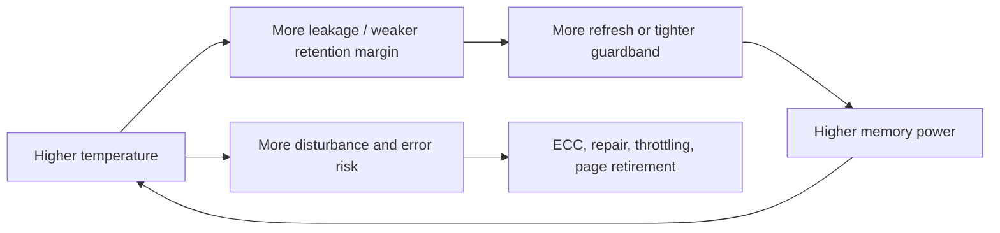
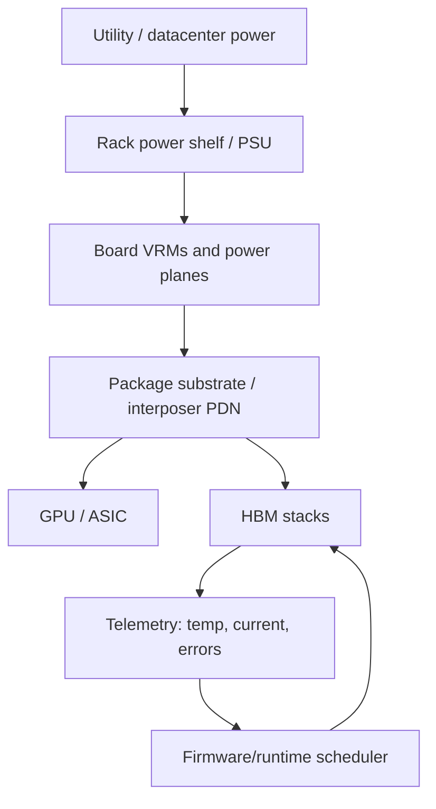
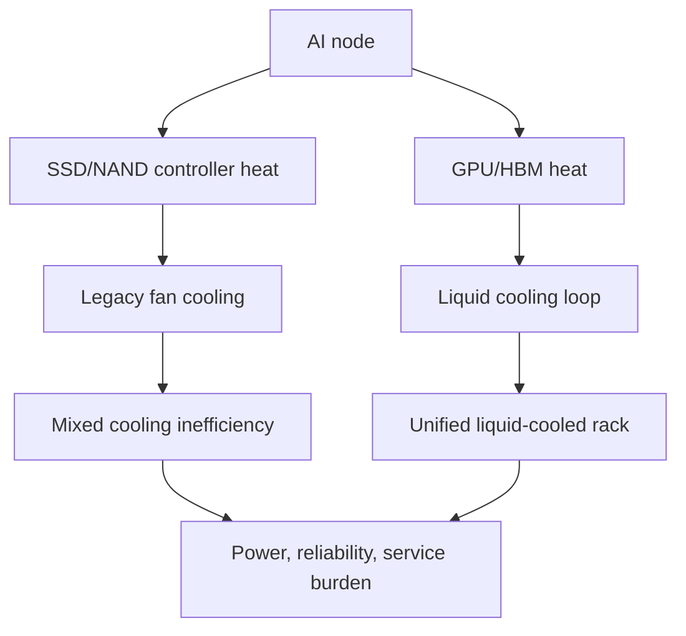
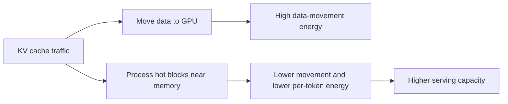
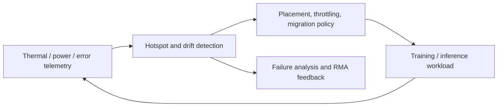

# Power And Thermal Challenges

Power and thermal behavior are now first-order memory-roadmap constraints. The old mental model treated memory as a capacity and bandwidth component that sat around the processor. In AI systems, memory is part of the heat source, the power-delivery problem, the package floorplan, and the datacenter cooling loop. HBM stacks sit beside kilowatt-class accelerators, CXL devices add capacity through fabric links that consume power and create latency/power tradeoffs, NAND SSDs are pulled into liquid-cooled AI storage trays, and advanced packages turn thermal gradients into reliability and yield risk.[^S061][^S062][^S228]

The important investment point is that power and thermals change what "capacity" means. A terabyte of memory that cannot be cooled at target bandwidth is not a usable terabyte. A stack with headline bandwidth but too much leakage or thermal throttling will not deliver platform throughput. A CXL memory pool that expands capacity but steals DDR bandwidth or increases tail latency may hurt service-level objectives. A liquid-cooled GPU tray that leaves SSDs on fan cooling may create a hidden power and reliability bottleneck. This file tracks those problems across memory classes.

## HBM: Heat At The Interface

HBM's thermal problem is concentrated. Stacked DRAM generates heat in the dies and TSV/interconnect network, but the hardest emerging hotspot is the die-to-die PHY region between the HBM base die and the processor. SK hynix's iHBM report said the company was embedding integrated cooling elements into the D2D PHY to reduce thermal resistance by more than 30%, targeting HBM5 accelerators and dense AI datacenters.[^S061] Samsung's HBM5 mockup report described Heat Path Block cooling with thermal pillars that draw heat from inside the stack toward an external spreader and cited roadmap discussion around HBM5-class stacks approaching roughly 100 W per stack.[^S062]

HBM4 already shows why this matters. Micron's March 2026 HBM4 report claimed more than 2.8 TB/s per 36 GB 12-high stack and more than 20% better power efficiency than its HBM3E at the same stack height, while Samsung's February 2026 HBM4 report claimed up to 3.3 TB/s per stack and roughly 40% better power efficiency versus HBM3E.[^S059][^S038] Those are vendor claims, but the direction is clear: every generation must increase bandwidth while lowering joules per bit, because total stack power cannot rise without bound.

The thermal challenge also changes HBM vendor differentiation. A supplier with good DRAM bits but weak package thermals will lose at customer qualification. A supplier with slightly lower headline speed but better sustained thermal behavior can win if the accelerator holds boost clocks longer or avoids memory throttling. This is why HBM5 public messaging is full of cooling structures rather than only pin speed.

## Package And EDA Guardbands

Advanced packages have thermal coupling that is hard to model with old board-level assumptions. Heat moves through logic die, HBM stacks, interposers, substrates, underfills, thermal interface materials, heat spreaders, and liquid cold plates. A 2025 3D-ICE 4.0 paper argued that 2.5D/3D heterogeneous chiplet systems have intricate heat paths and power densities that challenge traditional compact thermal models; it reported speedups over prior tools while reducing grid complexity without sacrificing accuracy.[^S228] A 2026 pre-silicon firmware co-optimization paper modeled Foveros Direct, PowerVia, EMIB-T, UCIe, and HBM5 over a 90,000-step LLM inference dataset and reported strong thermal-load correlation while presenting projected guardband reductions, though it noted silicon validation was still pending.[^S229]

The practical consequence is that EDA and firmware now sit inside the memory performance story. If the model is too pessimistic, customers over-cool or under-clock. If the model is too optimistic, field failures and throttling appear. The correct level of guardband depends on workload locality, package layout, cooling solution, HBM stack behavior, and manufacturing variation. Memory suppliers increasingly need to provide thermal models and characterization data, not just electrical datasheets.

## CXL And Capacity-Tier Power

CXL expands memory capacity, but it can shift power and latency into links, switches, retimers, controllers, and remote devices. The CXL-enabled tiered-memory paper cited in the research-frontier file found that heterogeneity can reduce local DDR bandwidth under heavy CXL load and proposed request throttling to preserve performance.[^S245] The ITME paper proposed inference tiered memory expansion with disaggregated CXL-hybrid memories and reported throughput improvement by using workload predictability to manage data movement across tiers.[^S246]

The power question is workload-specific. KV caches, embedding tables, sparse parameters, and cold model weights may tolerate slower tiers if placement is predictable. Hot activation paths and dense attention may not. A CXL memory module that saves GPU HBM capacity can still lose if it increases rack power, reduces DDR bandwidth, or creates tail latency. The best CXL systems will therefore combine hardware, page migration, compression, prefetch, throttling, and admission control. Raw capacity is only the starting point.

## DRAM Refresh, Leakage, And Thermal Feedback

DRAM power is not only I/O switching. It includes activation/precharge, refresh, leakage, on-die termination, command/address activity, power-management states, and interface PHY behavior. The thermal feedback loop is especially important: higher temperature increases leakage and can tighten retention distributions, which can require more conservative refresh or stronger error-management policy. The DRAM process file covered why capacitor leakage and destructive reads make refresh a fundamental part of the technology; in high-density systems, refresh is a power-management and availability problem as much as a correctness mechanism.[^S234][^S237]

HBM makes the loop more visible because the stack sits near a hot accelerator. DDR and LPDDR have more board-level airflow and spacing, but server DIMM thermals still matter under high capacity, high utilization, and dense racks. CXL modules add another twist: if memory is disaggregated or pooled, thermal state may differ by device and rack location, so placement software should avoid treating all remote capacity as equivalent. A hot CXL module is not the same resource as a cool one if it throttles, errors, or draws more power at the margin.

## Power Delivery And Infrastructure

Memory power also has to reach the package. HBM4 and HBM5-class stacks sit on packages with large logic dies, interposers or bridges, voltage regulators, substrates, and high-current board paths. A power-delivery problem can become a memory-performance problem if rail droop forces lower clocking, extra guardband, or reduced interface utilization. The 2026 firmware co-optimization paper's focus on PowerVia rails, thermal hinting, and HBM leakage shows the direction: physical power delivery, package thermal maps, and workload scheduling are converging.[^S229]

Infrastructure can become the long pole even when memory components are ready. The HBM vendor-roadmap file noted reporting that Micron's Singapore expansion could require 400 to 500 power transformers, far above a standard wafer fab range cited in that article, because AI memory and datacenter buildouts are competing for heavy electrical equipment.[^S078] That is not a narrow Singapore anecdote. Advanced memory capacity consumes power in fabs, packaging plants, test floors, and end-customer datacenters. A model that counts only wafer starts misses the transformer, substation, cooling-water, and test-floor power constraints that decide schedule.

## NAND, SSD, And Storage Cooling

NAND and SSDs used to sit mostly outside the accelerator thermal story. AI storage changes that. Training checkpoints, retrieval corpora, vector databases, model shards, and inference logs pull SSDs into high-density racks near GPUs. Micron's HBM4/Vera Rubin reporting also highlighted high-volume production of PCIe 6.0 SSDs with 28 GB/s reads and liquid-cooled environment integration.[^S059] Business Insider's 2026 liquid-cooled storage article argued that SSD cooling is becoming a hidden constraint as GPU systems move to liquid cooling and storage remains fan-cooled.[^S256]

The SSD thermal issue is not only media temperature. Controller power, DRAM cache, PCIe PHYs, voltage regulation, airflow path, and drive density all matter. High-capacity enterprise SSDs can pack many watts into small form factors. If a rack eliminates most fans for liquid-cooled GPUs but keeps storage in an air-cooled island, the rack may pay for both cooling systems. That adds power, service complexity, and reliability risk from thermal cycling.

## Liquid Cooling And Workload Stability

Liquid cooling is becoming a performance tool, not only a facilities choice. A 2025 paper benchmarking large language and vision-language models on air-cooled versus liquid-cooled H100 systems reported liquid-cooled GPU temperatures of 41-50 C versus 54-72 C under load for air cooling, plus 17% higher performance and improved performance per watt in the measured setup.[^S257] The paper is GPU-focused, but its lesson extends to memory: stable temperature preserves boost behavior, reduces guardband, and can improve sustained throughput.

A 2026 direct-to-chip liquid-cooling design paper used a generative channel-design framework for the NVIDIA GB200 Grace Blackwell Superchip and reported more than 5 C lower average temperature and more than 35 C lower maximum temperature versus a baseline parallel-channel design.[^S258] Again, the point is not that one cold-plate paper defines the market. It is that cooling geometry is becoming co-designed with heterogeneous package heat maps. As HBM stacks, CPUs, GPUs, and switch ASICs share packages and boards, cooling design becomes part of system architecture.

## PIM And Energy Per Token

Processing-in-memory is often motivated by bandwidth, but the deeper issue is energy per moved bit. TokenStack, a 2026 HBM-PIM architecture/runtime paper for LLM inference, argued that KV-cache serving wastes resources when all HBM layers are treated uniformly; it proposed dense capacity layers plus PIM-enabled compute layers using the HBM4 logic die as a stack-local control point and reported 1.62x geometric-mean token-throughput improvement, 1.70x SLO-compliant serving-capacity improvement, and 30-47% lower per-token energy versus its AttAcc baseline.[^S259]

PIM is not free. Logic in or near memory consumes area, power, and design complexity. It may reduce usable memory capacity or complicate thermal behavior. But for long-context inference, every token rereads prior KV state, so energy per token can become memory-movement dominated. The attractive PIM designs are the ones that keep hot data near compute while leaving cold data in dense layers, rather than turning every memory bit into an expensive compute bit.

## Reliability And Fleet Operations

Thermal behavior also becomes a fleet-management problem. A single accelerator package can be characterized in a lab, but hyperscale deployment means thousands of packages, rack positions, coolant loops, ambient conditions, firmware versions, and workload mixes. The same HBM stack can experience different thermal histories depending on whether it is running training, batched inference, retrieval-heavy inference, or mixed tenant workloads. That creates a telemetry requirement: temperature, current, throttling events, corrected errors, uncorrected errors, SSD thermal state, CXL device state, and cooling-loop health must be captured with enough granularity to distinguish workload effects from hardware drift.

For memory suppliers, that telemetry loop can become a moat. A vendor with better field data can tune retention bins, refresh policy, thermal models, and customer guidance faster than a vendor that only ships components. For customers, the operational win is avoiding cliff behavior: a small thermal excursion should trigger graceful migration or throttling, not silent data corruption, node failure, or a rack-level service event.

## KPI Watchlist

Track HBM stack power, thermal resistance, D2D PHY hotspot management, and per-stack sustained bandwidth under realistic cooling. Track whether HBM5 cooling concepts such as SK hynix iHBM and Samsung HPB move from mockups and announcements into qualified customer platforms.[^S061][^S062] Track CXL tail latency, link power, switch power, and interference with local DDR/HBM bandwidth. Track SSD power and whether AI storage becomes liquid-cooled by default in dense GPU racks. Track package thermal models, guardband releases, and the gap between simulated and measured thermals.

The strategic conclusion is that memory efficiency is no longer a spreadsheet column labeled "watts." It is a coupled system variable. The winning memory vendors, packaging suppliers, and system builders will be the ones that can turn bandwidth into sustained throughput without blowing up package temperature, rack power, reliability, or facilities cost.

[^S038]: Samsung says it took the leap with HBM4, TechRadar, published 2026-02-13, https://www.techradar.com/pro/samsung-says-it-took-the-leap-with-hbm4-as-it-starts-shipping-faster-ai-memory-built-on-advanced-process-nodes
[^S059]: Micron enters high-volume production of HBM4 for Nvidia Vera Rubin, Tom's Hardware, published 2026-03-16, https://www.tomshardware.com/pc-components/dram/micron-enters-high-volume-production-of-hbm4-for-nvidia-vera-rubin
[^S061]: SK hynix unveils iHBM thermal architecture for future HBM5 accelerators, Tom's Hardware, published 2026-05-26, https://www.tomshardware.com/tech-industry/semiconductors/sk-hynix-unveils-ihbm-thermal-architecture-that-cools-ai-memory-at-the-source-integrated-cooling-elements-inside-hbm-interface-cut-thermal-resistance-by-30-percent-target-next-gen-hbm5-accelerators-and-dense-ai-data-centers
[^S062]: Samsung shows first HBM5 mockup with Heat Path Block cooling, Tom's Hardware, published 2026-06-03, https://www.tomshardware.com/tech-industry/semiconductors/samsung-shows-first-hbm5-mockup-at-computex-with-heat-path-block-cooling
[^S078]: Micron's $24 billion Singapore fab could need 500 transformers, Tom's Hardware, published 2026-03-25, https://www.tomshardware.com/pc-components/dram/microns-24-billion-singapore-fab-could-need-500-transformers
[^S234]: Memory refresh overview, Wikipedia, crawled 2026-05, no stable page publish date listed, https://en.wikipedia.org/wiki/Memory_refresh
[^S237]: ColumnDisturb: Understanding Column-based Read Disturbance in Real DRAM Chips and Implications for Future Systems, arXiv, published 2025-10-16, https://arxiv.org/abs/2510.14750
[^S228]: 3D-ICE 4.0: Accurate and efficient thermal modeling for 2.5D/3D heterogeneous chiplet systems, arXiv, published 2025-12-05, https://arxiv.org/abs/2512.05823
[^S229]: Toward Mitigating Process-Induced Performance Degradation in 3.5D Heterogeneous Packages via Pre-Silicon Firmware Co-Optimization, arXiv, published 2026-06-24, https://arxiv.org/abs/2606.26176
[^S245]: Architectural and System Implications of CXL-enabled Tiered Memory, arXiv, published 2025-03-22, https://arxiv.org/abs/2503.17864
[^S246]: ITME: Inference Tiered Memory Expansion with Disaggregated CXL-Hybrid Memories, arXiv, published 2026-06-10, https://arxiv.org/abs/2606.12556
[^S256]: Why liquid-cooled storage is the secret to scalable AI performance, Business Insider, published 2026-05, exact day not captured in accessed search result, https://www.businessinsider.com/sc/why-liquid-cooled-storage-is-secret-to-scalable-ai-performance
[^S257]: Cooling Matters: Benchmarking Large Language Models and Vision-Language Models on Liquid-Cooled Versus Air-Cooled H100 GPU Systems, arXiv, published 2025-07-22, https://arxiv.org/abs/2507.16781
[^S258]: Generative Design for Direct-to-Chip Liquid Cooling for Data Centers, arXiv, published 2026-04-13, https://arxiv.org/abs/2604.10941
[^S259]: TokenStack: A Heterogeneous HBM-PIM Architecture and Runtime for Efficient LLM Inference, arXiv, published 2026-05-07, https://arxiv.org/abs/2605.05639
