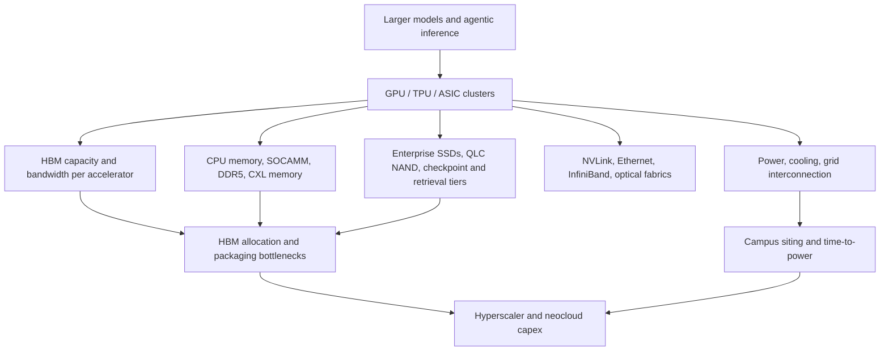
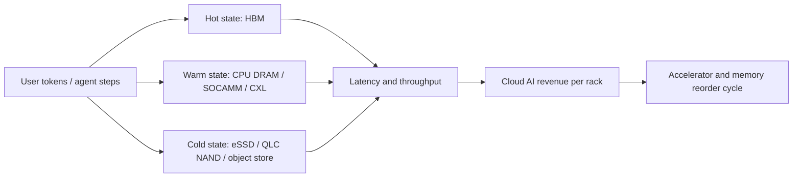

# AI Datacenter Demand: How Compute Buildout Pulls HBM, DRAM, NAND, CXL, And Power

AI datacenter demand is the macro driver behind the current memory cycle because it converts model scale, inference traffic, and cloud competition into a hard bill of materials. The unit of demand is no longer a server DIMM or a client SSD. It is a rack-scale or campus-scale AI factory that consumes accelerators, HBM stacks, CPU memory, CXL expansion, enterprise SSDs, networking, liquid cooling, transformers, switchgear, and power contracts as one coupled system. Microsoft said on January 3, 2025 that it was on track to invest approximately $80 billion in FY2025 to build AI-enabled datacenters for model training and AI/cloud deployment, with more than half in the United States.[^S260] OpenAI and SoftBank announced Stargate on January 21, 2025 as a new company intending to invest $500 billion over four years in U.S. AI infrastructure for OpenAI, starting with $100 billion immediately.[^S263] Those figures do not map one-for-one to memory revenue, but they explain why memory vendors shifted wafer starts, packaging capacity, and customer negotiations toward AI infrastructure.

The most important modeling shift is that AI capex is constrained by several serial bottlenecks at once. If GPUs are available but HBM is not, the accelerator cannot ship. If HBM ships but CoWoS-like package capacity, burn-in, or known-good-die test lags, the rack slips. If racks are ready but transformer lead times or grid interconnection delays persist, the campus slips. The International Energy Agency's 2025 Energy and AI report said global data-centre investment had nearly doubled since 2022 and reached roughly $500 billion in 2024; it also estimated data centres used about 415 TWh in 2024, or around 1.5% of global electricity consumption.[^S261] By 2030, IEA expected data-centre electricity use to more than double to around 945 TWh, with AI as the most important growth driver.[^S261] For memory, that means demand is tied to physical infrastructure delivery, not only to model hype.

## The Demand Stack

AI datacenter memory demand begins at the accelerator package. NVIDIA's March 18, 2024 Blackwell launch described the GB200 NVL72 as a liquid-cooled rack-scale system with 72 Blackwell GPUs, 36 Grace CPUs, fifth-generation NVLink, 1.4 exaflops of AI performance, and 30 TB of fast memory.[^S058] That one rack reframes HBM as utilization insurance: every idle tensor core is expensive, so the customer pays for enough bandwidth and capacity to keep accelerators fed. NVIDIA also said Blackwell would be adopted by major cloud providers and AI companies including AWS, Google, Meta, Microsoft, OpenAI, Oracle, Tesla, and xAI.[^S058] Demand therefore propagates from a small number of platform launches into many customer procurement programs.

The next layer is platform-specific memory attach. Micron announced on March 16, 2026 that its 36 GB 12-high HBM4 for NVIDIA Vera Rubin was in high-volume production, with more than 2.8 TB/s per stack, over 11 Gb/s pin speeds, a 2.3x bandwidth gain, and more than 20% better power efficiency versus its HBM3E reference point.[^S159] The same release said Micron had shipped 48 GB 16-high HBM4 samples, had SOCAMM2 in high-volume production in capacities spanning 48 GB to 256 GB, and had a PCIe Gen6 9650 data-center SSD delivering up to 28 GB/s sequential reads and 5.5 million random-read IOPS.[^S159] The important signal is portfolio breadth: Rubin pulls not only HBM4, but also low-power CPU-adjacent memory and high-throughput SSDs.

HBM demand is especially nonlinear because the stack count per package, the capacity per stack, and the package's launch volume multiply. A 12-high 36 GB stack and a 16-high 48 GB stack use different die counts, different assembly process windows, and different thermal envelopes. If a GPU generation moves from eight HBM placements to twelve, or a rack-scale architecture doubles the number of accelerators per domain, demand rises before end-customer workloads have changed. Conversely, if a package is simplified to improve manufacturability, HBM demand can fall even when AI service demand stays strong. This is why public HBM roadmaps and customer qualification milestones carry macro value.

## Hyperscalers, Neoclouds, And Reservation Behavior

Hyperscalers entered 2025-2026 treating AI infrastructure as a strategic input rather than an ordinary cloud capacity line. Microsoft disclosed the approximate $80 billion FY2025 AI datacenter investment plan in January 2025, framing datacenters as the foundation for training and deploying AI and cloud applications.[^S260] OpenAI's Stargate announcement added a separate, OpenAI-specific infrastructure vehicle with SoftBank, Oracle, MGX, Arm, Microsoft, NVIDIA, Oracle, and OpenAI named as funders or key initial technology partners, and Texas as the initial buildout geography.[^S263] These commitments pressure memory supply before revenue is realized because cloud operators need purchase agreements, qualification slots, and delivery windows years ahead of service monetization.

Neoclouds and build-to-suit colocation providers intensify the effect. They buy GPU capacity to resell training and inference service, often financing hardware and datacenter shells with customer contracts. That makes memory demand less visible than a direct hyperscaler order but still real: a CoreWeave-type or Oracle-type deployment ultimately consumes the same HBM stacks, server DRAM, SSDs, networking optics, power electronics, and cooling hardware. McKinsey's data-center analysis noted that demand for global data-center capacity could grow 19-22% annually from 2023 to 2030, reaching 171-219 GW, with a possible high case of 298 GW.[^S262] It also estimated AI-ready capacity demand could grow 33% annually in a midrange case and represent around 70% of total data-center capacity demand by 2030.[^S262]

Reservation behavior is the bridge between macro capex and memory pricing. April 2026 reporting said Samsung and SK hynix warned AI-driven memory shortages could last into 2027 and beyond, with customers already reserving supply years ahead.[^S077] That is rational if a cloud operator believes GPU fleet monetization is constrained by HBM supply. A reserved HBM allocation protects a much larger AI rack investment. It also shifts bargaining power toward the memory vendor that can demonstrate yield, stack height, thermal behavior, platform certification, and delivery reliability.

## Inference Changes The Mix

Training demand explains the first wave of AI infrastructure, but inference is changing the memory mix. Training is batchable, can tolerate more remote siting, and is dominated by large accelerator clusters. Inference adds latency, burstiness, geographical distribution, KV-cache growth, retrieval, and user-facing service-level obligations. Long-context models and agentic workflows expand memory pressure because active sessions preserve state, intermediate tool outputs, and retrieved context. ITME, a June 2026 paper on inference tiered memory expansion, argued that LLM systems are moving beyond individual-server capacity toward shared context layers and evaluated CXL-hybrid memory with SK hynix CMM and PCIe Gen5 NVMe SSDs, reporting up to 35.7% throughput improvement in its setup.[^S246]

That makes AI memory demand broader than HBM. HBM remains the accelerator-local tier for bandwidth-sensitive tensors and KV cache. CPU memory and low-power modules hold orchestration, host-side cache, metadata, and model-serving support. CXL memory can absorb colder or more predictable state when software can manage latency. Enterprise SSDs and QLC NAND hold checkpoints, embeddings, vector databases, training corpora, model shards, and persistent cache. See [04-hbf-emerging-tech/03-hbf-vs-hbm-vs-cxl.md](../04-hbf-emerging-tech/03-hbf-vs-hbm-vs-cxl.md) for the technology comparison; this file's macro point is that inference monetization can pull all tiers at once.

## Power And Time-To-Capacity

AI datacenter demand cannot be modeled only from accelerator purchase orders. Power and cooling decide when purchased memory becomes productive. IEA estimated that around 20% of planned data-centre projects could be at risk of delays unless grid risks are addressed, and noted that transmission lines in advanced economies can take four to eight years while wait times for transformers and cables doubled over the previous three years.[^S261] McKinsey similarly described average rack power densities more than doubling in two years to 17 kW per rack, rising toward 30 kW by 2027, while model-training racks can exceed 80 kW and GB200-class systems can require up to 120 kW per rack.[^S262] Those numbers matter to memory because HBM growth can be deferred by facility constraints even when customer demand is real.

Liquid cooling is therefore part of the memory demand function. Higher HBM bandwidth and stack height raise package heat density, but AI racks also concentrate CPUs, switches, NICs, optics, SSDs, voltage regulators, and power shelves. McKinsey described direct-to-chip liquid cooling as commonly deployed for 60-120 kW rack densities and immersion as technically capable of 100 kW-plus racks, with dual-phase immersion used above 150 kW in some cases.[^S262] A memory vendor that improves HBM power efficiency, server DRAM watts per GB, SSD performance per watt, or thermal telemetry can therefore help unlock deployable rack density. Micron's 2026 Vera Rubin release explicitly paired HBM4 power efficiency, SOCAMM2, and liquid-cooled PCIe Gen6 SSD positioning inside the same AI infrastructure story.[^S159]

## Market Implications

The first implication is mix. AI datacenter demand raises the share of bits sold as premium HBM, high-capacity server DRAM, SOCAMM-like low-power modules, and enterprise SSDs. Commodity PC and handset memory can remain weak while the industry reports tightness because the scarce inputs are not identical. HBM uses advanced DRAM die, TSVs, stacking, underfill, thermal materials, high-end test, and customer qualification capacity. Enterprise SSDs need NAND, controllers, firmware, power-loss protection, validation, and hyperscaler certification. A cycle can therefore be tight in AI memory while loose in consumer memory, or vice versa.

The second implication is duration. If data-center capacity demand grows into the 2030 window described by McKinsey and IEA, memory suppliers will not treat AI as a one-year inventory correction.[^S261][^S262] They will build packaging lines, TSV capacity, high-end test capability, and geographically diversified fabs. But those additions arrive with lags. The capital intensity and qualification burden make supply response slower than a spot-price chart suggests.

The third implication is attach-rate leverage. A small change in HBM content per accelerator can matter more than a large change in unit shipments for lower-value memory. If an accelerator platform moves from 192 GB to 288 GB, or from 12-high stacks to 16-high stacks, the incremental DRAM die pull is immediate. The same is true for host memory. Micron's SOCAMM2 comments around Vera Rubin matter because they point to system memory becoming part of the accelerator platform, not a generic server afterthought.[^S159] This is also why the CPU side should not be ignored. AI racks still need host memory for scheduling, preprocessing, storage metadata, network stacks, virtualization, security, and failure recovery. A GPU-rich rack with inadequate host memory can strand expensive accelerators.

Attach-rate math should be done at rack and campus level. The Blackwell NVL72 reference point of 72 GPUs and 30 TB of fast memory gives a rack-scale denominator.[^S058] If an operator deploys hundreds or thousands of comparable racks, even modest changes in HBM stack count, SOCAMM capacity, or SSD cache depth become large memory orders. At campus scale, the relevant question is not only how many accelerators are installed. It is how much memory is installed per megawatt and how much revenue that memory enables per megawatt. This framing explains why memory power efficiency receives unusual attention in AI releases. Every watt saved in HBM, DRAM, or SSDs can be reallocated to compute, cooling margin, or rack density.

The fourth implication is monetization risk. AI capex can outrun revenue, and infrastructure buyers may over-order if they extrapolate early model growth too aggressively. The risk is amplified when datacenter shells, GPUs, HBM, power contracts, and financing are committed before utilization is proven. Stargate-scale and hyperscaler-scale announcements are important because they validate infrastructure intent, but they are not the same as realized token revenue.[^S263] If model demand disappoints, cloud buyers could defer orders, lease excess capacity, or pressure suppliers on price. That would hit the highest-beta parts of the memory stack first: HBM allocation premiums, advanced packaging urgency, and high-performance enterprise SSD mix.

The counterweight is elasticity. Software efficiency, smaller models, sparsity, quantization, distillation, and inference scheduling can reduce memory intensity per token, but lower cost per token usually expands usage. If token volume rises faster than efficiency, aggregate memory demand still increases. ITME's 2026 CXL-hybrid memory work is a useful example: moving some inference state into tiered memory may reduce pressure on local HBM, yet it also makes larger serving contexts economically possible and can pull CXL memory plus SSDs into the architecture.[^S246] For memory investors and semicap suppliers, the right KPI is not only model parameter count. It is deployed accelerator count, HBM GB per accelerator, HBM bandwidth per watt, CPU memory per rack, SSD TB per rack, power availability, and sustained utilization.

## KPI Watchlist

| KPI | Why It Matters | Memory Read-Through |
|---|---|---|
| Hyperscaler AI capex guidance | Measures willingness to keep building AI capacity | Pulls HBM, server DRAM, SSDs, networking, and power gear |
| HBM stack count per accelerator | Converts platform roadmap into die and package demand | Drives DRAM wafer allocation and advanced packaging |
| HBM GB per rack | Links accelerator density to memory content | Measures demand quality, not only units |
| Inference token volume | Determines recurring utilization after training | Pulls KV cache, CXL memory, and SSD tiers |
| Grid interconnection lead time | Determines when capex becomes revenue-generating capacity | Can delay realized memory shipments |
| Liquid-cooling adoption | Enables higher rack density and sustained performance | Supports hotter HBM and higher-power packages |
| Supplier reservation comments | Reveals whether customers are securing future supply | Early indicator of shortage duration |

The base case is that AI datacenter demand remains the dominant macro support for memory through the next buildout phase. The bull case is that inference turns AI from a training-cycle capex surge into a recurring, token-driven infrastructure business that continuously absorbs HBM, CXL, server DRAM, and SSD capacity. The bear case is not that AI disappears; it is that power, financing, utilization, and software efficiency reduce the rate at which new AI datacenters convert into memory orders. The practical conclusion is narrower: memory demand analysis must start with AI infrastructure architecture, not with historical PC-and-smartphone bit growth.

## Sources

[^S058]: NVIDIA Blackwell Platform Arrives to Power a New Era of Computing, NVIDIA Newsroom, published 2024-03-18, https://nvidianews.nvidia.com/news/nvidia-blackwell-platform-arrives-to-power-a-new-era-of-computing
[^S077]: Samsung and SK hynix warn AI-driven memory shortages could last until 2027 and beyond, Tom's Hardware, published 2026-04-30, https://www.tomshardware.com/tech-industry/artificial-intelligence/samsung-and-sk-hynix-warn-ai-driven-memory-shortages-could-last-until-2027-and-beyond-as-hbm-demand-explodes-customers-already-reserving-supply-years-ahead-while-the-wider-dram-market-begins-to-tighten
[^S159]: Micron in High-Volume Production of HBM4 Designed for NVIDIA Vera Rubin, PCIe Gen6 SSD and SOCAMM2, Micron Investor Relations, published 2026-03-16, https://investors.micron.com/news-releases/news-release-details/micron-high-volume-production-hbm4-designed-nvidia-vera-rubin
[^S246]: ITME: Inference Tiered Memory Expansion with Disaggregated CXL-Hybrid Memories, arXiv, published 2026-06-10, https://arxiv.org/abs/2606.12556
[^S260]: The golden opportunity for American AI, Microsoft On the Issues, published 2025-01-03, https://blogs.microsoft.com/on-the-issues/2025/01/03/the-golden-opportunity-for-american-ai/
[^S261]: Energy and AI, International Energy Agency, published 2025, https://www.iea.org/reports/energy-and-ai/executive-summary
[^S262]: AI data center growth: Meeting the demand, McKinsey & Company, published 2024-10-29, https://www.mckinsey.com/industries/technology-media-and-telecommunications/our-insights/ai-power-expanding-data-center-capacity-to-meet-growing-demand
[^S263]: Announcing The Stargate Project, OpenAI, published 2025-01-21, https://openai.com/index/announcing-the-stargate-project/
