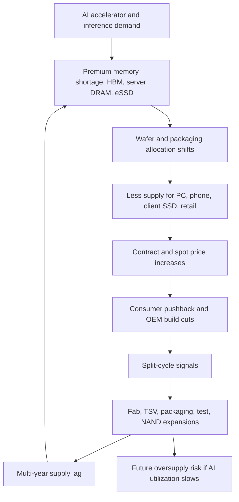
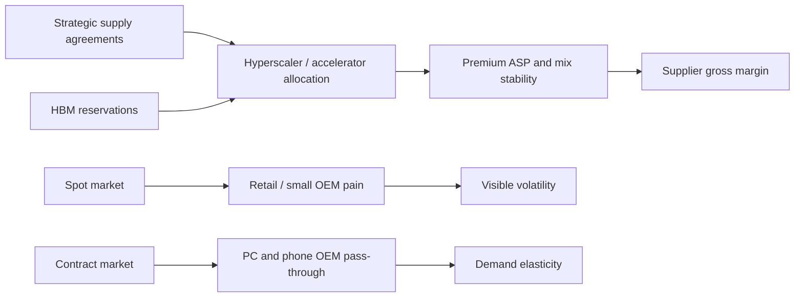

# Supply-Demand Cycle: Why AI Memory Can Stay Tight While Consumer Memory Cracks

The memory cycle has always been violent because supply is capital intensive, demand is cyclical, and pricing is set at the margin. The 2025-2026 cycle is more complicated than the classic PC-and-smartphone cycle because AI created a split market: HBM, server DRAM, SOCAMM-style low-power server modules, and enterprise SSDs are tight, while consumers are increasingly resisting pass-through pricing. July 2026 TrendForce-linked reporting said conventional DRAM contract prices were expected to rise 13-18% quarter-over-quarter in Q3 2026 and NAND Flash contract prices 10-15%, a slowdown from roughly 60% jumps in Q2 2026 but still a price increase.[^S264] The same report said the moderation was driven by consumer electronics buyers reaching affordability limits rather than by an improved supply situation.[^S264]

## A Split Cycle, Not A Uniform Shortage

The core mistake is to model "memory" as one commodity. DRAM, NAND, HBM, server RDIMMs, LPDDR, GDDR, and enterprise SSDs share some upstream fab constraints, but they do not clear in one market. AI demand pulls high-margin products first. HBM consumes advanced DRAM die, TSV, thinning, stacking, underfill, high-end test, and customer qualification capacity. Server DDR5 and SOCAMM-like products consume advanced DRAM bits and module/test capacity. Enterprise SSDs consume NAND, controllers, firmware validation, and power-loss-protection BOM. Client SSDs and retail DRAM then compete for residual supply and face price resistance.

That explains the odd macro optics. Prices can still rise even when notebook and smartphone OEMs are cautious. TrendForce's July 2026 pricing survey, as summarized by Tom's Hardware, said server-side demand was expected to remain healthy through 2027 as CPU availability supported AI server deployments around x86 processors and RDIMMs, while consumer markets showed weaker ability to accept additional price increases.[^S264] It also said PC manufacturers had accumulated client SSD inventory in the first half of 2026, making them less willing to accept another round of price increases, even as enterprise storage continued to benefit from AI infrastructure spending.[^S264]

Samsung and SK hynix's earlier 2026 shortage commentary fits the same pattern. April 2026 reporting said the companies warned AI-driven memory shortages could last into 2027 and beyond, with customers already reserving supply years ahead as HBM demand exploded.[^S077] That is not a normal seasonal inventory cycle. It is a platform reservation cycle in which a cloud or accelerator customer secures scarce memory before the compute platform ships. For HBM suppliers, the reservation reduces demand uncertainty. For downstream buyers of commodity memory, it reduces available flexibility.

## Price Signals And Their Limits

The Q2-to-Q3 2026 price pattern is an important signal. A 60% quarterly price jump followed by projected Q3 increases of 13-18% for conventional DRAM and 10-15% for NAND does not mean the shortage is over.[^S264] It means the marginal buyer is becoming less able to absorb the next step. In commodity memory, price is both a rationing tool and a destroyer of demand. PC OEMs can reduce DRAM content, delay refresh cycles, promote lower-memory configurations, or push price increases to consumers. Smartphone vendors can cut production, down-bin memory configurations, or raise handset prices. Retail flash and USB products can stall because the consumer does not value memory scarcity the way a cloud operator values accelerator utilization.

Server memory behaves differently because the value of the system being protected is higher. If a GPU rack is waiting on HBM or RDIMMs, the buyer loses access to compute revenue or strategic AI capacity. That creates a willingness to sign long-term agreements, reserve supply, and tolerate higher pricing. Micron's June 24, 2026 fiscal Q3 release explicitly framed the quarter around "transformational Strategic Customer Agreements"; it reported revenue of $41.46 billion, up from $23.86 billion in the prior quarter and $9.30 billion in the year-earlier period, and CEO Sanjay Mehrotra said multi-year strategic agreements should improve durability and predictability.[^S158] Those agreements can cap some near-term price volatility for key customers while locking in allocation for the supplier.

This makes spot prices less informative than usual. Spot DRAM can spike because brokers and smaller OEMs are squeezed, but strategic customers may be protected by supply agreements. Conversely, a spot decline in a narrow channel may not imply broad relief if HBM and server DDR5 remain reserved. The right dashboard separates contract pricing, spot pricing, mix, and customer class.

## Supply Response: Why It Takes Years

Memory supply cannot respond like software capacity. DRAM and NAND fabs need cleanroom construction, process transfer, equipment installation, yield learning, customer qualification, and product-specific packaging/test readiness. Even when a company announces a plant, the useful output may not arrive in the same cycle. Micron's January 2026 agreement to acquire a PSMC-linked Taiwan facility was reported as unlikely to ease the memory supply crisis until 2027 at the earliest.[^S168] That is the correct intuition: existing shells and assets help, but conversion, tooling, staffing, and qualification still take time.

The Korea-side response is large. June 2026 reporting said South Korea unveiled a roughly $520 billion Samsung/SK hynix memory investment plan that included four new fabs and HBM facilities with government support.[^S156] Separate July 2026 reporting described a very large SK hynix Korean investment plan spanning Cheongju NAND expansion and the Yongin semiconductor cluster for DRAM.[^S150] These numbers show that the industry understands the shortage is strategic, not only cyclical. They also show why oversupply risk eventually returns: once memory makers and governments all expand to solve a shortage, supply can arrive after demand growth has moderated.

Vendor results show why management teams are willing to take that risk. SK hynix's FY2025 release said record annual results were driven by AI memory competitiveness and high value-added products including HBM, while Samsung's FY2025 release framed memory around high value-added products and the need to respond to server and AI demand.[^S144][^S151] In other words, the profit pool is telling suppliers to prioritize AI mix even when the downstream consumer market is already flashing elasticity warnings.

Advanced packaging is the tighter near-term valve. A new DRAM wafer line is not enough if TSV, wafer thinning, stacking, underfill, burn-in, and package test are short. HBM therefore adds a back-end bottleneck to a historically front-end-heavy cycle. Conventional DRAM oversupply can coexist with HBM shortage if DRAM die or packaging flows are not qualified for high-stack products. Conversely, an HBM packaging overbuild can become a problem if customer roadmaps change stack counts or if AI capex slows.

## NAND Is Pulled By AI But Still Vulnerable

NAND's role is more ambiguous than DRAM's. AI infrastructure pulls enterprise SSDs, QLC capacity, checkpoint storage, vector databases, and high-throughput PCIe drives. Micron's fiscal Q3 2026 release said its G9-based PCIe Gen6 high-performance SSD was in high-volume production, that it had begun shipments of a high-capacity 245 TB QLC SSD, and that a Gen5 QLC PC client SSD had achieved lead customer qualification.[^S158] Those product notes show AI and client storage moving in different directions at the same time.

The risk is that NAND has a broader and more elastic base. Client SSDs, retail cards, USB drives, and low-end embedded storage can stop accepting price increases faster than enterprise SSD customers. TrendForce-linked July 2026 reporting said client SSD inventories accumulated during the first half of 2026 and that suppliers became more flexible in negotiations as PC manufacturers resisted another price round.[^S264] That is classic NAND cyclicality: enterprise demand can be strong, but the consumer side can still carry excess inventory or downshift capacity per device.

NAND also has a different supply architecture. 3D NAND layer scaling, wafer bonding, CMOS-bonded-array architectures, and QLC/PLC transitions can add effective bit output even without the same die-count logic as DRAM. When NAND vendors push layer count and bit density, bit supply can increase sharply. If AI storage demand absorbs it, margins hold. If not, NAND pricing falls faster than DRAM because consumer and client storage are highly price sensitive.

## Demand Destruction And Substitution

The 2026 shortage is already creating substitution behavior. Meta's June 2026 CXL reuse story showed the cost pressure directly: reporting said Meta was reusing older DDR4 server memory in new DDR5-only systems through a custom CXL 2.0 ASIC, using legacy DDR4-2400 with DDR5-6400 hosts to reduce the memory cost burden.[^S104] That is not a mass-market solution for every buyer, but it is a clear sign of demand destruction and engineering substitution. When memory prices rise enough, sophisticated buyers do not simply pay. They redesign.

Substitution can take several forms. PC OEMs reduce memory capacity or offer fewer high-end SKUs. Phone OEMs use lower LPDDR capacity or shift model mix. Datacenter customers use CXL pools, tiered memory, lower-cost SSD tiers, software compression, quantization, smaller models, and scheduling changes. Consumer buyers delay upgrades. Each action reduces demand at the margin, but the reductions are not evenly distributed. AI buyers may reduce noncritical memory while still reserving HBM. Consumer buyers may reduce units and memory content simultaneously.

The important cycle question is not whether demand destruction appears; it already has. The question is whether it appears in the same product classes where supply is being added. If demand destruction is mostly in client SSDs and PC DRAM while capex is targeted at HBM and high-end server memory, the shortage can persist in premium tiers. If AI customers begin reducing HBM orders or defer platform deployments, then the peak-cycle risk becomes much sharper.

## Supplier Margins And Capital Discipline

Micron's Q3 FY2026 gross-margin structure illustrates the leverage. The company reported GAAP gross margin of 84.6% and non-GAAP gross margin of 84.9% for the quarter, with business-unit gross margins of 83% in Cloud Memory, 87% in Core Data Center, 87% in Mobile and Client, and 79% in Automotive and Embedded.[^S158] Those margins are extraordinary for memory and show how pricing, mix, and supply discipline can overpower historical cycle averages. The same release guided fiscal Q4 2026 revenue to $50.0 billion plus or minus $1.0 billion and gross margin to approximately 86%.[^S158]

High margins are both signal and risk. They validate scarcity and fund new capacity, but they invite expansion. In the old memory cycle, suppliers overbuilt when margins were high, then cut capex after prices collapsed. In the AI cycle, the overbuild risk is harder to read because long-term strategic agreements and government-backed fab programs can make supply response look disciplined even as the absolute capital base rises. The cycle may therefore peak later, but with more structural capacity once it does.

Supplier behavior should be monitored through four lenses. First, capex intensity: are vendors adding wafer starts, packaging, test, or all three? Second, mix: is the incremental output HBM/server or commodity bits? Third, customer commitment: are agreements take-or-pay, reservation-based, or soft forecasts? Fourth, utilization: are cloud customers consuming the capacity they reserved, or are they warehousing optionality?

## Cycle Scenarios

| Scenario | Trigger | DRAM Impact | NAND Impact | Semicap Impact |
|---|---|---|---|---|
| Premium shortage persists | AI accelerator and inference demand keeps absorbing HBM/server supply | HBM and server DDR stay tight; commodity DRAM remains squeezed | Enterprise SSDs outperform client SSDs | TSV, packaging, test, WFE, and materials stay strong |
| Split-cycle plateau | Consumer demand weakens enough to slow pricing but AI remains firm | Contract increases moderate; spot volatility remains high | Client SSD pricing softens while eSSD remains supported | Orders shift toward bottleneck tools, less toward broad capacity |
| AI capex digestion | Cloud customers slow new deployments or monetize existing capacity poorly | HBM allocation premiums compress first | eSSD orders pause after inventory builds | Packaging and test order timing becomes riskier |
| Broad oversupply | Multiple fab and packaging expansions arrive after demand normalizes | DRAM ASPs fall across tiers, with HBM cushioned by qualification | NAND falls faster because bit supply is more elastic | Memory WFE digestion cycle begins |

The base case is a split-cycle plateau rather than an immediate collapse. AI demand and long-term agreements keep premium memory tight, while consumer markets resist further increases. The bull case for suppliers is that inference demand turns into durable recurring utilization and absorbs new capacity as it arrives. The bear case is that high prices, efficiency gains, and slower AI monetization converge just as supply expansions reach useful output.

## KPI Watchlist

| KPI | Read-Through |
|---|---|
| Q/Q DRAM and NAND contract-price increases | Shows whether scarcity is broadening or consumer elasticity is biting |
| HBM sold-out commentary and reservation windows | Best indicator of premium DRAM durability |
| Server RDIMM and SOCAMM lead times | Captures host-memory tightness beyond HBM |
| Client SSD channel inventory | Early warning for NAND oversupply |
| Consumer OEM build plans | Shows demand destruction from price pass-through |
| Memory supplier capex by wafer, packaging, and test | Separates front-end bit supply from HBM bottlenecks |
| Strategic customer agreement disclosure | Indicates whether pricing power is converting into durable allocation |
| Cloud utilization and AI revenue per rack | Tests whether reserved memory is being monetized |

The practical conclusion is that the 2026 memory cycle should be modeled as a mix cycle first and a bit cycle second. The headline shortage is real, but its location matters. HBM and server memory can stay scarce while consumer memory demand softens. NAND can benefit from AI storage while client SSDs push back. Suppliers can report record margins while investors worry about the next downcycle. That tension is not a contradiction; it is the memory cycle behaving normally inside a new AI-shaped demand stack.

## Sources

[^S077]: Samsung and SK hynix warn AI-driven memory shortages could last until 2027 and beyond, Tom's Hardware, published 2026-04-30, https://www.tomshardware.com/tech-industry/artificial-intelligence/samsung-and-sk-hynix-warn-ai-driven-memory-shortages-could-last-until-2027-and-beyond-as-hbm-demand-explodes-customers-already-reserving-supply-years-ahead-while-the-wider-dram-market-begins-to-tighten
[^S104]: Meta reuses old DDR4 server memory in new DDR5 servers using Vistara CXL 2.0 ASIC, Tom's Hardware, published 2026-06-30, exact day inferred from relative publication age, https://www.tomshardware.com/pc-components/dram/meta-fights-soaring-hardware-costs-by-reusing-old-ddr4-server-memory-in-new-ddr5-only-servers-custom-cxl-2-0-chip-marries-legacy-ddr4-2400-with-cutting-edge-ddr5-6400
[^S144]: SK hynix Announces FY25 Financial Results, SK hynix Newsroom, published 2026-01-28, https://news.skhynix.com/sk-hynix-announces-fy25-financial-results/
[^S150]: SK hynix to invest $712.5 billion in South Korean operations, Tom's Hardware, published 2026-07-02, https://www.tomshardware.com/pc-components/dram/sk-hynix-to-invest-usd712-5-billion-in-south-korean-operations-cheongju-nand-expansion-yongin-semiconductor-cluster-for-dram-detailed
[^S151]: Samsung Electronics Announces Fourth Quarter and FY 2025 Results, Samsung Global Newsroom, published 2026-01-29, https://news.samsung.com/global/samsung-electronics-announces-fourth-quarter-and-fy-2025-results
[^S156]: South Korea unveils $520 billion Samsung/SK hynix memory investment plan, Tom's Hardware, published 2026-06-29, https://www.tomshardware.com/tech-industry/semiconductors/south-korea-unveils-usd520-billion-investment-plan-with-samsung-and-sk-hynix-to-expand-memory-chip-dominance-plan-includes-four-new-fabs-and-hbm-facilities-amid-strong-government-support
[^S158]: Micron Technology, Inc. Reports Record Results for the Third Quarter of Fiscal 2026, Micron Investor Relations, published 2026-06-24, https://investors.micron.com/news-releases/news-release-details/micron-technology-inc-reports-record-results-third-quarter
[^S168]: Micron signs a deal to acquire a chip foundry in Taiwan for $1.8 billion, PC Gamer, published 2026-01-19, https://www.pcgamer.com/hardware/memory/micron-signs-a-deal-to-acquire-a-chip-foundry-in-taiwan-for-usd1-8-billion-though-it-wont-make-a-dent-in-the-memory-supply-crisis-until-2027-at-the-earliest/
[^S264]: Memory price surge begins to cool as consumers hit affordability limit, Tom's Hardware, published 2026-07-04, https://www.tomshardware.com/pc-components/ram/memory-price-surge-begins-to-cool-as-consumers-hit-affordability-limit-ai-demand-still-keeps-dram-and-nand-prices-climbing-through-q3-2026
