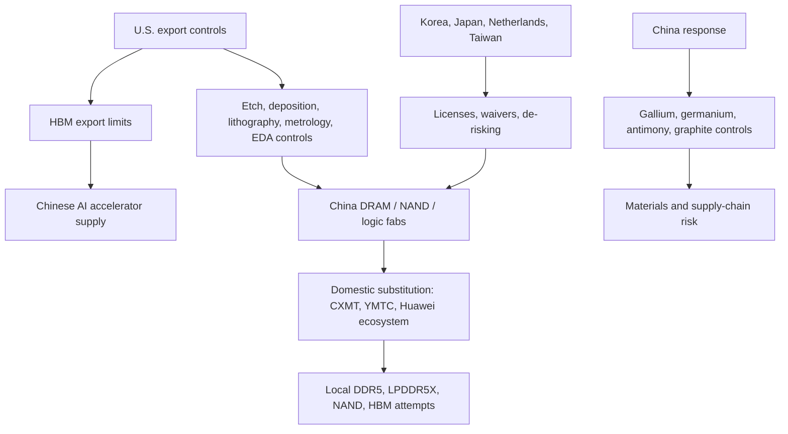
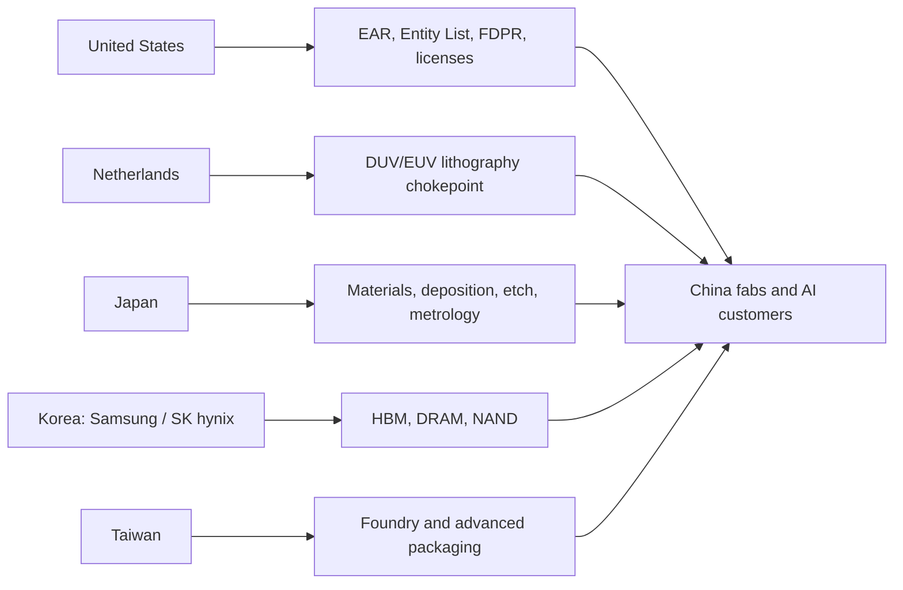

# Geopolitics And Export Controls: Memory As A Strategic Chokepoint

Memory is now part of the strategic compute stack. The same AI systems that pull GPUs, custom accelerators, advanced packaging, and grid power also pull HBM, server DRAM, CXL memory, enterprise SSDs, and the equipment needed to make them. Export controls therefore affect memory in two ways: directly, by restricting HBM and semiconductor manufacturing equipment, and indirectly, by changing where global vendors can build, upgrade, qualify, and sell memory products. The December 2024 U.S. rules expanded controls to high-bandwidth memory and many Chinese chipmaking entities; Associated Press reported that the U.S. added about 140 companies to the Entity List and limited HBM exports to China because HBM is needed for AI workloads.[^S186]

## Control Logic

The policy logic is straightforward: advanced AI requires accelerators; advanced accelerators require HBM; HBM and advanced memory require leading DRAM processes, TSV/stacking, package test, and a toolchain that remains heavily dependent on U.S., Dutch, Japanese, Korean, and Taiwanese chokepoints. By controlling accelerators, HBM, equipment, software, and support services, Washington tries to slow China's ability to build both the chips and the domestic manufacturing base behind them. The December 2024 package extended beyond finished AI chips into HBM and semiconductor manufacturing tools, which matters because China can sometimes substitute a lower-end accelerator but cannot easily substitute high-yield HBM stacks or advanced etch/deposition/metrology ecosystems.[^S186]

The memory-specific angle is different from logic. China can build meaningful capacity in legacy and mainstream memory, but HBM sits at the intersection of advanced DRAM die, 3D packaging, test, thermal design, and customer platform qualification. Export controls therefore do not need to stop all Chinese DRAM to matter. They need only slow the pieces that make premium AI memory reliable at scale. That is why HBM has become a named policy target rather than a footnote inside generic semiconductor controls.

## South Korean China Fabs

The hardest operational issue is that the global memory supply chain is not geographically clean. Samsung operates a major NAND facility in Xi'an, while SK hynix operates DRAM in Wuxi and NAND in Dalian; December 2025 reporting said the U.S. granted Samsung and SK hynix annual 2026 licenses to ship chipmaking equipment to their China fabs after an older waiver system expired.[^S265] The same report said the licenses were intended to support continued operation and maintenance rather than unrestricted expansion, and that sensitive tools such as EUV remained off-limits.[^S265]

This creates a policy tradeoff. If the U.S. blocks too much tool flow into foreign-owned China fabs, global DRAM and NAND supply could tighten further, raising prices for U.S. consumers, automakers, cloud customers, and industrial users. If it allows too much, China-based capacity remains connected to a global toolchain that Washington wants to constrain. Annual licensing gives the U.S. recurring leverage, but it also adds uncertainty for Korean memory makers. Their China fabs are operational assets, not strategic abstractions. Tool approvals determine whether they can maintain yield, migrate nodes, repair tools, and avoid unplanned supply disruptions.

For investors, the China-fab issue should be modeled as a supply-risk variable. A license renewal is not the same as a permanent exemption. A denial, delay, or narrower license can change wafer output, product mix, or maintenance cadence. Conversely, a broad license can keep mature-node DRAM and NAND output flowing while still preventing advanced upgrades. That distinction matters for memory pricing: mainstream supply continuity can ease consumer markets even while HBM remains controlled.

## Chinese Substitution

China's memory substitution strategy is now visible in both DRAM and NAND. CXMT has presented DDR5 and LPDDR5X portfolios, and Chinese module brands have begun adopting domestic CXMT/YMTC silicon; June 2026 reporting said brands such as Gloway and KingBank were using CXMT 24 Gb chips for DDR5 modules up to 96 GB and that some global PC names were incorporating or qualifying CXMT memory.[^S191] YMTC has pushed NAND through Xtacking and domestic tool efforts; July 2025 reporting said YMTC was building production lines with homegrown tools and targeting a larger NAND share by late 2026.[^S187] May 2026 reporting said YMTC planned two additional Wuhan fabs using homegrown chipmaking tools.[^S188]

This substitution is strategically important even if it does not immediately displace the global leaders in premium AI memory. Domestic DDR5 and LPDDR5X can serve Chinese PCs, servers, industrial systems, and government procurement. Domestic NAND can serve client SSDs, embedded storage, and local cloud demand. July 2026 reporting that YMTC SSDs were appearing in retail Lenovo laptops shows how substitution can enter ordinary devices before it reaches top-tier global hyperscale qualification.[^S193] The near-term result is a two-track market: China-local supply can improve for mainstream devices while top-end HBM and leading-edge enterprise qualification remain constrained.

HBM is the bigger prize. September 2025 reporting said YMTC and CXMT were exploring cooperation to accelerate Chinese HBM production, combining YMTC's hybrid-bonding experience with CXMT's DRAM base.[^S255] That partnership logic makes sense because HBM is not just DRAM. It requires stacking, bonding, thermal design, test, and packaging know-how. But it also shows the difficulty: China has to coordinate multiple partially constrained ecosystems at once. Even if CXMT can make competitive DDR5-class die and YMTC can provide NAND-side bonding expertise, HBM platform qualification for advanced AI accelerators remains a steep climb.

## Materials Retaliation

Export controls also create retaliation risk upstream. After the December 2024 U.S. package, China announced restrictions on exports to the United States of gallium, germanium, antimony, and other high-tech materials, while scrutinizing graphite; AP reported the move as a response to U.S. semiconductor-related restrictions.[^S266] These materials are not all memory-specific in the same way HBM is, but they matter to the broader semiconductor and electronics supply chain. Gallium and germanium are associated with compound semiconductors, optics, and defense-relevant applications; antimony and graphite affect adjacent industrial and battery/materials chains.

The strategic lesson is that memory geopolitics is not one-directional. The U.S. and allies have equipment, software, IP, and advanced packaging chokepoints. China has scale, demand, downstream electronics manufacturing, and leverage in some critical materials. Controls can therefore reduce China's access to premium AI memory while raising uncertainty around materials availability, customer relationships, and end-market access for global suppliers.

## Allied Chokepoints

Memory controls only work if allies align. HBM suppliers are Korean and American, the most advanced lithography is Dutch, many materials and tools are Japanese, leading foundry capacity is Taiwanese, and much assembly/test capacity is in Taiwan, Korea, Southeast Asia, and China-linked ecosystems. A unilateral U.S. control can matter because U.S. technology is embedded in tools and design flows, but durable pressure requires coordination with Korea, Japan, the Netherlands, Taiwan, and key Southeast Asian manufacturing hubs.

The allied problem is incentives. Korea wants to preserve Samsung and SK hynix competitiveness, including China-fab continuity. Japan wants tool/materials revenue and supply-chain security. The Netherlands must balance ASML sales, EU policy, and U.S. pressure. Taiwan must protect TSMC and OSAT supply chains while managing cross-strait risk. The U.S. wants to preserve compute advantage and reduce China's military-relevant AI capability. These goals overlap, but they are not identical.

## Market Effects

The first market effect is supply fragmentation. A memory product can be acceptable in China-local systems but not acceptable for global OEMs, U.S. government procurement, or hyperscale AI clusters. Conversely, a U.S.- or Korea-sourced HBM stack can be technically best-in-class but unavailable to Chinese customers because of controls. This fragments pricing, qualification, and channel strategy. It also gives domestic Chinese vendors room to grow in local markets even while they remain behind at the premium edge.

The second effect is geography premium. Fabs, packaging lines, and test capacity in the United States, Korea, Japan, Taiwan, Singapore, and allied jurisdictions become more valuable because they are less exposed to China license renewal risk. Micron's U.S., Japan, Taiwan, and Singapore roadmap should be read partly through this lens; SK hynix's Indiana packaging plan and Korean Yongin/Cheongju investments also carry geopolitical value. The same asset can have different strategic value depending on whether it sits inside or outside an export-control chokepoint.

The third effect is substitution pressure. If HBM exports are restricted, Chinese AI companies may redesign around domestic accelerators, lower-bandwidth memory, larger clusters of less capable chips, quantization, sparsity, model distillation, or open-model ecosystems. A May 2026 arXiv paper on export controls argued that controls can raise Chinese development costs but can also push self-reliance and R&D.[^S267] A June 2026 arXiv paper argued U.S. policies may have accelerated China's open AI ecosystems by increasing the strategic value of open and locally adaptable systems.[^S268] These are academic arguments, not proof that controls fail, but they highlight the adaptation channel.

## What Controls Can And Cannot Do

Export controls are strongest when they target low-substitutability bottlenecks. In memory, that means the hardest nodes are not generic DDR4 modules or commodity client SSDs; they are HBM-class DRAM die, TSV-capable process integration, wafer thinning and bonding, high-end inspection/test, advanced EDA/IP, and the field history needed to qualify inside AI platforms. Controls can slow access to these pieces because the supplier base is concentrated and globally traceable. The December 2024 HBM restriction belongs in that category because HBM is physically embedded in AI accelerators and cannot be replaced with ordinary DIMMs without redesigning the accelerator architecture.[^S186]

Controls are weaker when they target products with broad substitutes or large local demand. China can buy or build mature DRAM, reuse older memory, accept lower bandwidth, route more traffic through SSD tiers, or use software to reduce memory intensity. It can also create protected domestic demand for CXMT and YMTC, allowing those vendors to learn through local shipments even if global qualification remains limited.[^S191][^S193] This is why export controls should be modeled as a cost and timing wedge, not as an absolute wall. The wedge can still be valuable: two years of delay in HBM or advanced NAND can matter enormously in an AI race.

Controls also create second-order inventory behavior. Chinese buyers may over-order before rule changes, route tools through third countries, or redesign procurement around license uncertainty. Foreign vendors may hold more buffer inventory near China fabs because annual approvals are less predictable than open-ended waivers.[^S265] Customers outside China may demand supply-chain representations proving that memory content, packaging, and test flows avoid restricted entities. These frictions raise working capital, compliance cost, and qualification complexity across the chain.

The final limit is political durability. A control that is technically elegant but commercially intolerable may be diluted; a control that allies do not enforce may leak; a control that cuts too deeply into consumer supply can create domestic backlash. Memory policy therefore sits between national security and inflation politics. Restricting HBM to China is easier to defend than disrupting mature NAND supply from a foreign-owned fab that helps stabilize global SSD pricing.

## Implications For Memory Vendors

For Samsung and SK hynix, export controls are both tailwind and risk. HBM restrictions protect premium supply from some Chinese demand, potentially preserving allocation for approved customers. But China fabs require recurring tool approvals, and China remains a large electronics and memory market. A policy shock can therefore help margins in one product class while creating operational risk in another.

For Micron, geopolitics reinforces U.S.-aligned capacity strategy and customer positioning, but it also increases exposure to retaliation and China access issues. Micron has already lived through China cybersecurity and procurement friction in prior years, and the current AI memory cycle makes national alignment more commercially important. The more memory becomes strategic, the less it can be treated as a globally neutral commodity.

For Chinese vendors, the opportunity is local substitution. CXMT and YMTC do not need to beat SK hynix HBM4 to matter. They can win share in Chinese DDR5 modules, LPDDR, client SSDs, government procurement, domestic servers, and eventually lower-tier AI systems. The strategic risk to incumbents is not immediate displacement at NVIDIA-class HBM. It is gradual erosion of China-local volume and the creation of a protected domestic ecosystem that improves cycle by cycle.

## KPI Watchlist

| KPI | Why It Matters |
|---|---|
| HBM export-control scope | Determines whether China can buy premium AI memory directly |
| Samsung/SK hynix China license renewals | Affects mature DRAM/NAND continuity and global supply risk |
| Entity List additions for memory/tool firms | Shows whether controls are moving deeper into the memory chain |
| CXMT DDR5/LPDDR qualification | Measures China-local DRAM substitution |
| YMTC NAND tool localization and fab ramps | Measures China-local NAND resilience |
| Domestic Chinese HBM samples | Tests whether DRAM plus bonding efforts are converging |
| Gallium/germanium/antimony/graphite restrictions | Captures retaliation and materials risk |
| Allied alignment among U.S., Korea, Japan, Netherlands, Taiwan | Determines whether controls bind or leak |

The base case is managed fragmentation: the U.S. and allies keep tightening around advanced HBM, AI accelerators, and leading-edge tools, while China expands domestic mainstream memory and pushes toward HBM substitutes. The bull case for incumbent global memory vendors is that controls preserve premium AI allocation and support allied capacity investments. The bear case is that controls accelerate Chinese self-reliance, fragment demand, and expose foreign-owned China fabs to recurring license risk. For the memory database, the practical conclusion is simple: memory geography, export jurisdiction, and customer eligibility now belong in every supply-demand model.

## Sources

[^S186]: US expands list of Chinese technology companies under export controls, Associated Press, published 2024-12-03, https://apnews.com/article/8f8ab1ab49b5bb57e5a290a3937fa939
[^S187]: China's YMTC moves to break free of U.S. sanctions by building production line with homegrown tools, Tom's Hardware, published 2025-07-21, https://www.tomshardware.com/pc-components/ssds/chinas-ymtc-moves-to-break-free-of-u-s-sanctions-by-building-production-line-with-homegrown-tools-aims-to-capture-15-percent-of-nand-market-by-late-2026
[^S188]: China's premier memory-maker YMTC plans two additional Wuhan fabs using homegrown chipmaking tools, Tom's Hardware, published 2026-05, exact day not captured in accessed search result, https://www.tomshardware.com/tech-industry/semiconductors/ymtc-planms-two-additional-wuhan-fabs
[^S191]: Chinese memory brands ditch Samsung and Micron for homegrown CXMT and YMTC silicon, Tom's Hardware, published 2026-06, exact day not captured in accessed search result, https://www.tomshardware.com/pc-components/ram/chinese-memory-vendors-snub-industry-giants-in-favor-of-homegrown-ram-chips-samsung-micron-and-sk-hynix-face-a-chinese-supply-chain-revolt
[^S193]: Chinese YMTC SSDs make their way into retail Lenovo laptops, Tom's Hardware, published 2026-07-05, https://www.tomshardware.com/pc-components/ssds/chinese-ymtc-ssds-make-their-way-into-retail-lenovo-laptops-media-outlet-slams-ymtc-pcie-4-0-drive-for-below-average-for-an-ssd-in-an-office-laptop-in-review
[^S255]: YMTC and CXMT team up to accelerate Chinese domestic HBM production, Tom's Hardware, published 2025-09, exact day not captured in accessed search result, https://www.tomshardware.com/pc-components/ram/ymtc-partners-with-cxmt-for-hbm
[^S265]: U.S. grants Samsung and SK hynix 2026 licenses for chipmaking tool shipments to China, Tom's Hardware, published 2025-12-30, https://www.tomshardware.com/tech-industry/us-grants-samsung-and-sk-hynix-2026-licenses-for-chipmaking-tool-shipments-to-china
[^S266]: China bans exports to US of gallium, germanium, antimony in response to chip sanctions, Associated Press, published 2024-12-03, https://apnews.com/article/6b4216551e200fb719caa6a6cc67e2a4
[^S267]: Strategic Stalemates: The Paradox of Export Controls in the U.S.-China AI Race, arXiv, published 2026-05-22, https://arxiv.org/abs/2605.23475
[^S268]: U.S. Policies Unintentionally Accelerated China's Open AI Ecosystems, arXiv, published 2026-06-14, https://arxiv.org/abs/2606.15999
