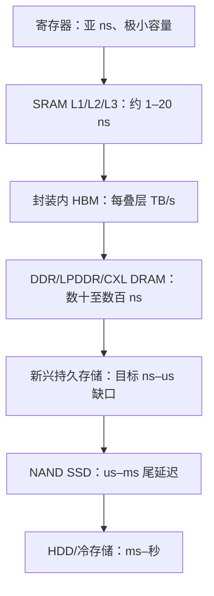

# 内存与存储基础

> [英文原文](../../01-overview/01-memory-storage-fundamentals.md)

本章定义后续资料所用的物理与架构术语。关注点并非简单区分易失与非易失内存，而是每种机制对芯片面积、刷新、耐久度、带宽密度、封装和系统瓶颈的实际影响。

## 执行地图

现代半导体存储构成一条容量更大、价格更低、速度更慢且持久性更强的层级。SRAM 由交叉耦合反相器构成，访问最快但单元面积最大；DRAM 以电容存电荷，在可按字节寻址的易失存储中密度最高，却需要刷新和模拟感测；NAND 通过晶体管串中的电荷/阈值状态实现最低单位比特成本，但需要块擦除和控制器管理。NOR 为代码保留随机读取与原地执行；MRAM、ReRAM、PCM 和铁电存储则尝试在避免 NAND 块管理负担的同时提供非易失性。AI 服务器同时需要 HBM 带宽、DDR 容量和 SSD 规模，使晶圆与封装产能的分配成为战略问题。[^S002][^S003][^S004][^S009]

## 单元级分类

### SRAM

主流 SRAM 缓存通常使用六晶体管锁存单元。供电存在时无需刷新，但面积远大于一晶体管 DRAM 单元，因此用于寄存器文件、L1/L2/L3 缓存、标签阵列、FIFO 和嵌入式缓冲，不用于 TB 级服务器内存。“静态”不代表持久：断电后状态通常丢失。[^S017]

SRAM 是延迟锚点。缓存未命中、转而访问 DRAM、CXL 内存或 NAND 时，系统不再只是算力受限。这解释了 AI 加速器为何既配置大型 SRAM 暂存区，也购买 HBM：前者实现确定的本地复用，后者提供极高的外部带宽密度。

### DRAM

DRAM 的典型 1T1C 单元以访问晶体管控制电容电荷。读取会在电路上扰动原状态，感测放大器判决后必须恢复数据；电容、泄漏、感测余量、刷新、行激活和扰动缓解因此都是产品价值的一部分。[^S016]

DDR 与 LPDDR 用更宽、分银行、节能的接口封装阵列。DDR5 引入更多子通道、模组电源管理、更大实用 DIMM 容量和更高传输率；LPDDR6 将移动及边缘 AI 内存推至 10,667–14,400 MT/s、四个 24 位子通道。[^S001][^S016]

DRAM 不再是一条单一大宗轴线：HBM 以每封装及每瓦带宽出售，DDR 销售 DIMM 容量，LPDDR 销售板级能耗与尺寸效率，CXL 销售池化容量。把晶圆从 DDR 转到 HBM 还需要良品筛选、TSV、基础逻辑、先进封装和客户认证，故 AI 导致的产品组合转移会收紧普通 DRAM。[^S009]

### NAND 闪存

NAND 通过浮栅或电荷俘获单元改变阈值电压，并将单元串联。其密度高，但介质只能按页读写、按块擦除；SSD 控制器/闪存转换层必须完成磨损均衡、坏块管理、垃圾回收、读重试和纠错。

由平面转向 3D NAND 后，缩放重心从光刻收缩改为垂直层数和字符串工程。竞争也转向层数、键合架构、单芯片密度、接口速度及企业 AI 存储能力。Kioxia 的 2D NAND 与早期 BiCS3 将在 2026–2028 年退出；BiCS9 使用 CBA 与 Toggle DDR 6.0，Micron 9650 使用 276 层 TLC、PCIe 6.0 x4，读取可达 28,000 MB/s。[^S004][^S005][^S006]

NAND 是容量引擎但并非廉价无限。2025–2026 年企业 SSD 价格因 AI 存储需求和高容量 NAND 供应限制剧烈波动；不同报告给出的 30 TB TLC 价格变化冲突，数据库应保留这种估算差异而非假定唯一价格。[^S007][^S008]

### NOR 与新兴非易失性存储

NOR 支持快速随机读取与原地执行，适用于启动 ROM、固件、汽车代码、工业控制器和 MCU；其角色是控制平面，而非超大规模容量层。[^S018]

MRAM 用磁隧道结，ReRAM 利用电阻变化，PCM 改变硫系材料相态，铁电存储使用可翻转极化。这些技术希望填补 DRAM 的字节可寻址性与 NAND 的持久经济性之间的空白，但必须同时在单元尺寸、耐久、保持、写入能耗、选择器、CMOS 兼容、测试成本和生态上胜过既有产品。研究显示潜力，也显示其距广泛替代仍有距离。[^S013][^S014][^S015]

## 实用层级（数量级）

| 层级 | 主要技术 | 作用 | 延迟 | 成本/GB |
|---|---|---|---|---|
| 寄存器、L1–L3 | SRAM | 当前操作数与热数据复用 | 亚 ns 至约 20 ns | 极高 |
| 封装内 HBM | 堆叠 DRAM + TSV | 加速器带宽池 | 数十至数百 ns | 高、受容量约束 |
| DDR/LPDDR | 1T1C DRAM | 主内存容量 | 数十至数百 ns | 中等 |
| CXL/池化内存 | 一致性互连后的 DRAM | 扩展或池化容量 | 高于本地 DDR | 中高 |
| 新兴持久层 | MRAM/ReRAM/PCM/铁电 | 小众持久及嵌入式 NVM | 目标 ns–us | 不确定 |
| NAND SSD | 3D NAND + 控制器 | 块存储、模型与检查点 | us–ms | 低于 DRAM但波动 |
| HDD/冷层 | 磁记录 | 批量与冷存储 | ms–秒 | 最低 |

典型公开示例为：L1 约 1 ns、L2 约 3.5 ns、L3 约 11.75 ns、DDR5 约 82.5 ns、NVMe SSD 约 0.2 ms、企业 HDD 约 4.16 ms；HBM4 的 2,048 位接口可使标准叠层接近 2 TB/s。[^S002][^S003][^S017]

## 浮栅、电荷俘获与控制器负担

浮栅把电子存于被介质隔离的导电多晶硅岛；电荷俘获把电荷存于局域陷阱（3D NAND 中常为氮化硅）。后者适合高 3D 串，避免完全隔离浮栅的一些缩放难题。高层 NAND 由此拉动深高深宽比刻蚀、沉积、沟道形成、阶梯接触、字符串选择和晶圆键合/阵列下 CMOS。[^S018]

易失性是系统契约。SRAM 不需刷新而面积昂贵；DRAM 需管理刷新与扰动；NAND 的块特性要求控制器隐藏介质复杂性；HBM 的封装成本要求加速器商权衡所购带宽。耐久度也不能用单个数字排序，必须注明节点、温度、保持、纠错目标、写放大和控制器策略。[^S007][^S008]

## 对半导体设备的意义

DRAM 缩放推动电容、高 k 介质、图形化和外围缩放；NAND 推动沉积与刻蚀；HBM 增加 TSV、减薄、微凸点/混合键合、底填、检测和良品测试。容量比特不能替代带宽比特：NAND 经控制器、ECC 与块协议交付，HBM 则经加速器旁的宽接口交付。资本开支必须按产品转换路径而非仅晶圆投片建模。

因此“内存”不是一个市场，而是受不同系统瓶颈筛选的一组物理机制：HBM 可售罄时普通 DRAM 仍可能配给，企业 SSD 可涨价而客户端需求变弱，研究型存储可形成嵌入式利基却不会立即取代 DRAM/NAND。

## 来源注释

[^S001]: JEDEC 发布首个 LPDDR6 标准，Tom's Hardware，2025-07-10，https://www.tomshardware.com/pc-components/dram/jedec-publishes-first-lpddr6-standard-new-interface-promises-double-the-effective-bandwidth-of-current-gen
[^S002]: Micron HBM4，TechRadar，2025-10-02，https://www.techradar.com/pro/micron-takes-the-hbm-lead-with-fastest-ever-hbm4-memory-with-a-2-8tb-s-bandwidth-putting-it-ahead-of-samsung-and-sk-hynix
[^S003]: SK hynix HBM4，Tom's Hardware，2025-09-12，https://www.tomshardware.com/pc-components/dram/sk-hynix-completes-development-of-hbm4-2-048-bit-interface-and-10-gt-s-speeds-promised
[^S004]: Micron PCIe 6.0 SSD，Tom's Hardware，2025-07-30，https://www.tomshardware.com/pc-components/ssds/microns-industry-first-pci-6-0-ssd-promises-sequential-reads-up-to-28-000-mb-s-245-tb-ssd-also-coming-for-those-who-need-capacity-more-than-cutting-edge-speed
[^S005]: Kioxia/SanDisk BiCS9，Tom's Hardware，2025-07-27，https://www.tomshardware.com/pc-components/storage/kioxia-and-sandisk-start-shipping-bics9-3d-nand-samples-hybrid-design-combining-112-layer-bics5-with-modern-cba-and-ddr6-0-interface-for-higher-performance-and-cost-efficiency
[^S006]: Kioxia 停止 2D NAND，Tom's Hardware，2026-03-31，https://www.tomshardware.com/pc-components/ssds/kioxia-discontinues-2d-nand-products-last-shipments-to-be-made-in-2028-1980s-planar-nand-memory-reaches-end-of-life
[^S007]: SSD 与 HDD 价格，Tom's Hardware，2026-01-22，https://www.tomshardware.com/pc-components/storage/ssds-now-cost-16x-more-than-hdds-due-to-ai-supply-chain-crisis
[^S008]: Vdura SSD 定价，Tom's Hardware，2026-04-10，https://www.tomshardware.com/pc-components/ssds/vdura-sharply-revises-its-enterprise-ssd-pricing-figures
[^S009]: RAM 定价危机，Tom's Hardware，2025-12-01，https://www.tomshardware.com/pc-components/dram/the-ram-pricing-crisis-has-only-just-started-team-group-gm-warns-says-problem-will-get-worse-in-2026-as-dram-and-nand-prices-double-in-one-month
[^S012]: AERO，arXiv，2024-04-16，https://arxiv.org/abs/2404.10355
[^S013]: 铁电驱动的垂直 NAND，arXiv，2025-12-17，https://arxiv.org/abs/2512.15988
[^S014]: STT-RAM 分层存内计算，arXiv，2024-07-29，https://arxiv.org/abs/2407.19637
[^S015]: 微秒延迟存储与 KV 缓存，arXiv，2025-10-14，https://arxiv.org/abs/2510.12280
[^S016]: DDR5 SDRAM，Wikipedia，https://en.wikipedia.org/wiki/DDR5_SDRAM
[^S017]: 内存层级，Wikipedia，https://en.wikipedia.org/wiki/Memory_hierarchy
[^S018]: 闪存，Wikipedia，https://en.wikipedia.org/wiki/Flash_memory
