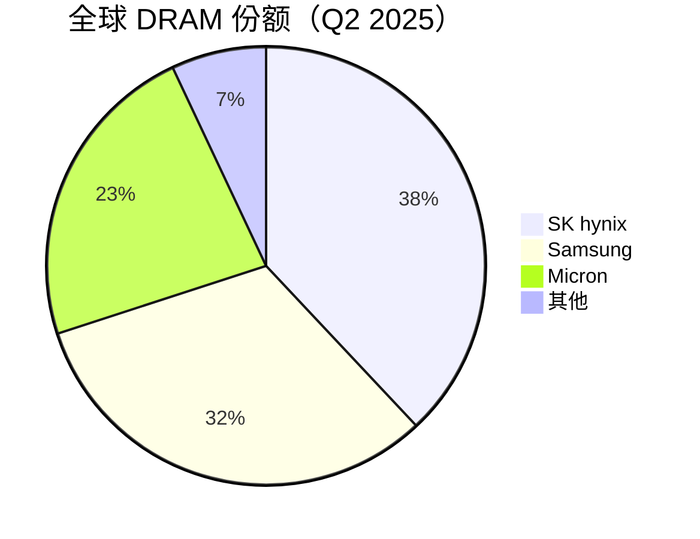
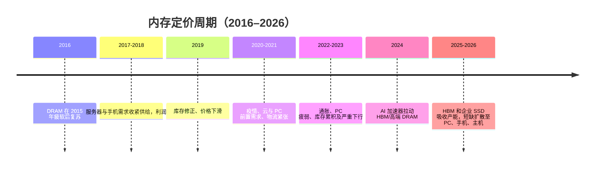

# 内存市场规模与细分

> [英文原文](../../01-overview/02-market-size-segmentation.md)

内存再次成为半导体行业的波动核心，但 2025–2026 年周期不是传统 PC/智能手机 DRAM 周期的重演。市场至少分为四本账：大宗 DRAM 比特、高端 HBM 叠层、NAND 容量，以及带控制器的存储系统。它们经由不同瓶颈出清：DRAM 晶圆可能紧张而 NAND 新层仍在认证；HBM 封装即使在普通 DRAM 比特增长时也可售罄；企业 SSD 则可能因 AI 数据中心吸收高容量硬盘快于供应商分配晶圆、控制器和测试产能而涨价。[^S019][^S020][^S021][^S022]

## 自上而下的 TAM

最有用的宏观锚点是 WSTS/SIA 半导体市场。SIA 于 2026 年 2 月汇总的数据称，2025 年全球半导体收入为 7,917 亿美元，同比增 25.6%，2026 年芯片销售预计接近 1 万亿美元。逻辑为最大品类（3,019 亿美元），内存为第二（2,231 亿美元，同比增长 34.8%）。后者是本数据库市场章节最实用的广义 TAM，因为它覆盖 DRAM、NAND、HBM 与其他存储，而非仅上市纯内存公司的商用收入。[^S019]

Q1 2026 的加速进一步说明周期量级：全球半导体销售额为 2,985 亿美元，环比增长 25%；2026 年 3 月为 995 亿美元，同比增 79.2%。该数字含逻辑、模拟、混合信号等，不能机械地分给内存，却说明供应商正处于更大规模的 AI 基建采购潮，而不只是单独的零组件短缺。[^S020]

| 细分 | 2025–2026 市场锚点 | 后续章节的实用 SAM | 应建模的约束 |
|---|---:|---|---|
| 全部半导体 | 2025 年 7,917 亿美元；2026 年约 1 万亿美元 | AI 基建、数据中心、PC、移动、汽车、工业 | 全球资本开支、封装、基板、区域政策 |
| 全部内存 | 2025 年 2,231 亿美元、同比 +34.8% | DRAM、HBM、NAND、NOR、专用存储 | 晶圆投片与产品组合转换 |
| 不含 HBM 的 DRAM | 三巨头在 Q2 2025 控制约 93% | DDR5、LPDDR、图形 DRAM、CXL | HBM 对普通 DRAM 产出的挤占 |
| HBM | 2025 年 SK hynix 61%、Micron 21%、Samsung 17% | AI 加速器配套、定制 HBM、基础芯片与封装 | 良品、TSV、堆叠、客户认证 |
| NAND | Q1 2026 收入 460 亿美元、超 Q1 2025 三倍 | 企业/客户端 SSD、移动及嵌入式闪存 | 高层 NAND、控制器与企业 SSD 分配 |

460 亿美元的 NAND 数字特别重要：据 Counterpoint，Q1 2026 企业级 SSD 已占 NAND 市场 40%，预计 2026 年末超过 60%。这意味着 AI 数据中心相关的 NAND SAM 不再只是裸闪存比特，还包括企业固件、大容量硬盘认证、主机接口带宽、功耗窗口及合同配给。[^S022]

## 供应商收入与份额

内存收入池高度集中。Counterpoint 数据显示 Q2 2025 Samsung、SK hynix、Micron 合计控制全球 DRAM 93%，份额依次为 32%、38%、23%，其他单一厂商均未达 5%。所以 DRAM 定价、组合与资本纪律主要可通过这三家公司及中国替代风险分析。[^S021]

HBM 更集中，因为它不仅需要先进 DRAM，还需要 TSV 芯片、堆叠、热/机械认证和加速器专属验证。2025 年份额为 SK hynix 61%、Micron 21%、Samsung 17%；其高毛利、黏性客户关系和稀缺封装能力，解释了为何较小供应商也会吸引不成比例的投资关注。[^S023]

NAND 份额较广但仍呈寡头：Q3 2025 公开摘要为 Samsung 约 30%、SK hynix 20%、Kioxia 14%、Micron 13%、YMTC 13%、Western Digital 11%。2026 年的另一口径称 YMTC 已从 Q1 2025 的 8% 升至 Q1 2026 的 13%。不同快照和定义必须保留时间标签，不能压平成一张“当前份额”表。[^S018][^S022]

## 各产品经济性

DRAM 应拆分为服务器 DDR5、移动 LPDDR、图形 DRAM、DDR3/DDR4、CXL 容量模组与 HBM。同一比特产出因接口、认证和客户优先级可形成完全不同收入：DDR5 经模组厂、OEM 与云服务器认证变现；HBM 则锁入 GPU/ASIC 爬坡。故即使供应商在一个季度损失传统份额，只要 HBM 组合上升，利润仍可能改善。[^S021][^S023]

HBM 的 SAM 是 AI 加速器周边的配套机会，而非完整 DRAM 市场。真正的前瞻变量并非只看份额变化，而是 HBM4/HBM4E 认证如何改变客户分配矩阵：赢得下一代加速器插槽即获得 DRAM 芯片拉动、基础芯片参与、封装测试量与长周期供货能见度；落选者仍可卖大宗 DRAM，却失去最紧的利润池。

NAND 的阶梯不同：客户端 SSD、UFS、可移动闪存、企业 TLC、高容量 QLC 和冷存储 SSD 共用部分供应，却有不同控制器、耐久与认证要求。企业 SSD 占比上升是组合迁移而非单纯比特增长，会提高高层 NAND、测试、控制器、封装吞吐与固件认证的敏感度；低端零售盘则更暴露于价格弹性。

## 2026–2028 情景框架

基准情景为紧供给延续至 2027 年末、各产品选择性缓解。SK hynix 预期短缺至 2027 年末，Lenovo 也称约 2028 年开始的新产能可能被 AI 基建吸收。该情景下 HBM 按配额供给、服务器 DDR5 昂贵、企业 SSD 优先于客户端盘，消费设备只能承受更高 BOM 或下调配置。[^S021][^S026]

对买方的乐观情景需同时出现：HBM 良率改善快于预期、未被 AI 立即吸收的新 DRAM 产能、以及企业 SSD 需求在 QLC/高层供给再趋紧前正常化。这些都存在滞后：HBM 跟随平台节奏，DRAM 新厂需多年，NAND 层转移不会立即变成已认证的大容量企业盘。因此买方友好情景应建模为渐进缓解，而非价格骤跌。

对供应商的乐观情景较直接：AI 基建投入维持高位、每颗加速器 HBM 配套量上升、每机架企业 SSD 容量增长，而 PC/移动需求消化较小但仍有利的供给。Gartner 预测 2026 年 PC 出货量降 10.4%，DRAM+SSD 价格年末升 130%，PC 价格升 17%、手机升 13%；这会伤害 OEM 单位增长，但只要 AI 买家仍是边际定价者，就支持内存供应商收入。[^S024]

## 2016–2026 定价周期

简化周期为：需求意外、供应商定价权、资本开支响应、比特产出增长、库存修正、再一次需求意外。2025–2026 的不同在于 AI 同时冲击带宽账与容量账，而 2023 年低谷后的供应商谨慎延缓经典扩产。

2017–2018 是服务器加手机驱动的经典上行，2019 是库存修正；2020–2021 混合云需求、消费电子前置和供应链扰动；2022–2023 则迫使厂商减产、放慢 capex、重建利润纪律。正因这道 2023 年伤痕，2025 年 AI 需求到来时，厂商没有立即增加大宗产能，而是将稀缺晶圆与工程力量导向 HBM、大容量服务器 DIMM 和企业 SSD。[^S021][^S026]

至 2025 年末，调整已传导至零售和 OEM：部分 2×16GB DDR5 套装从 2025 年 9 月约 125–135 美元涨至同年 12 月约 390–428 美元。诉讼亦反映价格冲击，但应谨慎对待：2026 年集体诉讼指控三巨头限制 DRAM 供给、抬高价格；它是指控与市场信号，不能视为合谋证据。[^S021][^S025]

## 当前短缺与 2027–2028 展望

核心机制是产品组合。HBM 消耗的 DRAM 制造和封装资源远多于普通 DRAM，而 AI 服务器客户因大额战略供货协议获优先权。报道称 HBM 可消耗约三倍标准 DRAM 晶圆产能，非服务器客户可能成为次优先级。[^S021][^S023]

NAND 也有短缺侧：Q1 2026 收入 460 亿美元、企业 SSD 占 40% 及其年末超 60% 的预测，均说明 AI 存储吸收了 NAND 的高价值部分。不同应用的控制器、耐久、认证和固件不同，却不改变收入池向企业买家移动、且其能承受更高价格的事实。[^S022]

中期不会立刻缓解。Lenovo 称短缺成为“新常态”，约 2028 年的重大扩产也可能被 AI 吸收；SK hynix 则预期延续至 2027 年末。保守模型应把 2027 年作为部分产品可能松动的最早窗口，而不是全面正常化日期。[^S021][^S026]

## 数据库建模含义

后续细分应遵循五条规则：把 HBM 当作“高端 DRAM + 封装”；区分晶圆投片与认证产出；区分比特增长与收入增长；按产品与日期跟踪份额；来源口径不同则保留范围。2,231 亿美元内存 TAM、460 亿美元季度 NAND 收入、93% DRAM 三巨头集中度、61% SK hynix HBM 份额都有效，却不能不经调整放进同一个分母。[^S019][^S021][^S022][^S023]

## 来源注释

[^S018]: Flash memory overview，Wikipedia，https://en.wikipedia.org/wiki/Flash_memory
[^S019]: Semiconductor industry sales outlook，Tom's Hardware，2026-02-06，https://www.tomshardware.com/tech-industry/semiconductors/semiconductor-industry-on-track-to-hit-usd1-trillion-in-sales-in-2026-sia-predicts-bumper-forecast-follows-usd791-7-billion-haul-for-2025
[^S020]: Q1 2026 global semiconductor sales，Tom's Hardware，2026-05-06，https://www.tomshardware.com/tech-industry/semiconductors/global-semiconductor-sales-hit-nearly-usd300-billion-in-q1-2026-chips-are-on-track-to-top-usd1-trillion-for-this-year-says-report
[^S021]: RAM shortage report，The Verge，2025-12-09，https://www.theverge.com/report/839506/ram-shortage-price-increases-pc-gaming-smartphones
[^S022]: Q1 2026 NAND revenue，PC Gamer，2026-06-03，https://www.pcgamer.com/hardware/ssds/nand-flash-makers-earned-a-record-usd46-billion-in-revenues-over-the-first-quarter-of-2026-a-shocking-3-5-times-more-than-last-year/
[^S023]: SK hynix HBM market coverage，Tom's Hardware，2026-06-23，https://www.tomshardware.com/tech-industry/sk-hynix-passes-samsung-as-south-koreas-most-valuable-company-on-hbm-demand
[^S024]: Gartner device outlook，PC Gamer，2026-03-02，https://www.pcgamer.com/hardware/gaming-pcs/top-analyst-firm-gartner-predicts-the-sub-usd500-entry-level-pc-segment-will-disappear-by-2028-along-with-worldwide-pc-shipment-decline-of-10-4-percent-in-2026/
[^S025]: DRAM price-fixing lawsuit，Tom's Hardware，2026-06-29，https://www.tomshardware.com/tech-industry/samsung-sk-hynix-and-micron-sued-over-alleged-dram-price-fixing-amid-record-memory-costs
[^S026]: Lenovo shortage outlook，Tom's Hardware，2026-06-28，https://www.tomshardware.com/pc-components/ram/lenovo-says-the-ramageddon-is-the-new-normal-outlines-survival-guide-at-isc-2026-an-exec-said-it-will-never-be-like-it-was-last-year
