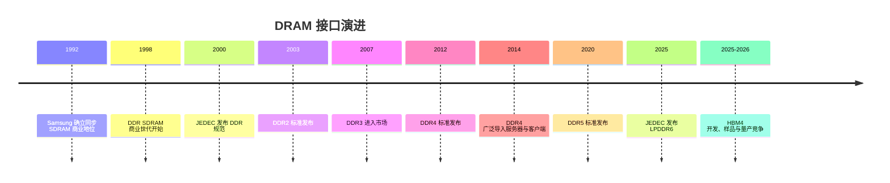
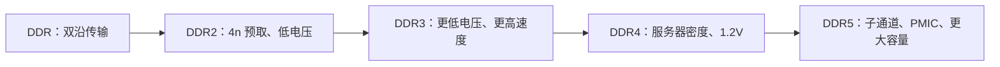
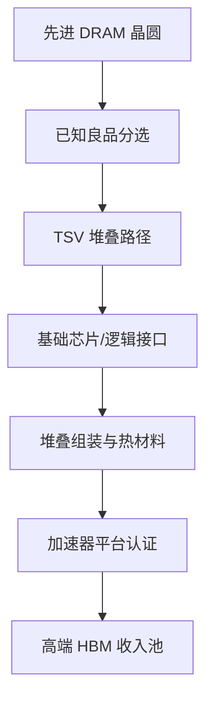

# DRAM 演进：从 SDRAM 到 DDR5、LPDDR、HBM 与节点命名

> [英文原文](../../02-history/01-dram-evolution.md)

DRAM 演进是在日益困难的电容、晶体管与阵列缩放上叠加接口标准化的历史。存储单元仍是“一只访问晶体管加一只电容”，读取由感测放大器恢复；商业路径却复杂得多。SDRAM 到 DDR5 通过更高效时钟、内部并行度、低 I/O 电压、更多 bank/子通道和模组信号完整性来提高外部带宽。移动 DRAM 分出 LPDDR，图形 DRAM 分出 GDDR，AI 加速器又把堆叠 DRAM 变成 HBM，使封装带宽比普通比特出货更有价值。[^S016][^S027][^S030][^S034]

## SDRAM 与 DDR 的起点

同步 DRAM 让内存操作随系统时钟对齐，使控制器可以流水化访问并预测时序；它的重要性在于建立了之后世代赖以扩张的标准化生态。CPU、芯片组、DIMM、主板和 OEM 认证必须共同成熟，因此一个只得到少数平台支持的接口只会是小众产品，JEDEC 接口才可能形成规模市场。

当 CPU 时钟和图形负载超过单倍数据率能力时，行业没有更换存储单元，而是改进外部传输契约。DDR 在时钟上升沿和下降沿都传输数据，在相同频率下有效数据率翻倍；DDR、DDR2、DDR3、DDR4、DDR5、LPDDR 与 GDDR 的共同抽象皆源于此，尽管电气、封装、电源和命令协议差异巨大。[^S027]

## DDR1 至 DDR3：以接口纪律换取带宽

DDR 于 1998 年商业化，JEDEC 在 2000 年 6 月以 JESD79 定稿。其核心贡献是双沿信号与标准模组生态，而非更密的单元；DDR-200/266/333/400 在传统 DIMM 与芯片组路径中提高峰值带宽。[^S027]

DDR2 于 2003 年发布，将预取改为 4n、标称电压从约 2.5/2.6V 降至 1.8V，标准速率覆盖 DDR2-400 至 DDR2-1066。代价是延迟：早期 DDR2 在实际工作负载上未必胜过成熟 DDR，说明传输率上升并不自动降低绝对访问延迟。[^S028]

DDR3 于 2007 年进入市场，标称电压降至常见 1.5V、后续低压版 1.35V，并扩大主流传输率。它与 CPU 集成内存控制器的兴起重叠，使时序智能更靠近处理器、平台认证更关键。DIMM 不再只是商品，而是服务器、工作站、笔记本和 PC 路线图中的已验证部件。接口速度、每比特功耗和标准时机由此成为独立竞争轴。

这种标准滞后始终存在：内存厂可以早于 CPU 控制器、BIOS、服务器平台、模组厂和 OEM 认证而展示器件；反过来，平台就绪后，滞后的 DRAM 供给也会阻碍系统出货。因此 DRAM 有两只时钟：供应商内部的器件开发时钟，以及 CPU、芯片组、模组和 OEM 的平台采用时钟。

## DDR4：bank 并行、低电压与服务器密度

JEDEC 于 2012 年宣布 DDR4，2014 年后广泛采用。DDR4 将标称电压降至 1.2V，标准档位为 DDR4-1600 至 DDR4-3200。其可投资意义不只在带宽/功耗，更在服务器密度：云、虚拟化、分析和内存数据库使主内存成为数据中心采购变量。[^S029][^S030]

DDR4 的成熟期也暴露了长尾问题。汽车、工业、国防与医疗平台认证很长，不能因 DDR5 出现而立即迁移。至 2026 年，领先厂商将能力转给 DDR5、LPDDR5X/6 和 HBM 后，旧规格反而稀缺。Micron 在弗吉尼亚 Manassas 用 1-alpha DRAM 扩充兼容 DDR4 产出，服务汽车、国防、工业和医疗；报道称汽车 DRAM 价格 2026 年或升 70–100%，供应至 2028 年可能严重减少。旧节点并不等于不重要。[^S035]

## DDR5：子通道、PMIC、容量与信号完整性

JEDEC 于 2020-07-14 发布 DDR5。公开档位为 4.0–8.8 GT/s，按速率和总线假设，模组带宽为 32.0–70.4 GB/s。DDR5 电压降至 1.1V，把更多电源管理放到 PMIC，将 DIMM 拆为两个独立 32 位子通道，并扩大实用模组容量。[^S016]

SK hynix 在 2020-10-06 推出首颗量产 DDR5 芯片，但标准早于平台大规模出货：早期模组价格高、可用性有限、平台尚不成熟，需要等待 CPU 控制器、主板布线、BIOS、模组供给和成本交叉。2024–2026 年，DDR5 已从新世代变成争夺配给的资源池：同一晶圆和工程人才也支持 HBM 与高速 LPDDR，AI 对 HBM 的拉动会使 DDR5 即便在名义比特容量增加时仍收紧。[^S021][^S025]

DDR5 也改变模组周边的价值捕获。PMIC、SPD 扩展、时钟器件、寄存时钟驱动器和更严的信号完整性让生态比裸 DRAM 规格表复杂；服务器代际迁移会连带验证插槽、PCB、电源器件、测试时间和库存协调。因此它是平台转移，不只是更快的 bin。[^S016]

## LPDDR：移动功耗变得与数据中心相关

LPDDR 从移动分支发展而来，优化低电压、电源状态、封装集成和续航。其边界后来模糊：低功耗封装进入笔记本、AI PC、边缘设备和紧密集成的计算模组，因为每瓦带宽的价值已不限于手机。

LPDDR5 于 2019 年标准化，LPDDR5X 于 2021 年扩展；Samsung 在 2021 年公布 16Gb、14nm、8,533 MT/s 的 LPDDR5X。JEDEC 于 2025 年发布 LPDDR6，含四个 24 位子通道、动态电压/频率特性与 10,667–14,400 MT/s。SK hynix 于 2026 年称其首款 LPDDR6 超过 10.7Gbps、比 LPDDR5X 快 33%、功耗效率高 20%，采用 10nm 级 1c 工艺。[^S001][^S034][^S039]

LPDDR 已不是“仅手机内存”。AI 服务器与 CPU-GPU 超级芯片可在每 token/推理的内存能耗重要时使用低功耗形态；其子通道结构呼应 DDR5 对并发的追求，但保留移动来源的功耗纪律。它可服务边缘 AI、紧凑加速器和专用服务器，HBM 则仍占最高带宽层。[^S034]

## GDDR 与图形支线

GDDR 为需要高带宽、但不愿承担 HBM 成本与封装复杂度的 GPU 而演进。Samsung 1998 年商用 GDDR SGRAM，GDDR6 于 2018 年量产；公开资料记录其 16Gb、最高每针 18Gbit/s、10nm 级工艺的生产。GDDR6/6X 用于显卡和部分加速器，适用于板级带宽足够、无法证明 HBM 硅中介层和先进封装成本合理的场景。[^S037][^S040]

它说明行业会在工作负载愿意付费时反复创建专用接口：DDR 优化标准化插槽容量；LPDDR 优化功耗与集成；GDDR 优化板级图形带宽；HBM 优化最高加速器层的封装带宽与能效。它们都是 DRAM，却不能完全互换。

## HBM：封装重新定义产品

HBM 让 DRAM 演进进入三维：堆叠芯片、以 TSV 连接，并与逻辑放到同一先进封装。Samsung 的历史包括 2016 年 HBM2，后续为 HBM2E、HBM3、HBM3E 与 HBM4。[^S037]

SK hynix 在 2025 年报告 HBM4 开发完成：2,048 位接口、10 GT/s、12 层堆叠、1b-nm DRAM 和 Advanced MR-MUF。Micron 的 HBM4 样品称带宽超 2.8TB/s、针速超 11Gbps，并结合 1-gamma 与自研 CMOS 基础芯片；Samsung 2026 年报道则称使用第六代 10nm 级 DRAM、4nm 逻辑基础芯片，速度 11.7Gbps、每叠层最高 3.3TB/s。厂商声明需在 HBM 章节详细核对，但稳定结论是 HBM 把 DRAM 从模组商品变为与加速器共封装的投入品，改变毛利、锁定、测试、热设计和资本配置。[^S002][^S003][^S038]

## 各厂节点命名与晚 2020 年代路线图

DRAM 节点名不等同于晶圆代工逻辑节点。“10nm 级”仅大致指 DRAM 特征范围；1x/1y/1z 是前三代，之后有 Samsung D1a/D1b 与 Micron 1-alpha/1-beta 等名称。因密度、EUV、 电容整合、良率和组合不同，1b、1c、1-gamma 或 D1a 不能跨厂直接比较。[^S041]

| 厂商 | 常用公开节点语言 | 实用解释 |
|---|---|---|
| Samsung | 1z、D1a、D1b、第六代 10nm 级 | DRAM 世代标签，非代工等效节点 |
| SK hynix | 1a、1b、1c | 在 HBM、LPDDR、DDR 上按产品部署 |
| Micron | 1-alpha、1-beta、1-gamma | 厂商自身序列；1-gamma 关联 HBM4 |

Micron 的 1-alpha 可用于传统兼容产品，1-gamma 则关联高端 AI 内存；SK hynix 报道把 1c 用于 LPDDR6、1b 用于 HBM4。节点名本身不足以定义产品，接口、封装、认证和客户同样关键。[^S002][^S003][^S034][^S035]

DDR6 尚非主要商业战场。SK hynix 2025 路线图预计 DDR6 在 2029–2030、MRDIMM Gen2/CXL 扩展器在 2026–2028、LPDDR6-PIM 于 2028、3D DRAM 约 2030；HBM 世代以约 1.5–2 年的节奏走向 HBM5E。三条并行路径为：服务器 DDR5/MRDIMM/CXL/DDR6，低功耗 LPDDR5X→LPDDR6/PIM，加速器 HBM4→HBM4E→HBM5 与定制基础芯片。[^S036]

## 投资要点

应把 DRAM 建模为接口细分、节点迁移和封装杠杆。DDR5 变现服务器/客户端容量，LPDDR 变现每瓦带宽，GDDR 变现板级图形带宽，HBM 变现封装级加速器带宽，DDR3/4 则在新产品挤出供应商注意力时变现长期认证。1998–2026 的主线是：双沿传输、降压提速、DDR4 服务器密度、DDR5 子通道与模组供电、LPDDR 扩大到 AI 邻近角色，以及 HBM 使先进封装成为 DRAM 经济的中心。[^S001][^S003][^S016][^S027][^S028][^S030]

## 来源注释

[^S001]: LPDDR6 标准，Tom's Hardware，https://www.tomshardware.com/pc-components/dram/jedec-publishes-first-lpddr6-standard-new-interface-promises-double-the-effective-bandwidth-of-current-gen
[^S002]: Micron HBM4，TechRadar，https://www.techradar.com/pro/micron-takes-the-hbm-lead-with-fastest-ever-hbm4-memory-with-a-2-8tb-s-bandwidth-putting-it-ahead-of-samsung-and-sk-hynix
[^S003]: SK hynix HBM4，Tom's Hardware，https://www.tomshardware.com/pc-components/dram/sk-hynix-completes-development-of-hbm4-2-048-bit-interface-and-10-gt-s-speeds-promised
[^S016]: DDR5 SDRAM，Wikipedia，https://en.wikipedia.org/wiki/DDR5_SDRAM
[^S021]: RAM 短缺，The Verge，https://www.theverge.com/report/839506/ram-shortage-price-increases-pc-gaming-smartphones
[^S025]: DRAM 诉讼，Tom's Hardware，https://www.tomshardware.com/tech-industry/samsung-sk-hynix-and-micron-sued-over-alleged-dram-price-fixing-amid-record-memory-costs
[^S027]: DDR SDRAM，Wikipedia，https://en.wikipedia.org/wiki/DDR_SDRAM
[^S028]: DDR2 SDRAM，Wikipedia，https://en.wikipedia.org/wiki/DDR2_SDRAM
[^S029]: DDR3 SDRAM，Wikipedia，https://en.wikipedia.org/wiki/DDR3_SDRAM
[^S030]: DDR4 SDRAM，Wikipedia，https://en.wikipedia.org/wiki/DDR4_SDRAM
[^S034]: SK hynix LPDDR6，Tom's Hardware，https://www.tomshardware.com/pc-components/dram/sk-hynix-introduces-turbocharged-lpddr6-33-percent-faster-and-20-percent-more-power-efficient-than-lpddr5x-16gb-chips-deliver-10-7-gbps-uses-10nm-node
[^S035]: Micron Virginia DRAM，Tom's Hardware，https://www.tomshardware.com/tech-industry/micron-begins-producing-americas-most-advanced-dram-at-its-virginia-fab
[^S036]: SK hynix DRAM 路线图，Tom's Hardware，https://www.tomshardware.com/pc-components/dram/sk-hynix-reveals-dram-development-roadmap-through-2031-ddr6-gddr8-lpddr6-and-3d-dram-incoming
[^S037]: Samsung Electronics，Wikipedia，https://en.wikipedia.org/wiki/Samsung_Electronics
[^S038]: Samsung HBM4，TechRadar，https://www.techradar.com/pro/samsung-says-it-took-the-leap-with-hbm4-as-it-starts-shipping-faster-ai-memory-built-on-advanced-process-nodes
[^S039]: LPDDR，Wikipedia，https://en.wikipedia.org/wiki/LPDDR
[^S040]: GDDR6，Wikipedia，https://en.wikipedia.org/wiki/GDDR6_SDRAM
[^S041]: 10nm process，Wikipedia，https://en.wikipedia.org/wiki/10_nm_process
