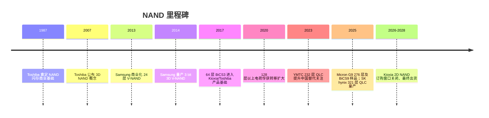
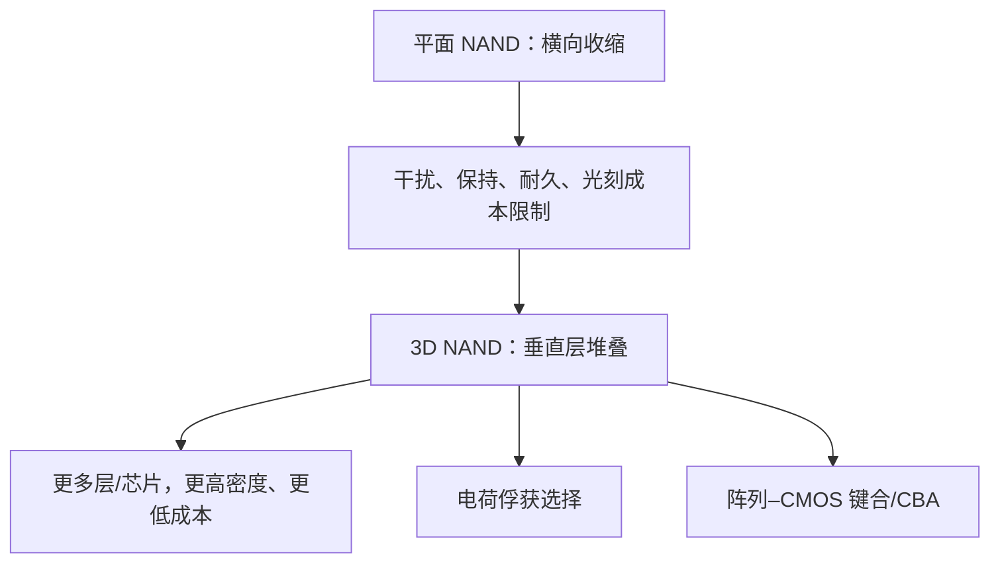
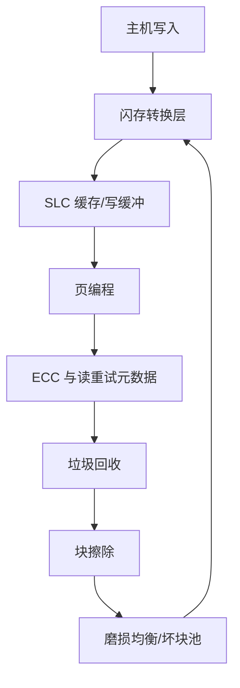

# NAND 演进：从平面到 3D、从 SLC 到 PLC 与层数缩放

> [英文原文](../../02-history/02-nand-evolution.md)

NAND 与 DRAM 的关键差异在于：DRAM 的故事以易失、字节可寻址接口为主，NAND 的故事则由非易失密度、块管理经济、控制器复杂度和垂直制造强度主导。1980 年代末的平面浮栅阵列发展成垂直堆叠、由控制器管理并经过纠错的存储底层。到 2025–2026 年，NAND 不再仅是廉价 SSD 比特池：AI 数据中心正拉动企业 SSD、高容量 QLC、PCIe 6.0 性能设备和实验性高带宽闪存，使其更靠近加速器内存层级。[^S004][^S005][^S006][^S022]

## 平面 NAND 与浮栅时代

平面 NAND 将浮栅单元并排放在晶圆表面，依赖光刻、更紧单元间距、隧穿氧化层、编程/擦除算法和控制器 ECC 缩放，带来惊人的成本/比特下降。但进入 1x nm 后，横向几何受限：邻近干扰增强、每个状态的电子数下降、耐久余量变窄，继续横向收缩不如增加垂直层有吸引力。

Kioxia 的 2026 停产通知使这段历史很具体：其将停止 2D NAND 和第三代 BiCS 3D 产品，包含自 2009 年量产的 32nm SLC、2010 年的 24nm MLC、2014 年的 15nm MLC/TLC 及约 2017 年的 64 层 BiCS3；最后订购至 2026-09-30，最终出货至 2028-12-31。这不仅是产品清理，也是从约 1987 年 Toshiba 的平面 NAND 到先进 3D NAND 的 41 年产业交接。[^S006]

平面 NAND 的剩余价值来自汽车、工业、嵌入式、可移动及旧消费设计的长周期认证；但 AI/企业 SSD 将晶圆和工程资源拉向高层 3D NAND 后，其经济性越来越困难。2028 年 Kioxia 最后出货是历史标记：技术上它仍有用，经济中心却已转移。[^S006]

## 为什么 3D NAND 胜出

3D NAND 将缩放轴从横向收缩改为垂直堆叠。公开资料记录 Toshiba 2007 年宣布 3D NAND、Samsung 2013 年商业化 24 层 V-NAND。垂直 NAND 常用电荷俘获：电荷位于氮化硅陷阱层，而非完全隔离的导电浮栅；密度可借层数增长，而无须同速度缩小每个横向特征。[^S018]

制造瓶颈随架构改变。平面 NAND 强调光刻和单元隔离；3D NAND 强调多层交替膜沉积、高深宽比沟道孔刻蚀、阶梯接触、字符串架构、沟道填充、阵列均匀性、量测，以及可能的阵列与 CMOS 键合。因此层数竞赛提高沉积和刻蚀的设备强度。

失效分析也从横向邻居干扰与小浮栅电荷，扩展到串电流分布、垂直沟道均匀性、陷阱分布、层间差异、字线电阻、阶梯接触良率和键合对准。一个不佳刻蚀轮廓可损害许多垂直单元；层数不仅是密度指标，也是制程控制指标。

一代 NAND 可通过层数、每单元比特、plane 并行、I/O、阵列/CMOS 分离或控制器/ECC 改进。BiCS9 就不是单纯最高层数产品：它采用 CBA，可把成熟的 112 层 BiCS5 或 218 层 BiCS8 结构与现代 I/O 结合，Toggle DDR 6.0 可达 3.6Gb/s、受控测试峰值 4.8Gb/s，并报告相较旧 512GB TLC 设计更高读写性能及能效。[^S005]

## SLC 到 PLC：密度与余量

除加层外，NAND 也通过每单元储存更多比特扩容：SLC、MLC、TLC、QLC、PLC 分别是一、二、三、四、五 bit；相应电压状态为 2、4、8、16、32。每增加一 bit，需区分的状态翻倍，电压余量变窄，编程精度、读重试、保持管理与 ECC 难度上升。[^S045]

| 单元 | bit/单元 | 电压状态 | 典型策略角色 | 核心取舍 |
|---|---:|---:|---|---|
| SLC | 1 | 2 | 低延迟、高耐久、缓存、专用 SSD | 成本/bit 最高 |
| MLC | 2 | 4 | 较旧企业/客户端 SSD | 密度提高、余量低于 SLC |
| TLC | 3 | 8 | 主流客户端及企业 SSD | 密度、耐久、成本平衡 |
| QLC | 4 | 16 | 容量盘、读密集型数据中心 | 写耐久较低、余量更窄 |
| PLC | 5 | 32 | 开发中密度路线 | 余量极紧、控制器负担重 |

高 bit 单元并非不好，而是工作负载专用。QLC 在控制器提供足够预留、磨损均衡、ECC、缓存和散热时，适合读密集高容量；SLC 即便贵，也适合低延迟/高耐久利基。Kioxia 规划的 SLC XL-Flash SSD 目标超过一千万 512B IOPS、读取 3–5us，而普通 3D NAND SSD 为 40–100us，显示 NAND 正被拉近内存层级。[^S044]

PLC 是密度诱惑却非通用答案。Kioxia 的约 332 层 BiCS10、2Tb/芯片路线强调以层数加电荷架构性能改善扩容，而不依赖 PLC；这不证明 PLC 已死，只说明主流厂商仍有回避五 bit 可靠性/控制器负担的替代路径。控制器和工作负载决定同一裸芯片是否合用：QLC SSD 可用 SLC 缓存，企业 TLC 可保留大量余量。[^S043]

## 层数增长与厂商策略

层数醒目但非全部。Micron、SK hynix、Samsung、Kioxia/SanDisk、YMTC、Solidigm 在层数、芯片容量、每单元比特、I/O、plane、键合、耐久目标和控制器上均有不同平衡。

Micron G9 代表性能面：9650 用第九代 276 层 TLC、3.6GT/s、PCIe 6.0 x4，最高 28,000/14,000MB/s 顺序读/写、550 万随机读 IOPS；6600 ION 用同代 QLC，初始 30.72/61.44/122.88TB，并计划 245TB。SK hynix 321 层 2Tb V9Q 则代表密度面：3,200MT/s、六 plane，并报告相对 2023 V7Q 更高读写性能与写能效；企业盘可用 32DP、每封装 32 颗 2Tb 芯片实现 244TB。[^S004][^S042]

BiCS9 侧重 CBA、性能、功耗及过渡价值；BiCS10 预计约 332 层、2Tb/芯片。YMTC 的 232 层 QLC（报告密度 19.8Gbit/mm²）则体现中国替代案例：层数进步已不只在韩日美供应商中发生，但设备获取和客户认证仍是变量。[^S005][^S043][^S046]

## 控制器、ECC 与 SSD 产品边界

NAND 芯片不能与 SSD 控制器分开。原始 NAND 是页编程、块擦除、容易出错的介质；闪存转换层将逻辑块映射到物理页、管理磨损/垃圾回收、纠错、坏块和读重试。AERO 研究用 160 颗真实 3D NAND 芯片，依据失效 bit 自适应擦除延迟，报告 SSD 寿命提高 43%。[^S012]

随着层数/bit 增长，差异化更多位于芯片之上。PCIe 6.0 的 9650 不只是 276 层 TLC，而是 NAND、控制器、固件、热设计、形态与 PCIe 织构整合；高容量 QLC 的价值在于能否把写放大、耐久和尾延迟维持在客户容忍范围。企业客户购买已认证容量、可预测延迟、耐久、功耗、可维护性和固件行为；消费者购买容量和基准，直到短缺改变价格弹性。

接口继续上升也移动产品边界：PCIe 5.0 令高端 14GB/s 常见，9650 将企业上限推至 28GB/s。此时控制器须跨大量 NAND 通道与芯片供给并行，同时把功耗和热量控制在形态内，NAND I/O、plane、控制器 ASIC、retimer、交换机和散热都成为同一产品方程。[^S004]

## 制造强度、半导体设备与近内存闪存

3D NAND 最清楚地说明密度如何转化为设备强度：更高堆叠、层均匀性、更深垂直沟道、穿透非简单二维图形的缺陷检测；每层需要电访问的阶梯接触是重要良率挑战，键合还增加对准和后键合良率。沉积、刻蚀、清洗、量测、检查、键合、测试与先进封装均随路线图受益；176→218→232→276→321→332 层使刻蚀选择比、轮廓和生产率更关键。过渡的 BiCS9 能复用成熟层结构而升级 CBA/I/O，正体现最快盈利路径未必是最高堆叠。[^S004][^S005][^S042][^S043]

AI 还将闪存拉向计算。Kioxia 的高带宽闪存原型为 5TB、PCIe 6.0 64GB/s；报道提出 HBF 容量可为 DRAM HBM 的 8–16 倍、模块低于 40W，16 模块理论上达 80TB、超过 1TB/s。它仍不能成为 DRAM：读取仍为 us 级，写擦不对称、控制器复杂；但可为训练、RAG、检查点、图分析和推荐提供靠近加速器的高带宽持久容量。[^S047]

## 投资要点

NAND 有三条重叠弧线：平面浮栅让位给垂直 3D；SLC→MLC→TLC→QLC→PLC 增加密度却缩小余量并加重控制器；系统产品从裸闪存/简单 SSD 移向 PCIe 6.0 性能盘、245TB 容量盘、低延迟 SLC 和 AI 高带宽模块。DRAM 演进拉动光刻、电容、接口和先进封装；NAND 拉动沉积、高深宽比刻蚀、键合、量测、检查与控制器/测试。每增加一层都增加过程复杂度、良率挑战和设备强度。[^S004][^S006][^S044][^S045][^S047]

## 来源注释

[^S004]: Micron PCIe 6.0 SSD，Tom's Hardware，https://www.tomshardware.com/pc-components/ssds/microns-industry-first-pci-6-0-ssd-promises-sequential-reads-up-to-28-000-mb-s-245-tb-ssd-also-coming-for-those-who-need-capacity-more-than-cutting-edge-speed
[^S005]: BiCS9 样品，Tom's Hardware，https://www.tomshardware.com/pc-components/storage/kioxia-and-sandisk-start-shipping-bics9-3d-nand-samples-hybrid-design-combining-112-layer-bics5-with-modern-cba-and-ddr6-0-interface-for-higher-performance-and-cost-efficiency
[^S006]: Kioxia 2D NAND 停产，Tom's Hardware，https://www.tomshardware.com/pc-components/ssds/kioxia-discontinues-2d-nand-products-last-shipments-to-be-made-in-2028-1980s-planar-nand-memory-reaches-end-of-life
[^S012]: AERO，arXiv，https://arxiv.org/abs/2404.10355
[^S018]: Flash memory，Wikipedia，https://en.wikipedia.org/wiki/Flash_memory
[^S022]: NAND Q1 2026 收入，PC Gamer，https://www.pcgamer.com/hardware/ssds/nand-flash-makers-earned-a-record-usd46-billion-in-revenues-over-the-first-quarter-of-2026-a-shocking-3-5-times-more-than-last-year/
[^S042]: SK hynix 321 层 QLC，Tom's Hardware，https://www.tomshardware.com/pc-components/ssds/sk-hynix-begins-mass-production-of-321-layer-2tb-qlc-nand-memory
[^S043]: BiCS10，TechRadar，https://www.techradar.com/pro/kioxia-teases-2tb-bics10-nand-chip
[^S044]: Kioxia XL-Flash，Tom's Hardware，https://www.tomshardware.com/pc-components/ssds/kioxia-to-develop-next-gen-ssd-with-over-10-million-iops-and-3-microsecond-latency-to-rival-hbm
[^S045]: Multi-level cell，Wikipedia，https://en.wikipedia.org/wiki/Multi-level_cell
[^S046]: YMTC，Wikipedia，https://en.wikipedia.org/wiki/Yangtze_Memory_Technologies
[^S047]: 高带宽闪存，Tom's Hardware，https://www.tomshardware.com/pc-components/ssds/kioxia-unveils-high-bandwidth-flash-for-ai-with-64-gb-s-bandwidth-and-5tb-capacity
