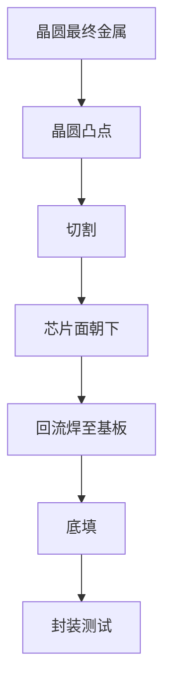
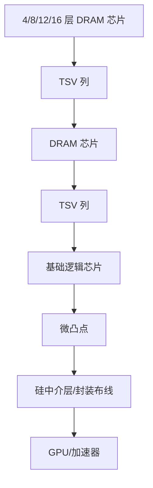
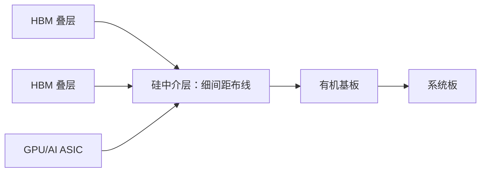
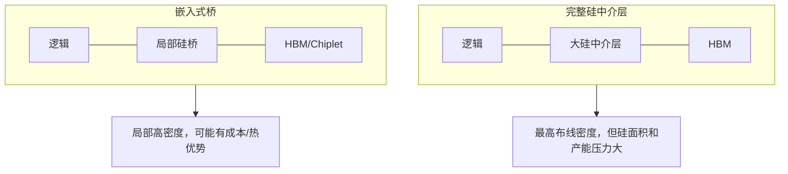

# 封装演进：从引线键合到 TSV、2.5D、混合键合与 Chiplet

> [英文原文](../../02-history/03-packaging-evolution.md)

内存封装已从“保护芯片、把引脚接到电路板”的后段步骤，变为决定带宽、功耗、良率和客户可交付性的产品定义。大宗 NAND 仍可优化成本、容量和生命周期；HBM 则必须以高密度 TSV 叠层与逻辑共封装。AI 时代的限制不仅是逻辑晶圆或 DRAM 芯片，也可能是中介层、基板、组装、测试、热材料和合格封装产能。

## 早期封装：引线键合与容量堆叠

传统封装把裸芯片贴在引线框架或基板上，以细金/铜/铝线从芯片焊盘连到封装引脚。它成本低、成熟、可维修，适合大宗 DRAM、NAND、NOR 和控制器；但细长引线的寄生电感、电容及周边式 I/O 在频率和 I/O 数上形成限制。NAND 可以把许多薄芯片堆在一个封装中，以引线键合实现容量，因为外部接口由控制器管理，不需要 HBM 级芯片到逻辑带宽。

随着 I/O 增加、速度提升，封装必须从“边缘引线问题”升级为“面积阵列互连和基板布线问题”。

## 倒装芯片：面积阵列 I/O

倒装芯片将焊凸点制在晶圆最终金属上，切割后将芯片正面朝下回流焊到基板，再以毛细或模塑底填加固。它缩短互连、允许大量面积阵列 I/O，成为高性能 CPU、GPU、ASIC 与内存控制器从传统封装走向异构整合的桥梁。[^S051]

代价移至基板：更细线宽线距、凸点间距控制、底填材料、热膨胀系数管理、翘曲控制和测试纪律都变得关键。ABF 与高密度有机基板因而会成为先进计算周期的瓶颈；芯片即使就绪，也可能等待基板或组装时段。

## TSV：让垂直内存成为现实

硅通孔（TSV）是穿过硅晶圆/芯片的垂直电连接，可作为引线键合和倒装芯片之外的高性能互连，用于 3D 封装和 3D 集成电路。它可按形成时点分为 via-first、via-middle、via-last。[^S049]

对内存而言，TSV 解决了引线键合与简单 PoP 无法解决的密度和带宽问题。HBM 芯片由 TSV 与微凸点垂直连接，SK hynix 于 2013 年制造了首个基于 TSV 的 HBM 模组；此后 HBM 成为封装把内存变为高端系统部件的代表。[^S048][^S049]

TSV 也带来制造代价：晶圆减薄、通孔刻蚀与绝缘、铜/钨填充的空洞和应力、keep-out 区域、热行为变化。高密度 TSV 阵列甚至可能在减薄硅中造成横向热阻塞并加剧热点，故封装必须与热、版图共同设计。HBM 更严苛：堆叠高度、减薄、热材料、微凸点间距和良品筛选需同步工作。SK hynix 的 HBM4 路线结合 2,048 位、10GT/s、12 层、1b-nm 和 Advanced MR-MUF，体现价值不只是 DRAM 密度，而是通过可供给加速器 TB/s 带宽的垂直封装交付。[^S003][^S052]

## 2.5D 中介层：HBM 放在逻辑旁

2.5D 把多个芯片并排置于一个中介层：中介层负责芯片间布线，并以 TSV 接至封装基板。硅中介层可提供极细间距，是 TSMC CoWoS 等技术的基础。[^S050]

GPU 或 AI ASIC 需成千上万条短、低能耗连接通往 HBM；普通 PCB 无法提供这种密度和信号质量，硅中介层能在封装内路由超宽总线。因此 HBM 的采用把 CoWoS、2.5D 产能带到 AI 供应链中心。

封装生态已是产能市场。Amkor 在亚利桑那 Peoria 建设先进封装测试园区，预计首厂 2027 年中完成、生产约 2028 年初，初期 20 亿美元、可扩至 70 亿美元，苹果和 Nvidia 为首批客户。报道将 2.5D 封装称为美国官员/NIST 指出的 AI 芯片主要瓶颈。这标志着封装不再只是后段劳动力成本：必须同时问逻辑芯片能否制造、HBM 能否堆叠、完整封装能否组装测试。[^S053]

## EMIB、桥接与中介层替代方案

完整硅中介层很强但昂贵、受产能限制。Intel EMIB 在有机基板内嵌硅桥，以高密度连接相邻芯片，无须用大片硅跨越整包。2026 年报道称 SK hynix 正研究基于 EMIB 的 HBM 2.5D 方案，但双方未正式确认；文章把它描述为 CoWoS 的潜在成本/热效率替代，EMIB-T 面向 HBM4，借附加 TSV 提升带宽。具体合作未必成产品，重要的是 HBM 整合足以让内存厂、代工厂与 CPU 厂按封装拓扑竞争。[^S054]

桥、扇出重布线层、有机/玻璃中介层都在回答同一问题：所需布线密度、距离、成本、热和良率各是多少？没有通用赢家；拥有很多 HBM 的顶级 AI 加速器可证明大型硅中介层合理，小加速器、网络 ASIC 或 chiplet CPU 则可能偏好桥或扇出。

## 混合键合：从微凸点到直接键合界面

混合键合以介质对介质、金属对金属的直接键合连接芯片/晶圆，互连间距小于焊料微凸点，是晶圆对晶圆、芯片对晶圆 3D 整合的核心路线，覆盖图像传感器、堆叠 SRAM/缓存、先进逻辑和未来内存/逻辑整合。它让封装互连趋近单片芯片堆叠。

瓶颈也由凸点冶金转向表面制备、洁净、平坦度、对准、铜焊盘露出、搬运和键合良率。短垂直互连能改善带宽与能耗，但叠层有源芯片更难散热和测试。颗粒、铜凹陷、介质侵蚀、晶圆弯曲、局部地形和对准漂移都可能成为潜在可靠性问题；洁净和量测制度开始类似前段晶圆制造，先进封装线也更像晶圆厂而非传统组装线。

这也改变 OSAT 策略：传统组装仍必要，但领先封装还需晶圆级过程控制、临时键合/解键合、减薄、CMP 类表面控制、等离子活化、高精度对准和缺陷检查。代工厂与 OSAT 边界因此模糊；TSMC、Intel、Samsung、Amkor、ASE 和内存厂以不同方式竞争封装能力、利润与客户锁定。

## Chiplet：封装成为架构

Chiplet 将系统拆成计算、I/O、缓存、HBM、模拟、接近光罩上限的加速器及适合不同节点的芯片。其价值是良率、复用、工艺专业化和突破光罩尺寸；代价是芯片间协议、物理接口、热/供电/翘曲/ESD/信号完整性、良品物流、封装测试和修复策略。2025 年研究指出，先进封装提供丰富互连资源，但传统 I/O、ESD 和信令开销会限制小于 100mm² chiplet 的缩小；另一研究显示紧凑放置会产生热和热膨胀应力，结构与热感知优化可降低应力并缩短总线长。Chiplet 不是免费的乐高。[^S055][^S056]

良品物流是安静却关键的经济枢纽。单片芯片的良率损失留在一颗芯片内；多芯片封装中，一个坏 HBM、桥、逻辑 chiplet、中介层或基板即可威胁整件高价值产品。因此需在堆叠前后、中介层连接后、基板连接后和系统验证后插入测试。HBM 尤其如此：一叠含多片 DRAM 和基础芯片，封装可能有数叠 HBM 加昂贵逻辑；有些失效只在热循环、应力或全速接口后出现。HBM 供给不是 DRAM 晶圆输出，而是已认证封装中已认证叠层的输出。

## 晶圆级与面板级缩放

随着 AI 封装变大，行业讨论晶圆级与面板级先进封装。TSMC 在 2026 年称，面板级短期不会取代最大 AI 处理器的 CoWoS：晶圆级仍有更高互连密度，可扩至 58 个大型光罩级芯片；CoWoS 路线将走向 150mm×250mm 基板，CoPoS 等面板方案可补充但工具尚需成熟。晶圆级可复用先进光刻、刻蚀、沉积、量测和搬运生态；面板级承诺更大格式和更低面积成本，却须补上 overlay、翘曲和缺陷控制。[^S057]

## 内存专属结论

内存封装沿两轴演进：大宗封装优化成本、生命周期和每包容量；高端封装优化带宽、能效及与逻辑的距离。NAND 可用成熟键合堆叠容量，外部接口由控制器管理；HBM 需要 TSV 叠层与高密度逻辑连接；未来 HBF/近内存闪存可能把存储封装和高速计算织构混合。

| 转变 | 技术动作 | 内存结果 | 新瓶颈 |
|---|---|---|---|
| 引线键合→倒装 | 更短互连、面积阵列 I/O | 更快控制器和高 I/O 封装 | 基板密度、底填、翘曲 |
| 倒装→TSV | 穿芯片垂直连接 | HBM/堆叠 DRAM 可行 | 减薄、TSV 良率、热 |
| TSV→2.5D | HBM 在逻辑旁细间距路由 | 加速器带宽爆发 | CoWoS/中介层/封装产能 |
| 微凸点→混合键合 | 更细芯片间间距 | 未来高密度内存/逻辑 | 表面、对准、缺陷 |
| 单片→Chiplet | 专用工艺和封装组合 | HBM、缓存、I/O、逻辑构成系统 | 测试、热、接口开销 |

封装现已属于内存战略。SK hynix、Samsung、Micron、TSMC、Intel、Amkor、ASE 和基板供应商位于同一竞争场，因为 HBM 时代卖的是合格封装路径而不只是 DRAM 芯片。关键问题不再是“谁的内存单元最好”，而是“谁能把单元变成合格的系统带宽”：HBM 需要 TSV、基础芯片、封装、中介层/桥、基板、散热和客户验证；NAND 需要芯片堆叠、控制器、固件、耐久管理和越来越高速的 PCIe/近内存模块。

## 来源注释

[^S003]: SK hynix HBM4，Tom's Hardware，https://www.tomshardware.com/pc-components/dram/sk-hynix-completes-development-of-hbm4-2-048-bit-interface-and-10-gt-s-speeds-promised
[^S048]: High Bandwidth Memory，Wikipedia，https://en.wikipedia.org/wiki/High_Bandwidth_Memory
[^S049]: Through-silicon via，Wikipedia，https://en.wikipedia.org/wiki/Through-silicon_via
[^S050]: 2.5D integrated circuit，Wikipedia，https://en.wikipedia.org/wiki/2.5D_integrated_circuit
[^S051]: Flip chip，Wikipedia，https://en.wikipedia.org/wiki/Flip_chip
[^S052]: TSV-aware thermal planning，arXiv，https://arxiv.org/abs/2508.13160
[^S053]: Amkor Arizona campus，Tom's Hardware，https://www.tomshardware.com/tech-industry/semiconductors/amkor-breaks-ground-on-arizona-advanced-packaging-campus
[^S054]: Intel EMIB / SK hynix，Tom's Hardware，https://www.tomshardware.com/tech-industry/semiconductors/sk-hynix-shares-surge-to-all-time-high-on-reports-of-intel-emib-partnership
[^S055]: Tiny Chiplets，arXiv，https://arxiv.org/abs/2511.10760
[^S056]: STAMP-2.5D，arXiv，https://arxiv.org/abs/2504.21140
[^S057]: TSMC panel vs CoWoS，Tom's Hardware，https://www.tomshardware.com/tech-industry/semiconductors/tsmc-says-panel-packaging-wont-replace-cowos-anytime-soon-for-the-largest-future-ai-processors-wafer-level-tech-can-scale-to-58-massive-dies-in-one-package
