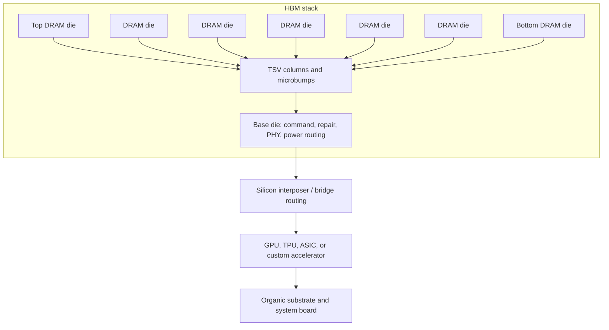
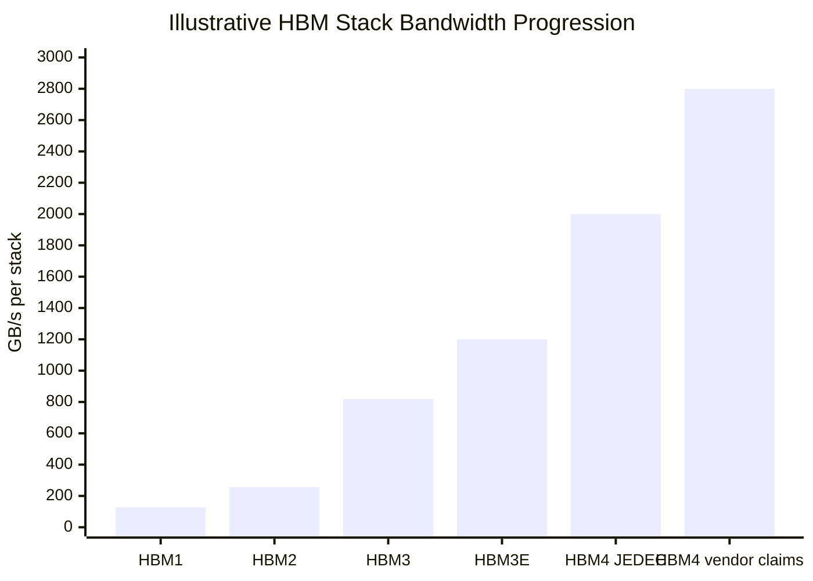

> 英文原文：[打开 03-hbm-deep-dive/01-hbm-fundamentals.md](../../03-hbm-deep-dive/01-hbm-fundamentals.md)。本页为机器辅助简体中文翻译；请以英文原文的数字、脚注与链接为准。

# HBM基本原理：基模、DRAM堆栈、TSV和每瓦带宽

高带宽内存最好被理解为封装定义的DRAM架构，而不是更快的商品DIMM内存版本。 DDR5或LPDDR器件围绕板级通道、主机SoC上的存储器控制器和相对窄的高速电气链路进行优化。 相反， HBM将DRAM芯片垂直堆叠，将其与硅通孔连接，将堆叠放置在基座芯片上，并将内存放置在插入器或高级封装上的加速器旁边。 其结果是一个非常宽、相对短、低摆动的接口，它以封装复杂性换取巨大的总带宽和每个传输比特的更好能量。[^ S048] [^ S049] [^ S050]

即使世代名称从HBM和HBM2转移到HBM3E和HBM4 ，建筑前提仍然保持一致。 内存堆栈在计算芯片附近提供许多并行导线； 加速器消耗张量数学、图形遍历、稀疏专家路由、矢量数据库和其他工作负载的带宽，如果内存无法供给算术单元，则算术单元会停滞。 英伟达2024年3月18日Blackwell公告围绕万亿参数规模的人工智能和机架规模系统构建了平台， GB200 NVL72描述明确结合了72个Blackwell GPU、36个Grace CPU、液体冷却、NVLink和30 TB的快速内存。[^ S058]该系统上下文解释了为什么HBM的定价、分配和设计更像是平台支持组件，而不是商品DRAM SKU。

## 堆栈解剖结构

HBM封装包含多个DRAM内核芯片、一个底座芯片、数千个垂直连接和一个将堆栈逸出到加速器的封装接口。 DRAM芯片包含内存阵列和本地外围电路。 底座模具不仅仅是一个被动基座； 在现代设计中，它执行命令/地址分配、维修处理、物理接口功能、电源传输路由、热/机械接口工作，而在HBM4时代，设备越来越成为内存供应商和加速器客户之间的定制边界。 美光在2025年10月表示，其HBM4方法使用1-伽马DRAM、内部CMOS基模和封装创新，同时还将HBM4E描述为具有客户特定逻辑模定制选项的扩展。[^ S002]

堆栈内部通过TSV连接，垂直导体通过薄硅蚀刻。 TSV为HBM提供了短的垂直路径和高I/O密度，但它们也会产生模具区域隔离区、应力问题、过孔填充屈服风险和热设计约束。[^ S049] [^ S052]这些费用是可以接受的，因为接口宽度远远大于传统的图形内存。 HBM1和后来的HBM2/HBM3时代设备使用1,024位类堆栈接口； HBM4在公共规范摘要中将堆栈接口增加了一倍，达到2,048位， JEDEC的2025标准描述为在2,048位接口上支持高达8 Gb/s ，每堆栈高达约2 TB/s。[^ S048]

堆栈内部通过TSV连接，垂直导体通过薄硅蚀刻。 TSV为HBM提供了短的垂直路径和高I/O密度，但它们也会产生模具区域隔离区、应力问题、过孔填充屈服风险和热设计约束。[^ S049] [^ S052]这些费用是可以接受的，因为接口宽度远远大于传统的图形内存。 HBM1和后来的HBM2/HBM3时代设备使用1,024位类堆栈接口； HBM4在公共规范摘要中将堆栈接口增加了一倍，达到2,048位， JEDEC的2025标准描述为在2,048位接口上支持高达8 Gb/s ，每堆栈高达约2 TB/s。[^ S048]

模具数量通常被描述为高，例如8高、12高或16高。 12高堆叠不仅仅是在8高堆叠上添加四个模具。 它收紧了机械窗口，以实现翘曲、模具流动、微凸点共面性、晶圆薄化、堆叠高度、热阻和已知良好的模具经济性。 SK海力士2025年9月的HBM4报告引用了12高设计、1b-nm DRAM工艺、2,048位I/O和Advanced MR-MUF封装，展示了电气标准和物理装配技术必须如何共同解决。[^ S003]美光的2026年3月HBM4批量生产报告类似地描述了NVIDIA Vera Rubin的36 GB 12高堆栈和48 GB 16高样本，使堆栈h 八个中央容量杠杆，而不是包装脚注。[^ S059]

## 为什么宽而慢胜过窄而快

HBM的核心功率优势来自于在许多短线上移动位，而不是少量的长高速电路板迹线。 传统的GDDR路径在封装和电路板通道上推动非常高的每引脚速率。 HBM加宽了总线，缩短了距离，使内存靠近计算芯片，并减少了长时间互连的充电和放电所消耗的能量。 设计不会自动更便宜或更容易； 它更适合于每位带宽和能量主导系统成本曲线的工作负载。

有用的心理模型是收费公路，许多车道靠近目的地。 商品内存通过更努力地驾驶单个车道以及在电路板或模块级别添加通道来提高速度。 HBM增加了包装内的泳道数。 这就是为什么HBM可以在使用GDDR营销数字之外的引脚速度的同时，每堆栈每秒提供太字节。 接口物理上较大且受封装限制，因此加速器平面图必须为内存连接保留大量的边缘长度、路由资源、功率传输和热余量。

这也是HBM采用率低的原因。 需要容量和低成本的CPU仍然更喜欢DDR/CXL内存池。 消费级GPU通常更喜欢GDDR ，因为封装成本和基板产量比每瓦最大带宽更重要。 AI加速器、HPC GPU、高端网络ASIC以及某些定制推理部件选择HBM ，因为经济瓶颈不仅仅是内存芯片； 这是保持昂贵的矩阵引擎忙碌的价值。 如果数千美元的加速器因内存带宽短而失去利用率，则套餐溢价可能是合理的。

|属性|DDR5 RDIMM/CXL内存|GDDR级显存|HBM级堆栈|
|---|---|---|---|

## 通道、存储体与调度

HBM 的物理宽度不等于自动达到峰值。堆叠内部仍有通道、存储体和 DRAM 时序限制；HBM3 公开资料常描述为 16 个 64 位通道、总计 1,024 位。请求若局部性不佳、发生 bank 冲突或在多堆叠之间分配不均，标称带宽会闲置。稠密矩阵乘法可借助分块、预取与布局接近高利用率；注意力、MoE、嵌入、图与检索访问更不规则，因此控制器、缓存、编译器、DMA 与集合通信决定实际吞吐。

## 每瓦带宽演进

HBM1 证明堆叠概念，HBM2/2E 提升速度和容量，HBM3/3E 成为 AI 主力，HBM4 将接口加宽至 2,048 位并提升基底裸片的重要性。公开资料从 HBM1 约 128 GB/s、HBM3 约 819 GB/s、HBM3E 约 1.2 TB/s，推进到 HBM4 JEDEC 约 2 TB/s、厂商声明 2.8 TB/s 以上。不同厂商的功耗比较受高度、节点与电压影响，不可机械横比；但 HBM4 相比 HBM3E 的能效提升声明说明客户愿意提前锁定稀缺供应。

## 基底裸片：战略边界

基底裸片从早期的接口/路由层发展为 HBM4 的定制边界。它可容纳 PHY、供电、延迟、RAS、测试和客户特定逻辑，而 DRAM 核心仍保持通用。其结果是逻辑代工关系和共同设计更重要、切换成本上升，且能控制基底裸片和封装整合的供应商可能改善利润结构。标准定义互操作边界，但客户定制仍会把堆叠与特定版图、热包络、固件及认证流绑定。

## TSV、微凸点与堆叠良率经济学

每片 DRAM 必须通过阵列、速度、漏电、修复和热标准；每个 TSV、微凸点层、模塑界面和热路径也会引入失效风险。因此必须先分档、修复和追踪已知良品裸片，再堆叠并完成速度、保持、热与封装级测试。新节点、层数、基底裸片或底填流程均可扰动良率，使 HBM 供给扩张慢于晶圆投片量。MR-MUF 等模塑底填诀窍和 TSV 感知散热设计，是与 DRAM 缩放同等重要的竞争能力。

## HBM 与中介层瓶颈

HBM 需要高密度路由连接加速器，常依赖硅中介层、先进晶圆级封装或桥接技术。因此短缺可能发生在 TSV、封装、基板、测试或客户认证，而非 DRAM 晶圆。更多堆叠增加封装面积、供电、散热、基板逃逸布线和周期。HBM4 的 2,048 位接口虽提高单堆叠带宽，也占用更多逻辑裸片边缘；SPHBM4 以更窄外部串行接口维持带宽目标，正反映物理接口成为系统瓶颈。

## 可靠性与认证

HBM 认证属于平台认证：除 JEDEC 功能外，客户要验证翘曲、热循环、液冷、RAS、热瞬态保持、修复政策、固件可见性与持续供货。规格更高的供应商仍需完成验证板、信号完整性、热机械、错误行为和量产验证；因此市占率变化慢于纸面比较。长时间训练与推理也要求很低的错误和停机风险。

## 竞争含义

HBM 使内存成为稀缺的加速器使能子系统。供应商出售的不只是 GB，还包括带宽密度、已验证层数、热性能、基底裸片、封装良率、共同设计与交付保障。其需求拉动先进 DRAM 光刻/刻蚀、TSV、减薄、键合、模塑、检测、热量测、基板、探针卡和高速测试；瓶颈会在这些串行环节之间迁移。

## 来源

完整脚注和英文链接请见[英文原文](../../03-hbm-deep-dive/01-hbm-fundamentals.md)。
|物理放置|主板/模块级别|GPU周围的电路板或封装边缘|包装内逻辑旁边|
|主要优化|容量、可维护性、每GB成本|以较低的封装成本提供图形带宽|带宽密度和每比特能量|
|接口策略|多通道， DIMM/CXL拓扑|更窄的链接，每引脚费率更高|非常宽的堆栈接口，短路由|
|典型瓶颈|延迟、NUMA、CXL开销、通道计数|主板布线、电源、信号完整性|插入器/封装容量，堆叠产量|
|最佳工作负载匹配度|CPU内存扩展、数据库、虚拟化|游戏显卡、工作站显卡|人工智能培训/推理、HPC、网络ASIC|
|物理放置|主板/模块级别|GPU周围的电路板或封装边缘|包装内逻辑旁边|
|主要优化|容量、可维护性、每GB成本|以较低的封装成本提供图形带宽|带宽密度和每比特能量|
|接口策略|多通道， DIMM/CXL拓扑|更窄的链接，每引脚费率更高|非常宽的堆栈接口，短路由|
|典型瓶颈|延迟、NUMA、CXL开销、通道计数|主板布线、电源、信号完整性|插入器/封装容量，堆叠产量|
|最佳工作负载匹配度|CPU内存扩展、数据库、虚拟化|游戏显卡、工作站显卡|人工智能培训/推理、HPC、网络ASIC|

## 渠道、银行和日程安排

HBM的物理宽度并不意味着每个工作负载都会自动看到峰值带宽。 在堆栈中， HBM分为通道和银行，这些资源的时间限制与商品DRAM一样。 HBM3公开摘要描述了一个1,024位堆栈，组织为16个64位信道，使信道计数相对于HBM2E翻了一番，同时将总数据引脚计数保持在同一类中。[^ S048]信道化是有用的，因为加速器可以在许多内部资源上分布独立的内存请求，但它会产生软件和硬件调度问题。 局部性差、银行冲突或跨堆栈访问不平衡的内核可能会使带宽闲置，即使标题堆栈规范看起来很充足。

AI工作负载在不同阶段以不同的方式暴露此问题。 密集矩阵乘法倾向于流式传输大型张量，并且如果调整平铺、预取和数据布局，则可以接近高利用率。 注意力、专家混合路由、嵌入查找、图形操作和检索增强推理可以创建更不规则的访问模式。 然后， HBM系统取决于加速器的内存控制器、封装内路由、缓存层次结构、编译器平铺和集体通信策略。 这就是为什么加速器供应商与张量内核、NVLink、缓存和机架级拓扑一样讨论HBM ，而不是作为一个孤立的内存部分。[^ S058]

刷新和保留仍然是真正的DRAM限制。 HBM仍然将电荷存储在DRAM单元中，因此必须刷新、修复行并保护其免受保留故障的影响。 随着堆叠高度的增加和热量变得更具挑战性，滞留分布可以通过堆叠与温度梯度相互作用。 高温上模、激进工作负载阶段或液冷瞬态可能会改变可用的防护带。 供应商通过流程控制、冗余、错误管理、热监控、仓储和客户特定资格认证来缓解这一问题。 公开的产品发布通常强调带宽和容量，但买家关注保留、RAS和现场可靠性的长尾，因为人工智能集群长期运行昂贵的工作。

堆栈级负载均衡也是一个软件包设计问题。 具有六个或八个HBM堆栈的加速器必须在逻辑管芯周围放置控制器和物理接口，然后将每个接口通过插入器路由到相应的堆栈。 如果模型分片、张量并行分区或推理批处理在堆栈之间映射不均匀，则有效带宽由最热的堆栈而不是平均值控制。 因此， HBM容量、带宽、堆栈计数、缓存大小和软件分区构成了一个设计面。 如果平台受到GPU间通信、主机内存暂存、集体同步或平衡不佳的专家路由的限制，则将带宽提高20-40%的下一代堆栈可能无法改善令牌时间。 可投资的问题不仅仅是“每个堆栈有多少TB/s ？” ，而是“平台向工作负载暴露了多少持续的有用带宽？”

## 每瓦带宽演进

公共HBM进展可以被解读为每瓦带宽的复合故事。 HBM1建立了堆栈概念。 HBM2提高了速度、容量和信道化。 HBM2E推出了成熟的2.5D GPU和加速器。 HBM3和HBM3E将HBM变成了AI加速器的默认内存层。 然后， HBM4拓宽了堆栈界面，并将基模定制推向架构的中心。[^ S048] [^ S002] [^ S003]

数字显示了斜率。 公共HBM摘要列出HBM1 ，每个引脚1 GT/s ，每个包裹约128 GB/s ； HBM3级总结描述了1,024位堆栈，最高可达819 GB/s级； 来自内存供应商的HBM3E报告将实际堆栈带宽提高到1.2 TB/s范围； 2025-2026年的HBM4报告将堆栈级数字提高到2 TB/s以上，在供应商声称中，超过2.8 TB/s。[^ S048] [^ S002] [^ S059]美光公司2025年10月的报告称，其HBM4样品实现了超过2.8 TB/s和超过11 Gb/s的引脚速度，高于参考的JEDEC HBM4基线2 TB/s和8 Gb/s。[^ S002] SK海力士2025年9月HBM4报告称其堆栈使用了2,048位接口和10 GT /s速度，比JEDEC标准高25%。[^ S003]

Power is more difficult to normalize from public disclosures because vendors compare different stack heights, process nodes, voltages, interface rates, and system configurations. Still, the direction is clear. Samsung's February 2026 HBM4 reporting claimed roughly 40% better power efficiency than HBM3E, with a 2,048-pin design, low-voltage TSV changes, thermal improvements, and transfer speeds reported at 11.7 Gb/s with headroom to 13 Gb/s in some configurations.[^S038] Micron's March 2026 HBM4 report said its 36 GB 12-high HBM4 delivered more than 2.8 TB/s, a 2.3x bandwidth improvement, and more than 2 0% better power efficiency versus its HBM3E at the same 36 GB 12-high configuration.[^S059] Treat those as vendor-specific claims rather than a universal law, but they indicate why customers are willing to reserve scarce HBM supply years ahead.

## Base Die As Strategic Boundary

The base die is becoming the most strategically interesting part of HBM. Earlier HBM generations treated the base die mainly as the interface and routing layer below standardized DRAM stacks. HBM4 changes the center of gravity because the interface width doubles, the PHY becomes harder, and customers want memory behavior tuned to specific accelerators. The base die can absorb customization without forcing the DRAM core die to become a fully bespoke product for every GPU, TPU, networking ASIC, or custom AI accelerator.
