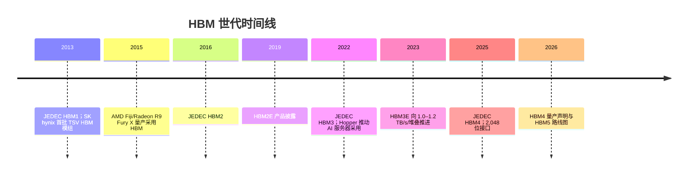

# HBM 世代：HBM1 至 HBM5

> [查看英文原文](../../03-hbm-deep-dive/02-hbm-generations.md)

HBM 的世代不是单纯提速：每一步都会改变接口宽度、每针速率、通道数、堆叠高度、基底裸片功能、热设计与客户认证之间的平衡。公开时间线为 JEDEC HBM1（2013-10）、HBM2（2016-01）、HBM3（2022-01）和 HBM4（2025-04）；HBM2E 与 HBM3E 则是在正式世代之间具商业意义的增强延伸。[^S048] 截至 2026-07，HBM5 应视为路线图和散热目标，而非已定案标准：Samsung 在 Computex 2026 展示模型，SK hynix 讨论用于 HBM5 等未来产品的 iHBM 散热封装，但两者均非已批准标准或量产产品。[^S061][^S062]

## 跨世代规格表

下表是基于公开来源的归一化参考，而非付费 JEDEC 标准或完整产品数据表。HBM 往往在 JEDEC 最低线之前或之外商业化，因此表中同时列出标准与厂商声明；路线图数据均明确标注。

| 世代 | 标准/市场时间 | 接口/通道 | 公开最高针脚速率 | 容量范围 | 带宽范围 | 商业含义 |
|---|---|---|---:|---:|---:|---|
| HBM1 | 2013 标准、2015 AMD Fiji 首用 | 1,024 位级；8×128 位 | 1.0 Gb/s | 至 4 GB | 约 128 GB/s | 证明 TSV 堆叠与中介层可行，但容量不足以支撑后期 AI。[^S048] |
| HBM2 | 2016-01 JEDEC 接受 | 1,024 位级；通常 8 通道 | 2.4 Gb/s | 至 8 GB | 约 307 GB/s | 从概念验证进入 HPC/GPU。[^S048] |
| HBM2E | 2018 更新，2019–20 商业披露 | 增强 HBM2，支持更快及 12-high | 3.6 Gb/s | 至 24 GB | 约 461 GB/s | HBM3 前的 AI/HPC 过渡，容量提升尤其重要。[^S048] |
| HBM3 | 2022-01 标准 | 16×64 位，合计 1,024 位 | 6.4 Gb/s | 早期 16/24 GB | 至约 819 GB/s | Hopper 时代 AI 加速器的内存层。[^S048] |
| HBM3E | 2023 披露、2024 放量 | HBM3 组织、更高速度和容量 | 至 9.8 Gb/s | 至 48 GB；24/36 GB SKU 关键 | 约 1,229 GB/s | 生成式 AI 建设期主力。[^S048][^S059] |
| HBM4 | 2025-04 标准 | 2,048 位；32×64 位 | JEDEC 至 8 Gb/s，厂商称 10–11.7+ | 至 64 GB | JEDEC 约 2 TB/s，厂商至约 3.3 | 接口翻倍，基底裸片与热设计进入共同设计核心。[^S002][^S003][^S038] |
| SPHBM4 | 2025-12 报道接近定稿 | 512 位外部接口、4:1 串行化 | 未完整公开 | 目标保留至 64 GB | 目标 HBM4 级 | 为降低封装面积/集成成本的分支，不是 GDDR 替代品。[^S060] |
| HBM5 | 2026 模型/路线图 | KAIST 预测 4,096 位 | 未定 | 未定 | 预测约 4 TB/s | 重点由带宽转向散热与堆叠可持续性。[^S061][^S062] |

## HBM1：封装概念验证

HBM1 证明 TSV 堆叠 DRAM 能成为商业图形内存。公开历史称 SK hynix 2013 年制造首个 TSV HBM 模组、JEDEC 同年采纳 HBM、2015 年 AMD Fiji 是首批量产采用者。[^S048] 它没有创造如今的 AI 市场，却使系统设计者看见将带宽移入封装的可行性。

它的限制也很明确：约 4 GB、128 GB/s/堆叠。四堆叠的带宽相对 GDDR5 很突出，但总容量过小，且中介层成本和封装复杂度使其无法成为所有高端 GPU 的默认选择。HBM1 的真正遗产是显示：一代 HBM 必须同时可堆叠、可路由、可测试、有良率、可冷却并能按平台节奏交付。

## HBM2：从新奇走向 HPC 内存层

HBM2 于 2016 年获 JEDEC 接受，公开表列为 2.4 Gb/s、至 8 GB、约 307 GB/s/堆叠。[^S048] 它同时改善带宽和容量，虽仍面对成本更低、实现更简单的 GDDR，却更适合 HPC GPU、专业加速器和高带宽网络芯片。其供应链含义是：从 HBM1 到 HBM2 需要提升 TSV 良率、组装、中介层经济性及客户承诺；HBM 的小客户基础提高单价，却也加强了供应商与客户的认证协作。带宽、容量、集成成本三者的谈判成为以后每代的模式。

## HBM2E：增强型桥梁

HBM2E 是首个显著的 “E” 桥梁：并非从零开始，却足以改变商业价值。JEDEC 2018 年更新 HBM2 以支持更高带宽/容量和 12-high，Samsung Flashbolt 与 SK hynix 2019 年披露约 410–460 GB/s/堆叠；公开表列 3.6 Gb/s、约 461 GB/s。[^S048]

“E” 代使供应商将制程、封装与分档改进变现，客户无需立刻迁移至下一完整平台。它也预示 AI 时期的采购现实：增强代与下一标准代会重叠，因而同时占用部件、测试、封装和认证资源；当 CoWoS 类产能、TSV 与高速测试紧缺时，这种重叠尤其昂贵，促成多年路线图合同。

## HBM3：通道化与 AI 服务器拉动

HBM3 于 2022-01-27 发布，公开资料为 16 个 64 位通道、总 1,024 位接口、至约 819 GB/s/堆叠。[^S048] 关键不只在宽度，而在更多通道带来的调度并行度。它与 Hopper 时代相互放大：SK hynix 开始为 NVIDIA H100 量产 HBM3，GPU 的多堆叠配置带来数 TB/s 总带宽。[^S048]

但物理带宽不等于有效吞吐。HBM FPGA 排序研究使用 32 个通道并指出，算法和片上资源扩展会限制对 HBM 的完全利用。[^S063] 同样地，GPU/ASIC 的编译器、内核、缓存、DMA 与集合通信决定能实现多少有效带宽。

## HBM3E：AI 主力

HBM3E 在 2023 年披露、2024 年放量，把每堆叠从不足 1 TB/s 的 HBM3 推向 1.0–1.2 TB/s 级。公开表列最高 9.8 Gb/s、16-die 下至 48 GB、约 1,229 GB/s/堆叠。[^S048] 24、36 与 48 GB 之争同样重要：大模型、长上下文、批量和 KV cache 会要求容量；即使算力和瞬时带宽足够，无法容纳模型状态/激活/优化器状态也会削弱平台经济性。

HBM3E 成为 HBM4 能效的比较基准。Micron 在同一 36 GB 12-high 配置下称 HBM4 带宽提高 2.3 倍、能效提升逾 20%；Samsung 称约 40%。这些是厂商特定声明，但确认 HBM3E 是下一代必须战胜的基线。[^S059][^S038]

## HBM4：更宽接口、定制基底裸片、更高赌注

JEDEC HBM4 公开摘要为：2,048 位、至 8 Gb/s、约 2 TB/s/堆叠、4–16 层、24/32 Gb die 密度下至 64 GB。[^S048] 接口翻倍虽是亮点，也让加速器需投入更多边缘、路由与供电资源。随后厂商突破基线：SK hynix 报告 10 GT/s、1b-nm 与 Advanced MR-MUF；Micron 称超过 2.8 TB/s、11 Gb/s 以上、1-gamma 和内部 CMOS 基底裸片；Samsung 称 11.7 Gb/s、可至 13 Gb/s、约 3.3 TB/s，且较 HBM3E 能效高约 40%。[^S003][^S002][^S038]

HBM4 将 PHY、路由、RAS、功耗、测试以及客户逻辑移向可定制基底裸片。Micron 明言 HBM4E 可提供客户专用逻辑裸片选项。[^S002] 这使 HBM 从“更多带宽”变成与具名加速器平台相连的半定制内存子系统。

## SPHBM4：绕开物理接口压力的分支

2025-12 报道称 JEDEC 接近定稿的 Standard Package HBM4 将外部接口从 2,048 位缩至 512 位，以 4:1 串行化维持 HBM4 级带宽，并使用标准 HBM4 DRAM 与行业标准基底裸片。[^S060] 目标是在较常规有机基板上实现 2.5D 集成，减少昂贵硅中介层依赖。它不是替换 HBM4/GDDR，而是为无法承受完整 2,048 位接口的 AI/HPC 设计提供容量、面积和成本折衷。

## HBM5：先解决散热，再谈正式规格

HBM5 还不是可按 HBM4 对待的规范。SK hynix 2026-05 发布 iHBM：在封装内、靠近 die-to-die PHY 的集成冷却元件，称热阻可降低 30% 以上，并计划用于 HBM5 等产品。Samsung 在 Computex 展示带 Heat Path Block 的 HBM5 模型，确认基底裸片采用内部 2nm，且 HPB 已在 HBM4E 样品验证。[^S061][^S062]

Tom's Hardware 引述 KAIST 路线图预测 4,096 位、约 4 TB/s、约 100 W/堆叠，并称 Samsung 与 SK hynix 均不预期 2028 年前量产。[^S062] 这些只是预测，但说明若单堆叠功耗接近 100 W，冷却结构将成为世代定义的一部分。正式标准/量产出现前，应追踪热架构、基底裸片制程、客户共同设计与生产时点，而非把单一带宽数字当作定论。

## 正确解读世代表

表中数字是边界而非保证：实际带宽取决于堆叠高度、die 密度、针脚率、控制器、热条件和产品分档；厂商最高声明不等于每个 SKU 的 JEDEC 兼容值。尤其 HBM4/HBM5，应区分基线、样品、认证、量产与路线图。比较时还需保持容量和高度一致，并询问平台的持续有效带宽，而非只看每堆叠峰值。

## 商业周期含义

HBM 代际转换会让多个供应链节点同时变化：DRAM 节点、TSV、微凸点/混合键合、基底裸片、测试、封装、中介层、基板与客户认证。供应商早期可享技术溢价，失败者也可能在看似短小的节点上失去平台份额。HBM3E 与 HBM4 的重叠使客户同时锁定两代产能；HBM4E/定制基底裸片则增加切换成本和共同设计黏性。投资上应将世代转换视为整个平台产能与认证周期，而非仅 DRAM 位元增长。

## 来源

[^S002]: Micron HBM4，TechRadar，https://www.techradar.com/pro/micron-takes-the-hbm-lead-with-fastest-ever-hbm4-memory-with-a-2-8tb-s-bandwidth-putting-it-ahead-of-samsung-and-sk-hynix
[^S003]: SK hynix HBM4，Tom's Hardware，https://www.tomshardware.com/pc-components/dram/sk-hynix-completes-development-of-hbm4-2-048-bit-interface-and-10-gt-s-speeds-promised
[^S038]: Samsung HBM4，TechRadar，https://www.techradar.com/pro/samsung-says-it-took-the-leap-with-hbm4-as-it-starts-shipping-faster-ai-memory-built-on-advanced-process-nodes
[^S048]: High Bandwidth Memory，Wikipedia，https://en.wikipedia.org/wiki/High_Bandwidth_Memory
[^S059]: Micron HBM4 production，Tom's Hardware，https://www.tomshardware.com/pc-components/dram/micron-enters-high-volume-production-of-hbm4-for-nvidia-vera-rubin
[^S060]: SPHBM4，Tom's Hardware，https://www.tomshardware.com/pc-components/dram/industry-preps-cheap-hbm4-memory-spec-with-narrow-interface-but-it-isnt-a-gddr-killer-jedecs-new-sphbm4-spec-weds-hbm4-performance-and-lower-costs-to-enable-higher-capacity
[^S061]: SK hynix iHBM，公开报道。
[^S062]: HBM5 Computex 报道，Tom's Hardware，公开报道。
[^S063]: HBM FPGA sorting，arXiv，2022。
