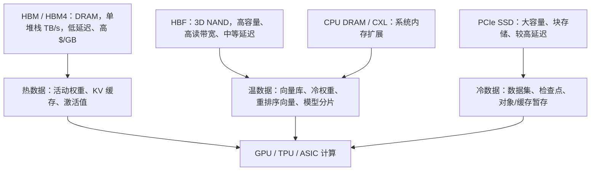
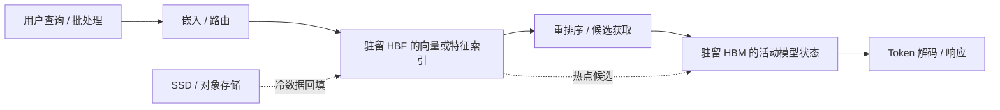

# 高带宽闪存（HBF）概览：位于 HBM 与 SSD 之间的 NAND

> [查看英文原文](../../04-hbf-emerging-tech/01-hbf-overview.md)

高带宽闪存（High Bandwidth Flash，HBF）是一种尝试：把 NAND 更紧密地放进加速器的存储层级。它不是 HBM——介质仍为 NAND，延迟远高于 DRAM；它也不是传统 SSD——目标是提供远高于 PCIe/NVMe 存储盘的带宽、更少协议开销及更紧的加速器集成。其核心投资逻辑是形成一个新层级：容量达到 TB、非易失、比 SSD 更靠近 GPU/TPU 内存、而成本和扩展性更接近 NAND 而不是 HBM。

## 定义与动机

AI 推理面临的容量问题，单靠 HBM 无法经济地解决。HBM 对热数据非常好，却昂贵、供应紧、功率密度高且受封装面积限制。普通 SSD 则便宜且高密度，但经 PCIe/NVMe、主机 DRAM、CPU 以及块粒度访问的软硬件路径，对于延迟敏感推理或重检索工作负载可能太慢。HBF 瞄准的正是这一缺口。

2026 年公开报道将 HBF 描述为面向推理 AI 服务器、位于 HBM DRAM 与传统 NAND SSD 之间的 NAND 标准[^S098]。SanDisk/SK hynix 在 2025 年的报道则称，它有望以高带宽特性组合 NAND，容量可达 DRAM HBM 的 8–16 倍[^S099]。这些数字应视为方向性判断而非最终产品保证；接口、控制器拓扑、主机集成、软件栈、耐久管理和量产节奏仍是决定因素。

前沿推理系统可能拥有足够的计算和 HBM 带宽来处理活动计算，但模型状态、检索向量、嵌入、缓存溢出和长上下文数据会吃掉巨大容量。若它们全部放入 HBM，成本和供给会成为限制；若全部放在普通 SSD，检索和搬运会主导延迟。HBF 的目的是让更多数据保留在设备上或设备附近。

## 架构概念

HBF 的架构有三部分：以高密度、非易失、单位比特远低于 DRAM 的 3D NAND 承载容量；通过封装、控制器拓扑、接口宽度、信号方式和内部并行度提高带宽；再让软件把它当作“邻近内存的存储”而不是通用 SSD。

Kioxia 2025 年原型提供了一个现实路径：5 TB、64 GB/s 的 PCIe 6.0 模块，采用类似 SSD 的外形、串接控制器、PAM4、本地控制器，功耗低于 40 W[^S047]。其延迟仍高于 DRAM HBM，但带宽和容量适合需要大规模流式读取、而非超低延迟随机 DRAM 访问的 AI 工作负载。

研究则描绘了更激进的封装内方向。2026 年 HAVEN 论文把 HBF 建模为堆叠式 3D NAND：TB 级容量、数百 GB/s 读带宽，作为 HBM 的封装内补充，使全精度向量库可驻留设备上并消除重排序时的 PCIe、DDR 瓶颈[^S100]。这比 PCIe 模组更难实现，却明确了终局：越能减少加速器外的数据移动，HBF 越有价值。

控制器位置是关键取舍。PCIe 挂接方案可复用服务器基础设施、看起来像更快的 SSD，但仍需承担协议和拓扑开销；靠近封装的设备可缩短路径，却增加封装、散热、可维护性和验证复杂度；封装内层级能最大限度消除主机内存往返，却把闪存控制器、ECC、热设计、供电和故障管理都变成加速器封装的一部分。

NAND 单元本身慢于 DRAM，但可通过大量 plane、die、channel 和封装并行工作。实际 HBF 带宽取决于如何利用并行度并隐藏读延迟，因此控制器、页调度、ECC 流水线和缓冲区尺寸不是枝节，而是产品本身。访问粒度也很重要：HBM 可低延迟服务类似缓存行的访问，NAND 偏好页/块访问，且必须处理 ECC、读重试和磨损管理。软件必须批量化、预取、压缩并对齐数据，才能避免无效过取。

## HBF 在层级中的位置

HBF 应位于 HBM 与 SSD 之间，而非取代 HBM。HBM 仍服务于活动计算：当前层权重、激活、梯度、优化器状态和热 KV 缓存。HBF 更适合温数据：大型向量索引、冷模型权重、稀疏专家权重、嵌入后的检索文档、多模态特征以及必须快速读取但不要求 DRAM 延迟的溢出数据。SSD 继续承担冷数据、检查点、数据集、对象存储暂存和低延迟要求不高的检索。

因此，HBF 不会让所有 AI 工作负载变快。反复从 HBM 流式读取热权重的密集矩阵乘法不会从 NAND 延迟获益；但需要从 SSD→CPU DRAM→GPU HBM 搬运向量的 RAG 流水线可能受益。大型嵌入表的推荐系统也可能受益，前提是访问足够带宽导向且软件可掩盖延迟。以 all-reduce 和 HBM 激活为主的训练任务则影响较小。

## 推理 TCO 的理由

第一项杠杆是 HBM 稀缺性。HBM 依赖先进 DRAM 晶圆、TSV 堆叠、先进封装与平台验证；2026 年报道指出，客户已提前数年预订 HBM 供应[^S077]。若 HBF 能减少温/冷数据所需的 HBM，即使它比普通 NAND 贵，系统级成本也可能下降。

第二项是功耗。把数据从 SSD 经 CPU 内存搬入 GPU HBM 会消耗能量并增加延迟。近加速器闪存层可减少主机 I/O 路径往返。Kioxia 以 5 TB、64 GB/s、低于 40 W 为例[^S047]；HAVEN 的模型显示，相比 GPU-DRAM 或 GPU-SSD，HBF 增强 GPU 在十亿级向量重排序上吞吐最多可提高 20 倍、延迟最多改善 40 倍[^S100]。这些是建模结果而非已出货系统基准，却说明了架构师的兴趣所在。

第三项是每个封装/节点的容量。若 HBF 如报道所称提供 HBM 的 8–16 倍容量，节点可容纳更大的检索索引或模型邻近数据，而无需增添 HBM 堆栈[^S099]；后者会增加封装面积、中介层复杂度、热负荷与供应风险。第四项是利用率：如果检索或冷权重移动使 GPU 停顿，昂贵计算就被浪费。HBF 的价值在于把等待时间转成已服务 token 或结果。

它也可缓解供应链压力：HBM 消耗受限的先进 DRAM 和封装产能，而 NAND 属于不同制造基础和每比特成本曲线。它不能减少活动模型路径对 HBM 的需求，却可能避免为了温数据而过度配置 HBM。拓扑可按每加速器、每底板或每机架部署：前者最大化局部性，池化提高利用率但引入网络延迟和调度复杂度。

## 软件要求

HBF 很可能不是即插即用。运行时需要决定什么留在 HBM、什么放 HBF、什么放 SSD/主机内存，并实现预取、放置、缓存准入与驱逐、错误处理、磨损感知、压缩和模型感知调度。仅使用块存储抽象可能遗留大量性能；太像内存的抽象又需要新的编程模型与一致性规则。

HAVEN 聚焦 ANN 搜索和重排序：当十亿级向量库放不进 GPU HBM、只能在 CPU DRAM 或 SSD 中时，全精度重排序会成为瓶颈[^S100]。这类大读、多结构化访问、离开 GPU 会产生明显惩罚的任务最适合 HBF；微小随机更新或对单字访问极其敏感的任务则不适合。NVLLM 研究同样提出面向边缘 LLM 的 3D NAND 中心架构：注意力在轻量 CMOS 上执行，前馈网络部分卸载到闪存[^S101]；它提示 NAND 可从被动存储走向计算/内存邻近角色，但 ECC、缓冲、页访问与调度不可少。

候选数据包括向量嵌入、压缩专家权重、词元/嵌入表、用于模型换入换出的冷层、文档片段、图像视频特征和重排序候选。不同类别读写比和延迟容忍度不同，因此 HBF 感知运行时必须基于访问频率在 HBM、HBF、主机内存与 SSD 之间迁移数据，更像内存管理器而非传统文件系统。多租户时还需加密、安全擦除、命名空间隔离、遥测和 QoS，且不可通过共享 HBF 争用泄漏访问模式。

## 厂商与生态位置

公开报道中最显眼的标准化组合是 SanDisk 与 SK hynix：2026 年二者宣布面向推理服务器的 HBF，并拟由 OCP 管理[^S098]；2025 年的 MoU 提及 BiCS NAND、CBA 晶圆键合，早期硬件集成目标为 2027 年初[^S099]。这意味着它被定位为生态标准而非单一专有 SSD。

Kioxia 是资料中最明显的原型展示者，其 5 TB/64 GB/s 模块说明 SSD 样外形配合更高带宽和更直接的内存总线路径是一条可行路线[^S047]。这可能更易导入，却保留更多延迟和协议负担。最终市场可能形成多种 HBF 类层级：PCIe 模组、封装邻近设备，以及最终的逻辑整合闪存。三星等 NAND 供应商也拥有 3D NAND、封装能力和 AI 内存动机；关键竞争问题是 HBF 能否足够开放、允许多个 NAND 供应商供货，还是早期实现会绑定特定控制器和封装。

## 采用路线图

第一阶段是开发者和超大规模云厂商实验，重点应放在 RAG/向量搜索、推荐、冷权重暂存与大型嵌入表——它们是读带宽密集情形，不是通用存储替代[^S047][^S100]。第二阶段是系统集成：HBF 必须能被服务器与加速器厂商布线、散热、供电和管理。PCIe 6.0 模组最易试点；若软件栈能利用局部性，封装邻近 HBF 的价值更高。OCP 标准化可降低互操作和可管理性障碍[^S098][^S099]。

第三阶段是运行时采用：需要放置 API、监控、基准和模型服务框架支持。没有运行时感知，HBF 只是高速但利用不足的存储；有了感知，它才构成 HBM（热张量）、HBF（温的模型邻近数据）与 SSD/对象存储（冷容量）的 AI 层级。验证也不能只测顺序带宽，而需覆盖向量重排序、长上下文服务、嵌入查找、混合读大小、并发租户、热节流和设备错误恢复。

## 风险与未决问题

首要风险是延迟：NAND 不能像 DRAM 一样工作，HBF 可增加带宽、并行性和局部性，但随机读延迟和粒度限制依旧存在。它应被宣传为 HBM 补充而非替代。其次是耐久性：推理读多写少对 NAND 有利，但缓存抖动、频繁更新、索引重建与写放大仍需强大的磨损均衡、ECC、坏块管理和遥测；越接近加速器封装，可维护性越差。

接口碎片化是第三个风险：PCIe、CXL、专有内存总线或封装内链路会带来不同软件支持。OCP 的标准必须覆盖设备模型、遥测、管理、安全和性能行为，而非只规定物理形态。第四个风险是工作负载匹配：RAG、向量搜索、推荐、稀疏专家存储和冷权重暂存很有前景，密集训练核与热缓存路径则不明显。模型架构、上下文长度和多模态检索的变化都会影响需求。

最后是运维与时间表。数据中心已管理 GPU、CPU、NIC、SSD、CXL、液冷、固件和调度器；HBF 又增加一个故障域。要规模化部署，需暴露健康/预测故障、错误、温度、带宽、命名空间和机队管理接口。MoU、顾问委员会、原型到多供应商量产之间的距离可能很长[^S098][^S099]。

## 结论

HBF 试图为 AI 推理创建“邻近内存的 NAND 层”。它并不在延迟上胜过 HBM，也不在成本上胜过 SSD；其价值是比 HBM 容量大得多、又比传统 SSD 具有更贴近加速器的带宽。短期商业成败取决于标准化、软件支持及早期硬件能否把这一中间层变成可部署产品。对本数据库而言，应把 HBF 追踪为 HBM 稀缺的潜在泄压阀和 NAND 的增长方向。

## 来源

[^S047]: Kioxia 5TB、64 GB/s 闪存模块报道，Tom's Hardware，2025-08-23，https://www.tomshardware.com/pc-components/gpus/kioxias-new-5tb-64-gb-s-flash-module-puts-nand-toward-the-memory-bus-for-ai-gpus-hbf-prototype-adopts-familiar-ssd-form-factor
[^S077]: AI 驱动的内存短缺报道，Tom's Hardware，2026-04-30，https://www.tomshardware.com/tech-industry/artificial-intelligence/samsung-and-sk-hynix-warn-ai-driven-memory-shortages-could-last-until-2027-and-beyond-as-hbm-demand-explodes-customers-already-reserving-supply-years-ahead-while-the-wider-dram-market-begins-to-tighten
[^S098]: SK hynix 与 SanDisk 宣布 HBF 标准，Tom's Hardware，2026-02，https://www.tomshardware.com/pc-components/ssds/sk-hynix-and-sandisk-announce-new-high-bandwidth-flash-speedy-hbf-standard-is-targeted-at-inference-ai-servers
[^S099]: SanDisk 与 SK hynix 标准化 HBF，Tom's Hardware，2025-08，https://www.tomshardware.com/tech-industry/sandisk-and-sk-hynix-join-forces-to-standardize-high-bandwidth-flash-memory-a-nand-based-alternative-to-hbm-for-ai-gpus-move-could-enable-8-16x-higher-capacity-compared-to-dram
[^S100]: HAVEN，arXiv，2026-03-01，https://arxiv.org/abs/2603.01175
[^S101]: NVLLM，arXiv，2026-04-28，https://arxiv.org/abs/2604.25699
