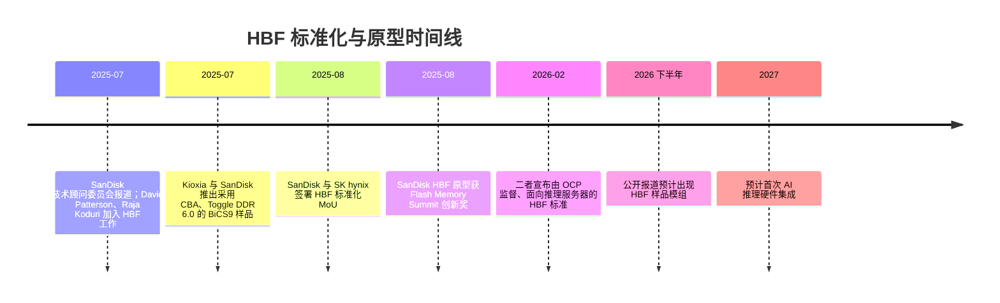

# HBF 标准化：OCP、SanDisk、SK hynix、BiCS 与通往 AI 推理硬件的路径

> [查看英文原文](../../04-hbf-emerging-tech/02-hbf-standardization.md)

高带宽闪存标准化的目标，是把有吸引力的高速 NAND 概念变成可部署的 AI 基础设施组件。问题不只是 NAND 能否更快，而是加速器厂商、超大规模云、内存厂、控制器厂和服务器 OEM 能否在接口、设备模型、管理面、可靠性和软件栈上达成足够共识。缺少标准，HBF 会成为各自为政的高速闪存模组；标准可信，才可能成为 HBM 和 SSD 之间的温内存层级。

## 需要标准化什么

HBF 不能简单复制 NVMe 或 HBM。NVMe 假定队列、命名空间和块存储管理；HBM 假定封装本地、超宽且低延迟的 DRAM 链路。HBF 位于两者之间：必须提供高读带宽和高容量，却不能假装 NAND 具有 DRAM 延迟。

最小标准至少有五部分。第一是物理/电气接口，包括外形、通道、信号、功耗和热设计。Kioxia 的 2025 原型是 SSD 样外形、PCIe 6.0、PAM4、串接控制器，在 5 TB/64 GB/s 下低于 40 W[^S047]；这是可能路径，不必然是最终标准。第二是逻辑访问模型：若只暴露为块 SSD，软件无法充分利用内存邻近潜力；若过于内存化，又要定义一致性、排序、错误处理和访问粒度。标准需决定它是块存储、字节寻址内存、专用加速器设备还是混合模型。

第三是管理遥测。数据中心需监控温度、介质磨损、错误率、带宽计数、节流、命名空间健康、固件、安全状态及预测故障。没有这些，HBF 无法像 SSD 或加速器卡那样被机队管理。第四是软件契约：放置 API、预取提示、缓存策略、张量/运行时和向量数据库/模型服务框架的集成，与裸带宽同样重要。HAVEN 将 HBF 作为 HBM 的封装内补充，在全精度向量访问中消除 PCIe/DDR 瓶颈[^S100]；标准必须支持这种优化，而不是把 HBF 隐在慢路径通用存储接口之后。第五是可靠性和可维护性：NAND 的 ECC、坏块、读重试、磨损均衡和掉电处理要以 AI 运行时可容忍的方式暴露；向量库或权重存储的静默数据错误会降低推理质量。

## SanDisk 与 SK hynix：从 MoU 到 OCP

公开路径始于二者。2025 年 8 月，报道指 SanDisk 和 SK hynix 签署 HBF 标准化 MoU；HBF 被描述为采用 HBM 类封装的 NAND，目标容量为 DRAM HBM 的 8–16 倍。报道还称 SanDisk 原型采用 BiCS NAND、CBA 晶圆键合，获得 FMS 2025“最具创新技术”奖，并预计 2026 下半年提供样品、2027 年初在 AI 推理硬件中首次集成[^S099]。

2026 年 2 月的报道称双方将 HBF 作为推理 AI 服务器内存标准共同宣布，并由 Open Compute Project（OCP）监督[^S098]。其定位是 HBM DRAM 与闪存 SSD 之间的支持层，而非已完成的 HBM 替代品。OCP 是最关键线索：这指向开放的数据中心部署，而不是单厂专有模组。

双方的组合具战略意义。SanDisk 带来 NAND 和闪存系统能力，以及通过长期 Kioxia 合作形成的 BiCS/CBA 系谱[^S005][^S099]；SK hynix 带来 HBM 领导地位、AI 客户关系、DRAM/HBM 封装可信度和系统相关性[^S066][^S067]。HBF 同时需要闪存密度与 HBM 级的加速器邻近性。

## 技术顾问委员会与 NAND 背景

SanDisk 技术顾问委员会为项目增加了架构可信度。2025 年报道说 David Patterson 领导委员会，Raja Koduri 加入并带来 GPU 架构经验；描述中包含 BiCS、CBA、密集 die 堆叠以及与 HBM 接口的兼容性[^S102]。另一报道称 HBF 可能通过 TSV 和逻辑 die 连接多颗 3D NAND，使 AI 卡获得最高 4 TB“显存”[^S103]。这些是概念/顾问阶段表述，并非已验证量产规格，但两人的系统背景有助于让项目围绕真实瓶颈：数据放置、软件控制、故障处理和适用工作负载。

BiCS9 与 CBA 的意义在于逻辑和存储阵列可分开制造再键合。Kioxia/SanDisk 2025 年样品采用成熟的 112 层 BiCS5 结构、CBA 与 Toggle DDR 6.0，最高 4.8 Gb/s，并改善读写速度与能效[^S005]。资料并未确认 HBF 就使用 BiCS9[^S099]；可靠结论只是 HBF 借力 BiCS/CBA 专长，而 CBA 让控制器、ECC、缓冲、调度和接口电路能在不牺牲 NAND 阵列工艺的情况下分别优化。

## OCP 的潜在角色

OCP 表明 HBF 面向超大规模基础设施。云厂商需要互操作硬件、通用管理、热/机械纪律及多供应商。HBF 的 OCP 规范可分为：定义尺寸、连接器、供电和冷却的机械规范；定义 PCIe/CXL 类或新型高带宽链路的电气规范；定义遥测和安全的管理规范；定义放置提示或运行时访问语义的软件规范；以及为向量检索、长上下文推理、推荐建立工作负载基准的测试规范。

基准尤其关键。顺序带宽漂亮不代表真实推理表现好。合理验收应测试向量重排序、长上下文、嵌入查找、混合读大小、并发租户、热节流和错误恢复；超大规模客户只有在总拥有成本改善时才会部署新层级。

## 标准检查表

| 标准层 | 意义 | 核心问题 |
|---|---|---|
| 机械外形 | 决定能否像 SSD 维护、靠近加速器或封装集成 | 初代标准偏 PCIe 模组、底板模组还是多种 profile？ |
| 电气接口 | 决定带宽、延迟开销、信号完整性和兼容性 | PCIe 6.0 足够试点，还是需要更像内存的链路？ |
| 访问语义 | 决定软件把 HBF 当块、内存、缓存或 scratch 容量 | 能否同时支持向量搜索与冷权重暂存？ |
| 管理遥测 | 支持监控、故障预测、热策略和安全 | 是否强制健康计数与命名空间控制？ |
| 可靠性模型 | NAND 需要 ECC、读重试、坏块和磨损报告 | 介质行为暴露给运行时多少？ |
| 安全模型 | 可能保存客户嵌入、权重、检索数据 | 加密、安全擦除、隔离和证明是否进基准规范？ |
| 基准套件 | 防止只优化顺序 GB/s | 哪些推理任务成为准入测试？ |

## 利益相关方与集成形态

NAND 厂商包括 SanDisk、Kioxia、三星、美光和 SK hynix，但公开材料中 SanDisk/SK hynix 处于领导位置[^S098][^S099]；Kioxia 展示了高速原型，且与 SanDisk 共享 BiCS/CBA 背景[^S047][^S005]。加速器厂商（NVIDIA、AMD、Google 与定制 ASIC）则须决定是否值得承担封装、固件和软件复杂度。PCIe 存储形态不要求深度封装变更；封装邻近形态则要投入板面积、供电、冷却、控制资源和验证。超大规模云最可能最早采用，因为它们同时拥有工作负载、机队软件和推理数据移动的经济痛点。

标准可设多种 profile：类似 Kioxia 的 PCIe 6.0 模组适合快速导入和维护，但保留较多主机路径延迟；底板 profile 更靠近 GPU/ASIC；封装邻近 profile 局部性最好但需深度协同设计。共同语义加多种物理路径，可以让早期客户先用模块验证软件价值，之后再投入昂贵的封装邻近方案。

## 样品、量产与风险

公开时间表仍很早：2025 年报道预期 2026 下半年样品、2027 年初首批集成[^S099]；2026 年报道尚无正式发布日期，并认为需求可能在 2030 年上升[^S098]。从原型到广泛量产需过四关：验证带宽、功耗、热和基础软件价值；完成合规设备规范；客户采样并跑真实基准；最后以稳定固件、遥测和多供应商支持投入生产。

主要风险是把 HBF 夸大为 HBM 等价物——正确语言应是“HBM 补充/温内存”。接口碎片化会拖慢软件采用；软件若不拥有放置与运行时集成，HBF 只是快 SSD。读密集推理有利于 NAND，但索引更新、模型刷新、缓存抖动和写放大仍需要磨损和错误遥测。供应商政治也重要：若规范过度绑定单厂，要求第二来源的云客户不会大规模采用。

## 对内存栈的含义与观察项

标准成功时，AI 服务器将从 HBM、DDR/CXL、SSD/对象存储的三层模型，增加一层更接近加速器、比 HBM 大且便宜、但比 DRAM 慢的 HBF。RAG、推荐、稀疏模型、长上下文与可预取的模型服务最受益。若标准失败，同一需求仍可由专有快 SSD、CXL 扩展器、更大 HBM 或应用专用 NAND 加速器满足；市场需求得到验证，但 HBF 作为品类的可投资性下降。

应关注 OCP 工作组/草案、2026 下半年样品、NVIDIA/AMD/Google/云厂/OEM 是否公开参与、框架是否增加 HBF 放置 API，以及 BiCS/CBA 是否被明确关联到量产 HBF。真正决定性的信号将是一套署名的、带工作负载基准的 HBF 推理系统。

## 来源

[^S005]: Kioxia/SanDisk BiCS9 样品，Tom's Hardware，2025-07-27，https://www.tomshardware.com/pc-components/storage/kioxia-and-sandisk-start-shipping-bics9-3d-nand-samples-hybrid-design-combining-112-layer-bics5-with-modern-cba-and-ddr6-0-interface-for-higher-performance-and-cost-efficiency
[^S047]: Kioxia HBF 原型，Tom's Hardware，2025-08-23，https://www.tomshardware.com/pc-components/gpus/kioxias-new-5tb-64-gb-s-flash-module-puts-nand-toward-the-memory-bus-for-ai-gpus-hbf-prototype-adopts-familiar-ssd-form-factor
[^S066]: SK hynix HBM 需求报道，Tom's Hardware，2026-06-23，https://www.tomshardware.com/tech-industry/sk-hynix-passes-samsung-as-south-koreas-most-valuable-company-on-hbm-demand
[^S067]: SK 内存短缺报道，Tom's Hardware，2026-03-18，https://www.tomshardware.com/pc-components/dram/sk-group-chairman-says-memory-chip-shortage-will-last-until-2030
[^S098]: HBF 推理服务器标准，Tom's Hardware，2026-02，https://www.tomshardware.com/pc-components/ssds/sk-hynix-and-sandisk-announce-new-high-bandwidth-flash-speedy-hbf-standard-is-targeted-at-inference-ai-servers
[^S099]: SanDisk/SK hynix HBF 标准化，Tom's Hardware，2025-08，https://www.tomshardware.com/tech-industry/sandisk-and-sk-hynix-join-forces-to-standardize-high-bandwidth-flash-memory-a-nand-based-alternative-to-hbm-for-ai-gpus-move-could-enable-8-16x-higher-capacity-compared-to-dram
[^S100]: HAVEN，arXiv，2026-03-01，https://arxiv.org/abs/2603.01175
[^S101]: NVLLM，arXiv，2026-04-28，https://arxiv.org/abs/2604.25699
[^S102]: SanDisk HBF 顾问委员会，TechRadar，2025-07，https://www.techradar.com/pro/sandisk-high-bandwidth-flash-gets-serious-as-david-patterson-and-raja-koduri-join-technical-advisory-board
[^S103]: Raja Koduri 加入 SanDisk，Tom's Hardware，2025-07-25，https://www.tomshardware.com/tech-industry/artificial-intelligence/ex-intel-and-amd-chief-architect-raja-koduri-joins-sandisk-to-standardize-potentially-massive-4tb-of-vram-on-ai-cards
