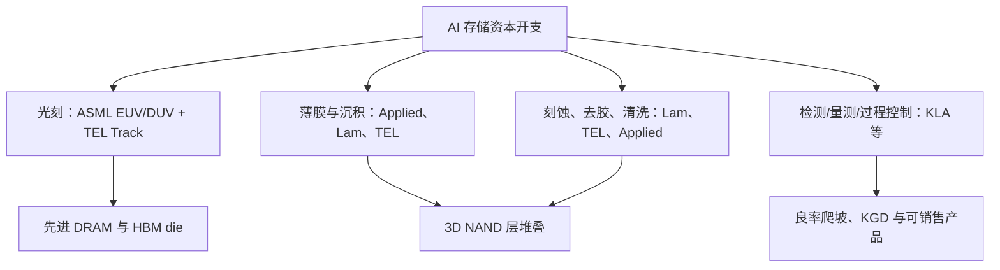

# 晶圆厂设备供应商：ASML、应用材料、Lam Research、东京电子与 KLA

> [查看英文原文](../../07-semicap-ecosystem/01-wafer-fab-equipment-vendors.md)

晶圆厂设备（WFE）是存储行业隐形的产能台账。厂商可以宣布 fab、洁净室或封装厂，但有用产出仍取决于光刻机、沉积/刻蚀腔体、清洗和过程控制设备、搬运系统、备件、现场服务、厂务接入及工艺工程师是否按时到位。HBM、先进 DRAM、高层 NAND、CBA/混合键合和先进封装对不同设备家族的压力并不相同：ASML 是光刻卡点；应用材料覆盖广泛材料工程；Lam 是存储刻蚀/沉积强度的受益者；东京电子覆盖涂胶显影、刻蚀、清洗、测试及键合；KLA 则通过检测和量测推动良率学习。

## WFE 为何对存储重要

先进 DRAM 要求 EUV/DUV、深电容模块、高 k 介质、金属接触、极严 overlay 与缺陷控制。HBM 从先进 DRAM 晶圆起步，随后增加 TSV、减薄、堆叠与封装测试；前端 die 良率仍是后端可交付堆叠数的基础。3D NAND 对光刻的依赖相对低于领先逻辑，却高度依赖刻蚀和沉积：每次加层都需要更高的薄膜堆叠、更深的通道孔、阶梯接触、清洗、检测和应力控制。

不同阶段的卡点也不同。绿地建设期可被电力、超纯水、气体/化学品配送、subfab 排风、防震、设备安装人力阻断；首批硅片阶段转为腔体匹配、overlay、颗粒、膜厚、刻蚀轮廓和量测配方；量产爬坡则是 uptime、备件、现场服务、预防维护和异常控制。fab “建成”远早于其能经济地输出合格晶圆、KGD 和封装产品。

## 厂商地图

| 厂商 | 核心角色 | 存储读穿 | 约束信号 |
|---|---|---|---|
| ASML | EUV、DUV、计算光刻与量测 | 先进 DRAM、HBM die | 扫描机交付、出口许可、High-NA 节奏 |
| 应用材料 | 沉积、刻蚀、CMP、量测、混合键合 | DRAM、HBM、NAND、先进封装 | 广泛 capex、工艺协同、模块附着率 |
| Lam Research | 刻蚀、沉积、去胶清洗、量测 | 3D NAND、DRAM、HBM | 高深宽比刻蚀与区域需求 |
| 东京电子（TEL） | Track、沉积、刻蚀、清洗、探针、键合 | EUV Track、NAND、键合与 KGD | Track 份额、干法刻蚀/清洗/键合 |
| KLA | 缺陷检测、量测、掩模、封装及软件 | DRAM/NAND/HBM 良率 | 缺陷发现、overlay、过程窗口 |

## ASML：光刻稀缺

ASML 的结构性地位不同于其他 WFE 厂商：EUV 是最先进光刻层的唯一量产路径，EUV fab 内仍离不开大量 DUV 层。NXE EUV 被用于先进逻辑和存储量产；High-NA EXE 进一步面向先进节点。对存储，它是先进 DRAM 节点迁移和 HBM die 缩放的排程闸门，而非仅是逻辑设备指标。SK hynix 的大额 EUV 采购显示，领先厂商将 EUV 接入视作战略资源。若工具或许可延误，fab 外壳不能转化为领先产出；中国则面临先进设备与服务环境受限、最高性能层追赶放慢的反面情形。

## 应用材料：材料工程广度

应用材料横跨 ALD、CVD、CMP、ECD、刻蚀、混合键合、离子注入、量测检测、PVD 与热处理。存储没有单一模块决定成本：DRAM 需要电容及接触工程，NAND 需要薄膜、刻蚀、清洗、CMP 和键合，HBM 需前端 DRAM 加上 TSV/封装相邻模块。其价值在于工艺集成——客户不是买到一台腔体就完成工作，而要共同解决膜堆、选择比、图形、清洗、键合、测试相关性和良率爬坡。与 SK hynix、Micron 的下一代 DRAM/HBM/NAND 协作，以及向先进封装沉积扩展，反映设备商正在向封装边界推进。

## Lam：存储刻蚀与沉积杠杆

Lam 是美国前端厂商中最纯粹的存储工艺强度标的。3D NAND 的更高层数要求高深宽比刻蚀和贯穿更高堆叠的均匀沉积；DRAM/HBM 需要先进图形、电容/接触模块及封装邻接能力。真正问题不是 NAND 是否继续加层，而是 Lam 能否保持最难刻蚀/沉积步骤的份额。其优势来自腔体、等离子体、轮廓控制和生产率的累积经验；AI 存储带动企业 SSD 紧缺时，Lam 同时受益于新产能和层数升级的设备强度。

## 东京电子：Track、刻蚀、清洗、键合

TEL 在以美国为中心的讨论中常被低估，实际深度嵌入图形化连续流程。涂胶显影系统紧邻 ASML 扫描机；EUV 和 High-NA 需要稳定的涂布、显影和缺陷控制。TEL 同时覆盖沉积、干法刻蚀、清洗、测试、临时键合/解键合及铜混合键合。对存储的两层读穿是：其一，Track 是 EUV 光刻周边的闸门；其二，TEL 是 NAND 与 HBM 所需干法刻蚀、清洗、探针及键合中的真实竞争者。混合键合若更深入进入 NAND CBA 或 HBM 集成，其键合设备的战略性会上升。

## KLA：良率、检测与过程控制

KLA 是存储 capex 周期的质量控制层。良率损失可来自晶圆缺陷、掩模、膜厚漂移、overlay、刻蚀不均、键合缺陷、die sort 或封装可靠性。DRAM 缩放缩窄电容/接触/overlay 过程窗口；HBM 令一颗坏 die 的经济代价放大；3D NAND 产生可影响多层/多单元的垂直缺陷；先进封装又带来 microbump、混合键合界面、interposer、基板、underfill 和翘曲的检测面。

过程控制的价值在于压缩良率学习时间。仅安装设备却无法及早识别异常，就会把 capex 变成库存风险；快速闭环量测和检测，才能更快推出新 HBM/NAND、保护 KGD 供应并降低现场失效。KLA 的重要性常在节点转换后期上升：工具已装好，但客户仍在与变异、良率和异常搏斗。

## 产品工具链、竞争与 KPI

先进 DRAM/HBM die 的关键篮子是 EUV/DUV、Track、沉积、刻蚀、CMP、清洗及过程控制；3D NAND 则更偏沉积和高深宽比刻蚀。HBM 封装使前端 WFE 与先进封装供应商重叠：清洁度、量测、键合和过程控制愈发像晶圆处理。

行业虽非任何一家可独自建 fab，却在关键模块高度集中：ASML 在 EUV，TEL 在 Track，KLA 在缺陷发现与量测最强；Lam 与 Applied 在多模块正面竞争。中国出口管制会造成双轨生态：先进档受控，而国内设备本土化成为战略目标。

| KPI | 观察重点 |
|---|---|
| ASML EUV 交付、积压、High-NA 与中国敞口 | 先进 DRAM/HBM 节点时间表 |
| Applied 的 DRAM/HBM/NAND 协作及键合/面板封装 | 工艺集成与封装附着率 |
| Lam 的存储收入、HAR 刻蚀、NAND 层数升级 | 记忆工艺强度 |
| TEL 的 Track、刻蚀、清洗、键合订单 | EUV 周边及 HBM/NAND 模块份额 |
| KLA 先进封装/基板检测和软件拉动 | 良率学习速度 |

最重要的跨厂商指标是“工具到产出”的转换率：大额订单只有转化为合格晶圆、KGD 与封装 HBM/NAND，才是真正的有效产能。

## 来源

原文的全部来源、日期及链接请见[英文原文](../../07-semicap-ecosystem/01-wafer-fab-equipment-vendors.md#sources)。
