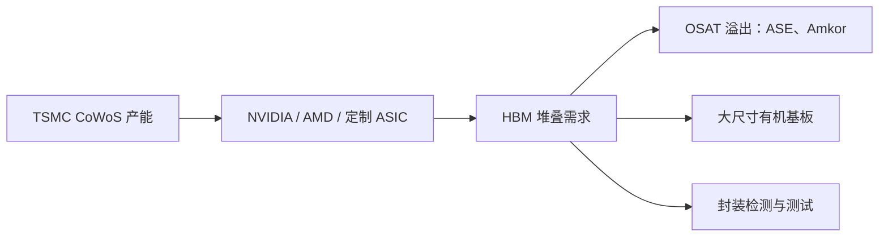

# 基板、Interposer 与 OSAT：Amkor、ASE、CoWoS、EMIB 和 AI 封装产能

> [查看英文原文](../../07-semicap-ecosystem/02-substrate-interposer-osat.md)

HBM 价值只有在其与逻辑 die 集成进可靠封装后才能兑现。先进封装栈包括 HBM、GPU/ASIC、硅 interposer 或嵌入式桥接、再布线层、ABF/有机基板、underfill、散热结构，以及 assembly/test/burn-in。它是 AI 供应链最实际的串行瓶颈之一：即使 HBM die 和 GPU 晶圆都有货，只要 CoWoS、基板、桥接、测试或可靠性认证不足，系统就无法出货。

## 封装栈与产能地图

硅 interposer 用极细间距在加速器与多个 HBM 堆栈之间布线；Intel EMIB 类嵌入式桥在有机基板中放置较小硅桥，而不是一整块 interposer；fan-out/wafer-level 封装以介质和金属层重布信号；基板提供供电、信号逃逸、机械支撑与主板接口。增加 HBM 堆栈会同时增大封装面积、interposer、基板布线、供电及散热负荷，并恶化硅/有机材料/铜/underfill/散热器之间的热膨胀失配。

| 层级 | 关键供应/模式 | 对存储的意义 |
|---|---|---|
| 晶圆厂先进封装 | TSMC CoWoS/InFO/SoIC、Intel EMIB/Foveros、Samsung I-Cube/X-Cube | 决定 HBM 能否与领先 AI 逻辑集成 |
| OSAT | ASE/SPIL、Amkor 等 | 外部 assembly/test、地域分散和专用流程 |
| 基板 | ABF/多层有机基板生态 | 逃逸布线、供电、翘曲和机械可靠性 |
| Interposer/桥 | 硅 interposer、EMIB、RDL | HBM 与逻辑间的带宽路径 |
| 检测与测试 | X-ray、量测、探针、老化、系统测试 | 将组装转化为合格发货 |

## CoWoS：标杆瓶颈

TSMC CoWoS 以硅 interposer 路径、高密度布线和成熟晶圆级控制成为高端 AI 处理器参照架构。面板级封装有更大格式和潜在成本优势，但在互连密度、overlay、缺陷、翘曲、材料处理和设备成熟度上仍须追赶；对最大 AI 处理器，短期并不会替代 CoWoS。只要 CoWoS 是高端路径，HBM 就受晶圆级封装槽位、interposer、超大基板和封装测试的共同约束。

行业若扩增先进封装，受益的不只是 foundry：TSMC 内部能力紧张时，ASE/SPIL、Amkor 等可承接 assembly、测试、fan-out、SiP 或客户专用流程。不过 OSAT 不能自动取代每个 CoWoS 环节；真正门槛是能否持续交付良率、节拍、可靠性与可追溯性。

## Amkor：美国外包封装锚点

Amkor 的亚利桑那先进封装/测试园区是美国回流故事的代表：多座厂房、大规模洁净室，首期服务苹果、NVIDIA 等，并与附近 TSMC Arizona 晶圆相衔接。它不能即时缓解当期 HBM 供应，却解决了“美国制造先进晶圆、再回亚洲封装”的结构性风险。对存储而言，Amkor 不生产 HBM die，却帮助把 HBM 转成加速器带宽；若前端在美国而封装仍在海外，风险只是从晶圆 fab 移到了后端整合。

## ASE/SPIL：OSAT 规模与 AI 溢出

ASE 是规模型 OSAT 龙头，拥有跨台湾、中国、日本、韩国、马来西亚和新加坡的制造网络及长期 2.5D 客户经验。其定位不同于 Amkor：Amkor 是美国本土化标志，ASE 则是亚洲规模平台，能在 foundry 自有封装受限时吸收溢出。AI 封装工厂本身也越来越依赖数据分析、排程、检测和测试相关性，OSAT 的竞争变得高度软件化。

HBM 封装需要 assembly、检测、热循环、burn-in 和高速测试纪律。即便 interposer 流程仍留在 foundry，OSAT 也可补充封装、测试、模块运作或客户定制能力。决定胜负的不是厂房面积，而是复杂 AI 封装下的良率、周期时间、可靠性和数据追溯。

## Intel EMIB 与替代路径

CoWoS 紧缺且昂贵，促使客户探索替代方案。EMIB 用嵌入基板的小硅桥而非整片 interposer，有望降低硅面积依赖并形成不同路由拓扑；Foveros 等 3D 方法也提供选择。替代路线存在不是因为 CoWoS 失效，而是因为其槽位紧张造成配置风险。核心判断是 EMIB/桥接/3D 方法能否在 HBM4/HBM5 级带宽、热管理、良率和客户可靠性上量产达标。

## 基板和 interposer 经济学

基板是最不显眼却最痛苦的约束。大型 AI 封装有机基板必须逃逸数千信号、低噪供大电流、控制翘曲、承受 reflow/underfill，并连接主板。HBM 从四堆增加到八堆、十二堆或更多 chiplet 布局时，层数、线宽/线距、通孔密度、材料刚度和良率都成为一阶变量。

全硅 interposer 路由密度极佳，但占用晶圆级资源并受 reticle 面积制约；桥接减少硅面积，可能牺牲拓扑或布线弹性；fan-out/RDL 可降低完整 interposer 依赖，却必须证明足够密度和良率。更大基板改善逃逸布线，但又提高翘曲、成本和板级连接风险，故封装尺寸本身是制造/可靠性前沿。

## 架构压力、检测和 KPI

更高层、更高速 HBM 迫使封装在供电完整性和热裕量下传输极宽接口。复杂 chiplet 设计甚至可能因制造执行风险而被简化；这说明 OSAT/基板约束已参与定义加速器产品，而不仅是交付环节。大客户预订绝大部分优质 2.5D 产能时，二线加速器、网络 ASIC 和初创公司只能探索 EMIB、fan-out、有机方案或较低 HBM 设计。

检测是良率门：空洞、bump 缺陷、interposer 裂纹、翘曲、underfill 和热机械应力会变成报废或潜在现场失效。HBM 会先筛 KGD，但最终加速器仍需封装/系统验证；故 X-ray、探针、handler、burn-in、失效分析也是存储供应链。

| KPI | 观察重点 |
|---|---|
| CoWoS 与 CoWoS-L/S 产能、CoPoS 时点 | 高端 HBM 集成的瓶颈程度 |
| Amkor Arizona 设备、认证及投产里程碑 | 美国后端本土化进度 |
| ASE/SPIL 先进封装营收 | OSAT 溢出是否持续 |
| Intel EMIB/Foveros 外部订单 | 替代路线从评估到量产的证据 |
| ABF 交期、层数、翘曲/良率 | 隐性基板限制 |
| X-ray/封装测试利用率 | 复杂封装的可交付性 |

核心问题不再是“谁能便宜地封装芯片”，而是“谁能按 AI 加速器发布节奏，同时整合逻辑、HBM、基板、散热、检测和测试”。

## 来源

原文的全部来源、日期及链接请见[英文原文](../../07-semicap-ecosystem/02-substrate-interposer-osat.md#sources)。
