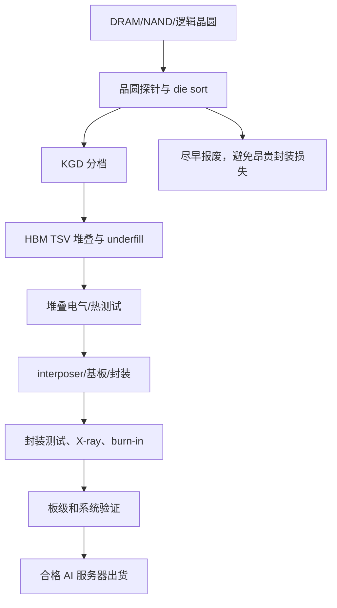

# 测试设备：Advantest、Teradyne、HBM 已知良好芯粒与 AI 封装验证

> [查看英文原文](../../07-semicap-ecosystem/03-testing-equipment.md)

测试是 AI 存储栈中最不显眼、却最具经济意义的瓶颈之一。HBM 并不以原始 DRAM 晶圆售卖，而是以通过资格认证的堆叠、集成封装和客户批准的加速器平台售卖。供应链必须在堆叠前筛 die、堆叠后测 cube、interposer/基板连接后验证封装，并在 GPU、ASIC 或 TPU 出货前进行系统可靠性筛选。随着 HBM4、12/16 层堆叠、定制 base die、类 CoWoS 封装和高容量企业 SSD 同时扩大，测试已是串行约束，而非一般后段步骤。

## 为何存储测试已不同

普通 DRAM/NAND 已需要大批量、低单件成本的测试、冗余修复、速度分档、热筛和耐久认证。HBM 改变损失函数：一颗坏 die 可能损害整堆；边缘堆可能报废带有昂贵逻辑 die 的封装；封装级漏检又可能在高价值 AI 集群中形成现场故障。集成程度越高，误判为合格的代价越大。

HBM 至少有四道测试门：晶圆探针筛选 DRAM/base die 和可修复缺陷；KGD 物流追踪 die 身份、bin、修复状态和堆叠资格；堆叠测试筛 TSV、die 间链路、热行为、保持、修复及高速接口；封装/系统测试再验证供电、温度、信号完整性、固件和工作负载。高晶圆产出不能替代任何一道门。

| 良率层级 | 对成本的影响 |
|---|---|
| die 良率 | 决定 KGD 供给和初始 bit 成本 |
| 堆叠良率 | 决定 TSV/互连/热窗口是否可用 |
| 封装良率 | 避免高价值逻辑、interposer 与 HBM 一起报废 |
| 系统良率 | 决定真实 AI 平台的可靠性与出货资格 |

## Advantest 与 Teradyne

Advantest 是核心 ATE 厂商，覆盖存储、SoC、RF 测试系统、handler、设备接口、SEM 检测及 SSD 测试。HBM 测试不是卖一台 tester 即结束，而要配合 tester、探针接口、handler、热控、DIB、诊断软件、现场支持和客户专用验证流程。HBM4 更宽接口、更高带宽和更高堆叠令通道数、信号完整性、热状态、修复诊断和特性化时间同步增加。测试器即便在晶圆扩产时仍可满载，导致 KGD、堆叠或成品等待资格认证。

Teradyne 是第二重要标杆，覆盖半导体、数据中心、光子、存储及航天国防测试，且受益于 AI 相关计算、网络和内存验证。应将它理解为更广义 AI 半导体测试曝险，而非只看 HBM：加速器还拉动计算 die、网络芯片、retimer、光组件和存储控制器的测试。两家公司在部分 tester 类别竞争，客户也会通过第二来源或平台迁移分配测试资本开支。

测试供应链也不是单一 line item。引脚电子、设备电源、参数测量单元、DIB、探针卡及热头都可能不足。HBM/AI 封装对供电、精密测量、定时、高速数字通道、热控和参数特性提出更高要求；任何子件短缺都可能延迟 ATE 产能。

## KGD、封装与系统测试经济学

KGD 纪律是 HBM 经济学核心。堆叠前，die 必须被测试、修复、分档并分配到特定 stack build；堆叠后还要通过功能、速度、热和可靠性筛选。12 层或 16 层放大了 die 缺陷概率，故及早发现边缘 die 的价值极高。定制 base die 又增加记忆阵列、TSV、PHY、修复表、热传感、RAS 与客户命令行为等测试状态，泛化标准测试不再充分。

封装测试须覆盖信号/电源完整性、温度梯度、interposer 布线、基板行为、HBM-逻辑链路、高速 SerDes 和板级连接；系统测试加入固件、工作负载、fabric、冷却、机架集成与遥测。测试策略要在早期筛选的成本、后期报废风险和发货速度间取舍。最佳做法是早期廉价筛选淘汰明显失效，只将有希望发货的产品送入昂贵高速、热及系统测试。

探针卡、socket 与 DIB 是常被忽略的插入。它们必须反复接触密集焊盘、提供干净电力、保持阻抗与信号完整性、带走热量，并有足够可观测性区分 die、stack、封装、板和固件故障。液冷加速器与验证夹具的热行为也可能不同；burn-in 暴露早期失效，却占用时间、腔体、handler、功率和厂房。

## NAND/SSD、竞争及 KPI

企业 SSD 测试同样更丰富：AI 存储需要耐久模型、固件、掉电行为、尾延迟、QoS、热节流、安全功能与控制器/NAND 配对验证。高层 3D NAND 又带来垂直 string 变异、阶梯接触、保持/read-disturb 和耐久分布问题；ECC/固件能隐藏部分缺陷，但超大规模客户仍要确信设备在持续 AI 工作负载下可用。

测试本质是把复杂度变成可销售良率所支付的税。Advantest 受益于 HBM/SoC，Teradyne 受益于更广 AI 测试，ADI 等在 tester BOM 内受益，KLA、Onto 与 X-ray/量测供应商则在检测和测试相关性重叠。风险仍是周期性：新平台爬坡时可快速扩张，平台转换放慢后也可能消化过量 tester。

| KPI | 含义 |
|---|---|
| Advantest/Teradyne 订单、交期、利用率 | 测试产能是否成为交付闸门 |
| 8→12→16 层 HBM 转换 | KGD 和堆叠测试负担 |
| OSAT/Foundry 封装测试利用率 | AI 封装最终出货上限 |
| 探针卡、DIB、热筛与 burn-in 容量 | 隐性测试瓶颈 |
| 企业 SSD 认证周期 | NAND 是否能转成合格 AI 存储 |

## 来源

原文的全部来源、日期及链接请见[英文原文](../../07-semicap-ecosystem/03-testing-equipment.md#sources)。
