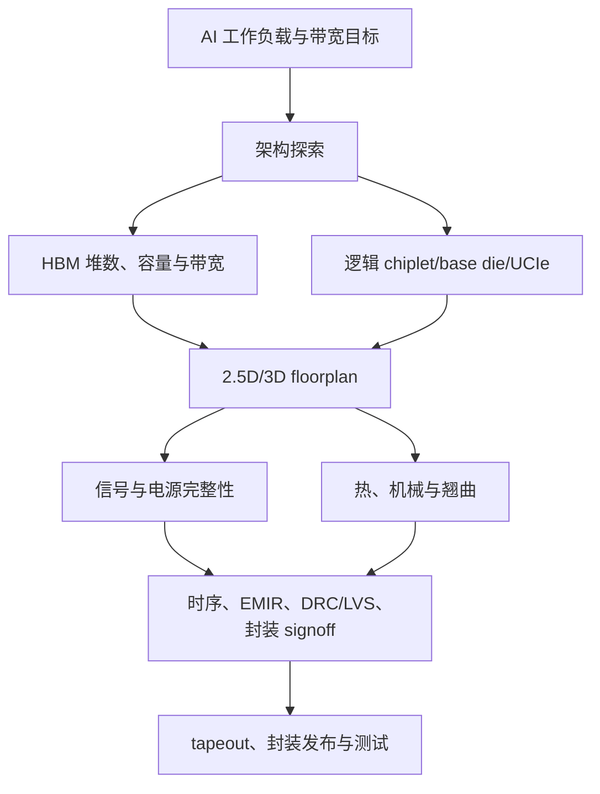

# 面向存储、HBM、Chiplet 与先进封装的 EDA 和设计工具

> [查看英文原文](../../07-semicap-ecosystem/05-eda-design-tools.md)

EDA 是把存储硬件变成可制造产品的软件层。传统内存已需要 DRAM 周边、sense amp、修复、时序、NAND 控制器、ECC、固件与模块验证；AI 存储系统还要求在流片前协同设计封装 floorplan、HBM 接口、interposer/bridge 布线、热模型、电源完整性、UCIe/SerDes、base-die 逻辑和工作负载行为。Synopsys、Cadence、Siemens EDA 是主商业栈，Ansys、Arteris、Silvaco、IP 厂商、开源工具及 hyperscaler/foundry 内部流程补足专业环节。

## EDA 为何对存储重要

HBM 的规格必须被 EDA 转化成平台。选择 6、8 或更多 HBM 堆栈时，客户须同时建模封装面积、interposer 布线、供电、时钟、控制器位置、缓存层级、热负荷和良率风险。HBM4/定制 HBM4E 厂商则须提供 PHY、控制器、base-die 行为、修复/RAS 策略、信号模型、封装规则和验证资料。资料不足，即使 DRAM die 很好，客户也难以集成或第二来源。

随着 base die 客制化，存储供应商与加速器设计者的边界模糊。EDA collateral 是二者的契约中间层：它界定什么可被仿真、验证、signoff 与测试，使供应商避免将每个客户需求都变成不可复用的一次性项目。

| 参与者 | 核心能力 | 与存储/封装的关系 |
|---|---|---|
| Synopsys | 实现、验证、signoff、IP、AI 辅助 | HBM/DDR PHY/控制器、多 die signoff |
| Cadence | 数字/模拟/定制 IC、Sigrity、仿真与 IP | 封装/PCB SI/PI、chiplet 协同设计 |
| Siemens EDA | Calibre、Tessent、Questa、Veloce、HyperLynx | 物理验证、测试/良率、封装/PCB 分析 |
| Ansys | 热、电磁、PI、机械多物理仿真 | CoWoS/EMIB 热与电源/信号完整性 |
| IP/开源工具 | NoC、互连、架构探索 | UCIe、多 die、早期 2.5D/3D 研究 |

## HBM 接口、memory compiler 与验证

HBM 同时是接口和验证问题。加速器必须部署控制器、仲裁通道、平衡流量、处理刷新、修复、ECC/RAS、遥测与热节流；带宽能否到达实际工作负载，取决于 PHY/控制器/IP 的实现。接口更宽、定制 base die 更多时，仿真、formal、emulation、固件验证和测试状态迅速增加，须涵盖低功耗、修复、热事件、错误注入、复位与 corner-case 流量。

memory compiler 和 IP collateral 也不可缺：SRAM/寄存器堆/eFuse/OTP、HBM/DDR/LPDDR/CXL 控制器、PHY、校准固件、timing/power/area/variation/DFT/BIST/reliability views 必须被其余 flow 接受。编译器若正确暴露冗余、修复、ECC、保持和电压角，可用面积换良率与功耗；若模型和硅失配，问题会在封装后才暴露。

## AI EDA、DFM 和多 die 探索

AI 辅助 EDA 可以搜索 HBM 位置、floorplan、UCIe 配置、PPA、验证脚本和违规日志，但只能加速专家工作流，不能取代物理 signoff。真正风险是看似合理的脚本/布局通过中间检查、却与封装现实不相关。DFM 将 EDA 接回 semicap：设计既要满足 die 图形规则，也要满足 interposer、基板、电源噪声、热耦合和逃逸布线规则。Calibre 类物理验证、寄生提取、EMIR、PI、热仿真与 package DRC 是存储产能的一部分；更好工具只有在与硅、封装测试和现场数据相关时，才能安全释放 guardband。

2.5D/3D 架构不能等到物理设计阶段才决定。全硅 interposer + HBM、EMIB bridge + HBM、UCIe on-package memory、fan-out/有机路线会在带宽密度、延迟、功耗、成本、散热、良率和测试上不同。早期工具应生成可信的 RTL、Liberty、LEF 与封装约束，帮助架构在投入数十亿晶圆、HBM 与封装产能前比较方案。

## 热/功率/机械协同、UCIe 和中国 EDA

HBM 平台的热 EDA 影响堆数、位置、功率封顶、控制器策略、冷却与可靠性余量。封装可能电气可布线却热上不可用，或平均温度合格却有局部热点损害 HBM 保持和 base-die 时序。因此 signoff 需将电、热、机械与工作负载耦合。UCIe 又扩展内存选择：HBM、定制 HBM、on-package LPDDR、UCIe memory chiplet、CXL 和 flash 分层都要各自的模型、控制器、PHY、时序、封装规则和软件 hooks；EDA/IP 成为决定取舍的平台。

EDA 也是地缘政治议题。中国可开发 3D/封装设计原型和开源/AI flow，但商用 signoff 需要多年 foundry PDK、物理验证、DFM、工具整合、客户支持和硅相关性。对 CXMT、YMTC 及本土 AI 芯片商而言，本地 EDA 既是战略目标，也是先进产品的长期瓶颈。

| KPI | 含义 |
|---|---|
| HBM4/HBM4E PHY/控制器 IP 与定制 base-die 支持 | 新接口商业化速度 |
| 多 die signoff 与 die-interposer-substrate-board 协同公告 | 复杂封装可设计性 |
| CoWoS/EMIB/Foveros 热/PI 工具采用 | 包装现实是否被早期纳入 |
| UCIe memory 从论文到路线图 | 替代内存接口的成熟度 |
| 中国先进节点/封装 signoff 进展 | 本地生态的真正能力 |

EDA 的核心风险是相关性；核心机会则是减少过度设计、缩短封装迭代、释放性能，并在制造承诺之前选择合适的内存层级。

## 来源

原文的全部来源、日期及链接请见[英文原文](../../07-semicap-ecosystem/05-eda-design-tools.md#sources)。
